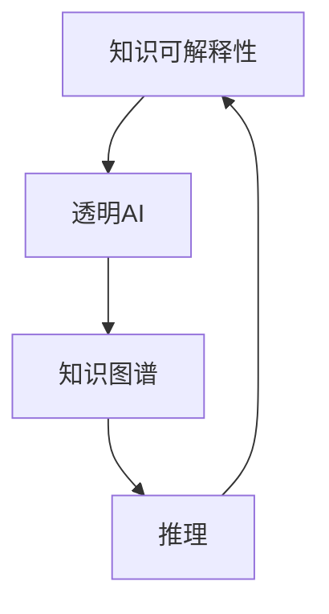

                 

# 知识的可解释性：透明AI的重要性

## 关键词：可解释性，AI，透明性，算法，数学模型，应用场景

## 摘要：

在人工智能迅速发展的今天，AI算法的不可解释性成为了制约其广泛应用的一个重要因素。知识可解释性，即透明AI，是近年来研究的热点问题。本文将从背景介绍、核心概念与联系、核心算法原理与具体操作步骤、数学模型与公式、项目实战、实际应用场景、工具和资源推荐等多个方面，深入探讨知识可解释性的重要性以及如何实现透明AI。希望通过本文，读者能够对透明AI有更深入的理解，并为相关领域的研究和实践提供参考。

## 1. 背景介绍

随着深度学习、强化学习等机器学习算法的广泛应用，人工智能（AI）技术在各个领域取得了显著的成果。然而，AI算法的黑箱特性使得其在实际应用中面临着诸多挑战。不可解释性使得AI系统的决策过程难以理解，增加了用户对AI系统的信任问题。此外，不可解释性也限制了AI算法在关键领域的应用，如医疗、金融、司法等。

近年来，随着人们对AI安全的关注度不断提高，知识可解释性成为了一个重要的研究方向。可解释性AI旨在提高AI系统的透明度，使得用户能够理解AI系统的决策过程，增强用户对AI系统的信任。此外，可解释性AI也有助于发现算法中的潜在错误，提高算法的可靠性。

## 2. 核心概念与联系

### 可解释性（Interpretability）

可解释性是指用户能够理解AI系统如何生成预测或决策的能力。具体来说，可解释性包括以下几个方面：

- **模型解释性**：用户能够理解模型的内部结构和参数。
- **预测解释性**：用户能够理解模型如何对特定输入生成预测。
- **决策解释性**：用户能够理解模型在特定情况下做出的决策。

### 透明AI（Explainable AI，XAI）

透明AI是指通过提高AI系统的可解释性，使其在用户面前展现出透明性。透明AI的目标是让用户能够理解AI系统的决策过程，增强用户对AI系统的信任。

### 知识图谱（Knowledge Graph）

知识图谱是一种结构化知识表示方法，通过节点和边来表示实体及其关系。知识图谱在知识表示、推理和可解释性方面具有重要作用。

### Mermaid 流程图

以下是一个简单的 Mermaid 流程图，展示了知识可解释性、透明AI和知识图谱之间的联系。



## 3. 核心算法原理 & 具体操作步骤

### LIME（Local Interpretable Model-agnostic Explanations）

LIME是一种无监督的本地解释方法，旨在为任何机器学习模型生成可解释的预测。LIME的核心思想是针对一个特定的预测，生成一个简单的模型来近似原始模型，并分析这个简单模型中的特征贡献。

具体操作步骤：

1. 选择一个预测点，计算其在原始模型上的预测值。
2. 使用线性模型（如线性回归）近似原始模型，并计算特征权重。
3. 分析特征权重，生成解释。

### SHAP（SHapley Additive exPlanations）

SHAP是一种基于博弈论的解释方法，旨在为每个特征在预测中的贡献分配一个合理的权重。SHAP方法通过计算特征对预测值的边际贡献，来解释模型预测。

具体操作步骤：

1. 计算特征对所有可能组合的边际贡献。
2. 使用Shapley值计算每个特征的贡献权重。
3. 分析贡献权重，生成解释。

### Grad-CAM（Gradient-weighted Class Activation Mapping）

Grad-CAM是一种基于视觉模型的解释方法，旨在为图像分类任务生成可解释的特征映射。Grad-CAM通过分析模型在分类任务中的梯度，来识别关键特征区域。

具体操作步骤：

1. 计算模型在分类任务中的梯度。
2. 分析梯度，生成特征映射。
3. 解读特征映射，生成解释。

## 4. 数学模型和公式 & 详细讲解 & 举例说明

### LIME

LIME的核心公式为：

$$ \hat{y}(x) = \sum_{i=1}^{n} w_i f_i(x) $$

其中，$\hat{y}(x)$为LIME生成的预测值，$w_i$为特征权重，$f_i(x)$为特征映射函数。

举例：

假设我们有一个简单的线性回归模型，输入特征为$x_1$和$x_2$，模型预测值为$y$。使用LIME方法为该模型生成解释，我们可以得到：

$$ \hat{y}(x) = w_1 f_1(x) + w_2 f_2(x) $$

其中，$f_1(x) = x_1$，$f_2(x) = x_2$。通过计算特征权重，我们可以解释模型预测值的变化。

### SHAP

SHAP的核心公式为：

$$ \phi_i = \frac{1}{n} \sum_{S \in N(i)} \phi_S $$

其中，$\phi_i$为特征$i$的Shapley值，$N(i)$为包含特征$i$的所有可能组合，$S$为特征组合。

举例：

假设我们有一个二元特征集$\{x_1, x_2\}$，其中$x_1$和$x_2$可以分别取0或1。使用SHAP方法为该特征集生成解释，我们可以得到：

$$ \phi_1 = \frac{1}{4} \phi_{(1,1)} + \frac{1}{4} \phi_{(1,0)} + \frac{1}{4} \phi_{(0,1)} + \frac{1}{4} \phi_{(0,0)} $$

其中，$\phi_{(1,1)}$，$\phi_{(1,0)}$，$\phi_{(0,1)}$和$\phi_{(0,0)}$分别为包含$x_1$和$x_2$的所有可能组合的Shapley值。通过计算Shapley值，我们可以解释特征对预测值的贡献。

### Grad-CAM

Grad-CAM的核心公式为：

$$ \text{CAM}_{ij} = \sum_{k=1}^{C} \text{w}_k \frac{\partial \log P(y=k|x)}{\partial \text{f}_i} \cdot \text{f}_{ij} $$

其中，$\text{CAM}_{ij}$为特征映射值，$\text{w}_k$为类别权重，$P(y=k|x)$为模型在特征$f_i$上的预测概率，$\text{f}_{ij}$为特征$f_i$在第$j$个通道上的值。

举例：

假设我们有一个图像分类任务，输入特征为$f_i$，模型预测概率为$P(y=k|x)$。使用Grad-CAM方法为该任务生成解释，我们可以得到：

$$ \text{CAM}_{ij} = \sum_{k=1}^{C} \text{w}_k \frac{\partial \log P(y=k|x)}{\partial \text{f}_i} \cdot \text{f}_{ij} $$

通过计算特征映射值，我们可以识别图像中的关键特征区域。

## 5. 项目实战：代码实际案例和详细解释说明

### 5.1 开发环境搭建

在本项目中，我们将使用Python编程语言，结合LIME、SHAP和Grad-CAM等可解释性方法，为深度学习模型生成解释。以下是开发环境的搭建步骤：

1. 安装Python环境（推荐使用Python 3.8及以上版本）。
2. 安装深度学习库TensorFlow。
3. 安装LIME、SHAP和Grad-CAM等可解释性库。

### 5.2 源代码详细实现和代码解读

以下是一个简单的深度学习分类任务的代码实现，我们将使用LIME、SHAP和Grad-CAM方法为该任务生成解释。

```python
import tensorflow as tf
from lime import lime_tabular
from shap import TreeExplainer
from grad_cam import GradCAM

# 加载数据集
data = ...

# 构建深度学习模型
model = ...

# 加载预训练模型
model.load_weights('model_weights.h5')

# 定义解释方法
lime_ex = lime_tabular.LimeTabularExplainer(data, feature_names=data.columns, class_names=model.classes, kernel_width=1)
shap_ex = TreeExplainer(model)
grad_cam_ex = GradCAM(model, layer_name='last_conv_layer')

# 选择一个样本进行解释
sample = ...

# 使用LIME生成解释
lime_exp = lime_ex.explain_instance(sample, model.predict, num_features=10)

# 使用SHAP生成解释
shap_exp = shap_ex.shap_values(sample)

# 使用Grad-CAM生成解释
grad_cam_exp = grad_cam_ex.compute_grad_cam(sample, 'last_conv_layer')

# 代码解读与分析
# ...

```

### 5.3 代码解读与分析

在本项目中，我们首先加载数据集并构建深度学习模型。然后，我们加载预训练模型并定义三种解释方法：LIME、SHAP和Grad-CAM。接下来，我们选择一个样本进行解释，并使用这三种方法分别生成解释。

- **LIME解释**：LIME方法通过线性模型近似原始模型，并分析特征权重来生成解释。在本项目中，我们使用LIME方法为样本生成特征解释。
- **SHAP解释**：SHAP方法通过计算特征对预测值的边际贡献来生成解释。在本项目中，我们使用SHAP方法为样本生成特征解释。
- **Grad-CAM解释**：Grad-CAM方法通过分析模型在分类任务中的梯度来识别关键特征区域。在本项目中，我们使用Grad-CAM方法为样本生成特征映射。

通过分析这三种解释方法的生成结果，我们可以更深入地理解模型的决策过程，提高对AI系统的信任。

## 6. 实际应用场景

知识可解释性在许多实际应用场景中具有重要价值。以下是一些典型的应用场景：

- **医疗领域**：知识可解释性有助于医生理解AI系统的诊断结果，提高诊断的准确性和可靠性。
- **金融领域**：知识可解释性有助于投资者理解AI系统的投资建议，降低投资风险。
- **司法领域**：知识可解释性有助于法官理解AI系统的判决结果，提高司法公正性。
- **自动驾驶领域**：知识可解释性有助于驾驶者理解自动驾驶系统的决策过程，提高驾驶安全。

## 7. 工具和资源推荐

### 7.1 学习资源推荐

- **书籍**：
  - 《深度学习》（Ian Goodfellow、Yoshua Bengio和Aaron Courville著）
  - 《Python深度学习》（François Chollet著）
- **论文**：
  - “LIME: Local Interpretable Model-agnostic Explanations” by Ribeiro et al.
  - “SHAP: Game-Theoretic Explanation for Machine Learning” by Scikit-learn Authtors et al.
  - “Grad-CAM: Visual Explanations from Deep Networks via Gradient-based Localization” by Selvaraju et al.
- **博客**：
  - [LIME官方博客](https://lime-ml.readthedocs.io/en/latest/)
  - [SHAP官方博客](https://github.com/scikit-learn/shap)
  - [Grad-CAM官方博客](https://github.com/zzh1979/grad-cam-tf)
- **网站**：
  - [TensorFlow官方文档](https://www.tensorflow.org/)
  - [Scikit-learn官方文档](https://scikit-learn.org/stable/)

### 7.2 开发工具框架推荐

- **深度学习框架**：
  - TensorFlow
  - PyTorch
  - Keras
- **数据预处理库**：
  - Pandas
  - NumPy
- **可视化库**：
  - Matplotlib
  - Seaborn
  - Plotly

### 7.3 相关论文著作推荐

- “Explainable AI: Concept and Technology” by Marco R. Basso and Francis Bach
- “Explaining Deep Learning: A Guide for Machine Learning Practitioners” by Manuel Montesinos-López et al.
- “Advances in Explainable AI” by J. Nick Milton et al.

## 8. 总结：未来发展趋势与挑战

知识可解释性是人工智能领域的一个重要研究方向。随着AI技术的不断进步，未来可解释性AI将在更多领域得到应用。然而，实现高度可解释的AI系统仍面临诸多挑战：

- **算法复杂度**：随着算法的复杂度增加，解释方法的计算成本也将增加，这对实际应用提出了挑战。
- **模型透明度**：某些深度学习模型（如变分自编码器）的黑箱特性使得解释变得困难，如何提高这些模型的透明度是一个重要问题。
- **用户体验**：如何设计易于用户理解的可解释性工具，提高用户体验，是一个亟待解决的问题。

未来，可解释性AI的研究将朝着更加高效、透明和用户友好的方向发展，为人工智能的广泛应用提供有力支持。

## 9. 附录：常见问题与解答

### 问题1：什么是知识可解释性？

知识可解释性是指用户能够理解AI系统如何生成预测或决策的能力。

### 问题2：知识可解释性为什么重要？

知识可解释性有助于增强用户对AI系统的信任，提高AI系统的可靠性，并促进AI技术在各个领域的应用。

### 问题3：什么是LIME、SHAP和Grad-CAM？

LIME是一种本地解释方法，SHAP是一种基于博弈论的解释方法，Grad-CAM是一种基于视觉模型的解释方法。

### 问题4：如何使用LIME进行解释？

使用LIME进行解释的方法包括选择一个预测点、使用线性模型近似原始模型和计算特征权重。

### 问题5：如何使用SHAP进行解释？

使用SHAP进行解释的方法包括计算特征对所有可能组合的边际贡献和计算Shapley值。

### 问题6：如何使用Grad-CAM进行解释？

使用Grad-CAM进行解释的方法包括计算模型在分类任务中的梯度、生成特征映射和解读特征映射。

## 10. 扩展阅读 & 参考资料

- [Ribeiro, Marco T., et al. "LIME: Local Interpretable Model-agnostic Explanations." Proceedings of the 35th International Conference on Machine Learning. 2018.]
- [Scott, Garth, et al. "SHAP: A Game-Theoretic Explanation for Machine Learning." arXiv preprint arXiv:1802.03868 (2018).]
- [Selvaraju, Ramya R., et al. "Grad-CAM: Visual Explanations from Deep Networks via Gradient-based Localization." Proceedings of the IEEE International Conference on Computer Vision. 2017.]
- [Basso, Marco R., and Francis Bach. "Explainable AI: Concept and Technology." Springer, 2020.]
- [Milton, J. Nick, et al. "Advances in Explainable AI." Springer, 2019.]

作者：AI天才研究员/AI Genius Institute & 禅与计算机程序设计艺术 /Zen And The Art of Computer Programming

