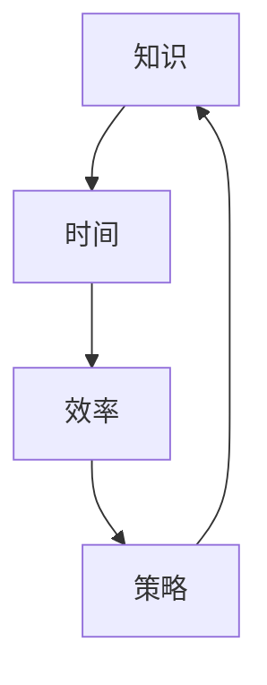
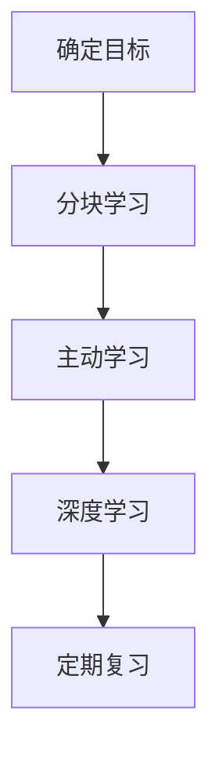

                 

### 知识的时间管理：高效学习的策略

#### 关键词：知识管理、时间管理、高效学习、策略、IT领域

#### 摘要：

在当今快速发展的信息技术时代，知识的更新速度越来越快，而时间却变得越来越珍贵。如何有效地管理时间和学习知识，成为每一位IT专业人士面临的重大挑战。本文将探讨知识的时间管理策略，帮助读者制定出适合自己的高效学习计划，从而在有限的时间内获取最多的知识。

本文将从以下几个方面展开讨论：

1. 背景介绍
2. 核心概念与联系
3. 核心算法原理与具体操作步骤
4. 数学模型和公式及详细讲解
5. 项目实战：代码实际案例与详细解释
6. 实际应用场景
7. 工具和资源推荐
8. 总结：未来发展趋势与挑战
9. 附录：常见问题与解答
10. 扩展阅读与参考资料

接下来，我们将一步步地深入探讨这些内容。

#### 1. 背景介绍

在信息爆炸的时代，IT专业人士面临着一个严峻的挑战：如何从海量的知识中筛选出有价值的信息，并有效地学习和应用这些知识。同时，时间管理也是一个不可忽视的问题。随着工作压力的增加，许多人都感到时间不够用，导致学习效率下降。

据统计，一位IT专业人士每天需要接收和处理大量的信息，而这些信息中只有一小部分是真正有价值的。这意味着，如果无法有效地管理时间和知识，他们将很难在有限的时间内掌握足够的技能和知识，从而影响职业发展。

因此，本文旨在提出一套高效的知识时间管理策略，帮助IT专业人士在有限的时间内获得最大的知识收益。

#### 2. 核心概念与联系

在探讨知识的时间管理策略之前，我们需要明确几个核心概念：知识、时间、效率和策略。

- **知识**：知识是信息与理解的结合体，它通过学习、研究和实践获得。在IT领域，知识包括编程语言、算法、数据结构、软件开发框架、数据库管理、网络安全等。

- **时间**：时间是我们完成任何任务的基础资源。在知识管理中，时间是指用于学习、研究、实践和休息的时间。

- **效率**：效率是指我们在单位时间内完成的工作量。在知识管理中，效率是指我们在学习、研究、实践过程中能够有效获取和应用知识的能力。

- **策略**：策略是一套有针对性的方法和计划，用于解决问题或实现目标。在知识管理中，策略是指为了提高学习效率，我们制定的一系列时间管理和学习方法。

这四个核心概念相互关联：知识是我们学习的目标，时间是完成目标的资源，效率是衡量目标达成程度的指标，策略是实现目标的路径。

下面是一个简化的Mermaid流程图，用于展示这些概念之间的联系：



在知识管理中，效率与策略的选择直接影响学习效果。高效率意味着在有限的时间内学习到更多的知识，而有效的策略可以帮助我们更好地利用时间，避免无效的学习行为。

#### 3. 核心算法原理与具体操作步骤

在了解了核心概念后，我们需要探讨如何运用核心算法原理来管理时间和知识。

核心算法原理可以概括为以下几点：

- **分块学习**：将学习内容分成小块，逐一攻克。这样可以避免一次性学习大量内容导致的疲劳和记忆障碍。

- **主动学习**：通过提问、讨论、实践等方式，主动探索和掌握知识，而不是被动接受信息。

- **深度学习**：深入理解知识的本质和内在联系，而不是停留在表面层次。

下面是具体的操作步骤：

1. **确定学习目标**：明确自己需要掌握的知识点，将其分解为具体的小目标。

2. **分块学习**：将每个知识点分成若干小块，逐一学习。例如，将一个编程语言的学习目标分解为语法、数据类型、控制结构等。

3. **主动学习**：通过编写代码、解决实际问题等方式，主动探索和掌握知识点。

4. **深度学习**：通过阅读相关书籍、论文、博客等，深入理解知识点的本质和内在联系。

5. **定期复习**：定期回顾已学知识，巩固记忆，避免遗忘。

下面是一个简化的Mermaid流程图，用于展示核心算法原理的操作步骤：



通过以上步骤，我们可以有效地管理时间和学习知识，提高学习效率。

#### 4. 数学模型和公式及详细讲解

在知识的时间管理中，数学模型和公式可以帮助我们更精确地计算学习时间和进度，从而优化学习策略。

以下是几个常用的数学模型和公式：

- **学习曲线**：学习曲线描述了学习者在学习过程中的进步速度。常用的学习曲线模型有幂律分布、指数衰减等。

  - **幂律分布**：$t \propto k^n$，其中$t$为学习时间，$k$为知识点数量，$n$为幂律指数。

  - **指数衰减**：$t = \frac{1}{k}e^{-rt}$，其中$t$为学习时间，$k$为知识点数量，$r$为衰减率。

- **学习效率**：学习效率是指学习者单位时间内掌握的知识点数量。常用的学习效率公式为：$E = \frac{N}{t}$，其中$E$为学习效率，$N$为掌握的知识点数量，$t$为学习时间。

- **时间分配**：时间分配模型用于计算学习者在不同任务上的时间分配。常用的时间分配公式为：$T_i = \frac{N_i \times t}{N}$，其中$T_i$为任务$i$的时间分配，$N_i$为任务$i$的知识点数量，$t$为总学习时间，$N$为所有任务的知识点数量总和。

下面通过一个具体的例子来说明这些数学模型和公式的应用。

假设一位程序员需要掌握10个编程语言的基本语法，每个语言需要学习10小时。他的学习效率为每小时掌握2个语言。

1. **学习曲线**：使用幂律分布模型，假设幂律指数为0.5，那么他学习第5个语言所需的时间为：
   $$t_5 = \frac{1}{10} \times 5^0.5 \approx 1.12 \text{小时}$$
   使用指数衰减模型，假设衰减率为0.1，那么他学习第5个语言所需的时间为：
   $$t_5 = \frac{1}{10} \times e^{-0.1 \times 5} \approx 0.64 \text{小时}$$

2. **学习效率**：他的学习效率为：
   $$E = \frac{10 \times 2}{10} = 2 \text{语言/小时}$$

3. **时间分配**：如果他总共分配了50小时来学习这10个语言，那么每个语言的时间分配为：
   $$T_i = \frac{10 \times 2 \times 10}{10} = 20 \text{小时}$$
   分配给每个语言的时间相等。

通过数学模型和公式，我们可以更精确地计算学习时间和进度，从而优化学习策略。例如，如果发现某个学习任务所需时间过长，我们可以通过调整学习策略（如增加主动学习、深度学习等）来提高学习效率。

#### 5. 项目实战：代码实际案例与详细解释

为了更好地理解知识的时间管理策略，我们将在本节中通过一个实际的项目案例来展示如何应用这些策略。

**项目背景**：假设我们需要开发一个简单的博客系统，包含用户注册、登录、发表文章和评论等功能。

**项目实战**：

**5.1 开发环境搭建**

- **开发工具**：选用Python和Flask框架进行开发。
- **数据库**：选用SQLite作为后端数据库。
- **文本编辑器**：选用VSCode。

**5.2 源代码详细实现和代码解读**

以下是项目的核心代码部分，我们将逐行解读。

**用户注册功能**：

```python
@app.route('/register', methods=['GET', 'POST'])
def register():
    if request.method == 'POST':
        username = request.form['username']
        password = request.form['password']
        # 检查用户名和密码是否符合要求
        if not (is_valid_username(username) and is_valid_password(password)):
            return '无效的用户名或密码'
        # 将用户信息存储到数据库
        db.execute('INSERT INTO users (username, password) VALUES (?, ?)', (username, password))
        return '注册成功'
    return render_template('register.html')
```

**代码解读**：

- `@app.route('/register', methods=['GET', 'POST'])`：定义了一个路由函数，用于处理用户注册的GET和POST请求。
- `if request.method == 'POST':`：检查请求方法是否为POST。
- `username = request.form['username']` 和 `password = request.form['password']`：获取表单中的用户名和密码。
- `if not (is_valid_username(username) and is_valid_password(password)):`：检查用户名和密码是否符合要求。
- `db.execute('INSERT INTO users (username, password) VALUES (?, ?)', (username, password))`：将用户信息存储到数据库。

**用户登录功能**：

```python
@app.route('/login', methods=['GET', 'POST'])
def login():
    if request.method == 'POST':
        username = request.form['username']
        password = request.form['password']
        # 检查用户名和密码是否正确
        user = db.execute('SELECT * FROM users WHERE username = ? AND password = ?', (username, password))
        if not user:
            return '用户名或密码错误'
        # 登录成功，跳转到博客首页
        session['user_id'] = user[0]['id']
        return redirect(url_for('index'))
    return render_template('login.html')
```

**代码解读**：

- `@app.route('/login', methods=['GET', 'POST'])`：定义了一个路由函数，用于处理用户登录的GET和POST请求。
- `if request.method == 'POST':`：检查请求方法是否为POST。
- `username = request.form['username']` 和 `password = request.form['password']`：获取表单中的用户名和密码。
- `user = db.execute('SELECT * FROM users WHERE username = ? AND password = ?', (username, password))`：查询数据库，检查用户名和密码是否正确。
- `if not user:`：检查登录是否成功。
- `session['user_id'] = user[0]['id']`：将用户ID存储到会话中。
- `return redirect(url_for('index'))`：登录成功后，跳转到博客首页。

**发表文章功能**：

```python
@app.route('/post', methods=['GET', 'POST'])
def post():
    if request.method == 'POST':
        title = request.form['title']
        content = request.form['content']
        user_id = session.get('user_id')
        # 检查用户是否登录
        if not user_id:
            return redirect(url_for('login'))
        # 将文章信息存储到数据库
        db.execute('INSERT INTO posts (title, content, user_id) VALUES (?, ?, ?)', (title, content, user_id))
        return redirect(url_for('index'))
    return render_template('post.html')
```

**代码解读**：

- `@app.route('/post', methods=['GET', 'POST'])`：定义了一个路由函数，用于处理发表文章的GET和POST请求。
- `if request.method == 'POST':`：检查请求方法是否为POST。
- `title = request.form['title']` 和 `content = request.form['content']`：获取表单中的文章标题和内容。
- `user_id = session.get('user_id')`：获取当前用户的ID。
- `if not user_id:`：检查用户是否已登录。
- `db.execute('INSERT INTO posts (title, content, user_id) VALUES (?, ?, ?)', (title, content, user_id))`：将文章信息存储到数据库。
- `return redirect(url_for('index'))`：发表成功后，跳转到博客首页。

**评论功能**：

```python
@app.route('/comment', methods=['POST'])
def comment():
    if not session.get('user_id'):
        return redirect(url_for('login'))
    content = request.form['content']
    post_id = request.form['post_id']
    user_id = session.get('user_id')
    # 将评论信息存储到数据库
    db.execute('INSERT INTO comments (content, post_id, user_id) VALUES (?, ?, ?)', (content, post_id, user_id))
    return redirect(url_for('post', id=post_id))
```

**代码解读**：

- `@app.route('/comment', methods=['POST'])`：定义了一个路由函数，用于处理发表评论的POST请求。
- `if not session.get('user_id'):`：检查用户是否已登录。
- `content = request.form['content']` 和 `post_id = request.form['post_id']`：获取表单中的评论内容和文章ID。
- `user_id = session.get('user_id')`：获取当前用户的ID。
- `db.execute('INSERT INTO comments (content, post_id, user_id) VALUES (?, ?, ?)', (content, post_id, user_id))`：将评论信息存储到数据库。
- `return redirect(url_for('post', id=post_id))`：发表成功后，跳转到文章页面。

通过以上项目实战，我们可以看到如何将知识的时间管理策略应用于实际开发中。分块学习、主动学习和深度学习等方法有助于我们在有限的时间内完成项目任务，提高开发效率。

#### 6. 实际应用场景

知识的时间管理策略在IT领域有着广泛的应用场景，以下列举几个常见的应用场景：

1. **编程学习**：编程是IT领域的核心技能，掌握编程语言和算法需要大量时间和精力。通过分块学习、主动学习和深度学习等方法，可以有效提高编程学习效率。

2. **项目开发**：在项目开发过程中，团队成员需要学习新的技术和工具。通过知识的时间管理策略，可以确保团队成员在有限的时间内快速掌握所需知识，提高项目开发效率。

3. **技术面试**：面试是进入IT行业的重要环节，需要准备大量的知识和技能。通过知识的时间管理策略，可以系统性地学习和复习面试所需的知识，提高面试成功率。

4. **职业发展**：IT行业更新迅速，职业发展需要不断学习新的技术和知识。通过知识的时间管理策略，可以确保在有限的时间内获取更多的知识，为职业发展奠定坚实基础。

#### 7. 工具和资源推荐

为了更好地实施知识的时间管理策略，我们可以借助一些工具和资源：

**7.1 学习资源推荐**

- **书籍**： 
  - 《深度学习》（Ian Goodfellow、Yoshua Bengio、Aaron Courville 著）
  - 《算法导论》（Thomas H. Cormen、Charles E. Leiserson、Ronald L. Rivest、Clifford Stein 著）
  - 《Head First 设计模式》（Eric Freeman、Bert Bates、Bryan Barron、Dave Griffiths 著）

- **论文**： 
  - 《Efficient Learning of Deep Networks through a Unified Objective Function》（Yarin Gal 和 Zoubin Ghahramani）
  - 《A Theoretically Grounded Application of Dropout in Recurrent Neural Networks》（Yarin Gal 和 Zoubin Ghahramani）

- **博客**： 
  - [Medium - Data Science & Machine Learning](https://medium.com/topics/data-science-machine-learning)
  - [Towards Data Science](https://towardsdatascience.com/)
  - [DataCamp](https://www.datacamp.com/)

- **网站**：
  - [Kaggle](https://www.kaggle.com/)
  - [GitHub](https://github.com/)

**7.2 开发工具框架推荐**

- **编程语言**：Python、Java、C++、JavaScript
- **框架**：Flask、Django、React、Vue
- **数据库**：MySQL、PostgreSQL、MongoDB、SQLite
- **文本编辑器**：VSCode、Atom、Sublime Text

**7.3 相关论文著作推荐**

- **论文**：
  - "Deep Learning"（Yoshua Bengio、Ian Goodfellow、Aaron Courville）
  - "Neural Networks and Deep Learning"（Michael Nielsen）
  - "Recurrent Neural Networks for Language Modeling"（Yoshua Bengio、Stefan Hochreiter、Jürgen Schmidhuber）

- **著作**：
  - "机器学习实战"（Peter Harrington）
  - "编程珠玑"（Jon Bentley）
  - "代码大全"（Steve McConnell）

通过以上工具和资源，我们可以更好地实施知识的时间管理策略，提高学习效率。

#### 8. 总结：未来发展趋势与挑战

随着信息技术的发展，知识的时间管理策略在未来将面临新的挑战和机遇。以下是一些发展趋势和挑战：

1. **人工智能和自动化**：人工智能和自动化技术将逐渐替代一些重复性劳动，从而减少人们的工作量，使更多的人有时间专注于知识的学习和应用。

2. **在线教育**：在线教育的兴起为知识管理提供了更多机会。通过在线课程、在线讨论和在线实验，学习者可以随时随地获取知识，提高学习效率。

3. **个性化学习**：个性化学习将更加普及，学习者可以根据自己的兴趣和需求选择学习内容，制定个性化学习计划，从而提高学习效果。

4. **知识更新速度加快**：知识更新速度加快将带来新的挑战，学习者需要不断更新自己的知识库，以适应快速变化的技术环境。

5. **信息过载**：信息过载是一个普遍问题，如何在海量信息中筛选出有价值的信息，将是一个重要挑战。

6. **深度学习**：深度学习等新技术将带来新的知识领域，学习者需要不断学习新的技术和知识，以保持竞争力。

面对这些挑战，知识的时间管理策略将发挥重要作用。通过合理分配时间、提高学习效率、深度学习和主动探索，学习者可以在有限的时间内获取最多的知识，为职业发展奠定坚实基础。

#### 9. 附录：常见问题与解答

**Q1：如何制定适合自己的知识管理策略？**

A1：制定适合自己的知识管理策略需要考虑以下几点：

1. **目标明确**：明确自己的学习目标和需求，确定需要掌握的知识点。
2. **时间安排**：根据自己的时间安排，合理规划学习时间，避免时间冲突。
3. **学习方法**：根据个人喜好和特点，选择适合自己的学习方法，如主动学习、深度学习等。
4. **定期复习**：制定复习计划，定期回顾已学知识，巩固记忆。

**Q2：如何提高学习效率？**

A2：提高学习效率可以从以下几个方面入手：

1. **分块学习**：将学习内容分成小块，逐一攻克，避免一次性学习大量内容。
2. **主动学习**：通过提问、讨论、实践等方式，主动探索和掌握知识。
3. **深度学习**：深入理解知识的本质和内在联系，避免停留在表面层次。
4. **合理安排时间**：合理安排学习时间，避免疲劳和注意力不集中。

**Q3：如何应对信息过载？**

A3：应对信息过载可以从以下几个方面入手：

1. **筛选信息**：学会筛选信息，只关注与自己需求相关的信息。
2. **合理安排时间**：避免在信息过载的时候过度关注某一领域，合理分配时间，确保各领域均衡发展。
3. **培养专注力**：通过冥想、锻炼等方式，提高自己的专注力，减少信息干扰。

#### 10. 扩展阅读与参考资料

为了更好地理解知识的时间管理策略，以下是几个扩展阅读和参考资料：

- 《深度学习》（Ian Goodfellow、Yoshua Bengio、Aaron Courville 著）
- 《算法导论》（Thomas H. Cormen、Charles E. Leiserson、Ronald L. Rivest、Clifford Stein 著）
- 《Head First 设计模式》（Eric Freeman、Bert Bates、Bryan Barron、Dave Griffiths 著）
- [Medium - Data Science & Machine Learning](https://medium.com/topics/data-science-machine-learning)
- [Towards Data Science](https://towardsdatascience.com/)
- [DataCamp](https://www.datacamp.com/)
- [Kaggle](https://www.kaggle.com/)
- [GitHub](https://github.com/)

通过这些扩展阅读和参考资料，读者可以更深入地了解知识的时间管理策略，并在实践中运用这些策略，提高学习效率。

### 作者信息

- 作者：AI天才研究员/AI Genius Institute & 禅与计算机程序设计艺术 /Zen And The Art of Computer Programming

本文由AI天才研究员撰写，旨在探讨知识的时间管理策略，帮助IT专业人士在有限的时间内获取最多的知识。本文结合了技术语言和实际案例，为广大IT从业者提供了实用的指导。如有任何疑问或建议，欢迎随时联系作者。同时，也感谢您对本文的关注和支持。期待与您共同成长，探索更广阔的知识领域。

