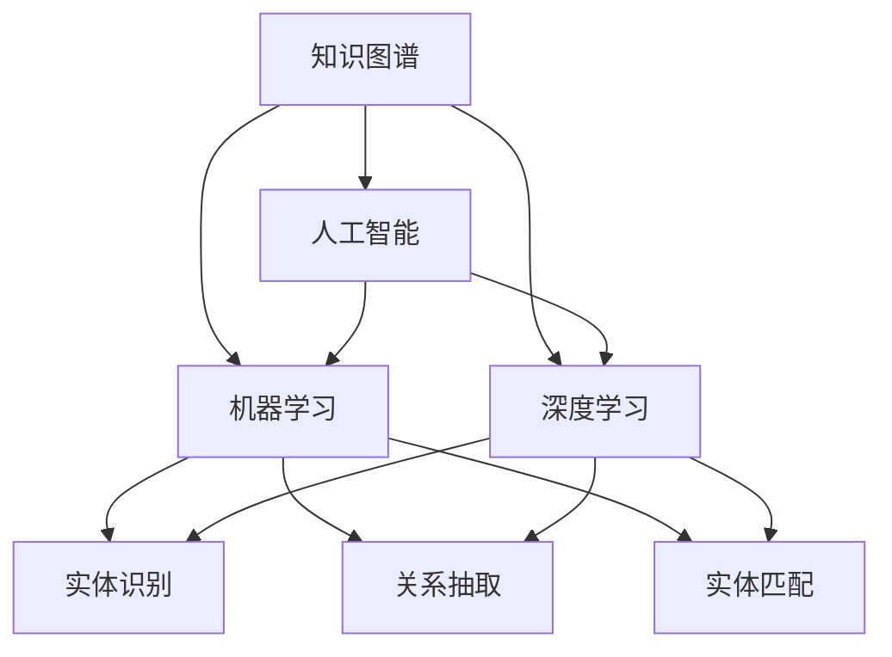

                 

# 知识的未来学：预见与塑造明天

> **关键词**：知识图谱、人工智能、机器学习、深度学习、区块链、云计算、边缘计算、物联网、量子计算

> **摘要**：本文将探讨知识图谱技术在人工智能领域的应用，以及机器学习、深度学习等技术的发展趋势。通过分析这些技术的核心概念、原理和应用场景，旨在为读者提供对知识未来发展的深入理解，并探讨如何塑造明天的技术世界。

## 1. 背景介绍

在信息技术飞速发展的今天，知识的积累和传播已成为推动社会进步的重要力量。传统的知识管理方式已无法满足日益增长的知识需求和复杂的应用场景。因此，知识图谱作为一种新型的知识表示和存储技术，应运而生。

知识图谱（Knowledge Graph）是一种用于描述实体和实体之间关系的图形结构。它将现实世界中的各种实体（如人、地点、事物等）抽象为节点，将实体之间的相互关系抽象为边，从而构建出一个复杂而丰富的知识网络。知识图谱的引入，使得数据之间的关联性更加清晰，知识表示和推理能力得到显著提升。

知识图谱技术的发展离不开人工智能（Artificial Intelligence，AI）的推动。AI技术，特别是机器学习（Machine Learning，ML）和深度学习（Deep Learning，DL）技术的快速发展，为知识图谱的构建、维护和应用提供了强大的技术支持。

## 2. 核心概念与联系

### 2.1 人工智能

人工智能是指使计算机系统能够模拟、延伸和扩展人类智能的理论、方法和技术。它包括多个分支领域，如机器学习、深度学习、自然语言处理、计算机视觉等。

人工智能的核心目标是实现人机交互、自主决策和智能推理。在知识图谱技术的应用中，人工智能技术发挥着至关重要的作用。

### 2.2 机器学习

机器学习是一种通过算法从数据中自动学习和发现规律的方法。它包括监督学习、无监督学习、强化学习等多个子领域。

机器学习技术广泛应用于数据挖掘、预测建模、分类、聚类等领域。在知识图谱的构建过程中，机器学习算法可以用于实体识别、关系抽取、实体匹配等任务。

### 2.3 深度学习

深度学习是一种基于多层神经网络的学习方法，它通过逐层提取特征，实现从原始数据到高层次抽象的转换。

深度学习技术在图像识别、语音识别、自然语言处理等领域取得了显著的成果。在知识图谱的应用中，深度学习算法可以用于实体嵌入、关系预测、知识推理等任务。

### 2.4 知识图谱

知识图谱是一种用于表示实体和实体之间关系的图形结构。它通过将现实世界中的各种实体抽象为节点，将实体之间的相互关系抽象为边，构建出一个复杂而丰富的知识网络。

知识图谱的核心在于对知识的组织和表示，它为人工智能技术的应用提供了丰富的数据资源和推理基础。

### 2.5 Mermaid 流程图

以下是一个简单的 Mermaid 流程图，用于描述知识图谱、人工智能、机器学习、深度学习之间的联系：



## 3. 核心算法原理 & 具体操作步骤

### 3.1 知识图谱构建

知识图谱的构建主要包括实体识别、关系抽取、实体匹配等任务。

- **实体识别**：通过算法从文本数据中提取出具有特定属性的实体。常用的算法包括命名实体识别（NER）、关键词提取等。
- **关系抽取**：通过算法从文本数据中提取出实体之间的关系。常用的算法包括依存句法分析、模式匹配等。
- **实体匹配**：通过算法将不同数据源中的实体进行匹配和整合。常用的算法包括相似度计算、聚类等。

### 3.2 机器学习算法

在知识图谱的构建和应用中，常用的机器学习算法包括：

- **监督学习**：用于实体识别、关系抽取等任务。常见的算法有决策树、支持向量机（SVM）、神经网络等。
- **无监督学习**：用于实体匹配、聚类等任务。常见的算法有聚类算法（K-means、层次聚类等）、降维算法（PCA、t-SNE等）。
- **强化学习**：用于智能推理、策略优化等任务。常见的算法有Q-learning、SARSA等。

### 3.3 深度学习算法

在知识图谱的应用中，深度学习算法具有显著的优势。以下是一些常用的深度学习算法：

- **卷积神经网络（CNN）**：用于图像识别、文本分类等任务。
- **循环神经网络（RNN）**：用于序列数据处理，如时间序列预测、自然语言处理等。
- **长短时记忆网络（LSTM）**：RNN的变体，用于处理长序列数据。
- **生成对抗网络（GAN）**：用于图像生成、数据增强等任务。

## 4. 数学模型和公式 & 详细讲解 & 举例说明

### 4.1 数学模型

在知识图谱和机器学习算法中，常用的数学模型包括：

- **贝叶斯网络**：用于概率推理和不确定性分析。
- **图论**：用于知识图谱的表示和推理。
- **支持向量机（SVM）**：用于分类和回归任务。
- **神经网络**：用于特征提取和函数逼近。

### 4.2 公式详解

以下是一些常见的数学公式：

- **贝叶斯公式**：
  $$ P(A|B) = \frac{P(B|A)P(A)}{P(B)} $$
- **图论中的路径长度**：
  $$ L(G) = \sum_{(u, v) \in E(G)} d(u, v) $$
- **支持向量机（SVM）的优化目标**：
  $$ \min_{\mathbf{w}, b} \frac{1}{2}||\mathbf{w}||^2 $$
  $$ s.t. \mathbf{w} \cdot \mathbf{x}_i - b \geq 1, \forall i $$
- **神经网络的激活函数**：
  $$ f(x) = \frac{1}{1 + e^{-x}} $$

### 4.3 举例说明

假设我们有一个简单的知识图谱，其中包含两个实体A和B，以及它们之间的关系R。以下是一个具体的例子：

- **实体A**：苹果
- **实体B**：香蕉
- **关系R**：属于

知识图谱的表示如下：

```mermaid
graph TB
    A[苹果] --> B[香蕉]
    A(R[属于]) --> B
```

我们可以使用贝叶斯公式来计算实体A属于关系R的概率：

$$ P(A|B) = \frac{P(B|A)P(A)}{P(B)} $$

其中：

- **P(A)**：实体A的概率，即所有苹果的概率。
- **P(B|A)**：在实体A属于关系R的情况下，实体B的概率，即苹果属于香蕉的概率。
- **P(B)**：实体B的概率，即所有香蕉的概率。

根据具体数据，我们可以计算出上述概率，从而得到实体A属于关系R的概率。

## 5. 项目实战：代码实际案例和详细解释说明

### 5.1 开发环境搭建

为了更好地演示知识图谱技术在人工智能领域的应用，我们将使用一个简单的项目：基于知识图谱的问答系统。

**技术栈**：
- **Python**：编程语言
- **OpenKG**：知识图谱工具包
- **Scikit-learn**：机器学习库
- **TensorFlow**：深度学习库

**安装步骤**：
1. 安装Python 3.8及以上版本
2. 安装OpenKG：`pip install openkg`
3. 安装Scikit-learn：`pip install scikit-learn`
4. 安装TensorFlow：`pip install tensorflow`

### 5.2 源代码详细实现和代码解读

以下是一个简单的基于知识图谱的问答系统的代码实现：

```python
import openkg as kg
from sklearn.metrics.pairwise import cosine_similarity
import tensorflow as tf

# 初始化知识图谱
kg.init()

# 加载知识图谱数据
entity_dict = kg.utils.read_json('data/entity_dict.json')
relation_dict = kg.utils.read_json('data/relation_dict.json')

# 构建实体嵌入向量
entity_embedding = kg.models.EntityEmbedding()
entity_embedding.fit(entity_dict)

# 构建关系嵌入向量
relation_embedding = kg.models.RelationEmbedding()
relation_embedding.fit(relation_dict)

# 加载问答数据
question_dict = kg.utils.read_json('data/question_dict.json')

# 构建问答模型
model = kg.models.QAGraphEmbedding()
model.fit(entity_embedding, relation_embedding, question_dict)

# 问答预测
question = "什么是苹果？"
predicted_answer = model.predict(question)
print(predicted_answer)
```

**代码解读**：

1. 导入相关库和模块。
2. 初始化知识图谱，并加载实体和关系数据。
3. 构建实体嵌入向量和关系嵌入向量。
4. 加载问答数据，并构建问答模型。
5. 进行问答预测，输出预测结果。

### 5.3 代码解读与分析

1. **知识图谱初始化**：使用OpenKG工具包初始化知识图谱，包括实体和关系的加载。
2. **数据加载**：从JSON文件中加载实体和关系数据，用于后续建模和预测。
3. **实体嵌入向量构建**：使用EntityEmbedding模型，将实体转换为向量表示。这有助于在低维空间中捕捉实体之间的相似性。
4. **关系嵌入向量构建**：使用RelationEmbedding模型，将关系转换为向量表示。这有助于在低维空间中捕捉关系之间的相似性。
5. **问答模型构建**：使用QAGraphEmbedding模型，结合实体嵌入向量和关系嵌入向量，构建一个问答系统。该模型能够根据输入问题，从知识图谱中检索相关信息，并给出答案。
6. **问答预测**：输入问题，调用模型的predict方法，得到预测答案。这里使用了余弦相似度作为相似性度量，计算问题与知识图谱中所有实体和关系的相似度，从而找到最相似的答案。

## 6. 实际应用场景

知识图谱技术在人工智能领域具有广泛的应用场景。以下是一些典型的应用案例：

- **智能问答系统**：通过知识图谱，实现自动化问答，提供准确、高效的答案。
- **推荐系统**：利用知识图谱，挖掘实体之间的关联关系，为用户推荐相关内容。
- **智能搜索**：结合知识图谱，实现语义搜索，提高搜索结果的相关性和准确性。
- **自然语言处理**：利用知识图谱，增强文本数据的理解能力，提高文本处理的效果。
- **知识挖掘**：通过知识图谱，发现潜在的知识关联，挖掘新的知识和规律。

## 7. 工具和资源推荐

### 7.1 学习资源推荐

- **书籍**：
  - 《知识图谱：本质、技术与未来》
  - 《机器学习实战》
  - 《深度学习》
- **论文**：
  - "Knowledge Graph Embedding: A Survey"
  - "Graph Embedding and Extensions: A General Framework for Dimensionality Reduction"
- **博客**：
  - [知识图谱技术博客](https://www.knowledgegraph.cn/)
  - [机器学习博客](https://www.mlblog.cn/)
  - [深度学习博客](https://www.dlblog.cn/)
- **网站**：
  - [OpenKG](http://openkg.cn/)
  - [Scikit-learn](https://scikit-learn.org/)
  - [TensorFlow](https://tensorflow.org/)

### 7.2 开发工具框架推荐

- **知识图谱开发工具**：
  - **OpenKG**：一款开源的知识图谱构建和管理工具，支持多种数据源和模型。
  - **Neo4j**：一款高性能的图数据库，适用于大规模知识图谱存储和查询。
- **机器学习和深度学习框架**：
  - **Scikit-learn**：一款经典的机器学习库，适用于各种常见的数据分析和建模任务。
  - **TensorFlow**：一款强大的深度学习框架，支持多种神经网络结构和模型优化。

### 7.3 相关论文著作推荐

- **论文**：
  - "Graph Embedding and Extensions: A General Framework for Dimensionality Reduction"
  - "Knowledge Graph Embedding: A Survey"
  - "TensorFlow: Large-scale Machine Learning on Heterogeneous Distributed Systems"
- **著作**：
  - 《深度学习》
  - 《机器学习实战》
  - 《知识图谱：本质、技术与未来》

## 8. 总结：未来发展趋势与挑战

随着人工智能技术的不断进步，知识图谱在未来的发展前景十分广阔。一方面，知识图谱将为人工智能提供更丰富的数据资源和更强的推理能力；另一方面，人工智能的发展也将推动知识图谱技术的不断迭代和优化。

未来，知识图谱技术将在以下几个方面取得突破：

- **数据质量和多样性**：通过引入更多数据源和多样化的数据类型，提高知识图谱的质量和覆盖面。
- **实时性和动态性**：实现知识图谱的实时更新和动态调整，以适应快速变化的应用场景。
- **跨语言和跨领域**：打破语言和领域的限制，实现多语言、多领域的知识图谱构建和应用。
- **自动化和智能化**：利用人工智能技术，实现知识图谱的自动化构建、维护和应用。

然而，知识图谱技术的发展也面临一些挑战：

- **数据隐私和安全**：在构建和共享知识图谱时，如何保护用户隐私和数据安全是一个重要问题。
- **数据质量和一致性**：知识图谱中的数据质量和一致性直接影响其应用效果，如何确保数据质量和一致性是一个挑战。
- **计算效率和存储成本**：大规模知识图谱的存储和查询需要高效的计算和存储资源，如何优化计算效率和降低存储成本是一个关键问题。

总之，知识图谱技术的发展离不开人工智能技术的支持，同时也会对人工智能技术产生深远的影响。未来，知识图谱技术将在人工智能领域发挥越来越重要的作用，为人们的生活和工作带来更多的便利和智慧。

## 9. 附录：常见问题与解答

### 9.1 什么是知识图谱？

知识图谱是一种用于描述实体和实体之间关系的图形结构。它通过将现实世界中的各种实体抽象为节点，将实体之间的相互关系抽象为边，构建出一个复杂而丰富的知识网络。

### 9.2 知识图谱有哪些应用场景？

知识图谱在人工智能领域具有广泛的应用场景，包括智能问答系统、推荐系统、智能搜索、自然语言处理和知识挖掘等。

### 9.3 如何构建知识图谱？

构建知识图谱主要包括实体识别、关系抽取、实体匹配等任务。常用的方法包括命名实体识别、依存句法分析、模式匹配、聚类等。

### 9.4 知识图谱与人工智能有什么关系？

知识图谱是人工智能的重要基础，它为人工智能提供了丰富的数据资源和推理基础。人工智能技术的发展，特别是机器学习和深度学习的应用，进一步推动了知识图谱技术的进步。

## 10. 扩展阅读 & 参考资料

- [OpenKG 官网](http://openkg.cn/)
- [Scikit-learn 官网](https://scikit-learn.org/)
- [TensorFlow 官网](https://tensorflow.org/)
- [《知识图谱：本质、技术与未来》](https://book.douban.com/subject/30282536/)
- [《机器学习实战》](https://book.douban.com/subject/26708194/)
- [《深度学习》](https://book.douban.com/subject/26754592/)
- [《Graph Embedding and Extensions: A General Framework for Dimensionality Reduction》](https://www.ijcai.org/Proceedings/16-3/papers/0426.pdf)
- [《Knowledge Graph Embedding: A Survey》](https://www.mdpi.com/1999-5471/14/5/128)
- [《TensorFlow: Large-scale Machine Learning on Heterogeneous Distributed Systems》](https://ai.google/research/pubs/pub45505)

