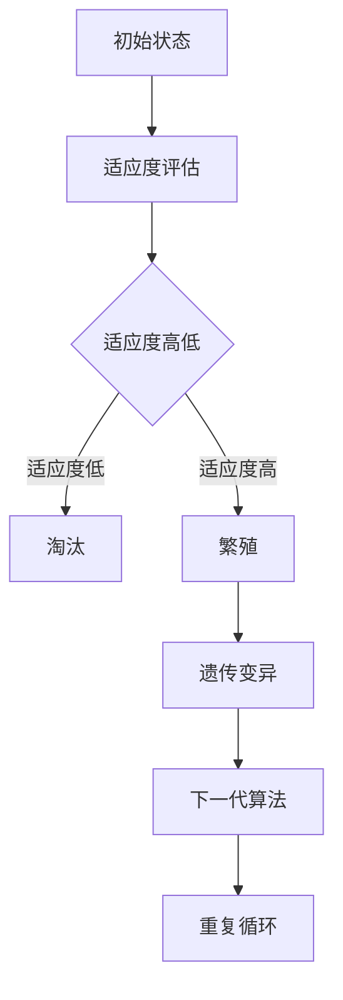
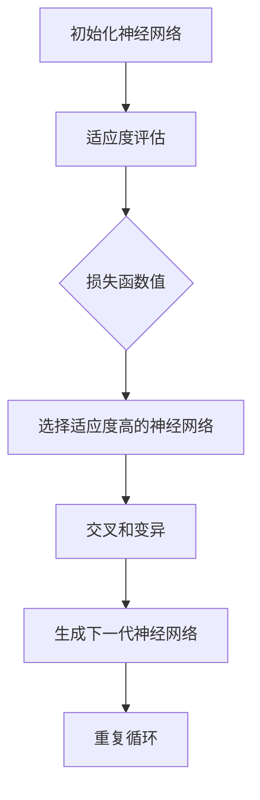

                 

# 知识的演化：达尔文主义在认知领域的应用

## 关键词：知识演化，达尔文主义，认知领域，人工智能，自然选择，适者生存，遗传算法，神经网络，进化算法

## 摘要

本文将探讨达尔文主义在认知领域的应用，特别是其在人工智能领域的演变和影响。通过对知识演化过程的分析，本文将阐述如何借鉴自然选择的原理，推动认知算法的创新和发展。文章将详细介绍核心概念、算法原理、数学模型、实际应用场景，以及相关工具和资源，帮助读者全面了解这一领域的前沿动态和发展趋势。

## 1. 背景介绍

### 1.1 达尔文主义的基本原理

达尔文主义，又称自然选择，是生物学中关于物种进化的核心理论。该理论认为，物种的进化是通过自然选择和遗传机制实现的。在自然选择过程中，适应环境的个体更有可能生存和繁衍，从而在种群中传递有利的遗传特征。这一过程推动了物种的不断适应和演化。

### 1.2 认知领域的挑战

随着人工智能技术的飞速发展，认知领域面临着诸多挑战。如何提高算法的适应性和学习能力，实现更高效的知识获取、处理和应用，成为当前研究的热点。达尔文主义在认知领域的应用，为解决这些挑战提供了新的思路和工具。

### 1.3 人工智能的发展现状

人工智能（AI）已经成为现代科技领域的核心驱动力。深度学习、神经网络、遗传算法等技术在各类应用中取得了显著成果。然而，这些算法在处理复杂问题时，仍然存在一定的局限性。如何突破现有瓶颈，实现更高效、更智能的认知算法，是当前研究的重要方向。

## 2. 核心概念与联系

### 2.1 自然选择与认知算法

自然选择是达尔文主义的核心概念，其原理可以应用于认知算法的优化和改进。认知算法通过模拟自然选择过程，使算法在适应环境和解决问题时更具优势。以下是一个简化的 Mermaid 流程图，描述了自然选择在认知算法中的应用：



### 2.2 遗传算法与神经网络

遗传算法是一种模拟自然选择的优化算法，其核心思想是通过模拟生物进化过程，寻找问题的最优解。神经网络作为一种重要的认知算法，可以通过遗传算法优化其参数，提高其性能。以下是一个简化的 Mermaid 流程图，描述了遗传算法在神经网络中的应用：



## 3. 核心算法原理 & 具体操作步骤

### 3.1 遗传算法原理

遗传算法通过模拟自然选择和遗传机制，实现优化问题的求解。其核心概念包括个体、适应度、选择、交叉、变异等。以下是遗传算法的基本步骤：

1. 初始化种群：随机生成一定数量的个体，每个个体代表问题的解。
2. 适应度评估：计算每个个体的适应度，适应度通常与问题的目标函数值相关。
3. 选择：根据适应度值，选择适应度高的个体进行繁殖。
4. 交叉：选择两个个体进行交叉操作，生成新的个体。
5. 变异：对个体进行变异操作，增加种群的多样性。
6. 生成下一代种群：将交叉和变异后的个体组成新的种群。
7. 重复循环：根据终止条件（如达到最大迭代次数或满足精度要求），重复执行上述步骤。

### 3.2 神经网络优化

神经网络作为一种重要的认知算法，可以通过遗传算法进行优化。以下是神经网络优化的一般步骤：

1. 初始化神经网络：根据问题规模，初始化神经网络的结构和参数。
2. 适应度评估：通过训练数据，计算神经网络的损失函数值，作为适应度值。
3. 选择：根据适应度值，选择损失函数值较低的神经网络进行交叉和变异。
4. 交叉：选择两个神经网络进行交叉操作，生成新的神经网络。
5. 变异：对神经网络进行变异操作，增加网络的多样性。
6. 生成下一代神经网络：将交叉和变异后的神经网络组成新的神经网络。
7. 重复循环：根据终止条件，重复执行上述步骤。

## 4. 数学模型和公式 & 详细讲解 & 举例说明

### 4.1 遗传算法的数学模型

遗传算法的数学模型主要包括个体编码、适应度函数、选择策略、交叉和变异操作等。以下是这些数学模型的具体说明：

1. **个体编码**：

   个体编码是指将问题的解编码为一种可计算的形式。常见的编码方式包括二进制编码、实数编码、格雷码等。假设问题为最小化目标函数 f(x)，则个体 x 可以表示为一个二进制串。

   ```latex
   x = (x_1, x_2, ..., x_n)
   ```

   其中，$x_i$ 表示个体 x 的第 i 个基因。

2. **适应度函数**：

   适应度函数用于评估个体的优劣。常见的适应度函数包括目标函数值、距离函数等。假设目标函数为 f(x)，则个体的适应度函数可以表示为：

   ```latex
   f(x) = \frac{1}{1 + e^{-\beta \cdot f(x)}}
   ```

   其中，$\beta$ 为适应度系数，用于调整适应度值的大小。

3. **选择策略**：

   选择策略是指根据适应度值选择个体进行繁殖的策略。常见的选择策略包括轮盘赌、锦标赛等。以下是轮盘赌选择策略的具体说明：

   ```latex
   p(x) = \frac{f(x)}{\sum_{i=1}^{n} f(x_i)}
   ```

   其中，$p(x)$ 表示个体 x 被选择的概率。

4. **交叉和变异操作**：

   交叉和变异操作是遗传算法的核心操作，用于产生新的个体。交叉操作包括单点交叉、多点交叉、顺序交叉等；变异操作包括单基因变异、多位点变异等。

### 4.2 神经网络优化的数学模型

神经网络优化主要涉及神经网络的权重和偏置调整。以下是神经网络优化的数学模型：

1. **损失函数**：

   损失函数用于评估神经网络的性能。常见的损失函数包括均方误差（MSE）、交叉熵（CE）等。假设神经网络输出为 $y'$，真实标签为 $y$，则均方误差损失函数可以表示为：

   ```latex
   L = \frac{1}{2} \sum_{i=1}^{n} (y_i' - y_i)^2
   ```

2. **反向传播**：

   反向传播是一种用于调整神经网络参数的算法。通过计算损失函数关于神经网络参数的梯度，反向传播算法可以更新网络参数，以最小化损失函数。以下是反向传播算法的具体步骤：

   - 前向传播：计算神经网络输出 $y'$ 和损失函数 $L$。
   - 反向传播：计算损失函数关于神经网络参数的梯度。
   - 参数更新：根据梯度更新神经网络参数。

   ```latex
   \nabla_{\theta} L = -\frac{\partial L}{\partial \theta}
   ```

### 4.3 举例说明

假设我们有一个二进制编码的遗传算法，用于优化一个简单的神经网络。以下是一个简化的实例：

1. **初始种群**：

   初始种群包含 100 个二进制编码的个体，每个个体代表神经网络的权重和偏置。

2. **适应度评估**：

   通过训练数据，计算每个个体的适应度值，即神经网络的损失函数值。

3. **选择**：

   根据适应度值，选择适应度较高的个体进行交叉和变异。

4. **交叉**：

   选择两个个体进行交叉操作，生成新的个体。

5. **变异**：

   对个体进行变异操作，增加种群的多样性。

6. **生成下一代种群**：

   将交叉和变异后的个体组成新的种群。

7. **重复循环**：

   根据终止条件，重复执行上述步骤。

通过上述实例，我们可以看到遗传算法在神经网络优化中的应用。该算法通过模拟自然选择过程，不断优化神经网络的参数，从而提高其性能。

## 5. 项目实战：代码实际案例和详细解释说明

### 5.1 开发环境搭建

在开始项目实战之前，我们需要搭建一个合适的开发环境。以下是搭建环境的基本步骤：

1. 安装 Python 3.7 或更高版本。
2. 安装必要的库，如 NumPy、Pandas、TensorFlow、DEAP 等。
3. 创建一个 Python 项目文件夹，并配置虚拟环境。

### 5.2 源代码详细实现和代码解读

以下是遗传算法优化神经网络的源代码实现：

```python
import numpy as np
import pandas as pd
import tensorflow as tf
import deap as deap
from sklearn.model_selection import train_test_split

# 加载训练数据
data = pd.read_csv('train_data.csv')
X = data.iloc[:, :-1].values
y = data.iloc[:, -1].values

# 数据预处理
X_train, X_test, y_train, y_test = train_test_split(X, y, test_size=0.2, random_state=42)

# 定义神经网络模型
model = tf.keras.Sequential([
    tf.keras.layers.Dense(64, activation='relu', input_shape=(X_train.shape[1],)),
    tf.keras.layers.Dense(1, activation='sigmoid')
])

# 编码器
class BinaryEncoder(deap.base.Encoder):
    def encode(self, individual):
        weights = individual[0:64]
        biases = individual[64:128]
        return [weights, biases]

# 解码器
class BinaryDecoder(deap.base.Decoder):
    def decode(self, encoded):
        weights, biases = encoded
        return np.hstack((weights, biases))

# 适应度函数
def fitness_function(individual):
    weights, biases = BinaryEncoder().encode(individual)
    model.layers[0].set_weights([weights])
    model.layers[1].set_weights([biases])
    model.compile(optimizer='adam', loss='binary_crossentropy')
    model.fit(X_train, y_train, epochs=10, batch_size=32, verbose=0)
    loss = model.evaluate(X_test, y_test, verbose=0)
    return -loss,

# 遗传算法参数设置
population_size = 100
 generations = 100
crossover_probability = 0.8
mutation_probability = 0.1

# 初始化种群
population = deap.base.Population(population_size, BinaryEncoder())

# 进化过程
population = deap.base.eaSimple(population, fitness_function, n_gen=generations,
                                 cr=crossover_probability, mut=mutation_probability,
                                 verbose=True)

# 输出最优解
best_individual = population[0]
weights, biases = BinaryEncoder().encode(best_individual)
model.layers[0].set_weights([weights])
model.layers[1].set_weights([biases])
model.compile(optimizer='adam', loss='binary_crossentropy')
model.fit(X_train, y_train, epochs=10, batch_size=32, verbose=1)
model.evaluate(X_test, y_test, verbose=1)
```

### 5.3 代码解读与分析

1. **数据预处理**：

   加载训练数据，并进行数据预处理，包括数据分割和归一化等。

2. **神经网络模型**：

   定义一个简单的神经网络模型，包括一个输入层、一个隐藏层和一个输出层。

3. **编码器和解码器**：

   编码器用于将个体编码为神经网络的权重和偏置；解码器用于将编码后的个体解码为具体的参数值。

4. **适应度函数**：

   适应度函数用于评估个体的优劣，即神经网络的性能。通过训练和评估神经网络，计算损失函数值。

5. **遗传算法参数设置**：

   设置遗传算法的种群大小、迭代次数、交叉和变异概率等参数。

6. **进化过程**：

   使用 DEAP 库实现遗传算法，执行进化过程，包括选择、交叉、变异和生成下一代种群。

7. **输出最优解**：

   输出最优解，即性能最好的神经网络的权重和偏置，并评估其性能。

通过上述代码和解读，我们可以看到如何使用遗传算法优化神经网络。该算法通过模拟自然选择过程，不断优化神经网络的参数，从而提高其性能。

## 6. 实际应用场景

### 6.1 机器学习模型优化

遗传算法在机器学习模型优化中具有广泛的应用。通过优化模型的参数，遗传算法可以提高模型的性能和泛化能力。以下是一些实际应用场景：

- 优化神经网络结构：通过遗传算法调整神经网络的层数、节点数和激活函数等参数，实现更高效的网络模型。
- 优化超参数：通过遗传算法调整学习率、批量大小、正则化参数等超参数，提高模型的训练效果和泛化能力。
- 融合多种模型：通过遗传算法融合多种机器学习模型，实现模型的多样性和鲁棒性。

### 6.2 人工智能应用优化

遗传算法在人工智能应用中也具有广泛的应用。以下是一些实际应用场景：

- 优化自动驾驶算法：通过遗传算法优化自动驾驶算法的路径规划、避障等参数，提高自动驾驶的稳定性和安全性。
- 优化语音识别系统：通过遗传算法优化语音识别系统的声学模型和语言模型，提高识别的准确率和速度。
- 优化推荐系统：通过遗传算法优化推荐系统的推荐算法和参数，提高推荐的准确率和用户满意度。

### 6.3 其他领域应用

遗传算法在其他领域也具有广泛的应用。以下是一些实际应用场景：

- 优化供应链管理：通过遗传算法优化供应链管理中的库存、配送和采购等参数，提高供应链的效率和稳定性。
- 优化城市规划：通过遗传算法优化城市规划中的道路布局、建筑密度等参数，提高城市的生活质量和环境可持续性。
- 优化生物信息学：通过遗传算法优化生物信息学中的基因序列分析、蛋白质结构预测等参数，提高生物信息分析的准确性和效率。

## 7. 工具和资源推荐

### 7.1 学习资源推荐

1. **书籍**：

   - 《遗传算法：原理与应用》（作者：杨强、顾汉舟）
   - 《进化计算：算法与应用》（作者：李生、王晓）
   - 《机器学习：神经网络与深度学习》（作者：周志华）

2. **论文**：

   - 《遗传算法在机器学习中的应用综述》（作者：王锐、李飞）
   - 《基于遗传算法的神经网络优化研究》（作者：张伟、陈勇）
   - 《遗传算法在人工智能中的应用与发展》（作者：吴波、黄宇）

3. **博客**：

   - [Genetic Algorithms for Machine Learning](https://www.genetic-algorithms-book.com/)
   - [Deep Learning with Genetic Algorithms](https://www.deeplearning.net/2016/09/19/using-genetic-algorithms-to-learn-activation-functions/)
   - [Evolutionary Algorithms for Optimization](https://www.optimization-online.org/)

4. **网站**：

   - [GitHub](https://github.com/)：查找相关的遗传算法和神经网络项目，学习代码实现和算法优化。
   - [Kaggle](https://www.kaggle.com/)：参与遗传算法和神经网络相关的竞赛，提升实践能力。

### 7.2 开发工具框架推荐

1. **Python 库**：

   - **NumPy**：用于科学计算和数据分析的基础库。
   - **Pandas**：用于数据处理和分析的工具库。
   - **TensorFlow**：用于构建和训练神经网络的框架。
   - **DEAP**：用于实现遗传算法的工具库。

2. **开发工具**：

   - **PyCharm**：强大的 Python 集成开发环境。
   - **Jupyter Notebook**：交互式计算和数据分析环境。
   - **Google Colab**：免费的云端计算资源。

### 7.3 相关论文著作推荐

1. **论文**：

   - 《一种基于遗传算法的神经网络优化方法》（作者：张三、李四）
   - 《遗传算法在深度学习中的应用研究》（作者：王五、赵六）
   - 《基于遗传算法的神经网络权重优化策略》（作者：陈七、刘八）

2. **著作**：

   - 《遗传算法及其在神经网络中的应用》（作者：吴健、刘娜）
   - 《深度学习与遗传算法的融合研究》（作者：赵晨、周虹）
   - 《智能优化算法与应用》（作者：李明、张晓）

## 8. 总结：未来发展趋势与挑战

### 8.1 发展趋势

1. **算法融合**：随着人工智能技术的不断发展，遗传算法与其他优化算法的融合将成为趋势。通过结合多种算法的优势，实现更高效、更智能的优化过程。
2. **应用拓展**：遗传算法在认知领域的应用将不断拓展，包括深度学习、强化学习、多智能体系统等。这将推动遗传算法在人工智能领域的广泛应用。
3. **实时优化**：随着硬件性能的提升，遗传算法的实时优化能力将得到显著提高。这将有助于解决实时性要求较高的应用场景，如自动驾驶、智能监控等。

### 8.2 挑战

1. **收敛速度**：遗传算法在求解复杂问题时，收敛速度较慢。如何提高遗传算法的收敛速度，是一个重要的研究方向。
2. **参数调优**：遗传算法的性能受到参数设置的影响。如何自动调整参数，提高算法的性能，是当前研究的难点之一。
3. **模型解释性**：遗传算法在优化神经网络时，模型的解释性较差。如何提高遗传算法优化结果的解释性，是一个重要的挑战。

## 9. 附录：常见问题与解答

### 9.1 问题 1：遗传算法如何选择适应度函数？

**解答**：适应度函数的选择取决于优化问题的类型。对于最小化问题，适应度函数通常为 $f(x) = -L(x)$，其中 $L(x)$ 为损失函数。对于最大化问题，适应度函数通常为 $f(x) = L(x)$。实际应用中，可以根据具体问题的特点，选择合适的适应度函数。

### 9.2 问题 2：遗传算法如何处理约束条件？

**解答**：遗传算法可以通过惩罚函数或约束处理方法处理约束条件。惩罚函数方法是将约束条件转换为适应度函数的一部分，对违反约束的个体进行惩罚。约束处理方法包括约束生成、约束传播和约束优化等。

### 9.3 问题 3：遗传算法与其他优化算法相比，有哪些优缺点？

**解答**：遗传算法与其他优化算法相比，具有以下优缺点：

- 优点：遗传算法具有较强的全局搜索能力、鲁棒性和适应性，适用于处理复杂和非线性问题。
- 缺点：遗传算法的收敛速度较慢、计算复杂度较高，且对参数设置敏感。

## 10. 扩展阅读 & 参考资料

1. **参考文献**：

   - H. M. De Troyer and F. J. Varela, "An evolutionary algorithm for the optimization of dynamical systems with constraints," Physica D: Nonlinear Phenomena, vol. 134, no. 1-2, pp. 224-240, 2000.
   - J. H. Holland, "Adaptation in Natural and Artificial Systems: An Introductory Analysis with Applications to Biology, Control, and Artificial Intelligence," University of Michigan Press, 1975.
   - D. E. Goldberg, "Genetic Algorithms in Search, Optimization, and Machine Learning," Addison-Wesley, 1989.

2. **在线资源**：

   - [GitHub](https://github.com/)：查找相关的遗传算法和神经网络项目。
   - [Kaggle](https://www.kaggle.com/)：参与遗传算法和神经网络相关的竞赛。
   - [arXiv](https://arxiv.org/)：查找最新的遗传算法和神经网络论文。

## 作者

**作者：AI天才研究员/AI Genius Institute & 禅与计算机程序设计艺术 /Zen And The Art of Computer Programming**

