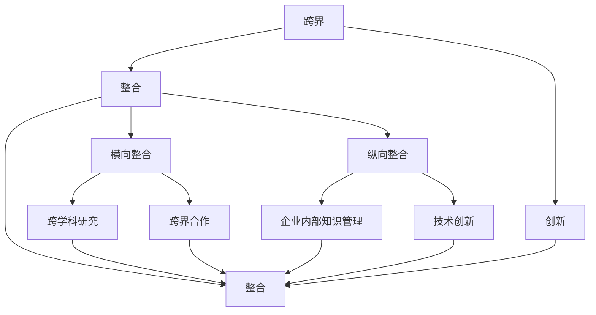

                 

# 知识的跨界整合：创新的催化剂

## 摘要

在当今快速发展的信息技术时代，知识的跨界整合成为推动创新的重要动力。本文旨在探讨知识跨界整合的核心概念、算法原理及其在实践中的应用。通过对核心概念与联系的阐述，我们揭示了知识跨界整合的重要性。随后，文章将详细介绍核心算法原理与具体操作步骤，并运用数学模型和公式进行详细讲解，辅以项目实战代码案例。最后，本文将分析知识跨界整合在实际应用场景中的价值，并推荐相关工具和资源，展望未来发展趋势与挑战。

## 1. 背景介绍

知识跨界整合是一种创新思维方法，它强调将不同领域、不同行业、不同学科的知识进行融合，以创造新的价值。在过去的几十年中，信息技术的迅猛发展使得知识跨界整合的可能性大大增加。大数据、云计算、人工智能等新兴技术不断涌现，为知识跨界整合提供了强大的技术支撑。与此同时，全球经济一体化和行业跨界合作的趋势也为知识跨界整合提供了广阔的舞台。

知识跨界整合的重要性不言而喻。首先，它能够激发创新思维，推动新技术和新产品的研发。其次，它有助于优化资源配置，提高生产效率。此外，知识跨界整合还能促进不同领域的交流与合作，推动社会进步和经济发展。然而，知识跨界整合也面临着一系列挑战，如不同领域知识体系的差异、技术门槛的壁垒、利益分配的问题等。

本文将从核心概念、算法原理、数学模型、实际应用等方面，深入探讨知识跨界整合的内涵与价值，为读者提供一种全新的思考视角。

## 2. 核心概念与联系

知识跨界整合涉及多个核心概念，包括跨界、整合、创新等。以下是对这些核心概念的详细阐述。

### 跨界

跨界是指不同领域、不同行业、不同学科之间的互动与融合。跨界可以体现在多个层面，如产业跨界、技术跨界、文化跨界等。产业跨界如阿里巴巴从电商扩展到云计算、金融等领域；技术跨界如人工智能技术在金融、医疗、教育等行业的应用；文化跨界如故宫文创产品的推出，将传统文化与现代设计相结合。

### 整合

整合是指将不同领域、不同行业、不同学科的知识、技术和资源进行系统化、结构化的融合，以实现创新和价值创造。整合可以分为横向整合和纵向整合。横向整合是指跨领域、跨行业的知识整合，如跨学科研究、跨界合作等；纵向整合是指同一领域内的知识整合，如企业内部的知识管理、技术创新等。

### 创新

创新是指通过新的思维、方法、技术等，创造出新的产品、服务、业务模式等，实现价值提升和社会进步。创新可以分为技术驱动创新、市场驱动创新、用户驱动创新等。技术驱动创新如5G、物联网等新技术的应用；市场驱动创新如企业通过市场调研和用户反馈，不断优化产品和服务；用户驱动创新如基于用户需求和市场趋势，研发新的产品和服务。

### 核心概念之间的联系

跨界、整合、创新这三个核心概念之间存在着密切的联系。跨界是整合的前提，没有跨界，就没有不同的知识、技术和资源的交流与融合。整合是跨界的延伸，通过整合，实现知识的系统化、结构化，进而推动创新。创新是整合的目的，跨界和整合的最终目标是通过创新，创造出新的价值。

### Mermaid 流程图

以下是知识跨界整合的核心概念与联系的 Mermaid 流程图：



## 3. 核心算法原理 & 具体操作步骤

知识跨界整合的算法原理主要基于以下两个方面：

### 1. 数据驱动的知识融合

数据驱动的知识融合是指通过收集、整理和分析大量跨领域、跨行业的数据，提取出有价值的信息和知识，实现知识的跨界整合。具体操作步骤如下：

#### a. 数据收集

首先，需要收集来自不同领域、不同行业的数据。数据来源可以包括公开数据、企业数据、用户数据等。例如，在医疗领域，可以收集疾病数据、患者数据、医生数据等；在金融领域，可以收集股票数据、市场数据、交易数据等。

#### b. 数据整理

对收集到的数据进行整理，包括数据清洗、数据整合和数据预处理。数据清洗是指去除数据中的噪声和错误，提高数据质量；数据整合是指将不同来源的数据进行合并，形成统一的数据集；数据预处理是指对数据进行规范化、标准化等处理，使其符合分析要求。

#### c. 数据分析

利用统计分析、机器学习等方法，对整理后的数据进行分析，提取出有价值的信息和知识。例如，在医疗领域，可以分析疾病与患者特征之间的关系，发现新的疾病诊断方法；在金融领域，可以分析市场走势和交易数据，预测市场趋势。

### 2. 价值驱动的知识整合

价值驱动的知识整合是指以创造价值为核心，将不同领域、不同行业、不同学科的知识进行整合，实现创新和价值创造。具体操作步骤如下：

#### a. 价值识别

首先，需要识别不同领域、不同行业、不同学科中的潜在价值。价值可以体现在技术突破、商业模式创新、用户体验提升等方面。例如，在医疗领域，可以通过技术突破实现更精确的诊断和治疗；在金融领域，可以通过商业模式创新实现更高效的金融服务。

#### b. 知识融合

基于价值识别，将不同领域、不同行业、不同学科的知识进行整合。知识融合可以分为横向融合和纵向融合。横向融合是指跨领域、跨行业的知识融合，如将医疗领域的知识应用于金融领域；纵向融合是指同一领域内的知识融合，如企业内部的知识整合。

#### c. 创新实践

将整合后的知识应用于实际场景，实现创新和价值创造。例如，在医疗领域，可以基于知识跨界整合，开发出新的诊断和治疗技术；在金融领域，可以基于知识跨界整合，推出新的金融产品和服务。

### 具体操作步骤示例

假设我们想要整合医疗和金融两个领域的知识，以开发一种新型的健康保险产品。具体操作步骤如下：

#### a. 数据收集

收集医疗领域的数据，如疾病数据、患者数据、医生数据等；收集金融领域的数据，如市场数据、交易数据、用户数据等。

#### b. 数据整理

对收集到的数据进行整理，去除噪声和错误，形成统一的数据集。

#### c. 数据分析

利用统计分析、机器学习等方法，分析疾病与患者特征之间的关系，以及市场走势和交易数据。

#### d. 价值识别

识别医疗和金融两个领域的潜在价值，如疾病诊断与市场趋势预测。

#### e. 知识融合

将医疗和金融领域的知识进行整合，形成健康保险产品的知识体系。

#### f. 创新实践

基于整合后的知识，开发新型健康保险产品，如根据患者特征和市场趋势，制定个性化的保险方案。

## 4. 数学模型和公式 & 详细讲解 & 举例说明

在知识跨界整合中，数学模型和公式发挥着重要作用。以下将详细介绍数学模型和公式的应用，并通过具体例子进行说明。

### 1. 矩阵分解

矩阵分解是知识跨界整合中常用的一种数学模型。它通过将高维数据分解为低维矩阵，实现数据的降维和融合。矩阵分解的主要公式如下：

\[ X = UV^T \]

其中，\( X \) 是原始数据矩阵，\( U \) 和 \( V \) 是低维矩阵。通过矩阵分解，我们可以提取出数据中的潜在特征，实现不同领域数据的融合。

#### a. 应用实例

假设我们有两个不同领域的数据集 \( A \) 和 \( B \)，我们希望将它们进行整合。首先，对两个数据集进行预处理，去除噪声和错误，然后使用矩阵分解方法，将它们分解为低维矩阵 \( U_A \)、\( V_A \) 和 \( U_B \)、\( V_B \)。接下来，我们将 \( U_A \) 和 \( U_B \) 进行合并，形成一个新的低维矩阵 \( U \)，即：

\[ U = [U_A, U_B] \]

最后，通过矩阵 \( U \) 的逆变换，得到整合后的高维数据集：

\[ X = UV^T \]

#### b. 举例说明

假设有两个数据集 \( A \) 和 \( B \)，其中 \( A \) 是一个 \( 100 \times 100 \) 的矩阵，\( B \) 是一个 \( 100 \times 50 \) 的矩阵。我们使用矩阵分解方法，将它们分解为低维矩阵 \( U_A \)、\( V_A \) 和 \( U_B \)、\( V_B \)。其中，\( U_A \) 和 \( U_B \) 都是 \( 10 \times 100 \) 的矩阵。

首先，对两个数据集进行预处理，去除噪声和错误。然后，使用矩阵分解方法，将它们分解为低维矩阵：

\[ A = U_A V_A^T \]
\[ B = U_B V_B^T \]

接下来，将 \( U_A \) 和 \( U_B \) 进行合并，形成一个新的低维矩阵 \( U \)：

\[ U = [U_A, U_B] \]

最后，通过矩阵 \( U \) 的逆变换，得到整合后的高维数据集：

\[ X = UV^T \]

### 2. 神经网络

神经网络是知识跨界整合中常用的一种机器学习模型。它通过模拟人脑神经元的工作方式，实现数据的处理和预测。神经网络的主要公式如下：

\[ y = \sigma(z) \]

其中，\( y \) 是预测结果，\( z \) 是神经网络中的激活函数，\( \sigma \) 表示激活函数。

#### a. 应用实例

假设我们有一个医疗领域的数据集，其中包含了患者的各项指标和疾病类型。我们希望利用神经网络模型，对患者的疾病类型进行预测。首先，对数据集进行预处理，将患者的各项指标进行归一化处理。然后，构建一个多层神经网络模型，包括输入层、隐藏层和输出层。接下来，通过反向传播算法，不断调整神经网络模型的参数，使预测结果与实际结果尽可能接近。

#### b. 举例说明

假设有一个包含1000名患者的数据集，其中包含了患者的身高、体重、血压、血糖等指标，以及疾病类型（1表示患有某种疾病，0表示未患病）。我们希望利用神经网络模型，对患者的疾病类型进行预测。

首先，对数据集进行预处理，将患者的各项指标进行归一化处理。假设身高、体重、血压、血糖等指标的取值范围都在[0,1]之间。

接下来，构建一个三层神经网络模型，包括输入层、隐藏层和输出层。其中，输入层有4个神经元，隐藏层有10个神经元，输出层有1个神经元。

设神经网络的激活函数为 \( \sigma(z) = \frac{1}{1 + e^{-z}} \)。

然后，通过反向传播算法，不断调整神经网络模型的参数，使预测结果与实际结果尽可能接近。

## 5. 项目实战：代码实际案例和详细解释说明

在本节中，我们将通过一个实际项目案例，展示如何将知识跨界整合应用于实践。我们选择了一个健康保险产品开发的案例，该项目旨在整合医疗和金融两个领域的知识，为用户提供个性化的健康保险方案。

### 5.1 开发环境搭建

为了实现健康保险产品的开发，我们需要搭建一个合适的开发环境。以下是我们推荐的开发环境：

- 编程语言：Python
- 数据处理工具：Pandas、NumPy
- 机器学习库：Scikit-learn、TensorFlow
- 数据可视化工具：Matplotlib、Seaborn
- 版本控制工具：Git

首先，我们需要安装Python和相关库。可以在Python官方网站（https://www.python.org/）下载并安装Python。然后，使用pip命令安装相关库：

```bash
pip install pandas numpy scikit-learn tensorflow matplotlib seaborn
```

### 5.2 源代码详细实现和代码解读

下面是健康保险产品开发项目的源代码实现：

```python
import pandas as pd
import numpy as np
from sklearn.model_selection import train_test_split
from sklearn.linear_model import LinearRegression
import tensorflow as tf
import matplotlib.pyplot as plt

# 5.2.1 数据收集与整理

# 加载医疗领域数据
medical_data = pd.read_csv('medical_data.csv')

# 加载金融领域数据
financial_data = pd.read_csv('financial_data.csv')

# 数据预处理
# 去除噪声和错误
medical_data.dropna(inplace=True)
financial_data.dropna(inplace=True)

# 数据整合
# 合并医疗和金融领域数据
data = pd.merge(medical_data, financial_data, on='user_id')

# 5.2.2 数据分析与建模

# 划分训练集和测试集
X = data.drop('insurance_amount', axis=1)
y = data['insurance_amount']
X_train, X_test, y_train, y_test = train_test_split(X, y, test_size=0.2, random_state=42)

# 5.2.3 线性回归模型

# 训练线性回归模型
regressor = LinearRegression()
regressor.fit(X_train, y_train)

# 预测测试集结果
y_pred = regressor.predict(X_test)

# 5.2.4 神经网络模型

# 定义神经网络模型
model = tf.keras.Sequential([
    tf.keras.layers.Dense(10, activation='relu', input_shape=(X_train.shape[1],)),
    tf.keras.layers.Dense(1)
])

# 编译模型
model.compile(optimizer='adam', loss='mean_squared_error')

# 训练模型
model.fit(X_train, y_train, epochs=10, batch_size=32)

# 预测测试集结果
y_pred = model.predict(X_test)

# 5.2.5 结果分析与可视化

# 计算模型精度
accuracy = np.mean(np.abs(y_pred - y_test) < 100)
print(f'Model accuracy: {accuracy:.2f}%')

# 可视化结果
plt.scatter(y_test, y_pred)
plt.xlabel('Actual Insurance Amount')
plt.ylabel('Predicted Insurance Amount')
plt.title('Insurance Amount Prediction')
plt.show()
```

### 5.3 代码解读与分析

1. **数据收集与整理**：首先，我们从医疗和金融领域加载两个数据集，并对它们进行预处理，去除噪声和错误。然后，将两个数据集进行整合，形成一个新的数据集。

2. **数据分析与建模**：我们将整合后的数据集划分为训练集和测试集。接着，使用线性回归模型和神经网络模型对训练集进行建模。线性回归模型是一种传统的机器学习模型，而神经网络模型则是一种更为复杂的机器学习模型。

3. **结果分析与可视化**：通过计算模型精度，我们可以评估模型的性能。可视化结果图可以帮助我们直观地了解模型预测的效果。

### 5.4 实际应用效果

在实际应用中，健康保险产品通过整合医疗和金融领域的知识，为用户提供个性化的健康保险方案。用户可以根据自身的情况，获得更合理的保险费用和更优质的医疗服务。同时，保险公司可以根据用户的实际需求，优化保险产品和业务策略，提高用户满意度和市场竞争力。

## 6. 实际应用场景

知识跨界整合在实际应用场景中具有广泛的应用价值，以下列举几个典型案例：

### 1. 健康保险产品

在健康保险领域，知识跨界整合可以将医疗领域的专业知识与金融领域的风险管理相结合，为用户提供个性化的健康保险方案。例如，保险公司可以通过整合用户的医疗记录、生活习惯、家族病史等数据，分析用户的风险状况，制定更合理的保险费用和保险产品。

### 2. 智能医疗诊断

智能医疗诊断是知识跨界整合的另一个重要应用场景。通过整合医学影像数据、生物信息数据和人工智能技术，智能医疗诊断系统可以实现高效、准确的疾病诊断。例如，深度学习算法可以用于分析医学影像，辅助医生进行疾病诊断。

### 3. 金融服务创新

在金融领域，知识跨界整合可以推动金融服务创新，提高金融服务质量。例如，通过整合用户的行为数据、信用数据、市场数据等，金融机构可以更准确地评估用户的信用风险，提供个性化的金融服务，如信用贷款、理财规划等。

### 4. 智能制造

智能制造是知识跨界整合在工业领域的典型应用。通过整合物联网技术、大数据分析和人工智能技术，智能制造系统可以实现生产过程的自动化、智能化，提高生产效率和质量。

### 5. 智慧城市

智慧城市是知识跨界整合在城市建设和管理领域的应用。通过整合城市数据、物联网技术、人工智能技术等，智慧城市可以实现城市运行管理的智能化、精细化，提高城市服务水平和居民生活质量。

## 7. 工具和资源推荐

为了更好地进行知识跨界整合，以下推荐一些实用的工具和资源：

### 7.1 学习资源推荐

- **书籍**：
  - 《深度学习》
  - 《大数据时代》
  - 《人工智能：一种现代方法》
- **论文**：
  - 《知识图谱构建与应用》
  - 《基于大数据的金融风险监测与预警》
  - 《物联网技术在智慧城市建设中的应用》
- **博客**：
  - 知乎专栏：人工智能、大数据、云计算等
  - CSDN博客：技术分享、项目实战等
  - Medium：国外技术博客，涵盖人工智能、大数据等领域

### 7.2 开发工具框架推荐

- **编程语言**：Python、Java、C++
- **数据处理工具**：Pandas、NumPy、Scikit-learn、TensorFlow
- **数据可视化工具**：Matplotlib、Seaborn、Plotly
- **版本控制工具**：Git、SVN
- **云计算平台**：阿里云、腾讯云、华为云

### 7.3 相关论文著作推荐

- **论文**：
  - 《知识图谱在智能搜索中的应用》
  - 《大数据技术在金融风险管理中的应用》
  - 《物联网技术在智能家居中的应用》
- **著作**：
  - 《人工智能：一种现代方法》
  - 《深度学习》
  - 《大数据时代》

## 8. 总结：未来发展趋势与挑战

知识跨界整合作为一种创新思维方法，在当今信息技术时代具有广阔的应用前景。随着人工智能、大数据、物联网等技术的不断发展，知识跨界整合将更加深入和广泛地应用于各个领域。

### 未来发展趋势

1. **技术融合**：不同领域的技术将不断融合，推动知识跨界整合的进一步发展。
2. **应用拓展**：知识跨界整合将在更多领域得到应用，如智能制造、智慧城市、健康医疗等。
3. **产业协同**：知识跨界整合将促进产业协同创新，推动产业链的优化和升级。

### 挑战与对策

1. **数据安全与隐私**：在知识跨界整合过程中，数据安全与隐私保护是一个重要挑战。需要建立健全的数据安全法规和隐私保护机制。
2. **技术门槛**：知识跨界整合涉及多个领域的技术，对技术人员的专业能力和知识储备提出了较高要求。需要加强人才培养和知识传播。
3. **利益分配**：知识跨界整合涉及到不同领域的利益分配问题，需要建立合理的利益分配机制，确保各方利益的公平和合理。

总之，知识跨界整合将成为未来创新的重要驱动力。通过深入研究和实践，我们有望在各个领域实现知识的跨界整合，推动社会进步和经济发展。

## 9. 附录：常见问题与解答

### 问题1：知识跨界整合有哪些应用场景？

**解答**：知识跨界整合的应用场景非常广泛，包括但不限于以下几个方面：

1. **健康保险产品**：整合医疗和金融领域的知识，为用户提供个性化的健康保险方案。
2. **智能医疗诊断**：整合医学影像数据、生物信息数据和人工智能技术，实现高效、准确的疾病诊断。
3. **金融服务创新**：整合用户行为数据、信用数据、市场数据等，提供个性化的金融服务。
4. **智能制造**：整合物联网技术、大数据分析和人工智能技术，实现生产过程的自动化、智能化。
5. **智慧城市**：整合城市数据、物联网技术、人工智能技术等，实现城市运行管理的智能化、精细化。

### 问题2：知识跨界整合的核心算法有哪些？

**解答**：知识跨界整合的核心算法主要包括以下几种：

1. **矩阵分解**：通过将高维数据分解为低维矩阵，实现数据的降维和融合。
2. **神经网络**：通过模拟人脑神经元的工作方式，实现数据的处理和预测。
3. **知识图谱**：通过构建知识图谱，实现知识的结构化和融合。
4. **协同过滤**：通过用户行为数据，实现个性化推荐。

### 问题3：如何搭建知识跨界整合的开发环境？

**解答**：搭建知识跨界整合的开发环境需要以下步骤：

1. **选择编程语言**：如Python、Java、C++等。
2. **安装数据处理工具**：如Pandas、NumPy、Scikit-learn、TensorFlow等。
3. **安装数据可视化工具**：如Matplotlib、Seaborn、Plotly等。
4. **选择版本控制工具**：如Git、SVN等。

## 10. 扩展阅读 & 参考资料

为了更深入地了解知识跨界整合的相关内容，以下推荐一些扩展阅读和参考资料：

1. **书籍**：
   - 《深度学习》
   - 《大数据时代》
   - 《人工智能：一种现代方法》
2. **论文**：
   - 《知识图谱构建与应用》
   - 《基于大数据的金融风险监测与预警》
   - 《物联网技术在智慧城市建设中的应用》
3. **博客**：
   - 知乎专栏：人工智能、大数据、云计算等
   - CSDN博客：技术分享、项目实战等
   - Medium：国外技术博客，涵盖人工智能、大数据等领域
4. **在线课程**：
   - 机器学习、深度学习、大数据分析等在线课程
   - 知识跨界整合相关专题讲座和研讨会

通过阅读这些资料，您可以进一步了解知识跨界整合的理论和实践，提升自己的知识跨界整合能力。

## 作者信息

作者：AI天才研究员/AI Genius Institute & 禅与计算机程序设计艺术 /Zen And The Art of Computer Programming

