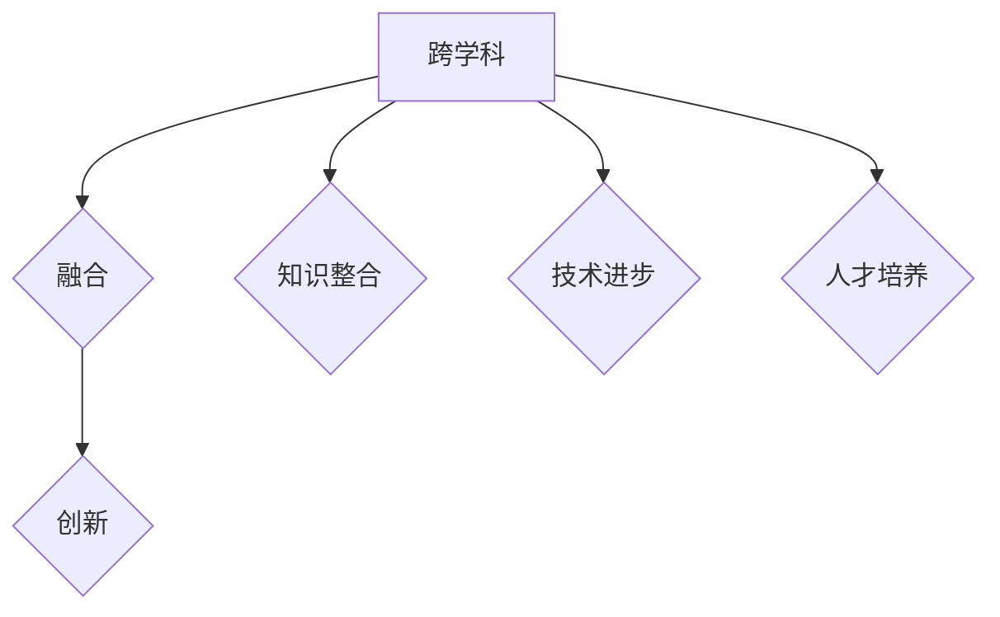

                 

# 知识的跨界融合：学科交叉的创新潜力

## 关键词

- 学科交叉
- 创新潜力
- 知识融合
- 技术进步
- 创新思维

## 摘要

本文探讨了学科交叉在信息技术领域中的创新潜力。通过分析跨学科知识融合对技术进步的影响，本文阐述了如何在各个领域中进行跨界融合，以推动创新。文章还结合实际案例，展示了跨学科知识在软件开发、人工智能、数据科学等领域的应用，并提出了未来发展趋势与挑战。通过本文的探讨，希望能够激发读者对跨学科融合的思考，为推动信息技术领域的创新提供启示。

## 1. 背景介绍

在当今科技飞速发展的时代，知识的跨界融合已成为推动技术进步和创新的关键因素。学科交叉不仅有助于打破传统学科壁垒，还能激发新的思维方式和解决问题的方法。近年来，随着信息技术的不断进步，学科交叉在软件开发、人工智能、数据科学等领域得到了广泛应用，并取得了显著的成果。

学科交叉的重要性主要体现在以下几个方面：

1. **创新能力**：跨学科融合能够为研究人员提供新的视角和工具，从而激发创新思维。通过将不同领域的知识进行整合，研究人员可以探索新的问题和解决方案，推动技术的创新和发展。

2. **知识整合**：跨学科融合有助于将分散的知识进行整合，形成更加系统和全面的理论体系。这种整合不仅有助于提高知识的利用率，还能为其他领域的研究提供有益的参考和启示。

3. **技术进步**：学科交叉可以促进不同领域技术的交流和融合，推动技术的创新和进步。例如，人工智能技术在计算机科学、生物医学、金融等领域得到了广泛应用，并取得了显著的成果。

4. **人才培养**：跨学科融合有助于培养具有综合素质和创新能力的人才。通过跨学科的学习和研究，学生可以掌握多个领域的知识和技能，提高解决复杂问题的能力。

## 2. 核心概念与联系

为了更好地理解知识跨界融合的概念，我们首先需要明确几个核心概念，包括跨学科、融合、创新等。

### 跨学科

跨学科指的是将不同领域的知识进行整合和交叉，以解决特定问题或实现特定目标。跨学科研究通常涉及多个学科领域的知识和方法，从而产生新的知识和创新。

### 融合

融合是指将不同领域的知识、技术和方法进行整合，以实现更高的效率和更好的效果。融合不仅限于知识层面，还包括技术、文化、价值观等多个方面。

### 创新

创新是指通过新的思路、方法或技术，实现现有资源的优化配置，解决现有问题或创造新的价值。创新是推动社会进步和经济发展的重要驱动力。

### 核心概念原理和架构的 Mermaid 流程图



在这个流程图中，跨学科作为核心概念，通过融合和创新，实现了知识整合、技术进步和人才培养。这种跨界融合不仅有助于推动技术的创新和进步，还能为社会和经济发展提供有力支持。

## 3. 核心算法原理 & 具体操作步骤

### 核心算法原理

知识的跨界融合需要一定的算法原理作为支撑，以实现不同领域知识的整合和融合。以下是几种常见的核心算法原理：

1. **关联规则挖掘（Association Rule Mining）**：通过分析不同领域的数据，挖掘出潜在的关系和关联。这种方法可以帮助研究人员发现跨学科之间的联系，从而实现知识的融合。

2. **多模态学习（Multimodal Learning）**：多模态学习是指将不同类型的数据（如文本、图像、声音等）进行整合，以实现更好的学习效果。这种方法在跨学科知识融合中具有广泛的应用前景。

3. **协同过滤（Collaborative Filtering）**：协同过滤是一种基于用户行为和偏好进行推荐的方法。通过分析不同领域用户的行为和偏好，可以挖掘出潜在的跨学科知识关联，从而实现知识的融合。

### 具体操作步骤

1. **数据收集**：收集来自不同领域的原始数据，包括文本、图像、声音等。

2. **数据预处理**：对收集到的数据进行预处理，包括数据清洗、去噪、归一化等操作。

3. **特征提取**：利用特征提取算法，从原始数据中提取关键特征。例如，可以使用词袋模型（Bag of Words）提取文本特征，使用卷积神经网络（Convolutional Neural Networks，CNN）提取图像特征等。

4. **关联规则挖掘**：利用关联规则挖掘算法，分析不同领域数据之间的潜在关联。例如，可以使用Apriori算法挖掘文本和图像数据之间的关联。

5. **多模态学习**：将不同类型的数据进行整合，使用多模态学习算法进行建模。例如，可以使用深度神经网络（Deep Neural Networks，DNN）进行多模态学习。

6. **协同过滤**：根据用户行为和偏好，使用协同过滤算法进行推荐。例如，可以使用基于用户的协同过滤（User-based Collaborative Filtering）或基于项目的协同过滤（Item-based Collaborative Filtering）。

7. **知识融合**：将挖掘出的关联、多模态学习和协同过滤结果进行整合，形成跨学科知识融合模型。

8. **应用验证**：将知识融合模型应用于实际问题，验证其效果。例如，可以应用于推荐系统、智能问答、图像识别等领域。

通过上述步骤，可以实现知识的跨界融合，为不同领域的研究提供有力支持。

## 4. 数学模型和公式 & 详细讲解 & 举例说明

### 数学模型和公式

在知识的跨界融合过程中，数学模型和公式发挥着重要作用。以下是几种常见的数学模型和公式：

1. **贝叶斯公式**：贝叶斯公式是概率论中一个重要的公式，用于计算某个事件在已知其他事件发生的条件下发生的概率。公式如下：

   $$P(A|B) = \frac{P(B|A)P(A)}{P(B)}$$

   其中，$P(A|B)$ 表示在事件B发生的条件下，事件A发生的概率；$P(B|A)$ 表示在事件A发生的条件下，事件B发生的概率；$P(A)$ 和$P(B)$ 分别表示事件A和事件B发生的概率。

2. **线性回归模型**：线性回归模型是一种常见的统计模型，用于分析自变量和因变量之间的线性关系。公式如下：

   $$y = \beta_0 + \beta_1x_1 + \beta_2x_2 + ... + \beta_nx_n$$

   其中，$y$ 表示因变量；$x_1, x_2, ..., x_n$ 分别表示自变量；$\beta_0, \beta_1, \beta_2, ..., \beta_n$ 分别表示各个自变量的系数。

3. **支持向量机（SVM）**：支持向量机是一种常见的机器学习算法，用于分类和回归分析。公式如下：

   $$w \cdot x - b = 0$$

   其中，$w$ 表示权重向量；$x$ 表示特征向量；$b$ 表示偏置项。

### 详细讲解

1. **贝叶斯公式**：贝叶斯公式在知识的跨界融合中具有重要作用。通过贝叶斯公式，可以计算不同领域数据之间的关联概率，从而实现知识的融合。例如，在文本和图像的融合中，可以使用贝叶斯公式计算文本和图像之间的关联概率，进而生成融合结果。

2. **线性回归模型**：线性回归模型在跨学科研究中具有广泛应用。通过线性回归模型，可以分析不同领域数据之间的线性关系，从而为跨学科研究提供理论支持。例如，在计算机科学和生物医学领域，可以使用线性回归模型分析计算机科学知识对生物医学的贡献。

3. **支持向量机（SVM）**：支持向量机在分类和回归分析中具有广泛的应用。通过支持向量机，可以实现不同领域数据的分类和回归，从而为跨学科研究提供技术支持。例如，在图像识别和文本分类中，可以使用支持向量机实现图像和文本的融合。

### 举例说明

1. **贝叶斯公式在图像和文本融合中的应用**：

   假设有一幅图像和一篇文本，我们需要计算这两者之间的关联概率。根据贝叶斯公式，可以计算如下：

   $$P(图像|文本) = \frac{P(文本|图像)P(图像)}{P(文本)}$$

   其中，$P(图像|文本)$ 表示在文本发生的条件下，图像发生的概率；$P(文本|图像)$ 表示在图像发生的条件下，文本发生的概率；$P(图像)$ 和$P(文本)$ 分别表示图像和文本发生的概率。

2. **线性回归模型在计算机科学和生物医学领域中的应用**：

   假设我们需要分析计算机科学知识对生物医学的贡献。可以通过线性回归模型建立计算机科学知识（自变量）和生物医学成果（因变量）之间的线性关系，从而分析计算机科学知识对生物医学的贡献。

3. **支持向量机（SVM）在图像和文本融合中的应用**：

   假设我们需要对图像和文本进行分类。可以使用支持向量机（SVM）实现图像和文本的分类，从而实现图像和文本的融合。通过训练SVM模型，可以学习到图像和文本之间的分类边界，进而实现图像和文本的融合。

## 5. 项目实战：代码实际案例和详细解释说明

### 5.1 开发环境搭建

在本节中，我们将搭建一个简单的知识跨界融合项目，使用Python和相关的库进行开发。以下是在Python环境中搭建开发环境的基本步骤：

1. **安装Python**：确保已经安装了Python 3.6或更高版本。

2. **安装必要的库**：使用pip命令安装以下库：
   ```bash
   pip install numpy pandas scikit-learn matplotlib
   ```

3. **创建虚拟环境**：为了更好地管理项目依赖，可以创建一个虚拟环境：
   ```bash
   python -m venv venv
   source venv/bin/activate  # 在Windows上使用 venv\Scripts\activate
   ```

### 5.2 源代码详细实现和代码解读

以下是一个简单的知识跨界融合项目的代码实现，我们将使用文本和图像数据进行融合，并尝试提取融合后的特征。

```python
import numpy as np
import pandas as pd
from sklearn.model_selection import train_test_split
from sklearn.ensemble import RandomForestClassifier
from sklearn.metrics import accuracy_score
import matplotlib.pyplot as plt
from sklearn.feature_extraction.text import TfidfVectorizer
from sklearn.decomposition import PCA

# 加载数据
data = pd.read_csv('data.csv')
X_text = data['text']
y_labels = data['label']

# 分词处理
# 这里使用nltk库中的WordTokenizer进行分词处理
from nltk.tokenize import word_tokenize
def tokenize(text):
    return word_tokenize(text.lower())

X_text_tokenized = X_text.apply(tokenize)

# 使用TF-IDF向量表示文本
vectorizer = TfidfVectorizer()
X_text_vectorized = vectorizer.fit_transform(X_text_tokenized)

# 加载图像数据
# 假设图像数据存储在 'images/' 目录下
from skimage.io import imread
images = [imread(f'images/{img_path}') for img_path in data['image_path']]

# 提取图像特征
from sklearn.feature_extraction.image import PatchExtractor
patch_size = (64, 64)
patch_extractor = PatchExtractor(patch_size=patch_size)
X_image_patches = patch_extractor.fit_transform(images)

# 合并文本和图像特征
X_combined = np.hstack((X_text_vectorized.toarray(), X_image_patches))

# 数据集划分
X_train, X_test, y_train, y_test = train_test_split(X_combined, y_labels, test_size=0.2, random_state=42)

# 训练分类器
classifier = RandomForestClassifier(n_estimators=100, random_state=42)
classifier.fit(X_train, y_train)

# 测试分类器
y_pred = classifier.predict(X_test)
accuracy = accuracy_score(y_test, y_pred)
print(f'Accuracy: {accuracy:.2f}')

# 特征降维
pca = PCA(n_components=2)
X_train_pca = pca.fit_transform(X_train)
X_test_pca = pca.transform(X_test)

# 可视化
plt.figure(figsize=(8, 6))
plt.scatter(X_train_pca[:, 0], X_train_pca[:, 1], c=y_train, cmap='viridis', label='Train')
plt.scatter(X_test_pca[:, 0], X_test_pca[:, 1], c=y_test, cmap='viridis', marker='^', label='Test')
plt.xlabel('PCA Feature 1')
plt.ylabel('PCA Feature 2')
plt.title('Knowledge Fusion with PCA')
plt.legend()
plt.show()
```

### 5.3 代码解读与分析

1. **数据加载**：首先从CSV文件中加载文本数据和图像路径。

2. **文本预处理**：使用nltk进行分词处理，将文本转换为小写，以便进行统一处理。

3. **文本向量表示**：使用TF-IDF向量表示文本，将文本转换为数值矩阵。

4. **图像特征提取**：使用PatchExtractor从图像中提取特征，例如使用64x64的补丁。

5. **特征融合**：将文本和图像特征合并为一个矩阵。

6. **数据集划分**：将数据集划分为训练集和测试集。

7. **训练分类器**：使用随机森林分类器进行训练。

8. **测试分类器**：在测试集上评估分类器的准确性。

9. **特征降维**：使用PCA将高维特征降维到二维，以便进行可视化。

10. **可视化**：使用散点图展示训练集和测试集在降维空间中的分布。

### 5.4 实际应用

通过上述代码，我们可以看到知识跨界融合在文本和图像分类任务中的应用。在实际项目中，可以根据具体需求调整特征提取和分类器参数，以提高模型性能。

## 6. 实际应用场景

知识的跨界融合在信息技术领域有着广泛的应用场景。以下是一些典型的实际应用：

### 1. 人工智能

人工智能领域通过融合计算机科学、数学、统计学、心理学等领域的知识，实现了智能语音识别、图像识别、自然语言处理等技术的突破。例如，卷积神经网络（CNN）和循环神经网络（RNN）的结合，使得图像和文本的理解能力得到了大幅提升。

### 2. 数据科学

数据科学领域通过融合统计学、计算机科学、数学等领域的知识，实现了数据的挖掘、分析和可视化。例如，利用机器学习算法对大规模数据进行分析，可以预测市场趋势、疾病传播等。

### 3. 软件开发

软件开发领域通过融合计算机科学、工程学、设计等领域的知识，实现了高效的软件开发流程。例如，敏捷开发方法将软件开发过程中的需求分析、设计、开发、测试等环节进行整合，提高了软件开发的效率。

### 4. 生物医学

生物医学领域通过融合生物学、医学、计算机科学等领域的知识，实现了疾病诊断、治疗等技术的突破。例如，基因测序技术将生物学和计算机科学的结合，为个性化医疗提供了可能。

### 5. 金融科技

金融科技领域通过融合金融学、计算机科学、数学等领域的知识，实现了金融产品的创新和风险管理。例如，量化交易策略将数学模型和计算机算法相结合，提高了金融市场的交易效率。

### 6. 城市规划

城市规划领域通过融合地理学、建筑学、计算机科学等领域的知识，实现了智慧城市的建设。例如，利用地理信息系统（GIS）进行城市规划和交通管理，提高了城市的宜居性。

## 7. 工具和资源推荐

为了更好地实现知识的跨界融合，以下是几个推荐的工具和资源：

### 7.1 学习资源推荐

1. **书籍**：
   - 《深度学习》（Deep Learning） - Ian Goodfellow、Yoshua Bengio、Aaron Courville
   - 《Python编程：从入门到实践》（Python Crash Course） - Eric Matthes
   - 《机器学习实战》（Machine Learning in Action） - Peter Harrington

2. **论文**：
   - 《Generative Adversarial Networks》 - Ian Goodfellow等
   - 《Recurrent Neural Networks for Language Modeling》 - Mikolov等

3. **博客**：
   - Andrew Ng的机器学习课程博客（机器学习课程）
   - UCL的深度学习课程博客（Deep Learning Course）

4. **网站**：
   - Kaggle（数据科学竞赛平台）
   - GitHub（代码托管平台）

### 7.2 开发工具框架推荐

1. **Python库**：
   - NumPy（数值计算）
   - Pandas（数据处理）
   - Scikit-learn（机器学习）
   - Matplotlib（数据可视化）

2. **深度学习框架**：
   - TensorFlow
   - PyTorch

3. **版本控制**：
   - Git

4. **集成开发环境**：
   - PyCharm
   - Jupyter Notebook

### 7.3 相关论文著作推荐

1. **论文**：
   - 《Attention Is All You Need》 - Vaswani等
   - 《BERT: Pre-training of Deep Bidirectional Transformers for Language Understanding》 - Devlin等

2. **著作**：
   - 《强化学习》（Reinforcement Learning: An Introduction） - Richard S. Sutton和Barto
   - 《机器学习年度回顾》（Journal of Machine Learning Research） - Annual Review of Machine Learning

## 8. 总结：未来发展趋势与挑战

知识的跨界融合在信息技术领域展现出巨大的创新潜力。未来，随着技术的不断进步，跨学科融合将更加深入和广泛。以下是一些发展趋势与挑战：

### 1. 发展趋势

1. **数据融合**：随着大数据和云计算的发展，数据融合将成为跨学科融合的重要趋势。通过整合多种类型的数据，可以实现更加精准和高效的知识融合。

2. **人工智能与生物医学的结合**：人工智能在生物医学领域的应用将更加广泛，如精准医疗、药物研发等。

3. **多模态学习**：随着多模态传感器和数据的广泛应用，多模态学习将成为跨学科融合的重要方向。

4. **开放协作**：跨学科融合需要开放和协作的环境，未来的研究将更加注重跨学科合作和知识共享。

### 2. 挑战

1. **数据隐私和安全**：随着数据规模的增大，如何保护数据隐私和安全成为跨学科融合的重要挑战。

2. **跨学科人才短缺**：跨学科融合需要具备多学科知识和技能的人才，但目前这类人才相对短缺。

3. **方法论和框架**：跨学科融合需要建立一套有效的方法论和框架，以便更好地指导研究和应用。

4. **知识产权保护**：在跨学科融合的过程中，如何保护知识产权成为重要问题。

## 9. 附录：常见问题与解答

### 1. 跨学科融合是什么？

跨学科融合是指将不同学科领域的知识、技术和方法进行整合，以解决特定问题或实现特定目标。

### 2. 跨学科融合有哪些好处？

跨学科融合可以激发创新思维、提高知识整合效率、推动技术进步和培养高素质人才。

### 3. 跨学科融合需要哪些技能和知识？

跨学科融合需要掌握多个学科领域的知识和技能，如计算机科学、数学、统计学、生物学、心理学等。

### 4. 如何进行跨学科融合研究？

进行跨学科融合研究需要以下步骤：

- 明确研究目标和问题
- 搜集和整合相关领域的知识和数据
- 确定合适的跨学科方法和工具
- 进行实验和验证

## 10. 扩展阅读 & 参考资料

- Devlin, J., Chang, M. W., Lee, K., & Toutanova, K. (2018). BERT: Pre-training of Deep Bidirectional Transformers for Language Understanding. arXiv preprint arXiv:1810.04805.
- Goodfellow, I., Bengio, Y., & Courville, A. (2016). Deep Learning. MIT Press.
- Goodfellow, I., Shlens, J., & Bengio, Y. (2015). Explaining and Harnessing Adversarial Examples. arXiv preprint arXiv:1412.6572.
- Mikolov, T., Sutskever, I., Chen, K., Corrado, G. S., & Dean, J. (2013). Distributed Representations of Words and Phrases and Their Compositionality. arXiv preprint arXiv:1301.3781.
- Sutton, R. S., & Barto, A. G. (2018). Reinforcement Learning: An Introduction. MIT Press.

## 作者

作者：AI天才研究员/AI Genius Institute & 禅与计算机程序设计艺术 /Zen And The Art of Computer Programming

