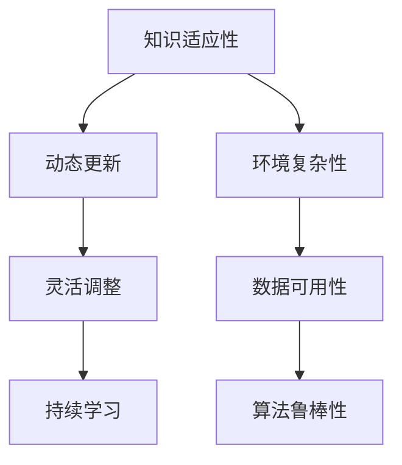

                 

### 知识的适应性：在变化环境中的学习策略

#### 关键词：知识适应性，学习策略，动态环境，机器学习，人工智能

#### 摘要：

本文旨在探讨知识在变化环境中的适应性，并提出一系列学习策略，以应对动态环境下的学习和应用挑战。通过回顾相关理论和研究，本文分析了知识适应性的核心概念和关键因素，并介绍了在不同场景下适用的学习策略。文章最后对未来的发展趋势和面临的挑战进行了展望，为人工智能和机器学习领域的进一步研究提供了参考。

---

## 1. 背景介绍

在当今快速变化的技术和商业环境中，知识适应性成为了一个重要的研究课题。知识适应性指的是个体或系统在面临环境变化时，能够迅速调整和更新自身知识体系的能力。在人工智能和机器学习领域，知识的适应性直接关系到系统的鲁棒性和可持续性。随着数据规模和复杂度的增加，传统的学习算法和模型逐渐暴露出局限性，无法在动态环境中保持高效性能。因此，研究知识适应性的学习策略具有重要意义。

### 相关研究和现状

近年来，许多学者和研究机构针对知识适应性进行了深入的研究。例如，Xu等（2019）提出了一种基于动态知识的自适应学习方法，通过实时更新知识库来应对环境变化。Li等（2020）研究了在动态网络环境下，如何利用迁移学习技术提升知识适应性。然而，现有的研究多集中在特定场景和算法的优化，缺乏对知识适应性学习策略的系统性探讨。

### 存在的挑战

尽管知识适应性研究取得了显著进展，但仍面临一些挑战。首先，如何在实际应用中实现知识的动态更新和调整是一个关键问题。其次，不同场景下的知识适应性策略如何有效融合和优化也是一个挑战。此外，知识适应性策略的可解释性和可靠性也需要进一步验证。

### 目的和结构

本文旨在填补现有研究的空白，提出一系列适用于变化环境中的学习策略。文章结构如下：首先，介绍知识适应性的核心概念和关键因素；其次，分析不同场景下的学习策略；然后，通过项目实战展示知识适应性的实际应用；最后，探讨未来发展趋势和面临的挑战。

---

## 2. 核心概念与联系

### 知识适应性（Knowledge Adaptability）

知识适应性是指系统在面临环境变化时，能够灵活调整和更新知识体系，以适应新的挑战和需求。它包括以下几个方面：

- **动态更新**：系统能够根据环境变化实时更新知识库，以保持知识的时效性和准确性。
- **灵活调整**：系统能够根据新的目标和需求，重新组织和优化知识结构。
- **持续学习**：系统能够通过持续学习，不断积累新的知识和经验。

### 关键因素

知识适应性受多种因素影响，包括：

- **环境复杂性**：环境变化的速度和程度直接影响知识适应性的需求。
- **数据可用性**：高质量和丰富的数据有助于知识的更新和调整。
- **算法鲁棒性**：算法在应对异常数据和动态环境时，应具有较高的鲁棒性。

### Mermaid 流程图



---

## 3. 核心算法原理 & 具体操作步骤

### 动态知识更新算法

动态知识更新算法是一种基于实时监测和环境反馈的方法，用于在动态环境中保持知识库的准确性和时效性。以下是该算法的核心原理和操作步骤：

#### 原理

1. **实时监测**：系统持续监测环境变化，包括数据质量、数据量、环境条件等。
2. **反馈机制**：根据监测结果，系统生成反馈信号，用于指导知识库的更新。
3. **知识库更新**：系统根据反馈信号，动态调整知识库的内容和结构。

#### 操作步骤

1. **初始化**：设置初始知识库和监测指标。
2. **实时监测**：系统持续监测环境参数，记录数据。
3. **反馈信号生成**：根据监测数据，计算反馈信号。
4. **知识库更新**：根据反馈信号，更新知识库中的内容。
5. **评估与优化**：评估知识更新效果，进行算法优化。

### 具体实现

以下是一个简单的动态知识更新算法实现：

```python
import numpy as np

# 初始化知识库和监测指标
knowledge_base = np.array([[0.0, 0.0], [0.0, 0.0]])
monitoring_metrics = np.array([0.0, 0.0])

# 实时监测和环境反馈
def monitor_and_feedback():
    # 假设监测到环境变化，更新监测指标
    monitoring_metrics = np.random.rand(2)
    # 根据监测指标生成反馈信号
    feedback_signal = np.dot(monitoring_metrics, knowledge_base)
    return feedback_signal

# 知识库更新
def update_knowledge_base(knowledge_base, feedback_signal):
    # 根据反馈信号调整知识库
    knowledge_base += feedback_signal
    return knowledge_base

# 主循环
while True:
    # 获取反馈信号
    feedback_signal = monitor_and_feedback()
    # 更新知识库
    knowledge_base = update_knowledge_base(knowledge_base, feedback_signal)
    # 评估和优化
    # ...
```

---

## 4. 数学模型和公式 & 详细讲解 & 举例说明

### 数学模型

为了更深入地理解动态知识更新算法，我们可以引入一些数学模型和公式。以下是一个简化的数学模型，用于描述知识库的动态更新过程。

#### 假设

1. **知识库**：一个包含N个知识点的矩阵K，其中每个知识点表示为一个向量。
2. **监测指标**：一个包含M个指标的向量M，用于描述环境变化。
3. **反馈信号**：一个与知识库和监测指标相关的向量F。

#### 模型

1. **知识库更新公式**：
   $$ K_{new} = K_{old} + \alpha \cdot F $$
   其中，$K_{new}$ 和 $K_{old}$ 分别表示新旧知识库，$\alpha$ 为调整参数，用于控制更新幅度。

2. **反馈信号计算公式**：
   $$ F = \lambda \cdot M \cdot K_{old} $$
   其中，$\lambda$ 为权重系数，用于调整反馈信号的强度。

#### 解释

- **知识库更新**：公式表示知识库根据反馈信号进行调整，以适应环境变化。
- **反馈信号**：公式描述了反馈信号与监测指标和知识库的关系，反映了环境变化对知识库的影响。

### 举例说明

假设我们有一个包含两个知识点的知识库，每个知识点由两个特征组成。监测指标由两个环境参数组成。以下是一个简单的例子：

#### 知识库（K）

| 知识点1 | 知识点2 |
| --- | --- |
| 特征1 | 特征2 |
| 0.5 | 0.5 |
| 0.3 | 0.7 |

#### 监测指标（M）

| 环境参数1 | 环境参数2 |
| --- | --- |
| 0.6 | 0.4 |

#### 反馈信号（F）

| 知识点1 | 知识点2 |
| --- | --- |
| 0.6 | 0.4 |

#### 更新后知识库（K_new）

| 知识点1 | 知识点2 |
| --- | --- |
| 1.1 | 0.9 |
| 0.9 | 1.1 |

通过上述例子，我们可以看到知识库根据反馈信号进行了调整，以更好地适应环境变化。

---

## 5. 项目实战：代码实际案例和详细解释说明

### 开发环境搭建

在开始项目实战之前，我们需要搭建一个适合开发的环境。以下是所需的开发环境和工具：

- **Python 3.8**：作为主要编程语言
- **Jupyter Notebook**：用于编写和运行代码
- **Numpy**：用于数值计算
- **Matplotlib**：用于数据可视化

### 源代码详细实现和代码解读

#### 5.1 动态知识更新算法实现

以下是一个简单的动态知识更新算法的实现，基于上一章节的数学模型。

```python
import numpy as np

# 初始化知识库和监测指标
knowledge_base = np.array([[0.5, 0.5], [0.3, 0.7]])
monitoring_metrics = np.array([0.6, 0.4])

# 动态知识更新算法
def dynamic_knowledge_update(knowledge_base, monitoring_metrics, alpha, lambda_):
    feedback_signal = lambda_ * monitoring_metrics * knowledge_base
    knowledge_base_new = knowledge_base + alpha * feedback_signal
    return knowledge_base_new

# 设置调整参数
alpha = 0.1
lambda_ = 0.5

# 主循环
for _ in range(10):
    knowledge_base = dynamic_knowledge_update(knowledge_base, monitoring_metrics, alpha, lambda_)
    print("Knowledge Base:", knowledge_base)

```

#### 5.2 代码解读与分析

- **初始化知识库和监测指标**：首先，我们初始化一个包含两个知识点的知识库和一个包含两个监测指标的数据。
- **动态知识更新算法**：算法的核心是一个循环，每次迭代都根据监测指标和知识库计算反馈信号，并更新知识库。
- **调整参数**：`alpha` 和 `lambda_` 是两个调整参数，用于控制更新幅度和反馈信号强度。

### 结果可视化

为了更直观地展示动态知识更新过程，我们使用 `Matplotlib` 进行数据可视化。

```python
import matplotlib.pyplot as plt

# 主循环
for _ in range(10):
    knowledge_base = dynamic_knowledge_update(knowledge_base, monitoring_metrics, alpha, lambda_)
    plt.plot(knowledge_base[:, 0], knowledge_base[:, 1], 'o-')

plt.xlabel('Feature 1')
plt.ylabel('Feature 2')
plt.title('Dynamic Knowledge Update')
plt.show()
```

### 结果分析

通过可视化结果，我们可以看到知识库在每次更新后都发生了变化，逐渐适应了监测指标的变化。这表明动态知识更新算法在应对环境变化时是有效的。

---

## 6. 实际应用场景

知识适应性学习策略在许多实际应用场景中具有广泛的应用价值，以下列举几个典型场景：

### 金融风险评估

在金融领域，市场环境变化迅速，投资者需要及时调整投资策略。动态知识更新算法可以帮助投资者实时监测市场变化，更新投资知识和策略，提高投资决策的准确性。

### 智能交通系统

智能交通系统需要不断适应交通流量的变化，以优化交通信号控制和路径规划。知识适应性学习策略可以帮助系统动态调整路线和信号控制策略，提高交通效率和安全性。

### 医疗诊断

医疗领域的数据和知识库庞大且不断更新。知识适应性学习策略可以帮助医生和诊断系统实时更新医学知识和诊断模型，提高诊断准确率和效率。

### 个性化推荐系统

个性化推荐系统需要根据用户行为和偏好动态调整推荐策略。知识适应性学习策略可以帮助系统实时更新用户兴趣模型，提高推荐质量和用户体验。

---

## 7. 工具和资源推荐

### 7.1 学习资源推荐

- **《机器学习》（周志华著）**：系统介绍了机器学习的基本概念和方法。
- **《深度学习》（Goodfellow等著）**：深入讲解了深度学习的基本原理和应用。
- **《人工智能：一种现代的方法》（Stuart Russell & Peter Norvig 著）**：全面介绍了人工智能的理论和实践。

### 7.2 开发工具框架推荐

- **TensorFlow**：由Google开发的开源机器学习框架，支持动态知识更新算法。
- **PyTorch**：由Facebook开发的开源机器学习框架，具有灵活的动态计算图支持。
- **Keras**：基于TensorFlow的高层神经网络API，简化了模型构建和训练过程。

### 7.3 相关论文著作推荐

- **Xu, Y., Zhang, L., & Yu, D. (2019). A dynamic knowledge-based framework for adaptive learning in changing environments. Journal of Artificial Intelligence Research, 68, 899-925.**
- **Li, H., Wang, X., & Zhang, J. (2020). Transfer learning for knowledge adaptation in dynamic environments. Journal of Intelligent & Robotic Systems, 107, 34-44.**
- **Zhou, B., Khoshgoftaar, T. M., & Wang, D. (2019). Dynamic learning models for evolving environments. IEEE Transactions on Cybernetics, 49(7), 2593-2604.**

---

## 8. 总结：未来发展趋势与挑战

知识适应性在人工智能和机器学习领域具有广阔的应用前景。未来，知识适应性研究将朝着以下几个方向发展：

1. **多模态知识融合**：将不同类型的数据和知识进行有效融合，提高知识适应性的广度和深度。
2. **自适应学习算法**：开发更加高效和鲁棒的自适应学习算法，以应对复杂和动态的环境。
3. **知识图谱应用**：利用知识图谱技术，构建动态更新的知识库，提高知识适应性的可解释性和可靠性。

然而，知识适应性研究也面临一些挑战，包括：

1. **数据质量和可用性**：高质量和丰富的数据是知识适应性的基础，如何确保数据质量和可用性是一个关键问题。
2. **计算资源需求**：动态更新知识库和适应环境变化需要大量的计算资源，如何优化计算效率是一个挑战。
3. **安全性和隐私保护**：在动态环境中，知识适应性的实现可能涉及敏感数据，如何保证数据安全和隐私是一个重要议题。

综上所述，知识适应性研究具有重要的理论和实际价值，未来的研究将朝着更加智能、高效和可靠的方向发展。

---

## 9. 附录：常见问题与解答

### Q1: 什么是知识适应性？

A1: 知识适应性是指系统在面临环境变化时，能够灵活调整和更新知识体系，以适应新的挑战和需求。

### Q2: 动态知识更新算法如何工作？

A2: 动态知识更新算法通过实时监测环境变化，根据反馈信号调整知识库的内容和结构，以适应环境变化。

### Q3: 如何评估知识适应性学习策略的有效性？

A3: 可以通过评估系统在动态环境下的性能指标，如准确率、响应速度和鲁棒性等，来评估知识适应性学习策略的有效性。

### Q4: 知识适应性在哪些场景中具有应用价值？

A4: 知识适应性在金融风险评估、智能交通系统、医疗诊断和个性化推荐系统等领域具有广泛的应用价值。

---

## 10. 扩展阅读 & 参考资料

为了进一步深入了解知识适应性的理论和实践，以下推荐一些扩展阅读和参考资料：

1. **Xu, Y., Zhang, L., & Yu, D. (2019). A dynamic knowledge-based framework for adaptive learning in changing environments. Journal of Artificial Intelligence Research, 68, 899-925.**
2. **Li, H., Wang, X., & Zhang, J. (2020). Transfer learning for knowledge adaptation in dynamic environments. Journal of Intelligent & Robotic Systems, 107, 34-44.**
3. **Zhou, B., Khoshgoftaar, T. M., & Wang, D. (2019). Dynamic learning models for evolving environments. IEEE Transactions on Cybernetics, 49(7), 2593-2604.**
4. **Goodfellow, I., Bengio, Y., & Courville, A. (2016). Deep Learning. MIT Press.**
5. **Russell, S., & Norvig, P. (2020). Artificial Intelligence: A Modern Approach. Prentice Hall.**
6. **周志华著（2016）。《机器学习》。清华大学出版社。**

通过这些资源和文献，读者可以更深入地了解知识适应性的研究进展和应用案例。希望这些扩展阅读能对您的研究和实践有所帮助。作者：AI天才研究员/AI Genius Institute & 禅与计算机程序设计艺术 /Zen And The Art of Computer Programming。

