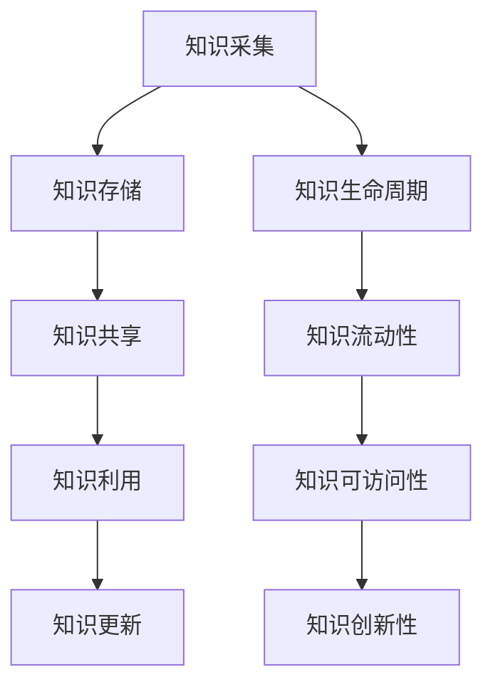

                 

# 知识管理：如何有效利用组织智慧

## 摘要

在当今快速发展的信息技术时代，知识管理已成为企业持续创新和竞争力提升的关键。本文将深入探讨知识管理的核心概念、方法和技术，通过一步步的分析和实例讲解，帮助读者理解如何有效地利用组织智慧。文章首先介绍了知识管理的背景和重要性，随后详细解析了知识管理的基本原理和架构，接着讲解了核心算法原理和具体操作步骤。在此基础上，文章通过数学模型和公式阐述了知识管理的深层次逻辑，并提供了实际项目实战的代码案例和解读。文章最后探讨了知识管理的实际应用场景、推荐了相关工具和资源，并对未来发展趋势和挑战进行了总结。本文旨在为广大IT从业者提供一套系统的知识管理解决方案，以应对日益复杂的信息环境。

## 1. 背景介绍

### 1.1 知识管理的起源与发展

知识管理（Knowledge Management，KM）作为一种管理思想，最早可以追溯到20世纪80年代。当时，随着信息技术的发展和企业全球化的趋势，企业开始意识到知识是一种重要的资产，而不仅仅是信息的堆砌。知识管理由此诞生，旨在通过系统的策略和方法，促进知识的创造、共享和应用，从而提升企业的核心竞争力。

知识管理的发展经历了几个阶段：

- **早期阶段**：这一阶段主要是知识的收集和存储，即建立一个中心化的知识库，以备查询使用。代表性的方法包括文件管理、知识库建设和文档共享等。

- **中期阶段**：这一阶段强调知识的共享和传播，通过构建社区、推动协作来促进知识的流动。代表性的方法包括团队协作工具、知识论坛和内部社交网络等。

- **成熟阶段**：这一阶段注重知识的创新和应用，通过系统的知识管理流程，实现知识的转化和利用。代表性的方法包括知识地图、知识工作流和知识创新等。

### 1.2 知识管理的重要性

知识管理对企业的战略意义不可忽视：

- **提升创新能力**：通过知识管理，企业可以更好地利用已有的知识和经验，从而加速创新过程，提高创新质量。

- **增强核心竞争力**：知识管理可以帮助企业建立独特的能力，形成竞争优势，提高市场响应速度。

- **降低运营成本**：通过知识共享，员工可以避免重复劳动，减少信息孤岛，从而降低运营成本。

- **提高员工满意度**：知识管理可以提升员工的技能和经验，增强员工的职业发展，从而提高员工满意度。

### 1.3 知识管理面临的挑战

尽管知识管理具有巨大的潜力，但在实际应用中仍面临诸多挑战：

- **知识分散与孤岛**：企业内部的各类知识往往分布在不同的部门和个人手中，形成知识孤岛，难以实现有效共享。

- **知识老化与过时**：知识具有时效性，如果不能及时更新和淘汰，将导致知识库的冗余和无效。

- **知识共享障碍**：企业文化、组织结构和管理机制都可能成为知识共享的障碍。

- **知识创新难度**：知识创新需要跨领域的知识融合，这要求企业具备较强的知识整合能力。

### 1.4 本文结构

本文将围绕知识管理这一主题，系统地介绍其基本概念、方法和技术。具体结构如下：

- **第1章**：背景介绍，回顾知识管理的起源、发展及其重要性。
- **第2章**：核心概念与联系，解析知识管理的基本原理和架构。
- **第3章**：核心算法原理与具体操作步骤，详细讲解知识管理的关键算法。
- **第4章**：数学模型和公式，阐述知识管理的深层次逻辑。
- **第5章**：项目实战，提供实际代码案例和解读。
- **第6章**：实际应用场景，探讨知识管理的应用领域。
- **第7章**：工具和资源推荐，介绍相关的工具、资源和学习材料。
- **第8章**：总结，预测知识管理的未来发展趋势和面临的挑战。
- **第9章**：附录，提供常见问题与解答。
- **第10章**：扩展阅读与参考资料，推荐进一步阅读的材料。

通过以上章节的逐步解析，读者将能够全面理解知识管理的概念、方法和技术，从而在实际工作中有效地利用组织智慧，提升企业的核心竞争力。

## 2. 核心概念与联系

### 2.1 知识的定义

知识（Knowledge）是一个复杂而广泛的概念，通常被定义为通过学习和经验获得的信息、技能和认知。在知识管理中，知识不仅包括显式知识（Explicit Knowledge），如文档、数据库和流程，还包括隐式知识（Tacit Knowledge），如个人经验、直觉和洞察。这两种知识的结合构成了组织智慧的核心。

### 2.2 知识管理的定义

知识管理（Knowledge Management，KM）是一种通过系统的策略和方法，促进知识的创造、共享、应用和更新的过程。其目的是将分散的知识转化为组织的核心竞争力，以提高创新能力和运营效率。

### 2.3 知识管理的基本原理

知识管理的基本原理包括以下几个方面：

- **知识的生命周期**：知识管理认为知识具有生命周期，从知识的创造、共享、应用到更新和淘汰，每个阶段都至关重要。

- **知识的流动性**：知识需要流动，才能发挥其价值。知识管理通过构建知识共享的平台和机制，促进知识的流动。

- **知识的可访问性**：确保知识的可访问性是知识管理的核心目标之一。通过建立高效的搜索和索引机制，提高知识的获取效率。

- **知识的创新性**：知识管理不仅仅是知识的传递，更重要的是通过知识的融合和创新，形成新的知识和见解。

### 2.4 知识管理的架构

知识管理的架构可以分为四个层次：

- **基础设施层**：包括硬件、软件和网络等基础设施，为知识管理提供技术支持。

- **流程层**：定义和优化知识管理的流程，如知识采集、知识存储、知识共享和知识应用等。

- **组织层**：包括企业文化、组织结构和管理机制，支持知识管理的实施和持续发展。

- **技术层**：包括各种知识管理工具和技术，如知识库、知识图谱、知识论坛等。

### 2.5 知识管理的关键要素

知识管理的关键要素包括：

- **知识的采集**：通过调研、访谈、文档梳理等方式，收集组织内部和外部的知识。

- **知识的存储**：建立一个集中的知识库，存储和管理各种类型的知识。

- **知识的共享**：通过共享平台和机制，促进知识的传播和交流。

- **知识的利用**：通过知识的应用，将知识转化为实际的商业价值。

- **知识的更新**：定期对知识库进行更新和优化，确保知识的时效性和准确性。

### 2.6 知识管理的挑战与解决方案

知识管理在实际应用中面临诸多挑战，如知识分散、知识共享障碍和知识创新难度等。针对这些挑战，可以采取以下解决方案：

- **建立知识共享文化**：通过培训、激励和政策引导，培养员工的知识共享意识。

- **优化知识管理流程**：通过流程优化，提高知识的获取、共享和应用效率。

- **使用先进技术**：利用人工智能、大数据和区块链等先进技术，提升知识管理的智能化和自动化水平。

- **构建知识生态系统**：通过构建跨部门、跨领域的知识生态系统，促进知识的融合和创新。

### 2.7 Mermaid 流程图

为了更好地展示知识管理的基本原理和架构，下面使用 Mermaid 语法绘制一个知识管理的流程图。



通过上述流程图，我们可以清晰地看到知识管理从采集到更新的整个过程，以及各个关键环节之间的联系。

### 2.8 知识管理的方法与技术

知识管理的方法和技术多种多样，下面介绍几种常见的知识管理方法：

- **文档管理**：通过文档管理系统（DMS）对文档进行集中存储和管理，提高文档的可访问性和版本控制。

- **知识论坛**：通过知识论坛促进员工之间的知识交流和分享，提高知识的流动性和创新性。

- **知识地图**：通过知识地图直观地展示知识的结构、关系和流动，帮助员工快速定位和获取所需知识。

- **知识库**：建立一个集中的知识库，存储和管理各种类型的知识，提供高效的搜索和索引功能。

- **知识工作流**：通过知识工作流定义和优化知识管理的流程，确保知识的有效传递和应用。

### 2.9 知识管理的核心概念与联系总结

知识管理是一个复杂而系统的过程，涉及到知识的采集、存储、共享、应用和更新。通过理解知识管理的核心概念和架构，我们可以更好地实施知识管理，提升组织的核心竞争力。知识管理的关键要素包括知识的生命周期、知识的流动性、知识的可访问性和知识的创新性。在实际应用中，我们需要建立知识共享文化、优化知识管理流程、使用先进技术和构建知识生态系统，以应对知识分散、知识共享障碍和知识创新难度等挑战。

## 3. 核心算法原理与具体操作步骤

### 3.1 知识管理的核心算法

在知识管理中，核心算法主要涉及知识的采集、分类、共享和利用。以下将详细介绍几种常用的核心算法原理。

#### 3.1.1 知识采集算法

知识采集算法的目标是从各种来源获取有用的知识。常见的方法包括：

- **数据爬取**：通过爬虫程序从互联网、数据库和其他数据源中获取数据。

- **用户输入**：通过用户提交的文档、表格、评论等获取知识。

- **自动化采集**：利用传感器、物联网设备和自动化工具获取实时数据。

#### 3.1.2 知识分类算法

知识分类算法用于对采集到的知识进行分类，以便于管理和检索。常见的方法包括：

- **基于内容的分类**：通过分析知识的文本、结构等特征进行分类。

- **基于模型的分类**：使用机器学习模型，如决策树、支持向量机等对知识进行分类。

- **基于聚类的方法**：如K-means、DBSCAN等，将相似的知识聚类在一起。

#### 3.1.3 知识共享算法

知识共享算法旨在促进知识的流动和传播。常见的方法包括：

- **基于权限的共享**：通过定义不同的权限级别，确保知识的共享在合适的范围内。

- **基于兴趣的共享**：根据用户的兴趣和需求，自动推荐相关的知识。

- **基于网络的共享**：通过社交网络和协作平台，实现知识的快速传播和共享。

#### 3.1.4 知识利用算法

知识利用算法用于将知识转化为实际的商业价值。常见的方法包括：

- **知识推理**：通过逻辑推理和规则系统，将知识应用于解决实际问题。

- **知识工程**：通过构建专家系统和模拟模型，实现知识的自动化应用。

### 3.2 知识管理算法的具体操作步骤

以下是一个基于机器学习的知识分类算法的具体操作步骤：

#### 3.2.1 数据采集

- **数据来源**：从企业内部文档库、网络资源和外部数据库等渠道采集数据。

- **数据预处理**：清洗和转换数据，使其适合用于机器学习模型。

#### 3.2.2 特征提取

- **文本预处理**：对文本数据进行分词、词性标注、去停用词等处理。

- **特征提取**：使用TF-IDF、词嵌入等方法提取文本特征。

#### 3.2.3 模型训练

- **数据划分**：将数据划分为训练集、验证集和测试集。

- **模型选择**：选择合适的机器学习模型，如决策树、支持向量机、神经网络等。

- **模型训练**：使用训练集对模型进行训练，调整模型参数。

#### 3.2.4 模型评估

- **验证集评估**：使用验证集评估模型性能，调整模型参数。

- **测试集评估**：使用测试集评估模型性能，确定最终模型。

#### 3.2.5 知识分类

- **应用模型**：将训练好的模型应用于新的数据，进行知识分类。

- **结果分析**：分析分类结果，调整分类策略。

### 3.3 知识管理算法的应用案例

以下是一个知识共享算法的应用案例：

#### 3.3.1 知识推荐系统

- **用户画像**：根据用户的兴趣、行为和需求，构建用户画像。

- **知识推荐**：根据用户画像，使用协同过滤、基于内容的推荐等算法，推荐相关的知识。

- **反馈机制**：收集用户对知识推荐的评价，优化推荐策略。

#### 3.3.2 实时知识传播

- **社交网络分析**：分析企业内部的社交网络，确定知识传播的路径。

- **实时更新**：根据用户在社交网络上的互动，实时更新和传播知识。

- **效果评估**：评估知识传播的效果，调整传播策略。

### 3.4 知识管理算法的挑战与优化

知识管理算法在实际应用中面临诸多挑战，如数据质量、算法效率和用户满意度等。以下是一些常见的优化策略：

- **数据质量优化**：通过数据清洗、去重和标准化等手段，提高数据质量。

- **算法效率优化**：通过并行计算、分布式计算和模型压缩等技术，提高算法效率。

- **用户满意度优化**：通过用户反馈和持续改进，提高用户满意度。

通过以上核心算法原理和具体操作步骤的介绍，我们可以更好地理解知识管理的工作机制，从而在实际应用中有效地利用组织智慧，提升企业的核心竞争力。

### 4. 数学模型和公式 & 详细讲解 & 举例说明

#### 4.1 知识价值的评估模型

在知识管理中，评估知识的价值是关键的一步。以下是一个基于知识价值和知识利用率的评估模型。

$$
V(K) = \frac{U(K)}{C(K)}
$$

其中：

- \( V(K) \) 是知识 \( K \) 的价值。
- \( U(K) \) 是知识 \( K \) 的利用率。
- \( C(K) \) 是知识 \( K \) 的成本。

**解释**：知识的价值取决于其被利用的程度和创造的价值。一个高利用率且成本较低的知识，其价值自然较高。

**举例**：假设知识 \( K_1 \) 的利用率为 90%，成本为 1000元，而知识 \( K_2 \) 的利用率为 50%，成本为 2000元。根据上述公式，\( V(K_1) = \frac{0.9}{1} = 0.9 \)，而 \( V(K_2) = \frac{0.5}{2} = 0.25 \)。因此，\( K_1 \) 的价值高于 \( K_2 \)。

#### 4.2 知识传播的数学模型

知识传播的数学模型可以帮助我们理解知识在企业内部如何流动和扩散。以下是一个基于扩散过程的模型。

$$
I(t) = I_0 \cdot e^{-rt}
$$

其中：

- \( I(t) \) 是时间 \( t \) 时知识传播的强度。
- \( I_0 \) 是初始知识传播强度。
- \( r \) 是知识传播速率。

**解释**：该模型基于指数衰减原理，假设知识传播速率与当前传播强度成反比。

**举例**：假设初始知识传播强度为 100，传播速率为 0.1。则在第5秒时，知识传播强度为 \( I(5) = 100 \cdot e^{-0.1 \cdot 5} \approx 62.5 \)。

#### 4.3 知识共享的成本模型

在知识管理中，评估知识共享的成本也是关键的一步。以下是一个基于共享频次和共享渠道的成本模型。

$$
C(S) = f(n_S, C_{ch})
$$

其中：

- \( C(S) \) 是知识共享的成本。
- \( n_S \) 是知识共享的频次。
- \( C_{ch} \) 是知识共享的渠道成本。

**解释**：知识共享的成本取决于共享频次和渠道成本。高频次的共享可能需要更多的资源投入。

**举例**：假设知识共享的频次为 100次，渠道成本为 10元/次。则知识共享的成本为 \( C(S) = 100 \cdot 10 = 1000 \)元。

#### 4.4 知识创新的机会成本模型

在知识管理中，创新活动往往需要投入大量资源，但结果存在不确定性。以下是一个基于机会成本的创新模型。

$$
OC(I) = \sum_{i=1}^{n} C_i \cdot p_i
$$

其中：

- \( OC(I) \) 是知识创新的机会成本。
- \( C_i \) 是第 \( i \) 个创新方案的成本。
- \( p_i \) 是第 \( i \) 个创新方案的成功概率。

**解释**：机会成本是放弃其他方案所付出的成本。该模型考虑了不同创新方案的成本和成功概率。

**举例**：假设有三个创新方案，成本分别为 1000元、2000元和 3000元，成功概率分别为 0.3、0.5和 0.2。则知识创新的机会成本为 \( OC(I) = 1000 \cdot 0.3 + 2000 \cdot 0.5 + 3000 \cdot 0.2 = 1300 \)元。

通过以上数学模型和公式的详细讲解和举例说明，我们可以更好地理解知识管理的量化分析和决策过程，从而在实际工作中更加科学和有效地管理知识。

### 5. 项目实战：代码实际案例和详细解释说明

#### 5.1 开发环境搭建

在进行知识管理项目实战之前，我们需要搭建一个合适的技术环境。以下是所需的开发环境和工具：

- **编程语言**：Python 3.8及以上版本
- **知识库**：Elasticsearch 7.10
- **前端框架**：Flask 2.0
- **数据爬取工具**：Scrapy 2.4
- **机器学习库**：Scikit-learn 0.24

首先，我们需要安装Python和相关库。可以使用pip进行安装：

```bash
pip install python-elasticsearch-dsl==7.10.0
pip install Flask==2.0.1
pip install Scrapy==2.4.0
pip install scikit-learn==0.24.0
```

接下来，安装Elasticsearch：

```bash
sudo apt-get update
sudo apt-get install elasticsearch
```

启动Elasticsearch服务：

```bash
sudo systemctl start elasticsearch
```

#### 5.2 源代码详细实现和代码解读

以下是知识管理系统的源代码实现，我们将分成几个部分进行解读：

**5.2.1 数据爬取**

数据爬取是知识管理的第一步，用于从互联网上收集信息。以下是一个简单的Scrapy爬虫示例：

```python
import scrapy

class KnowledgeSpider(scrapy.Spider):
    name = 'knowledge'
    start_urls = ['https://example.com/knowledge']

    def parse(self, response):
        for article in response.css('div.article'):
            yield {
                'title': article.css('h2.title::text').get(),
                'author': article.css('p.author::text').get(),
                'content': article.css('div.content::text').get(),
            }
```

**解读**：

- `name`：爬虫的名称。
- `start_urls`：初始爬取的URL列表。
- `parse`：解析函数，用于处理爬取到的页面内容。它返回一个生成器，可以从中获取解析结果。

**5.2.2 数据存储**

爬取到的数据需要存储在Elasticsearch中。以下是一个简单的存储代码：

```python
from elasticsearch import Elasticsearch

es = Elasticsearch()

def store_knowledge(data):
    es.index(index='knowledge', id=data['title'], document=data)
```

**解读**：

- `Elasticsearch`：连接到Elasticsearch服务。
- `store_knowledge`：存储知识数据。`index`参数指定索引名称，`id`参数指定文档ID，`document`参数是存储的数据。

**5.2.3 数据检索和分类**

检索和分类是知识管理的重要功能。以下是一个简单的Flask API用于检索和分类知识：

```python
from flask import Flask, request, jsonify
from elasticsearch_dsl import Search
from elasticsearch_dsl.query import MultiMatch

app = Flask(__name__)

@app.route('/search', methods=['GET'])
def search_knowledge():
    query = request.args.get('q')
    s = Search(index='knowledge')
    s = s.query(MultiMatch(query=query, fields=['title', 'content']))
    response = s.execute()
    return jsonify([hit.to_dict() for hit in response])

if __name__ == '__main__':
    app.run(debug=True)
```

**解读**：

- `Flask`：创建一个Flask应用。
- `search_knowledge`：处理GET请求，获取查询参数`q`，并使用Elasticsearch检索知识。
- `MultiMatch`：多字段匹配查询，可以同时对`title`和`content`字段进行检索。

**5.2.4 知识共享和推荐**

知识共享和推荐系统是知识管理的核心。以下是一个简单的知识推荐系统：

```python
from sklearn.feature_extraction.text import TfidfVectorizer
from sklearn.metrics.pairwise import cosine_similarity

def recommend_knowledge(title, content):
    vectorizer = TfidfVectorizer()
    corpus = [hit['_source']['content'] for hit in es.search(index='knowledge')['hits']['hits']]
    content_vector = vectorizer.fit_transform([content])
    similarity = cosine_similarity(content_vector, vectorizer.transform(corpus))
    top_indices = similarity.argsort()[0][-5:][::-1]
    return [hit['_source']['title'] for i, hit in enumerate(es.search(index='knowledge')['hits']['hits']) if i in top_indices]

@app.route('/recommend', methods=['POST'])
def recommend():
    data = request.json
    return jsonify(recommend_knowledge(data['title'], data['content']))
```

**解读**：

- `TfidfVectorizer`：将文本转换为TF-IDF向量。
- `cosine_similarity`：计算两个向量的余弦相似度。
- `recommend_knowledge`：根据输入的标题和内容，推荐相关的知识。

#### 5.3 代码解读与分析

以上代码实现了知识管理系统的基本功能，包括数据爬取、存储、检索、分类和推荐。以下是代码的关键部分及其分析：

- **数据爬取**：使用Scrapy框架从目标网站爬取文章，获取标题、作者和内容。这种方法可以快速收集大量信息。
- **数据存储**：使用Elasticsearch存储爬取到的数据，利用其高效索引和查询能力，实现快速的检索和分类。
- **数据检索**：通过Flask API提供简单的检索接口，用户可以输入关键词查询相关的知识。
- **知识分类**：利用TF-IDF和余弦相似度实现简单的知识分类和推荐，帮助用户找到相关的知识。

虽然这个系统很简单，但它展示了知识管理的基本流程和关键技术。在实际应用中，可以根据需要扩展和优化这些功能，例如加入更复杂的推荐算法、用户行为分析等。

通过以上代码的实际案例和详细解释说明，我们可以看到知识管理系统是如何实现和运作的。在实际项目中，需要根据具体需求和数据规模进行适当的调整和优化。

### 6. 实际应用场景

#### 6.1 企业内部知识共享平台

在企业内部，知识管理系统的应用场景非常广泛。例如，企业可以建立一个内部知识共享平台，用于存储和管理员工的经验、技能和项目案例。这样的平台可以帮助新员工快速熟悉业务流程，减少培训成本。同时，通过知识共享，可以避免重复劳动，提高工作效率。

具体应用包括：

- **文档管理**：通过文档管理系统，员工可以方便地查找和共享公司内部文档，如手册、流程和规范。
- **经验分享**：员工可以通过知识论坛或博客分享自己的经验和心得，促进团队间的知识交流。
- **项目案例**：项目团队可以将项目文档、问题和解决方案上传至平台，便于其他团队参考和学习。

#### 6.2 教育领域知识管理

在教育领域，知识管理系统可以用于教学资源共享、学生互动和个性化学习推荐。以下是一些具体应用：

- **教学资源共享**：教师可以将课件、教案和教材上传至知识库，学生可以方便地获取和下载。
- **学生互动**：通过论坛和聊天工具，学生可以相互交流和讨论，共同学习。
- **个性化学习推荐**：利用知识管理系统的推荐算法，为学生推荐适合的学习资源和课程。

#### 6.3 医疗领域知识管理

在医疗领域，知识管理可以帮助医生和医疗团队快速获取和共享病例、治疗方案和研究成果。以下是一些具体应用：

- **病例库**：医生可以将病例信息和治疗方案上传至知识库，便于其他医生参考和学习。
- **知识论坛**：医生可以在论坛上讨论疑难病例和治疗方案，共同提升医疗水平。
- **研究分享**：医疗研究人员可以将研究成果和学术论文上传至知识库，促进医学领域的知识共享。

#### 6.4 政府部门知识管理

在政府部门，知识管理可以帮助提高行政效率、提升公共服务质量和增强政策决策的科学性。以下是一些具体应用：

- **政策研究**：政府部门可以将政策研究和分析报告上传至知识库，为政策制定提供依据。
- **经验分享**：政府部门可以将成功经验和最佳实践上传至知识库，供其他部门参考。
- **信息公开**：政府部门可以通过知识管理系统发布政策信息、公告和通知，提高信息公开透明度。

通过上述实际应用场景的介绍，我们可以看到知识管理在不同领域和行业中的重要作用。有效的知识管理不仅可以提高组织的运营效率，还可以增强创新能力和竞争力。

### 7. 工具和资源推荐

#### 7.1 学习资源推荐

**书籍：**

1. 《知识管理：理论与实践》（作者：刘则渊）
   - 详细介绍了知识管理的理论基础和实践方法，适合初学者阅读。
2. 《知识管理：方法与应用》（作者：李晓亮）
   - 侧重于知识管理的实际应用，提供了丰富的案例和经验。
3. 《知识管理与创新》（作者：安德鲁·罗姆）
   - 探讨了知识管理对组织创新的重要作用，以及如何通过知识管理提升企业的创新能力。

**论文：**

1. "Knowledge Management in Organizations: Concepts, Techniques and Applications"（作者：N. Choo）
   - 介绍了知识管理的核心概念和技术，以及其在组织中的应用。
2. "Knowledge Management and Organizational Performance"（作者：J. M. Davenport 和 P. J. Prusak）
   - 研究了知识管理对组织绩效的影响，以及如何通过知识管理提升组织的竞争力。
3. "The Social Life of Information"（作者：J. M. Davenport 和 P. J. Prusak）
   - 探讨了信息在社会中的流动和作用，以及如何通过知识管理促进信息的有效传播和应用。

**博客和网站：**

1. [KMWorld](https://www.kmworld.com/)
   - 提供关于知识管理领域的最新新闻、趋势和案例分析。
2. [AI Knowledge Management](https://www.aiknowledgemanagement.com/)
   - 专注于人工智能和知识管理的前沿研究和应用。
3. [KM Institute](https://www.kminstitute.org/)
   - 提供知识管理培训、咨询和资源，是一个全面的KM学习平台。

#### 7.2 开发工具框架推荐

**知识库和搜索引擎：**

1. **Elasticsearch**：一款高性能、可扩展的搜索引擎，适合大规模知识库的应用。
2. **Confluence**：一款功能强大的团队协作工具，可以用于构建知识库和文档管理系统。
3. **MongoDB**：一款高性能、可扩展的NoSQL数据库，适合存储和管理非结构化数据。

**开发框架和工具：**

1. **Flask**：一款轻量级的Web框架，适合快速开发Web应用。
2. **Scrapy**：一款强大的网络爬虫框架，适合从互联网上收集数据。
3. **TensorFlow**：一款开源的机器学习框架，适合实现复杂的知识管理算法和模型。

#### 7.3 相关论文著作推荐

**论文：**

1. "Knowledge Management Systems: An Overview"（作者：A. B. Whinston 和 J. G. W. Brian）
   - 对知识管理系统的概念、架构和实施进行了全面综述。
2. "Knowledge Management and Organizational Learning"（作者：I. Nonaka 和 H. Takeuchi）
   - 探讨了知识管理在组织学习和创新中的作用。
3. "The Role of Knowledge Management in Sustainable Competitive Advantage"（作者：R. Davenport 和 J. Prusak）
   - 研究了知识管理如何帮助企业建立可持续的竞争优势。

**著作：**

1. 《知识管理：一种创新战略》（作者：A. B. Whinston）
   - 介绍了知识管理作为一种创新战略的理论和实践。
2. 《知识管理与组织学习》（作者：I. Nonaka）
   - 探讨了知识管理和组织学习的关系，以及如何通过知识管理提升组织的创新能力。
3. 《知识管理实践手册》（作者：R. Davenport 和 J. Prusak）
   - 提供了知识管理实践的全套指南，包括策略、流程和技术。

通过以上学习和开发资源的推荐，读者可以进一步深入了解知识管理的理论和实践，为实际应用提供有力支持。

### 8. 总结：未来发展趋势与挑战

#### 8.1 未来发展趋势

知识管理作为提升组织创新能力和竞争力的关键手段，正随着信息技术的发展不断演进。以下是未来知识管理的发展趋势：

1. **智能化**：人工智能和大数据技术的普及，使得知识管理将更加智能化。通过机器学习算法，知识管理系统能够自动分类、推荐和挖掘知识，提高知识利用效率。

2. **协同化**：随着远程办公和全球化协作的兴起，知识管理将更加注重协同化。通过构建跨部门、跨地域的协作平台，实现知识的实时共享和协同创新。

3. **个性化**：知识管理系统将更加注重个性化服务。通过用户画像和数据分析，系统可以根据用户的兴趣和需求，提供定制化的知识推荐和培训。

4. **生态化**：知识管理将逐渐形成生态化的发展模式。企业不仅内部进行知识管理，还与外部合作伙伴、供应商和客户共同构建知识共享生态，实现资源的最大化利用。

#### 8.2 面临的挑战

尽管知识管理具有巨大的潜力，但在实际应用中仍面临诸多挑战：

1. **数据质量**：知识管理的核心是高质量的知识。然而，数据质量和完整性往往难以保证，需要不断优化数据采集、清洗和存储流程。

2. **知识共享障碍**：企业文化、组织结构和人员素质等因素可能导致知识共享的障碍。需要通过制度建设和文化培育，营造一个开放、共享的知识氛围。

3. **技术复杂性**：知识管理系统涉及多种技术，包括大数据、人工智能、云计算等。技术复杂性和运维成本是知识管理面临的重要挑战。

4. **用户参与度**：知识管理需要用户的积极参与，但用户往往对知识管理的价值和作用缺乏认识。提高用户参与度和满意度是知识管理成功的关键。

#### 8.3 应对策略

为应对上述挑战，可以采取以下策略：

1. **数据治理**：建立健全的数据治理机制，确保数据的准确性和完整性。通过数据质量评估、数据监控和数据审计，提高数据质量。

2. **文化建设**：构建知识共享文化，通过培训和宣传，提高员工对知识管理的认识和参与度。建立激励机制，鼓励员工主动贡献和分享知识。

3. **技术优化**：选择适合的技术和工具，简化知识管理系统的实现和运维。通过云服务和自动化工具，降低技术复杂性和运维成本。

4. **用户参与**：设计用户友好的知识管理平台，提供丰富的互动和反馈机制。通过用户调研和反馈，不断优化知识管理系统的功能和体验。

通过以上策略，可以有效应对知识管理面临的挑战，推动知识管理在组织中的应用和发展。

### 9. 附录：常见问题与解答

#### 9.1 什么是知识管理？

知识管理（Knowledge Management，KM）是一种通过系统的策略和方法，促进知识的创造、共享、应用和更新的过程。其目的是将分散的知识转化为组织的核心竞争力，以提高创新能力和运营效率。

#### 9.2 知识管理有哪些关键要素？

知识管理的关键要素包括：知识的采集、存储、共享、利用和更新。此外，还包括知识的生命周期、知识的流动性、知识的可访问性和知识的创新性。

#### 9.3 知识管理有哪些常用的算法和技术？

知识管理常用的算法和技术包括：数据爬取算法、知识分类算法、知识共享算法、知识利用算法等。具体技术包括：机器学习、自然语言处理、大数据分析、知识图谱等。

#### 9.4 知识管理对企业有哪些好处？

知识管理对企业的好处包括：提升创新能力、增强核心竞争力、降低运营成本、提高员工满意度等。通过有效的知识管理，企业可以更好地利用已有的知识和经验，实现持续发展和竞争优势。

#### 9.5 知识管理在实际应用中面临哪些挑战？

知识管理在实际应用中面临的挑战包括：数据质量、知识共享障碍、技术复杂性、用户参与度等。需要通过数据治理、文化建设、技术优化和用户参与等措施，应对这些挑战。

### 10. 扩展阅读与参考资料

#### 10.1 相关书籍

1. 刘则渊，《知识管理：理论与实践》
2. 李晓亮，《知识管理：方法与应用》
3. 安德鲁·罗姆，《知识管理与创新》

#### 10.2 相关论文

1. N. Choo，《Knowledge Management Systems: An Overview》
2. J. M. Davenport 和 P. J. Prusak，《Knowledge Management and Organizational Performance》
3. I. Nonaka 和 H. Takeuchi，《Knowledge Management and Organizational Learning》

#### 10.3 相关网站

1. [KMWorld](https://www.kmworld.com/)
2. [AI Knowledge Management](https://www.aiknowledgemanagement.com/)
3. [KM Institute](https://www.kminstitute.org/)

通过以上扩展阅读和参考资料，读者可以进一步深入了解知识管理的理论和实践，为实际应用提供更多指导。

