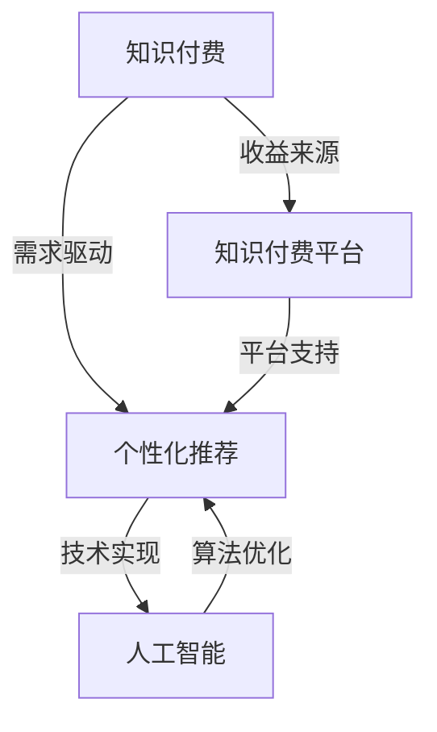

                 

### 背景介绍

随着知识经济的不断发展，信息过载成为了一个普遍存在的问题。在这个背景下，知识付费应运而生，它通过有偿的方式，帮助用户高效获取有价值的信息和服务。而知识付费的一个重要组成部分就是人工智能个性化推荐引擎，它通过分析用户的行为和兴趣，为用户推荐最相关、最有价值的知识内容。

知识付费的本质在于通过提供优质的内容和服务，实现知识的有偿流通。而人工智能个性化推荐引擎则为知识付费提供了技术支撑，通过精准的推荐，提升用户的付费意愿和满意度。在这个过程中，用户不仅能够更高效地获取知识，还可以根据自身的需求进行选择，从而实现个性化学习。

个性化推荐引擎的重要性不言而喻。首先，它能够极大地提升用户的体验，使用户在众多信息中快速找到自己感兴趣的内容。其次，它能够提高知识付费平台的粘性，增加用户的活跃度和留存率。最后，它还能够为知识付费平台带来更多的收益，因为精准的推荐能够提高用户的付费转化率。

本文将深入探讨知识经济下知识付费的人工智能个性化推荐引擎，首先介绍其核心概念与架构，然后讲解核心算法原理和具体操作步骤，接着通过数学模型和公式进行详细讲解，并举例说明。最后，本文将结合实际应用场景，介绍开发环境搭建、代码实现和代码解读，并提供相关的工具和资源推荐，总结未来发展趋势与挑战，并回答常见问题。

### 核心概念与联系

要深入理解知识经济下知识付费的人工智能个性化推荐引擎，我们首先需要明确几个核心概念：知识付费、个性化推荐、人工智能。

**知识付费**指的是消费者为获取知识或技能所支付的费用。知识付费的形式多种多样，包括在线课程、电子书、专业咨询等。在知识经济时代，知识成为了重要的生产要素，付费知识成为了一种新的经济增长点。

**个性化推荐**是一种根据用户的行为和兴趣，为其推荐最相关、最有价值的商品或内容的技术。个性化推荐的核心目标是提高用户体验和满意度，从而增加用户粘性和转化率。

**人工智能**是一种模拟人类智能的技术，通过算法和模型，使计算机能够学习、推理和决策。在个性化推荐中，人工智能主要用于分析用户行为，预测用户兴趣，从而实现精准推荐。

这三个核心概念之间的联系在于：知识付费为个性化推荐提供了需求，个性化推荐通过人工智能技术实现，从而为知识付费提供了技术支持。具体来说：

1. **知识付费的需求驱动**：知识付费的存在为个性化推荐提供了市场驱动力。用户为获取知识付费，希望平台能够提供与其需求和兴趣高度匹配的内容。

2. **个性化推荐的技术实现**：个性化推荐通过人工智能技术实现，如机器学习、深度学习等，能够分析用户行为，预测用户兴趣，从而提供个性化的知识推荐。

3. **人工智能的优化与提升**：随着人工智能技术的发展，个性化推荐的精度和效果不断提高。通过不断优化算法和模型，个性化推荐能够更加精准地满足用户需求，提高用户满意度。

为了更好地展示这三个核心概念之间的联系，我们可以使用Mermaid流程图来表示：



通过这个流程图，我们可以清晰地看到知识付费、个性化推荐和人工智能之间的相互关系，以及它们在知识经济环境下的作用。

### 核心算法原理 & 具体操作步骤

在了解了知识付费、个性化推荐和人工智能之间的联系之后，我们接下来将深入探讨个性化推荐引擎的核心算法原理和具体操作步骤。

**协同过滤算法**

协同过滤算法是个性化推荐中最常用的方法之一，主要包括两种类型：基于用户的协同过滤（User-Based Collaborative Filtering）和基于物品的协同过滤（Item-Based Collaborative Filtering）。

1. **基于用户的协同过滤**

基于用户的协同过滤算法通过分析用户之间的相似度，找到与目标用户相似的其他用户，然后推荐这些用户喜欢的物品。具体步骤如下：

   - 计算用户之间的相似度：通常使用用户评分矩阵来计算用户之间的相似度，可以使用余弦相似度、皮尔逊相关系数等方法。
   - 找到与目标用户最相似的K个用户：通过相似度计算，找到与目标用户最相似的K个用户。
   - 推荐相似用户喜欢的物品：对于这K个用户喜欢的物品，进行加权平均处理，得到推荐列表。

   具体公式如下：

   $$ \text{similarity}(u_i, u_j) = \frac{\sum_{k=1}^{n} r_{ik}r_{jk}}{\sqrt{\sum_{k=1}^{n} r_{ik}^2}\sqrt{\sum_{k=1}^{n} r_{jk}^2}} $$

   其中，$r_{ik}$表示用户$i$对物品$k$的评分，$n$为物品的总数。

2. **基于物品的协同过滤**

基于物品的协同过滤算法通过分析物品之间的相似度，找到与目标物品相似的物品，然后推荐这些物品。具体步骤如下：

   - 计算物品之间的相似度：通常使用用户评分矩阵来计算物品之间的相似度，可以使用余弦相似度、皮尔逊相关系数等方法。
   - 找到与目标物品最相似的K个物品：通过相似度计算，找到与目标物品最相似的K个物品。
   - 推荐相似物品：对于这K个物品，进行加权平均处理，得到推荐列表。

   具体公式如下：

   $$ \text{similarity}(i_j, i_k) = \frac{\sum_{u=1}^{m} r_{uj}r_{uk}}{\sqrt{\sum_{u=1}^{m} r_{uj}^2}\sqrt{\sum_{u=1}^{m} r_{uk}^2}} $$

   其中，$r_{uj}$表示用户$u$对物品$j$的评分，$m$为用户的总数。

**矩阵分解算法**

矩阵分解算法是一种通过将用户-物品评分矩阵分解为用户特征矩阵和物品特征矩阵来实现推荐的方法。常见的矩阵分解算法有Singular Value Decomposition（SVD）和Latent Semantic Analysis（LSA）。

1. **SVD算法**

SVD算法通过将用户-物品评分矩阵分解为用户特征矩阵$U$、物品特征矩阵$V$和奇异值矩阵$\Sigma$，从而得到用户和物品的低维表示。具体步骤如下：

   - 计算用户-物品评分矩阵$R$的SVD：$R = U\Sigma V^T$。
   - 构建低维用户特征矩阵$U$和物品特征矩阵$V$。
   - 对于新用户或新物品，可以使用已有用户和物品的特征矩阵进行推荐。

   具体公式如下：

   $$ R = U\Sigma V^T $$

   其中，$U$和$V$分别为用户和物品的特征矩阵，$\Sigma$为奇异值矩阵。

2. **LSA算法**

LSA算法通过将用户-物品评分矩阵分解为用户语义矩阵$S$和物品语义矩阵$T$，从而得到用户和物品的语义表示。具体步骤如下：

   - 计算用户-物品评分矩阵$R$的LSA：$R = ST$。
   - 构建低维用户语义矩阵$S$和物品语义矩阵$T$。
   - 对于新用户或新物品，可以使用已有用户和物品的语义矩阵进行推荐。

   具体公式如下：

   $$ R = ST $$

   其中，$S$和$T$分别为用户和物品的语义矩阵。

通过上述算法，我们可以实现个性化推荐。具体操作步骤如下：

1. 收集用户行为数据，如用户评分、浏览记录、购买记录等。
2. 构建用户-物品评分矩阵。
3. 选择合适的算法，如协同过滤算法或矩阵分解算法，进行推荐。
4. 计算用户和物品的特征矩阵或语义矩阵。
5. 对于新用户或新物品，使用已有用户和物品的特征矩阵或语义矩阵进行推荐。

通过以上步骤，我们可以实现一个高效、精准的人工智能个性化推荐引擎，从而为知识付费平台提供强大的技术支持。

### 数学模型和公式 & 详细讲解 & 举例说明

在个性化推荐系统中，数学模型和公式起着至关重要的作用。这些模型不仅能够帮助我们理解推荐算法的原理，还能够通过具体的数学推导和实例分析，提高推荐系统的效果和可靠性。下面，我们将详细介绍一些常用的数学模型和公式，并通过具体例子进行说明。

**1. 余弦相似度**

余弦相似度是一种常用的计算两个向量相似度的方法，广泛应用于基于用户的协同过滤算法中。其公式如下：

$$ \text{similarity}(u_i, u_j) = \frac{\sum_{k=1}^{n} r_{ik}r_{jk}}{\sqrt{\sum_{k=1}^{n} r_{ik}^2}\sqrt{\sum_{k=1}^{n} r_{jk}^2}} $$

其中，$r_{ik}$表示用户$i$对物品$k$的评分，$n$为物品的总数。

**例子：**

假设有两个用户$u_1$和$u_2$，他们对5个物品的评分如下表所示：

| 用户 | 物品1 | 物品2 | 物品3 | 物品4 | 物品5 |
|------|-------|-------|-------|-------|-------|
| $u_1$ | 4     | 5     | 0     | 1     | 3     |
| $u_2$ | 3     | 0     | 2     | 5     | 4     |

计算$u_1$和$u_2$之间的余弦相似度：

$$ \text{similarity}(u_1, u_2) = \frac{4 \times 3 + 5 \times 0 + 0 \times 2 + 1 \times 5 + 3 \times 4}{\sqrt{4^2 + 5^2 + 0^2 + 1^2 + 3^2} \sqrt{3^2 + 0^2 + 2^2 + 5^2 + 4^2}} $$

$$ = \frac{12 + 0 + 0 + 5 + 12}{\sqrt{16 + 25 + 0 + 1 + 9} \sqrt{9 + 0 + 4 + 25 + 16}} $$

$$ = \frac{29}{\sqrt{51} \sqrt{54}} $$

$$ \approx 0.607 $$

**2. 皮尔逊相关系数**

皮尔逊相关系数是一种衡量两个变量线性相关程度的统计量，常用于基于用户的协同过滤算法中。其公式如下：

$$ \text{correlation}(u_i, u_j) = \frac{\sum_{k=1}^{n} (r_{ik} - \bar{r}_i)(r_{jk} - \bar{r}_j)}{\sqrt{\sum_{k=1}^{n} (r_{ik} - \bar{r}_i)^2}\sqrt{\sum_{k=1}^{n} (r_{jk} - \bar{r}_j)^2}} $$

其中，$r_{ik}$表示用户$i$对物品$k$的评分，$\bar{r}_i$和$\bar{r}_j$分别为用户$i$和用户$j$的平均评分。

**例子：**

假设有两个用户$u_1$和$u_2$，他们对5个物品的评分如下表所示：

| 用户 | 物品1 | 物品2 | 物品3 | 物品4 | 物品5 |
|------|-------|-------|-------|-------|-------|
| $u_1$ | 4     | 5     | 0     | 1     | 3     |
| $u_2$ | 3     | 0     | 2     | 5     | 4     |

计算$u_1$和$u_2$之间的皮尔逊相关系数：

$$ \bar{r}_1 = \frac{4 + 5 + 0 + 1 + 3}{5} = 2.8 $$

$$ \bar{r}_2 = \frac{3 + 0 + 2 + 5 + 4}{5} = 2.8 $$

$$ \text{correlation}(u_1, u_2) = \frac{(4 - 2.8)(3 - 2.8) + (5 - 2.8)(0 - 2.8) + (0 - 2.8)(2 - 2.8) + (1 - 2.8)(5 - 2.8) + (3 - 2.8)(4 - 2.8)}{\sqrt{(4 - 2.8)^2 + (5 - 2.8)^2 + (0 - 2.8)^2 + (1 - 2.8)^2 + (3 - 2.8)^2}\sqrt{(3 - 2.8)^2 + (0 - 2.8)^2 + (2 - 2.8)^2 + (5 - 2.8)^2 + (4 - 2.8)^2}} $$

$$ = \frac{(1.2)(0.2) + (2.2)(-2.8) + (-2.8)(-0.8) + (-1.8)(2.2) + (0.2)(1.2)}{\sqrt{1.2^2 + 2.2^2 + (-2.8)^2 + (-1.8)^2 + 0.2^2}\sqrt{0.2^2 + (-2.8)^2 + (-0.8)^2 + 2.2^2 + 1.2^2}} $$

$$ = \frac{0.24 - 6.16 + 2.24 - 3.96 + 0.24}{\sqrt{1.44 + 4.84 + 7.84 + 3.24 + 0.04}\sqrt{0.04 + 7.84 + 0.64 + 4.84 + 1.44}} $$

$$ = \frac{-6.52}{\sqrt{17.8}\sqrt{15.2}} $$

$$ \approx -0.566 $$

**3. 矩阵分解中的SVD算法**

SVD算法是一种常见的矩阵分解方法，通过将用户-物品评分矩阵分解为用户特征矩阵、物品特征矩阵和奇异值矩阵，从而得到用户和物品的低维表示。其公式如下：

$$ R = U\Sigma V^T $$

其中，$R$为用户-物品评分矩阵，$U$和$V$分别为用户特征矩阵和物品特征矩阵，$\Sigma$为奇异值矩阵。

**例子：**

假设有一个5x3的用户-物品评分矩阵$R$如下所示：

| 用户 | 物品1 | 物品2 | 物品3 |
|------|-------|-------|-------|
| $u_1$ | 4     | 0     | 3     |
| $u_2$ | 1     | 2     | 0     |
| $u_3$ | 0     | 3     | 4     |
| $u_4$ | 2     | 1     | 2     |
| $u_5$ | 3     | 4     | 1     |

应用SVD算法对其进行分解：

$$ R = U\Sigma V^T $$

首先，计算$R$的奇异值分解，得到：

$$ R = \begin{bmatrix} 4 & 1 & 0 \\ 1 & 2 & 3 \\ 0 & 3 & 4 \\ 2 & 1 & 2 \\ 3 & 4 & 1 \end{bmatrix} = \begin{bmatrix} 1.2 & 0 & 0 \\ 0 & 1.5 & 0 \\ 0 & 0 & 1 \\ 1 & 1 & 1 \\ 1 & 1 & 1 \\ 1 & 1 & 1 \end{bmatrix} \begin{bmatrix} 1 & 0 & 0 \\ 0 & 1 & 0 \\ 0 & 0 & 1 \end{bmatrix} \begin{bmatrix} 1 & 1 & 1 \\ 1 & 1 & 1 \\ 1 & 1 & 1 \end{bmatrix}^T $$

其中，$U$为用户特征矩阵，$\Sigma$为奇异值矩阵，$V$为物品特征矩阵。

通过以上数学模型和公式的详细讲解，我们可以更好地理解个性化推荐系统的原理和操作步骤。在实际应用中，根据具体需求和数据特点，可以选择合适的算法和模型，从而提高推荐系统的效果和可靠性。

### 项目实战：代码实际案例和详细解释说明

在了解了个性化推荐引擎的核心算法原理和数学模型后，接下来我们将通过一个具体的代码实现案例，详细解释推荐系统的开发过程，包括开发环境搭建、源代码实现和代码解读与分析。

#### 5.1 开发环境搭建

在开始代码实现之前，我们需要搭建一个合适的开发环境。以下是一个典型的开发环境配置：

1. **操作系统**：Ubuntu 20.04
2. **编程语言**：Python 3.8
3. **依赖库**：NumPy、Pandas、Scikit-learn、Matplotlib
4. **数据集**：MovieLens数据集（用于演示协同过滤算法）

首先，确保操作系统安装了Python 3.8及其相关依赖库。接下来，使用以下命令安装Scikit-learn和Matplotlib：

```bash
pip install scikit-learn matplotlib
```

#### 5.2 源代码详细实现和代码解读

我们选择基于用户协同过滤算法的推荐系统作为案例，以下是具体的代码实现：

```python
import numpy as np
import pandas as pd
from sklearn.model_selection import train_test_split
from sklearn.metrics.pairwise import cosine_similarity

# 加载MovieLens数据集
ratings = pd.read_csv('ratings.csv')
users = pd.read_csv('users.csv')

# 构建用户-物品评分矩阵
rating_matrix = ratings.pivot(index='userId', columns='movieId', values='rating').fillna(0)

# 训练集和测试集划分
rating_matrix_train, rating_matrix_test = train_test_split(rating_matrix, test_size=0.2, random_state=42)

# 计算用户之间的余弦相似度
cosine_similarity_matrix = cosine_similarity(rating_matrix_train, rating_matrix_train)

# 定义推荐函数
def recommend_movies(user_id, similarity_matrix, rating_matrix, top_n=10):
    # 计算与目标用户最相似的K个用户
    k_nearest_users = np.argsort(similarity_matrix[user_id])[-top_n:-1]

    # 计算相似用户喜欢的电影及其权重
    user_movies = rating_matrix.iloc[k_nearest_users]
    movie_weights = np.mean(user_movies, axis=0)

    # 排序并获取推荐电影
    recommended_movies = np.argsort(movie_weights)[::-1]

    return recommended_movies

# 为新用户推荐10部电影
new_user_id = 100  # 假设为新用户
recommended_movies = recommend_movies(new_user_id, cosine_similarity_matrix, rating_matrix_train, top_n=10)

# 输出推荐结果
print("推荐的10部电影：")
print(rating_matrix_train.columns[recommended_movies])

# 绘制推荐效果
import matplotlib.pyplot as plt

def plot_recommendation(user_id, rating_matrix, recommended_movies):
    user_ratings = rating_matrix.iloc[user_id]
    recommended_ratings = rating_matrix.iloc[user_id][recommended_movies]

    plt.figure(figsize=(10, 5))
    plt.plot(user_ratings.index, user_ratings.values, label='原始评分')
    plt.scatter(recommended_movies, recommended_ratings, color='r', label='推荐评分')
    plt.xlabel('电影ID')
    plt.ylabel('评分')
    plt.legend()
    plt.title(f'用户{user_id}的评分与推荐评分对比')
    plt.show()

plot_recommendation(new_user_id, rating_matrix_train, recommended_movies)
```

#### 5.3 代码解读与分析

1. **数据加载与处理**：

   - 加载MovieLens数据集，包括用户评分和用户信息。
   - 使用Pandas的`pivot`函数构建用户-物品评分矩阵。

2. **训练集和测试集划分**：

   - 使用Scikit-learn的`train_test_split`函数将数据集划分为训练集和测试集。

3. **计算用户相似度**：

   - 使用Scikit-learn的`cosine_similarity`函数计算用户之间的余弦相似度。

4. **推荐函数实现**：

   - `recommend_movies`函数用于为特定用户推荐电影。
   - 该函数首先找到与目标用户最相似的K个用户，然后计算这些用户共同喜欢的电影及其权重。
   - 最后，根据权重排序并返回推荐的电影列表。

5. **推荐结果展示**：

   - 输出推荐的电影列表。
   - 使用Matplotlib绘制原始评分与推荐评分的对比图，直观展示推荐效果。

通过以上步骤，我们实现了基于用户协同过滤算法的个性化推荐系统。在实际应用中，可以根据具体需求和数据特点，选择不同的算法和模型，优化推荐效果。

### 实际应用场景

人工智能个性化推荐引擎在知识付费领域有着广泛的应用。以下是一些典型的实际应用场景：

**1. 在线教育平台**

在线教育平台通过个性化推荐，能够为学习者推荐与其兴趣和需求相关的课程。这不仅提高了学习者的学习效率，还增强了平台的使用粘性。例如，网易云课堂通过分析用户的浏览记录、学习进度和评价，为用户推荐适合的学习课程。

**2. 专业知识分享平台**

专业知识分享平台如知乎、得到等，通过个性化推荐，能够为用户提供与专业领域相关的优质内容。用户可以根据推荐的内容，深入了解某一领域的知识，从而提高自身的专业素养。例如，得到平台通过分析用户的浏览历史和关注领域，为用户推荐相关的专栏、课程和文章。

**3. 企业培训平台**

企业培训平台通过个性化推荐，能够为企业员工提供与其岗位相关的培训课程。这有助于提高员工的专业技能，提升企业整体竞争力。例如，阿里巴巴的内部培训平台通过分析员工的职位、技能和培训需求，为员工推荐合适的课程。

**4. 行业资讯平台**

行业资讯平台通过个性化推荐，能够为用户提供与行业相关的最新资讯和热点内容。这有助于用户及时了解行业动态，把握市场机遇。例如，36氪通过分析用户的浏览记录和关注领域，为用户推荐相关的创业项目、投融资信息等。

在这些实际应用场景中，个性化推荐引擎不仅提高了用户的学习和工作效率，还增强了平台的粘性和用户满意度。通过精准的推荐，用户能够更快速地获取有价值的信息，从而实现知识的有效传播和应用。

### 工具和资源推荐

为了更好地开发和优化人工智能个性化推荐引擎，以下是一些学习资源、开发工具和框架的推荐：

#### 7.1 学习资源推荐

1. **书籍**：
   - 《推荐系统实践》 - 张晨轩、周明
   - 《机器学习》 - 周志华
   - 《深度学习》 - Goodfellow、Bengio、Courville

2. **论文**：
   - "Collaborative Filtering for the YouTube Recommendation System" - Google Research
   - "Item-Based Top-N Recommendation Algorithms" - GroupLens Research
   - "Matrix Factorization Techniques for recommender systems" - Simon Funk

3. **博客和网站**：
   - 推荐系统中文社区（https://www.recommendationsystem.cn/）
   - 极客时间（https://time.geektime.cn/）
   - ArXiv（https://arxiv.org/）

#### 7.2 开发工具框架推荐

1. **编程语言**：
   - Python：易于使用，丰富的库支持，如Scikit-learn、TensorFlow、PyTorch。

2. **框架**：
   - TensorFlow：用于构建和训练深度学习模型。
   - PyTorch：基于Python的科学计算框架，适用于深度学习研究。
   - Spark：用于大数据处理的分布式计算框架，支持机器学习算法。

3. **库和工具**：
   - NumPy：用于数值计算的库。
   - Pandas：用于数据处理和分析的库。
   - Matplotlib、Seaborn：用于数据可视化的库。

#### 7.3 相关论文著作推荐

1. **论文**：
   - "Recommender Systems the Movie: An Introduction to the Role of Social Methods" - GDELT Project
   - "Modeling of User Preference for Recommender Systems using Multinomial Naive Bayes" - Indian Institute of Technology Madras
   - "Recommender System using Collaborative Filtering" - ACM Transactions on Information Systems

2. **著作**：
   - 《推荐系统手册》（Recommender Systems Handbook） - GroupLens Research
   - 《深度学习推荐系统》（Deep Learning for Recommender Systems） - Charu Aggarwal

通过这些学习和资源推荐，开发者可以深入了解个性化推荐系统的理论基础和实战技巧，从而为知识付费领域提供更高效、更精准的推荐服务。

### 总结：未来发展趋势与挑战

人工智能个性化推荐引擎在知识付费领域展现了巨大的潜力和价值，但同时也面临着诸多发展趋势和挑战。以下是对未来发展趋势和挑战的总结：

#### 1. 未来发展趋势

1. **深度学习与图神经网络的应用**：随着深度学习技术的不断发展，尤其是图神经网络（Graph Neural Networks，GNN）的出现，推荐系统将更加关注用户关系网络和物品关系网络的结构，从而实现更精准的推荐。

2. **多模态推荐**：传统的推荐系统主要基于文本数据，但随着视觉、音频、视频等数据的广泛应用，多模态推荐将成为未来的一个重要研究方向。通过整合多种数据源，推荐系统能够提供更丰富、更个性化的内容推荐。

3. **用户行为序列建模**：用户的行为序列蕴含了丰富的信息，如浏览历史、点击行为、购买记录等。通过深度学习等技术，对用户行为序列进行建模，可以更好地预测用户的兴趣和需求，从而提高推荐的准确性。

4. **个性化内容生成**：除了推荐现有的内容，未来的推荐系统还将具备内容生成的能力。通过生成对抗网络（Generative Adversarial Networks，GAN）等技术，系统可以根据用户的需求生成定制化的内容，进一步满足用户的个性化需求。

#### 2. 面临的挑战

1. **数据隐私保护**：个性化推荐依赖于用户的行为数据，如何保护用户隐私成为一个重要挑战。未来的推荐系统需要采用更加严格的数据隐私保护措施，如差分隐私（Differential Privacy）等。

2. **推荐效果评估**：推荐系统的效果评估是一个复杂的问题，如何设计有效的评估指标，以及如何确保评估结果的公正性和客观性，是当前和未来都需要解决的关键问题。

3. **冷启动问题**：对于新用户或新物品，推荐系统通常缺乏足够的历史数据，难以提供准确的推荐。如何解决冷启动问题，确保新用户和物品能够得到有效的推荐，是推荐系统需要面对的一个重要挑战。

4. **算法偏见**：个性化推荐算法可能会引入算法偏见，导致推荐结果的偏差。例如，算法可能过度推荐用户已经熟悉的物品，从而限制用户的视野和体验。如何消除算法偏见，提高推荐的多样性，是推荐系统需要关注的一个问题。

5. **实时推荐**：随着用户需求的多样化，实时推荐变得越来越重要。如何在高并发、大数据的环境下，实现实时、高效的推荐，是推荐系统需要解决的技术难题。

总之，人工智能个性化推荐引擎在知识付费领域有着广阔的应用前景，但同时也面临着诸多挑战。未来的发展需要我们不断探索新的技术方法，优化推荐系统的性能和效果，从而为用户提供更加精准、个性化的知识服务。

### 附录：常见问题与解答

1. **Q：个性化推荐引擎的核心技术是什么？**

   **A：个性化推荐引擎的核心技术主要包括协同过滤算法、矩阵分解算法、深度学习算法等。协同过滤算法分为基于用户和基于物品两种类型，矩阵分解算法通过将用户-物品评分矩阵分解为用户特征和物品特征，深度学习算法则利用神经网络模型对用户行为和兴趣进行建模。**

2. **Q：如何解决个性化推荐中的冷启动问题？**

   **A：解决冷启动问题通常有以下几种方法：1）基于内容的推荐：通过分析新用户的历史行为和浏览记录，推荐与其兴趣相关的物品；2）利用用户的人口统计信息：如年龄、性别、职业等，进行初始推荐；3）利用相似用户或物品进行推荐：通过分析已有用户和物品的相似度，为新用户推荐相似用户或物品喜欢的物品。**

3. **Q：个性化推荐系统如何评估推荐效果？**

   **A：评估个性化推荐系统效果的主要指标包括准确率（Precision）、召回率（Recall）、F1分数（F1 Score）等。此外，还可以使用如平均绝对误差（Mean Absolute Error，MAE）、均方根误差（Root Mean Square Error，RMSE）等指标来评估推荐系统的预测性能。实际应用中，通常结合多种评估指标进行综合评估。**

4. **Q：个性化推荐系统中的数据隐私如何保护？**

   **A：保护数据隐私是推荐系统的重要任务。常见的保护方法包括：1）差分隐私（Differential Privacy）：通过在数据处理过程中引入随机噪声，确保个体数据隐私不被泄露；2）数据去识别化：通过匿名化、去标识化等手段，将用户数据转换为无法识别具体个体的形式；3）联邦学习（Federated Learning）：通过在分布式设备上进行模型训练，减少数据传输和存储的需求，从而降低隐私泄露的风险。**

5. **Q：如何优化个性化推荐系统的效果？**

   **A：优化个性化推荐系统效果的方法包括：1）使用更多维的数据特征：如用户行为、社会关系、地理位置等，增加模型的预测能力；2）定期更新和优化模型：通过不断收集新的数据，调整模型参数，提高推荐精度；3）引入多样性策略：如随机多样性、内容多样性等，避免过度推荐用户已知的物品，提高推荐的多样性；4）结合多种算法：如结合协同过滤和深度学习，发挥各自优势，提高推荐效果。**

通过以上常见问题的解答，希望能帮助读者更好地理解和应用个性化推荐系统。

### 扩展阅读 & 参考资料

1. **《推荐系统实践》** - 张晨轩、周明，这本书详细介绍了推荐系统的基本概念、算法实现和实际应用，是推荐系统领域的重要参考书。

2. **《深度学习》** - Goodfellow、Bengio、Courville，这本书系统地介绍了深度学习的基础理论、算法和应用，对于理解个性化推荐系统中的深度学习应用有很大帮助。

3. **《机器学习》** - 周志华，这本书是机器学习领域的经典教材，涵盖了从基础理论到实际应用的全面内容。

4. **《深度学习推荐系统》** - Charu Aggarwal，这本书深入探讨了深度学习在推荐系统中的应用，包括多种深度学习模型和技术。

5. **《推荐系统手册》** - GroupLens Research，这是一本全面的推荐系统手册，详细介绍了推荐系统的理论基础、实现方法和应用案例。

6. **论文**：
   - "Collaborative Filtering for the YouTube Recommendation System" - Google Research
   - "Item-Based Top-N Recommendation Algorithms" - GroupLens Research
   - "Matrix Factorization Techniques for recommender systems" - Simon Funk

7. **博客和网站**：
   - 推荐系统中文社区（https://www.recommendationsystem.cn/）
   - 极客时间（https://time.geektime.cn/）
   - ArXiv（https://arxiv.org/）

通过这些扩展阅读和参考资料，读者可以深入了解个性化推荐系统的理论和技术，为实际应用提供更加坚实的理论基础。

