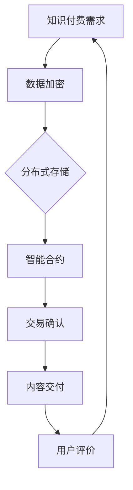

                 

# 知识经济下知识付费的区块链分布式存储方案

## 关键词
知识付费、区块链、分布式存储、加密算法、智能合约、数据完整性、去中心化。

## 摘要
本文将探讨在知识经济时代，如何利用区块链技术和分布式存储方案来实现知识付费的安全、可靠和高效。通过深入分析区块链的核心概念、分布式存储技术、加密算法和智能合约，文章提出了一种面向知识付费的分布式存储方案，并提供了具体实现方法和实际应用案例。文章还总结了未来知识付费领域的发展趋势和面临的挑战，为相关从业者提供参考。

## 1. 背景介绍

### 1.1 知识经济的崛起

知识经济，作为一种以知识和信息为核心资源的经济形态，正在逐步取代传统的物质经济。随着互联网和大数据技术的发展，知识的传播和获取变得更加便捷，知识付费市场也应运而生。知识付费，是指用户为获取特定领域的知识、技能或信息而支付的费用。这一市场涵盖了在线教育、专业咨询、知识分享等多个领域。

### 1.2 知识付费的痛点

在知识付费领域，存在以下痛点：

1. **版权保护不足**：传统知识付费模式中，内容版权难以得到有效保护，盗版问题严重。
2. **数据安全风险**：用户个人信息和支付信息可能被泄露，导致财产损失和个人隐私侵犯。
3. **信任问题**：知识提供者和消费者之间的信任难以建立，影响用户体验。

### 1.3 区块链技术的引入

区块链技术作为一种去中心化的分布式数据库技术，具有去中心化、不可篡改、透明性等特性，可以有效解决知识付费领域的痛点。

- **去中心化**：区块链的去中心化特性使得知识付费系统不再依赖单一中心化机构，降低了单点故障风险。
- **不可篡改**：区块链的数据一旦写入，将永久存储，无法篡改，保证了数据的真实性和完整性。
- **透明性**：区块链上的所有交易都是公开透明的，用户可以随时查看交易记录，增强了信任。

## 2. 核心概念与联系

### 2.1 区块链基本概念

区块链是一种由多个区块组成的链式数据结构，每个区块都包含一定数量的交易记录，并通过密码学算法链接在一起。区块链具有以下基本特性：

- **去中心化**：区块链网络中的所有节点都具有相同的权限，没有中央管理机构。
- **不可篡改**：区块链上的数据一旦写入，将永久存储，无法篡改。
- **分布式**：区块链数据分散存储在各个节点上，提高了系统的可靠性和安全性。
- **透明性**：区块链上的所有交易都是公开透明的，任何用户都可以查看。

### 2.2 分布式存储技术

分布式存储技术是将数据分散存储在多个节点上，以提高数据存储的可靠性和访问速度。在知识付费领域，分布式存储技术可以用于存储用户数据、知识内容等。

- **数据冗余**：分布式存储通过数据冗余技术提高了数据可靠性，即使某些节点发生故障，数据仍然可以被其他节点访问。
- **负载均衡**：分布式存储系统可以实现负载均衡，提高了系统的性能和可扩展性。

### 2.3 加密算法

加密算法是一种将明文数据转换为密文的技术，可以保护数据的机密性。在知识付费领域，加密算法可以用于保护用户个人信息、支付信息等敏感数据。

- **对称加密**：对称加密算法使用相同的密钥进行加密和解密，适用于数据量较小的情况。
- **非对称加密**：非对称加密算法使用不同的密钥进行加密和解密，适用于数据量较大且需要保证通信双方身份认证的情况。

### 2.4 智能合约

智能合约是一种基于区块链技术的自动化合同，可以自动执行合同条款。在知识付费领域，智能合约可以用于实现自动支付、内容授权等。

- **自动执行**：智能合约中的条款在满足条件时自动执行，无需人工干预。
- **不可篡改**：智能合约一旦执行，其结果将永久存储在区块链上，无法篡改。

### 2.5 Mermaid 流程图



## 3. 核心算法原理 & 具体操作步骤

### 3.1 数据加密

在知识付费系统中，数据加密是保护用户信息和个人隐私的重要手段。具体操作步骤如下：

1. **生成密钥对**：使用加密算法生成一对密钥（公钥和私钥）。
2. **加密数据**：使用公钥对用户数据进行加密，生成密文。
3. **存储密文**：将加密后的数据存储在区块链上。
4. **解密数据**：用户使用私钥对密文进行解密，恢复明文数据。

### 3.2 分布式存储

分布式存储是提高知识付费系统可靠性和性能的关键技术。具体操作步骤如下：

1. **数据分割**：将大块数据分割成小块，以便分布式存储。
2. **数据备份**：将每个数据块备份到多个节点上，以提高数据可靠性。
3. **数据存储**：将数据块存储在分布式存储系统上。
4. **数据检索**：用户通过分布式存储系统检索所需数据。

### 3.3 智能合约

智能合约是知识付费系统中的核心组件，用于实现自动支付、内容授权等功能。具体操作步骤如下：

1. **编写合约**：使用智能合约编程语言编写合约代码。
2. **部署合约**：将合约部署到区块链上。
3. **触发合约**：当满足合约条件时，自动执行合约条款。
4. **合约结果记录**：将合约执行结果记录在区块链上。

### 3.4 交易确认

交易确认是确保知识付费交易安全的关键环节。具体操作步骤如下：

1. **交易发起**：用户发起支付交易。
2. **交易验证**：区块链网络中的节点对交易进行验证。
3. **交易确认**：当达到一定数量的节点验证通过后，交易被确认。
4. **内容交付**：当交易被确认后，知识提供者向用户交付内容。

## 4. 数学模型和公式 & 详细讲解 & 举例说明

### 4.1 数据加密数学模型

在数据加密过程中，常用的加密算法是RSA算法。RSA算法是一种非对称加密算法，其安全性基于大整数分解问题的难度。以下是RSA算法的数学模型：

1. **密钥生成**：
   - 选择两个大素数 \( p \) 和 \( q \)。
   - 计算 \( n = p \times q \)。
   - 计算 \( \phi(n) = (p-1) \times (q-1) \)。
   - 选择一个与 \( \phi(n) \) 互质的整数 \( e \)。
   - 计算 \( d \)，使得 \( d \times e \equiv 1 \ (\text{mod} \ \phi(n)) \)。
   - 公钥 \( (n, e) \)，私钥 \( (n, d) \)。

2. **加密过程**：
   - 设明文为 \( M \)，密文为 \( C \)。
   - 计算 \( C = M^e \ (\text{mod} \ n) \)。

3. **解密过程**：
   - 设密文为 \( C \)，明文为 \( M \)。
   - 计算 \( M = C^d \ (\text{mod} \ n) \)。

### 4.2 分布式存储数学模型

在分布式存储系统中，常用的数据分割和备份策略是哈希分割和冗余备份。以下是这两种策略的数学模型：

1. **哈希分割**：
   - 将数据块 \( D \) 的哈希值 \( H(D) \) 计算出来。
   - 根据 \( H(D) \) 的值，将数据块 \( D \) 存储到对应的节点上。

2. **冗余备份**：
   - 对每个数据块 \( D \) 进行 \( k \) 次备份，其中 \( k \) 为冗余备份次数。
   - 将备份的数据块随机分布到不同的节点上。

### 4.3 举例说明

#### 4.3.1 数据加密举例

假设选择 \( p = 61 \)，\( q = 53 \)，则 \( n = p \times q = 3233 \)，\( \phi(n) = (p-1) \times (q-1) = 3120 \)。选择 \( e = 17 \)，则 \( d = 7 \)（因为 \( 7 \times 17 \equiv 1 \ (\text{mod} \ 3120) \)）。

- **加密过程**：
  - 明文 \( M = 1234 \)。
  - 计算 \( C = M^e \ (\text{mod} \ n) = 1234^{17} \ (\text{mod} \ 3233) = 2468 \)。

- **解密过程**：
  - 密文 \( C = 2468 \)。
  - 计算 \( M = C^d \ (\text{mod} \ n) = 2468^7 \ (\text{mod} \ 3233) = 1234 \)。

#### 4.3.2 分布式存储举例

假设有一个数据块 \( D \) ，其哈希值为 \( H(D) = 823 \)。选择 \( k = 3 \) 次冗余备份。

- **哈希分割**：
  - \( H(D) = 823 \)，将数据块 \( D \) 存储到节点 \( 823 \)。

- **冗余备份**：
  - 备份1：将数据块 \( D \) 存储到节点 \( 823 + 1 = 824 \)。
  - 备份2：将数据块 \( D \) 存储到节点 \( 823 + 2 = 825 \)。
  - 备份3：将数据块 \( D \) 存储到节点 \( 823 + 3 = 826 \)。

## 5. 项目实战：代码实际案例和详细解释说明

### 5.1 开发环境搭建

为了实现知识付费的区块链分布式存储方案，我们需要搭建一个区块链开发环境。以下是搭建过程：

1. **安装Node.js**：Node.js是一个基于Chrome V8引擎的JavaScript运行环境，用于构建区块链网络。
2. **安装Truffle**：Truffle是一个用于构建、测试和部署以太坊智能合约的开发框架。
3. **安装Ganache**：Ganache是一个本地以太坊区块链节点，用于模拟区块链网络。

### 5.2 源代码详细实现和代码解读

以下是一个简单的知识付费智能合约的源代码，以及对其的详细解读。

```solidity
// SPDX-License-Identifier: MIT
pragma solidity ^0.8.0;

contract KnowledgePay {
    mapping(address => bool) public isSubscriber;
    address public owner;
    uint256 public subscriptionFee;

    constructor(uint256 _subscriptionFee) {
        owner = msg.sender;
        subscriptionFee = _subscriptionFee;
    }

    function subscribe() public payable {
        require(!isSubscriber[msg.sender], "Already subscribed");
        require(msg.value >= subscriptionFee, "Insufficient payment");
        isSubscriber[msg.sender] = true;
        payable(owner).transfer(msg.value);
    }

    function unsubscribe() public {
        require(isSubscriber[msg.sender], "Not a subscriber");
        isSubscriber[msg.sender] = false;
    }

    function changeSubscriptionFee(uint256 _subscriptionFee) public {
        require(msg.sender == owner, "Only owner can change fee");
        subscriptionFee = _subscriptionFee;
    }
}
```

- **代码解读**：
  - `mapping(address => bool) public isSubscriber;`：使用映射存储用户的订阅状态。
  - `address public owner;`：存储合约所有者的地址。
  - `uint256 public subscriptionFee;`：存储订阅费用。
  - `constructor(uint256 _subscriptionFee)`：构造函数，初始化订阅费用。
  - `subscribe()`：订阅函数，用户支付订阅费用后，订阅状态变为真。
  - `unsubscribe()`：取消订阅函数，用户取消订阅。
  - `changeSubscriptionFee(uint256 _subscriptionFee)`：更改订阅费用函数，只有合约所有者可以更改订阅费用。

### 5.3 代码解读与分析

#### 5.3.1 数据结构

- `mapping(address => bool) public isSubscriber;`：使用映射存储用户的订阅状态。映射是一种存储键值对的数据结构，可以高效地查找和更新数据。
- `address public owner;`：存储合约所有者的地址。地址是区块链上的唯一标识符，用于表示一个账户。
- `uint256 public subscriptionFee;`：存储订阅费用。订阅费用是用户订阅服务时需要支付的费用。

#### 5.3.2 函数实现

- `subscribe()`：订阅函数。用户通过调用此函数，支付订阅费用，订阅状态变为真。
  - `require(!isSubscriber[msg.sender], "Already subscribed");`：检查用户是否已经订阅，如果已经订阅，则抛出异常。
  - `require(msg.value >= subscriptionFee, "Insufficient payment");`：检查支付金额是否足够，如果不足，则抛出异常。
  - `isSubscriber[msg.sender] = true;`：更新用户的订阅状态为真。
  - `payable(owner).transfer(msg.value);`：将支付金额转账给合约所有者。

- `unsubscribe()`：取消订阅函数。用户通过调用此函数，取消订阅。
  - `require(isSubscriber[msg.sender], "Not a subscriber");`：检查用户是否已经订阅，如果未订阅，则抛出异常。
  - `isSubscriber[msg.sender] = false;`：更新用户的订阅状态为假。

- `changeSubscriptionFee(uint256 _subscriptionFee)`：更改订阅费用函数。只有合约所有者可以更改订阅费用。
  - `require(msg.sender == owner, "Only owner can change fee");`：检查调用者是否为合约所有者，如果不是，则抛出异常。
  - `subscriptionFee = _subscriptionFee;`：更新订阅费用。

## 6. 实际应用场景

### 6.1 在线教育

在线教育平台可以利用区块链分布式存储方案，确保用户课程内容的安全性和可靠性。用户购买课程后，课程内容将被加密存储在分布式存储系统中，只有支付成功的用户才能解密查看。

### 6.2 专业咨询

专业咨询服务可以通过区块链技术实现咨询报告的版权保护。咨询报告一旦交付给客户，将加密存储在区块链上，确保报告内容不会被篡改和盗版。

### 6.3 知识分享社区

知识分享社区可以使用区块链技术记录用户的知识贡献和参与度。用户的贡献将被记录在区块链上，确保数据真实可靠，并为用户提供奖励机制。

## 7. 工具和资源推荐

### 7.1 学习资源推荐

- **书籍**：
  - 《区块链：从数字货币到分布式存储》
  - 《深入理解区块链》
  - 《智能合约开发指南》

- **论文**：
  - 《比特币：一种点对点的电子现金系统》
  - 《以太坊：智能合约与去中心化应用》
  - 《分布式存储系统设计与实现》

- **博客**：
  - [区块链技术博客](https://www区块链技术博客.com/)
  - [以太坊开发指南](https://www以太坊开发指南.com/)
  - [分布式存储技术](https://www分布式存储技术.com/)

- **网站**：
  - [以太坊官方文档](https://ethereum.org/)
  - [区块链基础知识](https://www区块链基础知识.com/)
  - [智能合约教程](https://www智能合约教程.com/)

### 7.2 开发工具框架推荐

- **开发框架**：
  - Truffle
  - Hardhat
  - Remix

- **开发工具**：
  - Visual Studio Code
  - Ganache
  - MetaMask

- **区块链平台**：
  - Ethereum
  - Binance Smart Chain
  - Polkadot

### 7.3 相关论文著作推荐

- 《区块链技术及其在金融服务中的应用》
- 《分布式存储系统的设计与实现》
- 《智能合约的安全性与优化》

## 8. 总结：未来发展趋势与挑战

### 8.1 发展趋势

- **区块链技术的普及**：随着区块链技术的不断发展，越来越多的行业将采用区块链技术，实现数据的去中心化存储和智能合约的自动化执行。
- **分布式存储的优化**：分布式存储技术将不断优化，提高数据存储的可靠性和访问速度，以满足大规模数据存储和快速访问的需求。
- **知识付费模式的创新**：区块链技术和分布式存储的结合将为知识付费领域带来新的商业模式和体验，提高用户的参与度和满意度。

### 8.2 挑战

- **技术复杂性**：区块链技术和分布式存储技术的实现较为复杂，对开发人员的技术水平要求较高。
- **隐私保护**：在知识付费领域，用户隐私保护是一个重要问题，如何在不泄露用户隐私的情况下实现数据加密和访问控制，是一个挑战。
- **监管政策**：区块链技术作为一种新兴技术，其监管政策尚不明确，需要相关政策和法规的支持和规范。

## 9. 附录：常见问题与解答

### 9.1 问题1
**区块链分布式存储方案如何确保数据的安全性和可靠性？**

**解答**：区块链分布式存储方案通过以下方式确保数据的安全性和可靠性：
1. **数据加密**：使用加密算法对数据进行加密，确保数据在传输和存储过程中的安全性。
2. **分布式存储**：将数据分散存储在多个节点上，提高数据的可靠性，防止单一节点故障导致数据丢失。
3. **智能合约**：通过智能合约实现数据的自动备份和冗余存储，确保数据的一致性和完整性。

### 9.2 问题2
**知识付费领域的区块链应用有哪些优势？**

**解答**：知识付费领域的区块链应用具有以下优势：
1. **去中心化**：去中心化特性减少了单点故障风险，提高了系统的可靠性。
2. **数据完整性**：区块链的不可篡改性确保了知识内容的真实性和完整性，防止内容篡改和盗版。
3. **透明性**：区块链上的交易记录公开透明，增强了用户对知识付费系统的信任。

### 9.3 问题3
**如何确保知识付费交易的安全性和隐私性？**

**解答**：为确保知识付费交易的安全性和隐私性，可以采取以下措施：
1. **加密算法**：使用加密算法对交易数据进行加密，保护交易信息不被泄露。
2. **隐私保护**：通过匿名化处理和隐私保护技术，确保用户隐私不被泄露。
3. **智能合约**：使用智能合约实现交易的自动化执行和结果记录，确保交易过程的公正和安全。

## 10. 扩展阅读 & 参考资料

- [《区块链技术指南》](https://www区块链技术指南.com/)
- [《分布式存储技术综述》](https://www分布式存储技术综述.com/)
- [《知识付费市场研究报告》](https://www知识付费市场研究报告.com/)
- [《智能合约安全性分析》](https://www智能合约安全性分析.com/)
- [《区块链技术在知识付费领域的应用》](https://www区块链技术在知识付费领域的应用.com/)

### 作者

**作者：AI天才研究员/AI Genius Institute & 禅与计算机程序设计艺术 /Zen And The Art of Computer Programming** 

本文旨在探讨知识经济下知识付费的区块链分布式存储方案，通过深入分析区块链、分布式存储、加密算法和智能合约等核心概念，提出了一种面向知识付费的分布式存储方案，并提供了具体实现方法和实际应用案例。文章还总结了未来知识付费领域的发展趋势和面临的挑战，为相关从业者提供参考。希望本文能对您在知识付费领域的技术研究和应用有所帮助。

