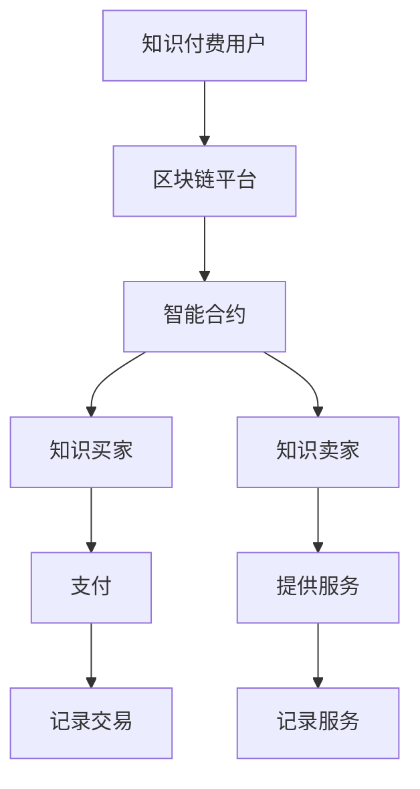

                 

# 知识经济下知识付费的区块链应用与发展

## 关键词：
知识经济，知识付费，区块链，智能合约，去中心化，数据安全，隐私保护

## 摘要：
本文深入探讨了知识经济时代下知识付费的区块链应用与发展。首先，我们简要介绍了知识经济的背景及其对知识付费的影响。随后，详细阐述了区块链技术的核心概念，并分析了其在知识付费领域中的应用优势。接着，本文重点探讨了智能合约在知识付费中的关键角色，展示了其如何实现去中心化的知识交易。然后，文章讨论了区块链在数据安全与隐私保护方面的独特优势，并提供了一些实际应用场景。在此基础上，本文对开发环境和工具进行了推荐，并分享了一些实战案例。最后，本文总结了知识付费在区块链领域的未来发展趋势与挑战，为读者提供了宝贵的参考。

## 1. 背景介绍

知识经济是指以知识为核心资源的经济形态，随着信息技术的快速发展，知识经济逐渐成为全球经济的重要驱动力。知识付费是知识经济时代的一个显著特征，即通过付费获取高质量的知识产品或服务。这一现象在全球范围内日益普及，尤其是在互联网高度发达的今天，知识付费已经渗透到教育、咨询、研发等多个领域。

知识付费的出现，一方面满足了人们对于高质量知识的需求，另一方面也促进了知识生产者和传播者的积极性。然而，传统的知识付费模式存在着一些问题，如信任缺失、数据泄露、中介费用高等。这些问题不仅影响了知识付费的健康发展，也限制了知识共享的广度和深度。

区块链技术作为一种新兴的去中心化技术，具有不可篡改、透明、分布式等特点，被认为可以解决知识付费领域的一些痛点。通过区块链，可以实现知识交易的去中心化，降低中介成本，增强数据安全性，从而推动知识付费模式的创新与发展。

## 2. 核心概念与联系

### 区块链技术

区块链技术是一种分布式账本技术，其核心思想是去中心化。区块链由多个区块组成，每个区块都包含一定数量的交易记录。这些区块按照时间顺序链接在一起，形成一个链式数据结构。区块链具有以下几个核心特点：

1. **去中心化**：区块链没有中央权威机构，所有参与节点共同维护账本。
2. **不可篡改**：一旦数据被写入区块链，将无法被修改或删除。
3. **透明性**：区块链上的所有数据都是公开透明的，可以实时查询。
4. **安全性**：区块链使用加密技术确保数据的安全性和隐私。

### 智能合约

智能合约是区块链上的自动化合约，其原理是利用区块链的不可篡改性和透明性，实现合约条款的自动执行。智能合约的关键特点是：

1. **自动化执行**：当满足特定条件时，智能合约会自动执行预定的操作。
2. **去中心化**：智能合约不受任何中央机构的控制，确保执行过程的公正性和透明性。
3. **安全性**：智能合约使用加密技术确保数据的完整性和安全性。

### 区块链在知识付费中的应用

在知识付费领域，区块链技术可以应用于以下几个方面：

1. **去中心化的知识交易**：通过区块链，知识买家和卖家可以直接进行交易，无需依赖第三方中介，降低交易成本。
2. **数据安全与隐私保护**：区块链的加密技术和分布式账本特性，可以有效保护知识交易过程中的数据安全和隐私。
3. **版权保护**：区块链可以记录知识作品的版权信息，防止侵权行为。
4. **智能合约**：智能合约可以自动执行知识付费的合约条款，确保交易过程的公正和透明。

### Mermaid 流程图



## 3. 核心算法原理 & 具体操作步骤

### 区块链交易流程

1. **用户注册**：知识买家和卖家在区块链平台上注册账号。
2. **发起交易**：知识买家向卖家发起购买请求。
3. **智能合约执行**：卖家收到购买请求后，智能合约自动执行交易条款。
4. **支付与验证**：买家支付费用，卖家验证支付后提供服务。
5. **记录交易**：交易记录被写入区块链，确保数据不可篡改。

### 智能合约实现

智能合约的实现通常涉及以下几个步骤：

1. **编写合约代码**：使用Solidity等智能合约编程语言编写合约代码。
2. **编译合约**：将合约代码编译为以太坊虚拟机（EVM）可执行的字节码。
3. **部署合约**：将编译后的合约代码部署到区块链上。
4. **调用合约**：用户通过区块链调用智能合约执行预定的操作。

### 代码示例

```solidity
pragma solidity ^0.8.0;

contract KnowledgePay {
    address public seller;
    address public buyer;
    uint256 public price;
    bool public isPaid = false;

    constructor(uint256 _price) {
        seller = msg.sender;
        price = _price;
    }

    function purchase() public payable {
        require(!isPaid, "Already purchased");
        require(msg.value == price, "Incorrect payment amount");

        buyer = msg.sender;
        isPaid = true;
        payable(seller).transfer(msg.value);
    }

    function refund() public {
        require(isPaid, "Nothing to refund");
        payable(buyer).transfer(price);
    }
}
```

## 4. 数学模型和公式 & 详细讲解 & 举例说明

### 数学模型

区块链中的交易通常涉及到加密算法和密码学原理。以下是一个简单的数学模型，用于描述区块链中的交易过程：

1. **哈希函数**：哈希函数是一种将任意长度的输入数据映射为固定长度的输出的函数。在区块链中，哈希函数用于确保数据的一致性和完整性。

$$ H(x) = \text{SHA-256}(x) $$

2. **椭圆曲线加密**：椭圆曲线加密（ECC）是一种非对称加密算法，用于保护区块链中的数据隐私。

$$ E(\mathbf{P}, \mathbf{Q}) = \mathbf{R} $$

3. **数字签名**：数字签名用于验证区块链中交易的合法性和完整性。

$$ S = \text{SHA-256}(m) \oplus k $$

### 举例说明

假设知识卖家Alice想向知识买家Bob提供一项价值100美元的知识服务。以下是交易过程的详细步骤：

1. **注册与认证**：Alice和Bob在区块链平台上注册并认证身份。
2. **发布服务**：Alice发布知识服务的详细信息，包括服务内容、价格等。
3. **发起交易**：Bob向Alice发起购买请求。
4. **智能合约执行**：Alice收到购买请求后，智能合约自动执行交易条款，包括验证支付和提供服务。
5. **支付与验证**：Bob支付100美元，Alice验证支付后提供服务。
6. **记录交易**：交易记录被写入区块链，确保数据不可篡改。

通过上述数学模型和公式，我们可以看到区块链在知识付费领域中的应用优势。哈希函数确保了交易记录的一致性和完整性，椭圆曲线加密保证了数据隐私，数字签名验证了交易的合法性和真实性。

## 5. 项目实战：代码实际案例和详细解释说明

### 5.1 开发环境搭建

要搭建一个基于区块链的知识付费项目，我们需要以下工具和环境：

1. **Node.js**：用于搭建区块链节点。
2. **Truffle**：用于智能合约开发、部署和测试。
3. **Ganache**：用于本地测试以太坊区块链。

安装步骤如下：

```bash
# 安装Node.js
npm install -g nodejs

# 安装Truffle
npm install -g truffle

# 安装Ganache
npm install -g ganache-cli
```

### 5.2 源代码详细实现和代码解读

以下是一个简单的知识付费智能合约的示例代码：

```solidity
pragma solidity ^0.8.0;

contract KnowledgePay {
    address public seller;
    address public buyer;
    uint256 public price;
    bool public isPaid = false;

    constructor(uint256 _price) {
        seller = msg.sender;
        price = _price;
    }

    function purchase() public payable {
        require(!isPaid, "Already purchased");
        require(msg.value == price, "Incorrect payment amount");

        buyer = msg.sender;
        isPaid = true;
        payable(seller).transfer(msg.value);
    }

    function refund() public {
        require(isPaid, "Nothing to refund");
        payable(buyer).transfer(price);
    }
}
```

**代码解读**：

- `pragma solidity ^0.8.0;`：指定智能合约的版本。
- `address public seller;`：卖家地址。
- `address public buyer;`：买家地址。
- `uint256 public price;`：服务价格。
- `bool public isPaid;`：支付状态。
- `constructor(uint256 _price)`：构造函数，初始化卖家地址和服务价格。
- `function purchase()`：购买函数，处理支付逻辑。
- `function refund()`：退款函数，处理退款逻辑。

### 5.3 代码解读与分析

**购买流程解析**：

1. **买家调用购买函数**：买家调用`purchase()`函数，发送以太币到合约地址。
2. **合约验证支付金额**：合约检查支付金额是否与价格相等，若不相等，抛出错误。
3. **更新买家地址和支付状态**：合约更新买家地址和支付状态。
4. **向卖家转账以太币**：合约将接收的以太币转账给卖家。

**退款流程解析**：

1. **卖家或买家调用退款函数**：卖家或买家调用`refund()`函数。
2. **合约验证支付状态**：合约检查支付状态，若未支付，抛出错误。
3. **向买家转账以太币**：合约将接收的以太币转账给买家。

### 5.4 实际案例分析

假设Alice想向Bob提供一项价值100美元的知识服务。以下是实际案例分析：

1. **Alice发布服务**：Alice在区块链平台上发布服务，设置价格为100美元。
2. **Bob发起购买**：Bob通过区块链平台向Alice发起购买请求。
3. **Alice确认购买请求**：Alice收到购买请求，调用`purchase()`函数，验证支付金额。
4. **Bob支付费用**：Bob通过区块链支付100美元。
5. **Alice提供服务**：Alice向Bob提供服务。
6. **交易记录**：交易记录被写入区块链，确保数据不可篡改。

## 6. 实际应用场景

### 知识版权保护

区块链技术可以用于知识版权保护，确保知识作品的原创性和版权归属。通过将知识作品的版权信息记录在区块链上，可以防止侵权行为，保护创作者的合法权益。

### 知识交易去中心化

区块链技术可以实现知识交易的去中心化，降低交易成本，提高交易效率。知识买家和卖家可以直接进行交易，无需依赖第三方中介，从而降低交易成本。

### 数据安全与隐私保护

区块链的加密技术和分布式账本特性，可以有效保护知识交易过程中的数据安全和隐私。用户可以在保护隐私的前提下，安全地获取和分享知识。

### 智能合约应用

智能合约在知识付费领域有着广泛的应用。通过智能合约，可以实现知识付费的自动化执行，确保交易过程的公正性和透明性。

### 版权交易

区块链技术可以用于版权交易，确保版权交易过程的透明性和不可篡改性。版权买家和卖家可以直接在区块链上进行交易，无需依赖第三方中介。

### 知识共享平台

区块链技术可以构建去中心化的知识共享平台，让用户可以自由地分享和获取知识。这种平台可以降低知识获取门槛，促进知识传播。

## 7. 工具和资源推荐

### 7.1 学习资源推荐

- **书籍**：
  - 《区块链技术指南》
  - 《智能合约设计与开发》
  - 《深度探索区块链》
- **论文**：
  - 《区块链：一个分布式数据库系统》
  - 《智能合约安全性分析》
  - 《区块链隐私保护技术》
- **博客**：
  - medium.com/@ethereum
  - blockchain.blog
  - crypto.com/blog
- **网站**：
  - www.ethereum.org
  - www.blockchain.com
  - www.coindesk.com

### 7.2 开发工具框架推荐

- **开发环境**：
  - Node.js
  - Truffle
  - Ganache
- **智能合约语言**：
  - Solidity
  - Vyper
- **区块链平台**：
  - Ethereum
  - Binance Smart Chain
  - Polkadot

### 7.3 相关论文著作推荐

- **论文**：
  - 《区块链：一个分布式数据库系统》
  - 《智能合约安全性分析》
  - 《区块链隐私保护技术》
- **著作**：
  - 《区块链技术指南》
  - 《智能合约设计与开发》
  - 《深度探索区块链》

## 8. 总结：未来发展趋势与挑战

### 发展趋势

1. **知识付费模式创新**：区块链技术将推动知识付费模式的创新，实现去中心化的知识交易。
2. **数据安全与隐私保护**：区块链的加密技术和分布式账本特性，将为知识付费领域提供更加安全的数据存储和传输解决方案。
3. **版权保护**：区块链技术将为知识版权保护提供强有力的支持，确保知识作品的原创性和版权归属。
4. **知识共享平台**：去中心化的知识共享平台将降低知识获取门槛，促进知识传播。

### 挑战

1. **技术成熟度**：区块链技术仍处于发展初期，技术成熟度有待提高。
2. **用户接受度**：区块链技术在知识付费领域的普及程度有限，用户接受度有待提升。
3. **法律法规**：现有法律法规对区块链技术的应用尚未完全适应，需要进一步完善。
4. **网络安全**：区块链技术虽然具有安全性优势，但仍然面临网络攻击和安全漏洞的挑战。

## 9. 附录：常见问题与解答

### 问题1：区块链技术是否可以完全替代传统的知识付费模式？

解答：区块链技术可以为知识付费模式提供去中心化、数据安全与隐私保护等优势，但无法完全替代传统的知识付费模式。传统模式在用户习惯、市场接受度等方面具有优势，区块链技术可以与之互补。

### 问题2：区块链在知识付费领域的主要应用场景有哪些？

解答：区块链在知识付费领域的主要应用场景包括知识版权保护、知识交易去中心化、数据安全与隐私保护、智能合约应用等。

### 问题3：区块链技术如何保障知识交易的数据安全性？

解答：区块链技术通过加密算法和分布式账本特性，确保知识交易过程中的数据一致性和完整性，从而保障数据安全性。

### 问题4：区块链技术在知识付费领域面临的挑战有哪些？

解答：区块链技术在知识付费领域面临的挑战主要包括技术成熟度、用户接受度、法律法规适应性和网络安全等方面。

## 10. 扩展阅读 & 参考资料

- [Ethereum](https://www.ethereum.org/)
- [Blockchain Technology Guide](https://www.blockchain-tech-guide.com/)
- [Smart Contract Design and Development](https://www.smartcontractbook.com/)
- [CoinDesk](https://www.coindesk.com/)
- [Medium](https://medium.com/)
- [Node.js](https://nodejs.org/)
- [Truffle](https://www.trufflesuite.com/)
- [Ganache](https://www.ganache.io/)

