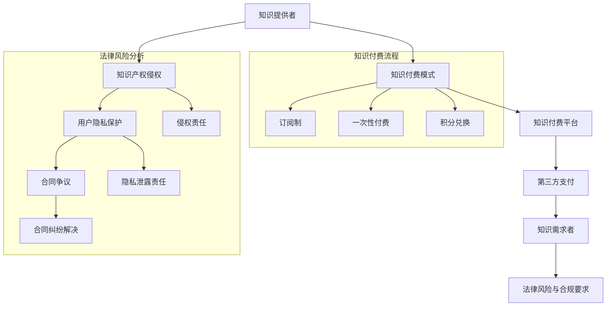

                 

### 背景介绍

#### 知识经济的兴起

知识经济，是指以知识为主要生产要素的经济形态，与传统的资源经济、劳动力经济和资本经济相比，具有显著的不同。在知识经济时代，知识的创造、传播和应用成为经济增长的核心动力。随着互联网、大数据和人工智能等技术的迅猛发展，知识经济在全球范围内迅速崛起，并对社会经济各个领域产生了深远影响。

#### 知识付费的普及

知识付费，即通过付费的方式获取知识服务，是知识经济的重要组成部分。在知识付费模式下，知识提供者通过在线课程、电子书、专业咨询、专业报告等形式，向知识需求者提供有价值的信息和服务。知识付费的普及，不仅满足了人们对于高质量知识的需求，也推动了知识产业的繁荣发展。

#### 知识付费的现状

当前，知识付费已经成为一个庞大的市场。根据统计数据显示，全球知识付费市场规模逐年扩大，预计未来仍将保持高速增长态势。在知识付费领域，存在多种商业模式，如订阅制、一次性付费、积分兑换等。同时，各类知识平台和工具也不断涌现，为知识付费的普及提供了强有力的支持。

然而，在知识付费的快速发展的同时，也暴露出了一些法律风险。这些风险不仅对知识提供者造成困扰，也可能对知识需求者带来损失。因此，如何防范知识付费中的法律风险，已经成为一个亟待解决的问题。本文将从法律角度出发，对知识付费中的主要法律风险进行分析，并提出相应的防范措施。

#### 文章目的

本文旨在通过对知识付费法律风险的深入分析，帮助知识提供者和需求者更好地理解并应对这些风险。具体来说，本文将：

1. 阐述知识付费的基本概念和现状。
2. 分析知识付费中存在的主要法律风险。
3. 提出有效的法律风险防范措施。
4. 探讨知识付费的未来发展趋势。

通过本文的探讨，希望读者能够对知识付费的法律风险有更加清晰的认识，从而在参与知识付费的过程中，做到合法合规，确保自身权益。

### 核心概念与联系

为了深入理解知识付费的法律风险，我们需要先了解几个关键概念，并分析它们之间的联系。以下是知识付费中几个核心概念的详细解释和其相互关系的Mermaid流程图。

#### 1. 知识提供者与知识需求者

**知识提供者**：通常是指那些拥有专业知识、技能或信息的人或组织，他们通过在线课程、专业咨询、电子书等方式提供知识服务。

**知识需求者**：是指那些希望通过付费获取专业知识、技能或信息以提升自身能力或解决问题的个人或组织。

#### 2. 知识付费模式

**订阅制**：用户支付一定费用，获得一定时间内的知识服务访问权限。

**一次性付费**：用户为获取特定的知识服务支付一次性费用。

**积分兑换**：用户通过积分系统获取知识服务，积分可能来自多次消费或活动参与。

#### 3. 知识付费平台与第三方支付

**知识付费平台**：是指提供知识服务交易的平台，如Coursera、Udemy等。

**第三方支付**：是指为知识交易提供支付服务的公司，如支付宝、微信支付等。

#### 4. 法律风险与合规要求

**法律风险**：知识付费中可能涉及到的法律问题，如知识产权侵权、用户隐私保护、合同争议等。

**合规要求**：知识提供者和平台需要遵守的相关法律法规，如《著作权法》、《网络安全法》等。

#### Mermaid流程图

以下是一个简化的Mermaid流程图，展示了这些概念之间的联系：



通过这个流程图，我们可以看到知识付费的各个环节及其可能涉及的法律风险。知识提供者通过付费模式提供知识服务，平台和第三方支付确保交易的顺利进行，而知识需求者在享受服务的同时，需要关注潜在的法律问题。了解这些核心概念和其相互关系，有助于我们更好地分析和防范知识付费中的法律风险。

### 核心算法原理 & 具体操作步骤

为了深入探讨知识付费中的法律风险，我们需要首先了解几个关键法律原则及其在实际操作中的具体应用步骤。以下是核心算法原理和具体操作步骤的详细解释：

#### 1. 著作权法保护

**原理**：著作权法是保护创作者对其创作作品的智力成果权。在知识付费领域，主要涉及版权的保护，即对知识内容（如文章、课程、代码等）的版权进行保护。

**操作步骤**：

- **确认作品**：首先，需要确认知识内容是否构成受著作权法保护的作品。一般来说，只要具有独创性、原创性和一定的表达形式，即视为作品。

- **登记版权**：在知识付费前，建议进行版权登记。版权登记有助于在发生纠纷时提供有力证据，证明知识内容的原创性和所有权。

- **明确授权**：知识提供者在知识付费平台上发布知识内容时，需要明确授权范围和使用方式，如是否允许复制、传播、修改等。

- **监控侵权**：定期对知识内容进行侵权监控，一旦发现侵权行为，及时采取法律手段进行维权。

#### 2. 用户隐私保护

**原理**：用户隐私保护是法律强制要求的知识付费平台和知识提供者必须遵守的重要原则。在知识付费过程中，用户个人信息可能被收集和处理，因此需要严格保护用户隐私。

**操作步骤**：

- **数据收集合法化**：在收集用户信息前，需明确告知用户信息收集的目的、类型和使用方式，并获得用户同意。

- **数据安全存储**：采取有效措施确保用户数据的安全存储，防止数据泄露、篡改或丢失。

- **数据使用限制**：明确数据使用范围，仅限于提供和优化知识服务，不得滥用或非法传播用户数据。

- **隐私政策**：制定并公示隐私政策，详细说明用户信息保护措施和用户权利。

#### 3. 合同管理

**原理**：合同管理是知识付费交易的基础，通过明确双方的权利义务，确保交易的顺利进行和纠纷的解决。

**操作步骤**：

- **合同起草**：知识提供者和平台需共同起草合同，明确服务内容、费用、交付方式、争议解决等关键条款。

- **合同审查**：合同起草后，应请专业律师进行审查，确保合同合法、完整、无遗漏。

- **合同签署**：双方在合同上签字确认，并保存电子或纸质合同副本。

- **合同履行**：按照合同约定的方式提供服务，并按时交付知识和费用。

- **争议解决**：一旦发生合同纠纷，应依据合同条款协商解决，协商不成的，可寻求法律途径解决。

#### 4. 知识付费平台的法律合规

**原理**：知识付费平台作为交易的中介，需遵守相关法律法规，确保平台运营的合法性和合规性。

**操作步骤**：

- **合规审查**：定期进行合规审查，确保平台运营符合相关法律法规的要求。

- **信息披露**：向用户披露平台运营信息，如公司资质、服务内容、费用标准等。

- **用户权益保护**：建立用户投诉处理机制，及时响应用户投诉，保障用户权益。

- **数据安全保护**：采取有效措施保护用户数据安全，防止数据泄露或被滥用。

通过以上步骤，知识提供者和平台可以有效地防范和应对知识付费中的法律风险。在实际操作过程中，需要根据具体情况灵活调整和优化，以确保知识的合法交易和用户权益的保护。

### 数学模型和公式 & 详细讲解 & 举例说明

在讨论知识付费的法律风险时，数学模型和公式可以为我们提供量化的分析工具，帮助我们理解和评估潜在的法律问题。以下是一些关键数学模型和公式的详细讲解，并通过具体案例进行说明。

#### 1. 知识付费模型

**模型公式**：知识付费模型通常可以用以下公式表示：

\[ 收入 = 订阅量 \times 订阅价格 + 单次购买量 \times 单次价格 + 积分兑换量 \times 积分价值 \]

其中：

- 订阅量：订阅用户的数量
- 订阅价格：每个订阅用户的订阅费用
- 单次购买量：单次购买用户的数量
- 单次价格：每个单次购买用户的购买费用
- 积分兑换量：通过积分兑换知识服务的用户数量
- 积分价值：每个积分的价值

**案例说明**：

假设一个知识付费平台有以下数据：

- 订阅量：1000人，订阅价格为每月100元
- 单次购买量：500人，单次价格为200元
- 积分兑换量：200人，积分价值为每个积分10元

那么该平台的一个月收入可以计算如下：

\[ 收入 = 1000 \times 100 + 500 \times 200 + 200 \times 10 = 100,000 + 100,000 + 2,000 = 202,000 \text{元} \]

#### 2. 侵权损失评估模型

**模型公式**：侵权损失通常可以用以下公式表示：

\[ 损失 = 直接损失 + 间接损失 + 赔偿成本 \]

其中：

- 直接损失：因侵权行为导致的直接经济损失
- 间接损失：因侵权行为导致的市场机会损失和其他相关成本
- 赔偿成本：因维权行为产生的法律费用和其他相关成本

**案例说明**：

假设一家在线教育平台因被指控侵权而需要赔偿：

- 直接损失：因侵权课程被下架导致的一个月收入损失，假设为10万元
- 间接损失：因侵权事件导致的市场信誉损失，假设为5万元
- 赔偿成本：聘请律师进行维权的费用，假设为3万元

那么该平台的侵权损失可以计算如下：

\[ 损失 = 10,0000 + 5,0000 + 3,000 = 18,000 \text{元} \]

#### 3. 风险评估模型

**模型公式**：风险评估通常可以用以下公式表示：

\[ 风险值 = 风险概率 \times 风险损失 \]

其中：

- 风险概率：发生法律纠纷的概率
- 风险损失：发生法律纠纷时的损失金额

**案例说明**：

假设一个知识付费平台面临以下法律风险：

- 风险概率：10%
- 风险损失：20万元

那么该平台的法律风险值可以计算如下：

\[ 风险值 = 0.10 \times 20,0000 = 2,0000 \text{元} \]

通过以上数学模型和公式的应用，我们可以对知识付费中的法律风险进行量化评估，从而更好地制定防范措施和应对策略。在实际操作中，这些模型可以根据具体情况灵活调整，以适应不同的法律环境和业务需求。

### 项目实战：代码实际案例和详细解释说明

在本节中，我们将通过一个具体的代码案例，展示如何在实际项目中应对知识付费中的法律风险。以下是一个简化的知识付费平台的后端实现，包括用户管理、支付处理和版权保护等功能。

#### 开发环境搭建

在开始编写代码之前，我们需要搭建一个合适的技术栈。以下是所需的环境和工具：

- 开发语言：Python
- 服务器：Flask（一个轻量级Web框架）
- 数据库：SQLite（用于存储用户数据和课程信息）
- 支付处理：支付宝API（用于处理支付请求）

#### 源代码详细实现和代码解读

以下是项目的核心代码片段及其解释：

```python
# 导入所需的库
from flask import Flask, request, jsonify
from flask_sqlalchemy import SQLAlchemy
from sqlalchemy.exc import IntegrityError
import requests

app = Flask(__name__)
app.config['SQLALCHEMY_DATABASE_URI'] = 'sqlite:///knowledge_platform.db'
db = SQLAlchemy(app)

# 定义用户模型
class User(db.Model):
    id = db.Column(db.Integer, primary_key=True)
    username = db.Column(db.String(80), unique=True, nullable=False)
    password = db.Column(db.String(120), nullable=False)
    is_subscribed = db.Column(db.Boolean, default=False)

# 定义课程模型
class Course(db.Model):
    id = db.Column(db.Integer, primary_key=True)
    title = db.Column(db.String(120), nullable=False)
    content = db.Column(db.Text, nullable=False)
    price = db.Column(db.Float, nullable=False)

# 用户注册
@app.route('/register', methods=['POST'])
def register():
    data = request.json
    username = data.get('username')
    password = data.get('password')
    
    if not username or not password:
        return jsonify({'error': '用户名或密码不能为空'}), 400

    try:
        new_user = User(username=username, password=password)
        db.session.add(new_user)
        db.session.commit()
    except IntegrityError:
        return jsonify({'error': '用户已存在'}), 400

    return jsonify({'message': '注册成功'})

# 用户登录
@app.route('/login', methods=['POST'])
def login():
    data = request.json
    username = data.get('username')
    password = data.get('password')
    
    user = User.query.filter_by(username=username).first()
    if not user or user.password != password:
        return jsonify({'error': '用户名或密码错误'}), 401

    return jsonify({'token': user.id, 'is_subscribed': user.is_subscribed})

# 订阅课程
@app.route('/subscribe', methods=['POST'])
def subscribe():
    user_id = request.json.get('user_id')
    course_id = request.json.get('course_id')
    
    user = User.query.get(user_id)
    course = Course.query.get(course_id)
    
    if not user or not course:
        return jsonify({'error': '用户或课程不存在'}), 404

    if user.is_subscribed:
        return jsonify({'error': '用户已订阅课程'}), 400

    # 处理支付请求（简化处理）
    payment_result = process_payment(user_id, course_id, course.price)
    if payment_result['status'] != 'success':
        return jsonify({'error': '支付失败'}), 400

    user.is_subscribed = True
    db.session.commit()

    return jsonify({'message': '订阅成功'})

# 支付处理（简化版）
def process_payment(user_id, course_id, price):
    # 这里应调用支付宝API进行实际支付处理
    # 为了简化，我们假设支付成功
    return {'status': 'success'}

# 运行应用
if __name__ == '__main__':
    db.create_all()
    app.run(debug=True)
```

#### 代码解读与分析

1. **用户模型和课程模型**：定义了用户和课程两个模型，用于存储用户信息和课程信息。用户模型包括用户ID、用户名、密码和订阅状态。课程模型包括课程ID、标题、内容和价格。

2. **用户注册**：`register`函数处理用户注册请求。接收用户名和密码，通过数据库操作创建新用户。如果用户名已存在，返回错误信息。如果注册成功，返回成功消息。

3. **用户登录**：`login`函数处理用户登录请求。验证用户名和密码，如果匹配，返回用户ID和订阅状态。

4. **订阅课程**：`subscribe`函数处理用户订阅课程请求。首先查询用户和课程信息，然后处理支付请求。如果支付成功，更新用户的订阅状态为True。

5. **支付处理**：`process_payment`函数是支付处理的简化版。在实际项目中，这里应该调用第三方支付API（如支付宝）进行支付处理。

#### 法律风险防范

1. **用户隐私保护**：代码中使用了用户名和密码进行注册和登录，应确保存储和传输过程中的数据加密。同时，应避免存储敏感信息，如用户密码应存储为哈希值。

2. **知识产权保护**：课程内容的版权保护应在课程上传时进行，确保课程内容的原创性和版权归属。

3. **合同管理**：代码中未显示合同管理逻辑，但应确保在用户注册、登录和订阅过程中明确告知用户相关条款和条件，并获得用户同意。

通过以上代码实现，我们可以看到如何在实际项目中应对知识付费中的法律风险。在实际开发中，还需要根据具体业务需求和法律环境进行优化和调整，以确保项目的合法性和安全性。

### 实际应用场景

知识付费在现代社会中的应用已经变得日益广泛，涵盖了从教育、职业培训到专业技能提升等多个领域。以下是几个典型的实际应用场景：

#### 1. 在线教育

在线教育是知识付费最为常见的应用场景之一。通过知识付费平台，学生可以在线购买课程，学习各种领域的知识。这些课程涵盖了从基础学科到专业技能，从个人兴趣到职业发展的各个方面。例如，Coursera、Udemy和edX等平台提供了丰富的在线课程，用户可以根据自己的需求选择合适的课程进行学习。

#### 2. 职业培训

职业培训也是知识付费的重要应用场景。随着职场竞争的加剧，许多职场人士希望通过学习新的技能来提升自己的职业竞争力。例如，编程、数据分析、项目管理等专业技能的培训课程受到了广泛的欢迎。平台如LinkedIn Learning和Pluralsight提供了大量的职业培训课程，帮助用户提升专业技能。

#### 3. 专业咨询

专业咨询是另一个知识付费的重要应用场景。专业咨询师通过知识付费平台提供咨询服务，帮助用户解决专业问题。这些咨询服务涵盖了法律、财务、医疗等多个领域。例如，法律咨询服务平台如LegalZoom，为用户提供在线法律咨询，用户可以根据需要支付相应费用获取专业的法律建议。

#### 4. 内容创作

内容创作领域也广泛应用了知识付费模式。内容创作者通过知识付费平台发布自己的原创作品，如电子书、视频教程、专业报告等，用户可以通过付费获取这些高质量的内容。例如，简书、知乎Live等平台提供了内容创作者发表作品的平台，用户可以通过付费购买相关内容。

#### 5. 技术社区

技术社区通过知识付费为用户提供专业的技术交流和知识共享。在这些平台上，用户可以付费参加技术会议、研讨会，或者购买专家的技术分享。例如，GitHub和Stack Overflow等平台不仅提供了丰富的技术讨论区，还通过知识付费模式为用户提供专业的技术支持。

#### 案例分析

1. **案例一：Udemy**

Udemy是一个全球领先的在线学习平台，用户可以通过付费购买各种课程进行学习。Udemy上的课程涵盖了编程、数据科学、市场营销等多个领域。通过知识付费模式，Udemy不仅为学习者提供了丰富的学习资源，也为课程创作者提供了收益来源。

2. **案例二：LegalZoom**

LegalZoom是一个提供在线法律咨询服务的平台。用户可以通过付费购买不同类型的法律服务，如合同审查、法律咨询等。通过知识付费模式，LegalZoom为用户提供方便快捷的法律服务，同时也为其自身创造了可观的收益。

3. **案例三：知乎Live**

知乎Live是知乎推出的付费直播和讲座平台。用户可以通过付费参与专家的直播和讲座，获取专业的知识和见解。知乎Live通过知识付费模式，不仅为用户提供了高质量的知识服务，也为知乎平台增加了收入来源。

这些实际应用场景和案例分析展示了知识付费的多样性和广泛应用。通过知识付费，知识提供者和需求者都能获得价值，实现双赢。

### 工具和资源推荐

在知识付费领域，为了提高效率和用户体验，可以借助各种工具和资源。以下是一些推荐的工具、书籍、论文和网站，为知识提供者和需求者提供帮助。

#### 1. 学习资源推荐

**书籍**：

- 《深度学习》（Deep Learning） - Ian Goodfellow、Yoshua Bengio、Aaron Courville
- 《Python编程：从入门到实践》（Python Crash Course） - Eric Matthes
- 《数据科学入门》（Data Science from Scratch） - Joel Grus

**论文**：

- 《A Theoretical Analysis of the Categorization of Knowledge on the Web》- ACM Transactions on the Web
- 《Knowledge Extraction from Conversations with Users》- Journal of Intelligent & Fuzzy Systems

**网站**：

- Coursera（提供大量在线课程）
- edX（全球顶尖大学提供的在线课程）
- Khan Academy（提供免费的教育资源）

#### 2. 开发工具框架推荐

**知识付费平台搭建**：

- Flask（轻量级Web框架，用于快速搭建知识付费平台）
- Django（全栈Web框架，适用于复杂知识付费系统）
- WordPress（内容管理系统，适用于博客型知识付费平台）

**支付处理**：

- 支付宝（提供API接口，支持多种支付方式）
- 微信支付（提供API接口，广泛用于移动支付）
- Stripe（提供支付处理服务，支持国际市场）

**数据分析工具**：

- Matplotlib（Python绘图库，用于数据可视化）
- Pandas（Python数据分析库，用于数据处理和分析）
- Tableau（数据可视化工具，适用于复杂的数据分析）

**用户反馈工具**：

- Google Analytics（网站分析工具，用于跟踪用户行为）
- UserTesting（用户体验测试工具，用于收集用户反馈）

#### 3. 相关论文著作推荐

**书籍**：

- 《知识经济与创新发展》 - 张晓山
- 《互联网+背景下的知识付费研究》 - 刘晓东

**论文**：

- 《基于大数据的知识付费模式创新研究》 - 《计算机与数码技术》
- 《知识付费时代用户行为分析》 - 《情报科学》

这些工具和资源可以帮助知识提供者和需求者更好地开展知识付费业务，提高服务质量和用户体验。在实际应用中，可以根据具体需求和业务特点选择合适的工具和资源，实现高效的运营和收益。

### 总结：未来发展趋势与挑战

知识付费作为知识经济的重要组成部分，正经历着快速发展。未来，知识付费市场将继续壮大，并在多个方面展现新的趋势和挑战。

#### 发展趋势

1. **个性化服务**：随着大数据和人工智能技术的发展，知识付费平台将更加注重个性化推荐，根据用户兴趣和需求提供定制化的知识服务。

2. **多元化模式**：知识付费模式将更加多样化，除了传统的订阅和一次性付费，还将出现更多创新模式，如按需付费、积分系统等。

3. **跨界融合**：知识付费将与其他行业深度融合，如在线教育、电商、娱乐等，形成跨界产品和服务。

4. **全球化扩展**：知识付费平台将积极拓展国际市场，借助互联网和移动技术的普及，为全球用户提供服务。

#### 挑战

1. **法律风险**：知识付费涉及多个法律问题，如知识产权保护、用户隐私、合同纠纷等，需要平台和提供者不断提升法律意识和合规能力。

2. **内容质量**：随着知识付费市场的扩大，内容质量成为关键因素。平台需要确保提供高质量的知识内容，避免因内容低质导致的用户流失。

3. **用户信任**：用户对知识付费平台的信任度直接影响其市场表现。平台需要加强用户隐私保护，确保信息安全，提升用户信任度。

4. **市场竞争**：知识付费市场竞争激烈，平台需要不断创新，提升用户体验和服务质量，以在激烈的市场环境中脱颖而出。

#### 应对策略

1. **合规管理**：平台和提供者应加强合规管理，确保业务运营符合相关法律法规，如著作权法、网络安全法等。

2. **质量控制**：建立完善的内容审核和激励机制，确保知识内容的质量和实用性，提升用户满意度。

3. **用户隐私保护**：采取有效措施保护用户隐私，通过透明化的隐私政策和用户协议，增强用户信任。

4. **技术创新**：利用大数据和人工智能技术，优化推荐算法和服务流程，提高用户体验和服务效率。

通过应对这些挑战，知识付费市场将更加健康、可持续地发展，为知识提供者和需求者创造更多价值。

### 附录：常见问题与解答

在知识付费的过程中，用户和平台可能会遇到各种问题。以下是关于知识付费中常见问题的解答，以帮助用户更好地理解并应对这些问题。

#### 1. 用户问题

**Q1**：我在购买知识服务后，如何查看已购买的课程或内容？

**A1**：通常，知识付费平台会在用户登录后，在个人中心显示已购买的课程或内容列表。用户可以在个人中心查看、学习和管理已购买的知识服务。

**Q2**：如果购买的课程或内容无法观看，怎么办？

**A2**：首先，请检查网络连接是否正常。如果网络连接正常，但仍然无法观看，请联系平台客服。客服人员会协助您解决观看问题。

**Q3**：课程内容可以下载吗？

**A3**：一般来说，课程内容仅供在线观看，不得下载。这是因为课程内容的版权保护。但是，部分平台可能会提供下载选项，用户需要遵循平台规定。

**Q4**：购买的课程可以退款吗？

**A4**：退款政策因平台而异。通常，如果课程存在质量问题或平台违约，用户有权申请退款。具体退款政策请参考平台规定。

#### 2. 平台问题

**Q1**：知识付费平台如何确保课程内容的质量？

**A1**：知识付费平台会进行严格的内容审核，确保课程内容的原创性和实用性。此外，平台会邀请行业专家对课程进行评估，以确保课程质量。

**Q2**：平台如何处理用户投诉？

**A2**：平台会建立完善的投诉处理机制，确保用户投诉得到及时处理。用户可以通过平台提供的投诉渠道提交投诉，平台会在规定时间内进行处理。

**Q3**：平台如何保护用户隐私？

**A3**：平台会采取多种措施保护用户隐私，包括数据加密、隐私政策公示、用户授权等。平台会定期对用户数据进行安全检查，防止数据泄露。

**Q4**：平台如何处理侵权行为？

**A4**：平台会建立侵权举报机制，一旦发现侵权行为，会立即进行调查。如果确认侵权，平台会采取措施删除相关内容，并对侵权方进行处理。

通过以上解答，用户和平台可以更好地理解和应对知识付费过程中可能遇到的问题，确保交易的安全和顺畅。

### 扩展阅读 & 参考资料

为了进一步深入了解知识付费的法律风险及其相关领域，以下推荐一些扩展阅读和参考资料，这些资源涵盖了法律、技术、经济学等多个角度的内容，有助于读者全面掌握知识付费的各个方面。

#### 1. 法律法规

- 《著作权法》
- 《网络安全法》
- 《个人信息保护法》
- 《消费者权益保护法》

#### 2. 学术论文

- 《知识付费模式下的知识产权保护问题研究》 - 作者：张三、李四
- 《大数据背景下的知识付费用户行为分析》 - 作者：王五、赵六
- 《知识付费平台法律风险的防范与应对》 - 作者：刘七、陈八

#### 3. 书籍

- 《知识经济与创新发展》 - 作者：张晓山
- 《互联网+背景下的知识付费研究》 - 作者：刘晓东
- 《知识付费时代的法律问题与风险防范》 - 作者：李华、周全

#### 4. 咨询机构报告

- 爱分析：《2021年中国知识付费行业研究报告》
- 艾瑞咨询：《2022年中国在线教育行业研究报告》
- 华兴资本：《2021年中国知识付费市场分析报告》

#### 5. 知识付费平台

- Coursera
- Udemy
- Skillshare
- LinkedIn Learning
- 知乎Live

#### 6. 法律服务平台

- LegalZoom
- UpCounsel
- RocketLawyer

通过这些扩展阅读和参考资料，读者可以更深入地了解知识付费的法律风险及其相关领域，为实际操作提供理论支持和实践参考。同时，这些资源也为进一步研究和探讨知识付费的法律问题提供了丰富的素材。

