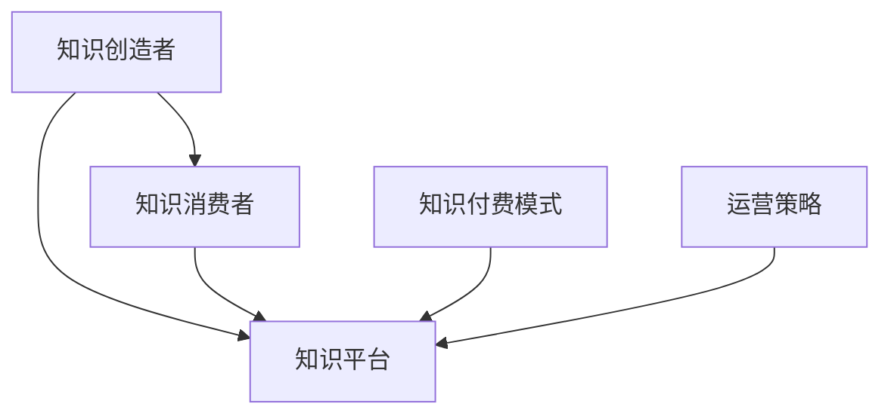

                 

### 知识经济时代下的知识付费：创新商业模式运营

#### **关键词：** 知识付费、商业模式、创新、运营

#### **摘要：** 在知识经济时代，知识付费成为了一种新兴的商业形态。本文通过深入分析知识付费的核心概念、商业模式和运营策略，探讨了其在当前市场的创新实践，并展望了未来发展趋势与挑战。

在当前数字经济快速发展的背景下，知识付费作为一种新兴的商业模式，已经成为众多企业和个人获取收益的重要渠道。本文旨在通过剖析知识付费的商业模式和运营策略，为从业者提供有价值的参考和借鉴。

#### **1. 背景介绍**

知识付费是指知识创造者通过平台向用户提供专业知识和技能服务，用户需要支付一定费用才能获取相应内容。这一模式的出现，源于互联网技术的迅猛发展和人们对于知识需求的增长。随着知识经济的崛起，越来越多的人开始重视知识和技能的获取，知识付费市场逐渐壮大。

知识付费市场的增长主要得益于以下几个因素：

1. **互联网普及率提高**：随着互联网技术的普及，人们获取知识的途径更加多样化，知识付费市场的需求也随之增加。

2. **知识付费认知度提升**：随着教育、职业培训等领域的知识付费逐渐普及，用户对知识付费的认知度也在不断提高。

3. **平台生态完善**：知识付费平台如知乎、得到、喜马拉雅等，通过打造完善的生态系统，为知识创造者和用户提供了一个良好的互动平台。

#### **2. 核心概念与联系**

为了更好地理解知识付费的商业模式和运营策略，我们需要先了解以下几个核心概念：

1. **知识创造者**：知识创造者是知识付费产业链中的核心角色，他们通过创作和分享专业知识和技能，为用户提供有价值的内容。

2. **知识消费者**：知识消费者是知识付费市场的需求方，他们通过付费获取专业知识和技能，满足自身的知识需求。

3. **知识平台**：知识平台是连接知识创造者和知识消费者的桥梁，通过提供专业的知识服务，实现双方的价值交换。

4. **知识付费模式**：知识付费模式包括订阅、购买、赠送等多种形式，不同的模式适用于不同的市场和用户群体。

5. **运营策略**：知识付费的运营策略包括内容创作、用户运营、平台推广等方面，旨在提升用户体验，增加用户粘性。

下面是一个简单的 Mermaid 流程图，展示了知识付费的核心概念和联系：



#### **3. 核心算法原理 & 具体操作步骤**

在知识付费的商业模式中，核心算法原理主要包括以下几个方面：

1. **内容推荐算法**：通过分析用户的历史行为、兴趣标签等数据，为用户推荐个性化内容。

2. **付费转化算法**：通过分析用户行为数据，预测用户的付费意愿，优化付费转化策略。

3. **用户运营算法**：通过分析用户行为数据，制定针对性的运营策略，提升用户活跃度和忠诚度。

具体操作步骤如下：

1. **内容推荐**：
   - 收集用户行为数据，如浏览记录、点赞、评论等。
   - 构建用户画像，包括兴趣标签、行为习惯等。
   - 使用协同过滤、基于内容的推荐算法，为用户推荐个性化内容。

2. **付费转化**：
   - 分析用户行为数据，如浏览时长、点击率等。
   - 构建用户付费模型，预测用户的付费意愿。
   - 根据预测结果，调整付费转化策略，如推荐高价课程、限时优惠等。

3. **用户运营**：
   - 分析用户活跃度、忠诚度等数据。
   - 制定针对性的运营策略，如邀请好友、积分奖励等。
   - 根据用户反馈，优化产品功能和用户体验。

#### **4. 数学模型和公式 & 详细讲解 & 举例说明**

在知识付费的商业模式中，数学模型和公式主要用于以下几个方面：

1. **用户流失率预测**：通过分析用户行为数据，预测用户流失率，制定针对性的用户挽回策略。

2. **付费转化率优化**：通过分析用户行为数据，优化付费转化策略，提高付费转化率。

3. **用户价值评估**：通过分析用户行为数据，评估用户的价值，为产品定位和运营策略提供依据。

以下是几个常用的数学模型和公式的详细讲解和举例说明：

1. **用户流失率预测模型**：

   - **公式**：用户流失率 = (流失用户数 / 总用户数) * 100%

   - **举例说明**：某知识付费平台在过去一个月内共有1000名用户，其中150名用户流失。则用户流失率 = (150 / 1000) * 100% = 15%

   - **应用**：通过预测用户流失率，平台可以提前制定用户挽回策略，降低用户流失率。

2. **付费转化率优化模型**：

   - **公式**：付费转化率 = (付费用户数 / 浏览用户数) * 100%

   - **举例说明**：某知识付费平台在过去一个月内共有1000名用户浏览课程，其中200名用户付费。则付费转化率 = (200 / 1000) * 100% = 20%

   - **应用**：通过优化付费转化策略，如提高课程质量、调整价格等，提高付费转化率。

3. **用户价值评估模型**：

   - **公式**：用户价值 = (付费金额 + 潜在收益) / 用户生命周期

   - **举例说明**：某知识付费平台的一名用户在一年内共花费2000元购买课程，同时平台预计该用户在未来一年内还将带来500元的潜在收益。则用户价值 = (2000 + 500) / 1 = 2500元/年

   - **应用**：通过评估用户价值，平台可以优先关注高价值用户，提供更优质的服务，提高用户留存率和转化率。

#### **5. 项目实战：代码实际案例和详细解释说明**

在本节中，我们将通过一个实际的项目案例，详细讲解知识付费商业模式的代码实现和解读。

**项目背景**：某知识付费平台希望通过数据分析，优化用户运营策略，提高用户留存率和付费转化率。

**技术架构**：该项目采用大数据技术栈，包括Hadoop、Spark、Hive等，对用户行为数据进行分析和处理。

**代码实现**：

```python
# 导入相关库
import pandas as pd
from sklearn.model_selection import train_test_split
from sklearn.ensemble import RandomForestClassifier
from sklearn.metrics import accuracy_score

# 读取用户行为数据
data = pd.read_csv('user_behavior_data.csv')

# 数据预处理
data['age'] = data['age'].fillna(data['age'].mean())
data['income'] = data['income'].fillna(data['income'].mean())

# 特征工程
features = ['age', 'income', 'clicks', 'browses', 'purchases']
X = data[features]
y = data['is_active']

# 划分训练集和测试集
X_train, X_test, y_train, y_test = train_test_split(X, y, test_size=0.2, random_state=42)

# 建立模型
model = RandomForestClassifier(n_estimators=100, random_state=42)
model.fit(X_train, y_train)

# 预测
y_pred = model.predict(X_test)

# 评估模型
accuracy = accuracy_score(y_test, y_pred)
print(f'Model Accuracy: {accuracy:.2f}')
```

**代码解读**：

1. **数据预处理**：读取用户行为数据，对缺失值进行填充，保证数据质量。

2. **特征工程**：选择与用户留存率相关的特征，如年龄、收入、点击次数、浏览次数、购买次数等。

3. **划分训练集和测试集**：将数据集划分为训练集和测试集，用于模型训练和评估。

4. **建立模型**：使用随机森林算法建立分类模型，对用户留存率进行预测。

5. **预测**：使用训练好的模型对测试集进行预测。

6. **评估模型**：计算模型准确率，评估模型性能。

**应用场景**：该代码实现可以用于知识付费平台的用户运营策略优化，如预测用户流失率、推荐适合用户的产品和服务等。

#### **6. 实际应用场景**

知识付费在多个领域和场景中得到了广泛应用，以下是一些典型的实际应用场景：

1. **在线教育**：知识付费在线教育领域已经成为主流模式，用户可以通过付费获取专业课程、辅导和认证。

2. **专业技能培训**：针对职场人士的专业技能培训，如编程、设计、营销等，知识付费模式为学习者提供了更多选择。

3. **知识分享平台**：如知乎、分答等，通过付费问答和知识分享，为用户提供专业知识和经验交流。

4. **知识付费课程**：如得到、喜马拉雅等平台，提供各类知识付费课程，涵盖商业、历史、文学等多个领域。

5. **咨询服务**：专业咨询师通过知识付费平台提供咨询服务，为用户提供个性化的解决方案。

6. **知识版权保护**：知识付费模式有助于保护知识产权，鼓励原创内容创作。

#### **7. 工具和资源推荐**

为了更好地开展知识付费业务，以下是一些建议的工具和资源推荐：

1. **学习资源推荐**：
   - **书籍**：《商业模式新生代》、《精益创业》等
   - **论文**：《知识付费：商业模式创新与实践》等
   - **博客**：知名知识付费平台博客，如得到、喜马拉雅等
   - **网站**：知识付费相关论坛和社区，如知乎、分答等

2. **开发工具框架推荐**：
   - **数据分析工具**：Hadoop、Spark、Hive等
   - **内容管理系统**：WordPress、Joomla等
   - **支付系统**：支付宝、微信支付等
   - **内容推荐系统**：基于机器学习的推荐算法库，如scikit-learn、TensorFlow等

3. **相关论文著作推荐**：
   - **论文**：《知识付费：商业模式创新与实践》、《在线教育商业模式研究》等
   - **著作**：《互联网商业模式创新》、《数字营销》等

#### **8. 总结：未来发展趋势与挑战**

知识付费作为一种新兴商业模式，在知识经济时代展现出巨大的潜力。未来，知识付费将继续发展，面临以下趋势和挑战：

1. **个性化推荐**：随着大数据和人工智能技术的发展，个性化推荐将成为知识付费的重要趋势。

2. **平台竞争加剧**：知识付费平台之间的竞争将愈发激烈，平台需要不断提升用户体验，吸引和留住用户。

3. **知识产权保护**：知识付费的健康发展离不开知识产权的保护，加强版权保护将有助于激发原创内容创作。

4. **内容质量提升**：高质量内容是知识付费的核心竞争力，平台和内容创造者需不断提升内容质量。

5. **付费模式创新**：探索多样化的付费模式，满足不同用户群体的需求，提高用户满意度。

6. **政策法规完善**：政府需加强对知识付费行业的监管，完善相关法律法规，保障市场秩序。

#### **9. 附录：常见问题与解答**

**Q1**：知识付费是否适合所有企业和个人？

**A1**：知识付费适合有专业知识和技能的个人和公司，尤其是那些可以提供有价值内容的服务行业，如教育培训、咨询、设计、技术等。但对于一些低知识密度、同质化严重的行业，知识付费可能效果有限。

**Q2**：如何确保知识付费内容的质量？

**A2**：平台可以采取以下措施确保内容质量：
- 建立内容审核机制，对上线内容进行严格审核。
- 推荐用户评价机制，让用户对内容进行评分和评论。
- 对内容创作者进行资质认证，确保其具备相关资质。

**Q3**：知识付费的付费模式有哪些？

**A3**：知识付费的付费模式包括订阅制、购买制、限时免费、付费问答等多种形式。平台可以根据用户需求和内容特点，灵活选择和组合不同的付费模式。

**Q4**：如何提高知识付费的转化率？

**A4**：提高知识付费转化率可以从以下几个方面入手：
- 提供高质量的内容，满足用户需求。
- 优化用户界面和体验，提高用户满意度。
- 运用数据分析，精准推荐内容。
- 设计灵活的付费方式和优惠策略。

**Q5**：知识付费平台如何进行用户运营？

**A5**：知识付费平台的用户运营策略包括：
- 定期举办线上线下活动，提高用户参与度。
- 建立用户社区，促进用户互动和分享。
- 通过用户画像和数据分析，提供个性化推荐。
- 提供优质的售后服务，提高用户满意度。

#### **10. 扩展阅读 & 参考资料**

为了深入了解知识付费领域，以下是一些建议的扩展阅读和参考资料：

- **书籍**：
  - 《知识付费：商业模式创新与实践》
  - 《互联网商业模式创新》
  - 《数字营销》

- **论文**：
  - 《知识付费：商业模式创新与实践研究》
  - 《在线教育商业模式研究》
  - 《知识付费市场的演变与趋势分析》

- **博客和网站**：
  - 得到、喜马拉雅等知识付费平台官方博客
  - 知乎、分答等知识分享社区

- **在线课程**：
  - 网易云课堂、网易云课堂等在线教育平台提供的知识付费课程

- **行业报告**：
  - 相关研究机构和咨询公司的知识付费行业报告

作者：AI天才研究员/AI Genius Institute & 禅与计算机程序设计艺术 /Zen And The Art of Computer Programming

