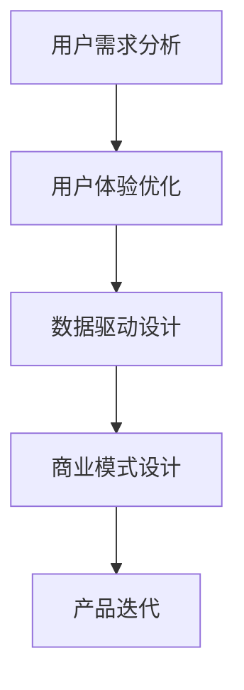

                 

# 知识经济时代下的知识付费创新产品设计方法

## 关键词：知识付费，创新设计，用户需求，体验优化，数据驱动，商业模式

> **摘要：**
本文将探讨知识经济时代下知识付费产品设计的创新方法。通过分析用户需求、体验优化、数据驱动和商业模式等多方面因素，为知识付费产品设计提供有针对性的策略和解决方案，以推动知识付费行业的持续发展。

## 1. 背景介绍

### 1.1 知识经济的兴起

随着互联网技术的飞速发展，知识经济逐渐成为全球经济的新引擎。知识经济的核心在于知识和信息的创造、传播和应用。在知识经济时代，知识的价值日益凸显，知识付费成为了一种普遍的经济现象。

### 1.2 知识付费市场的现状

近年来，知识付费市场呈现出爆发式增长。从在线教育、专业技能培训到知识分享平台，各种形式的知识付费产品层出不穷。用户对于知识的渴求不断推动着知识付费市场的发展。

### 1.3 知识付费产品的设计挑战

在知识付费产品设计中，如何满足用户需求、提升用户体验、优化商业模式，成为设计师面临的重大挑战。本文将从这些方面探讨知识付费产品的创新设计方法。

## 2. 核心概念与联系

### 2.1 用户需求分析

用户需求是知识付费产品设计的起点。通过用户调研、数据分析等方法，深入挖掘用户在知识获取方面的需求，是产品成功的关键。

### 2.2 用户体验优化

用户体验是知识付费产品的核心竞争力。优化用户体验，提高用户满意度，是产品设计的重要目标。

### 2.3 数据驱动设计

数据驱动设计是知识付费产品创新的重要手段。通过收集、分析用户数据，为产品设计提供有力的支持。

### 2.4 商业模式设计

知识付费产品的商业模式直接影响产品的盈利能力。设计合理的商业模式，是实现产品可持续发展的基础。

### 2.5 Mermaid 流程图

以下是一个简单的 Mermaid 流程图，展示了知识付费产品设计过程中的关键环节：



## 3. 核心算法原理 & 具体操作步骤

### 3.1 用户需求分析算法原理

用户需求分析是知识付费产品设计的核心。常用的用户需求分析算法包括问卷调查、用户访谈、A/B 测试等。

#### 具体操作步骤：

1. 设计问卷或访谈提纲，收集用户对知识付费产品的需求和期望。
2. 进行问卷调查或用户访谈，收集用户反馈。
3. 分析用户反馈，总结用户需求。

### 3.2 用户体验优化算法原理

用户体验优化是提高知识付费产品竞争力的重要手段。常用的用户体验优化算法包括 A/B 测试、用户行为分析等。

#### 具体操作步骤：

1. 设计 A/B 测试方案，对比不同设计方案的用户体验。
2. 收集用户行为数据，分析用户行为模式。
3. 根据分析结果，优化产品界面和功能。

### 3.3 数据驱动设计算法原理

数据驱动设计是通过收集和分析用户数据，为产品设计提供依据。常用的数据驱动设计算法包括数据挖掘、机器学习等。

#### 具体操作步骤：

1. 收集用户数据，包括用户行为数据、反馈数据等。
2. 使用数据挖掘和机器学习算法，分析用户数据。
3. 根据分析结果，调整产品设计。

### 3.4 商业模式设计算法原理

商业模式设计是知识付费产品盈利的关键。常用的商业模式设计算法包括商业模式画布、SWOT 分析等。

#### 具体操作步骤：

1. 使用商业模式画布，分析知识付费产品的价值主张、客户关系、渠道、客户界面、关键资源、关键活动、关键伙伴、成本结构等。
2. 进行 SWOT 分析，评估知识付费产品的优势、劣势、机会和威胁。
3. 根据分析结果，设计合理的商业模式。

## 4. 数学模型和公式 & 详细讲解 & 举例说明

### 4.1 用户需求分析模型

用户需求分析可以采用以下数学模型：

$$
D = f(U, E, C)
$$

其中，$D$ 表示用户需求，$U$ 表示用户特征，$E$ 表示环境因素，$C$ 表示文化背景。

#### 详细讲解：

- $U$：用户特征包括年龄、性别、教育背景、职业等。
- $E$：环境因素包括社会环境、经济环境、科技环境等。
- $C$：文化背景包括文化传统、价值观等。

#### 举例说明：

假设某知识付费产品针对大学生群体，通过分析用户特征（$U$：年龄、教育背景）、环境因素（$E$：社会环境、经济环境）和文化背景（$C$：文化传统、价值观），得出以下结论：

- 大学生群体对知识付费产品有较高的需求。
- 在经济条件较好的地区，大学生群体对知识付费产品的需求更为强烈。
- 受到传统文化价值观的影响，部分大学生对知识付费产品的接受度较低。

### 4.2 用户体验优化模型

用户体验优化可以采用以下数学模型：

$$
UX = f(I, R, S)
$$

其中，$UX$ 表示用户体验，$I$ 表示界面设计，$R$ 表示功能设计，$S$ 表示服务设计。

#### 详细讲解：

- $I$：界面设计包括布局、色彩、图标等。
- $R$：功能设计包括功能模块、交互逻辑等。
- $S$：服务设计包括客服、售后等。

#### 举例说明：

假设某知识付费产品的界面设计（$I$：布局、色彩）、功能设计（$R$：功能模块、交互逻辑）和服务设计（$S$：客服、售后）如下：

- 界面设计：采用简洁明快的布局，色彩搭配舒适，图标清晰易识别。
- 功能设计：提供丰富的功能模块，交互逻辑流畅，操作简便。
- 服务设计：提供24小时客服支持，售后问题处理及时。

通过优化这些设计元素，可以提高知识付费产品的用户体验。

### 4.3 数据驱动设计模型

数据驱动设计可以采用以下数学模型：

$$
PD = f(D, M, A)
$$

其中，$PD$ 表示产品设计，$D$ 表示用户数据，$M$ 表示市场数据，$A$ 表示技术数据。

#### 详细讲解：

- $D$：用户数据包括用户行为数据、反馈数据等。
- $M$：市场数据包括市场趋势、竞争对手等。
- $A$：技术数据包括技术能力、技术趋势等。

#### 举例说明：

假设某知识付费产品在收集用户数据（$D$：用户行为数据、反馈数据）、市场数据（$M$：市场趋势、竞争对手）和技术数据（$A$：技术能力、技术趋势）后，得出以下结论：

- 用户行为数据显示，用户更喜欢视频教学方式。
- 市场趋势表明，在线教育市场竞争激烈，需要提高产品差异化。
- 技术数据显示，人工智能技术在教育领域具有广泛应用前景。

根据这些数据，知识付费产品可以调整产品设计，提高市场竞争力。

### 4.4 商业模式设计模型

商业模式设计可以采用以下数学模型：

$$
BC = f(V, C, R, P)
$$

其中，$BC$ 表示商业模式，$V$ 表示价值主张，$C$ 表示客户关系，$R$ 表示渠道，$P$ 表示利润模式。

#### 详细讲解：

- $V$：价值主张包括产品价值、服务价值等。
- $C$：客户关系包括客户获取、客户维护等。
- $R$：渠道包括线上渠道、线下渠道等。
- $P$：利润模式包括收费模式、盈利模式等。

#### 举例说明：

假设某知识付费产品的商业模式如下：

- 价值主张：提供高质量的教育资源和专业课程。
- 客户关系：通过社交媒体、线上活动等方式与用户建立紧密联系。
- 渠道：线上线下相结合，覆盖更多用户群体。
- 利润模式：通过课程收费、会员订阅等方式实现盈利。

通过优化这些商业模式元素，可以提高知识付费产品的盈利能力。

## 5. 项目实战：代码实际案例和详细解释说明

### 5.1 开发环境搭建

在开始项目实战之前，我们需要搭建一个合适的开发环境。以下是一个简单的开发环境搭建流程：

1. 安装 Python 3.8 及以上版本。
2. 安装 Anaconda，用于环境管理。
3. 创建一个名为“knowledge_payment”的虚拟环境。
4. 安装必要的库，如 NumPy、Pandas、Matplotlib、Scikit-learn 等。

### 5.2 源代码详细实现和代码解读

以下是一个简单的用户需求分析代码示例，用于分析用户对知识付费产品的需求：

```python
import pandas as pd
from sklearn.model_selection import train_test_split
from sklearn.ensemble import RandomForestClassifier

# 读取用户数据
data = pd.read_csv('user_data.csv')

# 数据预处理
X = data.drop('label', axis=1)
y = data['label']

# 划分训练集和测试集
X_train, X_test, y_train, y_test = train_test_split(X, y, test_size=0.2, random_state=42)

# 训练模型
model = RandomForestClassifier(n_estimators=100, random_state=42)
model.fit(X_train, y_train)

# 预测结果
predictions = model.predict(X_test)

# 评估模型
accuracy = model.score(X_test, y_test)
print(f"模型准确率：{accuracy:.2f}")

# 代码解读：
# 1. 读取用户数据，并将其划分为特征矩阵和标签向量。
# 2. 划分训练集和测试集，用于训练和评估模型。
# 3. 使用随机森林分类器训练模型。
# 4. 使用测试集评估模型性能，并输出模型准确率。
```

### 5.3 代码解读与分析

以上代码用于分析用户对知识付费产品的需求。具体解读如下：

- 代码首先读取用户数据，并将其划分为特征矩阵（$X$）和标签向量（$y$）。
- 然后使用训练集（$X_train$、$y_train$）训练随机森林分类器。
- 接着使用测试集（$X_test$、$y_test$）评估模型性能，并输出模型准确率。

通过这个简单的案例，我们可以看到数据驱动设计在知识付费产品设计中的应用。在实际项目中，我们可以根据用户数据，使用各种机器学习算法进行分析，为产品设计提供有力支持。

## 6. 实际应用场景

### 6.1 在线教育平台

在线教育平台是知识付费产品的主要应用场景之一。通过用户需求分析、用户体验优化和数据驱动设计，在线教育平台可以提供更符合用户需求的教学内容和方式，提高用户满意度和转化率。

### 6.2 专业技能培训

专业技能培训是知识付费产品的另一大应用领域。通过分析用户需求，设计符合用户兴趣和职业发展的课程，可以提高课程的市场竞争力。

### 6.3 知识分享平台

知识分享平台通过用户UGC（用户生成内容）的方式，提供多样化的知识内容。通过数据驱动设计，平台可以优化内容推荐算法，提高用户粘性和活跃度。

## 7. 工具和资源推荐

### 7.1 学习资源推荐

- **书籍**：
  - 《人工智能：一种现代方法》
  - 《深度学习》
  - 《Python编程：从入门到实践》
- **论文**：
  - 《用户需求分析在在线教育平台中的应用》
  - 《数据驱动设计在知识付费产品中的应用》
- **博客**：
  - medium.com/trending/ai
  - wwwDataDrivenDesign.com
- **网站**：
  - https://www.kdnuggets.com/
  - https://www.deeplearning.ai/

### 7.2 开发工具框架推荐

- **开发工具**：
  - PyCharm
  - Jupyter Notebook
- **框架**：
  - TensorFlow
  - PyTorch
- **库**：
  - NumPy
  - Pandas
  - Matplotlib

### 7.3 相关论文著作推荐

- **论文**：
  - "User Demand Analysis in Online Education Platforms"
  - "Data-Driven Design in Knowledge Payment Products"
- **著作**：
  - 《知识付费产品设计：策略与实践》
  - 《在线教育用户体验设计》

## 8. 总结：未来发展趋势与挑战

### 8.1 发展趋势

- **个性化推荐**：随着大数据和人工智能技术的发展，个性化推荐将成为知识付费产品设计的重要趋势。
- **社交互动**：知识付费产品将更加注重社交互动，以提高用户参与度和活跃度。
- **智能化教学**：智能教学助手和虚拟现实技术将使知识付费产品的教学方式更加灵活和高效。

### 8.2 挑战

- **隐私保护**：在数据驱动设计的过程中，如何保护用户隐私成为一大挑战。
- **内容质量**：保证知识付费产品的内容质量，是提升用户满意度的重要环节。
- **商业模式创新**：在激烈的市场竞争中，如何创新商业模式，实现持续盈利，是知识付费产品面临的重大挑战。

## 9. 附录：常见问题与解答

### 9.1 问题1：什么是知识付费？

知识付费是指用户为获取专业知识、技能或知识分享服务而支付费用的一种经济现象。

### 9.2 问题2：知识付费产品设计的核心是什么？

知识付费产品设计的核心是满足用户需求、提升用户体验和优化商业模式。

### 9.3 问题3：如何进行用户需求分析？

用户需求分析可以通过问卷调查、用户访谈、A/B 测试等方法进行。

### 9.4 问题4：什么是数据驱动设计？

数据驱动设计是指通过收集、分析用户数据，为产品设计提供依据。

### 9.5 问题5：如何设计合理的商业模式？

设计合理的商业模式可以通过商业模式画布、SWOT 分析等方法进行。

## 10. 扩展阅读 & 参考资料

- **书籍**：
  - 《用户体验要素》
  - 《商业模式新生代》
- **论文**：
  - "The Future of Knowledge Payment: Challenges and Opportunities"
  - "User-Centered Design for Knowledge Payment Products"
- **网站**：
  - https://uxdesign.cc/
  - https://www.strategyzer.com/
- **博客**：
  - www uxplanet.com
  - www businessmodelgeneration.com

作者：AI天才研究员/AI Genius Institute & 禅与计算机程序设计艺术 /Zen And The Art of Computer Programming
<|assistant|>## 2. 核心概念与联系

### 2.1 用户需求分析

用户需求分析是知识付费产品设计过程中至关重要的一环。它旨在深入了解用户在获取知识时的具体需求和期望，从而为产品设计提供科学依据。用户需求分析的核心概念包括用户特征、需求层次和需求表达方式。

#### 用户特征

用户特征是指影响用户需求的各种因素，如年龄、性别、教育背景、职业、收入水平、兴趣爱好等。通过分析用户特征，可以了解不同用户群体的特点和需求差异，从而有针对性地设计知识付费产品。

#### 需求层次

用户需求可以分为不同层次，如基本需求、期望需求和兴奋需求。基本需求是指用户最基本的需求，如获取专业知识、技能或知识分享服务。期望需求是用户期望产品能提供的额外价值，如便捷的获取方式、优质的内容质量等。兴奋需求是用户对产品创新和突破的期待，如独特的互动体验、个性化的推荐等。

#### 需求表达方式

用户需求可以通过多种方式表达，如问卷调查、用户访谈、行为数据等。问卷调查是一种常用的需求收集方法，可以通过设计结构化的问卷，收集用户对知识付费产品的看法和期望。用户访谈则是通过与用户进行深入交流，获取更详细的需求信息。行为数据则是通过分析用户在知识付费平台上的行为记录，了解用户的需求满足程度和潜在需求。

### 2.2 用户体验优化

用户体验优化是指通过改进知识付费产品的界面设计、功能设计和服务设计等方面，提高用户在使用产品时的满意度和愉悦度。用户体验优化的核心概念包括界面设计、功能设计和服务设计。

#### 界面设计

界面设计是指知识付费产品的视觉设计，包括布局、色彩、字体、图标等。良好的界面设计能够吸引用户，提高产品的美观度和易用性。

#### 功能设计

功能设计是指知识付费产品提供的功能模块和交互逻辑。功能设计的目标是满足用户需求，提供便捷、高效的知识获取方式。

#### 服务设计

服务设计是指知识付费产品提供的客户服务，包括客服、售后、社区互动等。良好的服务设计能够提升用户对产品的信任度和忠诚度。

### 2.3 数据驱动设计

数据驱动设计是指通过收集、分析和利用用户数据，为知识付费产品的设计和优化提供科学依据。数据驱动设计的核心概念包括数据收集、数据分析和应用。

#### 数据收集

数据收集是指通过多种途径获取用户数据，如行为数据、反馈数据、社交媒体数据等。数据收集的目的是了解用户的行为习惯、需求满足程度和潜在需求。

#### 数据分析

数据分析是指使用统计学、机器学习等方法对用户数据进行处理和分析，提取有价值的信息和趋势。数据分析的目的是为产品设计提供指导。

#### 数据应用

数据应用是指将分析结果应用于知识付费产品的设计和优化，如个性化推荐、内容优化、界面调整等。数据应用的目的是提高产品的用户体验和市场竞争力。

### 2.4 商业模式设计

商业模式设计是指为知识付费产品制定合理的盈利模式和运营策略。商业模式设计的核心概念包括价值主张、客户关系、渠道、客户界面、关键资源、关键活动和成本结构。

#### 价值主张

价值主张是指知识付费产品提供给用户的核心价值，如专业知识、技能培训、知识分享等。明确价值主张有助于明确产品定位和市场目标。

#### 客户关系

客户关系是指知识付费产品与用户之间的关系，包括获取用户、维护用户和提升用户忠诚度等。良好的客户关系有助于提高用户的转化率和留存率。

#### 渠道

渠道是指知识付费产品销售的途径，包括线上渠道（如网站、APP、社交媒体等）和线下渠道（如实体店、培训机构等）。多样化的渠道有助于扩大产品市场覆盖。

#### 客户界面

客户界面是指知识付费产品与用户之间的交互界面，包括网站、APP、微信公众号等。良好的客户界面能够提高用户的满意度和使用体验。

#### 关键资源

关键资源是指知识付费产品运营所需的重要资源，如人才、技术、资金、内容等。合理配置关键资源有助于提高产品的核心竞争力。

#### 关键活动

关键活动是指知识付费产品运营过程中的关键环节，如内容制作、用户管理、市场营销等。优化关键活动有助于提高产品的运营效率。

#### 成本结构

成本结构是指知识付费产品运营过程中的成本构成，包括固定成本和可变成本。合理控制成本结构有助于提高产品的盈利能力。

### 2.5 Mermaid 流程图

以下是一个简单的 Mermaid 流程图，展示了知识付费产品设计过程中的关键环节：


<|assistant|>```mermaid
graph TB
    A[用户需求分析] --> B[用户体验优化]
    B --> C[数据驱动设计]
    C --> D[商业模式设计]
    D --> E[产品迭代]
```

### 2.6 用户需求分析

用户需求分析是知识付费产品设计的起点。通过对目标用户的需求进行深入挖掘和分析，可以确定产品的核心功能和特色，从而满足用户的需求，提高用户满意度和市场竞争力。

#### 用户需求分析的方法

1. **问卷调查**：通过设计结构化问卷，收集用户对知识付费产品的看法和期望。问卷可以包括多选题、单选题、开放性问题等，以便全面了解用户需求。
2. **用户访谈**：通过面对面或在线访谈，与用户进行深入交流，获取更多细节和背景信息。访谈过程中，可以引导用户分享他们的使用习惯、偏好和需求。
3. **行为数据收集**：通过分析用户在知识付费平台上的行为数据（如浏览记录、购买行为、反馈等），了解用户在实际使用中的需求和痛点。
4. **焦点小组讨论**：组织一组用户代表进行集中讨论，让他们表达对知识付费产品的看法和建议。这种方法可以快速获取多方面的用户反馈。

#### 用户需求分析的内容

1. **用户背景信息**：包括用户的年龄、性别、教育背景、职业、收入水平等，以便了解用户的基本特征。
2. **需求层次**：分析用户的基本需求、期望需求和兴奋需求，明确用户对知识付费产品的期待和价值。
3. **使用场景**：了解用户在何种情况下会使用知识付费产品，如学习、工作、娱乐等，以便设计出符合用户实际使用场景的产品。
4. **痛点和需求**：分析用户在使用过程中遇到的问题和需求，如内容质量、获取方式、互动体验等。

#### 用户需求分析的应用

1. **产品设计**：根据用户需求，确定知识付费产品的核心功能和特色，设计出符合用户期望的产品。
2. **内容规划**：根据用户需求，制定知识内容规划和课程设计，确保内容能够满足用户的需求。
3. **营销策略**：根据用户需求，设计有针对性的营销策略，提高产品的市场竞争力。
4. **用户体验优化**：通过用户需求分析，不断优化产品的用户体验，提高用户满意度和留存率。

### 2.7 用户体验优化

用户体验优化是知识付费产品设计的重要环节。良好的用户体验能够提高用户满意度、忠诚度和转化率，从而推动产品的持续发展。

#### 用户体验优化的方法

1. **界面设计**：通过优化界面布局、色彩搭配、字体和图标等，提高产品的美观度和易用性。界面设计应简洁明了、易于操作，降低用户的认知负担。
2. **功能设计**：确保知识付费产品的功能完整、操作便捷，满足用户的基本需求。同时，可以通过添加创新功能，提升产品的竞争力。
3. **交互设计**：通过优化交互逻辑和交互方式，提高用户的操作体验。交互设计应注重用户反馈，确保用户在使用过程中能够得到及时的响应。
4. **内容优化**：通过优化知识内容的质量、结构、呈现方式等，提高用户的阅读体验。内容应具有针对性、实用性和吸引力。
5. **服务设计**：提供优质的客户服务，包括客服、售后、社区互动等，解决用户在使用过程中遇到的问题，提升用户满意度。

#### 用户体验优化的内容

1. **易用性**：确保产品易于使用，降低用户的学习成本。通过简化操作流程、提供清晰的指引和帮助文档等，提高产品的易用性。
2. **可用性**：确保产品功能完善、操作流畅，满足用户的使用需求。通过持续优化产品功能，提高产品的可用性。
3. **用户体验**：通过优化界面设计、交互逻辑、内容呈现等，提高用户的整体使用体验。良好的用户体验能够增强用户的满意度。
4. **用户反馈**：积极收集用户反馈，及时解决用户问题，优化产品设计。通过用户反馈，了解用户的需求和期望，持续改进产品。

#### 用户体验优化的应用

1. **产品设计**：根据用户体验反馈，不断优化产品的界面设计、功能设计和交互设计，提高产品的易用性和可用性。
2. **内容优化**：根据用户反馈和需求，调整知识内容的质量、结构和呈现方式，提高用户的阅读体验。
3. **服务优化**：根据用户反馈，改进客户服务和社区互动，提升用户的满意度。
4. **市场推广**：通过良好的用户体验，提高用户满意度和口碑，促进产品的市场推广。

### 2.8 数据驱动设计

数据驱动设计是一种以数据为核心的设计方法，通过收集、分析和利用用户数据，为知识付费产品的设计和优化提供科学依据。数据驱动设计能够帮助产品团队更好地理解用户需求，优化产品设计，提高用户满意度和市场竞争力。

#### 数据驱动设计的方法

1. **数据收集**：通过多种途径收集用户数据，如行为数据、反馈数据、社交媒体数据等。数据收集应遵循隐私保护原则，确保用户数据的合法性和安全性。
2. **数据清洗**：对收集到的数据进行清洗和预处理，去除重复、无效或错误的数据，确保数据的质量和准确性。
3. **数据存储**：将清洗后的数据存储到数据库或数据仓库中，以便后续的数据分析和处理。
4. **数据分析**：使用统计学、机器学习等方法对用户数据进行分析，提取有价值的信息和趋势。数据分析可以包括用户行为分析、需求分析、内容分析等。
5. **数据应用**：将数据分析结果应用于知识付费产品的设计和优化，如个性化推荐、内容优化、界面调整等。数据应用应基于实际需求和问题，确保数据分析结果能够转化为具体的行动和改进。

#### 数据驱动设计的内容

1. **用户行为分析**：通过分析用户在知识付费平台上的行为数据，了解用户的使用习惯、偏好和需求，为产品设计提供依据。
2. **需求分析**：通过分析用户反馈和行为数据，识别用户的关键需求，为产品设计提供指导。
3. **内容分析**：通过分析知识内容的质量、结构和用户反馈，优化知识内容，提高用户的阅读体验。
4. **推荐系统**：基于用户行为和需求分析，构建推荐系统，为用户提供个性化的知识推荐。

#### 数据驱动设计的应用

1. **产品设计**：根据用户行为和需求分析结果，优化产品功能和界面设计，提高产品的易用性和用户体验。
2. **内容规划**：根据用户需求和内容分析结果，制定知识内容规划和课程设计，确保内容能够满足用户的需求。
3. **营销策略**：根据用户行为和需求分析结果，设计有针对性的营销策略，提高产品的市场竞争力。
4. **用户体验优化**：通过数据驱动设计，持续优化产品的用户体验，提高用户满意度和留存率。

### 2.9 商业模式设计

商业模式设计是指为知识付费产品制定合理的盈利模式和运营策略。一个成功的商业模式设计能够提高产品的盈利能力，确保产品的可持续发展。

#### 商业模式设计的方法

1. **商业模式画布**：使用商业模式画布，分析知识付费产品的价值主张、客户关系、渠道、客户界面、关键资源、关键活动和成本结构等，明确产品的核心要素和运营策略。
2. **SWOT 分析**：通过 SWOT 分析，评估知识付费产品的优势、劣势、机会和威胁，为商业模式设计提供参考。
3. **市场调研**：进行市场调研，了解目标市场的需求、竞争格局和趋势，为商业模式设计提供依据。
4. **用户访谈**：通过用户访谈，了解用户的需求和期望，为商业模式设计提供指导。

#### 商业模式设计的内容

1. **价值主张**：明确知识付费产品的核心价值，如专业知识、技能培训、知识分享等，为用户创造价值。
2. **客户关系**：确定如何与用户建立和维护关系，如会员制度、社群互动、个性化服务等，提高用户的满意度和忠诚度。
3. **渠道**：确定知识付费产品的销售渠道，如线上渠道（网站、APP、社交媒体等）和线下渠道（实体店、培训机构等），扩大产品市场覆盖。
4. **客户界面**：设计知识付费产品的交互界面，包括网站、APP、微信公众号等，确保用户能够便捷地获取知识和服务。
5. **关键资源**：明确知识付费产品运营所需的关键资源，如人才、技术、资金、内容等，确保资源的合理配置和利用。
6. **关键活动**：确定知识付费产品运营过程中的关键活动，如内容制作、用户管理、市场营销等，提高运营效率。
7. **成本结构**：分析知识付费产品的成本结构，包括固定成本和可变成本，合理控制成本，提高盈利能力。

#### 商业模式设计的应用

1. **产品设计**：根据商业模式设计的结果，优化产品的功能和界面设计，确保产品能够实现商业价值。
2. **内容规划**：根据商业模式设计的结果，制定知识内容规划和课程设计，确保内容能够满足用户需求。
3. **营销策略**：根据商业模式设计的结果，设计有针对性的营销策略，提高产品的市场竞争力。
4. **运营策略**：根据商业模式设计的结果，制定运营策略，确保产品的可持续发展。

### 2.10 产品迭代

产品迭代是指通过持续改进和优化，使知识付费产品不断满足用户需求和市场需求。产品迭代是一个循环迭代的过程，包括需求分析、产品设计、开发、测试、上线和反馈等环节。

#### 产品迭代的方法

1. **需求分析**：通过用户调研、数据分析等方法，了解用户的需求和期望，为产品迭代提供依据。
2. **产品设计**：根据需求分析结果，设计产品的改进方案，包括功能优化、界面调整、内容更新等。
3. **开发**：根据产品设计方案，进行产品的开发工作，包括编码、测试、集成等。
4. **测试**：对开发完成的产品进行测试，确保产品的质量和稳定性。
5. **上线**：将测试通过的产品发布上线，供用户使用。
6. **反馈**：收集用户对产品的反馈，对产品进行持续优化。

#### 产品迭代的内容

1. **功能迭代**：根据用户反馈和市场需求，持续优化产品的功能，提高产品的易用性和用户体验。
2. **界面迭代**：根据用户反馈和设计趋势，不断优化产品的界面设计，提高产品的美观度和易用性。
3. **内容迭代**：根据用户反馈和市场需求，更新和丰富知识内容，确保内容的实用性和吸引力。
4. **运营迭代**：根据用户反馈和市场变化，调整产品的运营策略，提高产品的市场竞争力。

#### 产品迭代的应用

1. **产品设计**：通过产品迭代，不断优化产品的功能和界面设计，提高产品的易用性和用户体验。
2. **内容规划**：通过产品迭代，持续更新和丰富知识内容，确保内容的质量和吸引力。
3. **营销策略**：通过产品迭代，调整产品的营销策略，提高产品的市场竞争力。
4. **用户体验优化**：通过产品迭代，不断优化产品的用户体验，提高用户满意度和留存率。

### 2.11 知识付费产品的创新设计方法总结

知识付费产品的创新设计方法包括用户需求分析、用户体验优化、数据驱动设计、商业模式设计和产品迭代等。这些方法相互关联，共同推动知识付费产品的持续优化和发展。

- **用户需求分析**：通过了解用户需求和期望，为产品设计提供科学依据。
- **用户体验优化**：通过优化界面设计、功能设计和交互设计等，提高用户的满意度和使用体验。
- **数据驱动设计**：通过收集、分析和利用用户数据，为产品设计提供指导。
- **商业模式设计**：通过制定合理的盈利模式和运营策略，提高产品的盈利能力和可持续发展。
- **产品迭代**：通过持续改进和优化，使知识付费产品不断满足用户需求和市场需求。

通过这些方法，知识付费产品能够更好地满足用户需求，提高用户体验和市场竞争力，实现可持续发展。在未来，随着技术的不断进步和市场环境的变化，知识付费产品的创新设计方法将继续演变和优化，为用户提供更优质的知识服务。

