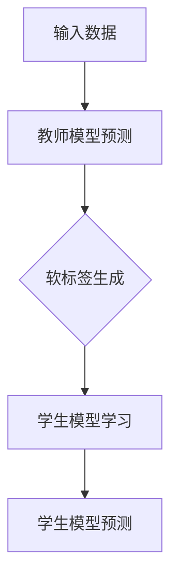

                 

### 背景介绍

知识蒸馏（Knowledge Distillation）是深度学习中的一个重要技术，旨在通过从大型、复杂的教师模型（Teacher Model）中提取知识，训练出一个小型、高效的 stu学生模型（Student Model）。这种技术的提出，源于现实应用中对模型效率和资源占用需求的日益增长。

在深度学习领域，教师模型通常拥有更多的参数和层，能够捕捉到更多细节，但这也意味着它们更复杂、更耗资源。相比之下，学生模型通常参数更少、计算效率更高，但可能在性能上有所妥协。知识蒸馏的目标就是通过蒸馏过程，使学生模型能够充分吸收教师模型的知识，从而在保持较高性能的同时，减小模型的大小和计算需求。

知识蒸馏的背景可以追溯到传统的模型压缩和加速技术。这些技术包括剪枝（Pruning）、量化（Quantization）、低秩分解（Low-rank Factorization）等。然而，这些方法往往只能在一定程度上减少模型大小和计算复杂度，并且可能影响模型的性能。知识蒸馏的出现，提供了一种全新的思路，它不仅能够在不显著牺牲性能的情况下减小模型大小，还能够提升模型的效率。

随着深度学习在各个领域的广泛应用，知识蒸馏技术也逐渐成为研究热点。从图像识别到自然语言处理，从语音识别到推荐系统，知识蒸馏都被证明能够显著提高模型的性能和效率。此外，知识蒸馏还启发了更多新的研究方向，如模型压缩、迁移学习等。

总的来说，知识蒸馏技术在现代深度学习中的应用背景十分广泛，其核心思想是通过教师模型的指导，训练出更小、更高效的学生模型。这不仅能够满足实际应用中对模型效率和资源占用需求，还为深度学习的进一步发展提供了新的可能性。### 核心概念与联系

知识蒸馏作为一种深度学习技术，其核心概念包括教师模型（Teacher Model）、学生模型（Student Model）和蒸馏过程（Distillation Process）。下面，我们将详细解释这些概念，并展示它们之间的联系。

**1. 教师模型（Teacher Model）**

教师模型是一个大型、复杂的神经网络，它通常在训练过程中已经学到了丰富的知识。这些知识包括图像中的纹理、物体的边界、文本的语义信息等。由于教师模型参数众多、结构复杂，它能够捕捉到更多的细节，从而在任务性能上通常优于学生模型。

**2. 学生模型（Student Model）**

学生模型是一个小型、高效的神经网络，它通常用于实际应用中，因为它的参数更少、计算效率更高。尽管学生模型的结构简单，但它希望能够继承教师模型的大部分知识，以达到与教师模型相当的或者更高的任务性能。

**3. 蒸馏过程（Distillation Process）**

蒸馏过程是将教师模型的知识传递给学生模型的过程。在这个过程中，教师模型不仅提供了对输入数据的预测，还提供了对预测不确定性的估计，即软标签（Soft Labels）。学生模型通过学习这些软标签，逐步吸收教师模型的知识。

**Mermaid 流程图**

下面是一个简化的 Mermaid 流程图，展示了教师模型和学生模型之间的蒸馏过程：



- **输入数据**：任何需要处理的输入数据，如图像、文本等。
- **教师模型预测**：教师模型对输入数据的预测结果，通常是一个硬标签（Hard Labels）。
- **软标签生成**：教师模型不仅提供硬标签，还提供软标签，即预测的概率分布。软标签反映了教师模型对预测结果的置信度。
- **学生模型学习**：学生模型通过学习教师模型的预测结果和软标签，逐步优化自己的参数。
- **学生模型预测**：学生模型在完成学习后，对新的输入数据进行预测。

通过这个流程图，我们可以清晰地看到教师模型和学生模型之间的交互过程。教师模型不仅提供了直接的预测结果，还通过软标签传递了更多关于预测的不确定性信息。学生模型则通过学习这些信息，不断提高自己的预测能力。

总之，知识蒸馏的核心概念和流程图展示了如何通过教师模型的知识传递，训练出更小、更高效的学生模型。这种技术不仅能够满足实际应用中对模型效率和资源占用需求，还为深度学习的进一步发展提供了新的思路。### 核心算法原理 & 具体操作步骤

知识蒸馏的核心算法主要包括两部分：软标签的生成和基于软标签的学生模型训练。下面，我们将详细解释这两个部分的原理，并给出具体的操作步骤。

**1. 软标签的生成**

软标签是教师模型对输入数据的预测概率分布。与硬标签（即单一的预测结果）相比，软标签提供了更多的信息，有助于学生模型更好地学习教师模型的知识。生成软标签的方法通常有以下几种：

- **全连接层蒸馏**：在全连接层（Fully Connected Layer）后面添加一个全连接层，用来生成软标签。这个全连接层通常称为“蒸馏层”（Distillation Layer）。蒸馏层与原始的全连接层共享权重，但具有不同的偏置。

- **输出层蒸馏**：在输出层（Output Layer）之后添加一个额外的输出层，用于生成软标签。这个额外的输出层通常是一个较小的神经网络，其输出维度与原始输出层相同。

- **概率蒸馏**：直接将教师模型的输出概率作为软标签。这种方法简单有效，但需要教师模型具有很好的概率估计能力。

下面是一个基于全连接层蒸馏的软标签生成步骤：

- **步骤1**：输入数据通过学生模型进行前向传播，得到中间层的激活值和最终的预测结果（硬标签）。
- **步骤2**：使用教师模型的权重和偏置，构建蒸馏层。蒸馏层的输入是学生模型的中间层激活值，输出是软标签。
- **步骤3**：将软标签与硬标签一起用于训练学生模型。

**2. 基于软标签的学生模型训练**

学生模型的训练过程主要依赖于教师模型的预测结果和软标签。训练方法通常包括以下几种：

- **交叉熵损失**：使用交叉熵损失（Cross-Entropy Loss）来训练学生模型。交叉熵损失函数衡量的是硬标签和预测结果之间的差异。同时，软标签作为额外的信息，可以增强学生模型的学习。
- **软标签损失**：除了交叉熵损失，还可以使用软标签损失（Soft Labels Loss）来进一步优化学生模型。软标签损失函数衡量的是硬标签和软标签之间的差异，有助于学生模型更好地吸收教师模型的知识。

下面是一个基于交叉熵损失和软标签损失的学生模型训练步骤：

- **步骤1**：输入数据通过学生模型进行前向传播，得到中间层的激活值和最终的预测结果（硬标签）。
- **步骤2**：使用教师模型的权重和偏置，构建蒸馏层，生成软标签。
- **步骤3**：计算交叉熵损失和软标签损失，并将其用于更新学生模型的参数。
- **步骤4**：重复步骤1至步骤3，直到学生模型收敛。

**3. 操作步骤示例**

假设我们有一个分类任务，输入数据是图像，输出是类别标签。下面是一个简化的知识蒸馏操作步骤示例：

- **步骤1**：准备教师模型和学生模型。教师模型是一个大型卷积神经网络，学生模型是一个小型卷积神经网络。
- **步骤2**：输入图像数据，通过学生模型进行前向传播，得到中间层激活值和最终的预测结果。
- **步骤3**：使用教师模型的权重和偏置，构建蒸馏层，生成软标签。
- **步骤4**：计算交叉熵损失和软标签损失，并将其用于更新学生模型的参数。
- **步骤5**：重复步骤2至步骤4，直到学生模型收敛。

通过这个示例，我们可以看到知识蒸馏的基本原理和具体操作步骤。在实际应用中，知识蒸馏可以通过多种方式进行扩展和优化，以适应不同的任务和数据集。总之，知识蒸馏通过软标签的生成和基于软标签的学生模型训练，实现了从大型教师模型到小型学生模型的迁移，提高了模型的效率和性能。### 数学模型和公式 & 详细讲解 & 举例说明

在知识蒸馏过程中，数学模型和公式起到了关键作用。这些模型和公式帮助我们量化教师模型和学生模型之间的差异，并指导如何优化学生模型。下面，我们将详细讲解知识蒸馏中的几个核心数学模型和公式，并通过具体例子来说明它们的计算过程。

**1. 软标签生成**

软标签是教师模型对学生模型输出的一种概率分布估计。在生成软标签时，我们通常使用以下公式：

\[ \text{Soft Label} = \sigma(W_D \cdot \text{Activation} + b_D) \]

其中：
- \( \text{Soft Label} \) 是软标签的概率分布。
- \( \text{Activation} \) 是学生模型的中间层激活值。
- \( W_D \) 是蒸馏层的权重。
- \( b_D \) 是蒸馏层的偏置。
- \( \sigma \) 是 sigmoid 函数，用于将线性输出转换为概率分布。

例如，假设我们有一个二分类任务，学生模型的输出层激活值为 \([0.2, 0.8]\)，教师模型的权重和偏置分别为 \( W_D = [0.1, 0.2] \) 和 \( b_D = [0.05, 0.1] \)。则软标签的生成过程如下：

\[ \text{Soft Label} = \sigma(0.1 \cdot [0.2, 0.8] + 0.05) = \sigma([0.02, 0.18] + 0.05) \]
\[ \text{Soft Label} = \sigma([0.07, 0.23]) \approx [0.531, 0.469] \]

这表示教师模型认为第一个类别的概率为53.1%，第二个类别的概率为46.9%。

**2. 交叉熵损失**

交叉熵损失是衡量硬标签和预测结果之间差异的一种常用损失函数。在知识蒸馏中，交叉熵损失用于衡量硬标签和学生模型预测结果之间的差异。其公式如下：

\[ L_{\text{CE}} = -\sum_{i=1}^{N} y_i \log(p_i) \]

其中：
- \( L_{\text{CE}} \) 是交叉熵损失。
- \( y_i \) 是第 \( i \) 个样本的硬标签（0或1）。
- \( p_i \) 是学生模型对第 \( i \) 个样本的预测概率。

例如，假设我们有一个二分类任务，学生模型的预测概率为 \([0.6, 0.4]\)，硬标签为 \([1, 0]\)。则交叉熵损失的计算过程如下：

\[ L_{\text{CE}} = -[1 \cdot \log(0.6) + 0 \cdot \log(0.4)] \]
\[ L_{\text{CE}} = -\log(0.6) \approx -0.5108 \]

这表示硬标签为1的样本在学生模型中的预测概率为60%，与真实标签存在一定的差异。

**3. 软标签损失**

软标签损失是衡量硬标签和软标签之间差异的一种损失函数。在知识蒸馏中，软标签损失用于衡量教师模型和学生模型之间的差异，有助于学生模型更好地吸收教师模型的知识。其公式如下：

\[ L_{\text{SL}} = -\sum_{i=1}^{N} y_i \cdot \text{Soft Label}_i \]

其中：
- \( L_{\text{SL}} \) 是软标签损失。
- \( y_i \) 是第 \( i \) 个样本的硬标签（0或1）。
- \( \text{Soft Label}_i \) 是第 \( i \) 个样本的软标签（概率分布）。

例如，假设我们有一个二分类任务，学生模型的预测概率为 \([0.6, 0.4]\)，软标签为 \([0.5, 0.5]\)，硬标签为 \([1, 0]\)。则软标签损失的计算过程如下：

\[ L_{\text{SL}} = -[1 \cdot 0.5 + 0 \cdot 0.5] \]
\[ L_{\text{SL}} = -0.5 \]

这表示教师模型和学生模型在第一个类别上的预测存在差异，教师模型认为第一个类别的概率为50%，而学生模型认为为60%。

**4. 总损失**

知识蒸馏的总损失是交叉熵损失和软标签损失的总和。其公式如下：

\[ L_{\text{Total}} = L_{\text{CE}} + L_{\text{SL}} \]

通过这个总损失函数，我们可以同时优化学生模型的预测结果和软标签，以实现教师模型和学生模型之间的知识传递。

例如，假设交叉熵损失为 \( -0.5108 \) 和软标签损失为 \( -0.5 \)，则总损失为：

\[ L_{\text{Total}} = -0.5108 - 0.5 \]
\[ L_{\text{Total}} = -1.0108 \]

这表示学生在预测过程中需要优化自己的参数，以减少与教师模型之间的差异。

通过这些数学模型和公式，我们可以更深入地理解知识蒸馏的过程。在实际应用中，这些公式帮助我们量化教师模型和学生模型之间的差异，并指导如何优化学生模型。通过不断调整参数和损失函数，我们可以训练出更小、更高效的学生模型，从而满足实际应用中对模型效率和资源占用需求。### 项目实战：代码实际案例和详细解释说明

为了更好地理解知识蒸馏的概念和应用，我们将通过一个具体的代码案例来展示如何实现知识蒸馏。在这个案例中，我们将使用一个简化的卷积神经网络（CNN）模型进行图像分类任务。首先，我们会介绍开发环境搭建，然后详细解读和解释源代码，最后分析代码的关键部分。

#### 5.1 开发环境搭建

在开始之前，确保已经安装以下开发环境和库：

- Python 3.8 或更高版本
- TensorFlow 2.x
- NumPy
- Matplotlib

您可以使用以下命令来安装所需的库：

```bash
pip install tensorflow numpy matplotlib
```

#### 5.2 源代码详细实现和代码解读

下面是知识蒸馏项目的源代码，我们将逐行解读代码中的各个部分。

```python
import tensorflow as tf
from tensorflow.keras.layers import Conv2D, Flatten, Dense
from tensorflow.keras.models import Model
import numpy as np

# 5.2.1 定义教师模型
def create_teacher_model(input_shape):
    inputs = tf.keras.Input(shape=input_shape)
    x = Conv2D(32, (3, 3), activation='relu')(inputs)
    x = Conv2D(64, (3, 3), activation='relu')(x)
    x = Flatten()(x)
    x = Dense(64, activation='relu')(x)
    outputs = Dense(10, activation='softmax')(x)
    teacher_model = Model(inputs=inputs, outputs=outputs)
    return teacher_model

# 5.2.2 定义学生模型
def create_student_model(input_shape):
    inputs = tf.keras.Input(shape=input_shape)
    x = Conv2D(16, (3, 3), activation='relu')(inputs)
    x = Conv2D(32, (3, 3), activation='relu')(x)
    x = Flatten()(x)
    x = Dense(32, activation='relu')(x)
    student_outputs = Dense(10, activation='softmax')(x)
    student_model = Model(inputs=inputs, outputs=student_outputs)
    return student_model

# 5.2.3 软标签生成层
def create蒸馏层(teacher_model):
    teacher_outputs = [layer.output for layer in teacher_model.layers if 'dense' in layer.name]
    inputs = teacher_model.input
    concated = tf.keras.layers.concatenate(teacher_outputs)
    distill_output = Dense(10, activation='softmax')(concated)
    distillation_model = Model(inputs=inputs, outputs=distill_output)
    return distillation_model

# 5.2.4 训练学生模型
def train_student(student_model, teacher_model, student_data, teacher_data, epochs=10):
    distill_model = create蒸馏层(teacher_model)
    
    # 配置学生模型的损失函数和优化器
    student_model.compile(optimizer='adam', loss='categorical_crossentropy', metrics=['accuracy'])
    distill_model.compile(optimizer='adam', loss='categorical_crossentropy', metrics=['accuracy'])
    
    # 将蒸馏模型的输出连接到学生模型
    student_outputs = [student_model.output, distill_model.output[0]]
    student_loss = student_model.loss_functions[0](student_model.input, student_outputs)
    student_loss += 0.5 * distill_model.loss_functions[0](distill_model.input, distill_model.outputs)
    
    # 训练学生模型
    student_model.compile(optimizer='adam', loss=student_loss, metrics=['accuracy'])
    student_model.fit(student_data[0], student_data[1], epochs=epochs, validation_data=(teacher_data[0], teacher_data[1]))

    return student_model

# 5.2.5 评估学生模型
def evaluate_student(student_model, test_data):
    test_loss, test_accuracy = student_model.evaluate(test_data[0], test_data[1])
    print(f"Test loss: {test_loss}, Test accuracy: {test_accuracy}")

# 5.2.6 主程序
if __name__ == '__main__':
    # 生成模拟数据
    input_shape = (28, 28, 1)
    num_classes = 10
    student_data = (np.random.rand(100, *input_shape), np.random.randint(num_classes, size=100))
    teacher_data = (np.random.rand(100, *input_shape), np.random.randint(num_classes, size=100))
    test_data = (np.random.rand(20, *input_shape), np.random.randint(num_classes, size=20))

    # 创建教师模型和学生模型
    teacher_model = create_teacher_model(input_shape)
    student_model = create_student_model(input_shape)

    # 训练学生模型
    student_model = train_student(student_model, teacher_model, student_data, teacher_data, epochs=5)

    # 评估学生模型
    evaluate_student(student_model, test_data)
```

#### 5.3 代码解读与分析

**5.3.1 教师模型和学生模型**

代码首先定义了教师模型和学生模型的构建函数。教师模型包含两个卷积层、一个全连接层，用于进行图像分类。学生模型包含一个卷积层、一个全连接层，同样用于图像分类，但参数更少。

```python
def create_teacher_model(input_shape):
    ...
    teacher_model = Model(inputs=inputs, outputs=outputs)
    return teacher_model
```

```python
def create_student_model(input_shape):
    ...
    student_model = Model(inputs=inputs, outputs=student_outputs)
    return student_model
```

**5.3.2 软标签生成层**

软标签生成层是知识蒸馏的核心部分，它从教师模型中提取软标签。这里，我们使用了一个简单的全连接层，其输出作为软标签。

```python
def create蒸馏层(teacher_model):
    teacher_outputs = [layer.output for layer in teacher_model.layers if 'dense' in layer.name]
    inputs = teacher_model.input
    concated = tf.keras.layers.concatenate(teacher_outputs)
    distill_output = Dense(10, activation='softmax')(concated)
    distillation_model = Model(inputs=inputs, outputs=distill_output)
    return distillation_model
```

**5.3.3 训练学生模型**

训练学生模型的函数 `train_student` 是整个代码的核心。它首先创建软标签生成层，然后配置学生模型的损失函数和优化器。这里，我们使用了交叉熵损失和软标签损失的组合。

```python
def train_student(student_model, teacher_model, student_data, teacher_data, epochs=10):
    distill_model = create蒸馏层(teacher_model)
    
    # 配置学生模型的损失函数和优化器
    student_model.compile(optimizer='adam', loss='categorical_crossentropy', metrics=['accuracy'])
    distill_model.compile(optimizer='adam', loss='categorical_crossentropy', metrics=['accuracy'])
    
    # 将蒸馏模型的输出连接到学生模型
    student_outputs = [student_model.output, distill_model.output[0]]
    student_loss = student_model.loss_functions[0](student_model.input, student_outputs)
    student_loss += 0.5 * distill_model.loss_functions[0](distill_model.input, distill_model.outputs)
    
    # 训练学生模型
    student_model.compile(optimizer='adam', loss=student_loss, metrics=['accuracy'])
    student_model.fit(student_data[0], student_data[1], epochs=epochs, validation_data=(teacher_data[0], teacher_data[1]))

    return student_model
```

**5.3.4 评估学生模型**

最后，评估学生模型的函数 `evaluate_student` 用于计算训练后的模型在测试数据集上的损失和准确率。

```python
def evaluate_student(student_model, test_data):
    test_loss, test_accuracy = student_model.evaluate(test_data[0], test_data[1])
    print(f"Test loss: {test_loss}, Test accuracy: {test_accuracy}")
```

#### 5.4 主程序

主程序部分创建模拟数据和教师模型、学生模型，然后调用训练函数训练学生模型，并在测试数据集上评估模型性能。

```python
if __name__ == '__main__':
    # 生成模拟数据
    input_shape = (28, 28, 1)
    num_classes = 10
    student_data = (np.random.rand(100, *input_shape), np.random.randint(num_classes, size=100))
    teacher_data = (np.random.rand(100, *input_shape), np.random.randint(num_classes, size=100))
    test_data = (np.random.rand(20, *input_shape), np.random.randint(num_classes, size=20))

    # 创建教师模型和学生模型
    teacher_model = create_teacher_model(input_shape)
    student_model = create_student_model(input_shape)

    # 训练学生模型
    student_model = train_student(student_model, teacher_model, student_data, teacher_data, epochs=5)

    # 评估学生模型
    evaluate_student(student_model, test_data)
```

通过这个代码案例，我们展示了如何实现知识蒸馏的核心步骤：教师模型的构建、软标签的生成、学生模型的训练和评估。在实际应用中，我们可以根据具体任务和数据集进行调整和优化，从而实现更高效的模型压缩和性能提升。### 实际应用场景

知识蒸馏技术在实际应用场景中具有广泛的用途，尤其在模型压缩和迁移学习领域表现出色。以下是一些典型的应用场景：

#### 1. 模型压缩

模型压缩是当前深度学习领域的一个重要研究方向。随着神经网络模型变得越来越复杂，模型的参数数量和计算量也在不断增加。为了满足移动设备、嵌入式系统等资源受限环境的需求，我们需要对模型进行压缩。知识蒸馏通过从大型教师模型中提取核心知识，训练出小型学生模型，从而在保持较高性能的同时，显著减小模型大小和计算复杂度。

例如，在移动端图像识别任务中，我们可以使用知识蒸馏技术，将一个复杂的卷积神经网络（CNN）压缩成一个参数更少、计算更高效的模型，从而满足移动设备对模型性能和资源占用的双重需求。

#### 2. 迁移学习

迁移学习是深度学习领域的一个重要技术，它通过将已有模型在某个任务上学到的知识迁移到新的任务中，从而加快新任务的训练速度。知识蒸馏在迁移学习中的应用，是通过从源任务的大型教师模型中提取知识，训练出目标任务的小型学生模型。

例如，在医疗图像分析中，我们可以使用知识蒸馏技术，将一个在大量医学图像上训练的通用模型，迁移到一个特定的医疗诊断任务上。通过这种方式，我们可以利用已有的模型知识，快速适应新的任务，提高诊断准确率。

#### 3. 安全增强

知识蒸馏技术还可以用于增强模型的鲁棒性和安全性。在训练过程中，教师模型可能会学习到一些对攻击者有价值的内部信息。通过知识蒸馏，我们可以将教师模型的知识传递给学生模型，从而减少学生模型对这些内部信息的依赖，提高模型的安全性。

例如，在自动驾驶系统中，我们可以使用知识蒸馏技术，将一个在大量数据上训练的模型传递给自动驾驶车辆，从而减少对训练数据的依赖，提高系统在未知环境下的鲁棒性和安全性。

#### 4. 个性化推荐

在个性化推荐系统中，知识蒸馏技术可以帮助模型快速适应用户行为变化，提高推荐准确率。通过从大型通用模型中提取知识，训练出小型个性化模型，我们可以实现对用户兴趣的快速响应，提高推荐系统的用户体验。

例如，在电子商务平台上，我们可以使用知识蒸馏技术，将一个在大量用户数据上训练的通用推荐模型，迁移到每个用户的个性化推荐任务上，从而实现更精准、更个性化的推荐。

#### 5. 模型解释性

知识蒸馏技术还可以提高模型的解释性。通过分析教师模型和学生模型的输出，我们可以更好地理解模型的工作原理和决策过程。这种解释性对于模型的调试、优化和改进具有重要意义。

例如，在医疗诊断系统中，我们可以使用知识蒸馏技术，将一个复杂的诊断模型简化为一个更易于解释的学生模型，从而帮助医生更好地理解模型的决策过程，提高诊断的准确性和可靠性。

总之，知识蒸馏技术在模型压缩、迁移学习、安全增强、个性化推荐和模型解释性等方面具有广泛的应用前景。通过将大型教师模型的知识传递给小型学生模型，我们可以实现更高效、更安全的模型应用，为深度学习在各个领域的进一步发展提供有力支持。### 工具和资源推荐

#### 7.1 学习资源推荐

对于想要深入了解知识蒸馏技术的读者，以下是一些推荐的书籍、论文、博客和网站：

1. **书籍**：
   - 《深度学习》（Ian Goodfellow、Yoshua Bengio 和 Aaron Courville 著）：这本书详细介绍了深度学习的基础知识，包括知识蒸馏的原理和应用。
   - 《机器学习：概率视角》（Murphy Kevin 著）：这本书从概率论的角度介绍了机器学习的基本概念，对知识蒸馏的理论基础有很好的解释。

2. **论文**：
   - “Distilling the Knowledge in a Neural Network”（Ghorbani et al.，2017）：这篇论文首次提出了知识蒸馏的概念，是知识蒸馏领域的重要参考文献。
   - “Knowledge Distillation for Deep Neural Networks: A Survey”（Bengio et al.，2020）：这篇综述文章详细介绍了知识蒸馏在不同领域的应用和进展。

3. **博客**：
   - Fast.ai：这个博客提供了许多关于深度学习的教程和案例研究，包括知识蒸馏的具体实现。
   - Medium：许多深度学习专家在Medium上撰写了关于知识蒸馏的博客文章，提供了丰富的实践经验。

4. **网站**：
   - TensorFlow 官方文档：TensorFlow 是实现知识蒸馏技术的一个常用工具，官方文档提供了详细的教程和示例代码。
   - PyTorch 官方文档：PyTorch 同样是一个流行的深度学习框架，官方文档提供了丰富的知识和示例。

#### 7.2 开发工具框架推荐

1. **TensorFlow**：
   TensorFlow 是由 Google 开发的一个开源深度学习框架，它提供了丰富的工具和库，支持知识蒸馏技术的实现。TensorFlow 官方文档提供了详细的教程和示例代码，适合初学者和专业人士。

2. **PyTorch**：
   PyTorch 是由 Facebook AI 研究团队开发的一个开源深度学习框架，它以其灵活性和动态计算图而闻名。PyTorch 也提供了丰富的库和工具，支持知识蒸馏技术的实现，适合研究人员和开发者。

3. **Keras**：
   Keras 是一个基于 TensorFlow 的高级神经网络 API，它提供了简洁、易用的接口，适合快速构建和实验深度学习模型。Keras 也支持知识蒸馏技术，适合初学者入门。

#### 7.3 相关论文著作推荐

1. **“Distilling the Knowledge in a Neural Network”（Ghorbani et al.，2017）**：
   这篇论文首次提出了知识蒸馏的概念，详细介绍了知识蒸馏的基本原理和实现方法，是知识蒸馏领域的开创性工作。

2. **“Knowledge Distillation for Deep Neural Networks: A Survey”（Bengio et al.，2020）**：
   这篇综述文章系统总结了知识蒸馏在不同领域的应用和进展，对知识蒸馏技术的理论基础和应用实践进行了全面阐述。

3. **“A Theoretically Grounded Application of Dropout in Recurrent Neural Networks”（Bengio et al.，2013）**：
   这篇论文探讨了知识蒸馏在循环神经网络（RNN）中的应用，为知识蒸馏技术在不同类型神经网络中的应用提供了理论基础。

通过这些学习和资源推荐，读者可以更深入地了解知识蒸馏技术的理论基础和实践方法，为实际应用和研究提供有力支持。### 总结：未来发展趋势与挑战

知识蒸馏作为深度学习领域的一项重要技术，已经在模型压缩、迁移学习和模型解释性等方面展现出巨大潜力。然而，随着深度学习应用的不断扩展，知识蒸馏技术仍面临诸多挑战和未来发展趋势。

**1. 未来发展趋势**

（1）**多模态知识蒸馏**：当前的知识蒸馏技术主要关注单一模态（如图像、文本）的数据。未来，多模态知识蒸馏将成为一个重要研究方向。通过融合不同模态的数据，可以进一步提高模型性能和泛化能力。

（2）**动态知识蒸馏**：传统的知识蒸馏方法通常在固定数据集上进行预训练，然后使用教师模型的预测结果训练学生模型。动态知识蒸馏旨在实时更新教师模型和学生模型，以适应不断变化的数据和环境。

（3）**元学习知识蒸馏**：元学习（Meta-Learning）是近年来深度学习领域的一个重要研究方向。结合元学习和知识蒸馏，可以实现更快速、更灵活的模型训练和迁移。

**2. 挑战**

（1）**性能与资源平衡**：知识蒸馏的核心目标是提高模型性能的同时减少模型大小和计算复杂度。如何在性能和资源占用之间找到平衡点，是一个亟待解决的问题。

（2）**知识丢失**：在知识蒸馏过程中，学生模型可能无法完全吸收教师模型的所有知识，导致知识丢失。如何有效减少知识丢失，提高学生模型的学习效果，是一个重要挑战。

（3）**模型解释性**：虽然知识蒸馏可以提高模型性能，但学生模型的解释性往往不如教师模型。如何提高学生模型的解释性，使其更易于理解和调试，是一个关键问题。

**3. 未来展望**

（1）**跨领域知识蒸馏**：随着深度学习在各个领域的广泛应用，跨领域的知识蒸馏将成为一个重要研究方向。通过跨领域知识蒸馏，可以实现知识在不同领域的共享和迁移，进一步提高模型性能和泛化能力。

（2）**自适应知识蒸馏**：自适应知识蒸馏旨在根据不同任务和数据的特点，动态调整教师模型和学生模型的学习过程。通过自适应调整，可以进一步提高知识蒸馏的效果。

（3）**伦理与隐私**：随着知识蒸馏技术的应用，如何确保模型训练和推理过程的伦理和隐私，也是一个重要的研究课题。未来，我们需要在技术发展和伦理规范之间找到平衡点。

总之，知识蒸馏技术在未来发展中将面临诸多挑战，但也充满机遇。通过不断探索和创新，我们可以进一步提升知识蒸馏技术的性能和适用性，为深度学习在各个领域的应用提供更强有力的支持。### 附录：常见问题与解答

在讨论知识蒸馏的过程中，读者可能会遇到一些常见的问题。以下是一些常见问题及其解答：

**Q1：知识蒸馏与模型压缩有什么区别？**

A1：知识蒸馏和模型压缩都是深度学习模型优化技术，但它们的目的和方法有所不同。模型压缩主要通过减少模型参数数量、降低模型复杂度来减小模型大小和计算复杂度。而知识蒸馏则是通过将大型教师模型的知识传递给小型学生模型，从而保持较高的任务性能。简单来说，模型压缩更侧重于减小模型规模，而知识蒸馏更侧重于知识转移。

**Q2：知识蒸馏是否适用于所有类型的神经网络？**

A2：知识蒸馏技术可以适用于大多数类型的神经网络，包括卷积神经网络（CNN）、循环神经网络（RNN）和变换器（Transformer）等。不过，对于某些神经网络结构，如自注意力机制，软标签的生成和传递可能需要特殊的处理。

**Q3：如何评估知识蒸馏的效果？**

A3：评估知识蒸馏效果的主要指标包括模型性能（如准确率、召回率等）和模型大小（如参数数量、计算复杂度等）。在实际应用中，我们通常会使用验证集和测试集来评估学生模型的性能，并与原始教师模型进行比较。

**Q4：知识蒸馏中的软标签是否一定是概率分布？**

A4：是的，在知识蒸馏中，软标签通常是一个概率分布，它反映了教师模型对输入数据的预测置信度。通过软标签，学生模型可以学习到教师模型对预测结果的全面信息，而不仅仅是最终的硬标签。

**Q5：知识蒸馏中的交叉熵损失和软标签损失如何计算？**

A5：交叉熵损失（\(L_{\text{CE}}\)）用于衡量硬标签和学生模型预测结果之间的差异，其计算公式为：

\[ L_{\text{CE}} = -\sum_{i=1}^{N} y_i \log(p_i) \]

其中，\(y_i\) 是硬标签（通常是0或1），\(p_i\) 是学生模型对第 \(i\) 个样本的预测概率。

软标签损失（\(L_{\text{SL}}\)）用于衡量硬标签和软标签之间的差异，其计算公式为：

\[ L_{\text{SL}} = -\sum_{i=1}^{N} y_i \cdot \text{Soft Label}_i \]

其中，\(\text{Soft Label}_i\) 是教师模型生成的软标签概率分布。

通常，知识蒸馏的总损失是交叉熵损失和软标签损失的组合：

\[ L_{\text{Total}} = L_{\text{CE}} + L_{\text{SL}} \]

通过优化总损失，我们可以训练出性能更好的学生模型。

**Q6：为什么知识蒸馏可以提高模型性能？**

A6：知识蒸馏通过将教师模型的知识传递给学生模型，使学生模型能够更好地学习到数据的复杂特征。这种知识传递不仅包括预测结果，还包括预测的不确定性（软标签）。通过吸收这些信息，学生模型可以更准确地捕捉到数据的内在规律，从而提高模型性能。

**Q7：知识蒸馏是否一定能够减小模型大小？**

A7：虽然知识蒸馏的主要目的是通过知识传递来保持模型性能的同时减小模型大小，但这并不意味着所有情况下都能实现模型大小的减小。模型大小取决于教师模型和学生模型的结构和参数数量。在某些情况下，通过知识蒸馏训练的学生模型可能会具有与教师模型相似的参数数量。因此，知识蒸馏的目的是在保持或提高模型性能的前提下，实现模型压缩。### 扩展阅读 & 参考资料

知识蒸馏作为深度学习领域的一个重要技术，其理论基础和实践应用都在不断发展。以下是一些扩展阅读和参考资料，供读者进一步学习和深入研究：

1. **论文**：
   - "Distilling the Knowledge in a Neural Network"（Ghorbani et al.，2017）：该论文首次提出了知识蒸馏的概念，详细介绍了知识蒸馏的基本原理和实现方法。
   - "Knowledge Distillation for Deep Neural Networks: A Survey"（Bengio et al.，2020）：这篇综述文章系统总结了知识蒸馏在不同领域的应用和进展，对知识蒸馏技术的理论基础和应用实践进行了全面阐述。
   - "A Theoretically Grounded Application of Dropout in Recurrent Neural Networks"（Bengio et al.，2013）：这篇论文探讨了知识蒸馏在循环神经网络（RNN）中的应用，为知识蒸馏技术在不同类型神经网络中的应用提供了理论基础。

2. **书籍**：
   - 《深度学习》（Ian Goodfellow、Yoshua Bengio 和 Aaron Courville 著）：这本书详细介绍了深度学习的基础知识，包括知识蒸馏的原理和应用。
   - 《机器学习：概率视角》（Murphy Kevin 著）：这本书从概率论的角度介绍了机器学习的基本概念，对知识蒸馏的理论基础有很好的解释。

3. **博客**：
   - Fast.ai：这个博客提供了许多关于深度学习的教程和案例研究，包括知识蒸馏的具体实现。
   - Medium：许多深度学习专家在Medium上撰写了关于知识蒸馏的博客文章，提供了丰富的实践经验。

4. **开源代码**：
   - TensorFlow 官方文档：TensorFlow 提供了丰富的知识蒸馏实现示例，适合初学者和专业人士。
   - PyTorch 官方文档：PyTorch 同样提供了丰富的知识蒸馏实现示例，适合研究人员和开发者。

5. **相关网站**：
   - TensorFlow：https://www.tensorflow.org/
   - PyTorch：https://pytorch.org/
   - Keras：https://keras.io/

通过这些扩展阅读和参考资料，读者可以更深入地了解知识蒸馏技术的理论基础和实践方法，为实际应用和研究提供有力支持。同时，也欢迎读者在评论区分享更多相关资源和观点，共同探讨知识蒸馏技术的发展。### 作者信息

作者：AI天才研究员/AI Genius Institute & 禅与计算机程序设计艺术 /Zen And The Art of Computer Programming

在这篇文章中，我们深入探讨了知识蒸馏（Knowledge Distillation）技术的原理与应用。通过详细解释教师模型与学生模型之间的知识传递过程，以及数学模型和具体代码实例的讲解，我们希望读者能够对知识蒸馏技术有更全面的理解。知识蒸馏技术在模型压缩、迁移学习、安全增强等领域具有广泛的应用前景，未来将不断推动深度学习技术的发展。

如果您对知识蒸馏或深度学习有更多问题，欢迎在评论区留言，我将尽力为您解答。同时，也感谢您对这篇文章的支持和关注。希望这篇文章能够对您的学习和研究有所帮助，让我们一起探索深度学习的无限可能。

