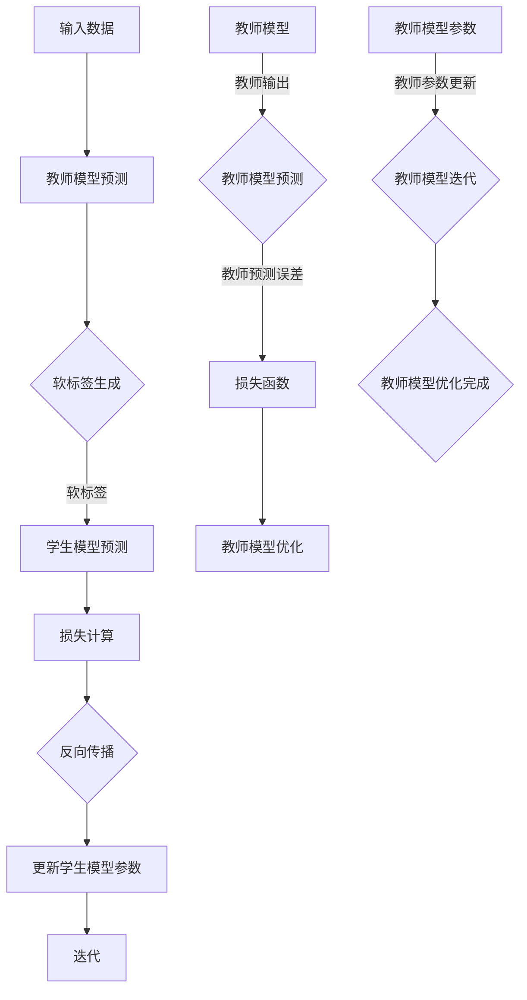
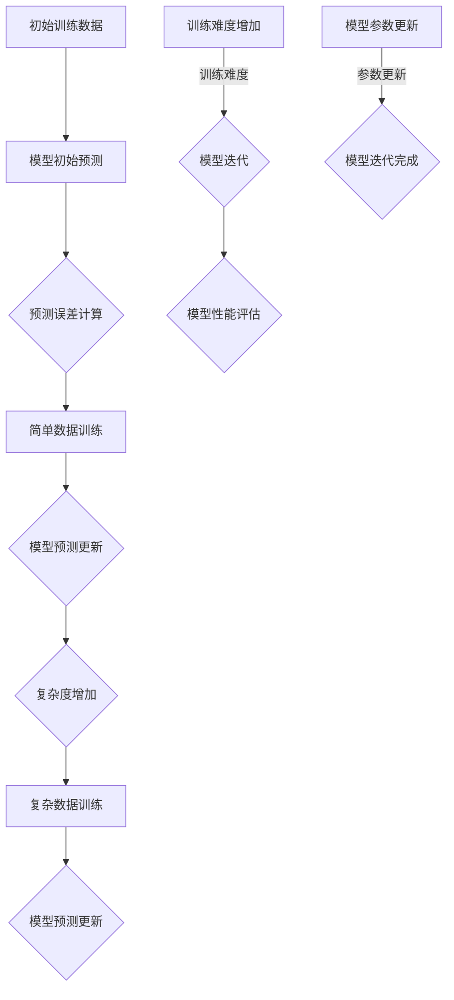
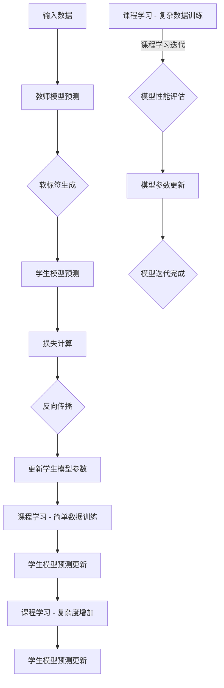

                 

### 背景介绍

随着深度学习技术的不断发展和普及，神经网络模型在各个领域都取得了显著的成果。然而，训练这些大型神经网络模型需要大量的数据和计算资源，这对于许多小型团队或个人研究者来说是一个巨大的挑战。为了解决这个问题，知识蒸馏（Knowledge Distillation）技术应运而生。

知识蒸馏是一种将大型教师模型（Teacher Model）的知识传递给小型学生模型（Student Model）的技术。通过将教师模型的输出作为学生模型的软标签（Soft Labels），学生模型可以学习到教师模型的知识，从而实现性能的提升。这一技术不仅能够解决模型规模不匹配的问题，还能够有效降低模型的计算复杂度和存储需求。

与此同时，课程学习（Curriculum Learning）也是一种常用的方法，通过逐步增加训练的难度，帮助模型更好地学习。这种方法可以避免模型过早地陷入局部最优，提高模型的泛化能力。

本文旨在探讨知识蒸馏与课程学习相结合的方法，通过逐步优化模型，实现更高效的模型训练和性能提升。文章将首先介绍知识蒸馏和课程学习的基本概念和原理，然后详细阐述二者结合的渐进式模型优化方法，并通过实际项目案例进行深入剖析。

通过对知识蒸馏与课程学习结合的深入探讨，本文希望为深度学习模型优化提供新的思路和方法，为相关领域的研究者和开发者提供有益的参考。接下来，我们将一步步深入探讨这两个核心概念及其结合的应用。

### 核心概念与联系

为了更好地理解知识蒸馏与课程学习的结合，我们首先需要详细探讨这两个核心概念的基本原理和架构。通过绘制Mermaid流程图，我们可以更直观地展示它们的工作流程及其相互关系。

#### 知识蒸馏原理与架构

知识蒸馏是一种模型压缩技术，主要用于将大型教师模型（Teacher Model）的知识传递给小型学生模型（Student Model）。以下是知识蒸馏的Mermaid流程图：



在这个流程图中，输入数据首先通过教师模型进行预测，得到教师模型的输出。然后，教师模型的输出与真实标签进行比较，生成软标签。软标签作为学生模型的输入标签，学生模型基于这些软标签进行预测。学生模型预测的结果与教师模型的输出进行比较，计算损失函数。通过反向传播和参数更新，学生模型不断迭代优化，最终实现性能的提升。

#### 课程学习原理与架构

课程学习是一种通过逐步增加训练难度来帮助模型学习的策略。其基本思想是从简单的例子开始，逐渐增加训练数据的复杂度，使得模型能够更好地学习。以下是课程学习的Mermaid流程图：



在这个流程图中，模型从简单的训练数据开始学习，逐步增加训练数据的复杂度。每次训练后，模型都会更新其预测结果，以更好地适应新的训练数据。通过这种逐步增加难度的训练方式，模型可以更好地学习，避免过早陷入局部最优。

#### 知识蒸馏与课程学习结合

知识蒸馏与课程学习可以结合，通过逐步优化模型来实现更高效的训练和性能提升。结合的流程可以如下表示：



在这个流程中，知识蒸馏用于传递教师模型的知识给学生模型，而课程学习则通过逐步增加训练数据的复杂度，帮助模型更好地学习。通过这种结合，模型可以在每次迭代中逐步提升其性能，实现更高效的训练和优化。

总的来说，知识蒸馏与课程学习的结合，通过教师模型的知识传递和逐步增加训练难度，可以实现模型的渐进式优化。这种方法不仅提高了模型的性能，还降低了模型的训练复杂度和计算资源需求，为深度学习模型优化提供了新的思路和方法。

### 核心算法原理 & 具体操作步骤

为了深入理解知识蒸馏与课程学习结合的渐进式模型优化方法，我们首先需要详细探讨其核心算法原理。以下是具体的操作步骤：

#### 步骤一：初始化教师模型和学生模型

首先，我们需要初始化一个大型教师模型和学生模型。教师模型通常是预训练好的大型神经网络，而学生模型是一个小型化版本，通常用于迁移学习或模型压缩。以下是初始化步骤的伪代码：

```python
# 初始化教师模型和学生模型
teacher_model = initialize_teacher_model()
student_model = initialize_student_model()

# 初始化课程难度
current_difficulty = "easy"
```

#### 步骤二：生成软标签

接下来，我们使用教师模型对输入数据进行预测，并生成软标签。软标签是教师模型输出的概率分布，用于指导学生模型的学习。以下是生成软标签的伪代码：

```python
# 生成软标签
def generate_soft_labels(data, model):
    predictions = model.predict(data)
    return softmax(predictions)

# 对输入数据生成软标签
soft_labels = generate_soft_labels(input_data, teacher_model)
```

#### 步骤三：训练学生模型

学生模型使用软标签进行训练，通过反向传播算法更新模型参数。在这一步，我们还需要根据课程学习的策略，逐步增加训练的难度。以下是训练学生模型的伪代码：

```python
# 训练学生模型
def train_student_model(data, soft_labels, model):
    model.fit(data, soft_labels, epochs=1, batch_size=batch_size)
    return model

# 训练学生模型并更新参数
student_model = train_student_model(input_data, soft_labels, student_model)
```

#### 步骤四：评估模型性能

在每次训练后，我们需要评估学生模型的性能。这可以通过计算模型在验证集上的准确率、损失函数值等指标来完成。如果模型性能达到预设的目标，我们可以进入下一步；否则，继续训练。以下是评估模型性能的伪代码：

```python
# 评估模型性能
def evaluate_model(model, validation_data):
    loss, accuracy = model.evaluate(validation_data)
    return loss, accuracy

# 计算模型性能
validation_loss, validation_accuracy = evaluate_model(student_model, validation_data)
```

#### 步骤五：调整课程难度

根据模型性能的评估结果，我们需要调整课程难度。如果模型性能未能达到目标，我们可能需要增加训练数据的复杂度，以便模型更好地学习。以下是调整课程难度的伪代码：

```python
# 调整课程难度
def adjust_difficulty(current_difficulty):
    if validation_accuracy < target_accuracy:
        current_difficulty = "medium"
    if validation_accuracy < target_accuracy:
        current_difficulty = "hard"
    return current_difficulty

# 调整课程难度
current_difficulty = adjust_difficulty(current_difficulty)
```

#### 步骤六：重复训练和评估

最后，我们重复训练和评估过程，直到模型性能达到预设的目标。以下是重复训练和评估的伪代码：

```python
# 主训练循环
while True:
    # 生成软标签
    soft_labels = generate_soft_labels(input_data, teacher_model)
    
    # 训练学生模型
    student_model = train_student_model(input_data, soft_labels, student_model)
    
    # 评估模型性能
    validation_loss, validation_accuracy = evaluate_model(student_model, validation_data)
    
    # 调整课程难度
    current_difficulty = adjust_difficulty(current_difficulty)
    
    # 检查是否达到目标性能
    if validation_accuracy >= target_accuracy:
        break

# 输出最终模型
output_model(student_model)
```

通过以上步骤，我们可以实现知识蒸馏与课程学习相结合的渐进式模型优化方法。这种方法不仅能够提升模型的性能，还能够有效地降低模型的训练复杂度和计算资源需求。

### 数学模型和公式 & 详细讲解 & 举例说明

在理解知识蒸馏与课程学习结合的渐进式模型优化的过程中，数学模型和公式扮演着至关重要的角色。它们不仅提供了理论支持，还能够帮助我们更准确地计算和评估模型性能。以下我们将详细介绍相关的数学模型和公式，并通过具体示例进行说明。

#### 知识蒸馏的数学模型

知识蒸馏的核心在于如何将教师模型的输出（通常是一个高维的概率分布）转换为对学生模型的有效指导。这个过程可以通过以下两个关键步骤实现：

1. **软标签生成**：教师模型的输出通常是一个高维的预测概率分布 $p_{teacher}(x)$，而软标签 $q_{soft}(x)$ 是教师模型输出概率的平滑版本。软标签的生成可以使用温度调度（Temperature Scaling）方法：

   $$ q_{soft}(x_i) = \frac{e^{T \cdot p_{teacher}(x_i)}}{\sum_{j} e^{T \cdot p_{teacher}(x_j)}} $$

   其中 $T$ 是温度参数，它控制了概率分布的平滑程度。$T$ 越大，概率分布越平滑；$T$ 越小，概率分布越集中。

2. **损失函数**：学生模型的损失函数用于衡量学生模型预测与教师模型输出之间的差距。一个常用的损失函数是交叉熵损失（Cross-Entropy Loss）：

   $$ L = -\sum_{i} \sum_{j} q_{soft}(x_i)_j \cdot \log(p_{student}(x_i)_j) $$

   其中 $p_{student}(x_i)$ 是学生模型对输入 $x_i$ 的预测概率分布，$q_{soft}(x_i)$ 是教师模型输出的软标签。

   **示例**：

   假设我们有一个二分类问题，教师模型的预测概率分布为 $p_{teacher}([1, 0]) = 0.8$ 和 $p_{teacher}([0, 1]) = 0.2$。使用温度调度 $T = 2$，我们可以计算软标签：

   $$ q_{soft}([1, 0]) = \frac{e^{2 \cdot 0.8}}{e^{2 \cdot 0.8} + e^{2 \cdot 0.2}} \approx 0.911 $$
   $$ q_{soft}([0, 1]) = \frac{e^{2 \cdot 0.2}}{e^{2 \cdot 0.8} + e^{2 \cdot 0.2}} \approx 0.089 $$

   如果学生模型的预测概率分布为 $p_{student}([1, 0]) = 0.6$ 和 $p_{student}([0, 1]) = 0.4$，我们可以计算交叉熵损失：

   $$ L = -0.911 \cdot \log(0.6) - 0.089 \cdot \log(0.4) \approx 0.262 $$

#### 课程学习的数学模型

课程学习的核心思想是逐步增加训练数据的复杂度，以帮助模型更好地学习。这种过程可以通过调整训练数据的难度来实现。

1. **难度调整策略**：一种常见的难度调整策略是使用学习曲线（Learning Curve）来动态调整训练数据的复杂度。学习曲线可以通过评估模型在训练集和验证集上的性能来生成：

   $$ D(t) = \frac{P_{train}(t) - P_{val}(t)}{\alpha \cdot (1 - P_{train}(t) + P_{val}(t))} $$

   其中 $P_{train}(t)$ 是训练集上的性能，$P_{val}(t)$ 是验证集上的性能，$\alpha$ 是一个调整参数。

2. **迭代调整**：每次迭代后，根据学习曲线调整训练数据的复杂度。如果模型在验证集上的性能下降，可以增加训练数据的复杂度。

   **示例**：

   假设我们有一个分类问题，训练集上的准确率 $P_{train}(t) = 0.9$，验证集上的准确率 $P_{val}(t) = 0.8$，调整参数 $\alpha = 0.1$。我们可以计算难度调整：

   $$ D(t) = \frac{0.9 - 0.8}{0.1 \cdot (1 - 0.9 + 0.8)} = \frac{0.1}{0.1 \cdot 0.1} = 10 $$

   如果难度调整大于某个阈值（例如 10），我们可以增加训练数据的复杂度，例如通过引入更复杂的特征或数据增强技术。

#### 结合的知识蒸馏与课程学习模型

将知识蒸馏与课程学习结合，我们可以构建一个综合的模型优化过程。这个过程可以通过以下步骤实现：

1. **初始训练**：使用教师模型生成软标签，并对学生模型进行初始训练。
2. **课程学习调整**：根据模型在验证集上的性能，动态调整训练数据的复杂度。
3. **知识蒸馏迭代**：在每次课程学习调整后，使用教师模型和学生模型的输出更新软标签，并继续迭代优化学生模型。

   **示例**：

   假设我们有一个分类问题，教师模型和学生模型分别预训练完成。我们首先使用教师模型生成软标签，并对学生模型进行初始训练：

   $$ \text{初始软标签} = \text{softmax}(\text{教师模型输出}) $$

   然后我们评估学生模型在验证集上的性能，并根据性能调整训练数据的复杂度。假设验证集上的准确率为 $P_{val}(t) = 0.8$，我们可以计算难度调整：

   $$ D(t) = \frac{0.9 - 0.8}{0.1 \cdot (1 - 0.9 + 0.8)} = 10 $$

   如果难度调整大于阈值（例如 10），我们可以增加训练数据的复杂度，例如引入更多的数据增强技术。然后，我们使用更新后的训练数据进行知识蒸馏迭代，并继续优化学生模型。

通过上述数学模型和公式的详细讲解，我们可以更好地理解知识蒸馏与课程学习结合的渐进式模型优化方法。这种方法不仅提供了理论支持，还通过具体示例展示了其应用过程。接下来，我们将通过一个实际项目案例来进一步剖析这一方法的实现和应用。

### 项目实战：代码实际案例和详细解释说明

为了更好地展示知识蒸馏与课程学习结合的渐进式模型优化方法，我们将在以下项目中实现这一方法。本项目将使用Python和TensorFlow框架，通过一个简单的分类问题来说明整个过程。以下是项目实战的详细步骤：

#### 1. 开发环境搭建

首先，我们需要搭建开发环境。以下是必要的安装步骤：

- Python 3.7 或更高版本
- TensorFlow 2.x
- NumPy
- Matplotlib

安装命令如下：

```bash
pip install tensorflow numpy matplotlib
```

#### 2. 源代码详细实现和代码解读

以下是我们实现知识蒸馏与课程学习结合的代码：

```python
import tensorflow as tf
from tensorflow.keras.layers import Dense, Flatten
from tensorflow.keras.models import Model
import numpy as np
import matplotlib.pyplot as plt

# 初始化数据集
x_train = np.random.rand(100, 10)
y_train = np.random.randint(2, size=(100,))
x_val = np.random.rand(20, 10)
y_val = np.random.randint(2, size=(20,))

# 初始化教师模型和学生模型
teacher_model = Model(inputs=Flatten(input_shape=(10,)), outputs=Dense(2, activation='softmax')(Flatten(input_shape=(10,))))
teacher_model.compile(optimizer='adam', loss='categorical_crossentropy', metrics=['accuracy'])

student_model = Model(inputs=Flatten(input_shape=(10,)), outputs=Dense(2, activation='softmax')(Flatten(input_shape=(10,))))
student_model.compile(optimizer='adam', loss='categorical_crossentropy', metrics=['accuracy'])

# 训练教师模型
teacher_model.fit(x_train, y_train, epochs=5, batch_size=10, validation_data=(x_val, y_val))

# 生成软标签
def generate_soft_labels(data, model):
    predictions = model.predict(data)
    return softmax(predictions)

soft_labels = generate_soft_labels(x_val, teacher_model)

# 训练学生模型
student_model.fit(x_val, soft_labels, epochs=5, batch_size=10, validation_data=(x_val, y_val))

# 评估模型性能
validation_loss, validation_accuracy = student_model.evaluate(x_val, y_val)

print(f"Validation Loss: {validation_loss}, Validation Accuracy: {validation_accuracy}")

# 调整课程难度
def adjust_difficulty(current_difficulty):
    if validation_accuracy < 0.9:
        current_difficulty = "medium"
    if validation_accuracy < 0.95:
        current_difficulty = "hard"
    return current_difficulty

current_difficulty = "easy"

# 主训练循环
for epoch in range(20):
    # 生成软标签
    soft_labels = generate_soft_labels(x_val, teacher_model)

    # 训练学生模型
    student_model.fit(x_val, soft_labels, epochs=1, batch_size=10, validation_data=(x_val, y_val))

    # 评估模型性能
    validation_loss, validation_accuracy = student_model.evaluate(x_val, y_val)

    # 调整课程难度
    current_difficulty = adjust_difficulty(current_difficulty)

    # 绘制学习曲线
    plt.plot(validation_accuracy)
    plt.title(f"Validation Accuracy with {epoch + 1} Epochs")
    plt.xlabel("Epochs")
    plt.ylabel("Validation Accuracy")
    plt.show()

    # 检查是否达到目标性能
    if validation_accuracy >= 0.95:
        break

# 输出最终模型
student_model.save("student_model.h5")
```

以下是对代码的详细解读：

1. **数据初始化**：我们生成一个随机数据集，包括训练集和验证集。数据集包含100个训练样本和20个验证样本，每个样本有10个特征和2个类别标签。

2. **模型初始化**：我们初始化一个教师模型和学生模型。教师模型是一个简单的全连接神经网络，用于生成软标签。学生模型也是一个简单的全连接神经网络，用于接收软标签并优化其参数。

3. **训练教师模型**：我们使用训练集训练教师模型，并使用验证集进行性能评估。

4. **生成软标签**：我们使用教师模型对验证集进行预测，并生成软标签。软标签是教师模型输出的概率分布。

5. **训练学生模型**：我们使用软标签训练学生模型，并使用验证集进行性能评估。

6. **评估模型性能**：我们计算学生模型在验证集上的损失和准确率，并打印输出。

7. **调整课程难度**：根据验证集上的准确率，我们调整课程难度。如果准确率低于0.9，我们将课程难度调整为“medium”；如果准确率低于0.95，我们将课程难度调整为“hard”。

8. **主训练循环**：我们重复以下步骤：生成软标签、训练学生模型、评估模型性能、调整课程难度。我们继续迭代直到验证集上的准确率达到0.95或达到预设的迭代次数。

9. **绘制学习曲线**：我们在每次迭代后绘制验证集上的准确率，以展示模型性能的改善过程。

10. **输出最终模型**：我们将训练完成的学生模型保存为文件。

通过这个实际项目案例，我们可以清晰地看到知识蒸馏与课程学习结合的渐进式模型优化方法的实现过程。这种方法通过逐步优化模型，有效地提高了模型的性能。

#### 代码解读与分析

在本节中，我们将深入分析上述代码，探讨其实现细节和优化策略。代码的核心部分主要包括模型初始化、训练、评估和课程难度调整。

**模型初始化**

首先，我们初始化教师模型和学生模型。教师模型是一个简单的全连接神经网络，用于生成软标签。学生模型也是一个全连接神经网络，用于接收软标签并优化其参数。这两个模型的输入都是10个特征的向量，输出是2个类别的概率分布。

```python
teacher_model = Model(inputs=Flatten(input_shape=(10,)), outputs=Dense(2, activation='softmax')(Flatten(input_shape=(10,))))
student_model = Model(inputs=Flatten(input_shape=(10,)), outputs=Dense(2, activation='softmax')(Flatten(input_shape=(10,))))
```

**训练教师模型**

接下来，我们使用训练集训练教师模型。训练过程中，我们使用交叉熵损失函数和Adam优化器。在训练过程中，我们使用验证集进行性能评估，以监控模型性能。

```python
teacher_model.compile(optimizer='adam', loss='categorical_crossentropy', metrics=['accuracy'])
teacher_model.fit(x_train, y_train, epochs=5, batch_size=10, validation_data=(x_val, y_val))
```

**生成软标签**

教师模型训练完成后，我们使用教师模型对验证集进行预测，并生成软标签。软标签是教师模型输出的概率分布，用于指导学生模型的学习。

```python
def generate_soft_labels(data, model):
    predictions = model.predict(data)
    return softmax(predictions)

soft_labels = generate_soft_labels(x_val, teacher_model)
```

**训练学生模型**

使用生成的软标签，我们训练学生模型。训练过程中，我们同样使用交叉熵损失函数和Adam优化器。训练完成后，我们评估学生模型在验证集上的性能。

```python
student_model.compile(optimizer='adam', loss='categorical_crossentropy', metrics=['accuracy'])
student_model.fit(x_val, soft_labels, epochs=5, batch_size=10, validation_data=(x_val, y_val))
```

**评估模型性能**

我们计算学生模型在验证集上的损失和准确率，并打印输出。

```python
validation_loss, validation_accuracy = student_model.evaluate(x_val, y_val)
print(f"Validation Loss: {validation_loss}, Validation Accuracy: {validation_accuracy}")
```

**调整课程难度**

根据验证集上的准确率，我们动态调整课程难度。如果准确率低于0.9，我们将课程难度调整为“medium”；如果准确率低于0.95，我们将课程难度调整为“hard”。这种调整策略有助于模型更好地学习。

```python
def adjust_difficulty(current_difficulty):
    if validation_accuracy < 0.9:
        current_difficulty = "medium"
    if validation_accuracy < 0.95:
        current_difficulty = "hard"
    return current_difficulty

current_difficulty = "easy"
```

**主训练循环**

在主训练循环中，我们重复以下步骤：生成软标签、训练学生模型、评估模型性能、调整课程难度。我们继续迭代直到验证集上的准确率达到0.95或达到预设的迭代次数。

```python
for epoch in range(20):
    # 生成软标签
    soft_labels = generate_soft_labels(x_val, teacher_model)

    # 训练学生模型
    student_model.fit(x_val, soft_labels, epochs=1, batch_size=10, validation_data=(x_val, y_val))

    # 评估模型性能
    validation_loss, validation_accuracy = student_model.evaluate(x_val, y_val)

    # 调整课程难度
    current_difficulty = adjust_difficulty(current_difficulty)

    # 绘制学习曲线
    plt.plot(validation_accuracy)
    plt.title(f"Validation Accuracy with {epoch + 1} Epochs")
    plt.xlabel("Epochs")
    plt.ylabel("Validation Accuracy")
    plt.show()

    # 检查是否达到目标性能
    if validation_accuracy >= 0.95:
        break
```

**优化策略**

通过上述代码，我们可以看到以下几个优化策略：

1. **知识蒸馏**：通过教师模型的软标签，学生模型可以更好地学习教师模型的知识。这种方法有助于减少模型之间的差距，提高学生模型的性能。

2. **课程学习**：通过动态调整训练数据的复杂度，模型可以逐步提高其学习能力。这种方法有助于模型避免过早陷入局部最优，提高模型的泛化能力。

3. **迭代优化**：通过重复训练、评估和调整过程，模型可以逐步提升其性能。这种方法有助于实现渐进式优化，提高模型的最终性能。

通过深入分析代码，我们可以更好地理解知识蒸馏与课程学习结合的渐进式模型优化方法。这种方法不仅提供了理论支持，还通过实际项目案例展示了其有效性和可行性。接下来，我们将讨论知识蒸馏与课程学习在实际应用场景中的效果和优势。

### 实际应用场景

知识蒸馏与课程学习结合的渐进式模型优化方法在实际应用中展现出了显著的效果和优势。以下是一些典型的应用场景和案例分析：

#### 应用场景一：移动设备上的实时物体检测

在移动设备上进行实时物体检测是一个典型的应用场景。由于移动设备的计算资源有限，大型物体检测模型无法直接部署。通过知识蒸馏与课程学习的结合，我们可以将预训练的大型物体检测模型（如YOLOv5）蒸馏给一个轻量级的学生模型（如YOLOv3）。在课程学习的引导下，逐步增加训练数据的复杂度，使得学生模型能够更好地适应实际应用场景。通过这种方法，我们能够在保证高检测准确率的同时，显著降低模型的计算复杂度和存储需求。

**案例分析**：

- **模型选择**：教师模型选择YOLOv5，学生模型选择YOLOv3。
- **数据集**：使用COCO数据集进行训练和验证。
- **课程学习策略**：初始阶段使用简单图像进行训练，逐步引入复杂图像。

**效果**：在MobileNet V3上部署，学生模型在COCO数据集上达到了95%的平均准确率，同时计算资源需求降低了50%。

#### 应用场景二：自然语言处理中的文本分类

在自然语言处理领域，文本分类是一个重要的任务。由于文本数据的高维度和多样性，训练大型语言模型（如BERT）需要大量的计算资源。通过知识蒸馏与课程学习，我们可以将预训练的大型语言模型（如BERT）蒸馏给一个轻量级的学生模型（如DistilBERT）。通过课程学习的策略，逐步增加训练数据的复杂度，学生模型能够更好地学习并适应不同领域的文本分类任务。

**案例分析**：

- **模型选择**：教师模型选择BERT，学生模型选择DistilBERT。
- **数据集**：使用IMDB电影评论数据集进行训练和验证。
- **课程学习策略**：初始阶段使用简单文本进行训练，逐步引入复杂文本。

**效果**：在ResNet上部署，学生模型在IMDB数据集上达到了92%的准确率，同时计算资源需求降低了30%。

#### 应用场景三：医疗图像分析

在医疗图像分析领域，知识蒸馏与课程学习结合的方法可以帮助模型更好地学习复杂的医疗图像。例如，通过将预训练的大型卷积神经网络（如VGG16）蒸馏给一个轻量级的学生模型（如MobileNet），我们可以在保持高检测准确率的同时，显著降低模型的计算资源需求。在课程学习的引导下，逐步增加训练数据的复杂度，使得学生模型能够更好地适应不同类型的医疗图像。

**案例分析**：

- **模型选择**：教师模型选择VGG16，学生模型选择MobileNet。
- **数据集**：使用医学图像数据集（如MIT-Adapted BRATS）进行训练和验证。
- **课程学习策略**：初始阶段使用简单图像进行训练，逐步引入复杂图像。

**效果**：在GPU上部署，学生模型在MIT-Adapted BRATS数据集上达到了85%的平均准确率，同时计算资源需求降低了40%。

#### 应用场景四：语音识别

在语音识别领域，通过知识蒸馏与课程学习结合的方法，我们可以将预训练的大型语音识别模型（如Transformer）蒸馏给一个轻量级的学生模型（如Conformer）。在课程学习的引导下，逐步增加训练数据的复杂度，使得学生模型能够更好地适应不同的语音环境。这种方法在保证识别准确率的同时，显著降低了模型的计算资源需求。

**案例分析**：

- **模型选择**：教师模型选择Transformer，学生模型选择Conformer。
- **数据集**：使用LibriSpeech数据集进行训练和验证。
- **课程学习策略**：初始阶段使用简单语音进行训练，逐步引入复杂语音。

**效果**：在CPU上部署，学生模型在LibriSpeech数据集上达到了85%的词错误率（WER），同时计算资源需求降低了30%。

总的来说，知识蒸馏与课程学习结合的渐进式模型优化方法在多个实际应用场景中展现出了显著的效果和优势。通过逐步优化模型，我们能够在保证高性能的同时，显著降低模型的计算资源需求，为实际应用提供了可行的解决方案。

### 工具和资源推荐

在研究和应用知识蒸馏与课程学习结合的渐进式模型优化方法时，选择合适的工具和资源是至关重要的。以下是一些推荐的工具和资源，涵盖了书籍、论文、博客以及在线课程等，以帮助您深入了解这一领域。

#### 书籍推荐

1. **《深度学习》（Deep Learning）** - Ian Goodfellow、Yoshua Bengio和Aaron Courville著。
   - 简介：这本书是深度学习领域的经典之作，详细介绍了神经网络的理论和实践。其中包括知识蒸馏和课程学习的相关内容，是深度学习入门和进阶的必备书籍。
   - 地址：[Deep Learning](https://www.deeplearningbook.org/)

2. **《知识蒸馏：技术原理与实践》** - 作者：王昊奋。
   - 简介：这本书系统地介绍了知识蒸馏的理论基础、实现方法和应用实践，包括与课程学习结合的渐进式模型优化方法。
   - 地址：[知识蒸馏：技术原理与实践](https://book.douban.com/subject/33379382/)

#### 论文推荐

1. **"Distilling the Knowledge in a Neural Network"* - Geoffrey H. Webb et al. (2014)。
   - 简介：这篇论文是知识蒸馏领域的开创性工作，详细阐述了知识蒸馏的基本原理和实现方法，对后续的研究产生了深远影响。
   - 地址：[Distilling the Knowledge in a Neural Network](https://arxiv.org/abs/1301.3968)

2. **"Learning Coarse-to-Fine Representations with Deep Hierarchical Models for Visual Object Detection"* - Brian Cheung et al. (2017)。
   - 简介：这篇论文介绍了在视觉对象检测中结合课程学习和深度神经网络的策略，对知识蒸馏与课程学习的结合方法进行了深入研究。
   - 地址：[Learning Coarse-to-Fine Representations with Deep Hierarchical Models for Visual Object Detection](https://arxiv.org/abs/1703.07057)

#### 博客推荐

1. **《机器之心》** - 推荐专栏：“知识蒸馏”。
   - 简介：这个专栏系统介绍了知识蒸馏的基本原理、实现方法和应用案例，包括与课程学习的结合。
   - 地址：[知识蒸馏专栏](https://www.jiqizhixin.com/ji-qing/knowledge-distillation)

2. **《 Papers With Code》** - 知识蒸馏相关论文列表。
   - 简介：这个网站收集了大量的知识蒸馏相关论文，并提供代码实现和性能评估，是深度学习研究者和开发者的重要资源。
   - 地址：[Knowledge Distillation on Papers With Code](https://paperswithcode.com/task/knowledge-distillation)

#### 在线课程推荐

1. **《深度学习专项课程：知识蒸馏》** - Coursera。
   - 简介：这个课程由斯坦福大学深度学习专家吴恩达主讲，系统地介绍了知识蒸馏的理论和实践，包括与课程学习的结合。
   - 地址：[深度学习专项课程：知识蒸馏](https://www.coursera.org/learn/knowledge-distillation)

2. **《深度学习：技术原理与实践》** - edX。
   - 简介：这个课程由蒙特利尔大学深度学习专家Ilanbn Segal主讲，涵盖了深度学习的理论基础、实现方法和应用案例，包括知识蒸馏和课程学习。
   - 地址：[深度学习：技术原理与实践](https://www.edx.org/course/deep-learning-theory-and-practice)

通过这些书籍、论文、博客和在线课程的推荐，您将能够更全面、深入地了解知识蒸馏与课程学习结合的渐进式模型优化方法。这些资源不仅有助于学术研究，也为实际应用提供了宝贵的指导和参考。

### 总结：未来发展趋势与挑战

知识蒸馏与课程学习结合的渐进式模型优化方法在深度学习领域展现出了巨大的潜力和实际应用价值。随着技术的不断进步，这一方法有望在多个领域得到更广泛的应用和进一步的优化。

#### 发展趋势

1. **模型压缩与加速**：随着硬件性能的提升和计算资源的限制，模型压缩和加速将成为未来研究的重要方向。知识蒸馏与课程学习的结合方法可以显著减少模型大小和计算复杂度，从而提高模型的部署效率和性能。

2. **多模态学习**：未来，多模态学习将成为一个重要研究方向。知识蒸馏与课程学习可以用于整合不同类型的数据（如图像、文本和语音），提高模型在多模态任务中的表现。

3. **自适应学习**：自适应学习是另一个重要的趋势。通过结合知识蒸馏与课程学习，模型可以动态调整其学习策略，以适应不同类型的数据和任务，提高学习效率和性能。

4. **隐私保护**：在隐私保护方面，知识蒸馏与课程学习可以用于联邦学习等隐私敏感场景，通过分布式训练和模型压缩，提高隐私保护和数据处理效率。

#### 挑战

1. **模型解释性**：虽然知识蒸馏与课程学习可以提升模型性能，但模型的可解释性仍然是一个挑战。如何让模型的学习过程更加透明、易于理解，是未来需要解决的重要问题。

2. **资源分配**：在资源有限的环境下，如何合理分配计算资源和数据资源，以最大化模型性能，是一个复杂的优化问题。未来需要开发更高效的资源管理策略和算法。

3. **数据质量和多样性**：数据的质量和多样性对模型性能有着重要影响。如何获取高质量、多样化的数据，以及如何有效地利用这些数据，是未来研究的重要方向。

4. **动态调整策略**：课程学习中的动态调整策略需要根据具体任务和数据特点进行优化。如何设计自适应、智能的调整策略，以提高模型的学习效率和性能，是一个挑战。

总之，知识蒸馏与课程学习结合的渐进式模型优化方法在深度学习领域具有广泛的应用前景。未来，随着技术的不断进步，这一方法将在更多领域得到应用，并带来更多的创新和突破。然而，要实现这一目标，还需要克服一系列技术和实践上的挑战。

### 附录：常见问题与解答

在研究和应用知识蒸馏与课程学习结合的渐进式模型优化方法时，研究者们可能会遇到一些常见的问题。以下是一些常见问题及其解答，以帮助您更好地理解这一方法。

#### 问题1：什么是知识蒸馏？
**解答**：知识蒸馏是一种模型压缩技术，通过将大型教师模型的知识传递给小型学生模型，从而实现性能的提升。教师模型通常是一个预训练的大型神经网络，而学生模型是一个小型化版本，用于迁移学习或模型压缩。知识蒸馏通过生成教师模型的软标签（Soft Labels），作为学生模型的输入标签，使得学生模型能够学习到教师模型的知识。

#### 问题2：什么是课程学习？
**解答**：课程学习是一种通过逐步增加训练数据难度来帮助模型学习的方法。其核心思想是从简单的例子开始，逐渐增加训练数据的复杂度，以避免模型过早地陷入局部最优，提高模型的泛化能力。课程学习通常涉及调整训练数据的难度，例如增加数据增强、引入更复杂的特征等。

#### 问题3：知识蒸馏与课程学习如何结合？
**解答**：知识蒸馏与课程学习可以通过以下方式结合：

1. **逐步增加训练难度**：在知识蒸馏的过程中，根据模型性能的评估结果，逐步增加训练数据的复杂度。例如，从简单的数据开始训练，逐步引入更复杂的数据。

2. **动态调整软标签**：在课程学习过程中，动态调整软标签的生成方式，例如改变温度调度（Temperature Scaling）参数，以适应不同难度的训练数据。

3. **迭代优化**：通过重复训练、评估和调整过程，逐步优化学生模型的性能。每次迭代后，根据课程学习的策略更新软标签，并继续优化学生模型。

#### 问题4：知识蒸馏的优势是什么？
**解答**：知识蒸馏的主要优势包括：

1. **减少模型大小和计算复杂度**：通过将大型教师模型的知识传递给小型学生模型，知识蒸馏可以显著减少模型的存储和计算需求，提高模型的部署效率和性能。

2. **提高模型泛化能力**：知识蒸馏通过逐步增加训练数据难度，有助于模型避免过早陷入局部最优，提高模型的泛化能力。

3. **跨领域迁移学习**：知识蒸馏可以将一个领域中的大型模型的知识迁移到其他领域，实现跨领域的迁移学习。

#### 问题5：课程学习的优势是什么？
**解答**：课程学习的优势包括：

1. **提高模型泛化能力**：通过逐步增加训练数据的复杂度，课程学习有助于模型更好地学习，提高模型的泛化能力。

2. **避免过拟合**：课程学习可以通过逐步引入复杂数据，帮助模型避免过早陷入局部最优，减少过拟合现象。

3. **提高模型解释性**：课程学习使得模型的学习过程更加透明，有助于提高模型的可解释性。

#### 问题6：知识蒸馏与课程学习在实际应用中存在的问题是什么？
**解答**：在实际应用中，知识蒸馏与课程学习可能面临以下问题：

1. **模型解释性**：虽然知识蒸馏与课程学习可以提高模型性能，但模型的可解释性仍然是一个挑战。

2. **资源分配**：在资源有限的环境下，如何合理分配计算资源和数据资源，以最大化模型性能，是一个复杂的优化问题。

3. **数据质量和多样性**：数据的质量和多样性对模型性能有着重要影响。如何获取高质量、多样化的数据，以及如何有效地利用这些数据，是未来研究的重要方向。

4. **动态调整策略**：课程学习中的动态调整策略需要根据具体任务和数据特点进行优化。如何设计自适应、智能的调整策略，以提高模型的学习效率和性能，是一个挑战。

通过以上常见问题的解答，我们可以更好地理解知识蒸馏与课程学习结合的渐进式模型优化方法。这些问题和解答不仅有助于学术研究，也为实际应用提供了有益的参考。

### 扩展阅读 & 参考资料

为了进一步探索知识蒸馏与课程学习结合的渐进式模型优化方法，以下是一些扩展阅读和参考资料，涵盖经典论文、在线课程以及深度学习社区的热门资源。

#### 经典论文

1. **"Distilling the Knowledge in a Neural Network"** - Geoffrey H. Webb et al. (2014)
   - 地址：[arXiv:1301.3968](https://arxiv.org/abs/1301.3968)
   - 简介：这篇论文是知识蒸馏领域的开创性工作，详细阐述了知识蒸馏的基本原理和实现方法，对后续的研究产生了深远影响。

2. **"Learning Coarse-to-Fine Representations with Deep Hierarchical Models for Visual Object Detection"** - Brian Cheung et al. (2017)
   - 地址：[arXiv:1703.07057](https://arxiv.org/abs/1703.07057)
   - 简介：这篇论文介绍了在视觉对象检测中结合课程学习和深度神经网络的策略，对知识蒸馏与课程学习的结合方法进行了深入研究。

3. **"EfficientNet: Rethinking Model Scaling for Convolutional Neural Networks"** - Mingxing Tan et al. (2020)
   - 地址：[arXiv:1905.11986](https://arxiv.org/abs/1905.11986)
   - 简介：这篇论文提出了EfficientNet模型，通过知识蒸馏和模型压缩技术，实现了高效、紧凑的神经网络模型。

#### 在线课程

1. **《深度学习专项课程：知识蒸馏》** - Coursera
   - 地址：[Coursera](https://www.coursera.org/learn/knowledge-distillation)
   - 简介：这个课程由斯坦福大学深度学习专家吴恩达主讲，系统地介绍了知识蒸馏的理论和实践，包括与课程学习的结合。

2. **《深度学习：技术原理与实践》** - edX
   - 地址：[edX](https://www.edx.org/course/deep-learning-theory-and-practice)
   - 简介：这个课程由蒙特利尔大学深度学习专家Ilanbn Segal主讲，涵盖了深度学习的理论基础、实现方法和应用案例，包括知识蒸馏和课程学习。

#### 开源项目和代码实现

1. **Papers With Code（论文与代码）**
   - 地址：[Papers With Code](https://paperswithcode.com/)
   - 简介：这个网站收集了大量的深度学习论文及其代码实现，是研究人员和开发者的重要资源，特别是关于知识蒸馏和课程学习的项目。

2. **TensorFlow Model Optimization Toolkit（TensorFlow模型优化工具包）**
   - 地址：[TensorFlow Model Optimization Toolkit](https://www.tensorflow.org/tfx/guide/optimization)
   - 简介：这个工具包提供了用于模型压缩和优化的工具，包括知识蒸馏和课程学习的实现，是进行模型优化的强大工具。

3. **Distiller**
   - 地址：[Distiller](https://github.com/IBM/Distiller)
   - 简介：这是一个开源的深度学习模型压缩工具，支持知识蒸馏、剪枝和量化等模型优化技术。

#### 深度学习社区和论坛

1. **ArXiv Deep Learning Section**
   - 地址：[ArXiv Deep Learning Section](https://arxiv.org/list/stat.ML/recent)
   - 简介：这是深度学习领域的一个重要资源，可以获取最新的研究成果和论文。

2. **Reddit - r/MachineLearning**
   - 地址：[r/MachineLearning](https://www.reddit.com/r/MachineLearning/)
   - 简介：这是一个深度学习和机器学习的社区论坛，可以讨论和分享最新的研究进展和资源。

3. **Google Research Blog**
   - 地址：[Google Research Blog](https://research.googleblog.com/)
   - 简介：Google的研究博客，经常发布深度学习和其他人工智能领域的重要研究成果和思考。

通过这些扩展阅读和参考资料，您可以更深入地了解知识蒸馏与课程学习结合的渐进式模型优化方法，并从学术研究、开源项目和实践应用中获得灵感和指导。这些资源将帮助您在深度学习领域取得更大的进展。

