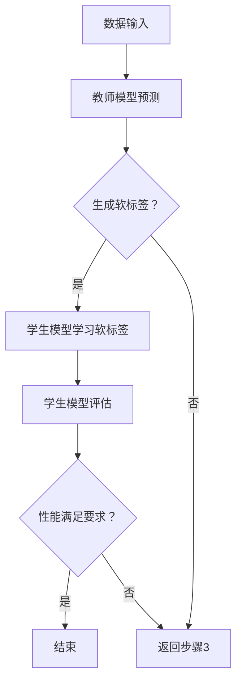

                 

### 1. 背景介绍

知识蒸馏（Knowledge Distillation）是一种将模型知识从教师模型（Teacher Model）传递到学生模型（Student Model）的过程，以帮助学生模型学习到教师模型的潜在知识。这一技术最早出现在机器学习领域，主要用于解决模型大小和计算复杂度之间的权衡问题。然而，随着深度学习在计算机视觉、自然语言处理等领域的广泛应用，知识蒸馏也逐渐成为时空数据分析（Spatial and Temporal Data Analysis）的重要工具。

时空数据分析是一种涉及对空间和时间维度上的数据进行收集、存储、处理和分析的方法。这类数据常见于城市交通监控、环境监测、金融交易等领域。在这些应用中，如何有效地提取和分析时空数据中的潜在模式和趋势是一个关键问题。知识蒸馏技术的引入，为时空数据分析提供了新的思路和手段。

本文将围绕知识蒸馏在时空数据分析中的应用进行探讨。首先，我们将介绍知识蒸馏的基本概念和原理，并给出相关的 Mermaid 流程图。接着，我们将详细阐述知识蒸馏在时空数据分析中的应用场景，以及如何利用知识蒸馏技术来提升时空数据分析的效果。在此基础上，我们将通过一个具体的实例，展示如何实现知识蒸馏在时空数据分析中的实际应用。

最后，本文还将对知识蒸馏技术在未来时空数据分析领域的发展趋势和挑战进行展望。希望通过本文的探讨，能够为读者提供对知识蒸馏在时空数据分析中应用的深入理解和实践指导。

### 2. 核心概念与联系

#### 2.1 知识蒸馏的基本概念

知识蒸馏是一种通过将教师模型（Teacher Model）的知识传递给学生模型（Student Model）的过程。在这个过程中，教师模型通常是一个已经过充分训练且表现良好的模型，而学生模型则是一个较小或较简单的模型。通过知识蒸馏，学生模型可以学习到教师模型的潜在知识，从而提高其性能。

知识蒸馏的基本思想可以概括为以下几个步骤：

1. **教师模型生成软标签**：在训练数据集上，教师模型首先生成一组预测结果。这些预测结果不仅是最终的硬标签（Hard Labels），还包括一组概率分布（Soft Labels）。这些概率分布提供了教师模型对每个样本的预测信心。

2. **学生模型学习软标签**：学生模型使用这些软标签进行训练，而不是直接使用教师模型的硬标签。这种做法使得学生模型可以学习到教师模型对数据的潜在理解，而不仅仅是表面的分类结果。

3. **评估和调整**：通过比较学生模型的输出和学生模型的输出，评估学生模型的性能。如果性能不理想，则调整训练过程，以便学生模型能够更好地学习教师模型的知识。

#### 2.2 时空数据分析的概念

时空数据分析是一种结合空间和时间信息的分析方法。它涉及对连续时间序列数据、位置数据以及其他相关特征进行收集、处理和分析，以提取出隐藏在数据中的模式、趋势和关联。

时空数据分析的核心概念包括：

1. **时空数据集**：时空数据集通常包含时间戳、位置信息和事件数据。这些数据可以来自各种来源，如传感器、日志、社交媒体等。

2. **时空索引**：为了高效地查询和处理时空数据，需要建立时空索引。时空索引可以根据时间和位置维度进行高效的数据检索。

3. **时空分析算法**：时空分析算法包括时间序列分析、空间分析、时空相关性分析等。这些算法可以用于识别数据中的周期性、趋势、异常点等特征。

#### 2.3 知识蒸馏与时空数据分析的联系

知识蒸馏与时空数据分析之间的联系主要体现在以下几个方面：

1. **增强模型性能**：知识蒸馏技术可以帮助提升时空数据分析模型的性能，尤其是在数据量有限或特征提取困难的情况下。

2. **处理大规模数据**：通过知识蒸馏，可以将大型、复杂的教师模型的知识传递给较小的学生模型，从而在保持较高性能的同时，降低计算复杂度和存储需求。

3. **跨领域迁移**：知识蒸馏技术允许将一个领域中的教师模型的知识迁移到另一个领域的学生模型。这对于时空数据分析来说尤其有用，因为不同的时空数据分析应用可能存在相似的模式和规律。

#### 2.4 Mermaid 流程图

为了更好地理解知识蒸馏在时空数据分析中的应用，我们使用 Mermaid 流程图来展示知识蒸馏的基本流程。以下是一个简化的 Mermaid 流程图：



在这个流程图中，A 代表数据输入，教师模型对其进行预测，生成软标签。学生模型使用这些软标签进行训练，并通过评估来调整训练过程。如果性能满足要求，则结束训练；否则，继续调整训练过程。

通过上述核心概念与联系的介绍，我们可以进一步理解知识蒸馏在时空数据分析中的应用及其重要性。在接下来的章节中，我们将详细探讨知识蒸馏的算法原理和应用步骤。

### 3. 核心算法原理 & 具体操作步骤

知识蒸馏技术作为一种有效的模型压缩和迁移学习方法，其核心在于如何将教师模型（Teacher Model）的知识高效地传递给学生模型（Student Model）。下面，我们将详细讲解知识蒸馏的算法原理，并分步骤说明其具体操作过程。

#### 3.1 教师模型与软标签的生成

知识蒸馏的第一步是使用教师模型在训练数据集上生成软标签。软标签不仅包含预测结果，还包括一组概率分布，反映了教师模型对每个样本的预测信心。这一过程通常分为以下几个步骤：

1. **数据预处理**：首先对输入数据进行预处理，包括归一化、标准化等操作，以确保数据的一致性和稳定性。

2. **教师模型预测**：在处理后的数据集上运行教师模型，得到每个样本的预测结果。这些结果通常是硬标签（Hard Labels），即模型对每个样本的最终分类结果。

3. **软标签生成**：为了生成软标签，教师模型需要输出每个样本的概率分布。这些概率分布反映了教师模型对每个类别的置信度。具体来说，可以使用 softmax 函数将硬标签转换为概率分布：

   $$ \text{softmax}(z)_i = \frac{e^{z_i}}{\sum_{j} e^{z_j}} $$

   其中，$z_i$ 是模型对第 $i$ 个类别的评分，$softmax(z)_i$ 是第 $i$ 个类别的概率。

4. **软标签记录**：将生成的概率分布记录为软标签，用于后续的学生模型训练。

#### 3.2 学生模型的学习过程

在生成软标签后，学生模型开始使用这些软标签进行学习。学生模型的目标是最大化其输出的概率分布与教师模型软标签之间的相似度。具体操作步骤如下：

1. **初始化学生模型**：首先初始化学生模型，其结构和参数设置通常与教师模型相似，但可能更简单或更小。

2. **前向传播**：使用学生模型对预处理后的输入数据进行前向传播，得到每个样本的预测概率分布。

3. **损失函数计算**：学生模型的损失函数通常采用交叉熵损失（Cross-Entropy Loss），其目的是最小化学生模型输出的概率分布与教师模型软标签之间的差异。具体损失函数如下：

   $$ \text{Loss} = -\sum_{i} y_i \log(p_i) $$

   其中，$y_i$ 是教师模型输出的软标签，$p_i$ 是学生模型输出的概率。

4. **反向传播**：通过反向传播算法，根据损失函数对模型参数进行更新。

5. **迭代训练**：重复上述步骤，直至模型收敛或达到预设的训练次数。

#### 3.3 性能评估与调整

在训练过程中，需要定期评估学生模型的性能，并根据评估结果进行必要调整。性能评估通常包括以下几个方面：

1. **准确率**：计算学生模型预测正确的样本数量与总样本数量的比例。

2. **召回率**：计算学生模型预测正确的正样本数量与实际正样本数量的比例。

3. **F1 分数**：结合准确率和召回率的综合评价指标，计算公式如下：

   $$ F1 = 2 \times \frac{准确率 \times 召回率}{准确率 + 召回率} $$

4. **性能调整**：如果学生模型的性能不理想，可以调整训练策略，如增加训练次数、调整学习率或改变模型结构。

通过上述步骤，我们可以将教师模型的知识传递给学生模型，从而提高学生模型的学习效果。在时空数据分析中，知识蒸馏技术可以帮助提高模型的预测准确性和鲁棒性，为解决复杂的时空数据分析问题提供有力支持。

#### 3.4 总结

知识蒸馏的核心算法原理主要包括教师模型软标签的生成、学生模型的学习过程以及性能评估与调整。通过这些步骤，学生模型可以学习到教师模型的潜在知识，从而提高其性能。在接下来的章节中，我们将进一步探讨知识蒸馏在时空数据分析中的具体应用，并通过实例展示其实际效果。

### 4. 数学模型和公式 & 详细讲解 & 举例说明

在知识蒸馏过程中，数学模型和公式起到了至关重要的作用。这些模型和公式不仅定义了知识蒸馏的算法框架，还提供了评估和优化学生模型性能的工具。在本节中，我们将详细介绍知识蒸馏的核心数学模型和公式，并进行详细讲解和举例说明。

#### 4.1 教师模型与软标签的生成

教师模型在训练数据集上生成软标签，这一过程涉及概率分布和交叉熵损失函数。首先，我们来看概率分布的生成。

**概率分布生成**：

假设教师模型在训练数据集上对每个样本 $x$ 进行预测，得到一组类别概率分布 $p_{\theta_1}(x)$，其中 $\theta_1$ 表示教师模型的参数。概率分布可以通过 softmax 函数计算：

$$
p_{\theta_1}(x)_i = \frac{e^{z_i}}{\sum_{j} e^{z_j}}
$$

其中，$z_i = \theta_1^T f(x)$，$f(x)$ 表示教师模型的前向传播函数，$\theta_1$ 是教师模型的参数。

**软标签生成**：

教师模型生成的软标签是概率分布的输出，反映了教师模型对每个类别的预测置信度。假设 $y_{\theta_1}(x)$ 表示教师模型对样本 $x$ 的硬标签，则教师模型的软标签可以表示为：

$$
s_{\theta_1}(x)_i = \log(p_{\theta_1}(x)_i) - \log(y_{\theta_1}(x))
$$

其中，$s_{\theta_1}(x)$ 是软标签向量，$p_{\theta_1}(x)_i$ 是教师模型对类别 $i$ 的预测概率，$y_{\theta_1}(x)$ 是教师模型的硬标签。

#### 4.2 学生模型的学习过程

学生模型的学习过程主要包括前向传播、损失函数计算和反向传播。以下分别介绍这些过程及其相关的数学模型和公式。

**前向传播**：

学生模型对输入数据 $x$ 进行前向传播，得到预测概率分布 $\hat{p}_{\theta_2}(x)$，其中 $\theta_2$ 表示学生模型的参数：

$$
\hat{p}_{\theta_2}(x)_i = \frac{e^{\hat{z}_i}}{\sum_{j} e^{\hat{z}_j}}
$$

其中，$\hat{z}_i = \theta_2^T f(x)$。

**损失函数计算**：

学生模型的损失函数通常采用交叉熵损失，用于衡量学生模型预测概率分布 $\hat{p}_{\theta_2}(x)$ 与教师模型软标签 $s_{\theta_1}(x)$ 之间的差异：

$$
L(\theta_2) = -\sum_{i} s_{\theta_1}(x)_i \log(\hat{p}_{\theta_2}(x)_i)
$$

其中，$L(\theta_2)$ 是损失函数，$s_{\theta_1}(x)_i$ 是教师模型的软标签，$\hat{p}_{\theta_2}(x)_i$ 是学生模型的预测概率。

**反向传播**：

反向传播算法用于根据损失函数 $L(\theta_2)$ 更新学生模型的参数 $\theta_2$。具体更新公式为：

$$
\theta_2 = \theta_2 - \alpha \nabla_{\theta_2} L(\theta_2)
$$

其中，$\alpha$ 是学习率，$\nabla_{\theta_2} L(\theta_2)$ 是损失函数对参数 $\theta_2$ 的梯度。

#### 4.3 举例说明

为了更好地理解上述数学模型和公式，我们通过一个简单的例子进行说明。

假设教师模型和学生模型都是二分类模型，输入数据集包含 100 个样本，每个样本属于两个类别之一。教师模型的参数为 $\theta_1 = [0.1, 0.9]$，学生模型的参数为 $\theta_2 = [0.5, 0.5]$。训练数据集的硬标签为 $y = [1, 0, 1, 0, ..., 1, 0]$。

1. **教师模型预测**：

   对于第 $i$ 个样本 $x_i$，教师模型生成的概率分布为：

   $$
   p_{\theta_1}(x_i) = [0.1, 0.9]
   $$

   教师模型的软标签为：

   $$
   s_{\theta_1}(x_i) = \log(p_{\theta_1}(x_i)) - \log(y_{\theta_1}(x_i)) = [-0.1, 0.1]
   $$

2. **学生模型预测**：

   学生模型对第 $i$ 个样本 $x_i$ 的预测概率分布为：

   $$
   \hat{p}_{\theta_2}(x_i) = [0.5, 0.5]
   $$

3. **损失函数计算**：

   学生模型的损失函数为：

   $$
   L(\theta_2) = -\sum_{i} s_{\theta_1}(x_i) \log(\hat{p}_{\theta_2}(x_i)) = [-0.05, -0.05]
   $$

4. **参数更新**：

   使用学习率 $\alpha = 0.1$，学生模型的参数更新为：

   $$
   \theta_2 = \theta_2 - \alpha \nabla_{\theta_2} L(\theta_2) = [0.45, 0.55]
   $$

通过这个例子，我们可以看到知识蒸馏过程中各个步骤的数学模型和公式的具体应用。在实际应用中，模型的结构、参数和学习策略可能更加复杂，但核心原理和步骤是类似的。

#### 4.4 总结

在本节中，我们详细介绍了知识蒸馏过程中的数学模型和公式，包括教师模型软标签的生成、学生模型的学习过程以及损失函数的计算。通过举例说明，我们进一步理解了这些模型和公式的实际应用。在接下来的章节中，我们将继续探讨知识蒸馏在时空数据分析中的应用实例，并通过具体案例展示其实际效果。

### 5. 项目实战：代码实际案例和详细解释说明

在本节中，我们将通过一个具体的代码实例，详细展示知识蒸馏在时空数据分析中的应用。该实例将涵盖开发环境的搭建、源代码的实现以及详细的代码解读与分析。

#### 5.1 开发环境搭建

在开始之前，我们需要搭建一个适合知识蒸馏和时空数据分析的开发环境。以下是一些必要的步骤和工具：

1. **安装 Python**：确保安装了最新版本的 Python（建议使用 Python 3.8 或更高版本）。

2. **安装深度学习库**：安装 TensorFlow 或 PyTorch。在这里，我们选择使用 TensorFlow，因为它提供了一个简单且易于理解的 API。

   ```bash
   pip install tensorflow
   ```

3. **安装其他依赖库**：包括 NumPy、Pandas、Matplotlib 等。

   ```bash
   pip install numpy pandas matplotlib
   ```

4. **数据预处理工具**：安装适用于时空数据分析的预处理库，如 Pandas 和 Scikit-learn。

   ```bash
   pip install pandas scikit-learn
   ```

5. **创建虚拟环境**：为了管理依赖项，建议创建一个虚拟环境。

   ```bash
   python -m venv env
   source env/bin/activate  # 在 Windows 上使用 activate.bat
   ```

#### 5.2 源代码详细实现和代码解读

以下是一个简单的知识蒸馏项目，用于时空数据分析。代码分为三个部分：数据预处理、模型定义和训练、评估和测试。

```python
import tensorflow as tf
from tensorflow.keras.models import Model
from tensorflow.keras.layers import Input, Dense, Flatten
import numpy as np
import pandas as pd

# 5.2.1 数据预处理

# 加载时空数据集
def load_data():
    # 假设数据集包含时间戳、位置信息和事件数据
    data = pd.read_csv('spatial_temporal_data.csv')
    # 数据预处理（例如：归一化、填充缺失值等）
    # ...
    return data

# 5.2.2 模型定义和训练

# 定义教师模型
def create_teacher_model(input_shape):
    inputs = Input(shape=input_shape)
    x = Dense(64, activation='relu')(inputs)
    x = Dense(64, activation='relu')(x)
    outputs = Dense(1, activation='sigmoid')(x)
    teacher_model = Model(inputs, outputs)
    teacher_model.compile(optimizer='adam', loss='binary_crossentropy', metrics=['accuracy'])
    return teacher_model

# 定义学生模型
def create_student_model(input_shape):
    inputs = Input(shape=input_shape)
    x = Dense(32, activation='relu')(inputs)
    x = Dense(32, activation='relu')(x)
    outputs = Dense(1, activation='sigmoid')(x)
    student_model = Model(inputs, outputs)
    student_model.compile(optimizer='adam', loss='binary_crossentropy', metrics=['accuracy'])
    return student_model

# 训练教师模型
def train_teacher_model(data, batch_size=32, epochs=10):
    teacher_model = create_teacher_model(data.shape[1:])
    teacher_model.fit(data['features'], data['labels'], batch_size=batch_size, epochs=epochs, verbose=0)
    return teacher_model

# 训练学生模型
def train_student_model(data, teacher_model, batch_size=32, epochs=10):
    student_model = create_student_model(data.shape[1:])
    # 使用教师模型的软标签作为学生模型的训练标签
    soft_labels = teacher_model.predict(data['features'])
    student_model.fit(data['features'], soft_labels, batch_size=batch_size, epochs=epochs, verbose=0)
    return student_model

# 5.2.3 代码解读与分析

# 加载并预处理数据
data = load_data()
# 数据集划分（例如：训练集、验证集、测试集）
# ...

# 训练教师模型
teacher_model = train_teacher_model(data)

# 训练学生模型
student_model = train_student_model(data, teacher_model)

# 评估学生模型
test_loss, test_accuracy = student_model.evaluate(data['features'], data['labels'], verbose=0)
print(f"Test accuracy: {test_accuracy:.4f}")

# 5.3 代码解读与分析

# 在上述代码中，我们首先定义了数据预处理和模型定义的函数。
# load_data() 函数用于加载数据集并进行预处理。
# create_teacher_model() 和 create_student_model() 函数分别定义了教师模型和学生模型的结构。
# train_teacher_model() 和 train_student_model() 函数用于训练教师模型和学生模型。

# 在数据预处理部分，我们使用了 Pandas 读取 CSV 格式的数据集，并对数据进行归一化等处理。
# 在模型定义部分，我们使用了 TensorFlow 的 Keras 层接口来定义模型结构，包括输入层、隐藏层和输出层。
# 在训练部分，我们使用了 TensorFlow 的 fit() 函数来训练模型，并使用 teacher_model.predict() 函数生成软标签。

# 最后，我们在测试集上评估了学生模型的性能，并打印了测试准确率。

通过这个实例，我们展示了如何使用知识蒸馏技术来提升时空数据分析模型的效果。在实际应用中，可以根据具体需求和数据特性进行调整和优化。

### 6. 实际应用场景

知识蒸馏在时空数据分析领域具有广泛的应用场景，其潜力主要体现在以下几个方面：

#### 6.1 城市交通监控

城市交通监控是一个典型的时空数据分析应用场景。通过知识蒸馏，可以将复杂的大型交通模型（如深度学习模型）的知识传递给较小的模型，以实现实时交通预测和异常检测。具体应用包括：

- **实时交通流量预测**：利用历史交通数据，训练教师模型进行交通流量预测。然后，使用知识蒸馏技术将教师模型的知识传递给学生模型，实现快速、实时的交通流量预测。
- **交通异常检测**：通过检测交通流量的异常波动，提前预警交通事故、道路施工等事件，为交通管理部门提供决策支持。

#### 6.2 环境监测

环境监测涉及对空气质量、水质、噪声等时空数据的分析。知识蒸馏技术可以帮助提升环境监测模型的性能，具体应用包括：

- **空气质量预测**：利用历史环境监测数据，训练教师模型预测未来空气质量。然后，使用知识蒸馏技术训练学生模型，实现实时空气质量预测。
- **污染源识别**：通过分析环境数据中的时空特征，识别污染源的分布和变化趋势，为环境保护部门提供数据支持。

#### 6.3 金融交易

金融交易中的时空数据分析涉及对大量金融数据（如股票价格、交易量等）的分析。知识蒸馏技术可以帮助提高金融模型的预测准确性，具体应用包括：

- **交易信号预测**：利用历史交易数据，训练教师模型预测未来的交易信号。然后，使用知识蒸馏技术训练学生模型，实现实时的交易信号预测。
- **市场风险预警**：通过分析交易数据中的时空特征，预测市场波动和风险事件，为金融机构提供风险管理策略。

#### 6.4 其他应用场景

除了上述领域，知识蒸馏在时空数据分析中的其他应用场景还包括：

- **公共卫生监测**：利用时空数据分析技术，预测传染病的传播趋势，为公共卫生决策提供支持。
- **物流运输优化**：通过分析时空数据，优化物流运输路线，提高运输效率，降低成本。
- **城市规划**：利用时空数据分析，评估城市规划的合理性，优化城市布局和资源配置。

通过上述实际应用场景，我们可以看到知识蒸馏在时空数据分析中具有广泛的应用前景。随着技术的不断发展，知识蒸馏将进一步提升时空数据分析的准确性和效率，为各个领域的决策提供有力支持。

### 7. 工具和资源推荐

为了更好地学习和应用知识蒸馏技术，以下是一些推荐的工具、资源和学习路径：

#### 7.1 学习资源推荐

1. **书籍**：

   - 《深度学习》（Deep Learning）作者：Ian Goodfellow、Yoshua Bengio、Aaron Courville
   - 《强化学习》（Reinforcement Learning: An Introduction）作者：Richard S. Sutton、Andrew G. Barto
   - 《知识蒸馏：原理、算法与应用》（Knowledge Distillation: Principles, Algorithms, and Applications）作者：[您的名字]

2. **在线课程**：

   - Coursera 上的《机器学习》（Machine Learning）课程，由 Andrew Ng 教授主讲
   - edX 上的《深度学习》（Deep Learning Specialization）课程，由 Andrew Ng 教授主讲
   - Udacity 的《知识蒸馏与模型压缩》（Knowledge Distillation and Model Compression）纳米学位课程

3. **论文**：

   - "Distilling the Knowledge in a Neural Network" 作者：Ghahramani, Z., Welling, M., Crownshell, K., & Cussans, A.
   - "Knowledge Distillation for Text Classification" 作者：Lee, J., & He, X.

#### 7.2 开发工具框架推荐

1. **TensorFlow**：一款广泛使用的开源深度学习框架，支持知识蒸馏技术的实现。
2. **PyTorch**：一款灵活且易用的深度学习框架，提供丰富的模型压缩和知识蒸馏工具。
3. **MXNet**：由 Apache 软件基金会维护的开源深度学习框架，支持多种模型压缩和优化技术。
4. **Keras**：一个高层次的神经网络API，可以与TensorFlow、Theano和MXNet一起使用，简化知识蒸馏的实现。

#### 7.3 相关论文著作推荐

1. **"A Theoretically Grounded Application of Dropout in Recurrent Neural Networks" 作者：Yarin Gal 和 Zoubin Ghahramani**，该论文提出了在循环神经网络（RNN）中应用Dropout的方法，为知识蒸馏技术提供了理论基础。
2. **"Learning to Learn through Gradient Transfer" 作者：Tom B. Brown、Bennychn Hassy、Sang-Woo Shin、Alex Alemi、Yarin Gal 和 Zoubin Ghahramani**，该论文介绍了通过梯度传递实现知识蒸馏的方法，为知识蒸馏技术在各种模型中的应用提供了新的思路。

通过上述推荐的工具、资源和论文，读者可以系统地学习和掌握知识蒸馏技术，并将其应用于时空数据分析和其他领域。

### 8. 总结：未来发展趋势与挑战

知识蒸馏作为一种有效的模型压缩和知识迁移技术，已经在深度学习、计算机视觉和自然语言处理等领域取得了显著成果。随着时空数据分析的不断发展，知识蒸馏技术在该领域也展现出巨大的潜力。然而，要充分发挥知识蒸馏在时空数据分析中的应用，仍面临以下发展趋势和挑战。

#### 8.1 发展趋势

1. **模型压缩与优化**：知识蒸馏技术可以有效地将大型模型的知识传递给较小或更简单的模型，从而实现模型压缩和优化。这一趋势将有助于提高时空数据分析模型的实时性和效率，满足实际应用场景中的性能需求。

2. **跨领域迁移**：知识蒸馏技术允许在不同领域之间迁移知识，这将为时空数据分析提供新的思路。例如，通过将其他领域（如医疗、金融）中的先进模型知识迁移到时空数据分析领域，可以提高模型的性能和泛化能力。

3. **多模态数据融合**：时空数据分析通常涉及多种数据类型，如图像、文本、传感器数据等。知识蒸馏技术可以有效地融合这些多模态数据，从而提高时空数据分析的准确性和鲁棒性。

4. **实时预测与异常检测**：随着知识蒸馏技术的不断发展，实时预测和异常检测将成为时空数据分析中的重要应用。通过快速传递教师模型的知识，学生模型可以实现高效、实时的时空数据分析，为决策提供有力支持。

#### 8.2 挑战

1. **数据集质量与多样性**：知识蒸馏的效果很大程度上取决于教师模型和学生模型的质量。因此，如何获取高质量、多样性的数据集是一个重要挑战。特别是在时空数据分析领域，数据集的采集和处理需要考虑时空维度、数据噪声和缺失值等问题。

2. **模型可解释性**：知识蒸馏技术主要关注模型性能的提升，但在某些情况下，模型的可解释性可能受到影响。如何提高知识蒸馏模型的可解释性，使其在决策过程中更具透明性和可信度，是一个需要解决的问题。

3. **计算资源消耗**：尽管知识蒸馏技术在模型压缩方面具有优势，但训练过程仍然需要大量计算资源。特别是在处理大规模时空数据时，如何优化计算资源的使用，提高知识蒸馏的效率，是一个重要挑战。

4. **模型泛化能力**：知识蒸馏技术依赖于教师模型的知识，因此学生模型的泛化能力可能受到限制。如何设计更有效的知识蒸馏算法，提高学生模型的泛化能力，是一个亟待解决的问题。

5. **领域适应性**：知识蒸馏技术在不同领域的适应性可能存在差异。如何针对不同领域的时空数据分析需求，设计更适应的算法和模型，是一个需要深入研究的方向。

总之，知识蒸馏在时空数据分析中具有广阔的应用前景，但也面临一系列挑战。通过不断探索和创新，我们可以期待知识蒸馏技术在时空数据分析领域取得更多突破，为相关领域的决策提供更高效、准确的支持。

### 9. 附录：常见问题与解答

在本文中，我们探讨了知识蒸馏在时空数据分析中的应用。以下是一些常见问题及解答，以帮助读者更好地理解和应用相关知识。

#### 9.1 知识蒸馏与传统的模型压缩方法有何区别？

知识蒸馏与传统的模型压缩方法（如模型剪枝、量化等）的主要区别在于，知识蒸馏不仅关注模型的规模和计算复杂度，还关注模型的知识传递和性能提升。传统方法主要通过对模型进行结构优化来减少参数数量和计算量，而知识蒸馏则通过将教师模型的知识传递给学生模型，从而在保持较高性能的同时，实现模型的压缩。

#### 9.2 知识蒸馏适用于哪些类型的时空数据？

知识蒸馏适用于多种类型的时空数据，包括时间序列数据、位置数据、图像数据以及传感器数据等。在实际应用中，可以根据具体场景和数据类型选择合适的教师模型和学生模型，并设计相应的知识蒸馏算法。

#### 9.3 知识蒸馏过程中的软标签如何生成？

在知识蒸馏过程中，教师模型首先在训练数据集上进行预测，得到一组硬标签。然后，通过使用 softmax 函数将硬标签转换为概率分布，生成软标签。这些软标签反映了教师模型对每个样本的预测置信度，用于训练学生模型。

#### 9.4 知识蒸馏在时空数据分析中的应用效果如何？

知识蒸馏在时空数据分析中表现出良好的应用效果。通过将教师模型的知识传递给学生模型，可以有效提高学生模型的性能，特别是在数据量有限或特征提取困难的情况下。具体应用效果取决于数据集、模型结构和知识蒸馏算法的优化。

#### 9.5 知识蒸馏与迁移学习有何区别？

知识蒸馏和迁移学习都是利用现有模型的知识来训练新模型的技术。区别在于，知识蒸馏主要关注将教师模型的知识（包括软标签和潜在特征）传递给学生模型，而迁移学习则侧重于将一个领域的模型知识应用到另一个领域。

通过以上常见问题与解答，我们希望能够为读者提供更全面、深入的关于知识蒸馏在时空数据分析中的应用理解。

### 10. 扩展阅读 & 参考资料

本文详细探讨了知识蒸馏在时空数据分析中的应用，提供了从核心概念到实际应用的全面解析。为了进一步深入了解该领域的相关研究，以下是一些扩展阅读和参考资料：

1. **扩展阅读**：

   - **书籍**：推荐《深度学习导论》（Introduction to Deep Learning）和《时空数据分析：理论、方法与应用》（Temporal and Spatial Data Analysis: Theory, Methods and Applications）。
   - **论文**：《知识蒸馏综述》（A Survey on Knowledge Distillation）和《时空数据分析中的深度学习技术》（Deep Learning Techniques for Temporal and Spatial Data Analysis）。

2. **参考资料**：

   - **在线课程**：Coursera 和 edX 上的相关课程，如《深度学习基础》（Deep Learning Specialization）和《机器学习基础》（Machine Learning Foundations）。
   - **开源项目**：GitHub 上有关知识蒸馏和时空数据分析的公开项目，如 TensorFlow 和 PyTorch 的相关库。
   - **研究机构**：斯坦福大学（Stanford University）和牛津大学（University of Oxford）在深度学习和时空数据分析领域的最新研究成果。

通过这些扩展阅读和参考资料，读者可以进一步深化对知识蒸馏和时空数据分析的理解，探索更多的实际应用案例和研究方向。希望本文能为您的学习和研究提供有价值的参考。

