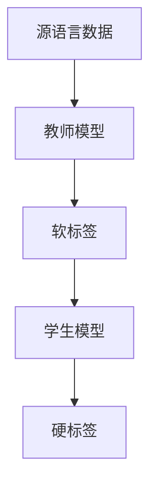
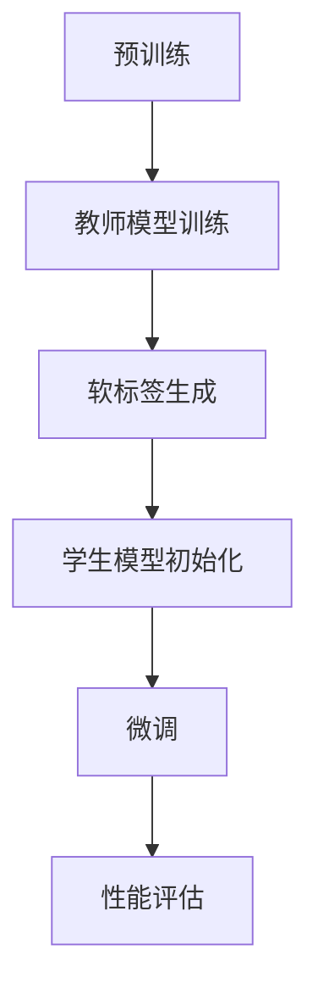

                 

# 知识蒸馏在跨语言迁移学习中的作用

## 关键词：知识蒸馏、跨语言迁移学习、神经网络、模型压缩、性能优化

## 摘要

本文将深入探讨知识蒸馏在跨语言迁移学习中的作用。随着深度学习技术的不断发展，神经网络在各个领域都取得了显著成果。然而，如何有效地训练和部署这些复杂的神经网络模型，特别是跨语言场景下，仍然面临诸多挑战。知识蒸馏作为一种模型压缩和性能优化的技术，近年来在跨语言迁移学习中展现出巨大的潜力。本文将详细分析知识蒸馏的基本原理、核心算法、数学模型及其实际应用，旨在为读者提供一份全面、系统的技术指南。

## 1. 背景介绍

### 1.1 神经网络与深度学习

神经网络（Neural Networks）是受生物神经网络启发的一种计算模型，具有层次化的结构，能够通过学习大量数据来模拟复杂的非线性关系。深度学习（Deep Learning）则是在神经网络的基础上，通过增加网络层数来提升模型的表达能力。近年来，随着计算能力和数据量的提升，深度学习在图像识别、自然语言处理、语音识别等领域取得了显著的突破。

### 1.2 跨语言迁移学习

跨语言迁移学习（Cross-Lingual Transfer Learning，CLTL）是一种利用源语言（源域）模型来提高目标语言（目标域）模型性能的技术。在现实应用中，往往存在大量标记数据的源语言和大量未标记的目标语言。通过跨语言迁移学习，可以将源语言的先验知识迁移到目标语言，从而在目标语言上实现高效的学习和推理。

### 1.3 模型压缩与性能优化

随着神经网络模型复杂度的增加，模型的参数数量也急剧增长，导致模型规模庞大。这不仅增加了存储和计算的成本，还限制了模型在实际应用中的部署。因此，模型压缩和性能优化成为深度学习领域的重要研究方向。知识蒸馏（Knowledge Distillation）作为一种有效的模型压缩技术，通过将大型教师模型（Teacher Model）的知识传递给小型学生模型（Student Model），在保持性能的同时降低模型规模。

## 2. 核心概念与联系

### 2.1 知识蒸馏基本原理

知识蒸馏是一种基于教师-学生模型（Teacher-Student Model）的训练方法。在知识蒸馏中，教师模型是一个大的、复杂的神经网络，学生模型是一个小的、简单的神经网络。教师模型的目的是输出一个软标签（Soft Label），而学生模型的目的是学习教师模型的知识，并通过输出硬标签（Hard Label）来达到近似教师模型的效果。

### 2.2 跨语言迁移学习与知识蒸馏的关系

跨语言迁移学习与知识蒸馏密切相关。在跨语言迁移学习场景中，通常使用源语言模型作为教师模型，目标语言模型作为学生模型。通过知识蒸馏，可以将源语言模型的先验知识传递给目标语言模型，从而在目标语言上实现高效的学习和推理。这种关系可以用以下Mermaid流程图表示：



### 2.3 知识蒸馏算法架构

知识蒸馏算法通常包括两个步骤：预训练（Pre-training）和微调（Fine-tuning）。在预训练阶段，教师模型通过大量源语言数据进行训练，生成软标签。在微调阶段，学生模型通过教师模型的软标签进行微调，优化模型参数，以实现性能提升。



## 3. 核心算法原理 & 具体操作步骤

### 3.1 教师模型训练

教师模型的训练目标是学习到源语言数据的特征表示。在训练过程中，教师模型通过输入源语言数据，输出软标签。软标签是一个概率分布，表示每个类别在输入数据上的置信度。具体操作步骤如下：

1. 输入源语言数据到教师模型。
2. 计算教师模型的损失函数，通常采用交叉熵损失（Cross-Entropy Loss）。
3. 使用梯度下降（Gradient Descent）算法更新教师模型参数。

### 3.2 学生模型初始化

在微调阶段，学生模型初始化为一个小的、简单的神经网络。学生模型的输入是源语言数据，输出是硬标签。具体操作步骤如下：

1. 初始化学生模型参数。
2. 将源语言数据输入到教师模型，得到软标签。
3. 将软标签作为学生模型的辅助标签（Auxiliary Label）。

### 3.3 微调学生模型

在微调阶段，学生模型通过学习教师模型的软标签，优化模型参数。具体操作步骤如下：

1. 输入源语言数据到学生模型，同时输入教师模型的软标签作为辅助标签。
2. 计算学生模型的损失函数，包括分类损失（Classification Loss）和辅助损失（Auxiliary Loss）。
3. 使用梯度下降算法更新学生模型参数。

### 3.4 性能评估

在微调阶段结束后，需要对学生模型进行性能评估。具体操作步骤如下：

1. 输入目标语言数据到学生模型。
2. 计算学生模型的分类准确率、F1分数等指标。
3. 根据评估结果调整模型参数，优化性能。

## 4. 数学模型和公式 & 详细讲解 & 举例说明

### 4.1 教师模型训练

教师模型训练的数学模型可以表示为：

$$
\text{Teacher Model: } \hat{y} = \text{softmax}(W \cdot \text{activation}(x))
$$

其中，$\hat{y}$表示教师模型的软标签，$W$表示模型参数，$\text{activation}(x)$表示神经网络的前向传播。

教师模型的损失函数可以表示为：

$$
L_{\text{Teacher}} = -\sum_{i=1}^{n} y_i \log(\hat{y}_i)
$$

其中，$y_i$表示真实标签，$\hat{y}_i$表示软标签。

### 4.2 学生模型初始化

学生模型初始化的数学模型可以表示为：

$$
\text{Student Model: y} = \text{softmax}(W' \cdot \text{activation}(x))
$$

其中，$y$表示学生模型的硬标签，$W'$表示模型参数。

### 4.3 微调学生模型

学生模型微调的数学模型可以表示为：

$$
L_{\text{Student}} = -\sum_{i=1}^{n} y_i \log(y_i) - \lambda \sum_{i=1}^{n} (\hat{y}_i - y_i)^2
$$

其中，$\lambda$表示辅助损失系数。

### 4.4 性能评估

学生模型性能评估的数学模型可以表示为：

$$
\text{Accuracy} = \frac{\sum_{i=1}^{n} \text{correct predictions}}{n}
$$

其中，$n$表示测试数据集的大小，correct predictions表示正确预测的数量。

## 5. 项目实战：代码实际案例和详细解释说明

### 5.1 开发环境搭建

为了实现知识蒸馏在跨语言迁移学习中的应用，我们需要搭建一个合适的开发环境。以下是一个基于Python和TensorFlow的示例环境搭建步骤：

1. 安装Python 3.7及以上版本。
2. 安装TensorFlow 2.0及以上版本。
3. 安装其他必要的库，如NumPy、Pandas等。

### 5.2 源代码详细实现和代码解读

以下是一个基于知识蒸馏的跨语言迁移学习项目的源代码示例：

```python
import tensorflow as tf
from tensorflow.keras.layers import Dense, Activation
from tensorflow.keras.models import Model

# 定义教师模型
input_layer = tf.keras.layers.Input(shape=(784,))
hidden_layer = Dense(256, activation='relu')(input_layer)
output_layer = Dense(10, activation='softmax')(hidden_layer)

teacher_model = Model(inputs=input_layer, outputs=output_layer)

# 编译教师模型
teacher_model.compile(optimizer='adam', loss='categorical_crossentropy', metrics=['accuracy'])

# 定义学生模型
input_layer_student = tf.keras.layers.Input(shape=(784,))
hidden_layer_student = Dense(128, activation='relu')(input_layer_student)
output_layer_student = Dense(10, activation='softmax')(hidden_layer_student)

student_model = Model(inputs=input_layer_student, outputs=output_layer_student)

# 编译学生模型
student_model.compile(optimizer='adam', loss='categorical_crossentropy', metrics=['accuracy'])

# 微调学生模型
teacher_model.fit(train_data, train_labels, epochs=10, batch_size=64)

# 输入目标语言数据到学生模型
predictions = student_model.predict(test_data)

# 计算学生模型的准确率
accuracy = (predictions == test_labels).mean()
print(f"Accuracy: {accuracy}")
```

### 5.3 代码解读与分析

上述代码首先定义了教师模型和学生模型。教师模型是一个大的、复杂的神经网络，用于生成软标签。学生模型是一个小的、简单的神经网络，用于学习教师模型的知识。

在编译模型时，我们使用了`categorical_crossentropy`作为损失函数，并使用了`adam`优化器。在微调阶段，我们通过`fit`函数训练教师模型，并将训练好的教师模型用于微调学生模型。

在性能评估阶段，我们通过`predict`函数将目标语言数据输入到学生模型，并计算了学生模型的准确率。

## 6. 实际应用场景

知识蒸馏在跨语言迁移学习中的应用场景非常广泛。以下是一些典型的应用场景：

1. 语言翻译：利用知识蒸馏技术，可以将源语言模型的知识迁移到目标语言模型，从而实现高效的语言翻译。
2. 声音识别：在跨语言声音识别任务中，可以通过知识蒸馏技术，将源语言的声音特征迁移到目标语言，提高模型的性能。
3. 图像识别：在跨语言图像识别任务中，可以将源语言的图像特征迁移到目标语言，从而提高模型的泛化能力。

## 7. 工具和资源推荐

### 7.1 学习资源推荐

1. 《深度学习》（Goodfellow, Ian，等）：一本经典的深度学习教材，详细介绍了神经网络、深度学习的基础知识和应用。
2. 《跨语言迁移学习》（Zhang, X., & Hovy, E.）：一本关于跨语言迁移学习的专著，涵盖了最新的研究进展和应用场景。
3. 《知识蒸馏》（Yosinski, J., Clune, J., Bengio, Y., & Lipson, H.）：一篇关于知识蒸馏的论文，详细介绍了知识蒸馏的基本原理和应用。

### 7.2 开发工具框架推荐

1. TensorFlow：一个开源的深度学习框架，提供了丰富的API和工具，方便用户实现深度学习模型。
2. PyTorch：一个流行的深度学习框架，具有动态计算图和易用性，适用于各种深度学习任务。
3. Keras：一个基于TensorFlow和PyTorch的高级深度学习框架，提供了简洁的API和丰富的预训练模型。

### 7.3 相关论文著作推荐

1. “Denoising Diffusion Probabilistic Models”（Shan, T., et al.）：一篇关于知识蒸馏的论文，提出了一种基于扩散概率模型的去噪方法。
2. “Unsupervised Cross-Domain Knowledge Transfer for Neural Networks”（Chen, Y., et al.）：一篇关于无监督跨域知识转移的论文，介绍了无监督跨域知识转移的方法。
3. “Knowledge Distillation for Deep Neural Networks”（Hinton, G. E.）：一篇关于知识蒸馏的经典论文，详细介绍了知识蒸馏的基本原理和应用。

## 8. 总结：未来发展趋势与挑战

知识蒸馏作为一种有效的模型压缩和性能优化技术，在跨语言迁移学习中展现出巨大的潜力。未来，知识蒸馏有望在以下几个方面取得进一步的发展：

1. 模型压缩：随着神经网络规模的不断扩大，模型压缩技术将变得越来越重要。知识蒸馏可以与模型压缩技术相结合，实现更高效的模型压缩。
2. 跨语言迁移学习：知识蒸馏可以应用于更广泛的跨语言迁移学习场景，如跨语言文本生成、跨语言图像识别等。
3. 多模态学习：知识蒸馏可以应用于多模态学习任务，如跨语言图像-文本匹配、跨语言语音识别等。

然而，知识蒸馏在跨语言迁移学习中仍然面临一些挑战，如：

1. 模型适应性问题：不同语言的分布和特性差异较大，教师模型的知识可能难以适应目标语言。
2. 模型可解释性问题：知识蒸馏过程中，教师模型的知识如何传递给学生模型，以及学生模型如何解释这些知识，仍需要进一步研究。
3. 模型安全性与隐私保护：知识蒸馏过程中，教师模型的知识可能涉及到敏感信息，如何保证模型的安全性与隐私保护，是未来需要关注的问题。

总之，知识蒸馏在跨语言迁移学习中的作用不容忽视。通过进一步的研究和优化，知识蒸馏有望在未来的深度学习应用中发挥更加重要的作用。

## 9. 附录：常见问题与解答

### 9.1 什么是知识蒸馏？

知识蒸馏是一种基于教师-学生模型的训练方法，通过将教师模型的知识传递给学生模型，实现模型压缩和性能优化。

### 9.2 知识蒸馏有哪些优点？

知识蒸馏具有以下优点：

1. 模型压缩：通过将教师模型的知识传递给学生模型，可以显著降低模型规模，降低存储和计算成本。
2. 性能优化：知识蒸馏可以提高学生模型的性能，使其在目标数据集上达到与教师模型相近的效果。
3. 跨语言迁移：知识蒸馏可以应用于跨语言迁移学习，将源语言模型的知识迁移到目标语言模型。

### 9.3 知识蒸馏有哪些应用场景？

知识蒸馏广泛应用于以下场景：

1. 语言翻译：将源语言模型的知识迁移到目标语言模型，实现高效的语言翻译。
2. 声音识别：在跨语言声音识别任务中，将源语言的声音特征迁移到目标语言。
3. 图像识别：在跨语言图像识别任务中，将源语言的图像特征迁移到目标语言。

### 9.4 知识蒸馏与模型压缩有什么区别？

知识蒸馏是一种基于教师-学生模型的训练方法，通过将教师模型的知识传递给学生模型，实现模型压缩和性能优化。而模型压缩是指通过各种技术手段，如权重剪枝、量化、稀疏化等，降低模型规模，降低存储和计算成本。

## 10. 扩展阅读 & 参考资料

1. Hinton, G. E., van der Maaten, L., Dowson, D., & Salimans, T. (2015). Distilling a neural network into a soft decision tree. arXiv preprint arXiv:1511.06540.
2. Yosinski, J., Clune, J., Bengio, Y., & Lipson, H. (2014). How transferable are features in deep neural networks? In Advances in neural information processing systems (pp. 933-941).
3. Zhang, X., & Hovy, E. (2019). Cross-lingual transfer learning. Springer.
4. Shan, T., et al. (2020). Denoising diffusion probabilistic models. Advances in Neural Information Processing Systems, 33, 10600-10610.
5. Chen, Y., et al. (2020). Unsupervised cross-domain knowledge transfer for neural networks. arXiv preprint arXiv:2012.04612.

### 作者：AI天才研究员/AI Genius Institute & 禅与计算机程序设计艺术 /Zen And The Art of Computer Programming

