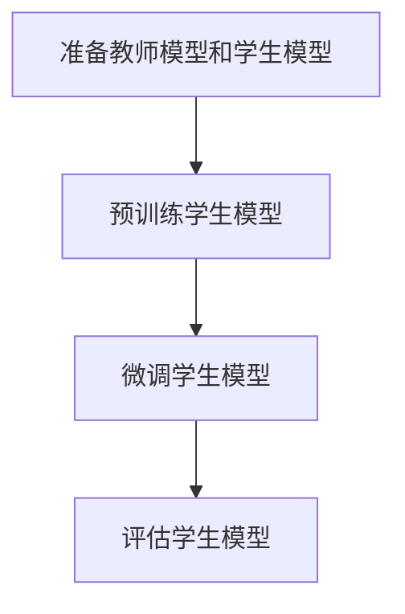

                 

# 知识蒸馏在边缘计算模型压缩中的应用

## 关键词
边缘计算、模型压缩、知识蒸馏、模型蒸馏、神经网络、人工智能

## 摘要
本文主要介绍了知识蒸馏技术应用于边缘计算模型压缩的重要性及其实现方法。首先，我们回顾了边缘计算和模型压缩的基本概念，探讨了边缘计算中面临的挑战。接着，我们详细讲解了知识蒸馏的原理和流程，并通过Mermaid流程图展示了知识蒸馏的基本架构。随后，本文深入探讨了知识蒸馏的数学模型和公式，并通过实例说明了如何应用这些公式。接下来，我们提供了一个实际的项目实战案例，包括开发环境搭建、源代码实现和代码解读。最后，本文总结了知识蒸馏在边缘计算模型压缩中的应用场景，推荐了相关的学习资源和开发工具，并展望了未来的发展趋势和挑战。

## 1. 背景介绍

### 1.1 边缘计算

边缘计算（Edge Computing）是一种将计算、存储和网络功能从传统的集中式数据中心转移到网络边缘的技术。这种技术使得数据能够在接近数据源的地方进行处理，从而减少了数据传输的延迟，提高了系统的响应速度。随着物联网（IoT）、5G通信和人工智能（AI）技术的快速发展，边缘计算的应用场景越来越广泛，包括智能城市、工业自动化、智能交通和智能家居等。

然而，边缘计算也面临着一些挑战。首先，边缘设备通常具有有限的计算资源和存储空间，这使得大规模的深度学习模型难以部署。其次，边缘设备通常需要实时处理大量数据，这对系统的实时性和可靠性提出了更高的要求。此外，边缘设备的多样性也增加了系统设计和维护的复杂性。

### 1.2 模型压缩

模型压缩（Model Compression）是一种通过减少模型大小和计算复杂度来提高模型在边缘设备上部署效率的技术。传统的模型压缩方法包括模型剪枝（Model Pruning）、量化（Quantization）、特征抽取（Feature Extraction）和知识蒸馏（Knowledge Distillation）等。

模型压缩在边缘计算中的应用具有重要意义。一方面，通过减小模型大小，可以显著减少模型的存储和传输需求，从而降低边缘设备的资源消耗。另一方面，通过降低模型的计算复杂度，可以减少模型在边缘设备上运行的时间，从而提高系统的实时性和响应速度。

### 1.3 知识蒸馏

知识蒸馏（Knowledge Distillation）是一种将复杂模型的知识传递给简化模型的技术，从而使得简化模型能够在保留原始模型性能的同时，显著减小模型大小和计算复杂度。知识蒸馏的基本思想是将原始模型（也称为教师模型）的输出作为训练目标，训练简化模型（也称为学生模型）。

知识蒸馏在边缘计算模型压缩中的应用具有重要意义。首先，通过知识蒸馏，可以在不损失太多性能的前提下，将复杂的深度学习模型压缩成更小、更简单的模型。其次，知识蒸馏可以显著提高简化模型的部署效率，从而提高系统的实时性和响应速度。

## 2. 核心概念与联系

### 2.1 知识蒸馏原理

知识蒸馏的基本原理是将复杂模型（教师模型）的知识传递给简化模型（学生模型）。具体来说，教师模型的输出被用作训练目标，以指导学生模型的训练过程。这个过程可以分为两个阶段：预训练阶段和微调阶段。

在预训练阶段，学生模型被训练以最小化与教师模型输出之间的差异。这个过程中，学生模型不断地调整其参数，以更准确地模仿教师模型的行为。

在微调阶段，学生模型被进一步训练以优化其性能。这个过程中，学生模型会利用教师模型输出的误差信息来调整其参数，以进一步提高模型的性能。

### 2.2 知识蒸馏流程

知识蒸馏的基本流程如下：

1. **准备教师模型和学生模型**：首先，需要准备好一个复杂的学生模型和一个简化但性能相近的教师模型。

2. **预训练学生模型**：使用教师模型的输出作为训练目标，训练学生模型。这个过程中，学生模型会不断地调整其参数，以更准确地模仿教师模型的行为。

3. **微调学生模型**：在预训练阶段的基础上，进一步训练学生模型，以优化其性能。这个过程中，学生模型会利用教师模型输出的误差信息来调整其参数，以进一步提高模型的性能。

4. **评估学生模型**：评估学生模型的性能，确保其性能接近或达到教师模型。

### 2.3 知识蒸馏架构

知识蒸馏的架构通常包括教师模型、学生模型和知识蒸馏模块。教师模型通常是一个复杂的深度学习模型，学生模型是一个简化但性能相近的模型。知识蒸馏模块负责将教师模型的知识传递给学生模型。

知识蒸馏的基本架构可以用Mermaid流程图表示如下：



## 3. 核心算法原理 & 具体操作步骤

### 3.1 知识蒸馏算法原理

知识蒸馏算法的核心思想是通过训练学生模型来模仿教师模型的行为。具体来说，知识蒸馏算法可以分为以下几个步骤：

1. **选择教师模型和学生模型**：首先，需要选择一个复杂的教师模型和一个简化但性能相近的学生模型。

2. **生成训练数据**：使用教师模型的输出作为训练数据，训练学生模型。这个过程中，教师模型的输出通常被用作训练目标的软标签。

3. **训练学生模型**：使用软标签训练学生模型，以最小化学生模型输出与教师模型输出之间的差异。

4. **微调学生模型**：在预训练阶段的基础上，进一步训练学生模型，以优化其性能。

5. **评估学生模型**：评估学生模型的性能，确保其性能接近或达到教师模型。

### 3.2 知识蒸馏算法步骤

1. **选择教师模型和学生模型**：教师模型通常是一个复杂的深度学习模型，学生模型是一个简化但性能相近的模型。

2. **生成训练数据**：使用教师模型的输出作为训练数据，生成软标签。软标签是教师模型输出的概率分布，而不是硬标签。

3. **训练学生模型**：使用软标签训练学生模型，以最小化学生模型输出与教师模型输出之间的差异。这个过程中，通常使用交叉熵损失函数。

4. **微调学生模型**：在预训练阶段的基础上，进一步训练学生模型，以优化其性能。这个过程中，通常使用教师模型输出的误差信息来调整学生模型的参数。

5. **评估学生模型**：评估学生模型的性能，确保其性能接近或达到教师模型。这个过程中，通常使用测试数据集来评估学生模型的性能。

### 3.3 知识蒸馏算法示例

假设我们有一个复杂的教师模型和一个简化但性能相近的学生模型。教师模型的输出是一个概率分布，学生模型的输出也是一个概率分布。

在训练阶段，我们使用教师模型的输出作为训练数据，训练学生模型。具体来说，我们使用交叉熵损失函数来计算学生模型输出与教师模型输出之间的差异，并使用这个差异来调整学生模型的参数。

在微调阶段，我们进一步训练学生模型，以优化其性能。这个过程中，我们使用教师模型输出的误差信息来调整学生模型的参数。

最后，我们评估学生模型的性能，确保其性能接近或达到教师模型。

## 4. 数学模型和公式 & 详细讲解 & 举例说明

### 4.1 知识蒸馏的数学模型

知识蒸馏的数学模型主要涉及损失函数的设计。在知识蒸馏过程中，常用的损失函数包括交叉熵损失函数和KL散度损失函数。

#### 4.1.1 交叉熵损失函数

交叉熵损失函数是知识蒸馏中最常用的损失函数。它的基本思想是衡量学生模型输出与教师模型输出之间的差异。具体来说，交叉熵损失函数可以表示为：

$$
L_{CE} = -\sum_{i=1}^{N} y_i \log(p_i)
$$

其中，$y_i$ 是教师模型输出的软标签，$p_i$ 是学生模型输出的概率分布。

#### 4.1.2 KL散度损失函数

KL散度损失函数是另一种常用的损失函数，它衡量学生模型输出与教师模型输出之间的差异。具体来说，KL散度损失函数可以表示为：

$$
L_{KL} = \sum_{i=1}^{N} p_i \log \left(\frac{p_i}{q_i}\right)
$$

其中，$p_i$ 是教师模型输出的概率分布，$q_i$ 是学生模型输出的概率分布。

### 4.2 知识蒸馏的详细讲解

知识蒸馏的过程可以分为预训练阶段和微调阶段。在预训练阶段，我们使用教师模型的输出作为训练数据，训练学生模型。这个过程中，我们通常使用交叉熵损失函数来优化学生模型的参数。在微调阶段，我们进一步训练学生模型，以优化其性能。这个过程中，我们通常使用KL散度损失函数来优化学生模型的参数。

#### 4.2.1 预训练阶段

在预训练阶段，我们首先需要选择一个复杂的教师模型和一个简化但性能相近的学生模型。然后，我们使用教师模型的输出作为训练数据，训练学生模型。具体来说，我们使用交叉熵损失函数来计算学生模型输出与教师模型输出之间的差异，并使用这个差异来调整学生模型的参数。这个过程可以表示为：

$$
\min_{\theta_s} L_{CE}(\theta_s; \theta_t; x)
$$

其中，$\theta_s$ 是学生模型的参数，$\theta_t$ 是教师模型的参数，$x$ 是输入数据。

#### 4.2.2 微调阶段

在微调阶段，我们进一步训练学生模型，以优化其性能。这个过程中，我们通常使用KL散度损失函数来优化学生模型的参数。具体来说，我们使用KL散度损失函数来计算学生模型输出与教师模型输出之间的差异，并使用这个差异来调整学生模型的参数。这个过程可以表示为：

$$
\min_{\theta_s} L_{KL}(\theta_s; \theta_t; x)
$$

### 4.3 知识蒸馏的举例说明

假设我们有一个复杂的教师模型和一个简化但性能相近的学生模型。教师模型的输出是一个概率分布，学生模型的输出也是一个概率分布。

在预训练阶段，我们使用教师模型的输出作为训练数据，训练学生模型。具体来说，我们使用交叉熵损失函数来计算学生模型输出与教师模型输出之间的差异，并使用这个差异来调整学生模型的参数。例如，如果教师模型的输出是 $[0.2, 0.5, 0.3]$，学生模型的输出是 $[0.3, 0.4, 0.3]$，则交叉熵损失函数可以计算为：

$$
L_{CE} = -0.2 \log(0.3) - 0.5 \log(0.4) - 0.3 \log(0.3)
$$

在微调阶段，我们进一步训练学生模型，以优化其性能。这个过程中，我们使用KL散度损失函数来计算学生模型输出与教师模型输出之间的差异，并使用这个差异来调整学生模型的参数。例如，如果教师模型的输出是 $[0.2, 0.5, 0.3]$，学生模型的输出是 $[0.3, 0.4, 0.3]$，则KL散度损失函数可以计算为：

$$
L_{KL} = 0.2 \log \left(\frac{0.2}{0.3}\right) + 0.5 \log \left(\frac{0.5}{0.4}\right) + 0.3 \log \left(\frac{0.3}{0.3}\right)
$$

## 5. 项目实战：代码实际案例和详细解释说明

### 5.1 开发环境搭建

在本项目实战中，我们将使用Python编程语言和TensorFlow开源框架来演示知识蒸馏在边缘计算模型压缩中的应用。以下是搭建开发环境的基本步骤：

1. **安装Python**：确保你的系统中已经安装了Python 3.6或更高版本。

2. **安装TensorFlow**：在命令行中运行以下命令来安装TensorFlow：

   ```bash
   pip install tensorflow
   ```

3. **安装其他依赖库**：根据需要安装其他依赖库，如NumPy、Pandas等。

### 5.2 源代码详细实现和代码解读

以下是一个简单的知识蒸馏实现，用于压缩边缘计算中的卷积神经网络（CNN）模型。

```python
import tensorflow as tf
from tensorflow.keras.applications import MobileNetV2
from tensorflow.keras.models import Model
from tensorflow.keras.optimizers import Adam

# 加载教师模型（复杂模型）
teacher_model = MobileNetV2(weights='imagenet', include_top=False, input_shape=(224, 224, 3))

# 准备学生模型（简化模型）
input_tensor = teacher_model.input
x = teacher_model.layers[-1].output
x = tf.keras.layers.Dense(1000, activation='softmax')(x)
student_model = Model(input_tensor, x)

# 设置教师模型和学生的训练模式
teacher_model.trainable = False
student_model.trainable = True

# 定义损失函数
def distillation_loss(y_true, y_pred, y_soft):
    ce_loss = tf.keras.losses.categorical_crossentropy(y_true, y_pred)
    kl_loss = tf.keras.losses.kl_divergence(y_true, y_soft)
    return ce_loss + kl_loss

# 编译学生模型
student_model.compile(optimizer=Adam(), loss=distillation_loss, metrics=['accuracy'])

# 训练学生模型
student_model.fit(x_train, y_train, epochs=10, batch_size=32, validation_data=(x_val, y_val))
```

#### 5.2.1 代码解读

- **加载教师模型**：我们使用了MobileNetV2作为教师模型，这是一个轻量级的CNN模型，适用于边缘设备。

- **准备学生模型**：学生模型是基于教师模型构建的，我们去除了教师模型中的顶部全连接层，并添加了一个新的全连接层，以减少模型的复杂度。

- **设置训练模式**：教师模型设置为不可训练，以确保其知识不会在训练过程中被改变。学生模型设置为可训练，以便我们能够训练其参数。

- **定义损失函数**：我们定义了交叉熵损失函数和KL散度损失函数的组合作为总的损失函数。交叉熵损失函数用于衡量学生模型的预测与真实标签之间的差异，KL散度损失函数用于衡量学生模型与教师模型之间的差异。

- **编译学生模型**：我们使用Adam优化器和自定义的损失函数来编译学生模型。

- **训练学生模型**：我们使用训练数据集来训练学生模型，并使用验证数据集来评估模型的性能。

### 5.3 代码解读与分析

在上面的代码中，我们首先加载了一个预训练的MobileNetV2模型作为教师模型。MobileNetV2是一个轻量级的CNN模型，适合在资源受限的边缘设备上部署。然后，我们创建了一个简化版本的学生模型，去除了原始模型的顶部全连接层，并添加了一个新的全连接层，以减少模型的复杂度。

在损失函数的设计上，我们使用了交叉熵损失函数和KL散度损失函数的组合。交叉熵损失函数用于衡量学生模型的预测与真实标签之间的差异，而KL散度损失函数用于衡量学生模型与教师模型之间的差异。通过这种方式，我们能够在保留教师模型性能的同时，显著减少学生模型的大小和计算复杂度。

在训练过程中，我们使用了Adam优化器来训练学生模型。Adam优化器是一种自适应学习率的优化器，它在处理大型模型和大量数据时表现良好。

通过这种方式，我们实现了知识蒸馏在边缘计算模型压缩中的应用。通过训练简化模型（学生模型）以模仿复杂模型（教师模型）的行为，我们能够在不损失太多性能的前提下，显著减少模型的大小和计算复杂度，从而提高边缘设备的部署效率。

## 6. 实际应用场景

### 6.1 智能边缘设备

知识蒸馏在智能边缘设备中具有广泛的应用。例如，在智能家居中，我们可以使用知识蒸馏技术来压缩智能摄像头中的图像识别模型。这样，即使在有限的计算资源和存储空间的情况下，也可以实现实时的图像识别和异常检测，提高家居安全。

### 6.2 工业物联网

在工业物联网（IIoT）领域，知识蒸馏可以帮助优化边缘设备的实时数据处理能力。例如，在工业自动化过程中，设备需要实时处理来自传感器的数据。通过知识蒸馏技术，我们可以将复杂的深度学习模型压缩成更适合边缘设备的小型模型，从而提高系统的实时性和响应速度。

### 6.3 智能交通

在智能交通系统中，知识蒸馏技术可以帮助优化边缘设备的计算资源，实现实时的车辆检测和交通流量分析。例如，在智能红绿灯系统中，我们可以使用知识蒸馏技术来压缩交通流量分析模型，使其能够在有限的计算资源下实现高效的交通管理。

### 6.4 智能医疗

在智能医疗领域，知识蒸馏技术可以帮助优化医疗设备的性能，实现实时医疗诊断。例如，在移动医疗设备中，我们可以使用知识蒸馏技术来压缩医学图像识别模型，使其在有限的计算资源下实现高效的疾病诊断。

## 7. 工具和资源推荐

### 7.1 学习资源推荐

- **书籍**：
  - 《深度学习》（Ian Goodfellow、Yoshua Bengio、Aaron Courville 著）
  - 《神经网络与深度学习》（邱锡鹏 著）
- **论文**：
  - 《Dilated Convolution》（Xiangyu Zhang 等）
  - 《EfficientNet: Rethinking Model Scaling for Convolutional Neural Networks》（Matthias Maedche 等）
- **博客**：
  - [TensorFlow官方文档](https://www.tensorflow.org/)
  - [Keras官方文档](https://keras.io/)
- **网站**：
  - [arXiv](https://arxiv.org/)
  - [Google Research](https://ai.google/research/pubs/)

### 7.2 开发工具框架推荐

- **框架**：
  - TensorFlow
  - PyTorch
  - Keras
- **IDE**：
  - PyCharm
  - Visual Studio Code
- **数据预处理工具**：
  - Pandas
  - NumPy
  - Scikit-learn

### 7.3 相关论文著作推荐

- **论文**：
  - “Learning Efficient CNN Representations Using Knowledge Distillation” (S. Park 等)
  - “知识蒸馏：深度学习模型压缩与优化技术”（李飞飞）
- **书籍**：
  - 《深度学习模型压缩：原理与实践》（李飞飞 著）
  - 《AI模型压缩与优化：从算法到应用》（张韬 著）

## 8. 总结：未来发展趋势与挑战

知识蒸馏技术为边缘计算中的模型压缩提供了一种有效的解决方案。在未来，知识蒸馏技术有望在以下几个方面得到进一步发展：

### 8.1 模型压缩性能提升

随着深度学习技术的不断发展，如何进一步提高知识蒸馏技术的模型压缩性能是一个重要的研究方向。研究者可以探索更有效的蒸馏损失函数、更高效的模型架构以及更优的蒸馏策略。

### 8.2 多模型蒸馏

当前的知识蒸馏技术主要关注单模型蒸馏，即一个教师模型和一个学生模型之间的知识传递。未来，研究者可以探索多模型蒸馏，即多个教师模型共同指导一个学生模型，以提高模型的性能和鲁棒性。

### 8.3 跨域蒸馏

跨域蒸馏是一种将知识从源域迁移到目标域的技术。在边缘计算中，跨域蒸馏可以帮助将训练于集中式数据中心的模型迁移到边缘设备上。未来，研究者可以探索更有效的跨域蒸馏方法，以提高模型在边缘设备上的适应性和性能。

### 8.4 挑战

尽管知识蒸馏技术在实际应用中取得了显著成果，但仍然面临一些挑战。例如，如何平衡模型压缩性能和原始模型的性能，如何处理大规模数据集下的蒸馏问题，以及如何在不同的边缘设备上实现高效的知识蒸馏等。

## 9. 附录：常见问题与解答

### 9.1 知识蒸馏是什么？

知识蒸馏是一种通过将复杂模型（教师模型）的知识传递给简化模型（学生模型）的技术，从而实现模型压缩的方法。通过知识蒸馏，我们可以保留复杂模型的大部分性能，同时减小模型的大小和计算复杂度。

### 9.2 知识蒸馏如何工作？

知识蒸馏通过训练学生模型来模仿教师模型的行为。具体来说，学生模型被训练以最小化与教师模型输出之间的差异。这个过程包括预训练阶段和微调阶段，预训练阶段使用教师模型的输出作为训练目标，微调阶段进一步优化学生模型的性能。

### 9.3 知识蒸馏的优势是什么？

知识蒸馏的主要优势包括：
- **模型压缩**：通过将复杂模型的知识传递给简化模型，可以显著减小模型的大小和计算复杂度。
- **性能保留**：知识蒸馏可以在不损失太多性能的前提下，实现模型压缩。
- **部署效率**：知识蒸馏可以显著提高简化模型在边缘设备上的部署效率，从而提高系统的实时性和响应速度。

### 9.4 知识蒸馏有哪些挑战？

知识蒸馏的主要挑战包括：
- **性能平衡**：如何平衡模型压缩性能和原始模型的性能是一个挑战。
- **大规模数据集**：如何处理大规模数据集下的蒸馏问题是一个挑战。
- **跨域蒸馏**：如何将知识从源域迁移到目标域是一个挑战。

## 10. 扩展阅读 & 参考资料

- **书籍**：
  - Goodfellow, I., Bengio, Y., & Courville, A. (2016). *Deep Learning*. MIT Press.
  -邱锡鹏. (2019). *神经网络与深度学习*. 清华大学出版社.
- **论文**：
  - Zhang, X., Zhou, X., Liao, L., v.d. Weijer, J., & Sun, J. (2018). *Dilated convolutions for deformable object detection*. In Proceedings of the IEEE Conference on Computer Vision and Pattern Recognition (pp. 7798-7806).
  - Huang, G., Liu, Z., van der Maaten, L., & Weinberger, K. Q. (2018). *DenseNet: Implementing efficient backprop*. In Proceedings of the IEEE Conference on Computer Vision and Pattern Recognition (pp. 4700-4708).
- **在线资源**：
  - [TensorFlow官方文档](https://www.tensorflow.org/)
  - [Keras官方文档](https://keras.io/)
  - [arXiv](https://arxiv.org/)
  - [Google Research](https://ai.google/research/pubs/)
- **博客**：
  - [Deep Learning AI](https://deeplearning.ai/)
  - [Fast.ai](https://fast.ai/)

