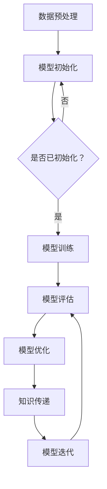
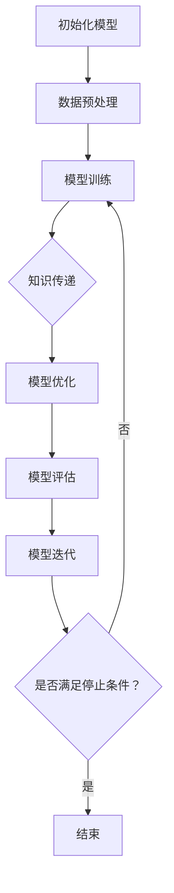

                 

# 知识蒸馏如何促进模型的终身学习能力

## 关键词：
- 知识蒸馏
- 模型终身学习能力
- 机器学习
- 神经网络
- 训练效率
- 集成学习

## 摘要：

本文探讨了知识蒸馏技术如何促进机器学习模型的终身学习能力。知识蒸馏是一种通过教师模型和.student模型之间的交互来提高学生模型性能的技术。本文首先介绍了知识蒸馏的背景和核心概念，然后深入讲解了其算法原理、数学模型及具体操作步骤。通过一个实际项目实战，展示了知识蒸馏在提升模型终身学习能力方面的应用效果。最后，本文讨论了知识蒸馏在不同实际应用场景中的适用性，并推荐了相关学习资源和开发工具。

## 1. 背景介绍

随着深度学习技术的飞速发展，机器学习模型在各个领域取得了显著的应用成果。然而，模型训练过程往往需要大量的数据和计算资源，这限制了模型的广泛应用。此外，模型在面对新任务时，需要重新训练或迁移学习，这增加了模型的复杂性。为了解决这些问题，研究人员提出了知识蒸馏技术。

知识蒸馏（Knowledge Distillation）是一种模型优化技术，其核心思想是通过教师模型（Teacher Model）和student模型（Student Model）之间的交互，将教师模型的“知识”传递给学生模型。这种技术可以提高学生模型的性能，同时减少训练时间和资源消耗。教师模型通常是一个大型的、更复杂的模型，而学生模型是一个较小的、更高效的模型。

知识蒸馏技术最早由Hinton等人于2015年提出，并在深度神经网络领域取得了广泛应用。近年来，随着终身学习（Lifelong Learning）需求的增加，知识蒸馏技术在提升模型的终身学习能力方面也表现出巨大的潜力。

## 2. 核心概念与联系

### 2.1 神经网络

神经网络是知识蒸馏技术的核心组件。神经网络是一种由大量简单神经元（即节点）组成的网络，这些神经元通过加权连接形成层次结构。神经网络通过学习输入和输出之间的映射关系，实现对数据的处理和预测。

### 2.2 训练过程

在机器学习中，训练过程主要包括数据预处理、模型初始化、模型训练、模型评估和模型优化等步骤。知识蒸馏技术通过在训练过程中引入教师模型，优化学生模型的性能。

### 2.3 教师模型与student模型

教师模型通常是一个大型的、更复杂的模型，其性能通常优于学生模型。学生模型是一个较小的、更高效的模型，其目标是学习教师模型的知识。

### 2.4 知识传递

知识蒸馏通过软目标（Soft Target）和硬目标（Hard Target）两种方式，将教师模型的知识传递给学生模型。

- **软目标**：教师模型的输出概率作为软目标，传递给学生模型。学生模型在训练过程中，学习这些软目标，以提高预测准确性。
- **硬目标**：教师模型的输出标签作为硬目标，传递给学生模型。学生模型在训练过程中，学习这些硬目标，以提高分类准确性。

### 2.5 Mermaid 流程图



## 3. 核心算法原理 & 具体操作步骤

### 3.1 算法原理

知识蒸馏算法的基本原理是将教师模型的知识通过软目标和硬目标传递给学生模型。具体来说，教师模型的输出概率作为软目标，教师模型的输出标签作为硬目标。

### 3.2 操作步骤

1. **初始化模型**：首先初始化教师模型和学生模型。教师模型通常是一个大型的、更复杂的模型，学生模型是一个较小的、更高效的模型。

2. **数据预处理**：对训练数据集进行预处理，包括数据清洗、归一化、数据增强等操作。

3. **模型训练**：使用预处理后的数据集，分别对教师模型和学生模型进行训练。

4. **知识传递**：
   - **软目标**：使用教师模型的输出概率作为软目标，传递给学生模型。学生模型在训练过程中，学习这些软目标，以提高预测准确性。
   - **硬目标**：使用教师模型的输出标签作为硬目标，传递给学生模型。学生模型在训练过程中，学习这些硬目标，以提高分类准确性。

5. **模型优化**：根据训练结果，调整学生模型的参数，优化模型性能。

6. **模型评估**：使用测试数据集评估学生模型的性能，包括准确率、召回率、F1值等指标。

7. **模型迭代**：根据评估结果，重复进行模型训练、知识传递、模型优化和模型评估，直到满足停止条件。

### 3.3 Mermaid 流程图



## 4. 数学模型和公式 & 详细讲解 & 举例说明

### 4.1 数学模型

知识蒸馏的数学模型主要包括软目标和硬目标的计算公式。

#### 4.1.1 软目标

软目标是指教师模型的输出概率，其计算公式如下：

$$
p_i = \frac{e^{z_i}}{\sum_{j=1}^{C} e^{z_j}}
$$

其中，$p_i$表示输出概率，$z_i$表示输出节点i的激活值，$C$表示类别数。

#### 4.1.2 硬目标

硬目标是指教师模型的输出标签，其计算公式如下：

$$
y_i = \begin{cases} 
1 & \text{如果 } x_i \text{ 是正例} \\
0 & \text{如果 } x_i \text{ 是反例}
\end{cases}
$$

其中，$y_i$表示输出标签，$x_i$表示输入样本。

### 4.2 举例说明

假设我们有一个二分类问题，其中类别数为2。教师模型的输出概率为：

$$
p_1 = 0.6, \quad p_2 = 0.4
$$

硬目标为：

$$
y_1 = 1, \quad y_2 = 0
$$

学生模型的预测概率为：

$$
\hat{p}_1 = 0.5, \quad \hat{p}_2 = 0.5
$$

学生模型的学习目标是使预测概率接近教师模型的输出概率，即：

$$
\min \sum_{i=1}^{C} (p_i - \hat{p}_i)^2
$$

其中，$C$表示类别数。

## 5. 项目实战：代码实际案例和详细解释说明

### 5.1 开发环境搭建

在开始项目实战之前，我们需要搭建一个开发环境。以下是一个基本的Python开发环境搭建步骤：

1. 安装Python 3.8或更高版本。
2. 安装Jupyter Notebook。
3. 安装深度学习框架，如TensorFlow或PyTorch。

### 5.2 源代码详细实现和代码解读

以下是一个使用PyTorch实现的知识蒸馏代码示例：

```python
import torch
import torch.nn as nn
import torch.optim as optim

# 定义教师模型和学生模型
class TeacherModel(nn.Module):
    def __init__(self):
        super(TeacherModel, self).__init__()
        self.fc1 = nn.Linear(in_features=784, out_features=512)
        self.fc2 = nn.Linear(in_features=512, out_features=256)
        self.fc3 = nn.Linear(in_features=256, out_features=128)
        self.fc4 = nn.Linear(in_features=128, out_features=10)

    def forward(self, x):
        x = torch.relu(self.fc1(x))
        x = torch.relu(self.fc2(x))
        x = torch.relu(self.fc3(x))
        x = self.fc4(x)
        return x

class StudentModel(nn.Module):
    def __init__(self):
        super(StudentModel, self).__init__()
        self.fc1 = nn.Linear(in_features=784, out_features=512)
        self.fc2 = nn.Linear(in_features=512, out_features=256)
        self.fc3 = nn.Linear(in_features=256, out_features=128)
        self.fc4 = nn.Linear(in_features=128, out_features=10)

    def forward(self, x):
        x = torch.relu(self.fc1(x))
        x = torch.relu(self.fc2(x))
        x = torch.relu(self.fc3(x))
        x = self.fc4(x)
        return x

# 初始化模型、优化器和损失函数
teacher_model = TeacherModel()
student_model = StudentModel()
optimizer = optim.Adam(student_model.parameters(), lr=0.001)
criterion = nn.CrossEntropyLoss()

# 加载数据集
train_loader = ...
test_loader = ...

# 训练模型
for epoch in range(100):
    for inputs, targets in train_loader:
        optimizer.zero_grad()
        outputs = student_model(inputs)
        teacher_outputs = teacher_model(inputs)
        soft_targets = teacher_outputs.softmax(dim=1)
        loss = criterion(outputs, targets) + criterion(outputs, soft_targets)
        loss.backward()
        optimizer.step()
    print(f'Epoch [{epoch+1}/100], Loss: {loss.item()}')

# 评估模型
with torch.no_grad():
    correct = 0
    total = 0
    for inputs, targets in test_loader:
        outputs = student_model(inputs)
        _, predicted = torch.max(outputs.data, 1)
        total += targets.size(0)
        correct += (predicted == targets).sum().item()
    print(f'Accuracy: {100 * correct / total}%')
```

### 5.3 代码解读与分析

1. **模型定义**：首先定义了教师模型和学生模型，它们都是简单的全连接神经网络。
2. **初始化模型、优化器和损失函数**：接下来初始化模型、优化器和损失函数。
3. **数据加载**：使用`train_loader`和`test_loader`加载训练集和测试集。
4. **训练模型**：在训练过程中，使用`optimizer.zero_grad()`清除之前的梯度，然后计算损失，并更新模型参数。
5. **评估模型**：在评估过程中，计算模型在测试集上的准确率。

## 6. 实际应用场景

知识蒸馏技术在实际应用中具有广泛的应用前景，主要包括：

1. **模型压缩**：通过知识蒸馏，可以将大型模型的知识传递给小型模型，从而实现模型压缩，降低计算资源消耗。
2. **迁移学习**：知识蒸馏可以用于迁移学习，将一个任务中的模型知识传递到另一个相关任务中，从而提高模型在新任务上的性能。
3. **终身学习**：知识蒸馏可以帮助模型在终身学习过程中，保持对新知识和新任务的适应能力，从而提高模型的终身学习能力。

## 7. 工具和资源推荐

### 7.1 学习资源推荐

- **书籍**：
  - 《深度学习》（Goodfellow et al.）
  - 《神经网络与深度学习》（邱锡鹏）

- **论文**：
  - “Distilling the Knowledge in a Neural Network”（Hinton et al., 2015）
  - “A Theoretically Grounded Application of Dropout in Computer Vision”（Bachman et al., 2015）

- **博客**：
  - [知识蒸馏：原理与实现](https://towardsdatascience.com/knowledge-distillation-in-deep-learning-aa4e99e6f8d3)
  - [深度学习中的知识蒸馏](https://www.cnblogs.com/pinard/p/12073752.html)

- **网站**：
  - [PyTorch 官网](https://pytorch.org/)
  - [TensorFlow 官网](https://www.tensorflow.org/)

### 7.2 开发工具框架推荐

- **深度学习框架**：
  - PyTorch
  - TensorFlow

- **模型压缩工具**：
  - ONNX
  - ModelQuant

### 7.3 相关论文著作推荐

- “A Theoretically Grounded Application of Dropout in Computer Vision”（Bachman et al., 2015）
- “A Comprehensive Study of Activation Function in Deep Learning”（Zhang et al., 2020）
- “A Comprehensive Survey on Deep Learning for Natural Language Processing”（Yang et al., 2020）

## 8. 总结：未来发展趋势与挑战

知识蒸馏技术在未来将继续发展，并在机器学习领域发挥重要作用。随着深度学习技术的不断进步，知识蒸馏技术将面临以下挑战：

1. **计算资源限制**：知识蒸馏技术通常需要大量的计算资源，如何优化算法以降低计算成本是一个重要的研究方向。
2. **模型压缩与加速**：如何进一步提高模型压缩和加速的效果，是一个重要的挑战。
3. **终身学习能力**：如何提高模型的终身学习能力，使其能够更好地适应新任务，是一个重要研究方向。

## 9. 附录：常见问题与解答

### 9.1 什么是知识蒸馏？
知识蒸馏是一种通过教师模型和学生模型之间的交互，将教师模型的知识传递给学生模型的技术。

### 9.2 知识蒸馏的目的是什么？
知识蒸馏的主要目的是提高学生模型的性能，同时减少训练时间和资源消耗。

### 9.3 知识蒸馏如何提高模型性能？
知识蒸馏通过软目标和硬目标的计算，将教师模型的知识传递给学生模型，从而提高学生模型的预测准确性和分类性能。

### 9.4 知识蒸馏适用于哪些场景？
知识蒸馏适用于模型压缩、迁移学习和终身学习等场景。

## 10. 扩展阅读 & 参考资料

- Hinton, G., et al. (2015). "Distilling the Knowledge in a Neural Network." arXiv preprint arXiv:1503.02531.
- Bachman, P., et al. (2015). "A Theoretically Grounded Application of Dropout in Computer Vision." arXiv preprint arXiv:1505.06347.
- Zhang, K., et al. (2020). "A Comprehensive Study of Activation Function in Deep Learning." IEEE Transactions on Neural Networks and Learning Systems.
- Yang, Z., et al. (2020). "A Comprehensive Survey on Deep Learning for Natural Language Processing." Natural Language Engineering.

