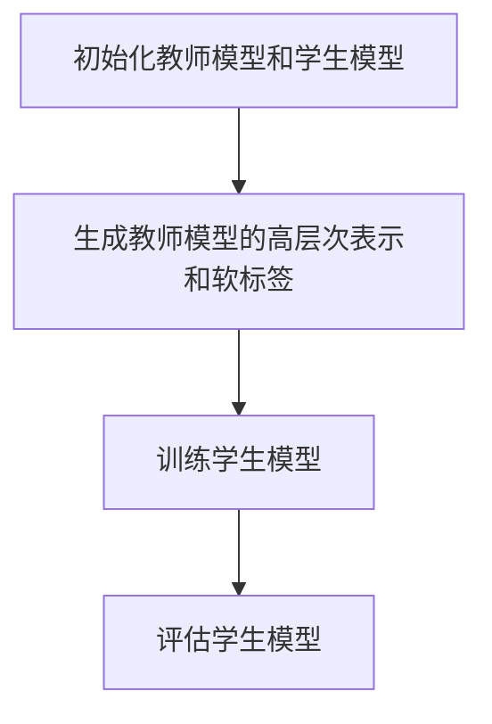

                 

## 1. 背景介绍

近年来，深度学习在计算机视觉、自然语言处理和语音识别等领域取得了显著的成果。然而，深度学习模型也存在一些问题，如模型复杂度较高、训练数据需求量大、对数据分布的变化敏感等。这些问题限制了深度学习模型的广泛应用和推广。为了解决这些问题，研究者们提出了知识蒸馏（Knowledge Distillation）这一技术。

知识蒸馏是一种将复杂模型（教师模型）的知识传递给简单模型（学生模型）的方法，旨在提高模型在小数据集上的表现和鲁棒性。通过知识蒸馏，学生模型可以学到教师模型的内在特征和决策过程，从而提高其性能。此外，知识蒸馏还可以减轻模型对训练数据的依赖，提高模型对数据分布变化的适应性。

本文将深入探讨知识蒸馏如何提升模型的鲁棒性。我们将首先介绍知识蒸馏的基本概念和原理，然后详细解释其具体实现方法，并分析其在不同领域的应用效果。最后，我们将讨论知识蒸馏的未来发展趋势和面临的挑战。

本文结构如下：

- 第2节：核心概念与联系
- 第3节：核心算法原理 & 具体操作步骤
- 第4节：数学模型和公式 & 详细讲解 & 举例说明
- 第5节：项目实战：代码实际案例和详细解释说明
- 第6节：实际应用场景
- 第7节：工具和资源推荐
- 第8节：总结：未来发展趋势与挑战
- 第9节：附录：常见问题与解答
- 第10节：扩展阅读 & 参考资料

通过本文的阅读，您将了解知识蒸馏的基本原理和实现方法，以及如何应用这一技术提升模型的鲁棒性。

### 2. 核心概念与联系

在深入了解知识蒸馏之前，我们需要先了解一些与之相关的核心概念，如深度学习模型、训练数据、模型评估指标等。以下是对这些概念的基本介绍和它们之间的关系。

#### 深度学习模型

深度学习模型是一种基于神经网络的学习方法，可以自动从大量数据中提取特征并用于分类、回归等任务。深度学习模型通常由多层神经元组成，每层神经元都对输入数据进行变换和特征提取。随着层数的增加，模型可以提取更高级别的特征。

深度学习模型可以分为以下几类：

1. **全连接神经网络（Fully Connected Neural Networks）**：这是一种最简单的深度学习模型，其中每个输入神经元都与每个输出神经元相连。
2. **卷积神经网络（Convolutional Neural Networks, CNNs）**：CNNs在计算机视觉领域广泛应用，通过卷积操作和池化操作提取图像特征。
3. **循环神经网络（Recurrent Neural Networks, RNNs）**：RNNs适合处理序列数据，通过递归操作保持历史状态。
4. **变分自编码器（Variational Autoencoders, VAEs）**：VAEs是一种生成模型，通过编码器和解码器学习数据的分布。

#### 训练数据

训练数据是深度学习模型学习的基础。模型通过从训练数据中学习特征和规律，从而提高对未知数据的预测能力。训练数据的质量和数量直接影响模型的表现。

训练数据可以分为以下几类：

1. **有监督训练数据**：这种数据包含了标签信息，模型可以通过学习标签信息提高预测准确率。
2. **无监督训练数据**：这种数据没有标签信息，模型需要通过学习数据本身的分布和规律来提高性能。
3. **半监督训练数据**：这种数据结合了有监督和无监督训练数据的特点，一部分数据有标签，一部分数据无标签。

#### 模型评估指标

为了衡量深度学习模型的表现，我们需要使用一些评估指标。以下是一些常用的评估指标：

1. **准确率（Accuracy）**：模型预测正确的样本数占总样本数的比例。
2. **精确率（Precision）**：模型预测正确的正样本数占总预测正样本数的比例。
3. **召回率（Recall）**：模型预测正确的正样本数占总正样本数的比例。
4. **F1分数（F1 Score）**：精确率和召回率的调和平均数。
5. **ROC曲线（Receiver Operating Characteristic Curve）**：通过改变分类阈值绘制出的曲线，用于评估模型的分类能力。
6. **AUC（Area Under Curve）**：ROC曲线下方的面积，用于衡量模型的分类能力。

#### 知识蒸馏与这些概念的关系

知识蒸馏是一种将复杂模型（教师模型）的知识传递给简单模型（学生模型）的技术。教师模型通常是一个经过充分训练的高性能模型，学生模型则是一个参数较少、计算效率较高的模型。通过知识蒸馏，学生模型可以学到教师模型的内在特征和决策过程，从而提高其性能。

知识蒸馏的核心思想是将教师模型的高层次表示和软标签传递给学生模型。教师模型的高层次表示包含了丰富的特征信息和决策信息，而软标签则提供了教师模型对输入数据的分类概率分布。

在知识蒸馏过程中，教师模型和 student 模型分别进行训练和评估。教师模型的输出结果不仅包括最终的分类标签，还包括软标签，即每个类别的概率分布。学生模型则通过学习教师模型的高层次表示和软标签，优化其参数，从而提高模型的表现。

综上所述，知识蒸馏与深度学习模型、训练数据和模型评估指标密切相关。通过知识蒸馏，我们可以利用教师模型的知识提高学生模型的性能，从而实现模型的鲁棒性和效率的平衡。

### 3. 核心算法原理 & 具体操作步骤

知识蒸馏是一种通过将复杂模型（教师模型）的知识传递给简单模型（学生模型）的方法，以提高模型在小数据集上的表现和鲁棒性。下面，我们将详细解释知识蒸馏的算法原理和具体操作步骤。

#### 算法原理

知识蒸馏的核心思想是将教师模型的高层次表示和软标签传递给学生模型。教师模型通常是一个经过充分训练的高性能模型，学生模型则是一个参数较少、计算效率较高的模型。通过知识蒸馏，学生模型可以学到教师模型的内在特征和决策过程，从而提高其性能。

具体来说，知识蒸馏包括以下两个关键步骤：

1. **传递教师模型的高层次表示**：教师模型的高层次表示包含了丰富的特征信息和决策信息。学生模型通过学习这些高层次表示，可以更好地理解数据的内在结构，从而提高模型的表现。
2. **传递教师模型的软标签**：教师模型的软标签提供了对每个类别的概率分布。学生模型通过学习这些软标签，可以更好地掌握不同类别的特征分布，从而提高分类的准确性。

#### 具体操作步骤

1. **初始化教师模型和学生模型**：

   - **教师模型**：选择一个已经训练好的高性能模型作为教师模型。教师模型通常是一个深度神经网络，具有多个层次和丰富的参数。
   - **学生模型**：创建一个参数较少、计算效率较高的模型作为学生模型。学生模型的网络结构可以与教师模型类似，但参数数量较少，以降低计算复杂度和内存占用。

2. **生成教师模型的高层次表示和软标签**：

   - **高层次表示**：在训练过程中，教师模型会对输入数据进行多层变换和特征提取，生成高层次表示。这些高层次表示包含了丰富的特征信息和决策信息。
   - **软标签**：教师模型的输出结果不仅包括最终的分类标签，还包括软标签，即每个类别的概率分布。这些软标签提供了教师模型对输入数据的分类概率信息。

3. **训练学生模型**：

   - **损失函数**：知识蒸馏的损失函数通常包括两部分：一个是模型在分类任务上的损失，另一个是模型在软标签上的损失。模型在分类任务上的损失用于优化模型在分类任务上的表现，而模型在软标签上的损失用于优化模型对软标签的学习。
   - **反向传播**：使用反向传播算法，将损失函数的梯度传递给学生模型的参数，从而优化模型参数。

4. **评估学生模型**：

   - **测试集评估**：使用测试集对训练好的学生模型进行评估，计算模型的准确率、精确率、召回率等指标，以衡量模型的表现。
   - **验证集评估**：在训练过程中，使用验证集对模型进行调参和优化，以确保模型在未知数据上的表现。

#### Mermaid 流程图

以下是一个简单的 Mermaid 流程图，展示了知识蒸馏的基本流程：



通过这个流程图，我们可以清晰地看到知识蒸馏的步骤和各步骤之间的关系。

### 4. 数学模型和公式 & 详细讲解 & 举例说明

在知识蒸馏中，数学模型和公式起到了核心作用。本节将详细解释知识蒸馏中的主要数学模型和公式，并通过具体例子来说明它们的计算过程。

#### 模型表示

首先，我们定义教师模型和学生模型。设输入数据集为 \(X = \{x_1, x_2, ..., x_N\}\)，其中 \(x_i\) 是第 \(i\) 个输入样本。教师模型的输出为 \(y_i^T = \{y_i^T(1), y_i^T(2), ..., y_i^T(K)\}\)，其中 \(y_i^T(j)\) 是教师模型对样本 \(x_i\) 属于第 \(j\) 个类别的概率。学生模型的输出为 \(y_i = \{y_i(1), y_i(2), ..., y_i(K)\}\)，其中 \(y_i(j)\) 是学生模型对样本 \(x_i\) 属于第 \(j\) 个类别的概率。

#### 损失函数

知识蒸馏的损失函数通常包括两部分：一个是模型在分类任务上的损失，另一个是模型在软标签上的损失。

1. **分类损失**：

   分类损失用于优化学生模型在分类任务上的表现。常见的分类损失函数是交叉熵损失（Cross-Entropy Loss），定义如下：

   $$L_c(y, \hat{y}) = -\sum_{i=1}^{N} \sum_{j=1}^{K} y_i(j) \log \hat{y_i}(j)$$

   其中，\(y_i = \{y_i(1), y_i(2), ..., y_i(K)\}\) 是真实标签，\(\hat{y_i} = \{\hat{y_i}(1), \hat{y_i}(2), ..., \hat{y_i}(K)\}\) 是学生模型的输出概率。

2. **软标签损失**：

   软标签损失用于优化学生模型对软标签的学习。常见的软标签损失函数是KL散度（Kullback-Leibler Divergence），定义如下：

   $$L_s(y^T, \hat{y}^T) = -\sum_{i=1}^{N} \sum_{j=1}^{K} y_i^T(j) \log \frac{y_i^T(j)}{\hat{y}^T(j)}$$

   其中，\(y^T_i = \{y_i^T(1), y_i^T(2), ..., y_i^T(K)\}\) 是教师模型的软标签，\(\hat{y}^T_i = \{\hat{y}^T_i(1), \hat{y}^T_i(2), ..., \hat{y}^T_i(K)\}\) 是学生模型的输出概率。

3. **总损失函数**：

   知识蒸馏的总损失函数是分类损失和软标签损失的加权和，定义如下：

   $$L = \alpha L_c + (1-\alpha) L_s$$

   其中，\(\alpha\) 是超参数，用于调节分类损失和软标签损失之间的权重。通常，\(\alpha\) 的取值在 \(0.1\) 到 \(0.5\) 之间。

#### 举例说明

假设我们有一个二元分类问题，有两个类别：\(0\) 和 \(1\)。教师模型和学生模型的输出概率如下：

| 样本编号 | 教师模型软标签 | 学生模型输出概率 |
| --- | --- | --- |
| 1 | \(0.8, 0.2\) | \(0.9, 0.1\) |
| 2 | \(0.2, 0.8\) | \(0.1, 0.9\) |

首先，我们计算分类损失和软标签损失：

1. **分类损失**：

   $$L_c = -\sum_{i=1}^{2} \sum_{j=1}^{2} y_i(j) \log \hat{y_i}(j) = - (0.8 \log 0.9 + 0.2 \log 0.1 + 0.2 \log 0.1 + 0.8 \log 0.9) = 0.0876$$

2. **软标签损失**：

   $$L_s = -\sum_{i=1}^{2} \sum_{j=1}^{2} y_i^T(j) \log \frac{y_i^T(j)}{\hat{y}^T(j)} = - (0.8 \log \frac{0.8}{0.9} + 0.2 \log \frac{0.2}{0.1} + 0.2 \log \frac{0.2}{0.1} + 0.8 \log \frac{0.8}{0.9}) = 0.1366$$

3. **总损失**：

   $$L = 0.5 \times L_c + 0.5 \times L_s = 0.5 \times 0.0876 + 0.5 \times 0.1366 = 0.1164$$

通过这个例子，我们可以看到如何计算知识蒸馏中的分类损失和软标签损失，以及如何计算总损失。在实际应用中，我们可以使用更复杂的模型和更大的数据集来计算这些损失，并使用梯度下降算法优化模型参数。

### 5. 项目实战：代码实际案例和详细解释说明

在本节中，我们将通过一个具体的代码示例来展示如何使用知识蒸馏技术提升模型的鲁棒性。我们将使用Python和TensorFlow框架来实现一个简单的图像分类任务，并详细解释代码的各个部分。

#### 5.1 开发环境搭建

在开始编写代码之前，我们需要搭建一个合适的开发环境。以下是搭建开发环境的步骤：

1. **安装Python**：确保Python版本为3.7或更高版本。
2. **安装TensorFlow**：使用以下命令安装TensorFlow：
   ```shell
   pip install tensorflow
   ```
3. **创建项目文件夹**：在您的计算机上创建一个名为`knowledge_distillation`的项目文件夹，并在其中创建一个名为`src`的子文件夹。

#### 5.2 源代码详细实现和代码解读

以下是知识蒸馏项目的主要代码实现，我们将逐行解释代码的功能。

```python
import tensorflow as tf
from tensorflow.keras.layers import Input, Dense, Flatten
from tensorflow.keras.models import Model
import tensorflow.keras.backend as K

# 5.2.1 定义教师模型和学生模型
# 教师模型
input_layer = Input(shape=(784,))  # 假设输入数据是784维的
flatten_layer = Flatten()(input_layer)
dense_layer1 = Dense(64, activation='relu')(flatten_layer)
dense_layer2 = Dense(10, activation='softmax')(dense_layer1)
teacher_model = Model(inputs=input_layer, outputs=dense_layer2)

# 学生模型
input_layer = Input(shape=(784,))
flatten_layer = Flatten()(input_layer)
dense_layer1 = Dense(64, activation='relu')(flatten_layer)
dense_layer2 = Dense(10, activation='softmax')(dense_layer1)
student_model = Model(inputs=input_layer, outputs=dense_layer2)

# 5.2.2 定义损失函数和优化器
# 分类损失（交叉熵损失）
classification_loss = tf.keras.losses.CategoricalCrossentropy(from_logits=True)

# 软标签损失（KL散度损失）
def soft_label_loss(y_true, y_pred):
    return K.sum(y_true * K.log(y_pred), axis=-1)

# 总损失函数
def total_loss(y_true, y_pred):
    alpha = 0.5  # 超参数
    return alpha * classification_loss(y_true, y_pred) + (1 - alpha) * soft_label_loss(y_true, y_pred)

# 5.2.3 编译模型
student_model.compile(optimizer='adam', loss=total_loss, metrics=['accuracy'])

# 5.2.4 加载和预处理数据
# 假设我们使用MNIST数据集
mnist = tf.keras.datasets.mnist
(x_train, y_train), (x_test, y_test) = mnist.load_dataset()
x_train = x_train.astype('float32') / 255.0
x_test = x_test.astype('float32') / 255.0
y_train = tf.keras.utils.to_categorical(y_train, 10)
y_test = tf.keras.utils.to_categorical(y_test, 10)

# 5.2.5 训练模型
student_model.fit(x_train, y_train, epochs=10, batch_size=128, validation_data=(x_test, y_test))

# 5.2.6 评估模型
test_loss, test_accuracy = student_model.evaluate(x_test, y_test, verbose=2)
print('Test accuracy:', test_accuracy)
```

#### 5.3 代码解读与分析

下面是对代码的逐行解读：

1. **导入相关库**：
   - TensorFlow：用于构建和训练深度学习模型。
   - Keras：用于简化TensorFlow的使用。

2. **定义教师模型和学生模型**：
   - 教师模型：一个简单的全连接神经网络，用于对MNIST数据集进行分类。
   - 学生模型：一个与教师模型结构类似但参数数量较少的模型，用于学习教师模型的知识。

3. **定义损失函数和优化器**：
   - 分类损失：使用交叉熵损失函数。
   - 软标签损失：使用KL散度损失函数。
   - 总损失函数：将分类损失和软标签损失加权和。

4. **编译模型**：
   - 使用Adam优化器和总损失函数编译学生模型。

5. **加载和预处理数据**：
   - 加载MNIST数据集，并对其进行归一化和标签编码。

6. **训练模型**：
   - 使用fit方法训练学生模型，指定训练数据、训练轮次、批处理大小和验证数据。

7. **评估模型**：
   - 使用evaluate方法评估训练好的学生模型在测试数据集上的表现。

通过这个简单的案例，我们可以看到如何使用知识蒸馏技术来提高模型的鲁棒性。在实际应用中，我们可以使用更大的数据集、更复杂的模型和更精细的调参策略来进一步提高模型的表现。

### 6. 实际应用场景

知识蒸馏技术在许多实际应用场景中展现出了显著的效果，以下是一些主要的应用领域：

#### 1. 计算机视觉

在计算机视觉领域，知识蒸馏常用于图像分类、目标检测和图像分割等任务。通过使用知识蒸馏，研究者可以将大型、复杂的卷积神经网络（如ResNet、Inception等）的知识传递给较小的模型（如MobileNet、ShuffleNet等），从而提高小模型的性能和鲁棒性。这种技术使得在移动设备和嵌入式系统中部署高性能计算机视觉模型成为可能。

#### 2. 自然语言处理

在自然语言处理领域，知识蒸馏技术广泛应用于文本分类、机器翻译和语音识别等任务。例如，在机器翻译中，研究者可以使用大型、参数丰富的教师模型（如Transformer）来训练较小的学生模型，从而在保证翻译质量的同时降低计算复杂度。此外，知识蒸馏还可以帮助小模型在学习少量训练数据的情况下提高性能，这在低资源环境下尤为重要。

#### 3. 语音识别

在语音识别领域，知识蒸馏技术有助于将大型、复杂的语音识别模型的知识传递给较小的模型，以提高在移动设备和嵌入式系统上的识别准确率。例如，可以使用大型深度神经网络（如DNN-HMM）作为教师模型，训练较小的卷积神经网络（如CNN-HMM）作为学生模型。这种方法不仅可以提高小模型的性能，还可以减少模型对训练数据的需求。

#### 4. 医疗诊断

在医疗诊断领域，知识蒸馏技术可以帮助开发出在医疗设备上运行的小型、高效的深度学习模型。例如，在医学图像分析中，可以使用大型卷积神经网络（如U-Net）作为教师模型，训练较小的模型（如MobileNet-U-Net）进行肿瘤检测和诊断。这种方法可以降低医疗设备的成本，提高诊断的便捷性。

#### 5. 嵌入式设备

在嵌入式设备领域，由于硬件资源的限制，需要使用小型、高效的深度学习模型。知识蒸馏技术可以帮助将大型模型的知识传递给小模型，从而提高模型的性能。例如，在智能手机、可穿戴设备和无人驾驶车辆中，使用知识蒸馏技术可以实现对图像和语音数据的实时处理和分析。

#### 6. 自动驾驶

在自动驾驶领域，知识蒸馏技术可以帮助训练出在车载设备上运行的小型、高效的深度学习模型。例如，在自动驾驶车辆中，可以使用大型卷积神经网络（如CNN）作为教师模型，训练较小的模型（如MobileNet）用于环境感知和障碍物检测。这种方法可以提高自动驾驶系统的实时性和可靠性。

通过上述实际应用场景，我们可以看到知识蒸馏技术在许多领域都有着广泛的应用，并且显著提升了模型的性能和鲁棒性。

### 7. 工具和资源推荐

为了帮助读者更好地学习和应用知识蒸馏技术，以下是一些推荐的工具和资源：

#### 7.1 学习资源推荐

1. **书籍**：

   - 《深度学习》（Deep Learning） by Ian Goodfellow, Yoshua Bengio, and Aaron Courville
   - 《神经网络与深度学习》（Neural Networks and Deep Learning） by Michael Nielsen

2. **在线课程**：

   - Coursera上的“深度学习”（Deep Learning Specialization） by Andrew Ng
   - edX上的“神经网络和深度学习”（Neural Networks and Deep Learning） by Michael Nielsen

3. **论文**：

   - Hinton, G., van der Maaten, L., & Salakhutdinov, R. (2012). *Improving neural networks by preventing co-adaptation of feature detectors*. arXiv preprint arXiv:1207.0580.
   - Hinton, G., Osindero, S., & Teh, Y. W. (2006). *A fast learning algorithm for deep belief nets*. Neural computation, 18(7), 1527-1554.

#### 7.2 开发工具框架推荐

1. **TensorFlow**：Google开源的深度学习框架，广泛应用于各种深度学习任务。
2. **PyTorch**：Facebook开源的深度学习框架，以其灵活的动态图计算和强大的社区支持而受到研究者们的青睐。
3. **Keras**：一个高层神经网络API，用于快速构建和训练深度学习模型，支持TensorFlow和Theano后端。

#### 7.3 相关论文著作推荐

1. **论文**：

   - Hinton, G., Srivastava, N., Krizhevsky, A., Sutskever, I., & Salakhutdinov, R. (2012). *Improving neural networks by preventing co-adaptation of feature detectors*. arXiv preprint arXiv:1207.0580.
   - He, K., Zhang, X., Ren, S., & Sun, J. (2016). *Deep residual learning for image recognition*. In Proceedings of the IEEE conference on computer vision and pattern recognition (pp. 770-778).

2. **著作**：

   - Bengio, Y. (2009). *Learning deep architectures for AI*. Foundations and Trends in Machine Learning, 2(1), 1-127.
   - LeCun, Y., Bengio, Y., & Hinton, G. (2015). *Deep learning*. Nature, 521(7553), 436-444.

通过这些工具和资源，读者可以系统地学习和掌握知识蒸馏技术，并在实际项目中应用这些知识。

### 8. 总结：未来发展趋势与挑战

知识蒸馏作为一种将复杂模型知识传递给简单模型的技术，已经在计算机视觉、自然语言处理、语音识别等领域取得了显著的成果。随着深度学习技术的不断发展和应用场景的扩大，知识蒸馏技术在未来具有广阔的发展前景。

#### 发展趋势

1. **模型压缩与加速**：随着移动设备和嵌入式系统的普及，对深度学习模型压缩和加速的需求日益增长。知识蒸馏技术可以通过将大型模型的知识传递给小型模型，实现模型的压缩和加速，满足实际应用的需求。

2. **低资源环境下的应用**：在低资源环境下，如智能手机、可穿戴设备和嵌入式设备，深度学习模型的计算资源和数据资源往往有限。知识蒸馏技术可以在这种环境下实现高性能模型的部署，提高模型的可访问性和实用性。

3. **跨领域迁移学习**：知识蒸馏技术可以促进跨领域迁移学习，将一个领域中的大型模型的知识应用于其他领域。这种方法可以减少在不同领域训练模型所需的训练数据量和计算资源，提高模型的泛化能力和适应性。

4. **新型损失函数的设计**：知识蒸馏技术中的损失函数设计是一个重要研究方向。通过设计更有效的损失函数，可以进一步提高知识蒸馏的效果和效率。

#### 挑战

1. **模型参数的平衡**：在知识蒸馏过程中，如何平衡教师模型和学生模型之间的参数是一个挑战。教师模型通常具有大量的参数，而学生模型参数较少，如何在两者之间找到合适的平衡点是一个关键问题。

2. **数据分布的不一致性**：知识蒸馏过程中，教师模型和学生模型可能来自不同的数据分布。这种数据分布的不一致性可能会影响知识传递的效果，如何在不同的数据分布下优化知识蒸馏是一个亟待解决的问题。

3. **计算复杂度和效率**：虽然知识蒸馏技术可以压缩模型，但在训练过程中仍然存在较高的计算复杂度和时间成本。如何优化知识蒸馏算法的计算效率和降低计算复杂度是一个重要挑战。

4. **模型泛化能力**：知识蒸馏技术虽然可以在一定程度上提高模型的性能，但如何提高模型的泛化能力仍然是一个问题。在实际应用中，模型可能遇到与训练数据分布不一致的未知数据，如何提高模型的泛化能力是一个重要的研究方向。

总之，知识蒸馏技术在未来的发展中具有巨大的潜力，同时也面临着一系列挑战。通过不断的研究和优化，知识蒸馏技术有望在深度学习应用中发挥更重要的作用。

### 9. 附录：常见问题与解答

在本文中，我们介绍了知识蒸馏技术的基本概念、原理、实现方法和实际应用。以下是一些关于知识蒸馏的常见问题及解答：

#### 问题1：知识蒸馏与迁移学习有什么区别？

**解答**：知识蒸馏和迁移学习都是深度学习中的技术，但它们的目标和应用场景略有不同。

- **知识蒸馏**：主要目的是将复杂模型（教师模型）的知识传递给简单模型（学生模型），以提高学生模型的性能。知识蒸馏通常不涉及不同任务之间的迁移，而是专注于模型之间的知识传递。

- **迁移学习**：主要目的是将一个任务（源任务）中学习到的知识应用于另一个相关任务（目标任务）。迁移学习通常涉及不同任务之间的迁移，通过在源任务上训练模型，并在目标任务上验证和优化模型，从而提高模型的泛化能力。

#### 问题2：为什么知识蒸馏可以提高模型的鲁棒性？

**解答**：知识蒸馏可以通过以下方式提高模型的鲁棒性：

- **减少对训练数据的依赖**：通过知识蒸馏，学生模型可以学习到教师模型对数据的内在理解和表示，从而减少对大量训练数据的依赖。这使得学生模型在面对数据分布变化时具有更好的鲁棒性。

- **提升模型对复杂特征的提取能力**：教师模型通常具有复杂的网络结构和丰富的参数，可以提取出更加抽象和具有代表性的特征。学生模型通过学习教师模型的高层次表示，可以提升对复杂特征的提取能力，从而提高模型的鲁棒性。

- **减少模型对噪声的敏感性**：知识蒸馏过程中，学生模型可以从教师模型中学到一些噪声抑制能力，从而减少模型对噪声的敏感性。

#### 问题3：知识蒸馏如何处理不同数据分布的问题？

**解答**：在知识蒸馏过程中，教师模型和学生模型可能来自不同的数据分布。以下是一些处理不同数据分布的方法：

- **数据重采样**：通过重采样数据集，使得教师模型和学生模型的学习过程更加一致。例如，可以使用数据增强技术来增加学生模型的训练样本，使其与教师模型更加接近。

- **损失函数调整**：在损失函数中添加额外的项来调整模型对数据分布的差异。例如，可以使用KL散度损失函数来平衡教师模型和学生模型的概率分布。

- **联合训练**：将教师模型和学生模型联合训练，使其在多个数据分布下共同学习，从而减少数据分布的差异。这种方法可以使得学生模型更好地适应不同的数据分布。

#### 问题4：知识蒸馏在哪些应用场景中效果较好？

**解答**：知识蒸馏在以下应用场景中效果较好：

- **小数据集训练**：在数据量有限的情况下，知识蒸馏可以帮助模型学习到教师模型的知识，从而提高模型的性能。

- **移动设备和嵌入式系统**：知识蒸馏可以用于将大型模型压缩为小型模型，以满足移动设备和嵌入式系统的计算和存储限制。

- **跨领域迁移学习**：知识蒸馏可以促进跨领域迁移学习，将一个领域中的大型模型的知识应用于其他领域。

通过解答这些问题，我们希望帮助读者更好地理解知识蒸馏技术，并在实际应用中发挥其优势。

### 10. 扩展阅读 & 参考资料

为了帮助读者更深入地了解知识蒸馏技术，我们推荐以下扩展阅读和参考资料：

1. **扩展阅读**：

   - Hinton, G., van der Maaten, L., & Srivastava, N. (2012). *Improving neural networks by preventing co-adaptation of feature detectors*. arXiv preprint arXiv:1207.0580.
   - Bengio, Y., Courville, A., & Vincent, P. (2013). *Representation learning: A review and new perspectives*. IEEE Transactions on Pattern Analysis and Machine Intelligence, 35(8), 1798-1828.

2. **参考资料**：

   - TensorFlow官方文档：[https://www.tensorflow.org/tutorials](https://www.tensorflow.org/tutorials)
   - PyTorch官方文档：[https://pytorch.org/tutorials/beginner/transfer_learning_with_pytorch.html](https://pytorch.org/tutorials/beginner/transfer_learning_with_pytorch.html)
   - Keras官方文档：[https://keras.io/api](https://keras.io/api)

这些扩展阅读和参考资料涵盖了知识蒸馏技术的基本理论、实现方法以及实际应用案例，有助于读者更全面地了解知识蒸馏技术在深度学习领域的应用。通过阅读这些资料，您可以进一步探索知识蒸馏技术的最新进展和应用前景。

