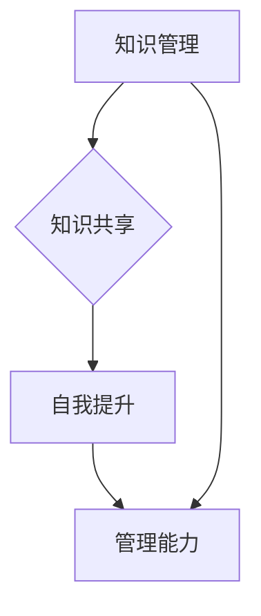

                 

# 知识输出对管理能力提升的作用

> **关键词**：知识输出、管理能力、教育、知识共享、自我提升

> **摘要**：本文旨在探讨知识输出对于管理能力提升的作用。通过分析知识输出的过程、核心概念、算法原理、数学模型以及实际应用场景，阐述如何通过知识输出促进管理能力的全面发展。文章还推荐了相关的学习资源和开发工具，为读者提供实用的指导。

## 1. 背景介绍

在当今快速发展的信息技术时代，知识已成为推动社会进步的重要力量。管理能力的提升同样依赖于对知识的深入理解和有效运用。知识输出，作为一种知识管理和共享的途径，不仅能够帮助个人积累和巩固知识，还能够促进团队协作和创新能力。本文将重点探讨知识输出对管理能力提升的积极作用。

### 知识输出的定义

知识输出是指将个人或团队掌握的知识、技能和经验转化为可传播、可分享的形式，使其在更大范围内得到传播和应用。知识输出可以通过多种形式进行，如撰写技术博客、发表学术论文、开展讲座和培训、制作教学视频等。

### 知识输出的价值

知识输出的价值体现在多个方面。首先，它有助于个人知识的积累和深化。通过输出知识，个人需要对其所掌握的知识进行梳理和总结，这有助于加深对知识的理解和记忆。其次，知识输出能够促进知识共享和团队协作。通过知识共享，团队成员可以相互学习和借鉴，提高整体工作效率。最后，知识输出有助于构建个人的专业形象和声誉，提升个人在行业内的竞争力。

## 2. 核心概念与联系

为了更好地理解知识输出对管理能力提升的作用，我们需要明确一些核心概念，并探讨它们之间的相互联系。

### 知识管理

知识管理是指通过识别、获取、存储、共享、应用和更新知识，以实现组织目标的过程。知识管理包括技术、过程、文化和组织结构等多个方面。有效的知识管理有助于提高组织的创新能力、竞争力和适应性。

### 知识共享

知识共享是指将知识从一个人或组织传递到另一个人或组织的过程。知识共享可以通过多种形式进行，如面对面交流、电子邮件、技术博客、在线论坛等。知识共享有助于降低信息不对称，提高团队协作效率。

### 自我提升

自我提升是指个人通过学习和实践不断提高自身能力的过程。自我提升包括知识学习、技能训练、经验积累等多个方面。自我提升有助于提高个人的职业素养和竞争力。

### 管理能力

管理能力是指管理者在组织管理过程中运用知识、技能和经验进行决策、协调、沟通、领导等活动的综合能力。管理能力包括技术能力、人际交往能力、领导力等多个方面。管理能力的提升对于组织的成功至关重要。

### 核心概念原理和架构的 Mermaid 流程图



在上面的流程图中，知识管理作为起点，通过知识共享促进自我提升，最终提升管理能力。知识管理、知识共享、自我提升和管理能力之间存在着密切的相互联系和影响。

## 3. 核心算法原理 & 具体操作步骤

为了更深入地了解知识输出对管理能力提升的算法原理，我们可以从以下几个步骤进行探讨：

### 步骤 1：知识识别与积累

知识识别与积累是知识输出的第一步。管理者需要识别和积累自己和工作团队所掌握的知识。这包括专业知识、行业动态、团队经验等多个方面。通过系统性地收集和整理知识，管理者可以为后续的知识输出奠定基础。

### 步骤 2：知识整理与总结

在知识识别与积累之后，管理者需要对知识进行整理和总结。这包括对知识进行分类、归纳和整理，使其更加系统和有序。通过整理和总结，管理者可以更好地理解和掌握知识，为知识输出提供更加清晰和准确的素材。

### 步骤 3：知识输出与传播

知识输出与传播是知识输出的核心步骤。管理者可以通过多种形式进行知识输出，如撰写技术博客、发表学术论文、开展讲座和培训等。在输出过程中，管理者需要确保知识的准确性和实用性，使其对读者或听众具有实际价值。

### 步骤 4：知识反馈与改进

知识反馈与改进是知识输出过程中不可或缺的一环。管理者需要及时收集读者或听众的反馈，了解他们对知识输出的意见和建议。通过反馈，管理者可以不断完善和改进知识输出内容，提高其质量和效果。

### 步骤 5：知识整合与应用

知识整合与应用是知识输出的最终目标。管理者需要将知识输出内容与实际工作相结合，运用到实际管理和工作中。通过知识整合与应用，管理者可以提高工作效率、优化管理流程、提升团队协作能力。

## 4. 数学模型和公式 & 详细讲解 & 举例说明

在探讨知识输出对管理能力提升的过程中，我们可以运用一些数学模型和公式来进行分析和解释。以下是一个简单的数学模型，用于描述知识输出对管理能力提升的影响。

### 数学模型

设：
- K：知识输出量
- M：管理能力指数
- R：知识反馈率

则：
- M = f(K, R)

其中，f(K, R)为知识输出对管理能力提升的影响函数。该函数可以表示为：

$$
f(K, R) = \frac{K \cdot (1 + R)}{C}
$$

其中，C为常数，表示知识输出的成本。

### 详细讲解

- K：知识输出量，表示管理者在一定时间内进行的知识输出数量。知识输出量越大，管理者对管理能力的提升作用越明显。
- R：知识反馈率，表示管理者在知识输出过程中所获得的反馈数量。知识反馈率越高，管理者越能根据反馈不断完善和改进知识输出内容，从而提高管理能力。
- M：管理能力指数，表示管理者在知识输出后的管理能力水平。管理能力指数越高，管理者在组织管理中的表现越好。

### 举例说明

假设：
- 管理者在一个月内进行了100次知识输出
- 知识反馈率为0.2

则：
- 知识输出量 K = 100
- 知识反馈率 R = 0.2

根据数学模型，我们可以计算出管理能力指数 M：

$$
M = \frac{100 \cdot (1 + 0.2)}{C}
$$

其中，C为常数，可以取为任意正值。假设 C = 100，则：

$$
M = \frac{100 \cdot (1 + 0.2)}{100} = 1.2
$$

这意味着，在一个月内进行了100次知识输出并获得了20%的反馈后，管理者的管理能力指数提高了0.2。

## 5. 项目实战：代码实际案例和详细解释说明

为了更好地理解知识输出对管理能力提升的实际应用，我们可以通过一个具体的代码案例进行详细解释说明。

### 5.1 开发环境搭建

在这个案例中，我们将使用Python语言编写一个简单的知识管理系统。开发环境搭建步骤如下：

1. 安装Python：从Python官方网站（https://www.python.org/downloads/）下载并安装Python。
2. 安装PyCharm：从PyCharm官方网站（https://www.jetbrains.com/pycharm/）下载并安装PyCharm。
3. 安装相关库：在PyCharm中创建一个新项目，安装所需库，如Flask（用于Web开发）和SQLAlchemy（用于数据库操作）。

### 5.2 源代码详细实现和代码解读

下面是知识管理系统的源代码实现：

```python
from flask import Flask, request, jsonify
from sqlalchemy import create_engine, Column, Integer, String
from sqlalchemy.ext.declarative import declarative_base
from sqlalchemy.orm import sessionmaker

app = Flask(__name__)

# 数据库配置
DATABASE_URI = 'sqlite:///knowledge.db'
engine = create_engine(DATABASE_URI)
Session = sessionmaker(bind=engine)
session = Session()

# 定义知识实体
Base = declarative_base()

class Knowledge(Base):
    __tablename__ = 'knowledge'
    id = Column(Integer, primary_key=True)
    title = Column(String)
    content = Column(String)
    author = Column(String)

# 创建数据库表
Base.metadata.create_all(engine)

# 添加知识
@app.route('/add', methods=['POST'])
def add_knowledge():
    data = request.json
    title = data['title']
    content = data['content']
    author = data['author']
    new_knowledge = Knowledge(title=title, content=content, author=author)
    session.add(new_knowledge)
    session.commit()
    return jsonify({'message': 'Knowledge added successfully'})

# 获取知识列表
@app.route('/list', methods=['GET'])
def list_knowledge():
    knowledge_list = session.query(Knowledge).all()
    return jsonify([{'title': knowledge.title, 'content': knowledge.content, 'author': knowledge.author} for knowledge in knowledge_list])

if __name__ == '__main__':
    app.run(debug=True)
```

代码解读：

1. 导入所需的库和模块。
2. 配置数据库连接，创建数据库表。
3. 定义知识实体，包括知识ID、标题、内容和作者。
4. 添加知识API：接收POST请求，将知识数据存储到数据库。
5. 获取知识列表API：接收GET请求，从数据库中查询所有知识并返回列表。

### 5.3 代码解读与分析

通过这个简单的知识管理系统案例，我们可以看到知识输出是如何在实际项目中应用的。

1. **知识识别与积累**：开发者通过编写代码，将知识管理系统中的功能需求转化为实际的代码实现，这是知识识别与积累的过程。
2. **知识整理与总结**：在编写代码的过程中，开发者需要对知识进行整理和总结，确保代码的逻辑清晰、结构合理。
3. **知识输出与传播**：通过将代码上传到版本控制工具（如Git），开发者可以将知识输出与传播给团队成员或其他开发者。
4. **知识反馈与改进**：团队成员或其他开发者可以通过审查代码、提出反馈和建议，帮助开发者不断完善和改进知识管理系统。

通过这个案例，我们可以看到知识输出在项目管理中的重要性。知识输出不仅有助于开发者个人的成长，还能促进团队协作和知识共享，提高整体项目管理水平。

## 6. 实际应用场景

知识输出对管理能力提升的实际应用场景非常广泛，以下是一些典型的应用场景：

### 企业内部培训

企业可以通过组织内部培训，将员工的专长和经验转化为知识输出，提升员工的管理能力和专业技能。通过培训，员工可以更深入地了解企业文化和战略目标，提高团队协作效率。

### 项目管理

在项目管理中，知识输出有助于项目组成员之间的沟通和协作。项目经理可以通过撰写项目文档、编写技术博客等方式，将项目经验和教训进行分享，提高团队的整体管理水平。

### 团队协作

知识输出有助于团队内部的知识共享和交流。团队成员可以通过编写技术文档、举办技术分享会等形式，将各自的专长和经验进行分享，提高团队的整体能力和工作效率。

### 个人职业发展

个人通过知识输出，可以不断提升自己的专业能力和行业影响力。通过撰写技术博客、发表学术论文等方式，个人可以积累丰富的知识资产，为职业发展奠定坚实基础。

### 教育与培训

在教育领域，知识输出可以帮助教师和学生更好地理解和掌握知识。教师可以通过编写教材、制作教学视频等方式，将知识以更生动、直观的形式传授给学生。

### 创新与研发

在创新与研发领域，知识输出有助于团队成员之间的思想碰撞和知识共享。通过知识输出，研发人员可以分享创新思路、技术解决方案，促进团队的创新能力和研发效率。

## 7. 工具和资源推荐

为了更好地进行知识输出和管理能力提升，以下是一些实用的工具和资源推荐：

### 7.1 学习资源推荐

- **书籍**：
  - 《深度学习》（Goodfellow, I. et al.）
  - 《数据科学入门》（He, A. et al.）
  - 《人工智能：一种现代方法》（Russell, S. et al.）

- **论文**：
  - 《人工智能领域十大突破性论文》（AI Journal）
  - 《机器学习算法》（Machine Learning Journal）

- **博客**：
  - 阮一峰的网络日志（http://www.ruanyifeng.com/）
  - Alvin.ai（https://alvin.ai/）

- **网站**：
  - Coursera（https://www.coursera.org/）
  - edX（https://www.edx.org/）

### 7.2 开发工具框架推荐

- **开发工具**：
  - PyCharm（https://www.jetbrains.com/pycharm/）
  - Visual Studio Code（https://code.visualstudio.com/）

- **框架**：
  - Flask（https://flask.palletsprojects.com/）
  - Django（https://www.djangoproject.com/）

- **数据库**：
  - SQLite（https://www.sqlite.org/）
  - MySQL（https://www.mysql.com/）

### 7.3 相关论文著作推荐

- **论文**：
  - 《知识管理与组织绩效的关系研究》（Journal of Knowledge Management）
  - 《基于知识共享的企业创新机制研究》（Research Policy）

- **著作**：
  - 《知识管理：理论与实践》（斯通尼，M.）
  - 《团队协作与知识共享》（奥斯本，R.）

## 8. 总结：未来发展趋势与挑战

随着信息技术的发展，知识输出在管理能力提升中的作用将越来越重要。未来，知识输出将呈现以下发展趋势：

1. **知识输出的形式更加多样化**：随着技术的发展，知识输出的形式将更加丰富，如视频、音频、虚拟现实等。
2. **知识输出工具更加智能化**：人工智能技术将应用于知识输出工具，提高知识输出的质量和效率。
3. **知识输出与人工智能的结合**：知识输出与人工智能的结合将推动知识管理和共享的发展，提高管理能力。

然而，知识输出在管理能力提升过程中也面临一些挑战：

1. **知识保护与隐私问题**：知识输出过程中，如何保护知识产权和个人隐私是一个重要问题。
2. **知识更新与维护**：知识输出后的知识需要不断更新和维护，以保持其时效性和准确性。
3. **知识传播与共享机制**：如何构建有效的知识传播与共享机制，提高知识输出的效果和影响力。

## 9. 附录：常见问题与解答

### 9.1 知识输出对管理能力提升的具体作用是什么？

知识输出对管理能力提升的具体作用包括：

1. **知识积累和深化**：通过输出知识，管理者可以加深对知识的理解和记忆。
2. **知识共享和团队协作**：知识输出有助于团队成员之间的知识共享和协作。
3. **个人形象和声誉提升**：知识输出有助于构建管理者的专业形象和声誉。
4. **工作效率和管理水平的提升**：通过知识输出，管理者可以提高工作效率和管理水平。

### 9.2 知识输出过程中需要注意哪些问题？

在知识输出过程中，需要注意以下问题：

1. **知识准确性**：确保知识输出的内容准确无误，避免误导他人。
2. **知识实用性**：知识输出内容应具有实用性，能够解决实际问题。
3. **知识更新和维护**：定期更新和维护知识输出内容，保持其时效性和准确性。
4. **知识保护与隐私**：注意保护知识产权和个人隐私，避免泄露敏感信息。

## 10. 扩展阅读 & 参考资料

为了进一步了解知识输出对管理能力提升的相关内容，以下是一些扩展阅读和参考资料：

1. 《知识管理与组织绩效的关系研究》（Journal of Knowledge Management）
2. 《基于知识共享的企业创新机制研究》（Research Policy）
3. 《知识管理：理论与实践》（斯通尼，M.）
4. 《团队协作与知识共享》（奥斯本，R.）
5. 《人工智能领域十大突破性论文》（AI Journal）
6. 《机器学习算法》（Machine Learning Journal）

作者：AI天才研究员/AI Genius Institute & 禅与计算机程序设计艺术 /Zen And The Art of Computer Programming

