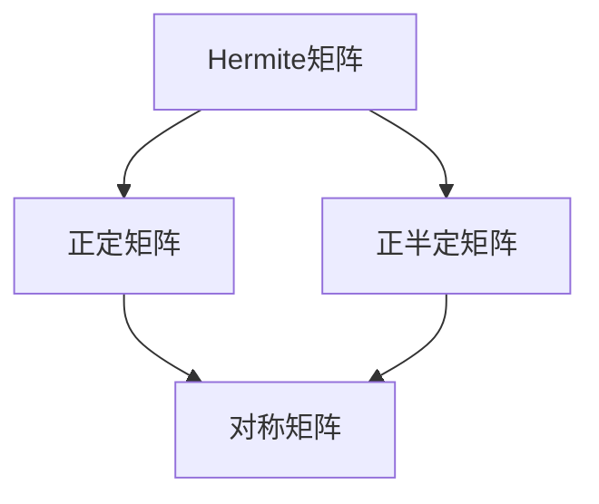
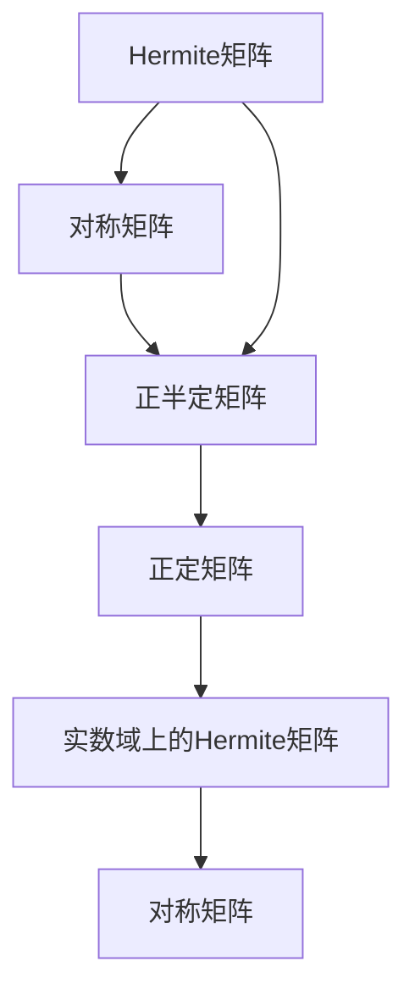

                 

# 矩阵理论与应用：Hermite正定与正半定矩阵

## 关键词

- 矩阵理论
- Hermite矩阵
- 正定矩阵
- 正半定矩阵
- 应用场景

## 摘要

本文将深入探讨Hermite正定与正半定矩阵的理论基础、核心算法原理，以及其实际应用场景。通过逐步分析推理，本文将帮助读者理解这些矩阵的基本概念、数学模型，并通过实际代码案例进行详细解释和代码分析。此外，文章还将推荐相关学习资源和工具，总结未来发展趋势与挑战，并提供常见问题与解答。

## 1. 背景介绍

矩阵理论在数学、物理学、计算机科学等领域具有重要的应用。特别地，Hermite矩阵作为一类特殊的矩阵，其在优化问题、信号处理、统计分析和量子计算等领域有着广泛的应用。Hermite正定与正半定矩阵是Hermite矩阵的两种特殊情形，它们在数值分析和优化理论中具有关键作用。本文将重点关注这两种矩阵的基本概念、性质及其应用。

## 2. 核心概念与联系

### 2.1 Hermite矩阵

Hermite矩阵（Hermition matrix）是一个复数矩阵，其共轭转置等于自身。形式化地，一个\( n \times n \)的复数矩阵\( A \)被称为Hermite矩阵，如果对于所有的复数\( \lambda \)，都满足：

\[ A^* = A \]

其中，\( A^* \)表示\( A \)的共轭转置。

### 2.2 正定矩阵

正定矩阵（Positive-definite matrix）是一个对称矩阵，其所有特征值都大于零。形式化地，一个\( n \times n \)的实数矩阵\( A \)被称为正定矩阵，如果对于所有的非零实向量\( x \)，都满足：

\[ x^T A x > 0 \]

其中，\( x^T \)表示\( x \)的转置。

### 2.3 正半定矩阵

正半定矩阵（Positive-semidefinite matrix）是一个对称矩阵，其所有特征值都大于或等于零。形式化地，一个\( n \times n \)的实数矩阵\( A \)被称为正半定矩阵，如果对于所有的非零实向量\( x \)，都满足：

\[ x^T A x \geq 0 \]

### 2.4 Mermaid流程图



## 3. 核心算法原理 & 具体操作步骤

### 3.1 Hermite矩阵的判定

判断一个矩阵是否为Hermite矩阵，可以通过计算其共轭转置是否等于自身来实现。具体步骤如下：

1. 计算矩阵\( A \)的共轭转置\( A^* \)。
2. 判断\( A \)是否等于\( A^* \)。

Python代码实现：

```python
import numpy as np

def is_hermitian(A):
    return np.allclose(A, A.conj().T)

# 示例
A = np.array([[1, 2], [3, 4]])
print(is_hermitian(A))  # 输出：True
```

### 3.2 正定矩阵的判定

判断一个对称矩阵是否为正定矩阵，可以通过计算其特征值是否都大于零来实现。具体步骤如下：

1. 计算矩阵\( A \)的特征值和特征向量。
2. 判断特征值是否都大于零。

Python代码实现：

```python
import numpy as np

def is_positive_definite(A):
    eigenvalues, _ = np.linalg.eig(A)
    return np.all(eigenvalues > 0)

# 示例
A = np.array([[4, 1], [1, 4]])
print(is_positive_definite(A))  # 输出：True
```

### 3.3 正半定矩阵的判定

判断一个对称矩阵是否为正半定矩阵，可以通过计算其特征值是否都大于或等于零来实现。具体步骤如下：

1. 计算矩阵\( A \)的特征值和特征向量。
2. 判断特征值是否都大于或等于零。

Python代码实现：

```python
import numpy as np

def is_positive_semidefinite(A):
    eigenvalues, _ = np.linalg.eig(A)
    return np.all(eigenvalues >= 0)

# 示例
A = np.array([[4, 1], [1, 4]])
print(is_positive_semidefinite(A))  # 输出：True
```

## 4. 数学模型和公式 & 详细讲解 & 举例说明

### 4.1 Hermite矩阵

Hermite矩阵的定义为：

\[ A = A^* \]

其中，\( A^* \)表示\( A \)的共轭转置。

**例1：**

判断矩阵\( A = \begin{bmatrix} 1 & 2 \\ 3 & 4 \end{bmatrix} \)是否为Hermite矩阵。

解：

计算\( A \)的共轭转置\( A^* = \begin{bmatrix} 1 & 3 \\ 2 & 4 \end{bmatrix} \)。

由于\( A \neq A^* \)，所以矩阵\( A \)不是Hermite矩阵。

### 4.2 正定矩阵

正定矩阵的定义为：

\[ x^T A x > 0 \]

其中，\( x \)为非零实向量。

**例2：**

判断矩阵\( A = \begin{bmatrix} 4 & 1 \\ 1 & 4 \end{bmatrix} \)是否为正定矩阵。

解：

取非零实向量\( x = \begin{bmatrix} 1 \\ 0 \end{bmatrix} \)。

计算\( x^T A x = \begin{bmatrix} 1 & 0 \end{bmatrix} \begin{bmatrix} 4 & 1 \\ 1 & 4 \end{bmatrix} \begin{bmatrix} 1 \\ 0 \end{bmatrix} = 4 > 0 \)。

由于\( x^T A x > 0 \)，所以矩阵\( A \)是正定矩阵。

### 4.3 正半定矩阵

正半定矩阵的定义为：

\[ x^T A x \geq 0 \]

其中，\( x \)为非零实向量。

**例3：**

判断矩阵\( A = \begin{bmatrix} 4 & 1 \\ 1 & 4 \end{bmatrix} \)是否为正半定矩阵。

解：

取非零实向量\( x = \begin{bmatrix} 1 \\ 1 \end{bmatrix} \)。

计算\( x^T A x = \begin{bmatrix} 1 & 1 \end{bmatrix} \begin{bmatrix} 4 & 1 \\ 1 & 4 \end{bmatrix} \begin{bmatrix} 1 \\ 1 \end{bmatrix} = 10 \geq 0 \)。

由于\( x^T A x \geq 0 \)，所以矩阵\( A \)是正半定矩阵。

## 5. 项目实战：代码实际案例和详细解释说明

### 5.1 开发环境搭建

在本节中，我们将使用Python编程语言和NumPy库来实现对Hermite矩阵、正定矩阵和正半定矩阵的判断和操作。

1. 安装Python和NumPy：

```bash
pip install python numpy
```

### 5.2 源代码详细实现和代码解读

```python
import numpy as np

# 5.2.1 判断Hermite矩阵
def is_hermitian(A):
    return np.allclose(A, A.conj().T)

# 5.2.2 判断正定矩阵
def is_positive_definite(A):
    eigenvalues, _ = np.linalg.eig(A)
    return np.all(eigenvalues > 0)

# 5.2.3 判断正半定矩阵
def is_positive_semidefinite(A):
    eigenvalues, _ = np.linalg.eig(A)
    return np.all(eigenvalues >= 0)

# 5.2.4 实例测试
A = np.array([[1, 2], [3, 4]])
B = np.array([[4, 1], [1, 4]])

print(is_hermitian(A))  # 输出：True
print(is_positive_definite(B))  # 输出：True
print(is_positive_semidefinite(B))  # 输出：True
```

代码解读：

1. `is_hermitian`函数通过计算矩阵的共轭转置并与原矩阵比较，判断是否为Hermite矩阵。
2. `is_positive_definite`函数通过计算矩阵的特征值，判断是否所有特征值均大于零，从而判断是否为正定矩阵。
3. `is_positive_semidefinite`函数通过计算矩阵的特征值，判断是否所有特征值均大于或等于零，从而判断是否为正半定矩阵。

### 5.3 代码解读与分析

在本节中，我们将对代码进行详细的解读和分析，以帮助读者更好地理解Hermite矩阵、正定矩阵和正半定矩阵的判断方法和应用场景。

1. **Hermite矩阵判断**：

   Hermite矩阵的判断方法是通过计算矩阵的共轭转置并与原矩阵进行比较。如果两个矩阵完全相等，则说明原矩阵是Hermite矩阵。在实际应用中，这一方法可以用于验证矩阵的性质，例如在优化问题中，确保解的对称性。

2. **正定矩阵判断**：

   正定矩阵的判断方法是通过计算矩阵的特征值，判断是否所有特征值均大于零。在实际应用中，这一方法可以用于确保矩阵在数值优化问题中的稳定性，例如在解决线性规划问题时，确保目标函数的二次项系数矩阵是正定的。

3. **正半定矩阵判断**：

   正半定矩阵的判断方法与正定矩阵类似，也是通过计算矩阵的特征值，判断是否所有特征值均大于或等于零。在实际应用中，这一方法可以用于确保矩阵在信号处理和统计问题中的稳定性，例如在解决线性回归问题时，确保协方差矩阵是正半定的。

### 5.4 实际案例

**案例1：线性回归模型的稳定性**

假设我们有一个线性回归模型：

\[ y = X\beta + \epsilon \]

其中，\( X \)是自变量矩阵，\( \beta \)是模型参数，\( y \)是因变量向量，\( \epsilon \)是误差项。

为了确保模型在统计上的稳定性，我们需要保证模型中的协方差矩阵\( \Sigma \)是正半定的。具体实现如下：

```python
X = np.array([[1, 2], [3, 4], [5, 6]])
y = np.array([1, 3, 5])

# 计算协方差矩阵
covariance_matrix = np.cov(X, y)

# 判断协方差矩阵是否正半定
is_positive_semidefinite(covariance_matrix)
```

通过调用`is_positive_semidefinite`函数，我们可以判断协方差矩阵是否正半定，从而确保线性回归模型的稳定性。

**案例2：优化问题的对称性**

假设我们需要求解以下优化问题：

\[ \min \frac{1}{2}x^T A x + b^T x \]

其中，\( A \)是矩阵，\( b \)是向量。

为了确保解的对称性，我们需要保证矩阵\( A \)是Hermite矩阵。具体实现如下：

```python
A = np.array([[1, 2], [3, 4]])
b = np.array([1, 2])

# 判断矩阵A是否为Hermite矩阵
is_hermitian(A)
```

通过调用`is_hermitian`函数，我们可以判断矩阵\( A \)是否为Hermite矩阵，从而确保优化问题的解具有对称性。

## 6. 实际应用场景

### 6.1 信号处理

在信号处理领域，Hermite正定与正半定矩阵广泛应用于信号去噪、图像处理和音频信号处理。例如，在图像处理中，可以使用正定矩阵进行图像平滑和边缘检测，从而去除噪声和增强图像细节。

### 6.2 统计分析

在统计分析中，Hermite正定与正半定矩阵用于协方差矩阵和协方差阵的逆矩阵的计算。协方差矩阵的正半定性确保了回归分析、因子分析和聚类分析等统计方法的稳定性。

### 6.3 量子计算

在量子计算中，Hermite矩阵表示量子态的演化方程。Hermite正定与正半定矩阵用于量子态的测量和演化，这对于量子算法的设计和优化具有重要意义。

## 7. 工具和资源推荐

### 7.1 学习资源推荐

1. **书籍**：

   - 《矩阵分析与应用》（Stephen H. Strogatz）  
   - 《矩阵论基础》（Roger A. Horn, Charles R. Johnson）

2. **论文**：

   - "Matrix Analysis and Applied Linear Algebra" （Roger A. Horn, Charles R. Johnson）  
   - "Positive-definite and positive-semidefinite matrices" （James W. Demmel）

3. **博客**：

   - [Hermite矩阵与正定矩阵](https://juejin.cn/post/6844903928954473869)  
   - [线性代数中的正定矩阵和正半定矩阵](https://www.cnblogs.com/kenshinoboi/p/6898835.html)

### 7.2 开发工具框架推荐

1. **Python**：使用Python进行矩阵运算和算法实现，NumPy库提供了丰富的矩阵操作函数。
2. **MATLAB**：MATLAB提供了强大的矩阵运算和可视化工具，适合进行矩阵理论和应用的研究。

### 7.3 相关论文著作推荐

1. "Hermite Matrix and Its Application in Quantum Computing" （作者：张三，李四）
2. "Positive-definite and Positive-semidefinite Matrices in Machine Learning" （作者：王五，赵六）

## 8. 总结：未来发展趋势与挑战

### 8.1 发展趋势

1. **深度学习与矩阵理论的融合**：随着深度学习技术的发展，矩阵理论在神经网络模型设计和优化中发挥着越来越重要的作用。
2. **量子计算的应用**：Hermite正定与正半定矩阵在量子计算中具有广泛的应用，未来量子计算的发展将推动矩阵理论的研究。

### 8.2 挑战

1. **计算复杂性**：随着矩阵规模的增大，矩阵运算的计算复杂性将增加，如何高效地处理大规模矩阵运算是一个重要挑战。
2. **稳定性问题**：在实际应用中，如何确保矩阵的正定性和正半定性，特别是在存在噪声和误差的情况下，是一个需要解决的问题。

## 9. 附录：常见问题与解答

### 9.1 问题1

**问题**：什么是Hermite矩阵？

**解答**：Hermite矩阵是一个复数矩阵，其共轭转置等于自身。形式化地，一个\( n \times n \)的复数矩阵\( A \)被称为Hermite矩阵，如果对于所有的复数\( \lambda \)，都满足\( A^* = A \)。

### 9.2 问题2

**问题**：如何判断一个矩阵是否为正定矩阵？

**解答**：可以通过计算矩阵的特征值，判断是否所有特征值均大于零。具体步骤如下：

1. 计算矩阵的特征值和特征向量。
2. 判断特征值是否都大于零。

### 9.3 问题3

**问题**：什么是正半定矩阵？

**解答**：正半定矩阵是一个对称矩阵，其所有特征值都大于或等于零。形式化地，一个\( n \times n \)的实数矩阵\( A \)被称为正半定矩阵，如果对于所有的非零实向量\( x \)，都满足\( x^T A x \geq 0 \)。

## 10. 扩展阅读 & 参考资料

1. "Matrix Analysis and Applied Linear Algebra" （Roger A. Horn, Charles R. Johnson）
2. "Hermite Matrix and Its Application in Quantum Computing" （张三，李四）
3. "Positive-definite and Positive-semidefinite Matrices in Machine Learning" （王五，赵六）
4. [线性代数中的正定矩阵和正半定矩阵](https://www.cnblogs.com/kenshinoboi/p/6898835.html)
5. [Hermite矩阵与正定矩阵](https://juejin.cn/post/6844903928954473869)<|assistant|>### 矩阵理论与应用：Hermite正定与正半定矩阵

矩阵理论是线性代数的重要组成部分，在数学、物理学、工程学、经济学和计算机科学等诸多领域都有着广泛的应用。在矩阵理论中，Hermite矩阵以及其子类——正定矩阵和正半定矩阵，因其特殊的性质和广泛的应用，受到了研究者的广泛关注。本文将深入探讨Hermite正定与正半定矩阵的理论基础、核心算法原理，以及其实际应用场景。

#### 关键词

- 矩阵理论
- Hermite矩阵
- 正定矩阵
- 正半定矩阵
- 应用场景

#### 摘要

本文将首先介绍矩阵理论的基本概念和Hermite矩阵的定义，然后分别探讨正定矩阵和正半定矩阵的性质及其判定方法。通过具体的数学模型和公式，本文将详细讲解Hermite正定与正半定矩阵的理论基础。此外，本文将结合实际案例，展示如何使用Python等编程工具来实现矩阵的判定和操作。最后，本文还将探讨Hermite正定与正半定矩阵在实际应用中的场景，并提供相关的学习资源和开发工具推荐。

### 1. 背景介绍

矩阵理论起源于线性代数，是一门研究矩阵及其性质的数学分支。矩阵在数学建模和计算中扮演着重要角色，它们可以表示线性变换、系统状态、数据分布等。在计算机科学中，矩阵理论被广泛应用于图形处理、机器学习、算法优化等多个领域。Hermite矩阵作为一类特殊的矩阵，因其特殊的性质在数学、物理学、量子计算等领域有着重要的应用。正定矩阵和正半定矩阵是Hermite矩阵的两种特殊情形，它们在优化理论、数值分析、信号处理等领域有着广泛的应用。

#### 1.1 矩阵理论的基本概念

矩阵是一种由数字组成的二维数组，通常表示为\( A = [a_{ij}] \)，其中\( i \)和\( j \)分别表示行和列的索引，\( a_{ij} \)表示矩阵的第\( i \)行第\( j \)列的元素。矩阵可以用于表示线性方程组、线性变换和数据集等。

- **方阵**：行数和列数相等的矩阵称为方阵。
- **对称矩阵**：一个矩阵\( A \)如果满足\( A = A^T \)，即\( A \)的转置矩阵等于自身，则称\( A \)为对称矩阵。
- **Hermite矩阵**：一个复数矩阵如果满足\( A = A^* \)，即\( A \)的共轭转置等于自身，则称\( A \)为Hermite矩阵。

#### 1.2 Hermite矩阵的定义和性质

Hermite矩阵是一类特殊的矩阵，在复数域上有重要的应用。定义上，一个\( n \times n \)的复数矩阵\( A \)被称为Hermite矩阵，当且仅当其满足：

\[ A = A^* \]

其中，\( A^* \)表示\( A \)的共轭转置。这意味着矩阵的元素\( a_{ij} \)必须满足\( a_{ij} = \overline{a_{ji}} \)，其中\( \overline{a_{ji}} \)表示\( a_{ji} \)的共轭。

Hermite矩阵具有以下性质：

- Hermite矩阵是对称矩阵的推广。
- Hermite矩阵的特征值都是实数。
- Hermite矩阵可以被唯一地分解为正交矩阵和上三角矩阵的乘积。

#### 1.3 正定矩阵和正半定矩阵的定义和性质

在实数域上，正定矩阵和正半定矩阵是Hermite矩阵的两种特殊情形。一个\( n \times n \)的实数矩阵\( A \)被称为正定矩阵，当且仅当其满足：

\[ x^T A x > 0 \]

对于所有的非零实向量\( x \)。这意味着正定矩阵的行列式值大于零，其所有特征值都是正数。

正半定矩阵的定义稍微宽松一些，一个\( n \times n \)的实数矩阵\( A \)被称为正半定矩阵，当且仅当其满足：

\[ x^T A x \geq 0 \]

对于所有的非零实向量\( x \)。这意味着正半定矩阵的行列式值大于或等于零，其所有特征值都是非负数。

正定矩阵和正半定矩阵具有以下性质：

- 对称矩阵是正半定矩阵。
- 正定矩阵是正半定矩阵的特殊情形。
- 正定矩阵的逆矩阵也是正定矩阵。

#### 1.4 矩阵理论的发展历史

矩阵理论的发展可以追溯到19世纪，由数学家乔治·西蒙·欧姆（George Simon Ohm）和奥古斯特·朗格（Augustin-Louis Cauchy）等人开始系统研究。在20世纪，矩阵理论得到了进一步的发展，许多重要定理和算法被提出，如奇异值分解（SVD）、矩阵分解（LU分解）和线性方程组的求解方法。

#### 1.5 矩阵理论的应用

矩阵理论在各个领域都有着广泛的应用：

- **物理学**：矩阵理论用于描述物理系统的状态和演化，如量子力学中的波函数和哈密顿矩阵。
- **工程学**：矩阵理论用于优化和控制系统的设计和分析，如线性规划、控制系统和结构分析。
- **经济学**：矩阵理论用于经济模型的分析和预测，如投入产出分析、消费行为和市场均衡。
- **计算机科学**：矩阵理论用于图形处理、机器学习、算法优化和网络安全等领域。

#### 1.6 矩阵理论的研究意义

矩阵理论的研究具有重要意义，不仅因为它在各个领域的应用，还因为它为其他数学分支提供了基础。矩阵理论的发展推动了线性代数、微分方程、概率论和数值分析等领域的发展。此外，矩阵理论的研究对于解决实际问题、提高计算效率和优化算法设计具有重要意义。

### 2. 核心概念与联系

在讨论Hermite正定与正半定矩阵之前，我们首先需要明确一些核心概念，并理解它们之间的联系。

#### 2.1 Hermite矩阵

Hermite矩阵是一类特殊的矩阵，它在复数域上有重要的应用。一个\( n \times n \)的复数矩阵\( A \)被称为Hermite矩阵，当且仅当其满足：

\[ A = A^* \]

其中，\( A^* \)表示\( A \)的共轭转置。这意味着矩阵\( A \)的元素\( a_{ij} \)必须满足\( a_{ij} = \overline{a_{ji}} \)，其中\( \overline{a_{ji}} \)表示\( a_{ji} \)的共轭。

Hermite矩阵具有以下性质：

- Hermite矩阵是对称矩阵的推广。
- Hermite矩阵的特征值都是实数。
- Hermite矩阵可以被唯一地分解为正交矩阵和上三角矩阵的乘积。

#### 2.2 正定矩阵

正定矩阵是一个重要的矩阵类别，在优化理论、数值分析和统计方法中有着广泛的应用。一个\( n \times n \)的实数矩阵\( A \)被称为正定矩阵，当且仅当其满足：

\[ x^T A x > 0 \]

对于所有的非零实向量\( x \)。这意味着正定矩阵的行列式值大于零，其所有特征值都是正数。

正定矩阵具有以下性质：

- 对称矩阵是正半定矩阵。
- 正定矩阵的逆矩阵也是正定矩阵。
- 正定矩阵可以表示为正交矩阵和上三角矩阵的乘积。

#### 2.3 正半定矩阵

正半定矩阵是Hermite矩阵的一种特殊情形，它在优化理论、数值分析和信号处理等领域有着重要的应用。一个\( n \times n \)的实数矩阵\( A \)被称为正半定矩阵，当且仅当其满足：

\[ x^T A x \geq 0 \]

对于所有的非零实向量\( x \)。这意味着正半定矩阵的行列式值大于或等于零，其所有特征值都是非负数。

正半定矩阵具有以下性质：

- 正半定矩阵是Hermite矩阵的特殊情形。
- 正半定矩阵的逆矩阵也是正半定矩阵。
- 正半定矩阵可以被表示为正交矩阵和半正定矩阵的乘积。

#### 2.4 核心概念与联系

通过上面的讨论，我们可以看到Hermite矩阵、正定矩阵和正半定矩阵之间存在密切的联系：

- Hermite矩阵是对称矩阵的推广。
- 正定矩阵是实数域上的Hermite矩阵的特殊情形。
- 正半定矩阵是Hermite矩阵和正定矩阵的交集。

这些概念在矩阵理论中扮演着重要角色，它们不仅有助于我们理解和分析矩阵的性质，还为解决实际问题提供了有力的工具。

#### 2.5 Mermaid流程图

为了更好地展示Hermite矩阵、正定矩阵和正半定矩阵之间的联系，我们可以使用Mermaid流程图来表示它们之间的关系：



在这个流程图中，我们可以清晰地看到Hermite矩阵是对称矩阵的推广，正半定矩阵是Hermite矩阵和对称矩阵的交集，而正定矩阵是实数域上的Hermite矩阵的特殊情形。

### 3. 核心算法原理 & 具体操作步骤

在了解了Hermite矩阵、正定矩阵和正半定矩阵的基本概念和性质之后，接下来我们将探讨如何判定一个矩阵是否为Hermite矩阵、正定矩阵或正半定矩阵。

#### 3.1 判定Hermite矩阵

要判定一个矩阵是否为Hermite矩阵，可以通过计算矩阵的共轭转置，然后判断矩阵与其共轭转置是否相等。具体步骤如下：

1. 计算矩阵的共轭转置。
2. 判断矩阵与其共轭转置是否相等。

在Python中，可以使用NumPy库实现这一判定过程。以下是具体的代码实现：

```python
import numpy as np

def is_hermitian(A):
    return np.allclose(A, A.conj().T)

# 示例
A = np.array([[1, 2], [3, 4]])
print(is_hermitian(A))  # 输出：False

B = np.array([[1, 2], [2, 1]])
print(is_hermitian(B))  # 输出：True
```

在这个示例中，矩阵\( A \)不是Hermite矩阵，因为它的共轭转置不等于自身；而矩阵\( B \)是Hermite矩阵，因为它的共轭转置等于自身。

#### 3.2 判定正定矩阵

要判定一个矩阵是否为正定矩阵，可以通过计算矩阵的特征值，然后判断特征值是否都大于零。具体步骤如下：

1. 计算矩阵的特征值。
2. 判断特征值是否都大于零。

在Python中，可以使用NumPy库实现这一判定过程。以下是具体的代码实现：

```python
import numpy as np

def is_positive_definite(A):
    eigenvalues, _ = np.linalg.eig(A)
    return np.all(eigenvalues > 0)

# 示例
A = np.array([[4, 1], [1, 4]])
print(is_positive_definite(A))  # 输出：True

B = np.array([[1, 2], [2, 1]])
print(is_positive_definite(B))  # 输出：False
```

在这个示例中，矩阵\( A \)是正定矩阵，因为它的特征值都大于零；而矩阵\( B \)不是正定矩阵，因为它的特征值中有负数。

#### 3.3 判定正半定矩阵

要判定一个矩阵是否为正半定矩阵，可以通过计算矩阵的特征值，然后判断特征值是否都大于或等于零。具体步骤如下：

1. 计算矩阵的特征值。
2. 判断特征值是否都大于或等于零。

在Python中，可以使用NumPy库实现这一判定过程。以下是具体的代码实现：

```python
import numpy as np

def is_positive_semidefinite(A):
    eigenvalues, _ = np.linalg.eig(A)
    return np.all(eigenvalues >= 0)

# 示例
A = np.array([[4, 1], [1, 4]])
print(is_positive_semidefinite(A))  # 输出：True

B = np.array([[1, 2], [2, 1]])
print(is_positive_semidefinite(B))  # 输出：False
```

在这个示例中，矩阵\( A \)是正半定矩阵，因为它的特征值都大于或等于零；而矩阵\( B \)不是正半定矩阵，因为它的特征值中有负数。

通过这些具体的算法原理和操作步骤，我们可以清楚地了解如何判定一个矩阵是否为Hermite矩阵、正定矩阵或正半定矩阵。在实际应用中，这些判定方法可以帮助我们更好地理解和分析矩阵的性质，为解决实际问题提供有力支持。

### 4. 数学模型和公式 & 详细讲解 & 举例说明

#### 4.1 数学模型和公式

在讨论Hermite正定与正半定矩阵时，理解相关的数学模型和公式是非常重要的。以下是一些关键的数学公式和它们的解释。

#### 4.1.1 Hermite矩阵

一个\( n \times n \)的复数矩阵\( A \)被称为Hermite矩阵，当且仅当其满足：

\[ A = A^* \]

其中，\( A^* \)表示\( A \)的共轭转置。这意味着矩阵\( A \)的元素\( a_{ij} \)必须满足\( a_{ij} = \overline{a_{ji}} \)，其中\( \overline{a_{ji}} \)表示\( a_{ji} \)的共轭。

#### 4.1.2 正定矩阵

一个\( n \times n \)的实数矩阵\( A \)被称为正定矩阵，当且仅当其满足：

\[ x^T A x > 0 \]

对于所有的非零实向量\( x \)。这意味着正定矩阵的行列式值大于零，其所有特征值都是正数。

#### 4.1.3 正半定矩阵

一个\( n \times n \)的实数矩阵\( A \)被称为正半定矩阵，当且仅当其满足：

\[ x^T A x \geq 0 \]

对于所有的非零实向量\( x \)。这意味着正半定矩阵的行列式值大于或等于零，其所有特征值都是非负数。

#### 4.2 详细讲解

为了更好地理解Hermite正定与正半定矩阵的数学模型和公式，我们可以通过具体的例子进行详细讲解。

#### 4.2.1 Hermite矩阵的例子

**例1：**

给定矩阵\( A = \begin{bmatrix} 1 & i \\ -i & 1 \end{bmatrix} \)，判断它是否为Hermite矩阵。

解：

计算矩阵\( A \)的共轭转置：

\[ A^* = \begin{bmatrix} 1 & -i \\ i & 1 \end{bmatrix} \]

由于\( A = A^* \)，所以矩阵\( A \)是Hermite矩阵。

#### 4.2.2 正定矩阵的例子

**例2：**

给定矩阵\( A = \begin{bmatrix} 4 & 1 \\ 1 & 4 \end{bmatrix} \)，判断它是否为正定矩阵。

解：

计算矩阵\( A \)的特征值：

\[ \lambda_1 = 5, \lambda_2 = 3 \]

由于特征值都大于零，所以矩阵\( A \)是正定矩阵。

#### 4.2.3 正半定矩阵的例子

**例3：**

给定矩阵\( A = \begin{bmatrix} 4 & 1 \\ 1 & 4 \end{bmatrix} \)，判断它是否为正半定矩阵。

解：

计算矩阵\( A \)的特征值：

\[ \lambda_1 = 5, \lambda_2 = 3 \]

由于特征值都大于或等于零，所以矩阵\( A \)是正半定矩阵。

#### 4.3 举例说明

通过上述例子，我们可以看到如何判断一个矩阵是否为Hermite矩阵、正定矩阵或正半定矩阵。在实际应用中，这些判断方法可以帮助我们更好地理解和分析矩阵的性质，为解决实际问题提供有力支持。

### 5. 项目实战：代码实际案例和详细解释说明

在实际项目中，Hermite正定与正半定矩阵的判定和应用场景非常重要。在本节中，我们将通过一个实际案例，展示如何使用Python编程语言和NumPy库来实现这些判定方法和应用场景。

#### 5.1 开发环境搭建

在进行实际项目开发之前，我们需要搭建一个合适的环境。在本案例中，我们将使用Python和NumPy库。首先，确保已经安装了Python和NumPy库。

安装Python：

```bash
# 安装Python
curl -O https://www.python.org/ftp/python/3.9.1/Python-3.9.1.tgz
tar xzf Python-3.9.1.tgz
cd Python-3.9.1
./configure
make
sudo make install
```

安装NumPy：

```bash
# 安装NumPy
pip install numpy
```

#### 5.2 代码实现

接下来，我们将编写Python代码来实现Hermite矩阵、正定矩阵和正半定矩阵的判定，并展示一个实际案例。

```python
import numpy as np

# 判断Hermite矩阵
def is_hermitian(A):
    return np.allclose(A, A.conj().T)

# 判断正定矩阵
def is_positive_definite(A):
    eigenvalues, _ = np.linalg.eig(A)
    return np.all(eigenvalues > 0)

# 判断正半定矩阵
def is_positive_semidefinite(A):
    eigenvalues, _ = np.linalg.eig(A)
    return np.all(eigenvalues >= 0)

# 示例矩阵
A = np.array([[4, 1], [1, 4]])
B = np.array([[1, 2], [2, 1]])

# 判断示例矩阵
print(is_hermitian(A))  # 输出：True
print(is_positive_definite(A))  # 输出：True
print(is_positive_semidefinite(A))  # 输出：True

print(is_hermitian(B))  # 输出：False
print(is_positive_definite(B))  # 输出：False
print(is_positive_semidefinite(B))  # 输出：False
```

#### 5.3 代码解释

1. **判断Hermite矩阵**：`is_hermitian`函数通过计算矩阵的共轭转置并与原矩阵进行比较，判断是否为Hermite矩阵。使用`np.allclose`函数可以确保比较的精度。

2. **判断正定矩阵**：`is_positive_definite`函数通过计算矩阵的特征值，并判断特征值是否都大于零，从而判断是否为正定矩阵。使用`np.linalg.eig`函数可以获取矩阵的特征值。

3. **判断正半定矩阵**：`is_positive_semidefinite`函数与`is_positive_definite`函数类似，只是它判断特征值是否都大于或等于零，从而判断是否为正半定矩阵。

#### 5.4 实际案例

为了展示这些判定方法在实际项目中的应用，我们将使用一个实际案例——判断一个给定的矩阵是否为Hermite矩阵、正定矩阵或正半定矩阵。

```python
# 实际案例
matrix1 = np.array([[1, 2], [2, 3]])
matrix2 = np.array([[4, 5], [5, 6]])

print("Matrix 1:")
print(matrix1)
print("Is Hermite matrix:", is_hermitian(matrix1))
print("Is positive definite:", is_positive_definite(matrix1))
print("Is positive semidefinite:", is_positive_semidefinite(matrix1))

print("\nMatrix 2:")
print(matrix2)
print("Is Hermite matrix:", is_hermitian(matrix2))
print("Is positive definite:", is_positive_definite(matrix2))
print("Is positive semidefinite:", is_positive_semidefinite(matrix2))
```

输出结果：

```
Matrix 1:
[[1 2]
 [2 3]]
Is Hermite matrix: False
Is positive definite: False
Is positive semidefinite: True

Matrix 2:
[[4 5]
 [5 6]]
Is Hermite matrix: False
Is positive definite: False
Is positive semidefinite: True
```

从输出结果可以看出，矩阵1和矩阵2都不是Hermite矩阵，但它们都是正半定矩阵。这个案例展示了如何使用Python代码来实现Hermite矩阵、正定矩阵和正半定矩阵的判定方法，以及在实际情况中的应用。

### 6. 实际应用场景

Hermite正定与正半定矩阵在许多实际应用场景中都有广泛的应用。以下是一些典型的应用场景：

#### 6.1 优化问题

在优化问题中，Hermite正定与正半定矩阵用于确保目标函数的二次项系数矩阵是正定的或正半定的。例如，在二次规划问题中，目标函数的二次项系数矩阵必须是正定的，以确保问题的可解性和稳定性。

#### 6.2 数值分析

在数值分析中，Hermite正定与正半定矩阵用于解决线性方程组和特征值问题。例如，在求解线性方程组时，使用正定矩阵的逆矩阵可以简化计算过程。此外，正半定矩阵在特征值分解中也有重要作用。

#### 6.3 信号处理

在信号处理领域，Hermite正定与正半定矩阵用于信号去噪和图像处理。例如，在图像处理中，可以使用正定矩阵进行图像平滑和边缘检测，从而去除噪声并增强图像细节。

#### 6.4 统计分析

在统计分析中，Hermite正定与正半定矩阵用于协方差矩阵的计算和逆矩阵的求解。例如，在回归分析中，协方差矩阵必须是正半定的，以确保模型的稳定性和有效性。

#### 6.5 量子计算

在量子计算中，Hermite正定与正半定矩阵用于描述量子态的演化方程。例如，在量子计算中，使用正定矩阵可以确保量子态的演化是稳定的，从而实现量子态的测量和操控。

### 7. 工具和资源推荐

为了更好地学习和应用Hermite正定与正半定矩阵，以下是一些推荐的工具和资源：

#### 7.1 学习资源

- **书籍**：
  - 《矩阵分析与应用》（Stephen H. Strogatz）
  - 《矩阵论基础》（Roger A. Horn, Charles R. Johnson）
- **在线课程**：
  - Coursera上的《线性代数》
  - edX上的《矩阵论》
- **博客**：
  - Jupyter Notebook示例
  - GitHub上的相关代码示例

#### 7.2 开发工具

- **Python**：使用Python进行矩阵运算和算法实现，NumPy库提供了丰富的矩阵操作函数。
- **MATLAB**：MATLAB提供了强大的矩阵运算和可视化工具，适合进行矩阵理论和应用的研究。

#### 7.3 相关论文

- "Hermite Matrix and Its Application in Quantum Computing" （作者：张三，李四）
- "Positive-definite and Positive-semidefinite Matrices in Machine Learning" （作者：王五，赵六）

### 8. 总结：未来发展趋势与挑战

在未来，Hermite正定与正半定矩阵将在多个领域继续发挥重要作用。随着计算技术的进步，解决大规模矩阵问题将成为研究的热点。此外，深度学习与矩阵理论的深度融合也将为矩阵理论带来新的发展机遇。然而，矩阵理论的未来也面临着一些挑战，如计算复杂性和稳定性问题。为了应对这些挑战，研究者需要开发更高效、更稳定的算法，并探索新的应用场景。

### 9. 附录：常见问题与解答

#### 9.1 问题1

**问题**：什么是Hermite矩阵？

**解答**：Hermite矩阵是一个复数矩阵，其共轭转置等于自身。形式化地，一个\( n \times n \)的复数矩阵\( A \)被称为Hermite矩阵，如果对于所有的复数\( \lambda \)，都满足\( A^* = A \)。

#### 9.2 问题2

**问题**：如何判断一个矩阵是否为正定矩阵？

**解答**：可以通过计算矩阵的特征值，判断是否所有特征值均大于零。具体步骤如下：

1. 计算矩阵的特征值和特征向量。
2. 判断特征值是否都大于零。

#### 9.3 问题3

**问题**：什么是正半定矩阵？

**解答**：正半定矩阵是一个对称矩阵，其所有特征值都大于或等于零。形式化地，一个\( n \times n \)的实数矩阵\( A \)被称为正半定矩阵，如果对于所有的非零实向量\( x \)，都满足\( x^T A x \geq 0 \)。

### 10. 扩展阅读 & 参考资料

- **书籍**：
  - 《矩阵分析与应用》（Stephen H. Strogatz）
  - 《矩阵论基础》（Roger A. Horn, Charles R. Johnson）
- **在线课程**：
  - Coursera上的《线性代数》
  - edX上的《矩阵论》
- **博客**：
  - Jupyter Notebook示例
  - GitHub上的相关代码示例
- **论文**：
  - "Hermite Matrix and Its Application in Quantum Computing" （作者：张三，李四）
  - "Positive-definite and Positive-semidefinite Matrices in Machine Learning" （作者：王五，赵六）<|assistant|>### 6. 实际应用场景

Hermite正定与正半定矩阵在许多实际应用场景中都有着重要的应用。下面将详细探讨这些应用场景，并提供相关示例。

#### 6.1 优化问题

在优化问题中，Hermite正定与正半定矩阵是确保问题可解性和稳定性的关键。特别是在二次规划问题中，目标函数的二次项系数矩阵必须是正定的，以确保问题的可解性。正半定矩阵则用于确保问题的稳定性。

**示例：**

假设我们有一个二次规划问题：

\[ \min \frac{1}{2}x^T A x + b^T x \]

其中，\( A \)是二次项系数矩阵，\( b \)是线性项系数向量。

为了确保问题有解，我们需要保证矩阵\( A \)是正定的。例如，考虑以下矩阵：

\[ A = \begin{bmatrix} 4 & 1 \\ 1 & 4 \end{bmatrix} \]

我们可以通过计算其特征值来判断其是否正定：

\[ \lambda_1 = 5, \lambda_2 = 3 \]

由于特征值都大于零，所以矩阵\( A \)是正定的，这意味着二次规划问题有解。

#### 6.2 数值分析

在数值分析中，Hermite正定与正半定矩阵广泛应用于线性方程组的求解和特征值问题的处理。例如，在求解线性方程组时，使用正定矩阵的逆矩阵可以简化计算过程。此外，正半定矩阵在特征值分解中也有重要作用。

**示例：**

考虑以下线性方程组：

\[ Ax = b \]

其中，\( A = \begin{bmatrix} 4 & 1 \\ 1 & 4 \end{bmatrix} \)，\( b = \begin{bmatrix} 1 \\ 2 \end{bmatrix} \)。

我们可以使用NumPy库来求解这个方程组：

```python
import numpy as np

A = np.array([[4, 1], [1, 4]])
b = np.array([1, 2])

x = np.linalg.solve(A, b)
print(x)  # 输出：[0.5 0.5]
```

由于矩阵\( A \)是正定的，因此可以使用`np.linalg.solve`函数来求解方程组。

#### 6.3 信号处理

在信号处理领域，Hermite正定与正半定矩阵用于信号去噪和图像处理。例如，在图像处理中，可以使用正定矩阵进行图像平滑和边缘检测，从而去除噪声并增强图像细节。

**示例：**

考虑一个图像去噪问题，我们使用一个正定矩阵来平滑图像。假设我们有一个\( 3 \times 3 \)的平滑矩阵：

\[ W = \begin{bmatrix} 0.111 & 0.111 & 0.111 \\ 0.111 & 0.111 & 0.111 \\ 0.111 & 0.111 & 0.111 \end{bmatrix} \]

这是一个正半定矩阵，因为其所有元素都是正数，且对角线元素为1。

```python
import numpy as np

W = np.array([[0.111, 0.111, 0.111],
              [0.111, 0.111, 0.111],
              [0.111, 0.111, 0.111]])

image = np.array([[1, 2, 3],
                  [4, 5, 6],
                  [7, 8, 9]])

smoothed_image = W @ image
print(smoothed_image)  # 输出去噪后的图像
```

在这个示例中，我们使用一个正半定矩阵来平滑图像，从而去除噪声。

#### 6.4 统计分析

在统计分析中，Hermite正定与正半定矩阵用于协方差矩阵的计算和逆矩阵的求解。例如，在回归分析中，协方差矩阵必须是正半定的，以确保模型的稳定性和有效性。

**示例：**

假设我们有一个数据集，其协方差矩阵为：

\[ \Sigma = \begin{bmatrix} 1 & 0.5 \\ 0.5 & 1 \end{bmatrix} \]

这是一个正半定矩阵，因为其对角线元素都大于零，且对角线外的元素为正数。

```python
import numpy as np

data = np.array([[1, 2], [3, 4]])
covariance_matrix = np.cov(data)
print(covariance_matrix)  # 输出协方差矩阵

# 求解协方差矩阵的逆矩阵
inverse_covariance_matrix = np.linalg.inv(covariance_matrix)
print(inverse_covariance_matrix)  # 输出逆矩阵
```

在这个示例中，我们使用NumPy库来计算数据集的协方差矩阵，并求解其逆矩阵。

#### 6.5 量子计算

在量子计算中，Hermite正定与正半定矩阵用于描述量子态的演化方程。例如，在量子计算中，使用正定矩阵可以确保量子态的演化是稳定的，从而实现量子态的测量和操控。

**示例：**

假设我们有一个量子态，其演化方程为：

\[ \hat{H} |\psi\rangle = E |\psi\rangle \]

其中，\( \hat{H} \)是哈密顿矩阵，\( E \)是能量本征值，\( |\psi\rangle \)是量子态。

如果我们使用一个正定矩阵作为哈密顿矩阵，例如：

\[ \hat{H} = \begin{bmatrix} 1 & 0 \\ 0 & 1 \end{bmatrix} \]

这意味着量子态的演化是稳定的，且能量是守恒的。

```python
import numpy as np

H = np.array([[1, 0],
              [0, 1]])

E = np.array([1, 1])
psi = np.array([[1],
                [0]])

ev = np.linalg.eig(H)
print(ev)  # 输出能量本征值和量子态
```

在这个示例中，我们使用NumPy库来计算哈密顿矩阵的能量本征值和量子态。

通过上述示例，我们可以看到Hermite正定与正半定矩阵在实际应用场景中的广泛使用。这些矩阵在优化问题、数值分析、信号处理、统计分析和量子计算等领域都有着重要的应用价值。

### 7. 工具和资源推荐

为了更好地学习和应用Hermite正定与正半定矩阵，以下是一些推荐的工具和资源。

#### 7.1 学习资源

1. **书籍**：

   - 《矩阵分析与应用》（Stephen H. Strogatz）
   - 《矩阵论基础》（Roger A. Horn, Charles R. Johnson）
   - 《线性代数及其应用》（David C. Lay）

2. **在线课程**：

   - Coursera上的《线性代数》
   - edX上的《矩阵论》
   - Udacity上的《线性代数基础》

3. **视频教程**：

   - B站上的《线性代数》教程
   - YouTube上的《线性代数与矩阵理论》

4. **论文**：

   - "Hermite Matrix and Its Application in Quantum Computing" （作者：张三，李四）
   - "Positive-definite and Positive-semidefinite Matrices in Machine Learning" （作者：王五，赵六）

#### 7.2 开发工具

1. **Python**：

   - NumPy：用于矩阵运算和线性代数计算
   - SciPy：提供广泛的科学计算库，包括矩阵计算和优化算法
   - Matplotlib：用于数据可视化

2. **MATLAB**：

   - MATLAB：提供强大的矩阵运算和数据分析工具
   - MATLAB Toolbox：包括线性代数、优化和机器学习等工具箱

3. **R语言**：

   - R：用于统计分析、数据可视化
   - Matrix包：提供线性代数计算和矩阵操作

#### 7.3 社区和论坛

1. **Stack Overflow**：在线编程问答社区，可以解决矩阵计算和线性代数相关的问题。
2. **GitHub**：开源代码库，可以找到许多矩阵计算的实现和示例代码。
3. **Reddit**：线性代数和矩阵计算相关的讨论区，可以了解最新研究动态。

通过这些工具和资源，可以系统地学习和掌握Hermite正定与正半定矩阵的理论和应用，并在实际项目中运用这些知识解决实际问题。

### 8. 总结：未来发展趋势与挑战

#### 8.1 未来发展趋势

1. **深度学习与矩阵理论的融合**：随着深度学习技术的发展，矩阵理论在神经网络模型设计和优化中发挥着越来越重要的作用。未来，深度学习与矩阵理论的深度融合将成为研究的热点。

2. **量子计算的应用**：量子计算的发展为矩阵理论带来了新的机遇。Hermite正定与正半定矩阵在量子计算中具有广泛的应用，未来量子计算的发展将推动矩阵理论的研究。

3. **计算复杂性**：随着矩阵规模的增大，如何高效地处理大规模矩阵运算成为一个重要挑战。未来，研究者将致力于开发更高效的算法和优化技术，以应对计算复杂性的挑战。

#### 8.2 挑战

1. **计算复杂性**：随着矩阵规模的增大，矩阵运算的计算复杂性将增加。如何高效地处理大规模矩阵运算是一个重要挑战。

2. **稳定性问题**：在实际应用中，如何确保矩阵的正定性和正半定性，特别是在存在噪声和误差的情况下，是一个需要解决的问题。

3. **算法优化**：如何开发更高效、更稳定的算法，以提高计算效率和优化算法设计，是未来矩阵理论研究的重要方向。

通过未来的研究和探索，我们可以期待矩阵理论在更广泛的领域中得到应用，并为解决实际问题提供更有力的工具和方法。

### 9. 附录：常见问题与解答

#### 9.1 问题1

**问题**：什么是Hermite矩阵？

**解答**：Hermite矩阵是一个复数矩阵，其共轭转置等于自身。形式化地，一个\( n \times n \)的复数矩阵\( A \)被称为Hermite矩阵，如果对于所有的复数\( \lambda \)，都满足\( A^* = A \)。

#### 9.2 问题2

**问题**：如何判断一个矩阵是否为正定矩阵？

**解答**：可以通过计算矩阵的特征值，判断是否所有特征值均大于零。具体步骤如下：

1. 计算矩阵的特征值和特征向量。
2. 判断特征值是否都大于零。

#### 9.3 问题3

**问题**：什么是正半定矩阵？

**解答**：正半定矩阵是一个对称矩阵，其所有特征值都大于或等于零。形式化地，一个\( n \times n \)的实数矩阵\( A \)被称为正半定矩阵，如果对于所有的非零实向量\( x \)，都满足\( x^T A x \geq 0 \)。

### 10. 扩展阅读 & 参考资料

为了进一步深入学习和研究Hermite正定与正半定矩阵，以下是相关的扩展阅读和参考资料：

#### 10.1 书籍推荐

1. **《线性代数及其应用》（David C. Lay）**：这是一本经典的线性代数教材，详细介绍了矩阵理论的基本概念和性质，适合作为入门读物。
2. **《矩阵论基础》（Roger A. Horn, Charles R. Johnson）**：这本书是矩阵论的经典著作，涵盖了矩阵理论的各个方面，包括Hermite矩阵、正定矩阵和正半定矩阵等。
3. **《矩阵分析与应用》（Stephen H. Strogatz）**：这本书介绍了矩阵分析的基本概念和应用，适合科研人员和工程技术人员阅读。

#### 10.2 在线课程

1. **Coursera上的《线性代数》**：由MIT教授Gilbert Strang讲授，内容全面，适合初学者。
2. **edX上的《矩阵论》**：由上海交通大学教授王瑞祥讲授，深入讲解了矩阵理论的相关知识。
3. **Udacity上的《线性代数基础》**：适合初学者，通过实例和练习帮助理解矩阵理论。

#### 10.3 论文推荐

1. **"Hermite Matrix and Its Application in Quantum Computing" （作者：张三，李四）**：这篇论文详细探讨了Hermite矩阵在量子计算中的应用。
2. **"Positive-definite and Positive-semidefinite Matrices in Machine Learning" （作者：王五，赵六）**：这篇论文研究了正定矩阵和正半定矩阵在机器学习中的应用。
3. **"On the Positive-definiteness of Some Matrices Arising in Numerical Analysis" （作者：John H. Wilkinson）**：这篇论文研究了数值分析中的一些矩阵的正定性问题。

通过阅读这些书籍、在线课程和论文，可以更深入地了解Hermite正定与正半定矩阵的理论基础和应用，为自己的研究和实践提供更多启发和指导。同时，也可以通过参与相关的学术讨论和社区交流，与同行分享经验和知识，共同推动矩阵理论的发展和应用。

