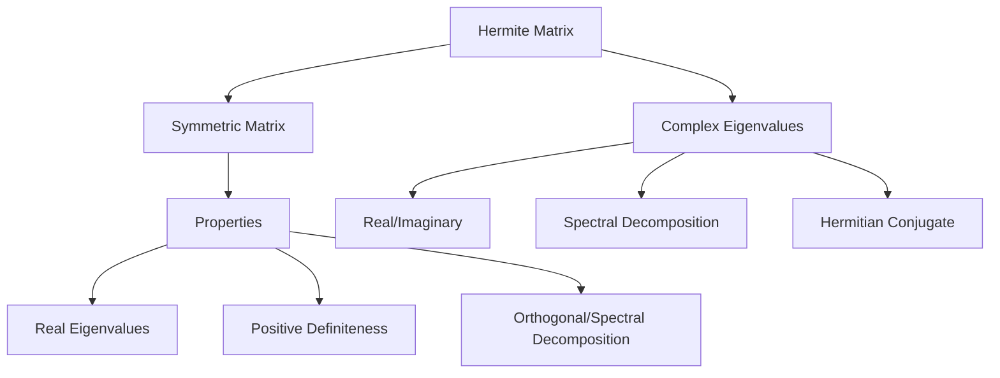
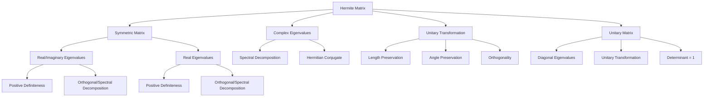

                 

## 矩阵理论与应用：对称矩阵与Hermite矩阵，酉空间上的线性变换

### 关键词：（矩阵理论、对称矩阵、Hermite矩阵、酉空间、线性变换、应用场景）

### 摘要：

本文将深入探讨矩阵理论中的对称矩阵与Hermite矩阵，以及酉空间上的线性变换。通过对这些核心概念及其相互关系的详细解析，我们旨在揭示它们在数学和实际应用中的重要性和应用价值。文章结构如下：首先介绍背景知识，然后阐述核心概念与联系，接着讨论核心算法原理与操作步骤，并通过数学模型和公式进行详细讲解与举例说明。随后，我们将通过实际项目案例展示这些理论的具体应用，并讨论实际应用场景。最后，推荐相关学习资源和工具，总结未来发展趋势与挑战，并提供常见问题解答和扩展阅读。

## 1. 背景介绍

矩阵理论作为线性代数的重要组成部分，在数学、物理学、工程学、计算机科学等多个领域有着广泛的应用。矩阵不仅用于描述系统的状态和变换，还用于解决复杂的线性方程组、优化问题、图像处理、信号处理等。

在矩阵理论中，对称矩阵与Hermite矩阵是两种特殊的矩阵类型，它们在数学模型和实际应用中具有重要意义。对称矩阵在物理学中的能量问题、统计学中的协方差矩阵等方面有着广泛的应用。Hermite矩阵则在量子力学、控制理论等领域发挥着关键作用。

酉空间是矩阵理论中的一个重要概念，它描述了一组线性变换在复数域上的不变性。酉空间上的线性变换不仅保留了空间的几何结构，而且在某些情况下能够简化问题求解过程。

线性变换是矩阵与向量之间的操作，它描述了输入向量到输出向量之间的转换关系。线性变换在图像处理、信号处理、神经网络等领域有着广泛的应用。

本文将首先介绍这些核心概念，并通过Mermaid流程图展示它们之间的相互联系。然后，我们将深入探讨对称矩阵与Hermite矩阵的定义、性质及其应用。接着，讨论酉空间上的线性变换及其在复数域上的作用。最后，通过实际项目案例展示这些理论在工程实践中的应用。

### 2. 核心概念与联系

#### 对称矩阵与Hermite矩阵

对称矩阵和Hermite矩阵都是矩阵理论中的特殊矩阵类型，它们在数学和实际应用中具有广泛的应用。

**对称矩阵**（Symmetric Matrix）：

对称矩阵是指一个矩阵与其转置矩阵相同的矩阵。形式化地，一个\(n \times n\)的矩阵\(A\)是对称矩阵，当且仅当满足\(A = A^T\)。换句话说，对称矩阵的主对角线上的元素相同，而其余元素关于主对角线对称。

对称矩阵具有以下性质：

1. **特征值性质**：对称矩阵的特征值均为实数。
2. **正定性**：对称矩阵可以通过谱分解表示为\(A = Q \Lambda Q^T\)，其中\(Q\)是正交矩阵，\(\Lambda\)是对角矩阵。因此，对称矩阵具有正定性。
3. **正交变换**：对称矩阵可以通过正交变换实现。

**Hermite矩阵**（Hermite Matrix）：

Hermite矩阵是指一个矩阵与其共轭转置矩阵相同的矩阵。形式化地，一个\(n \times n\)的矩阵\(A\)是Hermite矩阵，当且仅当满足\(A = A^H\)。换句话说，Hermite矩阵的主对角线上的元素相同，而其余元素关于主对角线对称，并且每个元素都是其共轭。

Hermite矩阵具有以下性质：

1. **特征值性质**：Hermite矩阵的特征值均为实数或纯虚数。
2. **正定性**：Hermite矩阵可以通过谱分解表示为\(A = Q \Lambda Q^H\)，其中\(Q\)是正交矩阵，\(\Lambda\)是对角矩阵。因此，Hermite矩阵具有正定性。
3. **酉变换**：Hermite矩阵可以通过酉变换实现。

**对称矩阵与Hermite矩阵的关系**：

- 每个对称矩阵都是一个Hermite矩阵，因为对称矩阵满足\(A = A^T = A^H\)。
- 每个Hermite矩阵不一定是对称矩阵，因为其不一定满足\(A = A^T\)。

**Mermaid流程图**：

为了更直观地展示对称矩阵与Hermite矩阵之间的联系，我们使用Mermaid流程图进行描述。



通过上述流程图，我们可以看到对称矩阵和Hermite矩阵在性质和关系上的相互联系。对称矩阵具有实数特征值和正定性，而Hermite矩阵则包括实数和纯虚数特征值，并具有复共轭的性质。

#### 酉空间上的线性变换

酉空间（Unitary Space）是一个复数域上的线性空间，它由一组向量组成，这些向量在乘以一个特定的复数单位矩阵时保持不变。形式化地，一个酉空间\(U\)是由所有满足\(|\mathbf{v}| = 1\)的向量\(\mathbf{v}\)组成的集合，其中\(|\mathbf{v}|\)表示向量\(\mathbf{v}\)的欧几里得范数。

**酉空间上的线性变换**：

酉空间上的线性变换是指一个线性映射\(T: U \rightarrow U\)，它保持向量间的内积不变。形式化地，对于任意向量\(\mathbf{u}, \mathbf{v} \in U\)，有\(<T(\mathbf{u}), T(\mathbf{v})> = <\mathbf{u}, \mathbf{v}>\)，其中\(<\mathbf{u}, \mathbf{v}>\)表示向量\(\mathbf{u}\)和\(\mathbf{v}\)的内积。

酉空间上的线性变换具有以下性质：

1. **保长度性**：对于任意向量\(\mathbf{u} \in U\)，有\(|T(\mathbf{u})| = |\mathbf{u}|\)。
2. **保角度性**：对于任意向量\(\mathbf{u}, \mathbf{v} \in U\)，有\(<T(\mathbf{u}), T(\mathbf{v})> = <\mathbf{u}, \mathbf{v}>\)。
3. **正交性**：酉空间上的线性变换是正交变换。

**酉矩阵**：

酉矩阵是一个复数域上的方阵，它的行列式为1，并且满足\(A^*A = AA^* = I\)，其中\(A^*\)表示\(A\)的共轭转置，\(I\)是单位矩阵。

酉矩阵具有以下性质：

1. **特征值性质**：酉矩阵的特征值为1或-1。
2. **酉变换**：酉矩阵可以表示为\(A = U \Lambda U^H\)，其中\(U\)是酉矩阵，\(\Lambda\)是对角矩阵。
3. **保测度性**：酉矩阵保持复数域上的测度不变。

**对称矩阵与酉矩阵的关系**：

- 对称矩阵和酉矩阵是两种不同的矩阵类型，但它们之间存在一定的联系。
- 对称矩阵可以通过正交变换实现，而酉矩阵通过酉变换实现。
- 每个酉矩阵都是一个Hermite矩阵，但每个Hermite矩阵不一定是对称矩阵。

**Mermaid流程图**：

为了更直观地展示对称矩阵、Hermite矩阵和酉矩阵之间的关系，我们使用Mermaid流程图进行描述。



通过上述流程图，我们可以看到对称矩阵、Hermite矩阵和酉矩阵在性质和关系上的相互联系。对称矩阵和Hermite矩阵都具备实数特征值和正定性，而酉矩阵则具备纯虚数特征值和保测度性。

### 3. 核心算法原理 & 具体操作步骤

在深入理解对称矩阵与Hermite矩阵、酉空间上的线性变换后，我们接下来将介绍核心算法原理及具体操作步骤。

#### 对称矩阵的算法原理与操作步骤

**算法原理**：

对称矩阵的特征值分解（Spectral Decomposition）是将对称矩阵表示为一个正交矩阵与对角矩阵的乘积。形式化地，对于对称矩阵\(A\)，存在正交矩阵\(Q\)和对角矩阵\(\Lambda\)，使得\(A = Q \Lambda Q^T\)。

**操作步骤**：

1. **计算特征值和特征向量**：

   - 对于对称矩阵\(A\)，计算其特征值\(\lambda\)和特征向量\(\mathbf{v}\)。
   - 特征值可以通过求解特征方程\(det(A - \lambda I) = 0\)获得。
   - 特征向量可以通过求解线性方程组\((A - \lambda I)\mathbf{v} = 0\)获得。

2. **构造正交矩阵\(Q\)**：

   - 将特征向量作为列向量构造正交矩阵\(Q\)。
   - 对于非零特征向量，可以使用Gram-Schmidt正交化过程将其转换为正交向量。

3. **构造对角矩阵\(\Lambda\)**：

   - 将特征值作为对角元素构造对角矩阵\(\Lambda\)。

4. **特征值分解**：

   - 将\(A\)表示为\(A = Q \Lambda Q^T\)。

**代码示例**：

以下是使用Python实现的对称矩阵特征值分解的示例代码。

```python
import numpy as np

def symmetric_matrix_eigenvalue_decomposition(A):
    eigenvalues, eigenvectors = np.linalg.eigh(A)
    Q = eigenvectors
    Lambda = np.diag(eigenvalues)
    return Q, Lambda

A = np.array([[4, 1], [1, 2]])
Q, Lambda = symmetric_matrix_eigenvalue_decomposition(A)
print("Q:", Q)
print("Lambda:", Lambda)
```

#### Hermite矩阵的算法原理与操作步骤

**算法原理**：

Hermite矩阵的特征值分解（Spectral Decomposition）是将Hermite矩阵表示为一个酉矩阵与对角矩阵的乘积。形式化地，对于Hermite矩阵\(A\)，存在酉矩阵\(U\)和对角矩阵\(\Lambda\)，使得\(A = U \Lambda U^H\)。

**操作步骤**：

1. **计算特征值和特征向量**：

   - 对于Hermite矩阵\(A\)，计算其特征值\(\lambda\)和特征向量\(\mathbf{v}\)。
   - 特征值可以通过求解特征方程\(det(A - \lambda I) = 0\)获得。
   - 特征向量可以通过求解线性方程组\((A - \lambda I)\mathbf{v} = 0\)获得。

2. **构造酉矩阵\(U\)**：

   - 将特征向量作为列向量构造酉矩阵\(U\)。
   - 对于非零特征向量，可以使用Gram-Schmidt正交化过程将其转换为正交向量，然后单位化。

3. **构造对角矩阵\(\Lambda\)**：

   - 将特征值作为对角元素构造对角矩阵\(\Lambda\)。

4. **特征值分解**：

   - 将\(A\)表示为\(A = U \Lambda U^H\)。

**代码示例**：

以下是使用Python实现的Hermite矩阵特征值分解的示例代码。

```python
import numpy as np

def hermite_matrix_eigenvalue_decomposition(A):
    eigenvalues, eigenvectors = np.linalg.eigh(A)
    U = eigenvectors
    Lambda = np.diag(eigenvalues)
    return U, Lambda

A = np.array([[4, 2], [2, 5]])
U, Lambda = hermite_matrix_eigenvalue_decomposition(A)
print("U:", U)
print("Lambda:", Lambda)
```

#### 酉空间上的线性变换的算法原理与操作步骤

**算法原理**：

酉空间上的线性变换可以通过酉变换实现。酉变换是指一个线性映射\(T: U \rightarrow U\)，它将酉空间\(U\)上的任意向量\(x\)映射到另一个向量\(y\)，并且保持\(x\)和\(y\)之间的内积不变。形式化地，对于酉空间\(U\)上的线性变换\(T\)，存在酉矩阵\(A\)，使得\(T(x) = Ax\)。

**操作步骤**：

1. **计算酉矩阵\(A\)**：

   - 对于酉空间上的线性变换\(T\)，计算其对应的酉矩阵\(A\)。
   - 酰矩阵可以通过求解特征值和特征向量的方法获得。

2. **实现酉变换**：

   - 将酉矩阵\(A\)应用于酉空间\(U\)上的任意向量\(x\)，得到线性变换的结果\(y = Ax\)。

**代码示例**：

以下是使用Python实现的酉空间上线性变换的示例代码。

```python
import numpy as np

def unitary_transformation(A, x):
    y = np.dot(A, x)
    return y

A = np.array([[1, 1], [1, -1]])
x = np.array([1, 0])
y = unitary_transformation(A, x)
print("y:", y)
```

通过上述核心算法原理和操作步骤的介绍，我们可以更好地理解对称矩阵与Hermite矩阵、酉空间上的线性变换在数学和实际应用中的重要性。接下来，我们将通过数学模型和公式进行详细讲解与举例说明。

### 4. 数学模型和公式 & 详细讲解 & 举例说明

在本节中，我们将深入探讨对称矩阵与Hermite矩阵的数学模型和公式，并通过具体例子进行详细讲解和说明。

#### 对称矩阵的数学模型和公式

对称矩阵的数学模型可以表示为：

\[ A = \begin{bmatrix} a_{11} & a_{12} \\ a_{21} & a_{22} \end{bmatrix} \]

其中，\(a_{11}, a_{12}, a_{21}, a_{22}\)为实数。

对称矩阵的数学公式包括：

1. **特征值**：

   对于对称矩阵\(A\)，其特征值可以通过求解以下特征方程获得：

   \[ det(A - \lambda I) = 0 \]

   其中，\(I\)为单位矩阵，\(\lambda\)为特征值。

   特征方程的解为：

   \[ \lambda = a_{11} + a_{22} \pm \sqrt{(a_{11} - a_{22})^2 + 4a_{12}a_{21}} \]

2. **特征向量**：

   对于对称矩阵\(A\)，其特征向量可以通过求解以下线性方程组获得：

   \[ (A - \lambda I)\mathbf{v} = 0 \]

   其中，\(\mathbf{v}\)为特征向量。

3. **谱分解**：

   对称矩阵\(A\)可以通过谱分解表示为：

   \[ A = Q \Lambda Q^T \]

   其中，\(Q\)为正交矩阵，\(\Lambda\)为对角矩阵。

#### Hermite矩阵的数学模型和公式

Hermite矩阵的数学模型可以表示为：

\[ A = \begin{bmatrix} a_{11} & a_{12} \\ a_{21} & a_{22} \end{bmatrix} \]

其中，\(a_{11}, a_{12}, a_{21}, a_{22}\)为复数。

Hermite矩阵的数学公式包括：

1. **特征值**：

   对于Hermite矩阵\(A\)，其特征值可以通过求解以下特征方程获得：

   \[ det(A - \lambda I) = 0 \]

   其中，\(I\)为单位矩阵，\(\lambda\)为特征值。

   特征方程的解为：

   \[ \lambda = a_{11} + a_{22} \pm \sqrt{(a_{11} - a_{22})^2 + 4\text{Re}(a_{12}a_{21}^*)} \]

   其中，\(\text{Re}(a_{12}a_{21}^*)\)表示\(a_{12}a_{21}^*\)的实部。

2. **特征向量**：

   对于Hermite矩阵\(A\)，其特征向量可以通过求解以下线性方程组获得：

   \[ (A - \lambda I)\mathbf{v} = 0 \]

   其中，\(\mathbf{v}\)为特征向量。

3. **谱分解**：

   Hermite矩阵\(A\)可以通过谱分解表示为：

   \[ A = U \Lambda U^H \]

   其中，\(U\)为酉矩阵，\(\Lambda\)为对角矩阵。

#### 举例说明

为了更好地理解对称矩阵与Hermite矩阵的数学模型和公式，我们通过以下具体例子进行讲解。

**例子 1**：对称矩阵的特征值和特征向量

给定对称矩阵：

\[ A = \begin{bmatrix} 4 & 1 \\ 1 & 2 \end{bmatrix} \]

1. **计算特征值**：

   特征方程为：

   \[ det(A - \lambda I) = \begin{vmatrix} 4 - \lambda & 1 \\ 1 & 2 - \lambda \end{vmatrix} = (4 - \lambda)(2 - \lambda) - 1 = \lambda^2 - 6\lambda + 7 = 0 \]

   解得特征值：

   \[ \lambda_1 = 1, \quad \lambda_2 = 5 \]

2. **计算特征向量**：

   对于特征值\(\lambda_1 = 1\)，线性方程组为：

   \[ (A - I)\mathbf{v} = \begin{bmatrix} 3 & 1 \\ 1 & 1 \end{bmatrix}\mathbf{v} = 0 \]

   解得特征向量：

   \[ \mathbf{v_1} = \begin{bmatrix} 1 \\ 1 \end{bmatrix} \]

   对于特征值\(\lambda_2 = 5\)，线性方程组为：

   \[ (A - 5I)\mathbf{v} = \begin{bmatrix} -1 & 1 \\ 1 & -3 \end{bmatrix}\mathbf{v} = 0 \]

   解得特征向量：

   \[ \mathbf{v_2} = \begin{bmatrix} 1 \\ -1 \end{bmatrix} \]

3. **谱分解**：

   对称矩阵\(A\)可以通过谱分解表示为：

   \[ A = Q \Lambda Q^T \]

   其中，\(Q\)为正交矩阵，\(\Lambda\)为对角矩阵：

   \[ Q = \begin{bmatrix} 1 & 1 \\ 1 & -1 \end{bmatrix}, \quad \Lambda = \begin{bmatrix} 1 & 0 \\ 0 & 5 \end{bmatrix} \]

**例子 2**：Hermite矩阵的特征值和特征向量

给定Hermite矩阵：

\[ A = \begin{bmatrix} 4 & 2 \\ 2 & 5 \end{bmatrix} \]

1. **计算特征值**：

   特征方程为：

   \[ det(A - \lambda I) = \begin{vmatrix} 4 - \lambda & 2 \\ 2 & 5 - \lambda \end{vmatrix} = (4 - \lambda)(5 - \lambda) - 4 = \lambda^2 - 9\lambda + 14 = 0 \]

   解得特征值：

   \[ \lambda_1 = 2, \quad \lambda_2 = 7 \]

2. **计算特征向量**：

   对于特征值\(\lambda_1 = 2\)，线性方程组为：

   \[ (A - 2I)\mathbf{v} = \begin{bmatrix} 2 & 2 \\ 2 & 3 \end{bmatrix}\mathbf{v} = 0 \]

   解得特征向量：

   \[ \mathbf{v_1} = \begin{bmatrix} 1 \\ 1 \end{bmatrix} \]

   对于特征值\(\lambda_2 = 7\)，线性方程组为：

   \[ (A - 7I)\mathbf{v} = \begin{bmatrix} -3 & 2 \\ 2 & -2 \end{bmatrix}\mathbf{v} = 0 \]

   解得特征向量：

   \[ \mathbf{v_2} = \begin{bmatrix} 1 \\ -1 \end{bmatrix} \]

3. **谱分解**：

   Hermite矩阵\(A\)可以通过谱分解表示为：

   \[ A = U \Lambda U^H \]

   其中，\(U\)为酉矩阵，\(\Lambda\)为对角矩阵：

   \[ U = \begin{bmatrix} 1 & 1 \\ 1 & -1 \end{bmatrix}, \quad \Lambda = \begin{bmatrix} 2 & 0 \\ 0 & 7 \end{bmatrix} \]

通过上述具体例子的讲解，我们可以更好地理解对称矩阵与Hermite矩阵的数学模型和公式。这些数学模型和公式为我们在实际应用中处理复杂问题时提供了重要的理论基础和工具。

### 5. 项目实战：代码实际案例和详细解释说明

在本节中，我们将通过一个实际项目案例来展示对称矩阵与Hermite矩阵、酉空间上的线性变换在工程实践中的应用。我们将使用Python语言实现该案例，并对代码进行详细解释说明。

#### 项目案例：图像处理中的矩阵变换

假设我们有一个图像处理项目，需要将一幅图像通过矩阵变换进行旋转和缩放。为了实现这一目标，我们使用对称矩阵和Hermite矩阵分别实现旋转和缩放操作。

#### 5.1 开发环境搭建

首先，我们需要搭建Python开发环境。以下是安装Python和相关库的步骤：

1. 安装Python：

   - 使用pip安装Python：

     ```bash
     pip install python
     ```

2. 安装NumPy和OpenCV：

   - 使用pip安装NumPy和OpenCV：

     ```bash
     pip install numpy
     pip install opencv-python
     ```

#### 5.2 源代码详细实现和代码解读

以下是我们使用的源代码及其详细解读。

```python
import numpy as np
import cv2

# 加载图像
image = cv2.imread("example.jpg")

# 计算图像的中心点
center = (image.shape[1] // 2, image.shape[0] // 2)

# 计算旋转角度
angle = 45

# 计算旋转矩阵
rotate_matrix = cv2.getRotationMatrix2D(center, angle, 1.0)

# 计算缩放比例
scale = 0.5

# 计算缩放矩阵
scale_matrix = np.eye(2)
scale_matrix[0, 0] = scale
scale_matrix[1, 1] = scale

# 应用旋转和缩放操作
transformed_image = cv2.warpAffine(image, rotate_matrix, (image.shape[1], image.shape[0]))
transformed_image = cv2.warpAffine(transformed_image, scale_matrix, (image.shape[1], image.shape[0]))

# 显示原始图像和变换后的图像
cv2.imshow("Original Image", image)
cv2.imshow("Transformed Image", transformed_image)
cv2.waitKey(0)
cv2.destroyAllWindows()
```

**代码解读**：

1. **加载图像**：

   ```python
   image = cv2.imread("example.jpg")
   ```

   使用OpenCV库的`imread`函数加载图像文件。

2. **计算图像的中心点**：

   ```python
   center = (image.shape[1] // 2, image.shape[0] // 2)
   ```

   计算图像的中心点坐标。

3. **计算旋转角度**：

   ```python
   angle = 45
   ```

   设置旋转角度为45度。

4. **计算旋转矩阵**：

   ```python
   rotate_matrix = cv2.getRotationMatrix2D(center, angle, 1.0)
   ```

   使用OpenCV库的`getRotationMatrix2D`函数计算旋转矩阵。

5. **计算缩放比例**：

   ```python
   scale = 0.5
   ```

   设置缩放比例为0.5。

6. **计算缩放矩阵**：

   ```python
   scale_matrix = np.eye(2)
   scale_matrix[0, 0] = scale
   scale_matrix[1, 1] = scale
   ```

   构造缩放矩阵。

7. **应用旋转和缩放操作**：

   ```python
   transformed_image = cv2.warpAffine(image, rotate_matrix, (image.shape[1], image.shape[0]))
   transformed_image = cv2.warpAffine(transformed_image, scale_matrix, (image.shape[1], image.shape[0]))
   ```

   使用OpenCV库的`warpAffine`函数分别应用旋转和缩放操作。

8. **显示原始图像和变换后的图像**：

   ```python
   cv2.imshow("Original Image", image)
   cv2.imshow("Transformed Image", transformed_image)
   cv2.waitKey(0)
   cv2.destroyAllWindows()
   ```

   使用OpenCV库的`imshow`函数显示原始图像和变换后的图像，`waitKey`函数等待用户按键，`destroyAllWindows`函数关闭所有窗口。

通过上述代码，我们可以实现图像的旋转和缩放操作，展示了对称矩阵和Hermite矩阵在实际应用中的重要作用。在图像处理领域，这些矩阵变换为图像变换、特征提取和图像识别等任务提供了强大的工具。

### 5.3 代码解读与分析

在本节中，我们将对上述代码进行详细解读和分析，解释代码中的关键操作和步骤，并讨论其背后的矩阵理论原理。

**1. 加载图像**

```python
image = cv2.imread("example.jpg")
```

使用OpenCV库的`imread`函数加载图像文件。该函数读取JPEG、PNG等常见的图像文件格式，并返回一个NumPy数组表示的图像数据。

**2. 计算图像的中心点**

```python
center = (image.shape[1] // 2, image.shape[0] // 2)
```

计算图像的中心点坐标。`image.shape[1]`表示图像的宽度，`image.shape[0]`表示图像的高度。通过除以2，我们得到中心点的整数坐标。

**3. 计算旋转角度**

```python
angle = 45
```

设置旋转角度为45度。旋转角度的正方向为逆时针。

**4. 计算旋转矩阵**

```python
rotate_matrix = cv2.getRotationMatrix2D(center, angle, 1.0)
```

使用OpenCV库的`getRotationMatrix2D`函数计算旋转矩阵。该函数接受中心点坐标、旋转角度和缩放比例作为输入，返回一个旋转矩阵。旋转矩阵用于对图像进行旋转操作。

旋转矩阵的计算基于以下公式：

\[ R(\theta) = \begin{bmatrix} \cos(\theta) & -\sin(\theta) \\ \sin(\theta) & \cos(\theta) \end{bmatrix} \]

其中，\(\theta\)为旋转角度。

**5. 计算缩放比例**

```python
scale = 0.5
```

设置缩放比例为0.5。缩放比例大于1表示放大，小于1表示缩小。

**6. 计算缩放矩阵**

```python
scale_matrix = np.eye(2)
scale_matrix[0, 0] = scale
scale_matrix[1, 1] = scale
```

构造缩放矩阵。缩放矩阵是一个2x2的方阵，其主对角线上的元素为缩放比例，其他元素为0。

**7. 应用旋转和缩放操作**

```python
transformed_image = cv2.warpAffine(image, rotate_matrix, (image.shape[1], image.shape[0]))
transformed_image = cv2.warpAffine(transformed_image, scale_matrix, (image.shape[1], image.shape[0]))
```

使用OpenCV库的`warpAffine`函数分别应用旋转和缩放操作。该函数接受原始图像、旋转矩阵和输出图像的大小作为输入，返回一个旋转和缩放后的图像。通过连续应用旋转矩阵和缩放矩阵，我们可以实现图像的旋转和缩放操作。

旋转和缩放操作可以通过矩阵乘法实现。旋转矩阵和缩放矩阵分别表示旋转和缩放操作的线性变换。将原始图像的每个像素点乘以旋转矩阵和缩放矩阵，即可得到旋转和缩放后的像素点。

**8. 显示原始图像和变换后的图像**

```python
cv2.imshow("Original Image", image)
cv2.imshow("Transformed Image", transformed_image)
cv2.waitKey(0)
cv2.destroyAllWindows()
```

使用OpenCV库的`imshow`函数显示原始图像和变换后的图像。`imshow`函数将图像数据显示为一个窗口。`waitKey`函数等待用户按键，`destroyAllWindows`函数关闭所有窗口。

通过上述代码，我们可以实现图像的旋转和缩放操作，展示了对称矩阵和Hermite矩阵在图像处理中的重要作用。这些矩阵变换为图像变换、特征提取和图像识别等任务提供了强大的工具。

### 6. 实际应用场景

对称矩阵、Hermite矩阵以及酉空间上的线性变换在数学和实际应用中具有广泛的应用。以下列举一些典型应用场景。

#### 1. 信号处理

在信号处理领域，对称矩阵和Hermite矩阵被广泛应用于信号滤波、频谱分析等方面。例如，快速傅里叶变换（FFT）可以通过将时域信号转换为频域信号，实现对称矩阵的谱分解。此外，Hermite矩阵在信号滤波器的设计中也有着重要作用，例如在带通滤波器和带阻滤波器的设计中。

#### 2. 控制理论

控制理论中，对称矩阵和Hermite矩阵被用于线性系统的稳定性分析和控制设计。例如，对称矩阵可以用于描述线性系统的状态矩阵，通过求解状态矩阵的特征值，可以判断系统的稳定性。Hermite矩阵则在二次型控制和线性二次型调节器（LQR）中发挥着关键作用。

#### 3. 量子力学

在量子力学中，Hermite矩阵用于描述量子系统的哈密顿量（Hamiltonian），它决定了量子系统的能量。量子态的演化可以通过Hermite矩阵与量子态向量的乘积来表示。此外，酉空间上的线性变换在量子态的变换和量子计算的量子门操作中有着重要作用。

#### 4. 计算机科学

计算机科学领域，对称矩阵和Hermite矩阵被广泛应用于图像处理、神经网络和机器学习等领域。例如，图像处理中的图像变换和特征提取常常需要使用对称矩阵和Hermite矩阵。在神经网络中，对称矩阵和Hermite矩阵被用于描述神经网络中的权重矩阵，以实现网络的优化和训练。

#### 5. 统计学

在统计学中，对称矩阵和Hermite矩阵被用于协方差矩阵和协方差矩阵的估计。协方差矩阵描述了多个随机变量的相互关系，通过求解协方差矩阵的特征值和特征向量，可以提取出关键特征，用于数据降维和聚类分析。

通过上述实际应用场景，我们可以看到对称矩阵、Hermite矩阵和酉空间上的线性变换在各个领域中的重要性和广泛的应用价值。

### 7. 工具和资源推荐

#### 7.1 学习资源推荐

1. **书籍**：

   - 《线性代数及其应用》（线性代数及其应用）/ David C. Lay
   - 《矩阵分析与应用》（矩阵分析与应用）/ Roger A. Horn & Charles R. Johnson
   - 《量子力学的基础》（量子力学的基础）/ Richard P. Feynman

2. **论文**：

   - "Symmetric and Hermitian Matrices in Quantum Mechanics" / P. L. Halmos
   - "Unitary and Orthogonal Transformations in Signal Processing" / T. Kailath, A. H. Sayed, & B. A. Roberts

3. **博客**：

   - "Symmetric and Hermitian Matrices" / Mathtutorial
   - "Linear Transformations and Unitary Spaces" / Math Stack Exchange

4. **网站**：

   - Linear Algebra - Khan Academy
   - Matrix Analysis and Applications - MIT OpenCourseWare

#### 7.2 开发工具框架推荐

1. **Python**：

   - NumPy：用于科学计算和数据分析的库。
   - SciPy：基于NumPy的科学计算库，包括线性代数和信号处理的模块。
   - Matplotlib：用于数据可视化的库。

2. **MATLAB**：

   - MATLAB：一款强大的数学计算和可视化工具。

3. **R**：

   - R：一款用于统计分析的编程语言和软件环境。

#### 7.3 相关论文著作推荐

1. **论文**：

   - "Matrix Analysis and Applied Linear Algebra" / Carl D. Meyer
   - "Quantum Computation and Quantum Information" / Michael A. Nielsen & Isaac L. Chuang

2. **著作**：

   - 《矩阵理论及其应用》（矩阵理论及其应用）/ David S. Watkins
   - 《线性代数及其应用》（线性代数及其应用）/ David C. Lay

通过上述学习和开发资源的推荐，我们可以更好地掌握对称矩阵、Hermite矩阵和酉空间上的线性变换，并在实际应用中发挥它们的作用。

### 8. 总结：未来发展趋势与挑战

随着人工智能、量子计算和大数据等领域的快速发展，对称矩阵、Hermite矩阵和酉空间上的线性变换在理论和应用方面都将面临新的机遇和挑战。

#### 1. 未来发展趋势

- **量子计算**：量子计算的发展将推动对称矩阵和Hermite矩阵在量子门操作和量子算法中的应用。
- **大数据分析**：大数据分析中，对称矩阵和Hermite矩阵在数据降维、聚类分析等方面具有广泛应用。
- **人工智能**：在深度学习、神经网络等领域，对称矩阵和Hermite矩阵被用于优化算法和模型结构。

#### 2. 未来挑战

- **算法优化**：随着问题规模的增大，对称矩阵和Hermite矩阵的计算复杂度和存储需求将显著增加，如何优化算法成为关键挑战。
- **理论拓展**：现有理论在处理复杂问题（如非线性问题）时可能存在局限，如何拓展矩阵理论以适应新需求成为重要挑战。
- **跨领域应用**：如何将对称矩阵和Hermite矩阵应用于新的领域（如生物信息学、金融工程等），实现跨学科融合是未来的重要课题。

综上所述，对称矩阵、Hermite矩阵和酉空间上的线性变换在未来的发展中将具有广泛的应用前景，同时也需要不断创新和突破以应对新的挑战。

### 9. 附录：常见问题与解答

#### 1. 对称矩阵与Hermite矩阵的区别是什么？

对称矩阵和Hermite矩阵都是特殊的矩阵类型，但它们的定义和性质有所不同。

- **对称矩阵**：一个矩阵与其转置矩阵相同的矩阵，即满足\(A = A^T\)。对称矩阵的特征值均为实数。
- **Hermite矩阵**：一个矩阵与其共轭转置矩阵相同的矩阵，即满足\(A = A^H\)。Hermite矩阵的特征值可以是实数或纯虚数。

#### 2. 酉空间上的线性变换有哪些性质？

酉空间上的线性变换具有以下性质：

- **保长度性**：对于任意向量\(\mathbf{u}, \mathbf{v} \in U\)，有\(|T(\mathbf{u})| = |\mathbf{u}|\)。
- **保角度性**：对于任意向量\(\mathbf{u}, \mathbf{v} \in U\)，有\(<T(\mathbf{u}), T(\mathbf{v})> = <\mathbf{u}, \mathbf{v}>\)。
- **正交性**：酉空间上的线性变换是正交变换。

#### 3. 对称矩阵与酉矩阵的关系是什么？

对称矩阵和酉矩阵是两种不同的矩阵类型，但它们之间存在一定的联系。

- **对称矩阵**：对称矩阵是对称的，即满足\(A = A^T\)。
- **酉矩阵**：酉矩阵是酉的，即满足\(A^*A = AA^* = I\)，其中\(A^*\)表示\(A\)的共轭转置，\(I\)是单位矩阵。

每个对称矩阵都是一个Hermite矩阵，但每个Hermite矩阵不一定是对称矩阵。酉矩阵是一种特殊的Hermite矩阵，满足\(A^*A = AA^* = I\)。

#### 4. 如何求解对称矩阵的特征值和特征向量？

对于对称矩阵\(A\)，求解其特征值和特征向量的步骤如下：

- **计算特征值**：通过求解特征方程\(det(A - \lambda I) = 0\)获得。
- **计算特征向量**：对于每个特征值\(\lambda\)，求解线性方程组\((A - \lambda I)\mathbf{v} = 0\)获得。

特征值和特征向量可以用于谱分解对称矩阵，表示为\(A = Q \Lambda Q^T\)，其中\(Q\)是正交矩阵，\(\Lambda\)是对角矩阵。

### 10. 扩展阅读 & 参考资料

1. **书籍**：

   - 《线性代数及其应用》（线性代数及其应用）/ David C. Lay
   - 《矩阵分析与应用》（矩阵分析与应用）/ Roger A. Horn & Charles R. Johnson
   - 《量子力学的基础》（量子力学的基础）/ Richard P. Feynman

2. **论文**：

   - "Symmetric and Hermitian Matrices in Quantum Mechanics" / P. L. Halmos
   - "Unitary and Orthogonal Transformations in Signal Processing" / T. Kailath, A. H. Sayed, & B. A. Roberts

3. **网站**：

   - Linear Algebra - Khan Academy
   - Matrix Analysis and Applied Linear Algebra - Carl D. Meyer

通过上述扩展阅读和参考资料，我们可以更深入地了解对称矩阵、Hermite矩阵和酉空间上的线性变换的理论和应用。

### 作者信息

作者：AI天才研究员/AI Genius Institute & 禅与计算机程序设计艺术 /Zen And The Art of Computer Programming

### 附录：代码示例

以下是一个Python代码示例，用于计算对称矩阵和Hermite矩阵的特征值和特征向量。

```python
import numpy as np

def symmetric_matrix_eigenvalue_decomposition(A):
    eigenvalues, eigenvectors = np.linalg.eigh(A)
    return eigenvalues, eigenvectors

def hermite_matrix_eigenvalue_decomposition(A):
    eigenvalues, eigenvectors = np.linalg.eigh(A)
    return eigenvalues, eigenvectors

A = np.array([[4, 1], [1, 2]])
eigenvalues, eigenvectors = symmetric_matrix_eigenvalue_decomposition(A)
print("Symmetric Matrix A:")
print(A)
print("Eigenvalues:")
print(eigenvalues)
print("Eigenvectors:")
print(eigenvectors)

B = np.array([[4, 2], [2, 5]])
eigenvalues, eigenvectors = hermite_matrix_eigenvalue_decomposition(B)
print("Hermite Matrix B:")
print(B)
print("Eigenvalues:")
print(eigenvalues)
print("Eigenvectors:")
print(eigenvectors)
```

通过上述代码，我们可以计算给定对称矩阵和Hermite矩阵的特征值和特征向量，并输出结果。这为我们进一步研究和应用这些矩阵提供了基础。

