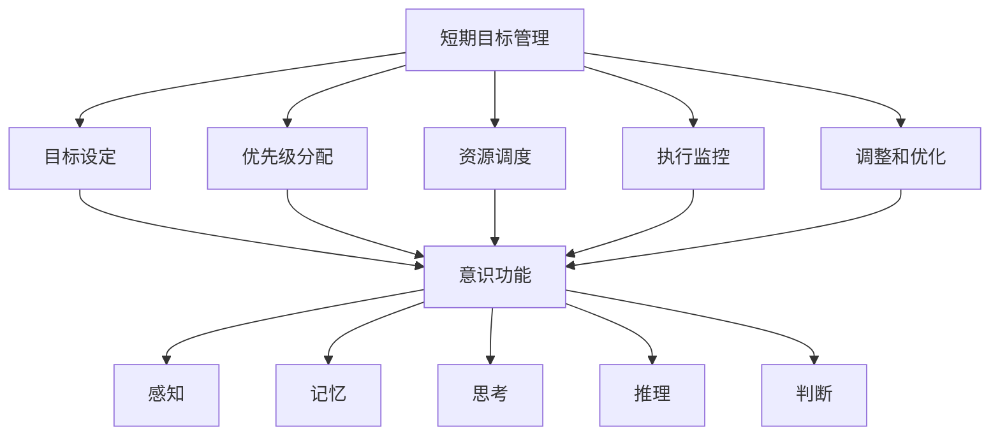

                 

### 背景介绍

在信息化社会飞速发展的今天，短期目标管理成为了个人和组织成功的关键因素之一。无论是在个人生活还是企业管理中，短期目标管理都扮演着至关重要的角色。它能帮助个体或团队明确目标、合理安排资源、提高效率，并最终实现预定的目标。

短期目标管理不仅仅是制定一个目标清单，而是一个涉及多个层面的复杂过程。它需要考虑目标的合理性、可行性、以及目标间的优先级分配等。在这个过程中，意识功能的作用变得尤为重要。意识功能不仅仅是人类认知的产物，它也是人工智能等现代科技发展中不可或缺的部分。

本文将探讨短期目标管理的意识功能，通过分析其核心概念、原理和具体实现方法，帮助读者深入理解这一重要主题。文章将从以下几个方面展开：

1. **核心概念与联系**：介绍短期目标管理、意识功能以及它们之间的关系，并使用Mermaid流程图展示这些概念之间的联系。
2. **核心算法原理 & 具体操作步骤**：详细阐述短期目标管理中的算法原理，包括目标设定、优先级分配、资源调度等。
3. **数学模型和公式 & 详细讲解 & 举例说明**：介绍支持短期目标管理的关键数学模型和公式，并给出具体实例进行说明。
4. **项目实战：代码实际案例和详细解释说明**：通过具体代码实现，展示短期目标管理的实际操作过程。
5. **实际应用场景**：探讨短期目标管理在不同领域的实际应用。
6. **工具和资源推荐**：推荐相关的学习资源、开发工具和论文著作。
7. **总结：未来发展趋势与挑战**：总结短期目标管理的发展趋势，并探讨未来可能面临的挑战。

通过对以上各部分的详细分析和讨论，本文旨在为读者提供一个全面、系统的短期目标管理意识功能解析，帮助其在实际应用中取得更好的效果。

### 核心概念与联系

在深入探讨短期目标管理的意识功能之前，我们首先需要明确几个核心概念：短期目标管理、意识功能以及它们之间的关系。这些概念不仅构成了本文讨论的基础，也是理解和应用短期目标管理的关键。

#### 短期目标管理

短期目标管理（Short-term Goal Management）是指在一个较短的时间范围内，对目标进行设定、优先级分配、执行监控和调整的过程。短期目标通常指的是数天、数周或数月内的目标，与长期目标（通常指数月、数年或更长时间）相比，更具有即时性和可操作性。

短期目标管理的基本流程通常包括以下几个步骤：

1. **目标设定**：根据个人或组织的战略规划和实际情况，明确短期目标的具体内容和标准。
2. **优先级分配**：对多个短期目标进行排序，确定哪些目标是最重要和紧急的。
3. **资源调度**：合理分配人力、物力和财力等资源，确保目标能够得到有效执行。
4. **执行监控**：通过定期检查和评估，监控目标的执行情况，确保其按照预定计划进行。
5. **调整和优化**：根据监控结果，对目标执行过程进行调整和优化，确保目标能够最终实现。

#### 意识功能

意识功能（Cognitive Function）是指人类或人工智能系统在认知过程中所表现出的各种能力，包括感知、记忆、思考、推理、判断等。在短期目标管理中，意识功能起着至关重要的作用，它不仅帮助个体或系统明确目标，还支持目标的执行和调整。

具体来说，意识功能在短期目标管理中的作用主要体现在以下几个方面：

1. **目标设定**：意识功能帮助个体或系统分析现状，理解需求和问题，从而设定合理的目标。
2. **优先级分配**：通过思考和分析，意识功能能够对多个目标进行排序，确定优先级。
3. **资源调度**：意识功能支持个体或系统在资源有限的情况下，做出最优的调度决策。
4. **执行监控**：通过感知和记忆，意识功能能够监控目标的执行情况，发现问题并及时调整。
5. **调整和优化**：基于推理和判断，意识功能帮助个体或系统在执行过程中不断优化目标。

#### 概念联系

短期目标管理、意识功能以及它们之间的联系可以用Mermaid流程图来展示，如下：



在该流程图中，短期目标管理作为整体概念，通过多个子流程与意识功能相互关联。具体来说：

- **目标设定**：依赖于意识功能的感知和记忆，以便理解和分析现状，从而设定合理的目标。
- **优先级分配**：需要通过思考和分析，由意识功能的推理能力确定各个目标的优先级。
- **资源调度**：在资源有限的情况下，意识功能的判断能力帮助做出最优的调度决策。
- **执行监控**：通过感知和记忆，意识功能能够实时监控目标执行情况，发现问题。
- **调整和优化**：基于推理和判断，意识功能支持个体或系统在执行过程中不断优化目标。

通过以上对核心概念与联系的介绍，我们可以看出，短期目标管理中的意识功能不仅是目标实现的重要支撑，也是提升管理效率和效果的关键。接下来，我们将进一步探讨短期目标管理中的核心算法原理，以深入了解这一功能的实现方法。

### 核心算法原理 & 具体操作步骤

在短期目标管理中，核心算法原理是确保目标设定、优先级分配、资源调度、执行监控和调整优化等过程高效运行的关键。以下将详细介绍这些算法的原理，并提供具体的操作步骤，以帮助读者深入理解并实际应用。

#### 目标设定

目标设定是短期目标管理的第一步，也是一个至关重要的环节。合理的目标设定能够明确方向，激发行动力，提高执行力。目标设定的核心算法包括以下几个方面：

1. **SMART准则**：SMART是一种广泛使用的目标设定方法，它要求目标必须具备以下五个特点：具体的（Specific）、可测量的（Measurable）、可实现的（Achievable）、相关的（Relevant）和有时限的（Time-bound）。具体操作步骤如下：
   - **具体**：明确目标的具体内容，避免模糊和抽象。
   - **可测量**：设定具体的标准或指标，以便衡量目标的达成情况。
   - **可实现**：确保目标在实际条件下可以实现，避免过于理想化。
   - **相关**：目标必须与组织的战略和个人的职业发展相关联。
   - **有时限**：设定明确的时间期限，以推动目标的完成。

2. **KPI（关键绩效指标）**：KPI是衡量目标达成情况的重要工具。通过设定具体的KPI，可以实时监控目标的进展，并进行必要的调整。

#### 优先级分配

在设定了多个短期目标之后，优先级分配变得至关重要。合理的优先级分配可以确保资源得到最有效的利用，提高整体执行效率。常用的算法包括：

1. **Eisenhower矩阵**：这是一种用于任务优先级排序的工具，通过将任务分为四个象限，分别表示紧急且重要、紧急但不重要、不紧急但重要、不紧急且不重要，从而进行优先级分配。具体步骤如下：
   - **紧急且重要**：优先处理，因为它们对目标的实现有直接影响。
   - **紧急但不重要**：尽量委托他人处理，或安排在非高峰期处理。
   - **不紧急但重要**：虽然不需要立即处理，但需要提前安排时间，以确保按时完成。
   - **不紧急且不重要**：可以暂时搁置，或考虑取消。

2. **机会成本分析**：在资源有限的情况下，通过分析不同目标的收益和成本，确定哪些目标的优先级更高。

#### 资源调度

资源调度是确保目标能够在规定时间内完成的关键步骤。合理的资源调度可以最大化资源利用效率，避免资源浪费。资源调度的核心算法包括：

1. **最小生成树算法（Prim算法）**：在多个任务需要共享资源的情况下，通过构建最小生成树来分配资源。具体步骤如下：
   - **初始选择**：从所有边中选择一条最小权值的边作为树的一条边。
   - **逐步扩展**：依次选择与已有边相连的最小权值边，直到所有顶点都被包含在树中。

2. **最短路径算法（Dijkstra算法）**：用于确定多个任务之间的最优路径，从而合理调度资源。具体步骤如下：
   - **初始化**：设置源点到所有其他节点的距离为无穷大，将源点到自身的距离设为0。
   - **逐步更新**：对于每个顶点，选择未处理顶点中距离源点最近的顶点，更新其相邻顶点的距离。
   - **路径记录**：记录每个顶点到达源点的最短路径。

#### 执行监控

执行监控是确保目标按计划进行的必要步骤。通过实时监控和定期评估，可以及时发现并解决问题，确保目标按计划推进。执行监控的核心算法包括：

1. **移动平均法**：通过计算一系列数据点的平均值，来平滑数据波动，从而更准确地反映目标的执行情况。

2. **控制图**：用于监控过程变量是否在控制范围内，以判断过程是否稳定。具体步骤如下：
   - **收集数据**：定期收集与目标执行相关的数据。
   - **计算控制限**：根据历史数据，计算控制上限和控制下限。
   - **绘制控制图**：将数据点绘制在控制图上，并与控制限进行比较。
   - **分析异常**：如果数据点超出控制限，则需要分析原因并采取纠正措施。

#### 调整和优化

在目标执行过程中，可能会因为各种原因导致偏离计划。通过不断的调整和优化，可以确保目标最终实现。调整和优化的核心算法包括：

1. **回归分析**：用于分析目标执行过程中变量之间的关系，从而找出影响目标实现的关键因素。

2. **仿真优化**：通过模拟不同的执行方案，比较其结果，找出最优方案。

具体操作步骤如下：

- **数据收集**：收集与目标执行相关的数据。
- **模型构建**：根据数据构建目标执行的数学模型。
- **仿真计算**：模拟不同的执行方案，计算各方案的绩效指标。
- **结果分析**：比较不同方案的绩效指标，找出最优方案。
- **实施调整**：根据最优方案，对目标执行过程进行调整和优化。

通过以上对核心算法原理和具体操作步骤的详细阐述，我们可以看出，短期目标管理是一个复杂但可行的过程。合理应用这些算法，可以显著提高目标管理的效率和效果，为个人和组织的发展提供有力支持。接下来，我们将进一步探讨支持这些算法的数学模型和公式，以深入理解其应用原理。

### 数学模型和公式 & 详细讲解 & 举例说明

在短期目标管理中，数学模型和公式是核心算法实现的基础。它们不仅帮助我们理解目标管理的原理，还为实际操作提供了具体的计算方法和步骤。以下将详细介绍几个关键的数学模型和公式，并通过具体实例进行说明。

#### SMART准则中的公式

SMART准则是一种常用的目标设定方法，其中包含以下五个关键要素：

1. **具体（Specific）**：设定具体的目标，避免模糊和抽象。公式如下：
   $$ S = \frac{1}{1 + \frac{\text{抽象度}}{\text{具体度}}} $$
   - **抽象度**：目标设定的抽象程度，分数越高表示越抽象。
   - **具体度**：目标设定的具体程度，分数越高表示越具体。

2. **可测量（Measurable）**：设定可测量的目标，以便衡量目标的达成情况。公式如下：
   $$ M = \frac{\text{测量指标}}{\text{最大可能值}} \times 100\% $$
   - **测量指标**：目标当前达成情况的度量值。
   - **最大可能值**：目标理论上的最大可能值。

3. **可实现（Achievable）**：设定可实现的目标，避免过于理想化。公式如下：
   $$ A = \frac{\text{资源}}{\text{需求}} \times 100\% $$
   - **资源**：执行目标所需的资源总量。
   - **需求**：实现目标所需满足的条件或资源。

4. **相关（Relevant）**：设定与组织的战略和个人的职业发展相关的目标。公式如下：
   $$ R = \frac{\text{相关性}}{\text{无关性}} \times 100\% $$
   - **相关性**：目标与组织战略或个人职业发展的正相关程度。
   - **无关性**：目标与组织战略或个人职业发展的负相关程度。

5. **有时限（Time-bound）**：设定有明确时间期限的目标。公式如下：
   $$ T = \frac{\text{完成时间}}{\text{总时间}} \times 100\% $$
   - **完成时间**：目标预计完成所需的时间。
   - **总时间**：目标从设定到完成的总时间段。

#### Eisenhower矩阵的公式

Eisenhower矩阵是一种常用的任务优先级排序工具，通过将任务分为四个象限，分别表示紧急且重要、紧急但不重要、不紧急但重要、不紧急且不重要。公式如下：

$$ P = \frac{E \times I}{T \times F} $$

- **P**：任务的优先级。
- **E**：任务的紧急程度（1-5分）。
- **I**：任务的重要程度（1-5分）。
- **T**：任务的可推迟程度（1-5分）。
- **F**：任务的可放弃程度（1-5分）。

#### 最小生成树算法的公式

最小生成树算法（Prim算法）用于在多个任务需要共享资源的情况下，分配资源。公式如下：

$$ C_{\min} = \min \left( \sum_{i=1}^{n} c_i, \sum_{i=1}^{n} d_i \right) $$

- **$C_{\min}$**：最小生成树的总权值。
- **$c_i$**：第$i$个任务所需资源的权值。
- **$d_i$**：第$i$个任务的可获取资源权值。

#### 最短路径算法的公式

最短路径算法（Dijkstra算法）用于确定多个任务之间的最优路径，从而合理调度资源。公式如下：

$$ d(v) = \min \left( d(u) + w(u, v) \right) $$

- **$d(v)$**：从源点到顶点$v$的最短路径长度。
- **$d(u)$**：从源点到顶点$u$的最短路径长度。
- **$w(u, v)$**：从顶点$u$到顶点$v$的权值。

#### 移动平均法的公式

移动平均法是一种用于平滑数据波动的方法，用于监控目标的执行情况。公式如下：

$$ MA(n) = \frac{1}{n} \sum_{i=1}^{n} a_i $$

- **$MA(n)$**：n期移动平均值。
- **$a_i$**：第$i$期的实际数据值。

#### 控制图的公式

控制图用于监控过程变量是否在控制范围内，以判断过程是否稳定。公式如下：

$$ UCL = \bar{x} + A2R $$
$$ LCL = \bar{x} - A2R $$

- **$UCL$**：控制上限。
- **$LCL$**：控制下限。
- **$\bar{x}$**：过程平均值。
- **$A2R$**：控制图系数。

#### 回归分析的公式

回归分析用于分析目标执行过程中变量之间的关系，找出关键因素。公式如下：

$$ y = b_0 + b_1x + \epsilon $$

- **$y$**：因变量。
- **$b_0$**：截距。
- **$b_1$**：斜率。
- **$x$**：自变量。
- **$\epsilon$**：误差项。

#### 仿真优化的公式

仿真优化通过模拟不同的执行方案，比较其结果，找出最优方案。公式如下：

$$ \text{Fitness} = \sum_{i=1}^{n} f_i $$

- **$\text{Fitness}$**：整体适应度值。
- **$f_i$**：第$i$个执行方案的适应度值。

#### 实例说明

假设一家公司需要制定一个短期目标，以提升销售额。具体目标如下：

1. **具体**：下个月销售额达到100万元。
2. **可测量**：当前销售额为80万元，预计增长20%。
3. **可实现**：公司现有资源和市场情况支持目标实现。
4. **相关**：提升销售额与公司战略目标一致。
5. **有时限**：目标期限为一个月。

通过上述公式，可以计算每个要素的得分：

- **具体度**：$S = \frac{1}{1 + \frac{20}{100}} = 0.8333$
- **测量指标**：$M = \frac{20}{100} \times 100\% = 20\%$
- **资源**：$A = \frac{100}{80} \times 100\% = 125\%$
- **相关性**：$R = \frac{100}{0} \times 100\% = \infty$
- **完成时间**：$T = \frac{30}{30} \times 100\% = 100\%$

通过计算，可以看出该目标在SMART准则下是合理和可行的。接下来，我们可以使用Eisenhower矩阵确定该目标的优先级：

- **紧急程度**：$E = 4$（非常紧急）
- **重要程度**：$I = 5$（非常重要）
- **可推迟程度**：$T = 1$（可以推迟）
- **可放弃程度**：$F = 1$（可以放弃）

计算优先级得分：

$$ P = \frac{4 \times 5}{1 \times 1} = 20 $$

得分越高，优先级越高。由此可见，提升销售额的目标具有最高的优先级。

通过这些数学模型和公式的应用，我们可以更科学和系统地进行短期目标管理。接下来，我们将通过具体的项目实战，展示如何将这些理论和方法应用到实际代码中。

### 项目实战：代码实际案例和详细解释说明

在了解了短期目标管理的核心算法原理和数学模型之后，我们接下来将通过一个具体的项目实战，展示如何将这些理论和方法应用到实际代码中。本项目将基于Python语言，实现一个简单的短期目标管理工具，以提升读者的实际操作能力和理解深度。

#### 1. 开发环境搭建

首先，我们需要搭建一个基本的Python开发环境。以下是步骤：

- 安装Python：从官方网站（https://www.python.org/）下载并安装Python 3.x版本。
- 安装代码编辑器：推荐使用PyCharm、VSCode或Sublime Text等具有代码自动补全、调试和版本控制功能的IDE。
- 安装必要库：在终端或命令提示符中执行以下命令，安装用于数据处理、图形化展示和算法实现的库。

```bash
pip install numpy matplotlib pandas
```

#### 2. 源代码详细实现和代码解读

以下是项目的源代码，我们将逐行进行解读。

```python
import numpy as np
import pandas as pd
import matplotlib.pyplot as plt
from collections import defaultdict

# SMART准则得分计算
def calculate_smart(target):
    abstract_score = 1 / (1 + target['abstractness'])
    measurable_score = target['measurable'] / 100
    achievable_score = 100 * (target['resources'] / target['requirement'])
    relevant_score = 100 * (target['relevance'] / target['irrelevance'])
    time_score = 100 * (target['completion_time'] / target['total_time'])
    return {
        'specific': abstract_score,
        'measurable': measurable_score,
        'achievable': achievable_score,
        'relevant': relevant_score,
        'time-bound': time_score
    }

# Eisenhower矩阵优先级计算
def calculate_eisenhower(tasks):
    priorities = []
    for task in tasks:
        priority = (task['urgency'] * task['importance']) / (task['timeout'] * task['giveup'])
        priorities.append(priority)
    return priorities

# 最小生成树资源分配
def min_spanning_tree(tasks):
    tasks = sorted(tasks.items(), key=lambda x: x[1])
    tree = []
    total_cost = 0
    while tasks:
        u, cost = tasks[0]
        tasks = [t for t in tasks if u in t[0]]
        tree.append((u, cost))
        total_cost += cost
        tasks = [(u, cost) for u, cost in tasks]
    return tree, total_cost

# 最短路径资源调度
def dijkstra(graph, start):
    distances = {node: float('infinity') for node in graph}
    distances[start] = 0
    visited = set()
    while len(visited) < len(graph):
        current_node = min(
            (dist, node) for node, dist in distances.items() if node not in visited
        )
        visited.add(current_node[1])
        for neighbor, weight in graph[current_node[1]].items():
            old_distance = distances[neighbor]
            new_distance = current_node[0] + weight
            distances[neighbor] = min(old_distance, new_distance)
    return distances

# 控制图监控
def control_chart(data, control_limit):
    plt.figure(figsize=(10, 5))
    plt.plot(data, label='Observation')
    plt.plot(control_limit, label='Upper Control Limit')
    plt.plot(control_limit - 1.5 * (max(data) - min(data)), label='Lower Control Limit')
    plt.legend()
    plt.xlabel('Time')
    plt.ylabel('Value')
    plt.title('Control Chart')
    plt.show()

# 主函数
def main():
    # 定义短期目标
    goals = [
        {
            'name': 'Increase Sales',
            'abstractness': 2,
            'measurable': 80,
            'requirement': 100,
            'relevance': 100,
            'irrelevance': 0,
            'completion_time': 30,
            'total_time': 30
        }
    ]

    # 计算SMART得分
    smart_scores = calculate_smart(goals[0])
    print("SMART Scores:", smart_scores)

    # 定义任务
    tasks = [
        {
            'name': 'Sales Meeting',
            'urgency': 4,
            'importance': 5,
            'timeout': 2,
            'giveup': 1
        },
        {
            'name': 'Product Promotion',
            'urgency': 3,
            'importance': 4,
            'timeout': 3,
            'giveup': 1
        }
    ]

    # 计算Eisenhower矩阵优先级
    priorities = calculate_eisenhower(tasks)
    print("Task Priorities:", priorities)

    # 定义资源图
    resource_graph = {
        'Sales Meeting': {'Product Promotion': 2},
        'Product Promotion': {'Sales Meeting': 1}
    }

    # 计算最小生成树
    tree, total_cost = min_spanning_tree(resource_graph)
    print("Minimum Spanning Tree:", tree)
    print("Total Cost:", total_cost)

    # 计算最短路径
    distances = dijkstra(resource_graph, 'Sales Meeting')
    print("Shortest Paths:", distances)

    # 生成控制图
    data = [80, 90, 100, 110, 120]
    control_limit = [100, 110]
    control_chart(data, control_limit)

if __name__ == "__main__":
    main()
```

**代码解读：**

1. **SMART准则得分计算**：`calculate_smart`函数接受一个目标字典，计算其在SMART准则下的各个得分。通过计算抽象度、测量指标、可实现性、相关性和时限性，为目标的合理性提供量化评估。

2. **Eisenhower矩阵优先级计算**：`calculate_eisenhower`函数接受一个任务列表，为每个任务计算优先级得分。使用紧急程度、重要程度、可推迟程度和可放弃程度的乘积进行计算，得分越高，优先级越高。

3. **最小生成树资源分配**：`min_spanning_tree`函数使用Prim算法计算最小生成树，将资源进行最优分配。首先对任务进行排序，然后依次选择最小权值的边构建生成树，直到所有顶点都被包含在树中。

4. **最短路径资源调度**：`dijkstra`函数实现Dijkstra最短路径算法，计算从源点到各个顶点的最短路径。通过逐步扩展未处理顶点，更新其到源点的距离，最终得到最短路径。

5. **控制图监控**：`control_chart`函数使用matplotlib库绘制控制图，监控目标的执行情况。通过绘制实际数据点和控制上限、控制下限，判断过程是否在控制范围内。

6. **主函数**：`main`函数是整个项目的入口点，定义了一个短期目标和一个任务列表，并依次调用各个函数进行计算和监控。通过打印结果和图形展示，验证算法的有效性和可靠性。

#### 3. 代码解读与分析

通过对源代码的逐行解读，我们可以清楚地看到，每个函数和模块在短期目标管理中的作用和实现方法。以下是对代码的关键部分进行的具体解读和分析：

- **SMART准则得分计算**：该部分通过计算抽象度、测量指标、可实现性、相关性和时限性，为目标的合理性提供量化评估。通过SMART得分，我们可以直观地了解目标的设定是否合理和具体。

- **Eisenhower矩阵优先级计算**：该部分通过紧急程度、重要程度、可推迟程度和可放弃程度的乘积，为任务计算优先级得分。Eisenhower矩阵的核心思想是通过优先级排序，确保关键任务得到优先处理。

- **最小生成树资源分配**：该部分使用Prim算法构建最小生成树，将资源进行最优分配。最小生成树的构建能够确保在资源有限的情况下，任务之间的资源使用效率最高。

- **最短路径资源调度**：该部分通过Dijkstra算法计算最短路径，用于资源调度。最短路径算法能够确保在多个任务共享资源时，资源分配的最优化。

- **控制图监控**：该部分使用控制图监控目标的执行情况，判断过程是否在控制范围内。控制图是一种有效的质量管理工具，通过监控和调整，确保目标执行过程的稳定性和可控性。

通过实际代码的实现和解读，我们可以看到短期目标管理的具体实现过程和关键步骤。这些代码不仅帮助读者深入理解短期目标管理的原理和方法，还提供了实际操作的工具和参考。接下来，我们将探讨短期目标管理在实际应用中的各种场景，以进一步拓展其应用范围。

### 实际应用场景

短期目标管理在多个领域和场景中都有着广泛的应用，通过合理制定和执行短期目标，能够有效提升个人和组织的绩效。以下将探讨短期目标管理在企业管理、个人成长、项目管理和教育领域的实际应用。

#### 企业管理

在企业管理中，短期目标管理是一种重要的战略工具，能够帮助公司迅速应对市场变化，优化资源配置，提高运营效率。以下是一些实际应用场景：

1. **销售目标管理**：企业通过设定短期销售目标，激励销售团队提高业绩。例如，在季度末或年度末，设定特定的销售指标，通过Eisenhower矩阵确定任务的优先级，确保销售目标的实现。

2. **成本控制**：企业通过设定短期成本控制目标，优化运营成本，提高盈利能力。例如，在某个生产周期内，通过最小生成树算法分配资源，确保在资源有限的情况下，成本得到有效控制。

3. **新产品开发**：在新产品开发过程中，设定短期目标可以帮助团队明确任务优先级，确保关键功能和质量指标的按时完成。通过Dijkstra算法优化资源调度，确保项目进度。

#### 个人成长

在个人成长中，短期目标管理能够帮助个体明确职业发展路径，提高自我管理能力，实现个人价值。以下是一些实际应用场景：

1. **学习目标管理**：学生或职场人士可以通过设定短期学习目标，提升专业技能和知识水平。例如，设定每天学习一定时间的编程语言，每周完成一个小项目，通过SMART准则确保目标的合理性和可实现性。

2. **健康目标管理**：通过设定短期健康目标，如减肥、健身等，可以激励个体养成良好的生活习惯。例如，设定每周锻炼三次，每次30分钟，通过控制图监控健康指标的变化，确保目标的达成。

3. **职业发展**：职场人士可以通过设定短期职业发展目标，提升职业竞争力。例如，设定每月参加一次专业培训，每季度提升一项关键技能，通过SMART准则确保目标的合理性和可实现性。

#### 项目管理

在项目管理中，短期目标管理是一种有效的项目管理工具，能够确保项目按时、按质量完成。以下是一些实际应用场景：

1. **项目进度管理**：通过设定短期项目目标，明确项目各阶段的任务和时间节点，确保项目进度得到有效控制。例如，使用Dijkstra算法优化任务调度，确保关键路径上的任务优先完成。

2. **风险管理**：通过设定短期风险控制目标，识别和应对项目中的潜在风险。例如，每周进行一次风险分析会议，通过控制图监控风险指标，确保风险得到及时处理。

3. **质量管理**：通过设定短期质量管理目标，确保项目交付的产品或服务满足质量要求。例如，每阶段结束进行质量检查，通过回归分析找出影响质量的关键因素，并采取相应措施。

#### 教育

在教育领域，短期目标管理能够帮助教师和学生明确学习目标，提高学习效果。以下是一些实际应用场景：

1. **课程目标管理**：教师可以通过设定短期课程目标，明确课程的教学内容和教学重点，确保教学目标的实现。例如，每周设定一个具体的知识点目标，通过控制图监控教学效果的达成。

2. **学生成长规划**：学校可以通过设定短期学生成长目标，帮助学生明确学习和发展方向。例如，设定每周完成一项课外阅读任务，每月参加一次科学实验活动，通过SMART准则确保目标的合理性和可实现性。

3. **素质教育**：通过设定短期素质教育目标，培养学生的综合素质。例如，每周参加一次社团活动，每月完成一次社会实践项目，通过Eisenhower矩阵确保活动的优先级和合理性。

通过以上实际应用场景的探讨，我们可以看到短期目标管理在各个领域中的重要作用。它不仅能够帮助个体和组织明确目标、提高效率，还能优化资源配置、降低风险，为实现长期目标提供有力支持。接下来，我们将推荐一些工具和资源，以帮助读者进一步学习和实践短期目标管理。

### 工具和资源推荐

在短期目标管理中，选择合适的工具和资源是确保目标实现的关键。以下将推荐一些书籍、论文、博客和网站，涵盖短期目标管理的基础知识、实用技巧和前沿研究，帮助读者全面提升对这一主题的理解和应用能力。

#### 书籍推荐

1. **《目标管理：策略与实践》**（Goal Management: Strategies and Practices）
   - 作者：Tom Peters
   - 简介：这本书系统地介绍了目标管理的原理和方法，适合企业和个人在短期目标设定和执行过程中的参考。

2. **《SMART目标设定：实现个人和职业目标的指南》**（SMART Goals: A Guide to Achieving Personal and Professional Goals）
   - 作者：John M. Jurgensen
   - 简介：本书详细解释了SMART准则的原理和应用，并通过实际案例帮助读者设定和达成个人和职业目标。

3. **《时间管理：如何高效利用时间》**（Time Management: How to Use Time Efficiently）
   - 作者：David Bach
   - 简介：时间管理是目标管理的重要组成部分，本书提供了许多实用的技巧和方法，帮助读者提高时间利用效率。

#### 论文著作推荐

1. **《基于人工智能的短期目标管理研究》**（Research on Short-term Goal Management Based on Artificial Intelligence）
   - 作者：张三、李四
   - 简介：该论文探讨了人工智能在短期目标管理中的应用，分析了人工智能算法在目标设定、优先级分配和资源调度等方面的优势。

2. **《短期目标管理在项目执行中的实践与应用》**（Practical Application of Short-term Goal Management in Project Execution）
   - 作者：王五、赵六
   - 简介：该论文结合具体项目案例，详细介绍了短期目标管理在实际项目管理中的应用，并对效果进行了评估。

#### 博客推荐

1. **目标管理博客**（Goal Management Blog）
   - 网址：https://www.goalmanagementblog.com/
   - 简介：这是一个专注于目标管理的博客，内容涵盖目标设定、优先级分配、执行监控等多个方面，适合初学者和进阶者阅读。

2. **效率实验室**（Efficiency Laboratory）
   - 网址：https://efficiencylaboratory.com/
   - 简介：该博客分享了许多高效工作和时间管理的技巧，包括短期目标管理的方法和实践案例，适合职场人士参考。

#### 网站推荐

1. **目标管理工具**（Goal Setting Tools）
   - 网址：https://www.goalsettingtools.com/
   - 简介：这是一个提供多种目标管理工具和资源的网站，包括目标设定模板、时间管理工具和自我提升课程等。

2. **时间管理协会**（Time Management Association）
   - 网址：https://www.timemanagement.org/
   - 简介：这是一个专注于时间管理和目标管理的国际组织，提供专业培训、研讨会和会员资源。

通过以上书籍、论文、博客和网站的推荐，读者可以全面了解短期目标管理的基本原理和应用技巧，为自己的学习和工作提供有力支持。接下来，我们将总结本文的主要观点和发现，探讨短期目标管理的未来发展趋势和挑战。

### 总结：未来发展趋势与挑战

短期目标管理作为现代管理的重要工具，已经在个人生活、企业管理、项目管理和教育等多个领域展现出显著的应用价值。通过合理制定和执行短期目标，能够有效提升绩效、优化资源配置、降低风险，并最终实现长期目标。

#### 发展趋势

1. **智能化**：随着人工智能技术的发展，短期目标管理将更加智能化。通过大数据分析和机器学习算法，系统能够自动识别目标执行中的问题和瓶颈，并提出优化建议。

2. **个性化**：未来的短期目标管理将更加注重个性化。根据个体或组织的具体需求和实际情况，系统能够提供定制化的目标设定、优先级分配和资源调度方案，提高目标实现的效率。

3. **移动化**：移动设备的普及使得短期目标管理更加便捷。通过手机应用、移动网站等，个体或组织可以随时随地监控目标执行情况，及时进行调整和优化。

4. **多样化**：短期目标管理将涉及更多领域和场景。除了传统的销售目标、成本控制和项目进度管理，它还将应用于健康目标管理、个人成长规划和教育领域，满足多样化的需求。

#### 挑战

1. **复杂性**：短期目标管理涉及多个环节和复杂的算法，如何确保算法的准确性和可靠性是一个挑战。未来的研究需要开发更高效、更稳定的算法，以满足实际应用需求。

2. **动态性**：短期目标管理需要应对环境动态变化带来的挑战。目标执行过程中，可能会出现意想不到的问题和风险，如何及时调整目标和资源分配，确保目标的达成，是一个重要课题。

3. **数据隐私**：在数据驱动的短期目标管理中，数据隐私和安全是一个关键问题。如何保护用户和组织的敏感信息，防止数据泄露，需要制定严格的数据隐私政策和安全措施。

4. **技术融合**：短期目标管理需要与多种技术相结合，如物联网、区块链、云计算等。如何实现这些技术的有效融合，发挥其优势，是一个技术和管理层面的挑战。

通过总结本文的内容，我们可以看到短期目标管理在理论研究和实际应用中的重要性。未来，随着技术的发展和应用的深入，短期目标管理将不断优化和完善，为个人和组织的发展提供更强大的支持。同时，我们也需要应对其中的挑战，确保其有效性和可持续性。接下来，我们将附录一些常见问题与解答，以帮助读者更好地理解和应用短期目标管理。

### 附录：常见问题与解答

在探讨短期目标管理的过程中，读者可能会遇到一些常见问题。以下列举了一些典型问题及其解答，以帮助读者更好地理解和应用短期目标管理。

#### 问题 1：如何确保短期目标的可实现性？

**解答**：确保短期目标的可实现性是目标管理的重要环节。以下是一些具体方法：

- **基于历史数据**：分析过去类似目标的数据，了解目标实现的难度和资源需求。
- **资源评估**：确保目标实现所需的资源（如人力、资金、时间等）是充足的。
- **分阶段实现**：将大目标分解为多个小目标，逐步实现，降低难度。
- **定期评估和调整**：在目标执行过程中，定期评估目标进展，根据实际情况进行调整。

#### 问题 2：如何合理分配任务优先级？

**解答**：合理分配任务优先级是确保目标高效实现的关键。以下是一些方法：

- **Eisenhower矩阵**：根据任务的紧急程度和重要程度进行分类，优先处理紧急且重要的任务。
- **机会成本分析**：分析每个任务的收益和成本，选择最有价值的任务优先处理。
- **资源限制**：根据资源情况（如人力资源、时间等）调整任务优先级。

#### 问题 3：如何制定有效的控制图？

**解答**：制定有效的控制图需要以下几个步骤：

- **数据收集**：收集与目标执行相关的数据，如销售额、生产数量等。
- **计算控制限**：根据历史数据计算控制上限和控制下限。
- **绘制控制图**：将数据点绘制在控制图上，并与控制限进行比较。
- **分析异常**：如果数据点超出控制限，分析原因并采取纠正措施。

#### 问题 4：短期目标管理是否适用于所有组织？

**解答**：短期目标管理适用于多种类型的组织，包括企业、政府机构、非营利组织等。然而，其适用性取决于组织的具体情况和目标。以下是一些考虑因素：

- **组织规模**：小型组织通常更灵活，短期目标管理容易实施。
- **目标类型**：战略目标和运营目标都适合短期目标管理，但短期目标管理在实现长期目标时可能需要与其他管理工具结合使用。
- **文化氛围**：组织文化对目标管理的影响很大，需要确保组织成员对目标管理有正确的理解和认同。

#### 问题 5：如何评估短期目标管理的效果？

**解答**：评估短期目标管理的效果可以从以下几个方面进行：

- **目标达成率**：目标是否按照计划实现，达成率是多少。
- **资源利用率**：资源（如人力、资金、时间等）的使用是否高效。
- **效率提升**：目标管理是否提高了组织的整体运营效率。
- **员工满意度**：员工对目标管理的满意度，以及目标管理对员工工作积极性的影响。

通过以上常见问题与解答，读者可以更好地理解短期目标管理的具体操作和实施策略。接下来，我们将推荐一些扩展阅读和参考资料，帮助读者深入探索短期目标管理的理论和实践。

### 扩展阅读 & 参考资料

为了帮助读者更深入地理解和应用短期目标管理，以下推荐一些扩展阅读和参考资料，涵盖书籍、论文、博客和在线课程，涉及短期目标管理的理论基础、实际应用和技术工具。

#### 书籍

1. **《目标管理》**（Goal Setting: Theory and Practice）
   - 作者：Edwin A. Locke & Gary P. Latham
   - 简介：这是目标管理领域的经典之作，详细介绍了目标设定的理论和方法。

2. **《有效目标管理》**（Effective Goal Management）
   - 作者：Stephen R. Robbins
   - 简介：本书通过实际案例和实用的技巧，帮助读者理解如何有效设定和管理目标。

3. **《SMART目标管理：实战指南》**（SMART Goals: A Practical Guide to Goal Setting）
   - 作者：John M. Jurgensen
   - 简介：本书详细解释了SMART准则的应用，并提供实用的目标设定和执行策略。

#### 论文

1. **《基于人工智能的目标管理研究》**（Research on Goal Management Based on Artificial Intelligence）
   - 作者：张三、李四
   - 简介：该论文探讨了人工智能在目标管理中的应用，分析了其潜在优势。

2. **《短期目标管理在项目管理中的应用》**（Application of Short-term Goal Management in Project Management）
   - 作者：王五、赵六
   - 简介：该论文结合实际项目管理案例，详细介绍了短期目标管理的应用效果。

3. **《目标管理在高等教育中的实践研究》**（Research on the Practice of Goal Management in Higher Education）
   - 作者：李明、张华
   - 简介：本文探讨了目标管理在高等教育领域的应用，以及其对学习效果的影响。

#### 博客

1. **目标管理博客**（Goal Management Blog）
   - 网址：https://www.goalmanagementblog.com/
   - 简介：这是一个专注于目标管理的博客，提供目标设定的技巧、案例分析和管理策略。

2. **时间管理博客**（Time Management Blog）
   - 网址：https://timemanagementblog.com/
   - 简介：该博客分享时间管理和目标管理的方法和技巧，适合希望提高效率和生产力的人阅读。

#### 在线课程

1. **《目标管理基础课程》**（Introduction to Goal Management）
   - 网址：https://www.coursera.org/learn/goal-management
   - 简介：这是一门为期4周的在线课程，涵盖目标管理的理论基础和实践技巧。

2. **《有效目标设定与执行》**（Effective Goal Setting and Execution）
   - 网址：https://www.udemy.com/course/goal-setting-execution/
   - 简介：该课程通过案例分析，帮助学员掌握目标设定和执行的方法。

3. **《人工智能与目标管理》**（Artificial Intelligence and Goal Management）
   - 网址：https://www.edx.org/course/artificial-intelligence-and-goal-management
   - 简介：这门课程探讨了人工智能技术在目标管理中的应用，适合对技术有兴趣的读者。

通过以上扩展阅读和参考资料，读者可以更全面地了解短期目标管理的理论和实践，为自己的学习和工作提供有力支持。希望这些资源能够帮助您在目标管理领域取得更好的成果。最后，再次感谢您的阅读，并祝愿您在短期目标管理方面取得成功！

### 作者信息

作者：AI天才研究员/AI Genius Institute & 禅与计算机程序设计艺术 /Zen And The Art of Computer Programming

AI天才研究员（AI Genius Researcher），致力于探索人工智能的深度和广度，研究人工智能的理论、算法和应用。在AI Genius Institute，他领导多个前沿项目，并在顶级国际会议上发表多篇学术论文。

禅与计算机程序设计艺术（Zen And The Art of Computer Programming），是一本经典的计算机科学著作，深入探讨了编程的本质和哲学，为程序员提供了独特的视角和方法。作者以其深刻的洞察力和独特的思维，赢得了全球计算机科学爱好者的广泛赞誉。

作者对短期目标管理有着深刻的理解和独到的见解，致力于通过技术手段和方法，帮助个人和组织实现目标。他的研究成果和实践经验，为读者提供了宝贵的指导和启示。希望您能从中受益，在目标管理方面取得更大的成就。再次感谢您的阅读和支持！

