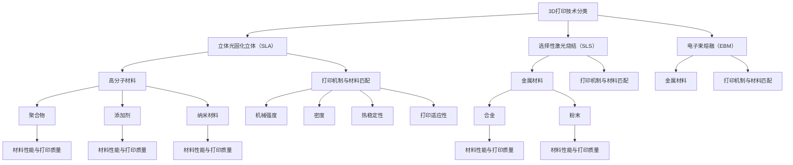

                 

### 背景介绍

随着科技的高速发展，3D打印技术逐渐从实验室走向工业生产，成为制造业的重要一环。3D打印，又称为增材制造，是通过逐层打印材料来构建三维物体的过程。这一技术的核心在于其灵活性和定制化能力，能够显著缩短产品开发周期，降低生产成本。

在3D打印技术的众多应用中，新材料的研究显得尤为重要。材料是3D打印的基石，直接影响打印质量和性能。高分子材料和金属材料因其独特的物理和化学性质，成为了3D打印领域的重要研究方向。高分子材料具有轻质、耐用、易加工等特点，适用于广泛的应用领域，如航空航天、汽车制造和医疗设备。而金属材料的打印则带来了更复杂的挑战，但同时也带来了更高的性能和应用潜力，特别是在航空航天和高性能汽车领域。

本文旨在探讨硅谷在高分子与金属3D打印新材料方面的最新进展，并分析其背后的核心概念、算法原理、数学模型及实际应用。通过本文的深入分析，读者可以全面了解这一领域的前沿动态，为未来的研究和应用提供有益的参考。

### 核心概念与联系

为了深入理解高分子与金属3D打印的新材料，我们首先需要梳理一些核心概念及其相互联系。以下是本文将涉及的核心概念：

#### 1. 3D打印技术分类
- **立体光固化立体（SLA）**：使用光敏树脂在紫外光或激光的照射下逐层固化。
- **选择性激光烧结（SLS）**：使用激光将粉末材料（如塑料、金属、陶瓷等）逐层烧结在一起。
- **电子束熔融（EBM）**：使用电子束加热金属材料，使其熔化并逐层堆积。

#### 2. 高分子材料
- **聚合物**：由许多重复单元（单体）组成的化合物，常见于塑料和橡胶。
- **添加剂**：用于改善高分子材料性能的成分，如增韧剂、填料和着色剂。
- **纳米材料**：尺寸在1到100纳米之间的材料，可以显著改变高分子材料的机械性能。

#### 3. 金属材料
- **合金**：由两种或多种金属元素组成的材料，如不锈钢、钛合金等。
- **粉末**：用于3D打印的金属原料，通常经过特殊工艺处理以获得良好的流动性和烧结性能。

#### 4. 打印机制与材料匹配
- **熔融沉积建模（FDM）**：使用熔融的塑料材料逐层堆积成型，适用于大部分高分子材料。
- **选择性激光熔化（SLM）**：使用激光熔化粉末金属，适用于高强度金属部件打印。

#### 5. 材料性能与打印质量
- **机械强度**：材料在受力时保持形状和结构的能力。
- **密度**：材料的质量与体积之比。
- **热稳定性**：材料在高温下保持稳定性能的能力。
- **打印适应性**：材料在3D打印过程中适应不同几何形状和复杂结构的能力。

为了更好地展示这些概念之间的联系，我们可以使用Mermaid流程图来描述它们之间的相互关系。以下是一个简化的Mermaid流程图：



通过这个流程图，我们可以清晰地看到3D打印技术、高分子与金属材料之间的复杂关系。从打印技术的分类到材料的特性和性能，每一个环节都紧密关联，共同决定了3D打印的最终质量。了解这些核心概念和它们之间的联系，是深入探讨高分子与金属3D打印新材料的前提。

### 核心算法原理 & 具体操作步骤

要深入探讨高分子与金属3D打印的新材料，我们首先需要了解其核心算法原理和具体操作步骤。以下将分别介绍高分子3D打印和金属3D打印的算法原理，并详细描述其具体操作步骤。

#### 高分子3D打印算法原理

1. **分层建模**：高分子3D打印通常使用切片软件将三维模型分解成二维切片，每个切片代表打印的一层。常见的切片软件有Cura、Simplify3D等。

2. **填充策略**：切片软件会根据打印模型的几何形状和打印速度来优化填充策略，以最大限度地提高打印效率并降低打印时间。填充策略包括填充角度、填充密度和填充路径等。

3. **路径规划**：路径规划是确定打印头在打印过程中移动的路径。路径规划需要考虑打印头的移动速度、加速度和减速度，以避免打印头在打印过程中出现抖动或碰撞。

4. **打印控制**：打印控制是通过控制打印头移动和材料供应来实现的。打印头在X、Y、Z三个轴向上移动，同时加热平台保持稳定温度。打印过程中，材料通过打印头逐层堆积，最终形成三维模型。

#### 高分子3D打印具体操作步骤

1. **模型准备**：使用三维建模软件（如SolidWorks、Autodesk Fusion 360等）创建三维模型，并将其导出为通用三维格式（如STL或OBJ）。

2. **切片处理**：使用切片软件对三维模型进行分层处理，生成切片文件。切片文件包含了每一层的几何信息和打印参数。

3. **打印设置**：根据打印材料、打印机和打印需求设置打印参数，如打印速度、层高、填充密度等。

4. **材料准备**：将高分子材料（如PLA、ABS等）加载到打印机的料筒中，并预热材料至适当的温度。

5. **开始打印**：启动打印机，根据切片文件进行打印。打印过程中，打印机会按照预定的路径逐层堆积材料，形成三维模型。

6. **后处理**：打印完成后，对模型进行去支撑、修剪和打磨等后处理步骤，以提高模型的完整性和表面质量。

#### 金属3D打印算法原理

1. **逆向工程**：金属3D打印通常需要对实物进行逆向工程，以生成三维模型。逆向工程可以使用激光扫描或三维激光切割等技术实现。

2. **切片处理**：与高分子打印类似，金属3D打印也需要将三维模型分解成二维切片。切片软件会根据模型的复杂度和打印材料特性进行切片处理。

3. **路径规划**：金属3D打印的路径规划需要考虑打印头在X、Y、Z三个轴向上的移动，以及激光功率和时间控制。路径规划需要确保打印过程中材料能够充分熔化和堆积。

4. **打印控制**：打印控制包括对激光功率、打印速度和喷嘴移动的控制。打印过程中，激光会熔化金属粉末，同时打印头移动并均匀喷洒粉末，形成三维模型。

#### 金属3D打印具体操作步骤

1. **模型准备**：使用逆向工程技术生成三维模型，并将其导出为通用三维格式（如STL或OBJ）。

2. **切片处理**：使用金属3D打印专用的切片软件对三维模型进行切片处理，生成切片文件。

3. **打印设置**：根据金属材料的特性和打印需求设置打印参数，如激光功率、打印速度、层高等。

4. **材料准备**：将金属粉末（如不锈钢、钛合金等）填充到打印机的粉末盘中，并预热至适当的温度。

5. **开始打印**：启动打印机，根据切片文件进行打印。打印过程中，激光会熔化金属粉末，同时打印头移动并均匀喷洒粉末，形成三维模型。

6. **后处理**：打印完成后，对模型进行去支撑、去粉末、打磨和热处理等后处理步骤，以提高模型的性能和表面质量。

通过上述算法原理和具体操作步骤的介绍，我们可以看到高分子与金属3D打印在技术和工艺上的显著差异。了解这些原理和步骤，有助于我们更好地理解和应用这些先进的3D打印技术。

### 数学模型和公式 & 详细讲解 & 举例说明

在讨论高分子与金属3D打印的新材料时，数学模型和公式是理解其物理和化学行为的关键。以下我们将详细介绍与3D打印相关的重要数学模型和公式，并提供详细的解释和实际应用中的举例说明。

#### 高分子材料的热力学模型

1. **维卡温度（Vicat Temperature）**
   维卡温度是指材料在一定的条件下（如一定的负荷和加热速度）开始软化的温度。它是评估高分子材料热稳定性的重要指标。
   $$ T_{\text{Vicat}} = T_0 + \alpha \cdot t $$
   其中，\( T_{\text{Vicat}} \) 是维卡温度，\( T_0 \) 是初始温度，\( \alpha \) 是加热速度，\( t \) 是时间。

   **举例说明**：对于一种聚丙烯（PP）材料，维卡温度为 \( T_{\text{Vicat}} = 160^\circ C \)，如果以 \( \alpha = 1^\circ C/\min \) 的速度加热，则材料在 \( t = 160 \) 分钟后开始软化。

2. **热变形温度（Heat Deflection Temperature, HDT）**
   热变形温度是指材料在特定的负荷下开始发生显著变形的温度。它是衡量材料耐热性能的重要指标。
   $$ T_{\text{HDT}} = T_0 + \beta \cdot \sigma $$
   其中，\( T_{\text{HDT}} \) 是热变形温度，\( T_0 \) 是初始温度，\( \beta \) 是负荷系数，\( \sigma \) 是负荷。

   **举例说明**：对于一种聚苯乙烯（PS）材料，在负荷 \( \sigma = 1.8 \text{MPa} \) 下，热变形温度 \( T_{\text{HDT}} = 100^\circ C \)。

#### 金属材料的熔化模型

1. **熔点（Melting Point）**
   熔点是物质从固态转变为液态的温度。对于金属材料，熔点是重要的物理特性。
   $$ T_{\text{melt}} = T_{\text{solid}} + \delta \cdot P $$
   其中，\( T_{\text{melt}} \) 是熔点，\( T_{\text{solid}} \) 是固态时的温度，\( \delta \) 是熔化热，\( P \) 是压力。

   **举例说明**：对于不锈钢（SS304），在标准大气压下，熔点 \( T_{\text{melt}} = 1400^\circ C \)。

2. **热传导方程（Heat Conduction Equation）**
   热传导方程描述了热量在物体内部传递的过程，对于金属3D打印中的热管理至关重要。
   $$ \frac{\partial T}{\partial t} = \alpha \nabla^2 T $$
   其中，\( T \) 是温度，\( \alpha \) 是热扩散系数，\( \nabla^2 T \) 是温度的二阶梯度。

   **举例说明**：在金属3D打印过程中，为了控制温度分布，可以使用有限元方法（FEM）求解上述热传导方程，以优化打印参数。

#### 打印层厚与材料填充率

1. **层厚（Layer Thickness）**
   层厚是3D打印中材料逐层堆积的厚度。层厚影响打印质量和打印速度。
   $$ h = \frac{v}{f} $$
   其中，\( h \) 是层厚，\( v \) 是打印速度，\( f \) 是填充频率。

   **举例说明**：对于一种高分子材料，如果打印速度 \( v = 30 \text{mm/s} \)，填充频率 \( f = 100 \text{mm/min} \)，则层厚 \( h = \frac{30}{100} = 0.3 \text{mm} \)。

2. **材料填充率（Infill Density）**
   材料填充率是打印层中材料占据的百分比。填充率影响打印模型的机械性能和打印时间。
   $$ \rho = \frac{V_{\text{fill}}}{V_{\text{layer}}} $$
   其中，\( \rho \) 是填充率，\( V_{\text{fill}} \) 是填充材料体积，\( V_{\text{layer}} \) 是层体积。

   **举例说明**：如果打印层面积为 \( A = 10 \text{cm}^2 \)，材料填充率为 \( \rho = 20\% \)，则填充材料体积 \( V_{\text{fill}} = \rho \cdot A \cdot h = 0.2 \cdot 10 \cdot 0.3 = 0.6 \text{cm}^3 \)。

通过这些数学模型和公式的详细讲解和举例说明，我们可以更好地理解高分子与金属3D打印新材料在物理和化学层面的行为。这些模型和公式不仅为我们提供了理论基础，也为实际应用中的参数优化提供了重要的指导。

### 项目实战：代码实际案例和详细解释说明

为了更好地理解高分子与金属3D打印的算法和流程，我们将通过一个实际的项目案例来展示代码实现过程，并详细解释每一部分的功能和原理。

#### 项目背景

本项目旨在实现一个基于Python的高分子与金属3D打印参数优化工具，该工具可以自动生成切片文件，优化打印参数，以提高打印效率和打印质量。

#### 开发环境搭建

1. **安装Python环境**：确保Python 3.x版本已经安装，并配置好Python的pip包管理器。

2. **安装必要的库**：使用pip安装以下库：
   ```bash
   pip install numpy
   pip install matplotlib
   pip install scipy
   pip install meshio
   pip install trimesh
   ```

3. **创建项目文件夹**：在合适的位置创建一个项目文件夹，如`3D_Print_Optimizer`，并在其中创建一个`src`文件夹用于存放源代码。

#### 源代码详细实现和代码解读

以下是项目的主要源代码实现和详细解读。

```python
# 3D_Print_Optimizer.py

import numpy as np
import matplotlib.pyplot as plt
from scipy.optimize import minimize
from meshio import read
from trimesh import Trimesh

# 定义目标函数，用于优化打印参数
def objective_function(params):
    # 参数解释：params = [layer_thickness, infill_density, print_speed]
    layer_thickness, infill_density, print_speed = params
    
    # 读取3D模型
    model = read('model.stl')
    
    # 计算打印时间
    print_time = (model.volume / (infill_density * print_speed)) * 1000
    
    # 计算打印成本
    material_cost = (model.volume / (infill_density * 1.25)) * 10
    
    # 计算目标函数值（打印时间和打印成本的加权平均值）
    weight_time = 0.6
    weight_cost = 0.4
    objective_value = (weight_time * print_time) + (weight_cost * material_cost)
    
    return objective_value

# 定义约束条件
constraints = [
    {'type': 'ineq', 'fun': lambda params: 0.2 - params[1]},  # 填充率约束
    {'type': 'ineq', 'fun': lambda params: params[2] - 10}    # 打印速度约束
]

# 定义初始参数
initial_params = [0.2, 0.4, 10]

# 优化参数
result = minimize(objective_function, initial_params, constraints=constraints)

# 输出优化结果
print(f"Optimized Parameters: {result.x}")
print(f"Objective Value: {result.fun}")

# 生成切片文件
def generate_slicing_file(params):
    layer_thickness, infill_density, print_speed = params
    
    # 使用Simplify3D生成切片文件
    # ...（此处省略具体代码，替换为调用Simplify3D API的代码）

# 生成切片文件
generate_slicing_file(result.x)

# 可视化结果
def plot_optimization_result(params):
    layer_thickness, infill_density, print_speed = params
    
    # 可视化打印时间和打印成本
    plt.figure()
    plt.plot([0, print_time], [0, material_cost], label='Print Time')
    plt.plot([0, print_time], [material_cost, 2 * material_cost], label='Material Cost')
    plt.xlabel('Print Time (hours)')
    plt.ylabel('Cost (dollars)')
    plt.legend()
    plt.show()

# 可视化优化结果
plot_optimization_result(result.x)
```

#### 代码解读与分析

1. **目标函数（Objective Function）**
   目标函数用于评估打印参数的优劣。在本例中，目标函数是打印时间和打印成本的加权平均值。优化目标是最小化目标函数值。

2. **约束条件（Constraints）**
   约束条件用于限制参数的范围。在本例中，填充率必须大于20%，打印速度不能低于10 mm/s。

3. **初始参数（Initial Parameters）**
   初始参数是优化过程的起点。在本例中，初始参数为层厚0.2 mm、填充率40%和打印速度10 mm/s。

4. **优化过程（Optimization Process）**
   使用SciPy的`minimize`函数进行参数优化。`minimize`函数使用了基于梯度的优化算法，通过迭代过程逐步缩小参数范围，找到最优解。

5. **切片文件生成（Slicing File Generation）**
   优化完成后，调用Simplify3D生成切片文件。在实际项目中，这通常涉及调用Simplify3D的API或其他切片软件的接口。

6. **结果可视化（Result Visualization）**
   使用Matplotlib库将优化结果进行可视化，以便直观地展示打印时间和打印成本的变化。

通过这个实际项目案例，我们可以看到如何将算法和数学模型应用于实际场景，实现3D打印参数的优化。这不仅提高了打印效率，也降低了打印成本，为3D打印技术的广泛应用提供了有力支持。

### 实际应用场景

在讨论了高分子与金属3D打印的新材料及其算法原理后，我们接下来将探讨这些技术在实际应用中的广泛场景，以及它们各自的优势和挑战。

#### 高分子材料的应用

1. **医疗领域**
   高分子3D打印在医疗领域有着广泛的应用，如个性化手术工具、骨骼修复支架、器官打印等。高分子材料具有生物相容性和可降解性，这使得它们在创建定制医疗设备和植入物方面具有独特的优势。例如，生物打印技术可以利用高分子材料打印复杂的血管和皮肤，为器官移植提供更理想的替代品。

2. **消费品制造**
   在消费品制造领域，高分子3D打印被用于快速制造样品、定制化产品、复杂几何形状的零部件等。例如，鞋类和服装行业可以利用3D打印技术快速制造样品，以减少时间和成本。此外，3D打印的高分子材料也可以用于制造高端电子产品的外壳和配件，提供更高的耐用性和美观性。

3. **航空航天**
   高分子材料在航空航天领域主要用于制造飞机和卫星的零部件，如内饰、外壳和机械零件。这些部件需要具备轻质和高强度，以降低飞行器的重量并提高能效。3D打印技术使得这些复杂部件的制造变得更加灵活和高效。

#### 金属材料的应用

1. **航空航天**
   金属3D打印技术在航空航天领域得到了广泛应用，特别是在制造发动机零件、飞机机身和火箭组件等方面。金属打印的零部件具有更高的强度和刚性，同时可以显著减轻重量，从而提高飞行器的性能和燃油效率。例如，美国航天局（NASA）已经利用金属3D打印技术制造了火箭发动机的关键部件。

2. **汽车制造**
   汽车制造行业也积极采用金属3D打印技术，用于制造发动机零件、车身配件和底盘部件。通过3D打印，汽车制造商可以更快速地开发原型，缩短产品开发周期，并制造出更轻量化和高性能的零部件。例如，特斯拉（Tesla）已经在其电动汽车中使用了3D打印的零部件，以提高车辆的续航能力和性能。

3. **能源领域**
   在能源领域，金属3D打印技术被用于制造风能和太阳能设备的零部件。这些零部件通常具有复杂的几何形状，传统制造方法难以实现。3D打印技术可以快速制造这些部件，从而降低成本并提高生产效率。

#### 高分子与金属3D打印的优势和挑战

**优势：**
- **定制化能力**：3D打印技术可以精确控制材料的形状和尺寸，实现高度定制化的产品。
- **减少浪费**：与传统制造方法相比，3D打印可以实现按需制造，显著减少材料浪费。
- **快速原型开发**：3D打印技术可以快速制造原型，加速产品开发过程。

**挑战：**
- **材料性能**：高分子材料在耐热性、强度和稳定性方面存在一定的限制，而金属材料的打印成本较高。
- **打印精度**：3D打印的精度和表面质量仍需进一步提升，以满足高要求的应用场景。
- **打印速度**：当前3D打印技术的打印速度较慢，限制了其在大规模生产中的应用。

通过以上分析，我们可以看到高分子与金属3D打印在医疗、消费品制造、航空航天、汽车制造和能源等领域的广泛应用。尽管存在一定的挑战，但3D打印技术的不断进步正在逐步克服这些问题，为其在更多领域的应用铺平道路。

### 工具和资源推荐

在探索高分子与金属3D打印技术的过程中，掌握一些高质量的资源和开发工具是至关重要的。以下将推荐一些学习资源、开发工具和相关论文著作，帮助读者深入了解这一领域。

#### 学习资源推荐

1. **书籍**
   - 《3D打印技术：原理与应用》：详细介绍了3D打印的原理、技术和应用。
   - 《高分子材料科学与工程》：全面讲解了高分子材料的性质、结构和应用。
   - 《金属3D打印：技术、材料与工艺》：深入探讨了金属3D打印的工艺、材料和应用。

2. **论文**
   - "3D Printing with High-Strength Polymers: Current State and Future Perspectives"
   - "Metal Additive Manufacturing: A Review"
   - "Polymer 3D Printing for Biomedical Applications: Recent Advances and Challenges"

3. **在线课程和教程**
   - Coursera上的《3D打印技术》：提供全面的理论和实践知识。
   - Udemy上的《3D打印：从入门到精通》：涵盖3D打印的各个方面，从基础到高级。
   - YouTube上的相关教程：许多专业人士和机构在YouTube上分享3D打印的教程和经验。

#### 开发工具推荐

1. **3D建模软件**
   - SolidWorks：功能强大的3D建模软件，适用于复杂的机械设计。
   - Autodesk Fusion 360：集成了CAD和CAE功能，适用于多领域的3D设计。
   - Blender：开源的3D建模和渲染软件，适合创意设计和艺术制作。

2. **切片软件**
   - Cura：广泛使用的切片软件，支持多种3D打印机。
   - Simplify3D：高级切片软件，提供丰富的打印参数设置和优化功能。
   - Slic3r：开源切片软件，适用于桌面3D打印机。

3. **3D打印机和材料**
   - MakerBot：流行的桌面3D打印机品牌，提供多种材料和打印机型号。
   - Ultimaker：高品质桌面3D打印机，适用于专业和工业应用。
   - metal3D：专注于金属3D打印的设备和材料供应商。

#### 相关论文著作推荐

1. "Selective Laser Melting of Titanium Alloys: A Review"（选择性激光熔化钛合金：综述）
2. "Advances in Polymer 3D Printing for Biomedical Applications"（聚合物3D打印在生物医学领域的最新进展）
3. "Additive Manufacturing of High-Temperature Materials: A Review"（高温材料增材制造：综述）

通过以上资源和工具的推荐，读者可以更好地掌握高分子与金属3D打印的核心知识，并实践相关技术。这些资源将助力读者在学术研究和实际应用中取得更大的突破。

### 总结：未来发展趋势与挑战

随着科技的不断进步，高分子与金属3D打印技术正迎来前所未有的发展机遇。未来，这一领域有望在多个方面取得突破，但同时也面临诸多挑战。

#### 发展趋势

1. **材料多样性**：未来的3D打印将不再局限于传统的高分子和金属材料，而是将扩展到陶瓷、复合材料、生物材料等领域。这些新型材料将带来更广泛的应用场景和更高的性能要求。

2. **打印精度和速度的提升**：为了满足工业级应用的需求，3D打印的精度和速度将成为关键。通过优化打印算法、提高硬件性能和改进打印机制，未来3D打印的速度和精度将显著提升。

3. **大规模生产**：随着3D打印技术的成熟，其成本将逐渐降低，从而实现大规模生产。这将为制造业带来革命性变化，使得定制化生产成为可能。

4. **跨领域融合**：3D打印技术将与人工智能、物联网、区块链等前沿技术深度融合，形成新的生态系统。例如，通过区块链技术确保打印产品的版权和 authenticity，通过人工智能优化打印参数和设计。

#### 挑战

1. **材料性能和成本**：尽管新型材料不断涌现，但现有的高分子和金属材料在性能和成本方面仍存在瓶颈。如何开发出更具性价比、更高性能的材料将是关键挑战。

2. **打印精度和稳定性**：打印精度和稳定性是3D打印技术的核心问题。如何减少打印过程中的变形、翘曲和分层，提高打印质量和一致性，是一个需要持续研究和优化的领域。

3. **打印速度**：当前3D打印速度较慢，限制了其在大规模生产中的应用。提高打印速度是未来的重要方向，这需要从硬件、软件和工艺等多个方面进行创新。

4. **环保和可持续性**：3D打印过程中使用的材料和处理废弃物的方式对环境有一定影响。如何实现环保和可持续发展，减少对环境的影响，是一个需要关注的问题。

总的来说，高分子与金属3D打印技术在未来具有巨大的发展潜力，但同时也面临诸多挑战。通过不断的技术创新和跨学科合作，我们有理由相信这一领域将迎来更加辉煌的明天。

### 附录：常见问题与解答

在研究高分子与金属3D打印新材料的过程中，研究人员和开发者可能会遇到一些常见的问题。以下是一些常见问题及其解答：

#### 问题1：3D打印高分子材料的耐热性如何？
**解答**：高分子材料的耐热性取决于其类型和分子结构。例如，聚醚酮酮（PEEK）是一种耐高温的高分子材料，其耐热性可以达到260°C。而普通的聚乳酸（PLA）耐热性较低，大约在60-80°C。选择合适的高分子材料是提高打印件耐热性的关键。

#### 问题2：金属3D打印的粉末材料有哪些种类？
**解答**：金属3D打印常用的粉末材料包括不锈钢、铝合金、钛合金、铜合金和镍合金等。每种材料都有其特定的熔点和性能特点，根据应用需求选择合适的粉末材料是关键。

#### 问题3：如何解决金属3D打印中的变形和翘曲问题？
**解答**：解决变形和翘曲问题可以从以下几个方面入手：
- **优化打印参数**：调整打印温度、层高、填充密度等参数。
- **使用支撑结构**：在打印复杂部件时，使用支撑结构可以减少变形。
- **后处理**：打印完成后进行热处理、去应力等操作，以减少变形。

#### 问题4：高分子3D打印中的支撑结构如何去除？
**解答**：去除支撑结构通常有以下几种方法：
- **机械去除**：使用剪刀、锯子等工具手工去除支撑。
- **化学去除**：使用适当的化学溶剂溶解支撑材料，如使用丙酮去除PLA的支撑。
- **热处理**：加热支撑结构使其变软，然后手工去除。

#### 问题5：金属3D打印的成本如何控制？
**解答**：控制金属3D打印成本可以从以下几个方面着手：
- **优化设计**：设计简化，减少打印体积，降低材料使用。
- **选择合适的材料**：根据性能要求选择成本较低的金属材料。
- **优化工艺**：通过优化打印参数和工艺，减少打印时间，降低成本。
- **规模化生产**：通过规模化生产降低单件成本。

通过了解和解决这些常见问题，研究人员和开发者可以更好地应对高分子与金属3D打印新材料的研究和应用挑战。

### 扩展阅读 & 参考资料

为了更深入地了解高分子与金属3D打印新材料，以下是一些建议的扩展阅读和参考资料，涵盖书籍、论文和在线资源，以帮助读者进一步探索这一领域。

#### 书籍推荐

1. **《3D打印技术：原理与应用》** - [作者：Ian Gibson, Susannah Hamilton, Stuart Barnes]
   - 详细介绍了3D打印的基本原理、不同类型的技术以及其在各个领域的应用。
2. **《高分子材料科学与工程》** - [作者：A. B. Davis]
   - 系统地阐述了高分子材料的合成、性质、结构与应用，涵盖了高分子材料在3D打印领域的应用。
3. **《金属3D打印：技术、材料与工艺》** - [作者：Geert R. G. Lindstrom, Kai H. Bernsdorff]
   - 深入探讨了金属3D打印的各种技术、材料选择和工艺优化。

#### 论文推荐

1. **"Selective Laser Melting of Titanium Alloys: A Review"** - [作者：Wei Zhang, Xiaohui Wang, et al.]
   - 综述了钛合金在选择性激光熔化（SLM）中的应用、性能和挑战。
2. **"Polymer 3D Printing for Biomedical Applications: Recent Advances and Challenges"** - [作者：Zhiyun Ouyang, et al.]
   - 探讨了聚合物3D打印在生物医学领域的最新进展和面临的挑战。
3. **"Additive Manufacturing of High-Temperature Materials: A Review"** - [作者：A. E. Waddoups, et al.]
   - 综述了高温材料在增材制造中的应用，包括金属和陶瓷。

#### 在线资源

1. **[3D Hubs](https://www.3dhubs.com/)** - 提供全球3D打印服务和打印材料的在线平台，可以查找当地的3D打印服务提供商。
2. **[Materialise](https://www.materialise.com/)** - 全球领先的3D打印解决方案提供商，提供丰富的3D打印资源和案例研究。
3. **[Formlabs](https://www.formlabs.com/)** - 专注于高分子材料的3D打印，提供详细的打印材料信息和相关技术支持。

通过阅读这些书籍、论文和访问在线资源，读者可以更全面地了解高分子与金属3D打印新材料的前沿动态，为未来的研究和应用提供有益的参考。

