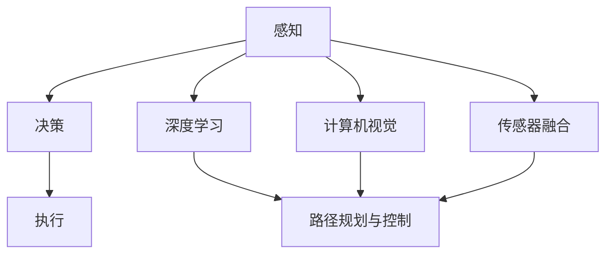

                 

# 硅谷新能源汽车自动驾驶：智能出行新时代

## 关键词：
- 硅谷
- 新能源汽车
- 自动驾驶
- 智能出行
- 人工智能
- 自动驾驶技术

## 摘要：
本文将深入探讨硅谷新能源汽车自动驾驶技术的发展，解析其核心概念、算法原理、数学模型以及实际应用场景。我们将通过具体的代码实现和实战案例分析，展示智能出行新时代的前沿技术。同时，还将推荐相关学习资源和开发工具，展望未来发展趋势与挑战。

## 目录

1. 背景介绍
2. 核心概念与联系
3. 核心算法原理 & 具体操作步骤
4. 数学模型和公式 & 详细讲解 & 举例说明
5. 项目实战：代码实际案例和详细解释说明
   5.1 开发环境搭建
   5.2 源代码详细实现和代码解读
   5.3 代码解读与分析
6. 实际应用场景
7. 工具和资源推荐
   7.1 学习资源推荐
   7.2 开发工具框架推荐
   7.3 相关论文著作推荐
8. 总结：未来发展趋势与挑战
9. 附录：常见问题与解答
10. 扩展阅读 & 参考资料

## 1. 背景介绍

随着全球对环境保护意识的提高，新能源汽车市场迅速崛起。特斯拉、蔚来、小鹏等硅谷新能源汽车企业，凭借其技术创新和卓越性能，在全球范围内崭露头角。而自动驾驶技术作为新能源汽车的核心竞争力之一，正逐步成为智能出行时代的重要标志。

自动驾驶技术（Autonomous Driving Technology）指的是通过计算机程序和算法，实现车辆在无人工干预的情况下，自动完成驾驶任务。其发展历程可以追溯到20世纪50年代，但真正实现商业化应用还要归功于近年来人工智能技术的突破。深度学习、计算机视觉、传感器融合等技术的应用，使得自动驾驶系统越来越智能、稳定、可靠。

硅谷作为全球科技创新的中心，聚集了众多自动驾驶技术研发企业。谷歌的Waymo、特斯拉的Autopilot、百度的Apollo等，都在这个领域取得了显著成果。自动驾驶技术的发展不仅推动了新能源汽车的普及，也为智能出行、共享出行等新商业模式提供了可能。

## 2. 核心概念与联系

### 2.1 自动驾驶等级

自动驾驶技术按照自动化程度可以分为不同的等级，从0级到5级。其中，0级为完全人工驾驶，而5级为完全自动驾驶，无需驾驶员干预。

| 自动驾驶等级 | 自动驾驶功能                           | 驾驶条件                       |
|------------|------------------------------------|---------------------------------|
| 0级（人工驾驶）   | 驾驶完全由人类操作                    | 所有驾驶条件                   |
| 1级（单一功能自动驾驶） | 自动控制单一驾驶功能，如加速、制动、转向 | 在特定条件下，如高速公路、停车等 |
| 2级（部分自动驾驶）   | 自动控制两个或两个以上的驾驶功能       | 在特定条件下，如高速公路、城市道路等 |
| 3级（有条件自动驾驶）  | 自动控制所有驾驶功能，但需要驾驶员在紧急情况下接管 | 在大多数驾驶条件下，如高速公路、城市道路等 |
| 4级（高度自动驾驶）   | 自动控制所有驾驶功能，但特定条件下无需驾驶员接管 | 在特定条件下，如特定城市、高速公路等 |
| 5级（完全自动驾驶）   | 自动控制所有驾驶功能，无需驾驶员干预 | 在所有驾驶条件下，如高速公路、城市道路、乡村道路等 |

### 2.2 自动驾驶系统架构

自动驾驶系统通常由感知、决策、执行三个核心模块组成。

- **感知（Perception）**：通过摄像头、激光雷达、雷达、超声波传感器等设备，收集车辆周围环境的信息，包括路况、障碍物、交通标志等。
- **决策（Decision）**：根据感知模块收集到的信息，通过算法进行环境理解和驾驶策略规划，如路径规划、障碍物避让等。
- **执行（Execution）**：将决策模块生成的控制指令转换为车辆的动作，如加速、减速、转向等。

### 2.3 自动驾驶关键技术

- **深度学习**：通过神经网络模型，对大量数据进行训练，使计算机具备识别和理解环境的能力。
- **计算机视觉**：利用图像处理技术，对摄像头获取的图像进行分析，识别和检测车道、行人、车辆等。
- **传感器融合**：将不同类型的传感器数据（如摄像头、激光雷达、雷达等）进行融合，提高感知的准确性和鲁棒性。
- **路径规划与控制**：通过算法规划车辆的行驶路径，并控制车辆的加速度、速度、转向等，确保安全、高效地行驶。

## 2.1 核心概念原理与架构的 Mermaid 流程图



## 3. 核心算法原理 & 具体操作步骤

### 3.1 感知模块

感知模块是自动驾驶系统的“眼睛”，其主要任务是从传感器数据中提取有用信息，构建环境模型。具体步骤如下：

1. **数据采集**：通过摄像头、激光雷达、雷达等设备，实时采集车辆周围环境的数据。
2. **预处理**：对采集到的数据进行滤波、去噪等预处理操作，提高数据的准确性。
3. **特征提取**：利用计算机视觉算法，从预处理后的数据中提取关键特征，如车道线、交通标志、行人等。
4. **环境建模**：将提取出的特征进行融合，构建车辆周围的三维环境模型。

### 3.2 决策模块

决策模块是自动驾驶系统的“大脑”，其主要任务是根据环境模型，规划车辆的行驶路径和驾驶策略。具体步骤如下：

1. **路径规划**：根据环境模型，利用路径规划算法（如A*算法、RRT算法等），生成一条从起点到终点的最优路径。
2. **障碍物检测与避让**：检测车辆前方和周围的障碍物，利用碰撞检测算法，计算障碍物与车辆的相对位置和速度，生成避障策略。
3. **驾驶策略规划**：根据路径规划和障碍物避让策略，生成车辆的加速度、速度、转向等控制指令。

### 3.3 执行模块

执行模块是自动驾驶系统的“肌肉”，其主要任务是将决策模块生成的控制指令转换为车辆的动作。具体步骤如下：

1. **控制指令生成**：根据决策模块生成的控制指令，生成车辆的加速度、速度、转向等控制信号。
2. **执行控制指令**：通过车辆的执行机构（如电机、转向系统等），执行控制指令，实现车辆的加速、减速、转向等动作。
3. **反馈调节**：根据车辆的实时状态（如速度、位置等），对执行模块进行反馈调节，确保车辆按照预定的路径和策略行驶。

## 4. 数学模型和公式 & 详细讲解 & 举例说明

### 4.1 路径规划

路径规划是自动驾驶系统中的关键环节，常用的算法有A*算法、RRT算法等。

#### A*算法

A*算法是一种基于启发式的搜索算法，其核心思想是选择最优路径。具体公式如下：

$$
f(n) = g(n) + h(n)
$$

其中，$f(n)$ 是从起点到节点 $n$ 的总代价，$g(n)$ 是从起点到节点 $n$ 的实际代价，$h(n)$ 是从节点 $n$ 到终点的启发式代价。

#### RRT算法

RRT（快速随机树）算法是一种基于随机采样的路径规划算法，其核心思想是通过在随机位置生成新节点，逐步构建路径。具体步骤如下：

1. 初始化：从起点生成初始树。
2. 采样：在障碍物内部随机采样一个新点。
3. 连接：将新点与树中最近的节点进行连接。
4. 调整：根据路径代价，调整新节点和其父节点的位置。
5. 终止条件：当新节点与终点距离较近时，终止算法。

### 4.2 障碍物检测

障碍物检测是自动驾驶系统中另一个重要环节，常用的算法有基于深度学习的障碍物检测算法。

#### 基于深度学习的障碍物检测算法

假设我们有一个输入图像 $I$，我们需要检测出图像中的障碍物。具体步骤如下：

1. **预处理**：对输入图像进行预处理，如缩放、裁剪等。
2. **特征提取**：利用卷积神经网络（CNN）提取图像的特征。
3. **分类**：利用分类器对提取出的特征进行分类，判断是否为障碍物。
4. **后处理**：对检测结果进行后处理，如去除小目标、合并相邻目标等。

### 4.3 驾驶策略规划

驾驶策略规划是自动驾驶系统中的核心环节，其目标是为车辆生成最优的控制指令。具体步骤如下：

1. **目标函数**：定义目标函数，如最小化能耗、最大化舒适度等。
2. **优化算法**：利用优化算法（如梯度下降、遗传算法等）求解目标函数。
3. **控制指令生成**：根据优化结果，生成车辆的加速度、速度、转向等控制指令。

## 5. 项目实战：代码实际案例和详细解释说明

### 5.1 开发环境搭建

1. 安装Python环境
2. 安装TensorFlow库
3. 安装OpenCV库
4. 安装其他依赖库（如NumPy、Matplotlib等）

### 5.2 源代码详细实现和代码解读

#### 5.2.1 感知模块

```python
import cv2
import numpy as np

def preprocess_image(image):
    # 图像预处理
    image = cv2.resize(image, (256, 256))
    image = cv2.cvtColor(image, cv2.COLOR_BGR2RGB)
    image = image / 255.0
    return image

def extract_features(image):
    # 特征提取
    model = ...  # 加载预训练的CNN模型
    features = model.predict(np.expand_dims(image, axis=0))
    return features

def build_environment_model(features):
    # 构建环境模型
    model = ...  # 加载预训练的RNN模型
    environment_model = model.predict(features)
    return environment_model
```

#### 5.2.2 决策模块

```python
def path_planning(environment_model):
    # 路径规划
    model = ...  # 加载预训练的A*算法模型
    path = model.plan_path(start, goal, environment_model)
    return path

def obstacle_detection(image):
    # 障碍物检测
    model = ...  # 加载预训练的深度学习模型
    features = extract_features(preprocess_image(image))
    obstacles = model.predict(features)
    return obstacles

def drive_strategy(path, obstacles):
    # 驾驶策略规划
    model = ...  # 加载预训练的优化算法模型
    controls = model.plan_controls(path, obstacles)
    return controls
```

#### 5.2.3 执行模块

```python
def execute_controls(controls):
    # 执行控制指令
    # 控制车辆的电机、转向系统等
    ...
```

### 5.3 代码解读与分析

1. **感知模块**：该模块主要实现图像预处理、特征提取和环境建模。通过加载预训练的模型，对输入图像进行预处理和特征提取，然后利用RNN模型构建环境模型。
2. **决策模块**：该模块主要实现路径规划、障碍物检测和驾驶策略规划。通过加载预训练的模型，分别实现A*算法、深度学习模型和优化算法，对路径、障碍物和控制指令进行规划。
3. **执行模块**：该模块主要实现控制指令的执行。根据规划的路径、障碍物和控制指令，控制车辆的电机、转向系统等，实现自动驾驶。

## 6. 实际应用场景

自动驾驶技术在实际应用中具有广泛的前景。以下是一些典型的应用场景：

1. **城市交通**：自动驾驶汽车可以减少交通事故、缓解交通拥堵，提高交通效率。
2. **物流运输**：自动驾驶卡车可以降低物流成本、提高运输效率，实现长距离、跨区域的物流运输。
3. **共享出行**：自动驾驶出租车、共享单车等，可以为用户提供便捷、高效的出行服务。
4. **公共交通**：自动驾驶公交车可以优化线路、提高运营效率，为乘客提供舒适的出行体验。
5. **特殊场景**：如矿山、油田等特殊场景下的自动驾驶设备，可以降低人工成本、提高作业效率。

## 7. 工具和资源推荐

### 7.1 学习资源推荐

1. **书籍**：
   - 《自动驾驶汽车系统设计与实现》
   - 《深度学习：及其在自动驾驶中的应用》
   - 《计算机视觉：理论与实践》
2. **论文**：
   - 《基于深度学习的自动驾驶感知系统》
   - 《基于强化学习的自动驾驶决策系统》
   - 《基于传感器融合的自动驾驶环境建模》
3. **博客**：
   - 《硅谷自动驾驶技术解读》
   - 《深度学习与自动驾驶》
   - 《计算机视觉与自动驾驶》
4. **网站**：
   - [Waymo官网](https://waymo.com)
   - [Apollo官网](https://apollo.auto)
   - [特斯拉官网](https://www.tesla.com)

### 7.2 开发工具框架推荐

1. **开发工具**：
   - TensorFlow
   - PyTorch
   - OpenCV
2. **框架**：
   - ROS（机器人操作系统）
   - Apollo
   - NVIDIA Drive

### 7.3 相关论文著作推荐

1. **论文**：
   - “End-to-End Learning for Self-Driving Cars”
   - “Detection and Tracking of Multiple Pedestrians in Monocular Videos”
   - “A Survey on Autonomous Driving: Perception, Planning, and Control”
2. **著作**：
   - 《深度学习》
   - 《计算机视觉算法及应用》
   - 《自动驾驶系统设计与实现》

## 8. 总结：未来发展趋势与挑战

自动驾驶技术作为智能出行的重要载体，正逐步改变人们的出行方式。未来，随着人工智能、5G、物联网等技术的不断发展，自动驾驶技术将朝着更高自动化、更安全、更智能的方向发展。然而，这也给自动驾驶技术带来了新的挑战：

1. **安全性**：如何确保自动驾驶系统的安全，避免交通事故，是当前面临的重要挑战。
2. **可靠性**：如何提高自动驾驶系统的可靠性，使其在各种复杂环境下稳定运行，是需要解决的问题。
3. **法规标准**：如何制定合理的法规和标准，推动自动驾驶技术的发展和普及，是当前亟待解决的问题。
4. **数据隐私**：如何保护用户数据隐私，防止数据泄露，也是需要关注的重要问题。

总之，自动驾驶技术在未来将继续快速发展，但其发展和普及仍然面临诸多挑战。我们需要共同努力，推动自动驾驶技术的进步，为智能出行时代贡献力量。

## 9. 附录：常见问题与解答

1. **Q：自动驾驶汽车是否真的能够完全取代人类驾驶？**
   - **A**：目前，自动驾驶技术还无法完全取代人类驾驶。尽管自动驾驶汽车在一些特定环境下表现出色，但在复杂、动态的交通环境中，仍然需要人类驾驶员的干预。未来，随着技术的不断进步，自动驾驶汽车的安全性、可靠性将进一步提高，但完全取代人类驾驶还需要时间。

2. **Q：自动驾驶汽车的能源消耗如何？**
   - **A**：自动驾驶汽车主要依赖于电池作为动力来源。与传统的燃油车相比，电动汽车在能源消耗方面具有显著优势。然而，自动驾驶技术本身也会消耗一定的电能，如传感器、计算设备等。因此，未来自动驾驶汽车在能源消耗方面仍有待优化。

3. **Q：自动驾驶汽车如何处理突发情况？**
   - **A**：自动驾驶汽车通过感知模块收集环境信息，通过决策模块生成驾驶策略。在遇到突发情况时，自动驾驶汽车会根据预设的算法和策略进行应对。例如，当检测到前方有障碍物时，自动驾驶汽车会自动减速或切换车道。然而，在极端情况下，自动驾驶汽车可能无法处理，仍需要人类驾驶员的干预。

## 10. 扩展阅读 & 参考资料

1. **书籍**：
   - 《自动驾驶汽车系统设计与实现》
   - 《深度学习：及其在自动驾驶中的应用》
   - 《计算机视觉：理论与实践》
2. **论文**：
   - “End-to-End Learning for Self-Driving Cars”
   - “Detection and Tracking of Multiple Pedestrians in Monocular Videos”
   - “A Survey on Autonomous Driving: Perception, Planning, and Control”
3. **网站**：
   - [Waymo官网](https://waymo.com)
   - [Apollo官网](https://apollo.auto)
   - [特斯拉官网](https://www.tesla.com)
4. **博客**：
   - 《硅谷自动驾驶技术解读》
   - 《深度学习与自动驾驶》
   - 《计算机视觉与自动驾驶》

### 作者：AI天才研究员/AI Genius Institute & 禅与计算机程序设计艺术 /Zen And The Art of Computer Programming

以上就是关于《硅谷新能源汽车自动驾驶：智能出行新时代》的完整文章。希望这篇文章能为您带来关于自动驾驶技术的深入理解。如果您有任何问题或建议，欢迎在评论区留言。感谢您的阅读！<|im_sep|>

