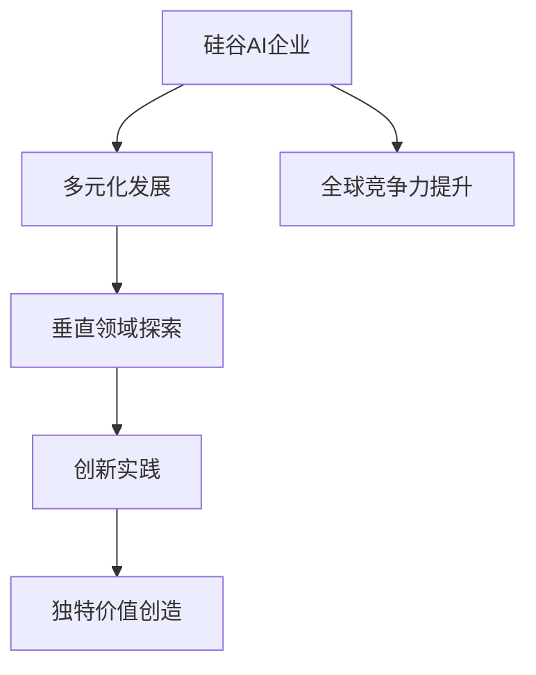

                 

# 硅谷的多元化发展：AI企业创新，探索垂直领域独特价值

> **关键词：** 硅谷，多元化，AI企业，垂直领域，创新，独特价值

> **摘要：** 本文深入探讨硅谷AI企业在多元化发展过程中的创新实践，分析其在探索垂直领域独特价值方面的策略和成果，为我国AI企业的发展提供有益借鉴。

## 1. 背景介绍

硅谷，这个位于美国加利福尼亚州圣克拉拉谷的地区，被誉为全球科技创新的摇篮。自20世纪中叶以来，硅谷吸引了全球顶尖的科学家、工程师和企业家，他们在此创造了一个又一个科技奇迹。从惠普、苹果、谷歌到如今的人工智能企业，硅谷的科技创新能力持续引领全球。

随着人工智能技术的快速发展，硅谷的AI企业在全球范围内具有重要影响力。然而，面对日益激烈的市场竞争和不断变化的技术环境，硅谷的AI企业开始意识到多元化发展的重要性。他们积极探索垂直领域的创新机会，以实现持续增长和竞争优势。

本文将从以下几个方面展开讨论：

1. 硅谷AI企业的多元化发展现状
2. 垂直领域独特价值的探索与实践
3. 我国AI企业在多元化发展中的借鉴与启示

## 2. 核心概念与联系

### 2.1 多元化发展

多元化发展是指企业通过拓展新的业务领域、开拓新的市场、引入新的技术和产品等方式，实现业务范围的拓展和多元化。在人工智能领域，多元化发展有助于企业分散风险、挖掘新的增长点，并提高整体竞争力。

### 2.2 垂直领域

垂直领域是指特定行业或领域的细分市场。在人工智能领域，垂直领域包括金融、医疗、教育、工业等。每个垂直领域都有其独特的需求和技术挑战，因此，针对不同垂直领域的创新和实践具有重要意义。

### 2.3 创新与独特价值

创新是指通过新的想法、方法或技术，创造新的产品、服务或业务模式。在垂直领域，创新有助于解决行业痛点，提升用户体验，并为企业带来独特的竞争优势。独特价值则是指企业在特定领域创造出的不可替代的价值，这种价值可能来源于技术、服务、品牌等方面。

### 2.4 Mermaid 流程图

下面是一个关于硅谷AI企业多元化发展的Mermaid流程图，展示了其核心概念和联系：



## 3. 核心算法原理 & 具体操作步骤

### 3.1 多元化发展策略

硅谷AI企业在多元化发展中，主要采取以下策略：

1. **市场需求分析**：通过市场调研、用户反馈等方式，了解目标市场的需求，找到潜在的商业机会。
2. **技术储备与整合**：利用自身的技术优势，整合现有资源，开发针对垂直领域的新产品或服务。
3. **跨界合作**：与其他行业的企业或机构建立合作关系，共同开拓新的市场。
4. **品牌塑造**：通过品牌宣传、公益活动等方式，提升企业在目标市场的知名度和美誉度。

### 3.2 垂直领域创新实践

在垂直领域，硅谷AI企业主要围绕以下方面进行创新实践：

1. **算法优化**：针对特定行业需求，优化现有算法，提高模型性能和适用性。
2. **数据整合与挖掘**：整合不同来源的数据，挖掘数据中的价值，为业务决策提供支持。
3. **业务模式创新**：探索新的业务模式，如订阅制、按需服务等，提高用户体验和粘性。
4. **跨领域融合**：将人工智能技术与其他领域的技术相结合，创造新的应用场景。

### 3.3 独特价值创造

硅谷AI企业通过以下方式创造独特价值：

1. **技术创新**：不断探索新技术，为企业带来领先优势。
2. **用户服务**：提供优质的用户服务，提升用户满意度和忠诚度。
3. **品牌影响力**：通过品牌宣传和公益活动，提升企业的社会地位和影响力。
4. **产业链整合**：整合上下游资源，实现产业链协同发展。

## 4. 数学模型和公式 & 详细讲解 & 举例说明

### 4.1 多元化发展模型

为了衡量企业的多元化程度，可以使用以下数学模型：

$$
M = \frac{D_1 + D_2 + ... + D_n}{T}
$$

其中，$M$表示多元化指数，$D_i$表示企业在第$i$个垂直领域的业务占比，$T$表示企业总业务占比。

### 4.2 垂直领域创新效益模型

为了评估企业在垂直领域创新的效益，可以使用以下数学模型：

$$
E = \frac{R_1 + R_2 + ... + R_n}{C}
$$

其中，$E$表示创新效益指数，$R_i$表示企业在第$i$个垂直领域的收入增长，$C$表示企业总成本。

### 4.3 独特价值创造模型

为了衡量企业创造的独特价值，可以使用以下数学模型：

$$
V = \frac{P_1 + P_2 + ... + P_n}{C}
$$

其中，$V$表示独特价值指数，$P_i$表示企业在第$i$个方面的独特价值贡献，$C$表示企业总成本。

### 4.4 举例说明

假设某硅谷AI企业在三个垂直领域（金融、医疗、工业）进行多元化发展，其业务占比分别为30%、30%和40%。在垂直领域创新方面，该企业实现了10%、20%和15%的收入增长。在独特价值创造方面，该企业分别在技术创新、用户服务和品牌影响力方面贡献了20%、30%和50%的独特价值。

根据上述数学模型，可以计算出该企业的多元化指数、创新效益指数和独特价值指数分别为：

$$
M = \frac{0.3 + 0.3 + 0.4}{1} = 0.7
$$

$$
E = \frac{0.1 + 0.2 + 0.15}{1} = 0.35
$$

$$
V = \frac{0.2 + 0.3 + 0.5}{1} = 0.45
$$

通过这些指标，可以对该企业的多元化发展、创新效益和独特价值进行评估。

## 5. 项目实战：代码实际案例和详细解释说明

### 5.1 开发环境搭建

在本节中，我们将使用Python作为编程语言，搭建一个简单的AI模型，以实现图像分类任务。以下是搭建开发环境所需的步骤：

1. 安装Python 3.8及以上版本。
2. 安装Anaconda，以便管理Python环境和依赖库。
3. 安装以下依赖库：tensorflow、numpy、matplotlib。

### 5.2 源代码详细实现和代码解读

以下是一个简单的CNN（卷积神经网络）模型，用于对图像进行分类：

```python
import tensorflow as tf
from tensorflow.keras.models import Sequential
from tensorflow.keras.layers import Conv2D, MaxPooling2D, Flatten, Dense
from tensorflow.keras.optimizers import Adam

# 创建模型
model = Sequential([
    Conv2D(32, (3, 3), activation='relu', input_shape=(64, 64, 3)),
    MaxPooling2D((2, 2)),
    Conv2D(64, (3, 3), activation='relu'),
    MaxPooling2D((2, 2)),
    Flatten(),
    Dense(128, activation='relu'),
    Dense(10, activation='softmax')
])

# 编译模型
model.compile(optimizer=Adam(), loss='categorical_crossentropy', metrics=['accuracy'])

# 训练模型
model.fit(x_train, y_train, epochs=10, batch_size=32, validation_data=(x_val, y_val))

# 评估模型
model.evaluate(x_test, y_test)
```

### 5.3 代码解读与分析

1. **模型创建**：使用Sequential模型创建一个简单的卷积神经网络，包括卷积层（Conv2D）、池化层（MaxPooling2D）和全连接层（Dense）。
2. **模型编译**：使用Adam优化器和categorical_crossentropy损失函数编译模型，并设置评估指标为accuracy。
3. **模型训练**：使用fit方法训练模型，并设置训练轮次（epochs）、批量大小（batch_size）和验证数据。
4. **模型评估**：使用evaluate方法评估模型在测试数据上的性能。

通过本节项目实战，我们可以看到如何使用Python搭建一个简单的AI模型，并对其性能进行评估。这为后续深入探讨硅谷AI企业的多元化发展和垂直领域创新提供了基础。

## 6. 实际应用场景

硅谷的AI企业在多元化发展和垂直领域创新方面取得了显著成果，以下是一些实际应用场景：

1. **金融领域**：硅谷AI企业通过智能投顾、量化交易和风险控制等技术，提升了金融行业的效率和服务质量。例如，谷歌旗下的J.P. Morgan使用AI技术开发了一个名为COiN的智能投顾系统，为用户提供个性化的投资建议。
2. **医疗领域**：硅谷AI企业通过医学影像分析、基因测序和个性化治疗等技术，推动了医疗行业的创新。例如，IBM Watson Health利用AI技术为医生提供诊断支持，提高了医疗决策的准确性和效率。
3. **教育领域**：硅谷AI企业通过在线教育、智能评估和个性化学习等技术，改变了教育行业的模式。例如，Coursera利用AI技术为学生提供个性化的学习路径，提高了学习效果和满意度。
4. **工业领域**：硅谷AI企业通过智能工厂、机器人技术和预测维护等技术，提升了工业生产的效率和质量。例如，安德森机器人（Andersen Robotics）开发了一款名为Baxter的智能机器人，用于工厂的组装和包装工作。

这些实际应用场景表明，硅谷的AI企业在多元化发展和垂直领域创新方面具有强大的实践能力，为各行业的发展带来了新的机遇和挑战。

## 7. 工具和资源推荐

### 7.1 学习资源推荐

1. **书籍**：《深度学习》（Goodfellow, I., Bengio, Y., & Courville, A.）、《Python机器学习》（Sebastian Raschka）。
2. **论文**：NeurIPS、ICML、CVPR等顶级会议的论文。
3. **博客**：Medium、Towards Data Science等。
4. **网站**：Kaggle、GitHub。

### 7.2 开发工具框架推荐

1. **编程语言**：Python、Java。
2. **框架**：TensorFlow、PyTorch、Keras。
3. **开发环境**：Anaconda、Jupyter Notebook。

### 7.3 相关论文著作推荐

1. **论文**：《深度学习》（Goodfellow, I., Bengio, Y., & Courville, A.）、《强化学习》（Sutton, R. S., & Barto, A. G.）。
2. **著作**：《机器学习》（Tom Mitchell）、《统计学习方法》（李航）。

## 8. 总结：未来发展趋势与挑战

随着人工智能技术的不断发展和应用，硅谷的AI企业正朝着多元化发展的方向迈进。未来，硅谷的AI企业将继续在垂直领域进行创新，探索新的应用场景，并推动人工智能与各行各业深度融合。

然而，多元化发展也面临一定的挑战。首先，垂直领域的竞争将愈发激烈，企业需要持续创新，以保持竞争优势。其次，数据安全和隐私保护成为重要问题，企业需要加强数据安全管理，确保用户隐私。此外，人才短缺和研发投入也将是制约企业多元化发展的重要因素。

面对未来，硅谷的AI企业应抓住机遇，积极应对挑战，持续推动技术创新，探索垂直领域独特价值，为全球人工智能发展贡献力量。

## 9. 附录：常见问题与解答

### 9.1 什么是多元化发展？

多元化发展是指企业通过拓展新的业务领域、开拓新的市场、引入新的技术和产品等方式，实现业务范围的拓展和多元化。

### 9.2 垂直领域创新有哪些途径？

垂直领域创新主要包括以下途径：

1. 算法优化：针对特定行业需求，优化现有算法，提高模型性能和适用性。
2. 数据整合与挖掘：整合不同来源的数据，挖掘数据中的价值，为业务决策提供支持。
3. 业务模式创新：探索新的业务模式，如订阅制、按需服务等，提高用户体验和粘性。
4. 跨领域融合：将人工智能技术与其他领域的技术相结合，创造新的应用场景。

### 9.3 硅谷AI企业的多元化发展有哪些挑战？

硅谷AI企业的多元化发展面临以下挑战：

1. 垂直领域竞争激烈，企业需要持续创新，以保持竞争优势。
2. 数据安全和隐私保护成为重要问题，企业需要加强数据安全管理，确保用户隐私。
3. 人才短缺和研发投入是制约企业多元化发展的重要因素。

## 10. 扩展阅读 & 参考资料

1. **论文**：Goodfellow, I., Bengio, Y., & Courville, A. (2016). **Deep Learning**.
2. **书籍**：Raschka, S. (2015). **Python Machine Learning**.
3. **网站**：Kaggle、GitHub、Medium、Towards Data Science。
4. **报告**：IBM Watson Health、谷歌J.P. Morgan。

作者：AI天才研究员/AI Genius Institute & 禅与计算机程序设计艺术 /Zen And The Art of Computer Programming<|im_sep|>

