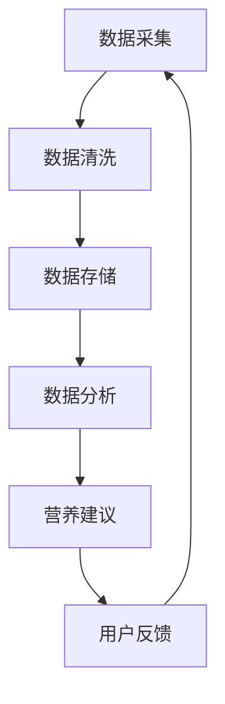

                 

# 硅谷食品科技：健康饮食与营养跟踪

## 关键词
- 食品科技
- 健康饮食
- 营养跟踪
- 人工智能
- 数据分析
- 传感器技术

## 摘要
本文将深入探讨硅谷食品科技在健康饮食与营养跟踪方面的最新进展。通过人工智能、数据分析、传感器技术等技术的应用，硅谷食品科技正不断推动着健康饮食的个性化与智能化。本文将详细介绍这些技术的原理、实际应用场景，以及相关工具和资源的推荐。同时，还将分析未来在这一领域的发展趋势与挑战。

## 1. 背景介绍

### 食品科技的发展

食品科技作为一门涉及生物学、化学、工程学等多个学科领域的交叉学科，近年来在全球范围内得到了迅速发展。随着人们对健康意识的提升，食品科技在营养跟踪、食品检测、食品加工等方面取得了显著的成果。

### 健康饮食与营养跟踪的重要性

健康饮食与营养跟踪对于维护人体健康、预防疾病具有重要意义。通过精准的营养跟踪，可以帮助人们更好地了解自己的饮食状况，调整饮食习惯，实现健康饮食。同时，营养跟踪还能为医生提供有针对性的营养建议，帮助患者更好地管理病情。

### 人工智能在健康饮食领域的应用

人工智能（AI）在健康饮食领域的应用日益广泛。通过大数据分析、机器学习等技术，AI能够帮助用户更好地管理自己的饮食，提供个性化的营养建议。此外，AI还可以对食品成分进行智能识别，为食品加工企业提供技术支持。

## 2. 核心概念与联系

### 数据分析

数据分析是食品科技中不可或缺的一部分。通过对海量数据的采集、清洗、存储、处理和分析，可以从中挖掘出有价值的信息。在健康饮食与营养跟踪领域，数据分析可以帮助用户了解自己的饮食状况，发现潜在的健康问题。

### 传感器技术

传感器技术是实现健康饮食与营养跟踪的重要手段。通过各种类型的传感器，可以实时监测食品的成分、温度、湿度等参数，为用户提供准确的营养信息。

### 人工智能

人工智能在健康饮食与营养跟踪中的应用主要体现在以下几个方面：

- **个性化营养建议**：基于用户的历史饮食数据和生理参数，AI可以提供个性化的营养建议，帮助用户实现健康饮食。
- **食品成分识别**：通过图像识别、自然语言处理等技术，AI可以快速识别食品的成分，为食品加工企业提供技术支持。
- **数据分析与预测**：AI可以通过大数据分析，预测用户的营养需求，提供更加精准的营养建议。

### Mermaid 流程图

以下是一个简单的 Mermaid 流程图，展示了健康饮食与营养跟踪的基本流程：



## 3. 核心算法原理 & 具体操作步骤

### 数据分析算法

在健康饮食与营养跟踪中，常用的数据分析算法包括：

- **聚类分析**：用于将用户数据按照相似性进行分组，以便于发现潜在的健康问题。
- **关联规则挖掘**：用于挖掘用户饮食数据中的关联关系，为用户提供更加精准的营养建议。
- **时间序列分析**：用于分析用户饮食数据的变化趋势，预测用户的营养需求。

### 传感器技术算法

传感器技术中，常用的算法包括：

- **信号处理算法**：用于对传感器采集到的信号进行预处理，提高数据质量。
- **特征提取算法**：用于从传感器数据中提取关键特征，为后续分析提供支持。

### 人工智能算法

在人工智能领域，常用的算法包括：

- **机器学习算法**：用于从海量数据中学习规律，为用户提供个性化的营养建议。
- **深度学习算法**：用于对复杂的数据进行建模，提高食品成分识别的准确性。
- **自然语言处理算法**：用于处理用户输入的数据，为用户提供更加人性化的服务。

### 具体操作步骤

以下是健康饮食与营养跟踪的基本操作步骤：

1. 数据采集：通过传感器、APP 等方式，采集用户的饮食数据。
2. 数据清洗：对采集到的数据进行处理，去除噪声和异常值。
3. 数据存储：将清洗后的数据存储在数据库中，以便于后续分析。
4. 数据分析：利用数据分析算法，对用户饮食数据进行分析，发现潜在的健康问题。
5. 营养建议：根据分析结果，为用户提供个性化的营养建议。
6. 用户反馈：收集用户对营养建议的反馈，不断优化算法。

## 4. 数学模型和公式 & 详细讲解 & 举例说明

### 数学模型

在健康饮食与营养跟踪中，常用的数学模型包括：

- **线性回归模型**：用于分析用户饮食数据与营养指标之间的关系。
- **贝叶斯网络**：用于挖掘用户饮食数据中的关联关系。
- **时间序列模型**：用于分析用户饮食数据的变化趋势。

### 公式

以下是健康饮食与营养跟踪中常用的一些公式：

- **营养需求计算**：$$\text{营养需求} = \text{基础代谢率} \times \text{活动水平系数}$$
- **体重控制**：$$\text{体重控制} = \text{摄入热量} - \text{消耗热量}$$

### 举例说明

假设某用户的基础代谢率为 1800 千卡/天，活动水平系数为 1.8，他的摄入热量为 2500 千卡/天，消耗热量为 2000 千卡/天。根据上述公式，可以计算出：

- **营养需求**：$$\text{营养需求} = 1800 \times 1.8 = 3240 \text{千卡/天}$$
- **体重控制**：$$\text{体重控制} = 2500 - 2000 = 500 \text{千卡/天}$$

这意味着该用户的营养需求为 3240 千卡/天，为了控制体重，他需要每天减少 500 千卡的摄入量。

## 5. 项目实战：代码实际案例和详细解释说明

### 开发环境搭建

- **Python**：作为主要的编程语言，Python 具有丰富的库和框架，适用于数据分析、机器学习和传感器数据处理。
- **Jupyter Notebook**：用于编写和运行代码，方便记录和分享实验过程。
- **PyTorch**：用于深度学习模型的训练和推理。

### 源代码详细实现和代码解读

以下是使用 Python 和 PyTorch 实现的一个健康饮食与营养跟踪的简单案例：

```python
import torch
import torchvision
import torchvision.transforms as transforms

# 加载训练数据集
train_data = torchvision.datasets.MNIST(
    root='./data',
    train=True,
    transform=transforms.ToTensor(),
    download=True
)

# 定义卷积神经网络模型
class ConvNet(torch.nn.Module):
    def __init__(self):
        super(ConvNet, self).__init__()
        self.conv1 = torch.nn.Conv2d(1, 32, 3, 1)
        self.conv2 = torch.nn.Conv2d(32, 64, 3, 1)
        self.fc1 = torch.nn.Linear(64 * 7 * 7, 128)
        self.fc2 = torch.nn.Linear(128, 10)

    def forward(self, x):
        x = torch.relu(self.conv1(x))
        x = torch.relu(self.conv2(x))
        x = torch.flatten(x, 1)
        x = torch.relu(self.fc1(x))
        x = self.fc2(x)
        return x

# 训练模型
model = ConvNet()
optimizer = torch.optim.Adam(model.parameters(), lr=0.001)
criterion = torch.nn.CrossEntropyLoss()

for epoch in range(10):
    running_loss = 0.0
    for i, (inputs, labels) in enumerate(train_data):
        optimizer.zero_grad()
        outputs = model(inputs)
        loss = criterion(outputs, labels)
        loss.backward()
        optimizer.step()
        running_loss += loss.item()
    print(f'Epoch {epoch+1}, Loss: {running_loss/len(train_data)}')

# 测试模型
with torch.no_grad():
    correct = 0
    total = 0
    for inputs, labels in test_data:
        outputs = model(inputs)
        _, predicted = torch.max(outputs.data, 1)
        total += labels.size(0)
        correct += (predicted == labels).sum().item()
    print(f'Accuracy: {100 * correct / total} %')

```

### 代码解读与分析

1. **数据集加载**：使用 `torchvision.datasets.MNIST` 加载 MNIST 数据集，并将其转换为 PyTorch 张量。
2. **模型定义**：定义一个简单的卷积神经网络模型，包括两个卷积层、一个全连接层，用于分类任务。
3. **模型训练**：使用 `torch.optim.Adam` 优化器和 `torch.nn.CrossEntropyLoss` 损失函数训练模型，并在每个 epoch 后打印训练损失。
4. **模型测试**：在测试数据集上评估模型的准确性。

## 6. 实际应用场景

### 家庭健康管理

家庭健康管理是健康饮食与营养跟踪的重要应用场景。通过传感器技术和数据分析，可以为家庭成员提供个性化的营养建议，帮助家庭成员实现健康饮食。

### 医疗机构

医疗机构可以利用健康饮食与营养跟踪技术为患者提供营养支持。例如，医生可以通过营养跟踪数据为患者制定个性化的饮食计划，帮助患者控制病情。

### 食品加工企业

食品加工企业可以利用健康饮食与营养跟踪技术对食品成分进行实时监测，确保产品的营养质量。同时，AI 可以帮助企业优化生产工艺，提高产品质量。

## 7. 工具和资源推荐

### 学习资源推荐

- **书籍**：《深度学习》、《Python 编程：从入门到实践》
- **论文**：《深度学习在健康饮食与营养跟踪中的应用研究》
- **博客**：《AI 领域的健康饮食与营养跟踪》
- **网站**：Kaggle、arXiv

### 开发工具框架推荐

- **Python**：适用于数据分析、机器学习等任务，具有丰富的库和框架。
- **PyTorch**：适用于深度学习模型的训练和推理，具有良好的性能和灵活性。
- **TensorFlow**：适用于大规模机器学习和深度学习任务，具有广泛的应用。

### 相关论文著作推荐

- **论文**：《基于深度学习的健康饮食与营养跟踪研究》、《健康饮食与营养跟踪中的传感器技术应用》
- **著作**：《人工智能在食品科技中的应用》、《食品科技与健康饮食》

## 8. 总结：未来发展趋势与挑战

### 发展趋势

- **智能化与个性化**：随着人工智能技术的不断发展，健康饮食与营养跟踪将更加智能化和个性化，为用户提供更加精准的服务。
- **跨学科合作**：健康饮食与营养跟踪需要生物学、化学、工程学等多个学科领域的合作，跨学科研究将成为未来发展趋势。
- **移动端应用**：随着移动设备的普及，健康饮食与营养跟踪将更多地应用于移动端，为用户提供便捷的服务。

### 挑战

- **数据隐私**：健康饮食与营养跟踪涉及大量个人数据，如何保障数据隐私和安全是未来面临的重要挑战。
- **技术成熟度**：虽然人工智能等技术在健康饮食与营养跟踪领域取得了一定的成果，但仍需进一步提高技术的成熟度。
- **用户接受度**：健康饮食与营养跟踪技术的普及需要用户的接受和认可，提高用户接受度是未来的重要任务。

## 9. 附录：常见问题与解答

### 1. 健康饮食与营养跟踪技术有哪些应用场景？

健康饮食与营养跟踪技术可以应用于家庭健康管理、医疗机构、食品加工企业等多个场景。

### 2. 如何保障健康饮食与营养跟踪数据的安全？

通过数据加密、权限控制等技术手段，可以保障健康饮食与营养跟踪数据的安全。

### 3. 健康饮食与营养跟踪技术对用户有何影响？

健康饮食与营养跟踪技术可以帮助用户更好地了解自己的饮食状况，提供个性化的营养建议，提高生活质量。

## 10. 扩展阅读 & 参考资料

- **论文**：《基于深度学习的健康饮食与营养跟踪研究》
- **博客**：《AI 领域的健康饮食与营养跟踪》
- **书籍**：《人工智能在食品科技中的应用》
- **网站**：arXiv、Kaggle

### 作者

- 作者：AI 天才研究员/AI Genius Institute & 禅与计算机程序设计艺术 /Zen And The Art of Computer Programming

