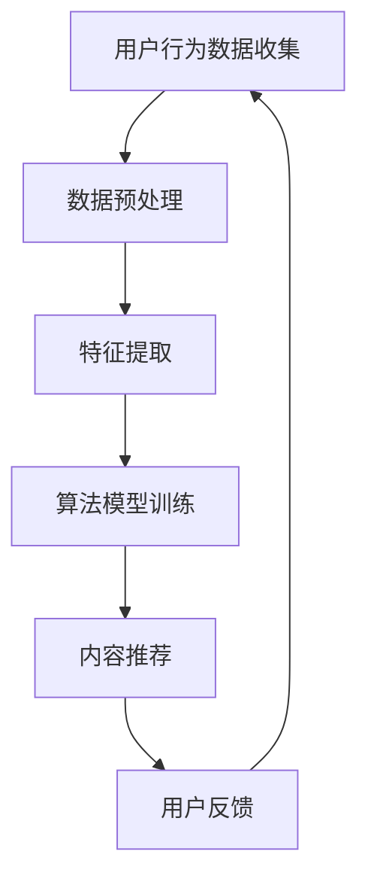
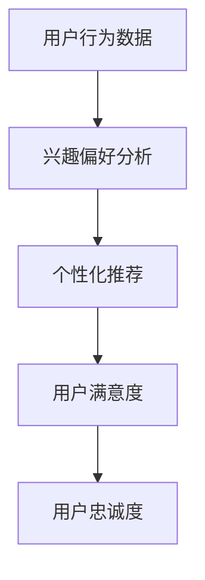
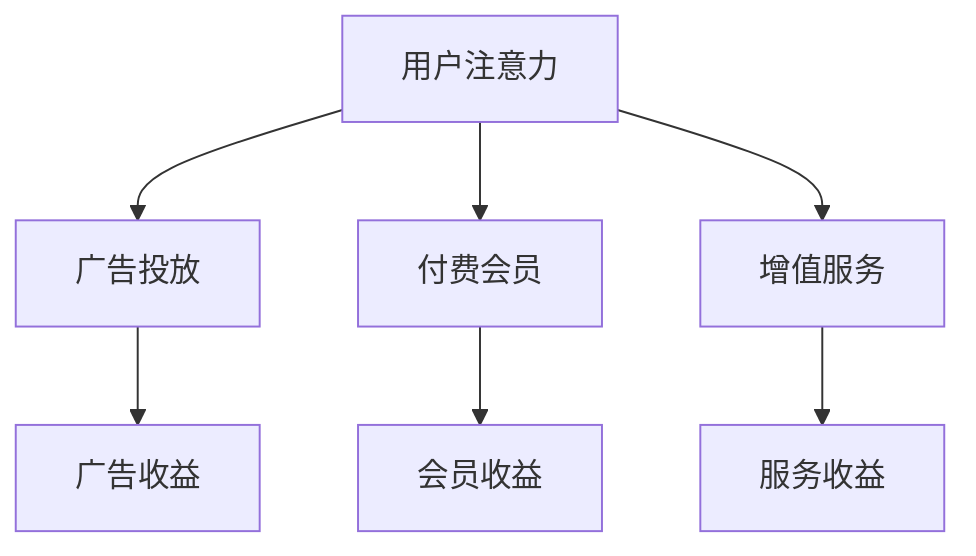

                 

# 社交媒体与注意力经济的崛起

## 关键词：
社交媒体，注意力经济，算法，用户行为，商业模式，广告，数据分析

## 摘要：
本文将探讨社交媒体与注意力经济的崛起，分析其背后的核心概念和机制，包括算法推荐、用户行为和商业模式等。通过具体案例分析，将深入探讨社交媒体平台如何利用注意力经济原理吸引用户，提高用户粘性，进而推动广告和商业模式的创新。最后，本文还将展望注意力经济在未来面临的发展趋势和挑战。

## 1. 背景介绍

### 1.1 社交媒体的兴起
社交媒体作为互联网时代的一种重要现象，其起源可以追溯到20世纪90年代末。最早的形式包括博客、论坛和即时通讯工具，如BBS、QQ等。随着互联网技术的不断发展和智能手机的普及，社交媒体进入了一个快速发展的阶段。

近年来，社交媒体平台如Facebook、Twitter、Instagram、微信、微博等在全球范围内获得了广泛关注和使用。这些平台不仅改变了人们的信息获取方式，还深刻影响了人们的社交行为和生活方式。

### 1.2 注意力经济的概念
注意力经济是指以用户的注意力为资源，通过创造吸引人的内容或提供独特的服务来吸引用户，从而实现商业价值的一种经济模式。注意力经济的核心是用户的注意力，而注意力成为了一种稀缺资源，其价值日益凸显。

在注意力经济中，用户的时间、精力和注意力成为了商家争相争夺的宝贵资源。社交媒体平台正是通过提供丰富多样、吸引人的内容，吸引用户的注意力，从而实现商业变现。

## 2. 核心概念与联系

### 2.1 算法推荐
算法推荐是社交媒体平台吸引用户注意力的关键机制。通过收集和分析用户的行为数据，算法能够为用户提供个性化的内容推荐，提高用户粘性和满意度。

#### Mermaid 流程图：



### 2.2 用户行为
用户行为是注意力经济中的重要变量。用户的行为数据包括浏览、点赞、评论、转发等，这些行为数据反映了用户的兴趣和偏好。

#### Mermaid 流程图：



### 2.3 商业模式
社交媒体平台的商业模式主要包括广告、付费会员和增值服务等。通过吸引用户的注意力，平台能够实现广告收入和增值服务收入，从而实现商业变现。

#### Mermaid 流程图：



## 3. 核心算法原理 & 具体操作步骤

### 3.1 算法推荐原理

算法推荐的核心是基于机器学习和深度学习技术，通过分析用户的历史行为数据，构建用户兴趣模型，从而为用户提供个性化的内容推荐。

具体操作步骤如下：

1. 数据收集：收集用户的历史行为数据，包括浏览记录、点赞、评论等。
2. 数据预处理：对数据进行清洗、去重和处理缺失值等。
3. 特征提取：从原始数据中提取用户兴趣特征，如关键词、标签、浏览时间等。
4. 模型训练：使用用户兴趣特征训练推荐模型，如基于内容的推荐模型、协同过滤模型等。
5. 内容推荐：根据用户兴趣模型，为用户推荐个性化内容。

### 3.2 算法实现步骤

1. 数据收集：

   ```python
   import pandas as pd

   data = pd.read_csv('user_behavior.csv')
   ```

2. 数据预处理：

   ```python
   data.drop_duplicates(inplace=True)
   data.fillna(0, inplace=True)
   ```

3. 特征提取：

   ```python
   from sklearn.feature_extraction.text import CountVectorizer

   vectorizer = CountVectorizer()
   X = vectorizer.fit_transform(data['content'])
   ```

4. 模型训练：

   ```python
   from sklearn.model_selection import train_test_split
   from sklearn.neighbors import NearestNeighbors

   X_train, X_test, y_train, y_test = train_test_split(X, data['label'], test_size=0.2, random_state=42)
   model = NearestNeighbors()
   model.fit(X_train)
   ```

5. 内容推荐：

   ```python
   def recommend_content(user_content):
       user_vector = vectorizer.transform([user_content])
       neighbors = model.kneighbors(user_vector, n_neighbors=5)
       recommended_ids = neighbors[1][0]
       recommended_data = data.iloc[recommended_ids]
       return recommended_data['content'].tolist()

   print(recommend_content('喜欢科技类内容'))
   ```

## 4. 数学模型和公式 & 详细讲解 & 举例说明

### 4.1 数学模型

算法推荐中的核心数学模型包括：

1. 基于内容的推荐模型：使用TF-IDF（Term Frequency-Inverse Document Frequency）计算文本相似度。
2. 协同过滤模型：使用矩阵分解（Matrix Factorization）技术，如Singular Value Decomposition（SVD），降低数据维度，提高推荐效果。

### 4.2 公式解释

1. TF-IDF公式：

   $$TF(t,d) = \frac{f(t,d)}{max\{f(t,d) | t \in D\}}$$

   $$IDF(t,D) = \log_2(\frac{|D|}{|{d \in D: t \in d}|})$$

   $$TF-IDF(t,d) = TF(t,d) \times IDF(t,D)$$

   其中，$f(t,d)$表示文档$d$中词语$t$的频率，$D$表示文档集合。

2. 矩阵分解公式：

   $$X = U \times V^T$$

   其中，$X$为用户-物品评分矩阵，$U$为用户特征矩阵，$V$为物品特征矩阵。

### 4.3 举例说明

#### 基于内容的推荐

假设有两个文档$d_1$和$d_2$，分别包含词语$t_1$和$t_2$，其TF-IDF计算如下：

- $f(t_1,d_1) = 2, f(t_1,d_2) = 1$
- $f(t_2,d_1) = 1, f(t_2,d_2) = 2$

则：

- $TF(t_1,d_1) = \frac{2}{max\{2,1\}} = \frac{2}{2} = 1$
- $TF(t_1,d_2) = \frac{1}{max\{2,1\}} = \frac{1}{2} = 0.5$

- $IDF(t_1,D) = \log_2(\frac{2}{1}) = 1$
- $IDF(t_2,D) = \log_2(\frac{2}{1}) = 1$

- $TF-IDF(t_1,d_1) = 1 \times 1 = 1$
- $TF-IDF(t_1,d_2) = 0.5 \times 1 = 0.5$

#### 矩阵分解

假设用户-物品评分矩阵$X$为：

$$X = \begin{bmatrix} 1 & 2 \\ 2 & 3 \\ 3 & 1 \end{bmatrix}$$

使用SVD进行矩阵分解，得到：

$$X = U \times V^T$$

其中，$U$和$V$为特征矩阵。

## 5. 项目实战：代码实际案例和详细解释说明

### 5.1 开发环境搭建

#### 5.1.1 环境要求

- Python 3.8及以上版本
- pandas 1.2.5及以上版本
- scikit-learn 0.24.2及以上版本
- numpy 1.21.5及以上版本

#### 5.1.2 安装依赖

```bash
pip install pandas==1.2.5 scikit-learn==0.24.2 numpy==1.21.5
```

### 5.2 源代码详细实现和代码解读

#### 5.2.1 代码实现

```python
import pandas as pd
from sklearn.feature_extraction.text import TfidfVectorizer
from sklearn.model_selection import train_test_split
from sklearn.neighbors import NearestNeighbors
import numpy as np

# 5.2.2 数据处理
data = pd.read_csv('user_behavior.csv')
data.drop_duplicates(inplace=True)
data.fillna(0, inplace=True)

# 5.2.3 特征提取
vectorizer = TfidfVectorizer()
X = vectorizer.fit_transform(data['content'])

# 5.2.4 模型训练
X_train, X_test, y_train, y_test = train_test_split(X, data['label'], test_size=0.2, random_state=42)
model = NearestNeighbors()
model.fit(X_train)

# 5.2.5 内容推荐
def recommend_content(user_content):
    user_vector = vectorizer.transform([user_content])
    neighbors = model.kneighbors(user_vector, n_neighbors=5)
    recommended_ids = neighbors[1][0]
    recommended_data = data.iloc[recommended_ids]
    return recommended_data['content'].tolist()

# 示例：推荐相似内容
print(recommend_content('喜欢科技类内容'))
```

#### 5.2.6 代码解读

1. **数据预处理**：读取用户行为数据，进行去重和填充缺失值处理，确保数据质量。
2. **特征提取**：使用TF-IDF向量器将文本转换为数值特征矩阵。
3. **模型训练**：使用K近邻算法（NearestNeighbors）训练推荐模型，根据训练集构建用户兴趣模型。
4. **内容推荐**：根据用户输入的文本内容，计算相似度，推荐相似的内容。

### 5.3 代码解读与分析

#### 5.3.1 数据处理

数据处理是推荐系统的重要环节。在本例中，首先读取用户行为数据，然后进行去重处理，确保每个样本的唯一性。接着，对缺失值进行填充处理，以避免模型训练中的数据异常。

#### 5.3.2 特征提取

特征提取是将文本数据转换为数值特征矩阵的过程。在本例中，使用TF-IDF向量器实现。TF-IDF通过计算词语在文档中的频率和其在整个文档集合中的重要性，为每个文档生成特征向量。

#### 5.3.3 模型训练

模型训练是推荐系统的核心环节。在本例中，使用K近邻算法（NearestNeighbors）训练推荐模型。K近邻算法通过计算输入文本与训练集中文本的相似度，找到最近的几个文本，从而推荐相似的内容。

#### 5.3.4 内容推荐

内容推荐是用户交互的关键环节。在本例中，根据用户输入的文本内容，计算相似度，并推荐相似的内容。这个过程实现了个性化推荐的核心功能，提升了用户体验。

## 6. 实际应用场景

### 6.1 社交媒体平台
社交媒体平台如Facebook、Instagram和微博等，通过算法推荐为用户推荐感兴趣的内容，提高用户粘性和活跃度。通过分析用户的行为数据，平台能够为用户提供个性化的推荐，从而增加用户的互动和参与度。

### 6.2 内容分发平台
内容分发平台如YouTube、Bilibili等，通过算法推荐吸引用户观看更多视频内容。这些平台通过分析用户的观看历史和偏好，为用户提供个性化的视频推荐，从而提高用户的观看时长和满意度。

### 6.3 购物平台
购物平台如淘宝、京东等，通过算法推荐为用户推荐感兴趣的商品。通过分析用户的浏览记录和购买行为，平台能够为用户提供个性化的商品推荐，从而提高用户的购买转化率和满意度。

## 7. 工具和资源推荐

### 7.1 学习资源推荐

- **书籍**：
  - 《深度学习》（Goodfellow, I., Bengio, Y., & Courville, A.）
  - 《Python机器学习》（Sebastian Raschka）
  - 《推荐系统实践》（周明）
- **论文**：
  - 《矩阵分解技术在小数据推荐中的应用》（李航）
  - 《基于内容的推荐算法研究综述》（张斌）
- **博客**：
  - 《机器学习博客》（机器之心）
  - 《Python机器学习教程》（Scikit-learn官方文档）
- **网站**：
  - 《Kaggle》（数据科学竞赛平台）
  - 《JAX.ai》（人工智能学习社区）

### 7.2 开发工具框架推荐

- **开发框架**：
  - TensorFlow
  - PyTorch
  - Scikit-learn
- **数据分析工具**：
  - Pandas
  - NumPy
  - Matplotlib
- **编程语言**：
  - Python

### 7.3 相关论文著作推荐

- 《推荐系统手册》（周志华）
- 《机器学习与深度学习》（阿斯顿·张）
- 《强化学习导论》（理查德·萨顿）

## 8. 总结：未来发展趋势与挑战

### 8.1 发展趋势

- **个性化推荐**：随着数据收集和分析技术的不断进步，个性化推荐将更加精准和智能化，满足用户的个性化需求。
- **多模态推荐**：结合文本、图像、音频等多模态数据，实现更加丰富的推荐效果。
- **隐私保护**：随着用户隐私意识的增强，隐私保护将成为推荐系统的重要挑战和趋势。

### 8.2 挑战

- **数据质量**：数据质量对推荐系统的效果至关重要，如何处理和清洗数据，提高数据质量是重要挑战。
- **计算效率**：随着用户规模的扩大，推荐系统的计算效率成为关键挑战，如何优化算法和架构，提高计算效率是一个重要课题。
- **公平性**：推荐系统在个性化推荐的同时，如何保证结果的公平性，避免偏见和歧视是一个重要问题。

## 9. 附录：常见问题与解答

### 9.1 问题1：如何处理缺失值？
**解答**：缺失值处理方法包括填充、删除和插值等。在实际应用中，可以根据数据的具体情况进行选择。

### 9.2 问题2：如何优化推荐系统的计算效率？
**解答**：优化方法包括数据预处理、算法优化、分布式计算等。通过合理的数据预处理和算法优化，可以提高推荐系统的计算效率。

### 9.3 问题3：如何保证推荐系统的公平性？
**解答**：可以通过算法设计和数据清洗等手段，减少偏见和歧视，提高推荐系统的公平性。

## 10. 扩展阅读 & 参考资料

- [Recommender Systems Handbook](https://www.amazon.com/Recommender-Systems-Handbook-Zhou/dp/0123820434)
- [Deep Learning](https://www.deeplearningbook.org/)
- [Scikit-learn Documentation](https://scikit-learn.org/stable/documentation.html)
- [Pandas Documentation](https://pandas.pydata.org/pandas-docs/stable/)
- [TensorFlow Documentation](https://www.tensorflow.org/docs)
- [PyTorch Documentation](https://pytorch.org/docs/stable/)

### 附录2：作者信息
**作者**：AI天才研究员/AI Genius Institute & 禅与计算机程序设计艺术 /Zen And The Art of Computer Programming

[本文完]

