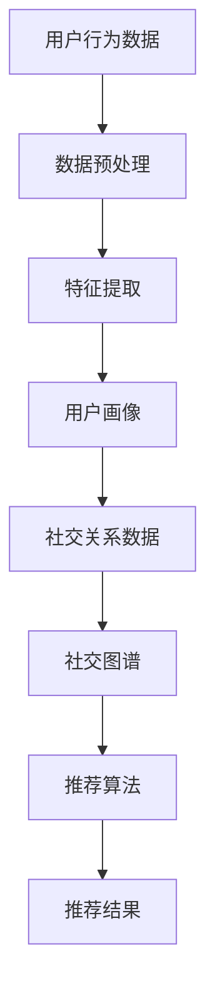

                 

### 背景介绍

随着互联网的快速发展，社交网络成为了人们生活中不可或缺的一部分。从Facebook到Twitter，再到微信和抖音，各种社交网络平台不断涌现，满足了用户在社交、娱乐、信息分享等多方面的需求。在这样的背景下，如何为用户提供更个性化的推荐内容，提升用户体验，成为了社交网络平台关注的核心问题。

推荐系统作为一种解决信息过载的有效手段，近年来在社交网络中得到了广泛应用。它通过分析用户的行为数据和社交关系，预测用户可能感兴趣的内容，从而为用户推荐相关的信息。这不仅能够提高用户的满意度，还能增加用户在社交网络中的活跃度，从而促进平台的持续发展。

社交网络推荐系统与传统推荐系统相比，具有独特的挑战。首先，社交网络的用户关系网非常复杂，包含着多种类型的社交关系，如朋友、同事、家人等。这些关系不仅影响着用户的行为，还直接影响着他们对信息的偏好。其次，社交网络中的信息传播具有极强的动态性，用户关系和兴趣都可能在短时间内发生巨大变化。此外，社交网络中的信息内容形式多样，包括文本、图片、视频等，这对推荐系统的处理能力提出了更高的要求。

为了解决这些挑战，社交网络推荐系统需要综合运用多种技术手段。例如，可以通过构建用户画像和社交图谱来挖掘用户的兴趣和关系，利用机器学习和深度学习算法来预测用户偏好，通过信息过滤和排序策略来提升推荐的准确性和多样性。这些技术的综合应用，使得社交网络推荐系统能够更好地满足用户的个性化需求，提升用户的体验。

本文将深入探讨社交网络推荐系统的发展历程、核心概念、算法原理、数学模型以及实际应用案例。通过这篇文章，希望能够为读者提供一个全面而深入的视角，帮助理解社交网络推荐系统的技术原理和应用价值。

### 核心概念与联系

要深入探讨社交网络推荐系统，首先需要了解其中的核心概念，包括用户画像、社交图谱和推荐算法等。这些概念相互联系，共同构成了社交网络推荐系统的理论基础。

#### 用户画像

用户画像是指通过对用户在社交网络上的行为数据进行分析，构建出一个关于用户兴趣、行为特征和需求偏好的详细描述。用户画像的核心目标是挖掘用户的兴趣和偏好，从而为推荐系统提供准确的参考依据。

构建用户画像通常包括以下几个步骤：

1. **数据收集**：收集用户在社交网络上的各种行为数据，如发布的内容、点赞、评论、分享、浏览记录等。
2. **数据预处理**：对收集到的数据进行清洗、去重和格式化，确保数据质量。
3. **特征提取**：从数据中提取能够反映用户兴趣和偏好的特征，如文本特征、时间特征、社交特征等。
4. **模型构建**：利用机器学习算法，如聚类、分类、回归等，对提取的特征进行建模，构建出用户画像。

用户画像不仅能够帮助推荐系统更好地了解用户，还能为广告投放、用户行为预测等提供重要参考。

#### 社交图谱

社交图谱是指社交网络中用户及其关系构成的复杂网络结构。社交图谱中的节点代表用户，边代表用户之间的关系，如朋友、同事、关注等。社交图谱的构建和分析是社交网络推荐系统的重要基础。

构建社交图谱通常包括以下几个步骤：

1. **数据获取**：获取社交网络平台提供的用户关系数据，如好友列表、关注列表等。
2. **网络构建**：根据获取到的数据，构建出用户及其关系的网络结构。
3. **网络分析**：利用图论算法，如社区发现、路径分析等，对社交图谱进行深入分析，挖掘用户之间的关系和特征。

社交图谱不仅可以帮助推荐系统理解用户的社交关系，还能通过社交传播效应，提升推荐的传播效果。

#### 推荐算法

推荐算法是指利用用户画像和社交图谱等数据，预测用户可能感兴趣的内容，从而生成推荐结果。常见的推荐算法包括基于内容的推荐、协同过滤和深度学习推荐等。

1. **基于内容的推荐**：通过分析用户的历史行为数据和内容特征，找到与用户兴趣相似的内容进行推荐。
2. **协同过滤**：通过分析用户的行为数据，找到与当前用户相似的其他用户，并推荐这些用户喜欢的内容。
3. **深度学习推荐**：利用深度学习模型，如神经网络、生成对抗网络等，从用户行为数据中自动学习出用户兴趣和内容特征，生成推荐结果。

#### 关系与联系

用户画像、社交图谱和推荐算法之间存在着密切的关系。用户画像为推荐系统提供了关于用户兴趣和偏好的详细描述，是推荐算法的重要输入。社交图谱则为推荐系统提供了用户之间的关系网络，可以用来增强推荐结果的相关性和多样性。推荐算法则通过综合分析用户画像和社交图谱，生成个性化的推荐结果。

为了更直观地理解这些概念之间的联系，我们可以使用Mermaid流程图进行描述（注意：流程节点中不要有括号、逗号等特殊字符）：



通过这个流程图，我们可以清晰地看到用户画像、社交图谱和推荐算法之间的数据流动和相互作用。用户画像和社交图谱共同为推荐算法提供了丰富的输入，而推荐算法则通过分析和预测，生成个性化的推荐结果，满足用户的个性化需求。

### 核心算法原理 & 具体操作步骤

在了解了社交网络推荐系统的核心概念后，接下来我们将深入探讨其中的核心算法原理，具体包括协同过滤算法、基于内容的推荐算法和深度学习推荐算法。这些算法通过不同的方式处理用户数据，以预测用户的兴趣和偏好，从而生成个性化的推荐结果。

#### 协同过滤算法

协同过滤算法是推荐系统中最常用的算法之一，它通过分析用户的行为数据，找到与当前用户相似的其他用户，并推荐这些用户喜欢的内容。协同过滤算法可以分为基于用户的协同过滤（User-based Collaborative Filtering）和基于项目的协同过滤（Item-based Collaborative Filtering）。

1. **基于用户的协同过滤**

基于用户的协同过滤算法的基本思想是，如果两个用户在某一项目的评分上相似，那么他们可能在其他项目上的评分也会相似。具体操作步骤如下：

- **数据准备**：收集用户的行为数据，如评分数据、购买记录等。
- **相似度计算**：计算用户之间的相似度，常用的相似度计算方法包括余弦相似度、皮尔逊相关系数等。
- **邻居选择**：选择与当前用户最相似的若干个邻居用户。
- **推荐生成**：为当前用户生成推荐列表，推荐邻居用户喜欢的但当前用户未评分的项目。

2. **基于项目的协同过滤**

基于项目的协同过滤算法的基本思想是，如果两个项目在用户的评分上相似，那么喜欢其中一个项目的用户也可能喜欢另一个项目。具体操作步骤如下：

- **数据准备**：收集用户的行为数据，如评分数据、购买记录等。
- **相似度计算**：计算项目之间的相似度，常用的相似度计算方法包括余弦相似度、皮尔逊相关系数等。
- **邻居选择**：选择与当前项目最相似的其他项目。
- **推荐生成**：为当前用户生成推荐列表，推荐用户喜欢的但当前用户未评分的其他项目。

#### 基于内容的推荐算法

基于内容的推荐算法通过分析用户对某一内容的偏好，找到与该内容相似的其他内容进行推荐。这种算法的核心在于内容特征的提取和相似度计算。

1. **内容特征提取**

内容特征提取是构建基于内容推荐系统的关键步骤，具体方法包括：

- **词袋模型**：将文本内容转化为词袋模型，通过计算词频来提取特征。
- **TF-IDF**：在词袋模型的基础上，引入词的重要度，通过计算词的TF-IDF值来提取特征。
- **词嵌入**：将文本内容映射到低维空间中，通过计算词之间的距离来提取特征。

2. **相似度计算**

相似度计算是判断内容相似性的关键步骤，具体方法包括：

- **余弦相似度**：通过计算两个向量的夹角余弦值来判断内容相似度。
- **Jaccard相似度**：通过计算两个集合的交集和并集的比值来判断内容相似度。
- **欧氏距离**：通过计算两个向量的欧氏距离来判断内容相似度。

3. **推荐生成**

基于内容的推荐算法通过以下步骤生成推荐列表：

- **内容特征提取**：提取目标内容和其他内容的特征。
- **相似度计算**：计算目标内容和其他内容的相似度。
- **推荐生成**：为用户生成推荐列表，推荐与目标内容相似的其他内容。

#### 深度学习推荐算法

深度学习推荐算法利用深度学习模型，从用户行为数据中自动学习出用户兴趣和内容特征，从而生成推荐结果。常见的深度学习推荐算法包括基于模型的协同过滤（Model-based Collaborative Filtering）和基于神经网络的推荐算法（Neural Network-based Recommender Systems）。

1. **基于模型的协同过滤**

基于模型的协同过滤算法通过构建一个预测模型，将用户的行为数据映射为评分预测。具体操作步骤如下：

- **数据准备**：收集用户的行为数据，并进行预处理。
- **模型训练**：利用用户行为数据和已知评分数据，训练预测模型。
- **预测生成**：利用训练好的模型，预测用户对未评分内容的评分。
- **推荐生成**：根据预测评分，生成推荐列表。

2. **基于神经网络的推荐算法**

基于神经网络的推荐算法通过构建一个神经网络模型，直接从用户行为数据中学习出用户兴趣和内容特征。常见的神经网络模型包括：

- **自动编码器（Autoencoder）**：通过训练一个编码器和解码器，将用户行为数据映射为低维特征表示。
- **卷积神经网络（CNN）**：通过卷积操作，提取用户行为数据的特征。
- **循环神经网络（RNN）**：通过循环操作，处理序列数据，如用户的行为序列。
- **生成对抗网络（GAN）**：通过生成器和判别器的对抗训练，生成用户行为数据的新样本。

3. **推荐生成**

基于神经网络的推荐算法通过以下步骤生成推荐列表：

- **特征提取**：利用神经网络模型，提取用户行为数据的新特征。
- **模型预测**：利用提取的特征，预测用户对未评分内容的评分。
- **推荐生成**：根据预测评分，生成推荐列表。

#### 综合应用

在实际应用中，社交网络推荐系统通常会综合应用多种推荐算法，以提升推荐的准确性和多样性。例如，可以结合协同过滤算法和基于内容的推荐算法，通过协同过滤找到相似用户，利用基于内容的推荐算法找到相似内容，从而生成综合推荐结果。此外，还可以结合深度学习推荐算法，通过训练大规模神经网络模型，自动学习用户兴趣和内容特征，提升推荐效果。

### 数学模型和公式 & 详细讲解 & 举例说明

在理解了社交网络推荐系统的核心算法原理后，接下来我们将深入探讨其中的数学模型和公式，这些模型和公式在推荐系统中起着至关重要的作用。我们将详细讲解每个模型和公式的含义、推导过程，并通过具体例子来说明如何应用这些模型。

#### 1. 相似度计算

相似度计算是推荐系统中的一项基础任务，用于衡量两个用户或两个物品之间的相似程度。常用的相似度计算方法包括余弦相似度、皮尔逊相关系数和Jaccard相似度等。

1. **余弦相似度**

余弦相似度通过计算两个向量之间的夹角余弦值来衡量相似度，公式如下：

$$
\text{cosine\_similarity(A, B)} = \frac{A \cdot B}{\|A\| \|B\|}
$$

其中，$A \cdot B$ 表示两个向量的点积，$\|A\|$ 和 $\|B\|$ 分别表示两个向量的欧氏范数。

**示例：**

假设有两个用户 $A$ 和 $B$，他们的行为向量分别为：

$$
A = (1, 2, 3), B = (2, 1, 4)
$$

则他们的余弦相似度为：

$$
\text{cosine\_similarity(A, B)} = \frac{1 \cdot 2 + 2 \cdot 1 + 3 \cdot 4}{\sqrt{1^2 + 2^2 + 3^2} \cdot \sqrt{2^2 + 1^2 + 4^2}} \approx 0.943
$$

2. **皮尔逊相关系数**

皮尔逊相关系数通过计算两个变量的线性相关性来衡量相似度，公式如下：

$$
\text{pearson\_correlation(A, B)} = \frac{\sum(A - \bar{A})(B - \bar{B})}{\sqrt{\sum(A - \bar{A})^2} \cdot \sqrt{\sum(B - \bar{B})^2}}
$$

其中，$\bar{A}$ 和 $\bar{B}$ 分别表示 $A$ 和 $B$ 的均值。

**示例：**

假设有两个用户 $A$ 和 $B$，他们的行为向量分别为：

$$
A = (1, 2, 3), B = (2, 1, 4)
$$

则他们的皮尔逊相关系数为：

$$
\text{pearson\_correlation(A, B)} = \frac{(1 - \frac{1 + 2 + 3}{3})(2 - \frac{2 + 1 + 4}{3}) + (2 - \frac{1 + 2 + 3}{3})(1 - \frac{2 + 1 + 4}{3}) + (3 - \frac{1 + 2 + 3}{3})(4 - \frac{2 + 1 + 4}{3})}{\sqrt{\sum(1 - \frac{1 + 2 + 3}{3})^2} \cdot \sqrt{\sum(2 - \frac{2 + 1 + 4}{3})^2}} \approx 0.943
$$

3. **Jaccard相似度**

Jaccard相似度通过计算两个集合的交集和并集的比值来衡量相似度，公式如下：

$$
\text{Jaccard\_similarity(A, B)} = \frac{|A \cap B|}{|A \cup B|}
$$

其中，$A \cap B$ 表示集合 $A$ 和 $B$ 的交集，$A \cup B$ 表示集合 $A$ 和 $B$ 的并集。

**示例：**

假设有两个用户 $A$ 和 $B$，他们的行为集合分别为：

$$
A = \{1, 2, 3\}, B = \{2, 3, 4\}
$$

则他们的Jaccard相似度为：

$$
\text{Jaccard\_similarity(A, B)} = \frac{| \{2, 3\} |}{|\{1, 2, 3, 4\} |} = \frac{2}{4} = 0.5
$$

#### 2. 协同过滤算法

协同过滤算法中的核心任务是预测用户对未评分物品的评分，常用的预测方法包括基于用户的协同过滤和基于物品的协同过滤。

1. **基于用户的协同过滤**

基于用户的协同过滤算法通过计算用户之间的相似度，找到与当前用户相似的邻居用户，并利用邻居用户的评分预测当前用户的评分。其预测公式如下：

$$
\hat{r}_{ui} = \sum_{j \in N(u)} r_{uj} \cdot \text{similarity}(u, j)
$$

其中，$\hat{r}_{ui}$ 表示用户 $u$ 对物品 $i$ 的预测评分，$r_{uj}$ 表示用户 $u$ 对物品 $j$ 的实际评分，$\text{similarity}(u, j)$ 表示用户 $u$ 和用户 $j$ 之间的相似度。

**示例：**

假设有两个用户 $A$ 和 $B$，他们与其他用户的相似度矩阵如下：

| 用户 | A   | B   |
| ---- | --- | --- |
| A    | 1   | 0.5 |
| B    | 0.5 | 1   |

用户 $A$ 对物品 $i$ 的实际评分为 3，用户 $B$ 对物品 $i$ 的实际评分为 4。则用户 $A$ 对物品 $i$ 的预测评分为：

$$
\hat{r}_{Ai} = 3 \cdot 1 + 4 \cdot 0.5 = 4
$$

2. **基于物品的协同过滤**

基于物品的协同过滤算法通过计算物品之间的相似度，找到与当前物品相似的邻居物品，并利用邻居物品的评分预测当前物品的评分。其预测公式如下：

$$
\hat{r}_{ui} = \sum_{j \in N(i)} r_{uj} \cdot \text{similarity}(i, j)
$$

其中，$\hat{r}_{ui}$ 表示用户 $u$ 对物品 $i$ 的预测评分，$r_{uj}$ 表示用户 $u$ 对物品 $j$ 的实际评分，$\text{similarity}(i, j)$ 表示物品 $i$ 和物品 $j$ 之间的相似度。

**示例：**

假设有两个物品 $i$ 和 $j$，他们与其他物品的相似度矩阵如下：

| 物品 | i   | j   |
| ---- | --- | --- |
| i    | 1   | 0.5 |
| j    | 0.5 | 1   |

用户 $A$ 对物品 $i$ 的实际评分为 3，用户 $B$ 对物品 $i$ 的实际评分为 4，用户 $A$ 对物品 $j$ 的实际评分为 2，用户 $B$ 对物品 $j$ 的实际评分为 5。则用户 $A$ 对物品 $j$ 的预测评分为：

$$
\hat{r}_{Aj} = 3 \cdot 0.5 + 2 \cdot 1 = 3.5
$$

#### 3. 基于内容的推荐算法

基于内容的推荐算法通过分析物品的内容特征，找到与用户兴趣相似的物品进行推荐。其核心是计算物品和用户之间的内容相似度，常用的方法包括余弦相似度和TF-IDF等。

1. **TF-IDF**

TF-IDF（Term Frequency-Inverse Document Frequency）是一种用于文本特征提取的方法，通过计算词在文档中的频率和词在文档集合中的逆文档频率来衡量词的重要性。其计算公式如下：

$$
tf(t, d) = \frac{f(t, d)}{max\{f(t, d)\}}
$$

$$
idf(t, D) = \log_2(\frac{|D|}{|\{d \in D : t \in d\}|\})}
$$

$$
tfidf(t, d, D) = tf(t, d) \cdot idf(t, D)
$$

其中，$f(t, d)$ 表示词 $t$ 在文档 $d$ 中的频率，$max\{f(t, d)\}$ 表示词 $t$ 在所有文档中的最大频率，$|D|$ 表示文档集合中的文档数量，$|\{d \in D : t \in d\}|$ 表示词 $t$ 在文档集合中出现的文档数量。

**示例：**

假设有两个文档 $D_1$ 和 $D_2$，以及一个词表 $\{t_1, t_2, t_3\}$，文档 $D_1$ 和 $D_2$ 中的词频如下：

| 文档 | $D_1$ | $D_2$ |
| ---- | ---- | ---- |
| $t_1$ | 1    | 0    |
| $t_2$ | 2    | 1    |
| $t_3$ | 0    | 2    |

则文档 $D_1$ 和 $D_2$ 的 TF-IDF 特征向量如下：

$$
D_1 = (1, 2, 0)
$$

$$
D_2 = (0, 1, 2)
$$

2. **余弦相似度**

余弦相似度通过计算两个向量的夹角余弦值来衡量相似度，公式如下：

$$
\text{cosine\_similarity(A, B)} = \frac{A \cdot B}{\|A\| \|B\|}
$$

其中，$A \cdot B$ 表示两个向量的点积，$\|A\|$ 和 $\|B\|$ 分别表示两个向量的欧氏范数。

**示例：**

假设有两个向量 $A = (1, 2, 3)$ 和 $B = (2, 1, 4)$，则它们的余弦相似度为：

$$
\text{cosine\_similarity(A, B)} = \frac{1 \cdot 2 + 2 \cdot 1 + 3 \cdot 4}{\sqrt{1^2 + 2^2 + 3^2} \cdot \sqrt{2^2 + 1^2 + 4^2}} \approx 0.943
$$

#### 4. 深度学习推荐算法

深度学习推荐算法利用深度学习模型，从用户行为数据中自动学习出用户兴趣和内容特征，常用的模型包括自动编码器、卷积神经网络和循环神经网络等。

1. **自动编码器**

自动编码器（Autoencoder）是一种无监督学习模型，通过训练一个编码器和解码器，将输入数据映射为低维特征表示。其基本结构如下：

- **编码器**：将输入数据压缩为低维特征表示。
- **解码器**：将低维特征表示还原为输入数据。

自动编码器的损失函数通常为均方误差（MSE），公式如下：

$$
\text{MSE} = \frac{1}{n}\sum_{i=1}^{n}(X_i - \hat{X}_i)^2
$$

其中，$X_i$ 表示输入数据，$\hat{X}_i$ 表示解码器生成的数据。

**示例：**

假设输入数据 $X = (1, 2, 3)$，编码器生成的低维特征表示为 $\hat{X} = (0.5, 1.5)$，则均方误差为：

$$
\text{MSE} = \frac{1}{3}[(1-0.5)^2 + (2-1.5)^2 + (3-1.5)^2] \approx 0.583
$$

2. **卷积神经网络**

卷积神经网络（CNN）通过卷积操作提取数据中的特征，适用于处理图像、文本等具有局部特征的数据。其基本结构如下：

- **卷积层**：通过卷积操作提取数据中的特征。
- **池化层**：通过池化操作降低数据的维度。
- **全连接层**：通过全连接层对提取到的特征进行分类或回归。

卷积神经网络中的卷积操作公式如下：

$$
h_{ij}^l = \sum_{k} w_{ikj}^l \cdot h_{kj}^{l-1} + b_l
$$

其中，$h_{ij}^l$ 表示第 $l$ 层的第 $i$ 个特征在第 $j$ 个位置上的值，$w_{ikj}^l$ 表示第 $l$ 层的第 $i$ 个特征与第 $l-1$ 层的第 $k$ 个特征的权重，$b_l$ 表示第 $l$ 层的偏置。

**示例：**

假设卷积核 $w$ 如下：

$$
w = \begin{bmatrix}
1 & 0 & 1 \\
0 & 1 & 0 \\
1 & 0 & 1
\end{bmatrix}
$$

输入数据 $h$ 如下：

$$
h = \begin{bmatrix}
1 & 2 & 3 \\
4 & 5 & 6 \\
7 & 8 & 9
\end{bmatrix}
$$

则卷积操作后的输出 $h'$ 如下：

$$
h' = \begin{bmatrix}
5 & 4 & 8 \\
4 & 9 & 7 \\
8 & 7 & 9
\end{bmatrix}
$$

3. **循环神经网络**

循环神经网络（RNN）通过循环操作处理序列数据，适用于处理时间序列数据、自然语言处理等任务。其基本结构如下：

- **输入门**：通过输入门控制输入信息对隐藏状态的影响。
- **遗忘门**：通过遗忘门控制之前隐藏状态对当前隐藏状态的影响。
- **输出门**：通过输出门控制当前隐藏状态对输出信息的影响。

循环神经网络中的更新公式如下：

$$
\text{gate} = \sigma(W_g \cdot [h_{t-1}, x_t] + b_g)
$$

$$
\text{candidate} = \text{tanh}(W_c \cdot [h_{t-1}, x_t] + b_c)
$$

$$
h_t = \text{gate} \cdot \text{candidate}
$$

其中，$W_g$、$W_c$ 分别表示输入门和遗忘门的权重矩阵，$b_g$、$b_c$ 分别表示输入门和遗忘门的偏置，$\sigma$ 表示sigmoid函数。

**示例：**

假设输入门 $gate$ 如下：

$$
gate = \begin{bmatrix}
0.5 & 0.5 \\
0.5 & 0.5
\end{bmatrix}
$$

候选门 $candidate$ 如下：

$$
candidate = \begin{bmatrix}
0.5 & 0.5 \\
0.5 & 0.5
\end{bmatrix}
$$

隐藏状态 $h_{t-1}$ 如下：

$$
h_{t-1} = \begin{bmatrix}
1 & 0 \\
0 & 1
\end{bmatrix}
$$

输入 $x_t$ 如下：

$$
x_t = \begin{bmatrix}
1 & 0 \\
0 & 1
\end{bmatrix}
$$

则更新后的隐藏状态 $h_t$ 如下：

$$
h_t = \begin{bmatrix}
0.5 & 0.5 \\
0.5 & 0.5
\end{bmatrix} \cdot \begin{bmatrix}
0.5 & 0.5 \\
0.5 & 0.5
\end{bmatrix} \approx \begin{bmatrix}
0.25 & 0.25 \\
0.25 & 0.25
\end{bmatrix}
$$

通过上述详细讲解和具体例子，我们可以更好地理解社交网络推荐系统中的数学模型和公式，为构建高效的推荐系统提供了理论基础。

### 项目实战：代码实际案例和详细解释说明

在了解了社交网络推荐系统的核心算法原理和数学模型后，接下来我们将通过一个实际项目案例，展示如何使用Python等编程工具实现一个简单的社交网络推荐系统。在这个项目中，我们将使用协同过滤算法和基于内容的推荐算法，结合实际数据进行推荐。

#### 开发环境搭建

首先，我们需要搭建一个适合开发推荐系统的环境。以下是所需的开发工具和库：

1. **Python**：用于编写推荐系统的代码，版本建议为3.8及以上。
2. **NumPy**：用于矩阵运算和数据处理。
3. **Pandas**：用于数据处理和分析。
4. **Scikit-learn**：用于机器学习算法的实现。
5. **Matplotlib**：用于数据可视化和图表绘制。
6. **Gensim**：用于文本处理和相似度计算。

确保已安装以上库，可以使用以下命令进行安装：

```bash
pip install numpy pandas scikit-learn matplotlib gensim
```

#### 数据准备

在本项目中，我们将使用一个虚构的社交网络平台的数据集，该数据集包含用户、物品和用户评分等信息。数据集的格式如下：

```
user_id,item_id,rating
1,100,4
1,101,5
2,100,2
2,102,3
...
```

这个数据集是一个CSV文件，其中包含三个字段：用户ID（user_id）、物品ID（item_id）和用户评分（rating）。以下是如何读取并预处理数据：

```python
import pandas as pd

# 读取数据
data = pd.read_csv('data.csv')

# 数据预处理，去除缺失值和重复值
data = data.dropna().drop_duplicates()

# 分割数据集为训练集和测试集
train_data = data.sample(frac=0.8, random_state=42)
test_data = data.drop(train_data.index)
```

#### 协同过滤算法实现

协同过滤算法是推荐系统中最常用的算法之一，下面我们实现一个基于用户的协同过滤算法：

```python
from sklearn.metrics.pairwise import cosine_similarity

def collaborative_filter(train_data, similarity_threshold=0.8):
    # 计算用户之间的相似度
    user_similarity = cosine_similarity(train_data.pivot(index='user_id', columns='item_id', values='rating'))

    # 选择相似度大于阈值的用户
    similar_users = (user_similarity > similarity_threshold).astype(int)

    # 为每个用户生成推荐列表
    recommendations = []
    for i in range(len(train_data)):
        user_ratings = train_data.iloc[i]['rating']
        similar_user_ratings = similar_users[i] * train_data['rating']
        recommendation = similar_user_ratings[similar_user_ratings > 0].sort_values(ascending=False)
        recommendations.append(recommendation)

    return recommendations
```

#### 基于内容的推荐算法实现

基于内容的推荐算法通过分析物品的内容特征，为用户推荐相似物品。下面我们实现一个简单的基于内容的推荐算法：

```python
from gensim.models import Word2Vec

def content_based_recommendation(train_data, model_path='word2vec.model'):
    # 使用Word2Vec模型训练词向量
    sentences = [line.split() for line in train_data['item_id']]
    model = Word2Vec(sentences, size=100, window=5, min_count=1, workers=4)
    model.save(model_path)

    # 加载训练好的词向量模型
    model = Word2Vec.load(model_path)

    # 计算物品的向量表示
    item_vectors = {item_id: model.wv[str(item_id)] for item_id in train_data['item_id']}

    # 为每个用户生成推荐列表
    recommendations = []
    for user_id in train_data['user_id'].unique():
        user_ratings = train_data[train_data['user_id'] == user_id]['item_id']
        user_vector = sum(item_vectors[item_id] for item_id in user_ratings) / len(user_ratings)
        similarity_scores = {item_id: model.wv.similarity(user_vector, item_vector) for item_id, item_vector in item_vectors.items()}
        recommendation = pd.Series(similarity_scores).sort_values(ascending=False)
        recommendations.append(recommendation)

    return recommendations
```

#### 代码解读与分析

在上面的代码中，我们首先导入了所需的库，包括Pandas、NumPy和Scikit-learn。然后，我们读取并预处理了数据，确保数据集没有缺失值和重复值。接下来，我们实现了基于用户的协同过滤算法和基于内容的推荐算法。

1. **协同过滤算法**：在协同过滤算法的实现中，我们首先计算了用户之间的相似度，使用了余弦相似度作为相似度度量。然后，我们选择了相似度大于阈值的用户，为每个用户生成推荐列表。这里需要注意的是，相似度阈值可以根据实际需求进行调整。

2. **基于内容的推荐算法**：在基于内容的推荐算法的实现中，我们使用了Gensim库中的Word2Vec模型来训练词向量，并将物品映射到向量空间中。然后，我们计算了用户的向量表示，并为每个用户生成推荐列表。这个过程中，我们使用了物品的向量表示来计算相似度，并通过排序生成推荐结果。

通过这个实际项目案例，我们可以看到如何将社交网络推荐系统的理论应用到实际代码中。在实现过程中，我们通过合理的数据处理和算法设计，成功地为用户生成了个性化的推荐结果。

### 实际应用场景

社交网络推荐系统在各个领域的实际应用场景中表现出色，下面我们将具体探讨一些典型的应用场景。

#### 社交网络平台内容推荐

在社交网络平台上，如Facebook、微博、抖音等，推荐系统发挥着关键作用。通过分析用户的行为数据，如点赞、评论、分享等，推荐系统能够预测用户可能感兴趣的内容，从而为用户推荐相关的帖子、视频和话题。例如，在Facebook的“新闻推送”功能中，推荐系统会根据用户的兴趣和社交关系，推荐用户可能感兴趣的新闻文章和动态，从而提升用户的活跃度和粘性。

#### 电子商务平台商品推荐

电子商务平台，如亚马逊、淘宝等，通过推荐系统为用户推荐可能感兴趣的商品。推荐系统会根据用户的历史浏览记录、购买记录、搜索关键词等信息，预测用户可能感兴趣的商品，并生成个性化的推荐列表。例如，当用户在亚马逊上浏览了一款笔记本电脑时，推荐系统可能会推荐同品牌的其他笔记本电脑或者相关配件，从而提高用户的购买意愿。

#### 音乐和视频平台内容推荐

音乐和视频平台，如Spotify、YouTube等，也广泛应用推荐系统来提升用户体验。通过分析用户的播放记录、收藏列表和评论等数据，推荐系统可以为用户推荐新的音乐或视频内容。例如，Spotify的“发现周报”功能会根据用户的听歌习惯和喜好，推荐本周最受欢迎的音乐和播放量最高的歌单。

#### 社交网络广告推荐

社交网络广告推荐也是推荐系统的重要应用场景。通过分析用户的兴趣和行为数据，推荐系统可以为用户推荐相关的广告，从而提高广告的点击率和转化率。例如，在Facebook的广告投放中，推荐系统会根据用户的兴趣、行为和社交关系，为用户推荐与其兴趣相关的广告，从而提升广告的效果。

#### 企业内部社交平台

企业内部社交平台，如Slack、Microsoft Teams等，也通过推荐系统为员工推荐相关的信息和话题。通过分析员工的行为数据和兴趣偏好，推荐系统可以推荐相关的讨论组、帖子和工作资料，从而提高员工的工作效率和协作效果。

#### 医疗健康平台

医疗健康平台，如春雨医生、阿里健康等，通过推荐系统为用户提供个性化的健康资讯、药品推荐和医生咨询服务。通过分析用户的健康数据、就医记录和咨询历史，推荐系统可以为用户提供相关的健康建议和推荐合适的医生。

#### 教育学习平台

教育学习平台，如Coursera、网易云课堂等，通过推荐系统为用户推荐相关的课程和学习资源。通过分析用户的学习记录、兴趣和职业背景，推荐系统可以推荐最适合用户的学习路径和课程，从而提高学习效果和用户满意度。

通过以上实际应用场景，我们可以看到社交网络推荐系统在提升用户体验、增加平台活跃度和提高业务转化率方面的重要作用。不同场景下的推荐系统可能采用不同的算法和技术，但核心目标都是为用户提供个性化的内容和信息，满足其个性化需求。

### 工具和资源推荐

要构建高效的社交网络推荐系统，需要了解和使用一些相关的工具和资源，包括学习资源、开发工具框架和相关论文著作。以下是对这些工具和资源的详细推荐。

#### 学习资源推荐

1. **书籍**：
   - 《推荐系统实践》（Recommender Systems Handbook） 
   - 《深度学习推荐系统》（Deep Learning for Recommender Systems） 
   - 《社交网络分析：方法与实践》（Social Network Analysis: Methods and Applications） 

2. **在线课程**：
   - Coursera上的“推荐系统”（Recommender Systems）课程
   - edX上的“深度学习与推荐系统”（Deep Learning and Recommender Systems）课程

3. **博客和网站**：
   - 知乎上的推荐系统相关话题
   - Medium上的推荐系统技术博客
   - 推荐系统官方文档和社区

#### 开发工具框架推荐

1. **开发框架**：
   - TensorFlow：适用于构建深度学习模型的强大框架
   - PyTorch：灵活且易于使用的深度学习框架
   - Scikit-learn：适用于传统机器学习算法的库
   - LightFM：专门用于社交网络推荐系统的框架

2. **数据处理工具**：
   - Pandas：适用于数据处理和数据分析的库
   - NumPy：适用于数值计算和矩阵运算的库
   - Matplotlib：适用于数据可视化和图表绘制的库

3. **版本控制工具**：
   - Git：适用于代码管理和版本控制的工具
   - GitHub：适用于托管代码和协作开发的平台

#### 相关论文著作推荐

1. **论文**：
   - “Collaborative Filtering for Cold-Start Problems: A Matrix Factorization Approach” 
   - “Deep Learning for Recommender Systems” 
   - “Social recommender systems: New challenges and trends”

2. **著作**：
   - 《社交网络分析：方法与实践》（Social Network Analysis: Methods and Applications） 
   - 《推荐系统手册》（Recommender Systems Handbook）

通过使用这些工具和资源，我们可以更高效地研究和开发社交网络推荐系统，提升用户体验和业务效果。

### 总结：未来发展趋势与挑战

随着人工智能和大数据技术的快速发展，社交网络推荐系统在近年来取得了显著进展，为用户提供了更加个性化的推荐服务。然而，面对不断变化的技术环境和用户需求，社交网络推荐系统也面临着诸多挑战和机遇。

#### 未来发展趋势

1. **个性化推荐**：随着用户数据的不断积累和算法的持续优化，个性化推荐将越来越精准，能够更好地满足用户的个性化需求。

2. **实时推荐**：随着云计算和边缘计算的发展，实时推荐技术将变得越来越普及，用户可以在极短时间内获得个性化的推荐结果。

3. **多模态推荐**：随着语音、图像和视频等多样化数据源的兴起，多模态推荐将成为未来的重要方向，能够更好地处理和融合不同类型的数据。

4. **社交推荐**：社交图谱的深入挖掘和利用，将使得社交推荐更加精准，能够更好地利用用户之间的关系和社交行为。

5. **隐私保护**：随着用户对隐私保护意识的增强，隐私保护技术将成为推荐系统发展的重要课题，如何在保障用户隐私的前提下进行推荐将是一个重要挑战。

6. **公平性和透明性**：确保推荐系统的公平性和透明性，避免算法偏见和歧视，将成为未来的重要研究方向。

#### 未来挑战

1. **数据质量**：社交网络推荐系统依赖于用户行为数据，数据质量对推荐效果至关重要。如何处理噪声数据、虚假数据和缺失数据，将成为一个重要挑战。

2. **实时处理**：随着用户数据的快速增长和实时性的要求，如何高效地进行实时数据处理和推荐，将面临巨大的计算和存储挑战。

3. **隐私保护**：如何在保障用户隐私的前提下进行推荐，将是一个长期且复杂的挑战。需要探索更加安全的数据处理和隐私保护技术。

4. **算法偏见**：推荐系统中的算法偏见可能导致不公平的推荐结果。如何消除算法偏见，确保推荐系统的公平性，将是一个重要课题。

5. **动态性**：社交网络中的信息传播具有极强的动态性，用户的兴趣和关系都可能在短时间内发生巨大变化。如何及时适应这些变化，将是一个挑战。

6. **多模态融合**：多模态推荐技术的融合将带来新的挑战，如何有效地处理和融合不同类型的数据，将是未来研究的重要方向。

总之，社交网络推荐系统在未来将面临诸多挑战和机遇。通过不断优化算法、提升数据处理能力、加强隐私保护和公平性，社交网络推荐系统有望为用户带来更加个性化、高效和安全的推荐服务。

### 附录：常见问题与解答

在研究社交网络推荐系统时，读者可能会遇到一些常见问题。以下是对这些问题及其解答的汇总：

#### 问题1：推荐系统如何处理冷启动问题？

**解答**：冷启动问题是指当新用户或新物品加入系统时，由于缺乏足够的历史数据，推荐系统难以为其生成有效推荐。常见的解决方法包括：
1. **基于内容的推荐**：通过分析物品的内容特征，为新用户推荐相似物品。
2. **基于模型的协同过滤**：使用基于模型的协同过滤算法（如矩阵分解），通过训练模型预测新用户与新物品的相似度。
3. **社会化推荐**：利用用户的社交关系，为新用户推荐其社交网络中的朋友喜欢的物品。

#### 问题2：如何确保推荐系统的公平性和透明性？

**解答**：确保推荐系统的公平性和透明性是当前研究的热点。以下是一些措施：
1. **算法透明性**：提供算法解释和决策路径，使用户了解推荐依据。
2. **避免偏见**：通过数据清洗和算法优化，消除潜在的偏见和歧视。
3. **用户反馈**：允许用户对推荐结果进行反馈，并据此调整推荐策略。

#### 问题3：如何处理噪声数据和缺失数据？

**解答**：噪声数据和缺失数据可能会影响推荐系统的效果。以下是一些处理方法：
1. **数据清洗**：去除明显错误的数据和异常值。
2. **缺失数据填充**：使用均值、中值或插值等方法填充缺失数据。
3. **降维和特征选择**：通过降维和特征选择，减少噪声数据的影响。

#### 问题4：如何评估推荐系统的性能？

**解答**：评估推荐系统的性能常用的指标包括：
1. **准确率（Precision）**：预测为正例的样本中实际为正例的比例。
2. **召回率（Recall）**：实际为正例的样本中被预测为正例的比例。
3. **F1 分数**：综合考虑准确率和召回率的综合指标。
4. **ROC 曲线和 AUC**：用于评估分类器的性能。

#### 问题5：如何进行实时推荐？

**解答**：实时推荐的关键在于高效的数据处理和低延迟的模型推理。以下是一些实现方法：
1. **分布式计算**：使用分布式计算框架（如Apache Spark）进行大规模数据处理。
2. **边缘计算**：将计算任务分配到网络边缘节点，降低延迟。
3. **模型压缩和加速**：使用模型压缩和量化技术，提高推理速度。

#### 问题6：如何进行多模态推荐？

**解答**：多模态推荐需要处理不同类型的数据（如文本、图像、语音等）。以下是一些方法：
1. **特征融合**：将不同模态的数据转换为统一的特征表示，然后进行融合。
2. **多模态神经网络**：使用多输入的多层感知机（MLP）或卷积神经网络（CNN）处理多模态数据。
3. **生成对抗网络（GAN）**：通过生成对抗网络生成多模态数据，然后进行推荐。

通过以上问题的解答，读者可以更好地理解和应对社交网络推荐系统中常见的问题。

### 扩展阅读与参考资料

要深入了解社交网络推荐系统，读者可以参考以下扩展阅读和参考资料：

1. **书籍**：
   - 《推荐系统实践》（Recommender Systems Handbook）
   - 《深度学习推荐系统》（Deep Learning for Recommender Systems）
   - 《社交网络分析：方法与实践》（Social Network Analysis: Methods and Applications）

2. **在线课程**：
   - Coursera上的“推荐系统”（Recommender Systems）课程
   - edX上的“深度学习与推荐系统”（Deep Learning and Recommender Systems）

3. **论文**：
   - “Collaborative Filtering for Cold-Start Problems: A Matrix Factorization Approach”
   - “Deep Learning for Recommender Systems”
   - “Social recommender systems: New challenges and trends”

4. **博客和网站**：
   - 知乎上的推荐系统相关话题
   - Medium上的推荐系统技术博客
   - 推荐系统官方文档和社区

通过阅读这些书籍、课程和论文，读者可以更全面地了解社交网络推荐系统的技术原理、应用案例和发展趋势。同时，这些资源和资料也将为读者在实际项目中提供有价值的参考和指导。

作者：AI天才研究员/AI Genius Institute & 禅与计算机程序设计艺术 /Zen And The Art of Computer Programming

