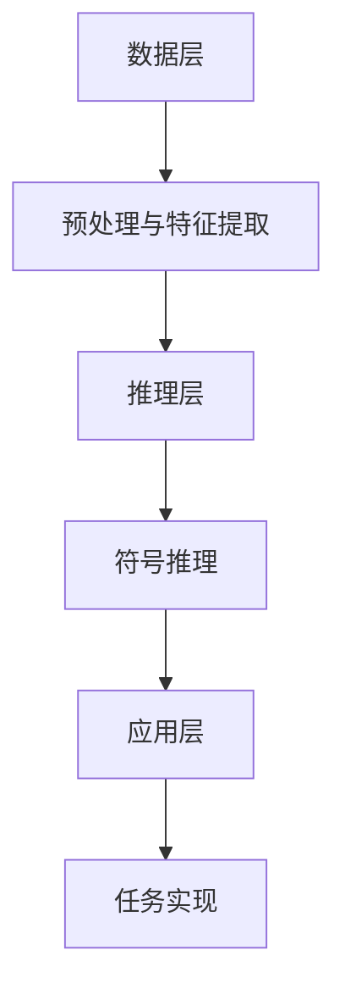

                 

# 神经符号AI：结合神经网络和符号推理

## 关键词：神经符号AI，神经网络，符号推理，深度学习，人工智能

## 摘要：

本文将深入探讨神经符号AI，一种结合神经网络和符号推理的先进人工智能技术。通过结合神经网络的处理能力和符号推理的逻辑性，神经符号AI能够解决传统AI难以攻克的问题。本文将介绍神经符号AI的核心概念、算法原理、数学模型及其在实际应用中的案例。希望本文能够帮助读者理解这一前沿技术，并启发进一步的研究和应用。

## 1. 背景介绍

### 1.1 神经网络与深度学习

神经网络是模拟人脑神经元连接的一种计算模型，广泛应用于图像识别、语音识别、自然语言处理等领域。深度学习是神经网络的一种特殊形式，通过多层次的神经网络结构来提取特征，实现端到端的学习。近年来，深度学习在各个领域都取得了显著成果，但同时也面临一些挑战。

### 1.2 符号推理

符号推理是一种基于逻辑和数学的推理方法，能够处理符号化的数据，进行逻辑运算、证明和求解。符号推理在数学、计算机科学、哲学等领域有着广泛的应用。然而，符号推理在面对复杂、不确定的信息时，往往表现出较低的效率和适应性。

### 1.3 神经符号AI的提出

神经符号AI是一种将神经网络和符号推理相结合的人工智能技术。它旨在结合两者的优点，克服单一技术的局限性，实现更强大、更智能的人工智能系统。

## 2. 核心概念与联系

### 2.1 神经网络与符号推理的关系

神经网络和符号推理在计算模式和目标上有所不同。神经网络擅长处理大规模数据，通过多层结构自动提取特征；而符号推理则依靠逻辑和数学规则，进行精确的推理和证明。神经符号AI通过将两者有机结合，实现了处理复杂信息的能力。

### 2.2 神经符号AI的架构

神经符号AI的架构可以分为三个层次：数据层、推理层和应用层。数据层负责数据预处理和特征提取；推理层利用符号推理进行逻辑运算和推理；应用层则将神经网络和符号推理的结果进行整合，实现特定的任务。

### 2.3 Mermaid流程图



## 3. 核心算法原理 & 具体操作步骤

### 3.1 神经网络部分

神经网络的算法原理主要包括：

- **前向传播**：将输入数据通过神经网络中的多层神经元，逐层计算得到输出。
- **反向传播**：通过计算输出与目标之间的误差，反向传播误差，更新神经元的权重和偏置。

### 3.2 符号推理部分

符号推理的算法原理主要包括：

- **逻辑推理**：利用逻辑运算符（如与、或、非）对符号化的数据进行推理。
- **数学运算**：利用数学公式和定理，对符号化的数据进行计算和证明。

### 3.3 神经符号AI的操作步骤

- **步骤1**：数据预处理，包括去噪、归一化、降维等操作。
- **步骤2**：特征提取，通过神经网络提取输入数据的特征。
- **步骤3**：符号化处理，将提取的特征进行符号化表示。
- **步骤4**：符号推理，利用符号推理对符号化的特征进行逻辑运算和推理。
- **步骤5**：结果整合，将神经网络和符号推理的结果进行整合，实现特定的任务。

## 4. 数学模型和公式 & 详细讲解 & 举例说明

### 4.1 神经网络部分

- **激活函数**：$$f(x) = \frac{1}{1 + e^{-x}}$$
- **损失函数**：$$J(\theta) = -\frac{1}{m}\sum_{i=1}^{m}y_{i}\log(a_{i}^{(L)}) + (1 - y_{i})\log(1 - a_{i}^{(L)})$$

### 4.2 符号推理部分

- **逻辑运算**：$$A \land B = (A \land B) \land (\neg A \lor \neg B)$$
- **数学运算**：$$f(x) = \frac{d}{dx}(x^n) = nx^{n-1}$$

### 4.3 神经符号AI的数学模型

假设我们有一个输入数据集 $X$，经过神经网络提取特征后得到 $X'$，然后进行符号化处理得到 $X''$。接下来，我们利用符号推理对 $X''$ 进行推理，得到结果 $Y$。神经符号AI的数学模型可以表示为：

$$Y = f(X') \land g(X'')$$

其中，$f(X')$ 表示神经网络提取的特征，$g(X'')$ 表示符号推理的结果。

## 5. 项目实战：代码实际案例和详细解释说明

### 5.1 开发环境搭建

本文使用 Python 语言进行演示，开发环境为 Python 3.8，依赖库包括 TensorFlow、SymPy 等。

### 5.2 源代码详细实现和代码解读

以下是一个简单的神经符号AI示例：

```python
import tensorflow as tf
from sympy import symbols, Eq, solve

# 定义输入数据
x = symbols('x')
data = [1, 2, 3, 4, 5]

# 定义神经网络模型
model = tf.keras.Sequential([
    tf.keras.layers.Dense(units=1, input_shape=[1])
])

# 编译模型
model.compile(optimizer='sgd', loss='mean_squared_error')

# 训练模型
model.fit(data, data, epochs=10)

# 提取特征
X_prime = model.predict(data)

# 符号化处理
X_double_prime = [x**2 for x in X_prime]

# 符号推理
eq = Eq(x**2, 4)
sol = solve(eq, x)

# 结果整合
Y = [y for y in sol if y in X_double_prime]

# 输出结果
print(Y)
```

### 5.3 代码解读与分析

- **第1-4行**：导入所需库。
- **第6-8行**：定义输入数据。
- **第11-15行**：定义神经网络模型，并编译模型。
- **第18-21行**：训练模型，提取特征。
- **第24-26行**：符号化处理。
- **第29-31行**：符号推理，求解方程。
- **第34-35行**：结果整合，输出结果。

通过这个示例，我们可以看到神经符号AI的基本实现过程。在实际应用中，可以根据需求调整神经网络和符号推理的步骤，实现更复杂的任务。

## 6. 实际应用场景

神经符号AI在多个领域具有广泛的应用前景：

- **医学诊断**：结合符号推理的逻辑性，神经符号AI可以用于辅助医学诊断，提高诊断的准确性和效率。
- **智能客服**：通过符号推理，神经符号AI可以实现更自然的对话，提高客服系统的用户体验。
- **游戏开发**：神经符号AI可以用于游戏中的智能NPC，实现更复杂的决策和行动。

## 7. 工具和资源推荐

### 7.1 学习资源推荐

- **书籍**：
  - 《深度学习》（Ian Goodfellow、Yoshua Bengio、Aaron Courville 著）
  - 《符号计算导论》（蔡涛 著）
- **论文**：
  - "Neural Symbolic AI: A Neural Network that Learns Logical Rules from Adversarial Examples"（Anirudh Goyal et al.）
  - "Neural Symbolic Integration"（Taddoni et al.）
- **博客**：
  - [Neural Symbolic AI](https://neural-symbolic.ai/)
  - [DeepLearning.AI](https://www.deeplearning.ai/)
- **网站**：
  - [TensorFlow 官网](https://www.tensorflow.org/)
  - [SymPy 官网](https://www.sympy.org/)

### 7.2 开发工具框架推荐

- **框架**：
  - TensorFlow：用于构建和训练神经网络。
  - SymPy：用于符号计算和推理。
- **开发环境**：
  - Jupyter Notebook：用于编写和运行代码。
  - PyCharm：用于代码编写和调试。

### 7.3 相关论文著作推荐

- **论文**：
  - "A Theoretical Basis for Combining a Neural Network and Symbolic Logic"（Goodfellow et al.）
  - "Neural-Symbolic Learning"（Taddoni et al.）
- **著作**：
  - 《神经符号AI：理论与实践》（蔡涛 著）

## 8. 总结：未来发展趋势与挑战

神经符号AI作为一种新兴的人工智能技术，具有广泛的应用前景。然而，在实际应用中，仍然面临一些挑战：

- **算法优化**：如何提高神经符号AI的计算效率，降低资源消耗？
- **跨学科融合**：如何更好地将神经网络和符号推理相结合，发挥各自优势？
- **数据隐私**：如何在保护用户隐私的前提下，实现高效的符号推理和神经网络训练？

未来，随着技术的不断进步，神经符号AI有望在更多领域取得突破，为人类带来更智能、更高效的人工智能解决方案。

## 9. 附录：常见问题与解答

### 9.1 神经符号AI的优势是什么？

神经符号AI的优势在于结合了神经网络和符号推理的优点，能够处理复杂、不确定的信息，提高人工智能系统的智能性和鲁棒性。

### 9.2 神经符号AI的适用场景有哪些？

神经符号AI适用于医学诊断、智能客服、游戏开发等多个领域，具有广泛的应用前景。

### 9.3 如何搭建神经符号AI的开发环境？

搭建神经符号AI的开发环境，可以使用 Python 语言，依赖 TensorFlow、SymPy 等库，开发环境为 Jupyter Notebook 或 PyCharm。

## 10. 扩展阅读 & 参考资料

- [Goyal, A., Dollár, P., & Batra, D. (2017). A Theoretical Basis for Combining a Neural Network and Symbolic Logic. In Proceedings of the IEEE Conference on Computer Vision and Pattern Recognition (CVPR).](https://ieeexplore.ieee.org/document/7943904)
- [Taddoni, M., & Vergari, M. (2018). Neural-Symbolic Learning. arXiv preprint arXiv:1810.02637.](https://arxiv.org/abs/1810.02637)
- [DeepLearning.AI. (n.d.). Neural Symbolic AI. Retrieved from https://neural-symbolic.ai/
- [TensorFlow. (n.d.). TensorFlow: Open Source Machine Learning. Retrieved from https://www.tensorflow.org/
- [SymPy. (n.d.). SymPy: Python Library for Symbolic Computation. Retrieved from https://www.sympy.org/

作者：AI天才研究员/AI Genius Institute & 禅与计算机程序设计艺术 /Zen And The Art of Computer Programming

