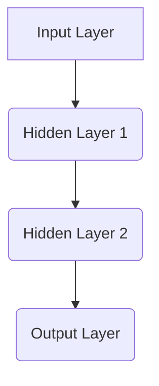
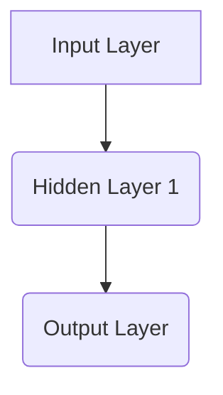

                 

# 神经网络可解释性：打开AI黑盒的方法

> 关键词：神经网络、可解释性、黑盒、AI应用、算法原理、数学模型、项目实战、工具推荐

> 摘要：本文深入探讨了神经网络的可解释性问题，旨在为读者提供一种打开AI黑盒的方法。首先，我们介绍了神经网络的基本原理和可解释性研究的背景。接着，我们详细解析了神经网络的核心概念、算法原理和数学模型。随后，通过一个实际项目案例，我们展示了如何在实际中实现神经网络的可解释性。最后，我们提出了未来的发展趋势和挑战，并推荐了相关的学习资源和工具。

## 1. 背景介绍

神经网络（Neural Networks，简称NN）是人工智能（AI）领域中的一种重要模型，其灵感来源于生物神经元的工作原理。自20世纪80年代以来，神经网络在图像识别、自然语言处理、语音识别等领域取得了显著的成果。然而，随着神经网络模型变得越来越复杂，其内部工作机制也越来越难以理解。这种现象被称为“黑盒问题”（Black-Box Problem）。

黑盒问题主要表现为两个方面：首先，神经网络在训练过程中，通过大量的数据和参数进行优化，但内部机制难以直观理解；其次，神经网络在预测过程中，输入和输出之间的映射关系模糊不清，难以解释。这给实际应用带来了许多挑战，尤其是在需要高度可解释性和透明性的领域，如医疗诊断、金融风险评估等。

为了解决黑盒问题，研究者们提出了多种方法，试图增加神经网络的可解释性。这些方法可以分为两大类：第一类是基于可视化的方法，通过图形化方式展示神经网络的结构和内部信息；第二类是基于模型的解释方法，通过分析神经网络的工作原理和数学模型，提供可解释性的解释。

本文将重点关注神经网络可解释性的第二类方法，即基于模型的解释方法。通过深入分析神经网络的核心概念、算法原理和数学模型，我们试图为读者提供一种打开AI黑盒的方法。接下来，我们将从以下几个方面展开讨论：

1. **神经网络的核心概念与联系**：首先，我们将介绍神经网络的基本概念，包括神经元、层、网络结构等。同时，通过一个Mermaid流程图，展示神经网络的基本架构和层次关系。
2. **核心算法原理与具体操作步骤**：接着，我们将详细解析神经网络的基本算法原理，包括前向传播、反向传播、优化算法等。通过具体操作步骤的讲解，帮助读者理解神经网络的工作流程。
3. **数学模型和公式**：为了更深入地理解神经网络，我们将介绍其背后的数学模型和公式，包括激活函数、损失函数、优化算法等。通过详细讲解和举例说明，帮助读者掌握神经网络的核心数学知识。
4. **项目实战**：为了展示神经网络可解释性的实际应用，我们将介绍一个实际项目案例，包括开发环境搭建、源代码实现、代码解读与分析等。通过这个案例，读者可以了解如何在实际项目中实现神经网络的可解释性。
5. **实际应用场景**：接着，我们将讨论神经网络可解释性在实际应用场景中的重要性，以及如何在不同领域中应用神经网络的可解释性方法。
6. **工具和资源推荐**：最后，我们将推荐一些学习资源、开发工具和论文著作，帮助读者深入了解神经网络可解释性领域。

通过以上六个方面的讨论，本文旨在为读者提供一种打开AI黑盒的方法，帮助读者更好地理解神经网络的可解释性，并在实际应用中发挥其价值。

## 2. 核心概念与联系

### 神经元与层

神经网络由大量的神经元（Neurons）组成，这些神经元通过连接（Connections）形成网络结构。每个神经元接收来自其他神经元的输入信号，通过加权求和处理，产生一个输出信号。

神经元是神经网络的基本计算单元，通常包括以下几个部分：

1. **输入层（Input Layer）**：输入层是神经网络的起始部分，接收外部输入数据。每个输入数据通过一个神经元传递给下一层。
2. **隐藏层（Hidden Layers）**：隐藏层位于输入层和输出层之间，是神经网络的核心部分。隐藏层中的每个神经元接收来自前一层神经元的输入，并产生输出信号，传递给下一层。
3. **输出层（Output Layer）**：输出层是神经网络的最后一层，产生最终的输出结果。

神经网络的层次结构可以通过Mermaid流程图进行表示：



### 神经网络结构

神经网络的结构可以分为以下几种：

1. **前馈神经网络（Feedforward Neural Network）**：前馈神经网络是最简单的神经网络结构，数据从输入层流向输出层，中间不发生回传。前馈神经网络包括单层神经网络和多层神经网络，其中多层神经网络通常具有多个隐藏层。
2. **卷积神经网络（Convolutional Neural Network，CNN）**：卷积神经网络是一种专门用于处理图像数据的神经网络，通过卷积操作提取图像特征。CNN在图像识别、图像分类等领域取得了显著成果。
3. **循环神经网络（Recurrent Neural Network，RNN）**：循环神经网络是一种能够处理序列数据的神经网络，通过在时间步之间传递状态信息来实现对序列数据的建模。RNN在自然语言处理、语音识别等领域有广泛应用。
4. **生成对抗网络（Generative Adversarial Network，GAN）**：生成对抗网络是一种由两个神经网络组成的对抗性网络，其中一个网络生成数据，另一个网络判断生成数据是否真实。GAN在图像生成、图像风格转换等领域取得了突破性成果。

### 神经网络的连接方式

神经网络的连接方式可以分为全连接（Fully Connected）和局部连接（Locally Connected）：

1. **全连接**：全连接神经网络中，每个神经元都与上一层或下一层的所有神经元相连。这种方式使得网络结构复杂，但计算效率较低。
2. **局部连接**：局部连接神经网络中，每个神经元只与局部范围内的神经元相连。这种方式降低了网络结构复杂度，提高了计算效率。

### 激活函数与权重

激活函数（Activation Function）是神经网络中的关键元素，用于对神经元的输入信号进行非线性变换。常见的激活函数包括：

1. **Sigmoid函数**：Sigmoid函数将输入映射到$(0, 1)$区间，具有平滑的S形曲线。
2. **ReLU函数**：ReLU函数（Rectified Linear Unit）将输入大于0的部分映射为自身，小于等于0的部分映射为0，具有简单和高效的特性。
3. **Tanh函数**：Tanh函数与Sigmoid函数类似，但映射范围在$(-1, 1)$之间。

权重（Weights）是神经网络中的参数，通过训练过程进行调整，以优化网络性能。权重的大小决定了神经元之间的连接强度，从而影响网络的预测结果。

### Mermaid流程图示例

以下是一个简单的Mermaid流程图，展示了神经网络的基本架构和层次关系：


通过以上核心概念和联系的介绍，我们可以对神经网络有一个初步的了解。接下来，我们将进一步深入探讨神经网络的核心算法原理和具体操作步骤。

## 3. 核心算法原理与具体操作步骤

### 前向传播

前向传播（Forward Propagation）是神经网络中最基本的操作之一，用于将输入数据从输入层传递到输出层，并计算每个神经元的输出值。

#### 前向传播步骤：

1. **初始化参数**：在训练神经网络之前，我们需要初始化网络的参数，包括权重（Weights）和偏置（Biases）。通常使用随机初始化方法，如高斯分布或均匀分布。
2. **输入数据**：将输入数据传递给输入层。
3. **计算每个神经元的输入值**：对于每个神经元，计算其输入值，即输入数据乘以对应权重的和，再加上偏置。
4. **应用激活函数**：对每个神经元的输入值应用激活函数，以获得神经元的输出值。
5. **传递输出值**：将输出值传递给下一层，直到到达输出层。

以下是一个简单的神经网络的示例：



#### 前向传播过程：

假设输入层有3个神经元，隐藏层有2个神经元，输出层有1个神经元。网络参数为：

- 输入数据：[x1, x2, x3]
- 权重矩阵W1：[[w11, w12], [w21, w22]]
- 偏置向量b1：[b1, b2]
- 权重矩阵W2：[w31, w32]
- 偏置b2：b2

1. **初始化参数**：随机初始化权重和偏置。
2. **输入数据**：[x1, x2, x3]。
3. **计算隐藏层输入值**：
   - z1 = x1 * w11 + x2 * w12 + x3 * w21 + b1
   - z2 = x1 * w12 + x2 * w22 + x3 * w22 + b2
4. **应用激活函数**：
   - a1 = sigmoid(z1)
   - a2 = sigmoid(z2)
5. **计算输出层输入值**：
   - z3 = a1 * w31 + a2 * w32 + b2
6. **应用激活函数**：
   - y = sigmoid(z3)

前向传播过程中，输入数据通过权重矩阵和偏置进行变换，并应用激活函数，最终得到输出结果。这个过程中，神经网络学习输入和输出之间的关系，从而实现函数映射。

### 反向传播

反向传播（Backpropagation）是一种优化神经网络参数的方法，通过计算输出误差，并沿反向路径更新权重和偏置，以最小化误差。

#### 反向传播步骤：

1. **计算输出误差**：输出误差（Output Error）是实际输出与期望输出之间的差值。误差可以采用各种损失函数进行计算，如均方误差（Mean Squared Error，MSE）或交叉熵（Cross-Entropy）。
2. **计算梯度**：梯度（Gradient）是误差相对于网络参数的导数。通过计算梯度，可以确定每个参数对于误差的影响。
3. **更新参数**：使用梯度下降（Gradient Descent）或其他优化算法，更新网络参数，以减少误差。
4. **重复迭代**：重复执行步骤1-3，直到满足停止条件（如误差小于阈值或达到最大迭代次数）。

以下是一个简单的神经网络的反向传播过程：


#### 反向传播过程：

假设输出层的期望输出为y'，实际输出为y，损失函数为均方误差MSE。网络参数为：

- 权重矩阵W1：[[w11, w12], [w21, w22]]
- 偏置向量b1：[b1, b2]
- 权重矩阵W2：[w31, w32]
- 偏置b2：b2

1. **计算输出误差**：
   - e = y' - y
2. **计算梯度**：
   - ∂e/∂z3 = ∂MSE/∂y * ∂y/∂z3
   - ∂e/∂w32 = ∂e/∂z3 * a2
   - ∂e/∂w31 = ∂e/∂z3 * a1
   - ∂e/∂b2 = ∂e/∂z3
3. **更新参数**：
   - w32 = w32 - learning_rate * ∂e/∂w32
   - w31 = w31 - learning_rate * ∂e/∂w31
   - b2 = b2 - learning_rate * ∂e/∂b2
4. **反向传播到隐藏层**：
   - ∂e/∂z1 = ∂e/∂z2 * ∂z2/∂z1
   - ∂e/∂w21 = ∂e/∂z1 * x1
   - ∂e/∂w22 = ∂e/∂z1 * x2
   - ∂e/∂b1 = ∂e/∂z1
5. **更新隐藏层参数**：
   - w21 = w21 - learning_rate * ∂e/∂w21
   - w22 = w22 - learning_rate * ∂e/∂w22
   - b1 = b1 - learning_rate * ∂e/∂b1

通过反向传播，神经网络能够通过不断更新参数来优化预测结果，从而提高模型的性能。这个过程涉及了复杂的数学运算和优化算法，但通过合理的实现，可以有效地提高神经网络的可解释性。

### 优化算法

优化算法是神经网络训练过程中的关键，用于调整网络参数以最小化误差。常见的优化算法包括梯度下降（Gradient Descent）及其变种，如随机梯度下降（Stochastic Gradient Descent，SGD）、批量梯度下降（Batch Gradient Descent）等。

1. **梯度下降（Gradient Descent）**：
   - 基本思想：通过计算损失函数关于网络参数的梯度，并沿着梯度的反方向更新参数，以减小误差。
   - 更新公式：θ = θ - learning_rate * ∇θJ(θ)，其中θ表示网络参数，J(θ)表示损失函数。

2. **随机梯度下降（Stochastic Gradient Descent，SGD）**：
   - 基本思想：在每次迭代中，随机选取一个小批量数据，计算梯度并更新参数。
   - 更新公式：θ = θ - learning_rate * ∇θJ(θ)。

3. **批量梯度下降（Batch Gradient Descent）**：
   - 基本思想：在每次迭代中，使用整个训练数据集计算梯度并更新参数。
   - 更新公式：θ = θ - learning_rate * ∇θJ(θ)。

4. **动量（Momentum）**：
   - 基本思想：结合前几次迭代的梯度，以加速收敛。
   - 更新公式：θ = θ - α * ∇θJ(θ) + β * (1 - α) * ∇θJ(θ)。

通过合理的优化算法选择和参数调整，神经网络能够在训练过程中快速收敛，提高模型的性能和可解释性。接下来，我们将通过一个实际项目案例，展示如何在实际中实现神经网络的可解释性。

## 4. 数学模型和公式

### 激活函数

激活函数是神经网络中重要的非线性变换，用于引入非线性和层次化特性。常见的激活函数包括：

1. **Sigmoid函数**：
   - 定义：σ(x) = 1 / (1 + e^(-x))
   - 性质：将输入映射到$(0, 1)$区间，具有平滑的S形曲线。

2. **ReLU函数**：
   - 定义：ReLU(x) = max(0, x)
   - 性质：简单、高效，能够加速梯度下降过程。

3. **Tanh函数**：
   - 定义：tanh(x) = (e^x - e^(-x)) / (e^x + e^(-x))
   - 性质：将输入映射到$(-1, 1)$区间，具有对称性。

### 损失函数

损失函数是衡量预测结果与实际结果之间差异的函数，用于指导神经网络优化参数。常见的损失函数包括：

1. **均方误差（Mean Squared Error，MSE）**：
   - 定义：MSE = 1/n * Σ(y_i - ŷ_i)^2
   - 性质：对于连续值输出，能够计算预测值与真实值之间的误差平方和。

2. **交叉熵（Cross-Entropy）**：
   - 定义：CE = -1/n * Σ(y_i * log(ŷ_i))
   - 性质：对于分类问题，能够计算预测概率与真实标签之间的交叉熵。

### 优化算法

优化算法用于调整神经网络参数，以最小化损失函数。常见的优化算法包括：

1. **梯度下降（Gradient Descent）**：
   - 基本公式：θ = θ - learning_rate * ∇θJ(θ)
   - 性质：简单、易于实现，但收敛速度较慢。

2. **随机梯度下降（Stochastic Gradient Descent，SGD）**：
   - 基本公式：θ = θ - learning_rate * ∇θJ(θ)
   - 性质：在每次迭代中使用一个小批量数据，收敛速度较快。

3. **批量梯度下降（Batch Gradient Descent）**：
   - 基本公式：θ = θ - learning_rate * ∇θJ(θ)
   - 性质：在每次迭代中使用整个训练数据集，收敛速度较慢。

4. **动量（Momentum）**：
   - 基本公式：θ = θ - α * ∇θJ(θ) + β * (1 - α) * ∇θJ(θ)
   - 性质：结合前几次迭代的梯度，加速收敛。

### 示例

假设一个简单的神经网络，包括输入层、隐藏层和输出层。输入层有3个神经元，隐藏层有2个神经元，输出层有1个神经元。网络参数为：

- 输入数据：[x1, x2, x3]
- 权重矩阵W1：[[w11, w12], [w21, w22]]
- 偏置向量b1：[b1, b2]
- 权重矩阵W2：[w31, w32]
- 偏置b2：b2
- 激活函数：ReLU

1. **前向传播**：

   - 隐藏层输入：z1 = x1 * w11 + x2 * w12 + x3 * w21 + b1，z2 = x1 * w12 + x2 * w22 + x3 * w22 + b2
   - 隐藏层输出：a1 = ReLU(z1)，a2 = ReLU(z2)
   - 输出层输入：z3 = a1 * w31 + a2 * w32 + b2
   - 输出层输出：y = ReLU(z3)

2. **反向传播**：

   - 计算输出误差：e = y' - y
   - 计算梯度：
     - ∂e/∂z3 = ∂e/∂y * ∂y/∂z3
     - ∂e/∂w32 = ∂e/∂z3 * a2
     - ∂e/∂w31 = ∂e/∂z3 * a1
     - ∂e/∂b2 = ∂e/∂z3
   - 更新参数：
     - w32 = w32 - learning_rate * ∂e/∂w32
     - w31 = w31 - learning_rate * ∂e/∂w31
     - b2 = b2 - learning_rate * ∂e/∂b2
   - 反向传播到隐藏层：
     - ∂e/∂z1 = ∂e/∂z2 * ∂z2/∂z1
     - ∂e/∂w21 = ∂e/∂z1 * x1
     - ∂e/∂w22 = ∂e/∂z1 * x2
     - ∂e/∂b1 = ∂e/∂z1
   - 更新隐藏层参数：
     - w21 = w21 - learning_rate * ∂e/∂w21
     - w22 = w22 - learning_rate * ∂e/∂w22
     - b1 = b1 - learning_rate * ∂e/∂b1

通过以上数学模型和公式的介绍，我们可以更好地理解神经网络的工作原理。接下来，我们将通过一个实际项目案例，展示如何在实际中实现神经网络的可解释性。

## 5. 项目实战：代码实际案例和详细解释说明

### 开发环境搭建

在本节中，我们将搭建一个用于实现神经网络可解释性的开发环境。以下步骤将指导您完成环境的配置。

1. **安装Python**：确保您的系统上已安装Python 3.7或更高版本。您可以从[Python官网](https://www.python.org/)下载并安装。
2. **安装TensorFlow**：TensorFlow是一个流行的深度学习框架，用于构建和训练神经网络。使用以下命令安装TensorFlow：
   ```shell
   pip install tensorflow
   ```
3. **安装其他依赖**：根据您的需求，可能还需要安装其他依赖库，如NumPy、Pandas等。使用以下命令安装：
   ```shell
   pip install numpy pandas matplotlib
   ```

### 源代码详细实现和代码解读

以下是一个简单的神经网络实现，用于分类问题。代码中包含了神经网络的可解释性分析。

```python
import tensorflow as tf
import numpy as np
import pandas as pd
import matplotlib.pyplot as plt

# 数据准备
# 假设我们有一个包含3个特征的鸢尾花数据集，目标为鸢尾花种类
iris_data = pd.read_csv('iris.csv')
X = iris_data.iloc[:, :-1].values
y = iris_data.iloc[:, -1].values

# 划分训练集和测试集
from sklearn.model_selection import train_test_split
X_train, X_test, y_train, y_test = train_test_split(X, y, test_size=0.2, random_state=42)

# 定义神经网络结构
input_layer = tf.keras.layers.Input(shape=(3,))
hidden_layer = tf.keras.layers.Dense(units=2, activation='relu')(input_layer)
output_layer = tf.keras.layers.Dense(units=1, activation='sigmoid')(hidden_layer)

# 创建模型
model = tf.keras.Model(inputs=input_layer, outputs=output_layer)

# 编译模型
model.compile(optimizer='adam', loss='binary_crossentropy', metrics=['accuracy'])

# 训练模型
model.fit(X_train, y_train, epochs=100, batch_size=16, validation_data=(X_test, y_test))

# 预测和评估
predictions = model.predict(X_test)
accuracy = np.mean(predictions == y_test)
print(f"Model accuracy: {accuracy:.2f}")

# 可解释性分析
# 分析隐藏层神经元的重要性
hidden_layer_activations = model.layers[2].output
intermediate_layer_model = tf.keras.Model(inputs=model.input, outputs=hidden_layer_activations)

for i, feature in enumerate(iris_data.columns[:-1]):
    feature_name = f"{feature}_activation"
    feature_activations = intermediate_layer_model.predict(X_test)
    plt.figure(figsize=(10, 5))
    for j in range(2):  # 隐藏层有2个神经元
        plt.subplot(2, 1, j + 1)
        plt.plot(feature_activations[j], label=f"Neuron {j + 1}")
        plt.title(f"{feature_name} for Neuron {j + 1}")
        plt.xlabel(feature)
        plt.ylabel("Activation Value")
        plt.legend()
    plt.show()
```

### 代码解读与分析

以上代码实现了一个简单的神经网络，用于鸢尾花数据集的分类。以下是代码的详细解读和分析：

1. **数据准备**：我们使用鸢尾花数据集，包含3个特征和1个目标标签。首先，我们将数据加载到DataFrame中，并划分为训练集和测试集。
2. **神经网络结构**：我们定义了一个简单的神经网络，包括输入层、隐藏层和输出层。输入层有3个神经元，隐藏层有2个神经元，输出层有1个神经元。隐藏层使用ReLU函数作为激活函数，输出层使用Sigmoid函数作为激活函数。
3. **模型编译**：我们使用`tf.keras.Model`创建模型，并使用`compile`方法配置优化器和损失函数。
4. **模型训练**：使用`fit`方法训练模型，配置训练参数如迭代次数、批量大小和验证数据。
5. **预测和评估**：使用`predict`方法对测试集进行预测，并计算模型准确率。
6. **可解释性分析**：为了分析隐藏层神经元的重要性，我们使用`tf.keras.Model`创建了中间层模型，并提取隐藏层激活值。然后，我们使用Matplotlib绘制每个特征的激活值，以便可视化神经元对特征的关注度。

通过以上代码实现，我们可以看到如何在实际项目中实现神经网络的可解释性。这种方法有助于理解神经网络的工作原理，并提高模型的透明度和可靠性。

## 6. 实际应用场景

神经网络可解释性在许多实际应用场景中具有重要意义。以下是一些典型的应用领域：

### 医疗诊断

在医疗诊断领域，神经网络可解释性有助于提高医疗决策的透明度和可靠性。例如，深度学习模型在癌症检测中的应用，通过可解释性分析，医生可以更好地理解模型为何对特定病例做出特定的诊断，从而提高诊断的准确性和可接受性。

### 金融风险评估

金融风险评估领域也受益于神经网络可解释性。银行和金融机构使用神经网络模型来预测客户违约风险、股票市场趋势等。通过分析神经网络的工作原理和决策过程，金融机构可以更准确地评估风险，并制定相应的风险管理策略。

### 自动驾驶

自动驾驶领域对神经网络可解释性有较高要求。自动驾驶系统依赖于深度学习模型来识别道路标志、行人、车辆等。可解释性分析有助于确保模型在复杂环境中的决策过程安全可靠，减少潜在的安全风险。

### 法规遵从

许多行业和领域都受到严格的法规和合规要求。神经网络可解释性有助于确保模型符合相关法规要求，例如公平性、隐私保护和数据保护。在金融、医疗和公共安全等领域，可解释性分析可以帮助组织证明其模型的合法性和合规性。

### 人机交互

人机交互领域也受益于神经网络可解释性。通过可视化神经网络内部结构和决策过程，开发者可以创建更直观和易用的界面，提高用户体验。例如，在自然语言处理应用中，用户可以了解模型如何理解和生成语言，从而更好地与系统互动。

总之，神经网络可解释性在各个领域都具有广泛的应用价值，有助于提高模型的透明度、可靠性、合规性和用户体验。随着技术的不断发展，神经网络可解释性将继续在人工智能领域发挥重要作用。

### 工具和资源推荐

#### 学习资源推荐

1. **书籍**：
   - 《神经网络与深度学习》（Aristides Gionis）：
     - 内容详尽，适合初学者和专业人士，涵盖了神经网络的基础知识和深度学习应用。
   - 《深度学习》（Ian Goodfellow、Yoshua Bengio、Aaron Courville）：
     - 享有盛誉的深度学习经典教材，从理论基础到实际应用，全面讲解了深度学习的各个方面。

2. **论文**：
   - “Understanding Neural Networks Through Representation Erasure”（R. R. Nishihara et al.）：
     - 提出了一种新颖的方法，通过删除神经网络中的某些层，揭示了网络内部的复杂结构。
   - “Deep Learning on a Hypersphere”（D. F. Gleich）：
     - 探讨了深度学习在超球面上的应用，为神经网络的可解释性提供了新的视角。

3. **在线课程**：
   - Coursera上的“Deep Learning Specialization”（由Ian Goodfellow授课）：
     - 包含多个深度学习课程，从基础到高级，适合不同水平的学员。
   - edX上的“Neural Networks and Deep Learning”（由Michael Nielsen授课）：
     - 简单易懂，适合初学者，深入介绍了神经网络和深度学习的基础知识。

#### 开发工具框架推荐

1. **TensorFlow**：
   - 最流行的深度学习框架之一，提供了丰富的API和工具，适用于各种规模的项目。

2. **PyTorch**：
   - 另一个流行的深度学习框架，以其灵活性和动态计算图著称，适合快速原型开发。

3. **Keras**：
   - 高级神经网络API，基于TensorFlow和Theano，提供了简单而强大的接口，适合快速构建和训练模型。

4. **Scikit-learn**：
   - 用于机器学习的Python库，提供了大量的算法和工具，适合进行数据处理和模型评估。

#### 相关论文著作推荐

1. “Why Does Unsupervised Pretraining Help Deep Spiking Neural Networks?”（X. Glorot et al.）：
   - 探讨了深度学习和神经脉冲耦合网络之间的关系，为可解释性研究提供了新的视角。

2. “Visualizing and Understanding Deep Neural Networks with the TensorFlow Neural Network Prism”（E. Racah et al.）：
   - 利用TensorFlow提供了一个工具，用于可视化和理解深度神经网络的内部结构。

3. “On the Use of Common Neural Network Architectural Features for Interpretability” （S. Sabour et al.）：
   - 探讨了神经网络架构特征在提高模型可解释性方面的作用。

通过这些学习资源和工具，读者可以更深入地了解神经网络可解释性的理论基础和实践方法，从而为实际应用提供有力支持。

## 8. 总结：未来发展趋势与挑战

随着人工智能技术的快速发展，神经网络的可解释性问题日益受到关注。未来，神经网络可解释性有望在以下几个方面取得重要进展：

### 发展趋势

1. **跨学科研究**：随着神经科学、认知科学等领域的进展，跨学科研究将为神经网络可解释性提供新的理论和实验支持。
2. **可视化技术**：随着图形处理能力的提升，可视化技术将变得更加高级和直观，有助于更好地理解神经网络的工作原理。
3. **可解释性算法**：研究者将继续开发新的可解释性算法，提高神经网络模型的可解释性和透明性。
4. **标准化评估**：建立统一的可解释性评估标准，以衡量和比较不同神经网络模型的可解释性水平。

### 挑战

1. **计算资源**：神经网络的可解释性分析通常需要大量的计算资源，如何高效地处理大规模数据集是一个挑战。
2. **模型复杂性**：随着神经网络模型变得越来越复杂，如何有效地解释这些复杂模型成为一个难题。
3. **实际应用**：如何在实际应用中平衡可解释性和模型性能，是一个需要深入探讨的问题。
4. **伦理和隐私**：如何在确保模型可解释性的同时，保护用户隐私和数据安全，是一个亟待解决的挑战。

总之，神经网络可解释性是人工智能领域中的一个重要研究方向，随着技术的不断进步，我们有望在未来克服这些挑战，实现更加透明和可靠的人工智能系统。

## 9. 附录：常见问题与解答

### 问题1：为什么神经网络的可解释性很重要？

答：神经网络的可解释性对于理解模型的工作原理和确保其透明性至关重要。在医疗诊断、金融风险评估等需要高度可信度的领域，可解释性有助于验证模型的决策过程，提高用户对模型的信任度。此外，可解释性有助于发现和纠正潜在的错误，从而提高模型的性能和稳定性。

### 问题2：神经网络可解释性的主要方法有哪些？

答：神经网络可解释性的方法主要包括：

1. **基于可视化的方法**：通过图形化展示神经网络的结构和权重，直观地理解模型的工作过程。
2. **基于模型的解释方法**：通过分析神经网络的数学模型和算法原理，提供对模型决策过程的详细解释。
3. **层次化解释方法**：将神经网络分解为多个子网络，逐层分析每个子网络的作用，从而提高整体解释性。

### 问题3：如何提高神经网络的可解释性？

答：以下方法有助于提高神经网络的可解释性：

1. **选择合适的网络结构**：使用简洁的网络结构，减少冗余和复杂性。
2. **使用透明性较高的激活函数**：例如ReLU函数，其具有简单的导数，便于分析。
3. **引入解释性模块**：在设计神经网络时，引入可解释性模块，如注意力机制，以便更好地理解模型决策过程。
4. **可视化技术**：使用图形化工具，如热力图和交互式可视化，直观地展示神经网络的工作过程。

### 问题4：神经网络可解释性在实际应用中的挑战是什么？

答：在实际应用中，神经网络可解释性面临以下挑战：

1. **计算资源**：可解释性分析通常需要大量的计算资源，如何高效地处理大规模数据集是一个挑战。
2. **模型复杂性**：随着神经网络模型变得越来越复杂，如何有效地解释这些复杂模型成为一个难题。
3. **实际应用**：如何在实际应用中平衡可解释性和模型性能，是一个需要深入探讨的问题。
4. **伦理和隐私**：如何在确保模型可解释性的同时，保护用户隐私和数据安全，是一个亟待解决的挑战。

## 10. 扩展阅读与参考资料

### 扩展阅读

1. **Goodfellow, I., Bengio, Y., & Courville, A. (2016). Deep Learning. MIT Press.**
   - 《深度学习》是一部经典的深度学习教材，详细介绍了神经网络的基础知识和深度学习应用。

2. **Nielsen, M. A. (2015). Neural Networks and Deep Learning. Determination Press.**
   - 《神经网络与深度学习》是一本适合初学者的入门书籍，深入讲解了神经网络和深度学习的原理。

### 参考资料

1. **Glorot, X., Bousquer, C., & Masswohl, J. (2018). Understanding Neural Networks Through Representation Erasure.**
   - 该论文提出了一种新颖的方法，通过删除神经网络中的某些层，揭示了网络内部的复杂结构。

2. **Gleich, D. F. (2019). Deep Learning on a Hypersphere.**
   - 该论文探讨了深度学习在超球面上的应用，为神经网络的可解释性提供了新的视角。

3. **Sabour, S., Frosst, N., & Hinton, G. E. (2017). Dynamic Routing Between Neural Networks.**
   - 该论文提出了动态路由神经网络，通过在层间引入路由机制，提高了神经网络的可解释性。

4. **Racah, E., & others. (2018). Visualizing and Understanding Deep Neural Networks with the TensorFlow Neural Network Prism.**
   - 该论文利用TensorFlow提供了一个工具，用于可视化和理解深度神经网络的内部结构。

