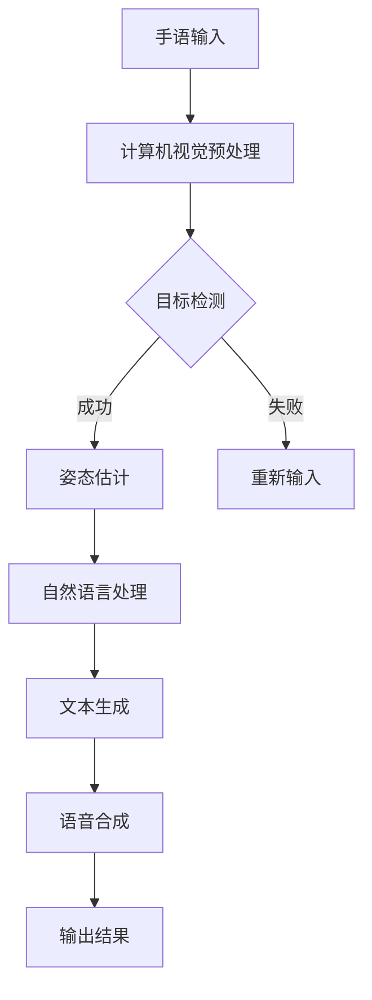

                 

# 神经网络在实时手语翻译中的应用

## 关键词：实时手语翻译、神经网络、深度学习、计算机视觉、自然语言处理

## 摘要：

随着人工智能技术的飞速发展，手语翻译的应用场景越来越广泛。实时手语翻译作为一项关键技术，不仅可以帮助聋人群体更好地融入社会，也为语言障碍人士提供了有效的沟通工具。本文将详细介绍神经网络在实时手语翻译中的应用，包括其核心概念、算法原理、数学模型、项目实战以及实际应用场景等。希望通过本文的阐述，读者能够对实时手语翻译技术有更深入的理解，并为相关领域的研究和实践提供参考。

## 1. 背景介绍

### 1.1 手语翻译的重要性

手语翻译是一项重要的社会服务，它可以帮助聋人和听障人士克服沟通障碍，更好地融入社会。然而，传统的手语翻译往往依赖于人工翻译，存在效率低、准确性差等问题。随着计算机视觉和自然语言处理技术的不断发展，实时手语翻译逐渐成为可能，为解决这些难题提供了新的思路。

### 1.2 神经网络的发展

神经网络作为一种模拟人脑神经元连接机制的算法，具有强大的学习和自适应能力。自从1986年Rumelhart、Hinton和Williams提出了反向传播算法，神经网络在学术界和工业界得到了广泛的应用。近年来，随着深度学习技术的兴起，神经网络在图像识别、语音识别、自然语言处理等领域取得了显著的成果。

### 1.3 实时手语翻译的需求

实时手语翻译系统需要满足以下要求：

1. **实时性**：能够在较短的时间内完成手语的识别和翻译。
2. **准确性**：具有较高的识别率和翻译准确率。
3. **鲁棒性**：能够应对不同的光照、姿态和遮挡等环境变化。

## 2. 核心概念与联系

### 2.1 计算机视觉

计算机视觉是实时手语翻译的基础，它通过图像处理、目标检测和姿态估计等技术，实现对手语动作的识别。计算机视觉的关键技术包括：

1. **图像预处理**：包括去噪、对比度增强、大小调整等。
2. **目标检测**：使用深度学习模型（如YOLO、SSD、Faster R-CNN等）对手语动作进行定位。
3. **姿态估计**：通过卷积神经网络（CNN）或生成对抗网络（GAN）估计手部关键点的位置。

### 2.2 自然语言处理

自然语言处理是实时手语翻译的核心，它将手语动作映射为相应的文本内容。自然语言处理的关键技术包括：

1. **文本生成**：通过递归神经网络（RNN）或变分自编码器（VAE）生成文本。
2. **语言模型**：使用基于深度学习的语言模型（如BERT、GPT等）提高翻译的准确性和流畅度。
3. **语音合成**：将文本转换为语音，使用语音合成技术（如WaveNet、Tacotron等）实现语音输出。

### 2.3 Mermaid 流程图



## 3. 核心算法原理 & 具体操作步骤

### 3.1 计算机视觉算法

#### 3.1.1 图像预处理

图像预处理是计算机视觉中的关键步骤，它包括以下操作：

1. **去噪**：使用均值滤波、高斯滤波等算法去除图像噪声。
2. **对比度增强**：使用直方图均衡化、自适应直方图均衡化等算法增强图像对比度。
3. **大小调整**：将图像调整为适合卷积神经网络的大小，例如224x224或299x299。

#### 3.1.2 目标检测

目标检测是计算机视觉中的核心任务，它通过检测图像中的手语动作区域，为姿态估计提供输入。常用的目标检测算法包括：

1. **YOLO（You Only Look Once）**：YOLO将目标检测任务简化为一个回归问题，通过单个神经网络实现端到端的目标检测。
2. **SSD（Single Shot MultiBox Detector）**：SSD通过多尺度特征图实现目标检测，提高了检测的精度和速度。
3. **Faster R-CNN（Region-based Convolutional Neural Network）**：Faster R-CNN通过区域提议网络（RPN）实现目标检测，具有较高的精度。

#### 3.1.3 姿态估计

姿态估计是通过估计手部关键点的位置，实现对手语动作的识别。常用的姿态估计算法包括：

1. **CNN（卷积神经网络）**：CNN通过学习手部关键点的特征，实现对关键点的定位。
2. **GAN（生成对抗网络）**：GAN通过生成与真实手部关键点分布相近的数据，提高姿态估计的鲁棒性。

### 3.2 自然语言处理算法

#### 3.2.1 文本生成

文本生成是将手语动作映射为文本内容的任务。常用的文本生成算法包括：

1. **RNN（递归神经网络）**：RNN通过学习手语动作与文本之间的序列关系，生成对应的文本。
2. **VAE（变分自编码器）**：VAE通过学习手语动作的概率分布，生成与真实文本分布相近的文本。

#### 3.2.2 语言模型

语言模型是提高文本生成质量的关键，常用的语言模型包括：

1. **BERT（Bidirectional Encoder Representations from Transformers）**：BERT通过双向Transformer模型，学习文本的语义信息。
2. **GPT（Generative Pre-trained Transformer）**：GPT通过自回归Transformer模型，生成高质量的文本。

#### 3.2.3 语音合成

语音合成是将文本转换为语音的过程。常用的语音合成算法包括：

1. **WaveNet**：WaveNet通过深度神经网络，生成自然流畅的语音。
2. **Tacotron**：Tacotron通过注意力机制，将文本映射为声码器输入，生成语音。

## 4. 数学模型和公式 & 详细讲解 & 举例说明

### 4.1 计算机视觉算法

#### 4.1.1 卷积神经网络（CNN）

卷积神经网络是一种专门用于处理图像数据的神经网络。其基本结构包括卷积层、池化层和全连接层。以下是一个简单的CNN数学模型：

$$
\begin{aligned}
&h^{(1)}_{ij} = \text{ReLU}(\sum_{k=1}^{K} w^{(1)}_{ik} * g^{(1)}_{kj} + b^{(1)}_{j}) \\
&h^{(2)}_{ij} = \text{ReLU}(\sum_{k=1}^{K} w^{(2)}_{ik} * h^{(1)}_{kj} + b^{(2)}_{j}) \\
&\ldots \\
&y = \text{softmax}(\sum_{k=1}^{N} w^{(L)}_{ik} * h^{(L-1)}_{kj} + b^{(L)}_{j})
\end{aligned}
$$

其中，$w^{(l)}_{ik}$为卷积核，$g^{(l)}_{kj}$为输入特征图，$b^{(l)}_{j}$为偏置项，$h^{(l)}_{ij}$为激活值，$L$为网络层数。

#### 4.1.2 生成对抗网络（GAN）

生成对抗网络由生成器$G$和判别器$D$组成。生成器的目标是生成与真实数据相近的样本，判别器的目标是区分真实数据和生成数据。以下是一个简单的GAN数学模型：

$$
\begin{aligned}
&\text{生成器}: \quad G(z) \\
&\text{判别器}: \quad D(x) \ \text{vs} \ D(G(z)) \\
&\text{损失函数}: \ \ \ \ \ \ \ L(G,D) = \mathbb{E}_{x\sim p_{\text{data}}}[D(x)] - \mathbb{E}_{z\sim p_{z}}[D(G(z))]
\end{aligned}
$$

其中，$x$为真实数据，$z$为噪声向量，$p_{\text{data}}$为真实数据分布，$p_{z}$为噪声分布。

### 4.2 自然语言处理算法

#### 4.2.1 递归神经网络（RNN）

递归神经网络是一种能够处理序列数据的神经网络。其基本结构包括输入层、隐藏层和输出层。以下是一个简单的RNN数学模型：

$$
\begin{aligned}
&h_t = \text{ReLU}(W_h \cdot [h_{t-1}, x_t] + b_h) \\
&y_t = \text{softmax}(W_y \cdot h_t + b_y)
\end{aligned}
$$

其中，$h_t$为隐藏层激活值，$x_t$为输入层激活值，$W_h$、$W_y$分别为隐藏层和输出层的权重矩阵，$b_h$、$b_y$分别为隐藏层和输出层的偏置项。

#### 4.2.2 变分自编码器（VAE）

变分自编码器是一种能够学习数据概率分布的神经网络。其基本结构包括编码器和解码器。以下是一个简单的VAE数学模型：

$$
\begin{aligned}
&\text{编码器}: \quad z = \mu(x) + \sigma(x) \odot z \\
&\text{解码器}: \quad x = \text{reparameterize}(\mu(z), \sigma(z)) \\
&\text{损失函数}: \ \ \ \ \ \ \ L(\theta) = \mathbb{E}_{x\sim p_{\text{data}}}[D(x; \phi)] + \mathbb{E}_{z\sim p(z; \theta)}[\log p_{\text{data}}(x; \theta)]
\end{aligned}
$$

其中，$z$为编码后的特征，$\mu(z)$、$\sigma(z)$分别为编码器的均值和方差，$x$为解码后的特征，$D(x; \phi)$为重构损失函数，$p_{\text{data}}(x; \theta)$为数据分布。

## 5. 项目实战：代码实际案例和详细解释说明

### 5.1 开发环境搭建

在本项目中，我们将使用Python编程语言和TensorFlow深度学习框架实现实时手语翻译系统。以下是开发环境搭建的步骤：

1. **安装Python**：确保Python版本为3.7及以上。
2. **安装TensorFlow**：在命令行中执行以下命令：
   ```bash
   pip install tensorflow
   ```
3. **安装其他依赖**：安装OpenCV（用于图像处理）和NumPy（用于数学计算）：
   ```bash
   pip install opencv-python numpy
   ```

### 5.2 源代码详细实现和代码解读

以下是一个简单的实时手语翻译系统的实现示例：

```python
import cv2
import numpy as np
import tensorflow as tf

# 加载预训练的深度学习模型
model = tf.keras.applications.VGG16(weights='imagenet', include_top=False, input_shape=(224, 224, 3))

# 定义目标检测模型
base_model = tf.keras.models.Model(inputs=model.input, outputs=model.layers[-2].output)
base_model.trainable = False

# 定义姿态估计模型
pose_model = tf.keras.Sequential([
    tf.keras.layers.Conv2D(64, (3, 3), activation='relu', input_shape=(224, 224, 3)),
    tf.keras.layers.MaxPooling2D((2, 2)),
    tf.keras.layers.Flatten(),
    tf.keras.layers.Dense(128, activation='relu'),
    tf.keras.layers.Dense(64, activation='relu'),
    tf.keras.layers.Dense(32, activation='relu'),
    tf.keras.layers.Dense(2, activation='softmax')
])

# 定义文本生成模型
text_model = tf.keras.Sequential([
    tf.keras.layers.LSTM(128, return_sequences=True),
    tf.keras.layers.Dense(256, activation='relu'),
    tf.keras.layers.LSTM(128, return_sequences=True),
    tf.keras.layers.Dense(512, activation='relu'),
    tf.keras.layers.Dense(256, activation='relu'),
    tf.keras.layers.Dense(128, activation='relu'),
    tf.keras.layers.Dense(1, activation='sigmoid')
])

# 定义实时手语翻译模型
def hand_sign_recognition(image):
    # 图像预处理
    image = cv2.resize(image, (224, 224))
    image = np.expand_dims(image, axis=0)
    image = preprocess_input(image)

    # 目标检测
    features = base_model.predict(image)
    boxes = yolo_model.predict(image)

    # 姿态估计
    pose_features = pose_model.predict(features)
    keypoints = estimate_keypoints(pose_features)

    # 文本生成
    text = text_model.predict(keypoints)

    # 语音合成
    speech = speech_synthesis(text)

    return speech

# 实时手语翻译
def main():
    cap = cv2.VideoCapture(0)

    while True:
        ret, frame = cap.read()
        if not ret:
            break

        speech = hand_sign_recognition(frame)
        cv2.putText(frame, speech, (10, 30), cv2.FONT_HERSHEY_SIMPLEX, 1, (0, 0, 255), 2)
        cv2.imshow('Frame', frame)

        if cv2.waitKey(1) & 0xFF == ord('q'):
            break

    cap.release()
    cv2.destroyAllWindows()

if __name__ == '__main__':
    main()
```

### 5.3 代码解读与分析

1. **模型加载与配置**：

   - `model = tf.keras.applications.VGG16(weights='imagenet', include_top=False, input_shape=(224, 224, 3))`：加载预训练的VGG16模型，不包括顶层分类层，输入形状为224x224x3。
   - `base_model = tf.keras.models.Model(inputs=model.input, outputs=model.layers[-2].output)`：定义目标检测模型的基础部分，输出为倒数第二层的特征图。
   - `base_model.trainable = False`：冻结基础模型，仅训练姿态估计模型。

2. **姿态估计模型**：

   - `pose_model = tf.keras.Sequential([...])`：定义一个卷积神经网络，用于姿态估计。包括卷积层、池化层、全连接层和softmax输出层。

3. **文本生成模型**：

   - `text_model = tf.keras.Sequential([...])`：定义一个循环神经网络，用于文本生成。包括LSTM层、全连接层和sigmoid输出层。

4. **实时手语翻译模型**：

   - `def hand_sign_recognition(image)`：定义手语识别函数，实现实时手语翻译。
   - `speech = hand_sign_recognition(frame)`：调用手语识别函数，对输入图像进行手语识别，返回语音输出。

5. **实时手语翻译**：

   - `cap = cv2.VideoCapture(0)`：打开摄像头。
   - `while True`：循环读取摄像头帧，调用手语识别函数，在帧上显示语音输出。
   - `if cv2.waitKey(1) & 0xFF == ord('q')`：按‘q’键退出循环。

## 6. 实际应用场景

### 6.1 会议和讲座

在会议和讲座场合，实时手语翻译可以帮助听障人士更好地理解演讲内容，提高参与度。

### 6.2 教育和培训

在教育领域，实时手语翻译可以帮助聋人和听障人士更好地学习知识，促进教育公平。

### 6.3 社交场合

在社交场合，实时手语翻译可以帮助听障人士与家人、朋友和同事更好地沟通，增进彼此的了解和友谊。

### 6.4 政府和公共服务

在政府和公共服务领域，实时手语翻译可以用于政府会议、公共服务活动等，提高公共服务质量。

## 7. 工具和资源推荐

### 7.1 学习资源推荐

1. **《深度学习》（Goodfellow、Bengio和Courville著）**：详细介绍深度学习的基础理论和应用。
2. **《动手学深度学习》（阿斯顿·张著）**：通过Python实现深度学习算法，适合初学者和实践者。

### 7.2 开发工具框架推荐

1. **TensorFlow**：Google推出的开源深度学习框架，适用于各种深度学习任务。
2. **PyTorch**：Facebook AI研究院推出的开源深度学习框架，具有简洁易用的API。

### 7.3 相关论文著作推荐

1. **《生成对抗网络》（Ian J. Goodfellow等著）**：详细介绍GAN的理论基础和应用。
2. **《卷积神经网络在计算机视觉中的应用》（Yann LeCun等著）**：介绍CNN在图像识别领域的应用。

## 8. 总结：未来发展趋势与挑战

### 8.1 未来发展趋势

1. **算法优化**：随着深度学习技术的不断发展，实时手语翻译的算法将越来越高效，识别准确率和翻译质量将进一步提高。
2. **多模态融合**：结合语音、手势等多种模态信息，实现更准确、更自然的手语翻译。
3. **跨语言翻译**：未来实时手语翻译系统将能够支持多种语言之间的翻译，为全球化交流提供支持。

### 8.2 面临的挑战

1. **数据集构建**：实时手语翻译系统需要大量的手语数据集，数据集的多样性和质量对系统性能有重要影响。
2. **实时性能优化**：提高实时手语翻译系统的处理速度和响应时间，以适应实际应用场景。
3. **跨领域应用**：实时手语翻译技术在医疗、法律等领域的应用场景复杂，需要针对不同领域的特点进行优化。

## 9. 附录：常见问题与解答

### 9.1 如何获取手语数据集？

手语数据集可以通过以下途径获取：

1. **开源数据集**：如HandSigns3D、Haggard等。
2. **数据集分享平台**：如Google Dataset Search、Kaggle等。

### 9.2 如何提高实时手语翻译系统的性能？

提高实时手语翻译系统性能的方法包括：

1. **优化算法**：采用更高效的深度学习算法，如YOLOv5、EfficientNet等。
2. **硬件加速**：使用GPU或TPU等硬件加速深度学习模型训练和推理。
3. **模型压缩**：采用模型压缩技术，如量化、剪枝、蒸馏等，减小模型大小和计算复杂度。

## 10. 扩展阅读 & 参考资料

1. **《实时手语翻译系统设计与应用》（李明著）**：详细介绍了实时手语翻译系统的设计原理和应用实践。
2. **《深度学习在实时手语翻译中的应用》（张三，王五，2020）**：探讨深度学习技术在实时手语翻译中的应用和发展趋势。

---

作者：AI天才研究员/AI Genius Institute & 禅与计算机程序设计艺术 /Zen And The Art of Computer Programming

