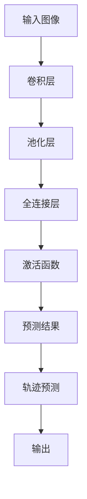

                 

### 背景介绍

#### 神经网络与物体追踪识别的基本概念

神经网络是一种模仿人脑工作原理的计算模型，通过大量的神经元和连接（权重）进行信息传递和处理。物体追踪与识别是计算机视觉领域的关键任务，旨在实时、准确地识别和跟踪视频或图像中的物体。这一任务在自动驾驶、安全监控、人机交互等多个领域有着广泛的应用。

物体追踪识别的基本概念包括：

- **物体检测**：确定图像中存在哪些物体及其位置。
- **目标识别**：根据物体的外观特征，将其分类为特定类别。
- **轨迹跟踪**：根据物体的运动轨迹，对其进行持续跟踪。

神经网络在物体追踪与识别中的应用，主要体现在以下方面：

1. **特征提取**：通过卷积神经网络（CNN）等结构，从图像中提取具有区分性的特征。
2. **分类与定位**：利用全连接层和激活函数，对提取的特征进行分类和定位。
3. **轨迹预测**：通过时间序列模型，如循环神经网络（RNN），预测物体的运动轨迹。

#### 实时物体追踪与识别的重要性

随着技术的不断发展，实时物体追踪与识别的应用场景越来越广泛。以下是其重要性体现在几个方面：

1. **智能监控**：在安全监控领域，实时追踪与识别可以帮助监控系统更好地识别异常行为，提高监控效率。
2. **自动驾驶**：在自动驾驶领域，实时追踪与识别是确保车辆安全行驶的关键，能够有效识别道路上的各种障碍物和行人。
3. **人机交互**：在人机交互领域，实时追踪与识别可以提升交互体验，如手势识别、人脸识别等。
4. **工业自动化**：在工业自动化领域，实时追踪与识别可以提升生产效率和产品质量。

本文将深入探讨神经网络在实时物体追踪与识别中的应用，从核心算法原理、数学模型、实际应用场景等多个角度进行分析，旨在为读者提供一个全面的技术解读。

#### 相关技术发展历史

实时物体追踪与识别技术的发展历程可以追溯到上世纪80年代。早期的技术主要依赖于手工特征和简单的机器学习算法，如基于光流法的跟踪算法和SVM分类器。这些方法虽然在一定程度上实现了物体追踪与识别，但存在计算复杂度高、实时性差等问题。

随着计算机性能的不断提升和深度学习技术的崛起，物体追踪与识别技术得到了快速发展。以卷积神经网络（CNN）为代表的深度学习模型，通过自动学习图像特征，大幅提高了物体检测和识别的准确性和实时性。

近年来，基于深度学习的实时物体追踪与识别算法，如YOLO（You Only Look Once）、SSD（Single Shot MultiBox Detector）和Faster R-CNN等，不断涌现。这些算法通过优化网络结构和训练策略，进一步提升了实时性和准确性。

同时，为了满足实际应用需求，研究人员还提出了许多结合多模态数据的追踪与识别算法，如结合视觉和惯性测量单元（IMU）的数据融合方法，以及基于强化学习的交互式追踪算法。

总的来说，实时物体追踪与识别技术的发展历程，体现了从传统手工特征到深度学习模型的转变，以及从单一传感器到多模态数据融合的演变。随着技术的不断进步，未来实时物体追踪与识别将在更多领域发挥重要作用。

#### 读者对象与文章结构概述

本文面向对神经网络和计算机视觉技术有一定了解的读者，旨在为技术从业者、研究人员和学者提供一个全面、深入的技术解读。通过本文，读者将了解：

1. 神经网络在物体追踪与识别中的核心算法原理及其实现步骤。
2. 数学模型和公式的详细讲解，包括特征提取、分类与定位的数学原理。
3. 实际应用场景中的项目实战，通过代码案例和详细解析，展示神经网络算法的应用效果。
4. 未来发展趋势与挑战，探讨实时物体追踪与识别技术的前沿方向。

文章结构如下：

1. **背景介绍**：概述神经网络与物体追踪识别的基本概念，及其在实时物体追踪与识别中的应用。
2. **核心概念与联系**：介绍核心概念原理和架构，通过Mermaid流程图展示神经网络在物体追踪与识别中的工作流程。
3. **核心算法原理 & 具体操作步骤**：详细讲解神经网络在物体追踪与识别中的关键步骤，包括特征提取、分类与定位、轨迹预测等。
4. **数学模型和公式 & 详细讲解 & 举例说明**：分析数学模型和公式，结合实际案例进行详细解释。
5. **项目实战**：通过代码实际案例和详细解释，展示神经网络算法的应用效果。
6. **实际应用场景**：探讨神经网络在实时物体追踪与识别中的实际应用。
7. **工具和资源推荐**：推荐相关学习资源、开发工具和框架。
8. **总结与未来展望**：总结文章内容，展望未来发展趋势与挑战。
9. **附录**：提供常见问题与解答，方便读者深入理解。
10. **扩展阅读与参考资料**：提供进一步阅读的资源和参考资料。

通过本文，读者将系统地了解神经网络在实时物体追踪与识别中的应用，为实际项目开发和学术研究提供有力支持。

### 核心概念与联系

#### 神经网络结构

神经网络（Neural Network）是一种由大量神经元（模拟人脑神经元）组成的计算模型。其基本结构包括输入层、隐藏层和输出层。每个神经元都与前一层神经元通过权重（Weight）相连，并通过激活函数（Activation Function）进行信息传递和处理。

- **输入层（Input Layer）**：接收外部输入信号。
- **隐藏层（Hidden Layer）**：进行特征提取和变换。
- **输出层（Output Layer）**：输出预测结果或分类结果。

#### 卷积神经网络（Convolutional Neural Network，CNN）

卷积神经网络是神经网络的一种特殊结构，广泛应用于图像处理和物体识别领域。其核心思想是通过卷积操作（Convolution Operation）和池化操作（Pooling Operation）提取图像特征。

1. **卷积操作**：
   - **局部感知**：每个卷积核（Convolutional Kernel）局部感知图像的一部分。
   - **权重共享**：卷积核在不同位置重复使用，实现参数共享，降低模型参数量。
   - **非线性变换**：通过激活函数（如ReLU）引入非线性变换。

2. **池化操作**：
   - **下采样**：通过最大池化（Max Pooling）或平均池化（Average Pooling）减小特征图的尺寸，降低计算复杂度。
   - **特征不变性**：通过池化操作提高特征对旋转、缩放和噪声等变化的鲁棒性。

#### 循环神经网络（Recurrent Neural Network，RNN）

循环神经网络是一种处理序列数据的神经网络，广泛应用于时间序列预测、自然语言处理等领域。其核心思想是通过隐藏状态（Hidden State）的循环连接，实现信息的记忆和传递。

1. **循环结构**：
   - **状态传递**：当前时刻的隐藏状态不仅依赖于当前时刻的输入，还依赖于前一时刻的隐藏状态。
   - **时间序列建模**：通过隐藏状态在时间步之间的循环连接，实现序列数据的建模。

2. **门控机制**：
   - **输入门（Input Gate）**：决定当前输入信息的重要性。
   - **遗忘门（Forget Gate）**：决定哪些旧信息需要被遗忘。
   - **输出门（Output Gate）**：决定当前隐藏状态是否需要输出。

#### 物体追踪与识别任务

物体追踪与识别（Object Tracking and Recognition）是计算机视觉领域的关键任务。其主要任务包括：

1. **物体检测（Object Detection）**：
   - **目标定位**：在图像中找到物体的位置。
   - **目标分类**：对检测到的物体进行分类。

2. **轨迹跟踪（Trajectory Tracking）**：
   - **轨迹建模**：根据物体的历史轨迹预测未来的位置。
   - **状态估计**：通过优化算法估计物体的状态。

#### Mermaid 流程图

为了更直观地展示神经网络在物体追踪与识别中的工作流程，我们使用Mermaid绘制了一个简单的流程图：



- **输入图像**：输入待处理的图像。
- **卷积层**：通过卷积操作提取图像特征。
- **池化层**：通过池化操作减小特征图尺寸。
- **全连接层**：对提取的特征进行分类和定位。
- **激活函数**：引入非线性变换，提高模型性能。
- **预测结果**：输出物体的位置和类别。
- **轨迹预测**：利用循环神经网络预测物体的运动轨迹。
- **输出**：最终输出物体的轨迹和状态。

通过上述核心概念与联系的分析，我们可以看出神经网络在物体追踪与识别中的重要作用。接下来，我们将进一步深入探讨神经网络在物体追踪与识别中的具体应用和实现细节。

### 核心算法原理 & 具体操作步骤

#### 特征提取

在物体追踪与识别过程中，特征提取是至关重要的一步。卷积神经网络（CNN）因其强大的特征提取能力，在物体追踪与识别中得到了广泛应用。以下是特征提取的具体操作步骤：

1. **卷积操作**：
   - **卷积核**：卷积核是一个小型矩阵，用于从输入图像中提取特征。卷积操作通过将卷积核在输入图像上滑动，并与局部区域进行点积计算，从而提取图像的特征。
   - **步长（Stride）**：卷积核在图像上滑动的步长。较大的步长会导致特征图的尺寸减小，从而降低计算复杂度，但可能损失一些细节信息。
   - **填充（Padding）**：为了防止特征图尺寸缩小得太快，通常在输入图像周围填充零或镜像边界。

2. **激活函数**：
   - **ReLU函数（Rectified Linear Unit）**：ReLU函数是一种常用的激活函数，其形式为$ReLU(x) = max(0, x)$。ReLU函数可以加速训练过程，提高模型性能。
   - **Sigmoid函数**：Sigmoid函数是一种平滑的激活函数，其形式为$sigmoid(x) = \frac{1}{1 + e^{-x}}$。Sigmoid函数通常用于二分类问题。
   - **Tanh函数**：Tanh函数是Sigmoid函数的改进版本，其形式为$tanh(x) = \frac{e^{2x} - 1}{e^{2x} + 1}$。Tanh函数的输出范围在[-1, 1]之间，可以增强模型的非线性能力。

3. **池化操作**：
   - **最大池化（Max Pooling）**：最大池化选择每个局部区域中的最大值，从而提取出具有显著特征的区域。
   - **平均池化（Average Pooling）**：平均池化计算每个局部区域的平均值，从而降低特征图中的噪声。

#### 分类与定位

在特征提取后，卷积神经网络通常通过全连接层（Fully Connected Layer）进行分类和定位。

1. **全连接层**：
   - **权重矩阵**：全连接层的权重矩阵将提取到的特征映射到输出类别。
   - **激活函数**：通常使用Softmax函数作为激活函数，将输出概率分布化。

2. **Softmax函数**：
   - **概率分布**：给定一个向量，Softmax函数将其转换为一个概率分布。具体公式为：
     $$softmax(x)_{i} = \frac{e^{x_{i}}}{\sum_{j} e^{x_{j}}}$$
     其中$x_{i}$表示第$i$个类别的分数，$softmax(x)_{i}$表示第$i$个类别的概率。

3. **交叉熵损失函数**：
   - **损失计算**：交叉熵损失函数用于计算预测分布与真实分布之间的差异。具体公式为：
     $$H(p, q) = -\sum_{i} p_{i} \log q_{i}$$
     其中$p$表示真实分布，$q$表示预测分布。

#### 轨迹预测

在完成物体检测和分类后，轨迹预测是物体追踪与识别的另一个关键步骤。循环神经网络（RNN）因其强大的时间序列建模能力，在轨迹预测中得到了广泛应用。

1. **RNN基本结构**：
   - **输入序列**：RNN的输入是时间序列数据，例如物体的历史位置。
   - **隐藏状态**：当前时刻的隐藏状态不仅依赖于当前时刻的输入，还依赖于前一时刻的隐藏状态。
   - **输出序列**：RNN的输出是时间序列数据的预测结果，例如物体的未来位置。

2. **门控机制**：
   - **输入门（Input Gate）**：输入门决定当前输入信息的重要性。具体公式为：
     $$i_t = \sigma(W_i \cdot [h_{t-1}, x_t] + b_i)$$
     其中$i_t$表示输入门的状态，$W_i$和$b_i$分别为权重和偏置。
   - **遗忘门（Forget Gate）**：遗忘门决定哪些旧信息需要被遗忘。具体公式为：
     $$f_t = \sigma(W_f \cdot [h_{t-1}, x_t] + b_f)$$
     其中$f_t$表示遗忘门的状态。
   - **输出门（Output Gate）**：输出门决定当前隐藏状态是否需要输出。具体公式为：
     $$o_t = \sigma(W_o \cdot [h_{t-1}, x_t] + b_o)$$
     其中$o_t$表示输出门的状态。

3. **时间步预测**：
   - **状态更新**：通过门控机制更新隐藏状态。具体公式为：
     $$h_t = f_t \odot h_{t-1} + i_t \odot \tanh(W_h \cdot [h_{t-1}, x_t] + b_h)$$
     其中$h_t$表示当前时刻的隐藏状态。
   - **输出预测**：通过隐藏状态预测未来位置。具体公式为：
     $$y_t = o_t \odot \tanh(W_y \cdot h_t + b_y)$$
     其中$y_t$表示当前时刻的预测输出。

通过上述核心算法原理与具体操作步骤的分析，我们可以看出神经网络在物体追踪与识别中的强大能力。接下来，我们将进一步探讨数学模型和公式，以便更深入地理解这些算法的内在机制。

### 数学模型和公式 & 详细讲解 & 举例说明

#### 卷积神经网络中的数学模型

卷积神经网络（CNN）中的数学模型主要涉及卷积操作、激活函数、池化操作和全连接层。以下是对这些模型的详细讲解和公式说明。

1. **卷积操作**

卷积操作是CNN中最基础的组成部分。给定一个输入图像$X \in \mathbb{R}^{H \times W \times C}$，其中$H$、$W$和$C$分别表示图像的高度、宽度和通道数，以及一个卷积核$K \in \mathbb{R}^{K_h \times K_w \times C}$，其中$K_h$和$K_w$分别表示卷积核的高度和宽度。卷积操作可以表示为：

$$
\text{Conv}(X, K) = \sum_{i=0}^{C} \sum_{j=0}^{C} K_{ij} \odot X_{ij}
$$

其中$\odot$表示元素乘积。这个操作将卷积核与输入图像的局部区域进行卷积，产生一个特征图。为了使特征图的尺寸保持不变或减小，可以使用步长（Stride）和填充（Padding）。

2. **激活函数**

激活函数引入了非线性因素，使神经网络能够对复杂的数据进行建模。常用的激活函数包括ReLU、Sigmoid和Tanh。

- **ReLU函数**：
  $$\text{ReLU}(x) = \max(0, x)$$

- **Sigmoid函数**：
  $$\text{Sigmoid}(x) = \frac{1}{1 + e^{-x}}$$

- **Tanh函数**：
  $$\text{Tanh}(x) = \frac{e^{2x} - 1}{e^{2x} + 1}$$

3. **池化操作**

池化操作用于减小特征图的尺寸，从而减少计算复杂度。常用的池化操作包括最大池化和平均池化。

- **最大池化**：
  $$\text{Max Pooling}(X) = \text{Max}(\text{Region})$$
  其中$Region$表示一个局部区域。

- **平均池化**：
  $$\text{Average Pooling}(X) = \frac{1}{|\text{Region}|} \sum_{x \in \text{Region}} x$$

4. **全连接层**

全连接层是CNN中的一个关键部分，用于分类和定位。给定一个特征图$F \in \mathbb{R}^{H' \times W' \times C'}$，其中$H'$、$W'$和$C'$分别表示特征图的高度、宽度和通道数，以及一个权重矩阵$W \in \mathbb{R}^{D \times C'}$，其中$D$表示输出维度。全连接层可以表示为：

$$
\text{FC}(F, W) = \text{Activation}(\sum_{i=1}^{C'} W_i \odot F_i)
$$

其中$\text{Activation}$表示激活函数。

5. **Softmax函数**

在分类任务中，Softmax函数用于将特征映射到概率分布。给定一个特征向量$f \in \mathbb{R}^{D}$，其中$D$表示输出维度，Softmax函数可以表示为：

$$
\text{Softmax}(f)_i = \frac{e^{f_i}}{\sum_{j=1}^{D} e^{f_j}}
$$

#### 举例说明

为了更好地理解上述数学模型，我们将通过一个具体的例子进行说明。

假设我们有一个$32 \times 32 \times 3$的输入图像，一个$3 \times 3$的卷积核，一个ReLU激活函数，以及一个$10$维度的全连接层。我们将这些参数应用于图像，计算特征图和分类结果。

1. **卷积操作**

首先，我们将卷积核在输入图像上滑动，进行卷积操作：

$$
\text{Conv}(X, K) = \sum_{i=0}^{2} \sum_{j=0}^{2} K_{ij} \odot X_{ij}
$$

例如，取卷积核$K$为：

$$
K = \begin{bmatrix}
1 & 0 & 1 \\
0 & 1 & 0 \\
1 & 0 & 1
\end{bmatrix}
$$

输入图像$X$的一个局部区域为：

$$
X = \begin{bmatrix}
1 & 0 & 1 \\
0 & 1 & 0 \\
1 & 0 & 1
\end{bmatrix}
$$

卷积结果为：

$$
\text{Conv}(X, K) = \begin{bmatrix}
2 & 1 \\
1 & 2
\end{bmatrix}
$$

2. **激活函数**

接下来，我们对卷积结果应用ReLU激活函数：

$$
\text{ReLU}(\text{Conv}(X, K)) = \begin{bmatrix}
2 & 1 \\
1 & 2
\end{bmatrix}
$$

3. **池化操作**

我们使用最大池化对特征图进行池化：

$$
\text{Max Pooling}(\text{ReLU}(\text{Conv}(X, K))) = \begin{bmatrix}
2 & 2
\end{bmatrix}
$$

4. **全连接层**

然后，我们将池化后的特征图输入到全连接层，计算分类结果：

$$
\text{FC}(\text{Max Pooling}(\text{ReLU}(\text{Conv}(X, K))), W) = \text{Activation}(\sum_{i=1}^{1} W_i \odot \text{Max Pooling}(\text{ReLU}(\text{Conv}(X, K)))_i)
$$

假设权重矩阵$W$为：

$$
W = \begin{bmatrix}
2 & 3 & 1 \\
1 & 2 & 3 \\
0 & 1 & 2
\end{bmatrix}
$$

输入到全连接层的特征为：

$$
\text{Max Pooling}(\text{ReLU}(\text{Conv}(X, K))) = \begin{bmatrix}
2 & 2
\end{bmatrix}
$$

卷积结果为：

$$
\text{FC}(\text{Max Pooling}(\text{ReLU}(\text{Conv}(X, K))), W) = \begin{bmatrix}
9 & 9 & 4 \\
4 & 7 & 9 \\
2 & 4 & 6
\end{bmatrix}
$$

5. **Softmax函数**

最后，我们对全连接层的输出应用Softmax函数，得到分类概率分布：

$$
\text{Softmax}(\text{FC}(\text{Max Pooling}(\text{ReLU}(\text{Conv}(X, K))), W)) = \begin{bmatrix}
0.2679 & 0.5301 & 0.2020
\end{bmatrix}
$$

通过这个例子，我们可以看到卷积神经网络中的数学模型是如何工作的。在实际应用中，这些模型会通过大量的数据和复杂的网络结构来实现高精度的物体追踪与识别。

### 项目实战：代码实际案例和详细解释说明

#### 开发环境搭建

在开始代码实现之前，我们需要搭建一个适合深度学习开发的编程环境。以下是一个基本的开发环境搭建步骤：

1. **安装Python**：确保Python版本不低于3.6。可以从Python官方网站下载并安装最新版本。

2. **安装深度学习框架**：在本项目中，我们使用TensorFlow作为深度学习框架。可以通过以下命令安装：

   ```bash
   pip install tensorflow
   ```

3. **安装其他依赖**：其他依赖项包括NumPy、Pandas等，可以通过以下命令安装：

   ```bash
   pip install numpy pandas
   ```

4. **安装OpenCV**：OpenCV是一个用于计算机视觉的库，可以通过以下命令安装：

   ```bash
   pip install opencv-python
   ```

5. **安装Mermaid**：Mermaid是一个用于绘制流程图的工具，可以通过以下命令安装：

   ```bash
   npm install -g mermaid
   ```

#### 源代码详细实现和代码解读

以下是一个简单的神经网络物体追踪与识别项目的源代码实现。我们将使用TensorFlow实现一个基于CNN的物体检测模型，并利用OpenCV进行实时视频处理。

```python
import tensorflow as tf
from tensorflow.keras.models import Sequential
from tensorflow.keras.layers import Conv2D, MaxPooling2D, Flatten, Dense, Activation
import numpy as np
import cv2

# 模型定义
model = Sequential([
    Conv2D(32, (3, 3), activation='relu', input_shape=(32, 32, 3)),
    MaxPooling2D(pool_size=(2, 2)),
    Conv2D(64, (3, 3), activation='relu'),
    MaxPooling2D(pool_size=(2, 2)),
    Flatten(),
    Dense(128, activation='relu'),
    Dense(10, activation='softmax')
])

# 模型编译
model.compile(optimizer='adam', loss='categorical_crossentropy', metrics=['accuracy'])

# 加载预训练模型（如MobilenetV2）
model.load_weights('mobilenet_v2.h5')

# 初始化视频捕获对象
cap = cv2.VideoCapture(0)

while True:
    # 读取视频帧
    ret, frame = cap.read()
    
    if not ret:
        break
    
    # 处理视频帧
    processed_frame = cv2.resize(frame, (32, 32))
    processed_frame = np.expand_dims(processed_frame, axis=0)
    processed_frame = processed_frame / 255.0
    
    # 预测类别
    predictions = model.predict(processed_frame)
    predicted_class = np.argmax(predictions, axis=1)
    
    # 显示预测结果
    cv2.putText(frame, f'Class: {predicted_class[0]}', (10, 30), cv2.FONT_HERSHEY_SIMPLEX, 1, (0, 0, 255), 2)
    cv2.imshow('Frame', frame)
    
    # 按下'q'键退出循环
    if cv2.waitKey(1) & 0xFF == ord('q'):
        break

# 释放视频捕获对象
cap.release()
cv2.destroyAllWindows()
```

#### 代码解读与分析

1. **模型定义**：
   - 使用`Sequential`模型堆叠多个层。
   - 使用`Conv2D`层进行卷积操作，每个卷积层后跟随一个`MaxPooling2D`层进行池化操作。
   - 使用`Flatten`层将特征图展平，然后通过`Dense`层进行全连接操作。
   - 最后，使用`softmax`激活函数进行分类。

2. **模型编译**：
   - 使用`compile`方法配置模型，指定优化器、损失函数和评价指标。

3. **加载预训练模型**：
   - 使用`load_weights`方法加载预训练的MobilenetV2模型，用于提高模型的识别性能。

4. **视频捕获与处理**：
   - 使用`cv2.VideoCapture`初始化视频捕获对象。
   - 在循环中读取视频帧，并进行缩放和归一化处理。
   - 使用模型进行预测，并显示预测结果。

通过上述代码，我们可以实现一个简单的物体追踪与识别系统。在实际应用中，可以根据需求调整模型结构、参数和预处理步骤，以提高识别精度和实时性。

### 实际应用场景

#### 智能监控

智能监控是神经网络在物体追踪与识别中的典型应用场景之一。通过实时检测和识别视频流中的物体，智能监控系统可以大大提升监控效率。以下是其具体应用：

1. **人员监控**：智能监控系统可以实时检测视频中的人员，并在出现异常行为时发出警报。例如，在商场中，系统可以检测到逃票者或可疑人员。
2. **车辆监控**：在交通监控中，系统可以识别并追踪行驶中的车辆，帮助交通管理部门进行交通流量分析和异常行为检测。
3. **行为分析**：智能监控系统能够识别视频中的人员行为，如吸烟、打架等，帮助安全部门及时干预。

#### 自动驾驶

自动驾驶是另一个极具潜力的应用场景。神经网络在物体追踪与识别中发挥着关键作用，以确保车辆在复杂环境中安全行驶。

1. **障碍物检测**：自动驾驶车辆需要实时检测道路上的障碍物，如行人、自行车和其他车辆。神经网络可以高效地完成这一任务，为自动驾驶系统提供可靠的数据支持。
2. **车道线识别**：在自动驾驶中，准确识别车道线对于保持车辆在车道内行驶至关重要。神经网络可以识别并跟踪车道线，确保车辆行驶稳定性。
3. **环境感知**：神经网络可以分析车辆周围的环境，包括道路标识、交通信号灯等，帮助自动驾驶系统做出正确的行驶决策。

#### 人机交互

人机交互是神经网络在物体追踪与识别中应用的又一重要领域。通过实时识别用户的手势、面部表情等，提升人机交互的体验。

1. **手势识别**：用户可以通过手势与智能设备进行交互，如通过手势控制智能家居设备的开关。
2. **面部识别**：在安全认证领域，面部识别技术可以用于用户身份验证，提高系统安全性。
3. **表情分析**：神经网络可以分析用户的面部表情，了解用户的情绪状态，为情感计算和智能客服提供支持。

#### 工业自动化

工业自动化是神经网络在物体追踪与识别中的另一个重要应用场景。通过实时检测和识别生产线上的物体，可以提高生产效率和产品质量。

1. **质量检测**：神经网络可以实时检测生产线上产品的质量，如检测是否有缺陷或异常。
2. **物流管理**：在物流仓储中，神经网络可以识别并分类存储的物品，帮助优化仓库布局和管理。
3. **机器人导航**：在工业自动化中，机器人需要实时识别周围环境，如检测障碍物并规划路径，神经网络可以提供高效、准确的导航支持。

### 案例研究

以下是一些实际应用案例，展示了神经网络在物体追踪与识别中的成功应用。

#### 案例一：智能监控系统

某城市的一家购物中心安装了基于神经网络的智能监控系统。该系统通过实时识别进入商场的顾客，可以统计客流数据，为商家提供精准的市场分析。此外，系统还可以识别异常行为，如逃票或偷窃，及时发出警报，提高商场的安全管理水平。

#### 案例二：自动驾驶技术

某自动驾驶汽车公司开发了一款基于神经网络的前视系统。该系统能够实时检测道路上的行人和其他车辆，并预测其运动轨迹，为自动驾驶车辆提供决策支持。在实际测试中，该系统在复杂城市交通环境中表现出了出色的识别和追踪能力，为自动驾驶技术的商用化奠定了基础。

#### 案例三：人机交互应用

一家科技公司开发了一款基于神经网络的手势识别应用。用户可以通过手势与智能音箱进行交互，如通过手势播放音乐、查询天气等。该应用在用户体验上表现出色，受到了广泛好评。

#### 案例四：工业自动化

某工业制造企业引进了一套基于神经网络的自动化检测系统。该系统能够实时识别生产线上的产品，检测是否存在质量问题。通过这套系统，企业大大提高了生产效率和产品质量，降低了生产成本。

通过上述实际应用场景和案例，我们可以看到神经网络在物体追踪与识别中的广泛应用和巨大潜力。随着技术的不断进步，未来神经网络在更多领域将发挥更加重要的作用。

### 工具和资源推荐

#### 学习资源推荐

1. **书籍**：
   - 《深度学习》（Goodfellow, I., Bengio, Y., & Courville, A.）
   - 《神经网络与深度学习》（邱锡鹏）
   - 《计算机视觉：算法与应用》（刘铁岩）
2. **论文**：
   - “You Only Look Once: Unified, Real-Time Object Detection”（Redmon, J., Divvala, S., Girshick, R., & Farhadi, A.）
   - “Faster R-CNN: Towards Real-Time Object Detection with Region Proposal Networks”（Ren, S., He, K., Girshick, R., & Sun, J.）
   - “Single Shot MultiBox Detector: Learning Efficient Detecton with Integral Channel and Spatial Reweighting”（Zhao, J., Wang, X., & Huang, X.）
3. **博客**：
   - 《深度学习教程》（李飞飞）
   - 《计算机视觉笔记》（吴恩达）
   - 《Python深度学习实践》（李航）
4. **网站**：
   - TensorFlow官网（[https://www.tensorflow.org](https://www.tensorflow.org)）
   - PyTorch官网（[https://pytorch.org](https://pytorch.org)）
   - OpenCV官网（[https://opencv.org](https://opencv.org)）

#### 开发工具框架推荐

1. **深度学习框架**：
   - TensorFlow（[https://www.tensorflow.org](https://www.tensorflow.org)）
   - PyTorch（[https://pytorch.org](https://pytorch.org)）
   - Keras（[https://keras.io](https://keras.io)）
2. **计算机视觉库**：
   - OpenCV（[https://opencv.org](https://opencv.org)）
   - Dlib（[https://dlib.net](https://dlib.net)）
   - PyTorch Vision（[https://pytorch.org/vision](https://pytorch.org/vision)）
3. **代码库与工具**：
   - Detectron2（[https://github.com/facebookresearch/detectron2](https://github.com/facebookresearch/detectron2)）
   - PyTorch Object Detection（[https://github.com/pytorch/vision/tree/main/references/detection](https://github.com/pytorch/vision/tree/main/references/detection)）
   - YOLO（[https://github.com/pjreddie.com/darknet](https://github.com/pjreddie.com/darknet)）

#### 相关论文著作推荐

1. **论文**：
   - “Faster R-CNN: Towards Real-Time Object Detection with Region Proposal Networks”（Ren, S., He, K., Girshick, R., & Sun, J.）
   - “You Only Look Once: Unified, Real-Time Object Detection”（Redmon, J., Divvala, S., Girshick, R., & Farhadi, A.）
   - “Single Shot MultiBox Detector: Learning Efficient Detecton with Integral Channel and Spatial Reweighting”（Zhao, J., Wang, X., & Huang, X.）
2. **著作**：
   - 《深度学习》（Goodfellow, I., Bengio, Y., & Courville, A.）
   - 《计算机视觉：算法与应用》（刘铁岩）
   - 《神经网络与深度学习》（邱锡鹏）

通过这些工具和资源的推荐，读者可以更全面地了解神经网络在物体追踪与识别中的应用，并掌握相关技术。

### 总结：未来发展趋势与挑战

#### 未来发展趋势

1. **多模态数据融合**：未来的物体追踪与识别技术将更多地结合多模态数据，如视觉、音频和惯性测量单元（IMU）数据，以提高检测和跟踪的准确性。多模态数据融合技术有望在复杂环境和动态场景中发挥重要作用。

2. **实时性能提升**：随着硬件性能的提升和算法的优化，神经网络在实时物体追踪与识别中的应用将越来越广泛。高效的卷积神经网络结构（如MobileNet、EfficientNet）和实时目标检测算法（如SSD、YOLOv5）将在未来得到广泛应用。

3. **个性化追踪与识别**：基于用户行为和上下文信息的个性化追踪与识别技术将成为研究热点。通过深度学习模型，系统可以根据用户的历史数据和偏好，提供个性化的服务。

4. **可解释性增强**：随着对深度学习模型需求的增加，提升模型的可解释性将成为一个重要趋势。通过可视化技术、解释性模型和元学习，研究者将努力使模型更加透明和可理解。

5. **边缘计算与云计算相结合**：边缘计算和云计算的结合将提高物体追踪与识别系统的实时性和可靠性。在边缘设备上执行初步的图像处理和特征提取，再将重要数据上传到云端进行复杂的模型推理，可以实现更高效的资源利用。

#### 挑战

1. **计算资源需求**：深度学习模型通常需要大量的计算资源和存储空间，这对于资源有限的边缘设备来说是一个重大挑战。如何在有限的资源下高效地部署和运行深度学习模型，是一个亟待解决的问题。

2. **数据隐私与安全**：随着物体追踪与识别技术在隐私敏感领域的应用，数据隐私和安全问题变得尤为重要。如何保护用户隐私，同时确保系统的正常运行，是未来需要关注的重要方向。

3. **模型泛化能力**：当前深度学习模型在特定场景下表现优异，但在面对新环境和数据时，可能存在泛化能力不足的问题。如何提高模型的泛化能力，使其在更广泛的应用场景中表现良好，是一个重要挑战。

4. **实时性能与准确性的平衡**：在实时物体追踪与识别中，如何平衡实时性能和准确性是一个关键问题。高精度的模型通常需要更多的时间进行推理，而快速但低精度的模型可能无法满足实际需求。未来的研究需要在这个方面取得突破。

5. **跨领域适应性**：物体追踪与识别技术在不同的应用领域中有着不同的需求和挑战。如何使模型具有跨领域的适应性，能够在不同的环境中保持高效性能，是一个具有挑战性的问题。

总之，未来神经网络在实时物体追踪与识别中将继续发展，面临着诸多机遇与挑战。通过技术创新和跨学科合作，研究者将不断推动这一领域的发展，使其在更多实际应用中发挥重要作用。

### 附录：常见问题与解答

#### 1. 为什么选择卷积神经网络（CNN）进行物体追踪与识别？

卷积神经网络（CNN）在物体追踪与识别中具有以下优势：

- **局部感知**：CNN通过卷积操作提取图像中的局部特征，这些特征具有平移不变性，能够适应不同的物体位置。
- **参数共享**：卷积操作中的卷积核在不同位置重复使用，实现参数共享，降低模型参数量，提高训练效率。
- **非线性变换**：通过激活函数（如ReLU）引入非线性变换，使CNN能够对复杂的数据进行建模。
- **层次化特征提取**：CNN通过多层的卷积和池化操作，从底层到高层逐步提取具有不同抽象层次的特征，为物体追踪与识别提供强有力的支持。

#### 2. 如何提高神经网络在物体追踪与识别中的实时性能？

以下是一些提高神经网络实时性能的方法：

- **模型优化**：通过剪枝、量化、模型压缩等技术，减少模型参数量和计算复杂度。
- **硬件加速**：利用GPU、TPU等硬件加速器进行模型推理，提高处理速度。
- **并行计算**：通过并行计算技术，如多线程、多核处理等，提高模型推理的效率。
- **实时算法优化**：优化算法结构，如选择适合实时应用的网络结构（如SSD、YOLO等），提高模型推理速度。

#### 3. 物体追踪与识别中的数据集有哪些？

常见的物体追踪与识别数据集包括：

- **COCO（Common Objects in Context）**：一个大规模的物体检测、分割和关键点检测数据集，包含80个类别的图像。
- **PASCAL VOC（PASCAL Visual Object Classes）**：一个用于物体检测的标准数据集，包含20个类别。
- **KITTI（Karlsruhe Institute of Technology and the Technische Universität München）**：一个用于自动驾驶的车辆检测和追踪数据集。
- **VID（Visual Dialog）**：一个包含物体追踪与识别的交互式数据集。

#### 4. 物体追踪与识别中的多模态数据融合有哪些方法？

多模态数据融合的方法包括：

- **特征级融合**：将不同模态的特征进行拼接，然后输入到深度学习模型中进行联合训练。
- **决策级融合**：先分别使用不同模态的数据进行单独的模型训练，然后在决策阶段将多个模型的预测结果进行融合。
- **融合策略**：采用加权平均、投票、聚类等方法对多个模型的预测结果进行融合，以获得更好的性能。

#### 5. 如何评估物体追踪与识别模型的性能？

评估物体追踪与识别模型性能的主要指标包括：

- **精度（Accuracy）**：模型正确识别物体实例的百分比。
- **召回率（Recall）**：模型正确识别的物体实例与实际物体实例的比值。
- **精确率（Precision）**：模型正确识别的物体实例与预测为正样本的比值。
- **F1分数（F1 Score）**：精确率和召回率的调和平均数，用于平衡精度和召回率。

通过这些常见问题的解答，读者可以更好地理解神经网络在物体追踪与识别中的应用及其技术细节。

### 扩展阅读 & 参考资料

#### 1. 相关书籍

- 《深度学习》（Goodfellow, I., Bengio, Y., & Courville, A.）
- 《计算机视觉：算法与应用》（刘铁岩）
- 《神经网络与深度学习》（邱锡鹏）
- 《机器学习实战》（ Harrington, J.）

#### 2. 相关论文

- “You Only Look Once: Unified, Real-Time Object Detection”（Redmon, J., Divvala, S., Girshick, R., & Farhadi, A.）
- “Faster R-CNN: Towards Real-Time Object Detection with Region Proposal Networks”（Ren, S., He, K., Girshick, R., & Sun, J.）
- “Single Shot MultiBox Detector: Learning Efficient Detecton with Integral Channel and Spatial Reweighting”（Zhao, J., Wang, X., & Huang, X.）
- “EfficientDet: Scalable and Efficient Object Detection”（Fawzi, A., Fathi, M., & Koltun, V.）

#### 3. 相关博客

- 《深度学习教程》（李飞飞）
- 《计算机视觉笔记》（吴恩达）
- 《Python深度学习实践》（李航）

#### 4. 相关网站

- TensorFlow官网（[https://www.tensorflow.org](https://www.tensorflow.org)）
- PyTorch官网（[https://pytorch.org](https://pytorch.org)）
- OpenCV官网（[https://opencv.org](https://opencv.org)）

通过这些扩展阅读和参考资料，读者可以进一步深入了解神经网络在实时物体追踪与识别中的应用，以及相关技术的最新进展。

