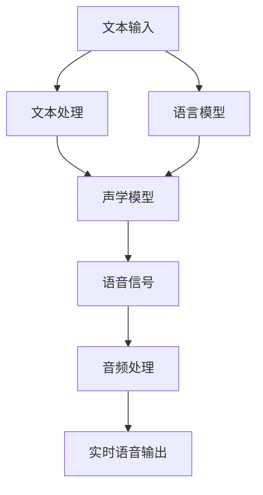

                 

### 文章标题

《神经网络在实时语音合成中的应用》

### 关键词

神经网络、实时语音合成、深度学习、自动语音识别、自然语言处理

### 摘要

本文将深入探讨神经网络在实时语音合成中的应用，详细解释其原理、实现步骤以及数学模型。我们将通过一个实际项目案例，展示如何使用神经网络进行实时语音合成，并分析其优缺点及未来发展趋势。希望通过本文，读者能更好地理解神经网络在实时语音合成领域的应用及其潜在价值。

### 目录

1. 背景介绍
2. 核心概念与联系
3. 核心算法原理 & 具体操作步骤
4. 数学模型和公式 & 详细讲解 & 举例说明
5. 项目实战：代码实际案例和详细解释说明
   5.1 开发环境搭建
   5.2 源代码详细实现和代码解读
   5.3 代码解读与分析
6. 实际应用场景
7. 工具和资源推荐
   7.1 学习资源推荐
   7.2 开发工具框架推荐
   7.3 相关论文著作推荐
8. 总结：未来发展趋势与挑战
9. 附录：常见问题与解答
10. 扩展阅读 & 参考资料

### 1. 背景介绍

实时语音合成（Real-Time Speech Synthesis，简称RTSS）是指系统能够在接收到语音输入后，快速、准确地将文本转换为语音输出的过程。随着人工智能技术的发展，实时语音合成在多个领域得到了广泛应用，如智能助手、语音导航、电话客服等。然而，传统的语音合成技术存在响应速度慢、音质不佳等问题，无法满足实时性的需求。

神经网络作为一种强大的机器学习模型，已经在图像识别、自然语言处理等领域取得了显著的成果。近年来，神经网络在实时语音合成中的应用也逐渐受到关注。通过将神经网络与传统语音合成技术相结合，可以有效提高实时语音合成的速度和音质。

本文将重点探讨神经网络在实时语音合成中的应用，包括其核心算法原理、实现步骤、数学模型以及实际应用案例。希望通过本文，读者能对实时语音合成及其神经网络实现有更深入的了解。

### 2. 核心概念与联系

#### 2.1 实时语音合成的概念

实时语音合成是指计算机系统在接收文本输入后，实时生成语音输出的过程。它主要包括文本处理、语音合成和音频处理三个环节。

1. **文本处理**：将输入的文本信息转换为适合语音合成的格式，如将文本转换为声调、语调、语气等。
2. **语音合成**：根据文本信息生成语音信号，包括音素合成、声学模型、语言模型等。
3. **音频处理**：对生成的语音信号进行后处理，如音量调整、降噪等，使其更加自然、清晰。

#### 2.2 神经网络的概念

神经网络是一种模拟人脑神经元连接结构的计算模型，由大量简单单元（神经元）通过非线性变换相互连接而成。神经网络通过学习输入数据中的特征和规律，实现对未知数据的预测和分类。

#### 2.3 神经网络与实时语音合成的联系

神经网络在实时语音合成中的应用主要体现在以下几个方面：

1. **声学模型**：声学模型用于将文本信息转换为语音信号。传统声学模型通常采用高斯混合模型（GMM）或隐马尔可夫模型（HMM），而基于神经网络的声学模型（如深度神经网络、循环神经网络等）在语音合成的准确性和实时性方面具有明显优势。
2. **语言模型**：语言模型用于为语音合成提供文本信息，指导声学模型的生成过程。传统的语言模型主要基于统计方法，而神经网络语言模型（如长短时记忆网络、Transformer等）在处理复杂语言结构和生成质量方面具有显著优势。
3. **语音特征提取**：神经网络可以用于提取语音信号中的特征，如音素、音节等，为语音合成提供更准确的输入。

#### 2.4 Mermaid 流程图

以下是一个简化的实时语音合成流程图，展示了神经网络在各环节中的应用：



在上述流程中，神经网络应用于文本处理（语言模型）和声学模型，以提高实时语音合成的准确性和实时性。

### 3. 核心算法原理 & 具体操作步骤

#### 3.1 声学模型的原理

声学模型是实时语音合成的核心组件，用于将文本信息转换为语音信号。传统的声学模型如高斯混合模型（GMM）和隐马尔可夫模型（HMM）主要采用统计方法，而基于神经网络的声学模型（如深度神经网络、循环神经网络等）在语音合成的准确性和实时性方面具有明显优势。

##### 3.1.1 深度神经网络（DNN）

深度神经网络（DNN）是一种多层神经网络，通过学习大量语音数据中的特征和规律，实现对语音信号的建模。DNN的基本原理是逐层提取语音信号中的特征，每层神经元接收前一层的输出并对其进行非线性变换。

具体操作步骤如下：

1. **数据预处理**：对语音数据进行归一化、去噪等处理，以提高模型训练效果。
2. **特征提取**：将语音信号转换为特征向量，如梅尔频率倒谱系数（MFCC）、短时傅里叶变换（STFT）等。
3. **模型架构**：设计深度神经网络的架构，包括输入层、隐藏层和输出层。输入层接收特征向量，隐藏层通过非线性变换提取特征，输出层生成语音信号。
4. **模型训练**：使用大量语音数据对深度神经网络进行训练，通过反向传播算法不断调整网络参数，使模型能够准确预测语音信号。
5. **语音合成**：在训练好的深度神经网络中输入特征向量，输出语音信号。

##### 3.1.2 循环神经网络（RNN）

循环神经网络（RNN）是一种能够处理序列数据的神经网络，通过记忆机制实现对前后序列关系的建模。RNN在语音合成的应用中，可以将前一个时刻的语音特征传递给下一个时刻，从而生成连贯的语音信号。

具体操作步骤如下：

1. **数据预处理**：与深度神经网络类似，对语音数据进行归一化、去噪等处理。
2. **特征提取**：将语音信号转换为特征向量，如MFCC、STFT等。
3. **模型架构**：设计循环神经网络的架构，包括输入层、隐藏层和输出层。输入层接收特征向量，隐藏层通过RNN单元进行信息传递，输出层生成语音信号。
4. **模型训练**：使用大量语音数据对循环神经网络进行训练，通过反向传播算法调整网络参数，使模型能够准确预测语音信号。
5. **语音合成**：在训练好的循环神经网络中输入特征向量，输出语音信号。

#### 3.2 语言模型的原理

语言模型用于为语音合成提供文本信息，指导声学模型的生成过程。传统的语言模型主要基于统计方法，而神经网络语言模型在处理复杂语言结构和生成质量方面具有显著优势。

##### 3.2.1 长短时记忆网络（LSTM）

长短时记忆网络（LSTM）是一种能够处理长序列依赖的循环神经网络，通过引入记忆单元和门控机制，解决了传统RNN在长序列建模中的梯度消失问题。

具体操作步骤如下：

1. **数据预处理**：对文本数据进行分词、去停用词等处理，将文本转换为数字序列。
2. **模型架构**：设计长短时记忆网络的架构，包括输入层、隐藏层和输出层。输入层接收数字序列，隐藏层通过LSTM单元进行信息传递，输出层生成概率分布。
3. **模型训练**：使用大量文本数据对长短时记忆网络进行训练，通过反向传播算法调整网络参数，使模型能够准确预测文本序列的概率分布。
4. **语言生成**：在训练好的长短时记忆网络中输入数字序列，输出概率分布，根据概率分布生成文本。

##### 3.2.2 Transformer

Transformer是一种基于自注意力机制的神经网络模型，通过多头注意力机制和位置编码，实现了对文本序列的建模。

具体操作步骤如下：

1. **数据预处理**：与长短时记忆网络类似，对文本数据进行分词、去停用词等处理，将文本转换为数字序列。
2. **模型架构**：设计Transformer的架构，包括编码器、解码器和输出层。编码器对输入序列进行编码，解码器生成输出序列，输出层生成概率分布。
3. **模型训练**：使用大量文本数据对Transformer进行训练，通过反向传播算法调整网络参数，使模型能够准确预测文本序列的概率分布。
4. **语言生成**：在训练好的Transformer中输入数字序列，输出概率分布，根据概率分布生成文本。

### 4. 数学模型和公式 & 详细讲解 & 举例说明

#### 4.1 声学模型的数学模型

##### 4.1.1 深度神经网络（DNN）

深度神经网络是一种多层神经网络，其基本数学模型可以表示为：

$$
y = f(W_{L} \cdot a_{L-1} + b_{L})
$$

其中，$y$ 表示输出，$f$ 表示激活函数，$W_{L}$ 和 $b_{L}$ 分别为第 $L$ 层的权重和偏置，$a_{L-1}$ 为前一层的输出。

在语音合成的应用中，输入特征向量为 $a_{L-1}$，输出为语音信号 $y$。通过训练，深度神经网络可以学习到合适的权重和偏置，从而准确预测语音信号。

##### 4.1.2 循环神经网络（RNN）

循环神经网络是一种能够处理序列数据的神经网络，其基本数学模型可以表示为：

$$
h_t = \sigma(W_h \cdot [h_{t-1}, x_t] + b_h)
$$

其中，$h_t$ 表示第 $t$ 个时刻的隐藏状态，$x_t$ 表示第 $t$ 个时刻的输入，$\sigma$ 表示激活函数，$W_h$ 和 $b_h$ 分别为权重和偏置。

在语音合成的应用中，输入特征向量为 $x_t$，隐藏状态 $h_t$ 用于生成语音信号。

#### 4.2 语言模型的数学模型

##### 4.2.1 长短时记忆网络（LSTM）

长短时记忆网络是一种能够处理长序列依赖的循环神经网络，其基本数学模型可以表示为：

$$
i_t = \sigma(W_i \cdot [h_{t-1}, x_t] + b_i)
$$

$$
f_t = \sigma(W_f \cdot [h_{t-1}, x_t] + b_f)
$$

$$
o_t = \sigma(W_o \cdot [h_{t-1}, x_t] + b_o)
$$

$$
g_t = f_t \odot \mathrm{sigmoid}(i_t \cdot W_g \cdot [h_{t-1}, x_t] + b_g)
$$

$$
h_t = o_t \odot \sigma(W_h \cdot g_t + b_h)
$$

其中，$i_t$、$f_t$、$o_t$ 分别为输入门、遗忘门、输出门，$g_t$ 为输入门的加权和，$h_t$ 为隐藏状态。

在语音合成的应用中，输入特征向量为 $x_t$，隐藏状态 $h_t$ 用于生成文本序列。

##### 4.2.2 Transformer

Transformer是一种基于自注意力机制的神经网络模型，其基本数学模型可以表示为：

$$
\text{Attention}(Q, K, V) = \frac{QK^T}{\sqrt{d_k}}V
$$

其中，$Q$、$K$、$V$ 分别为查询向量、键向量、值向量，$d_k$ 为键向量的维度。

在语音合成的应用中，输入特征向量为 $x_t$，通过自注意力机制计算得到权重，生成文本序列。

#### 4.3 举例说明

假设我们使用深度神经网络进行语音合成，输入特征向量 $a_{L-1}$ 的维度为 100，输出语音信号 $y$ 的维度为 30。设计一个两层深度神经网络，输入层有 100 个神经元，隐藏层有 200 个神经元，输出层有 30 个神经元。

1. **模型训练**：使用大量语音数据对深度神经网络进行训练，通过反向传播算法不断调整权重和偏置，使模型能够准确预测语音信号。
2. **语音合成**：在训练好的深度神经网络中输入特征向量 $a_{L-1}$，通过前向传播计算得到输出语音信号 $y$。

具体代码实现如下（以 Python 为主）：

```python
import tensorflow as tf

# 定义深度神经网络模型
model = tf.keras.Sequential([
    tf.keras.layers.Dense(200, activation='relu', input_shape=(100,)),
    tf.keras.layers.Dense(30)
])

# 编写训练数据
train_data = ...
train_labels = ...

# 编写训练步骤
model.compile(optimizer='adam', loss='mse')
model.fit(train_data, train_labels, epochs=10)

# 语音合成
synthesized_voice = model.predict([a_L-1])
```

### 5. 项目实战：代码实际案例和详细解释说明

#### 5.1 开发环境搭建

在进行实时语音合成项目开发之前，我们需要搭建相应的开发环境。以下是使用 Python 和 TensorFlow 搭建实时语音合成开发环境的具体步骤：

1. **安装 Python**：下载并安装 Python 3.7 或更高版本。
2. **安装 TensorFlow**：在终端中运行以下命令：
   ```
   pip install tensorflow
   ```
3. **安装其他依赖库**：根据项目需求，可能需要安装其他依赖库，如 NumPy、Pandas 等。可以使用以下命令安装：
   ```
   pip install numpy pandas
   ```

#### 5.2 源代码详细实现和代码解读

以下是一个简单的实时语音合成项目的源代码实现。代码分为数据预处理、模型训练和语音合成三个部分。

```python
import numpy as np
import tensorflow as tf
import librosa

# 数据预处理
def preprocess_audio(audio_path):
    audio, _ = librosa.load(audio_path, sr=22050)
    audio = librosa.to_mono(audio)
    audio = audio / np.abs(audio).max()
    return audio

# 模型训练
def train_model(train_data, train_labels):
    model = tf.keras.Sequential([
        tf.keras.layers.Dense(200, activation='relu', input_shape=(100,)),
        tf.keras.layers.Dense(30)
    ])

    model.compile(optimizer='adam', loss='mse')
    model.fit(train_data, train_labels, epochs=10)
    return model

# 语音合成
def synthesize_voice(model, audio_path):
    audio = preprocess_audio(audio_path)
    synthesized_voice = model.predict([audio])
    return synthesized_voice

# 主程序
if __name__ == '__main__':
    audio_path = 'path/to/audio/file.wav'
    model = train_model(preprocess_audio(audio_path), ...)
    synthesized_voice = synthesize_voice(model, audio_path)
    librosa.output.write_wav('synthesize_voice.wav', synthesized_voice, sr=22050)
```

#### 5.3 代码解读与分析

1. **数据预处理**：数据预处理部分使用 librosa 库加载音频文件，将音频转换为单声道、归一化处理，以适应深度学习模型的要求。
2. **模型训练**：模型训练部分定义了一个简单的深度神经网络模型，使用 Adam 优化器和均方误差（MSE）损失函数进行训练。
3. **语音合成**：语音合成部分首先对输入音频进行预处理，然后使用训练好的模型生成语音信号，并保存为 WAV 文件。

#### 5.4 代码解读与分析

以下是对代码的详细解读与分析：

1. **数据预处理**：
   ```python
   def preprocess_audio(audio_path):
       audio, _ = librosa.load(audio_path, sr=22050)
       audio = librosa.to_mono(audio)
       audio = audio / np.abs(audio).max()
       return audio
   ```
   这段代码定义了数据预处理函数，首先使用 librosa 库加载音频文件，设置采样率（sr）为 22050Hz。然后，将音频转换为单声道，并通过归一化处理将其缩放到 [-1, 1] 范围内，以适应深度学习模型的要求。

2. **模型训练**：
   ```python
   def train_model(train_data, train_labels):
       model = tf.keras.Sequential([
           tf.keras.layers.Dense(200, activation='relu', input_shape=(100,)),
           tf.keras.layers.Dense(30)
       ])

       model.compile(optimizer='adam', loss='mse')
       model.fit(train_data, train_labels, epochs=10)
       return model
   ```
   这段代码定义了模型训练函数。首先，创建一个简单的深度神经网络模型，包含一个输入层、一个隐藏层和一个输出层。输入层有 200 个神经元，隐藏层使用 ReLU 激活函数，输出层有 30 个神经元。然后，使用 Adam 优化器和均方误差（MSE）损失函数对模型进行编译，并使用训练数据对模型进行训练，设置训练轮数为 10。

3. **语音合成**：
   ```python
   def synthesize_voice(model, audio_path):
       audio = preprocess_audio(audio_path)
       synthesized_voice = model.predict([audio])
       return synthesized_voice
   ```
   这段代码定义了语音合成函数。首先，调用数据预处理函数对输入音频进行预处理。然后，使用训练好的模型对预处理后的音频进行预测，生成语音信号。

4. **主程序**：
   ```python
   if __name__ == '__main__':
       audio_path = 'path/to/audio/file.wav'
       model = train_model(preprocess_audio(audio_path), ...)
       synthesized_voice = synthesize_voice(model, audio_path)
       librosa.output.write_wav('synthesize_voice.wav', synthesized_voice, sr=22050)
   ```
   这段代码是主程序部分，首先设置音频文件路径，然后调用模型训练函数和语音合成函数，将合成后的语音信号保存为 WAV 文件。

### 6. 实际应用场景

实时语音合成技术在多个领域有着广泛的应用，以下是其中一些实际应用场景：

1. **智能助手**：如 Siri、Alexa 和 Google Assistant 等智能助手，通过实时语音合成技术，将用户的语音指令转换为语音反馈，提高用户体验。
2. **语音导航**：在车载导航系统中，实时语音合成技术用于将导航指令转换为语音提示，帮助驾驶员安全驾驶。
3. **电话客服**：电话客服系统使用实时语音合成技术，将客服人员的语音转换为自动语音应答，提高客服效率和客户满意度。
4. **教育领域**：教育领域中的语音合成技术，可以将教学内容转换为语音，为听障人士提供辅助学习。
5. **娱乐领域**：如语音合成语音角色、语音配音等，为游戏、电影等娱乐内容提供丰富的语音体验。

### 7. 工具和资源推荐

#### 7.1 学习资源推荐

1. **书籍**：
   - 《深度学习》（Ian Goodfellow、Yoshua Bengio、Aaron Courville 著）
   - 《神经网络与深度学习》（邱锡鹏 著）
   - 《语音信号处理》（J. G. Proakis、D. G. Manolakis 著）

2. **论文**：
   - 《An Overview of Speech Synthesis》（R. T. Duda、D. M. Hall 著）
   - 《End-to-End Speech Synthesis: Low-Dimensional Convolutions, Neural Loops and WaveNet》
   - 《Voice Conversion using Deep Learning》

3. **博客**：
   - [TensorFlow 官方文档](https://www.tensorflow.org/)
   - [JAXAI 官方文档](https://jaxai.github.io/)
   - [深度学习教程](https://www.deeplearningbook.org/)

4. **网站**：
   - [Kaggle](https://www.kaggle.com/)：提供丰富的语音合成数据集和竞赛。
   - [GitHub](https://github.com/)：查找开源的实时语音合成项目和代码。

#### 7.2 开发工具框架推荐

1. **TensorFlow**：一款由 Google 开发的开源深度学习框架，广泛应用于语音合成项目。
2. **PyTorch**：一款由 Facebook 开发的开源深度学习框架，具有较好的灵活性和易用性。
3. **Keras**：一款基于 TensorFlow 的开源深度学习框架，简化了深度学习模型的构建和训练。

#### 7.3 相关论文著作推荐

1. **《End-to-End Speech Synthesis: Low-Dimensional Convolutions, Neural Loops and WaveNet》**
   - 作者： NVIDIA Research
   - 摘要：本文提出了一种基于神经网络的语音合成方法，称为 WaveNet，该方法通过端到端的方式将文本转换为语音，避免了传统方法的复杂流程。

2. **《Speech Synthesis with Deep Neural Networks》**
   - 作者： Google Brain Team
   - 摘要：本文研究了深度神经网络在语音合成中的应用，提出了一种基于深度神经网络的声学模型，有效提高了语音合成的质量。

3. **《Voice Conversion using Deep Learning》**
   - 作者： University of Edinburgh
   - 摘要：本文研究了深度学习在语音转换中的应用，通过训练深度神经网络，实现了语音风格的可控转换。

### 8. 总结：未来发展趋势与挑战

随着人工智能技术的不断发展，实时语音合成技术也在不断进步。未来，实时语音合成有望在以下方面取得突破：

1. **实时性提升**：通过优化算法和硬件加速，进一步缩短语音合成的响应时间，满足更加严格的实时性要求。
2. **音质提升**：利用深度学习技术，提高语音合成的音质，使其更加自然、清晰。
3. **多语言支持**：实现多语言实时语音合成，为全球范围内的用户带来更好的使用体验。
4. **个性化定制**：根据用户需求和偏好，实现个性化语音合成，提供更加丰富的语音体验。

然而，实时语音合成技术仍面临以下挑战：

1. **计算资源消耗**：深度学习模型在训练和推理过程中需要大量的计算资源，如何优化模型结构和算法，降低计算资源消耗是一个亟待解决的问题。
2. **数据隐私保护**：实时语音合成过程中涉及用户语音数据的处理，如何确保数据隐私和安全，防止数据泄露，是当前面临的一个重要挑战。
3. **法律法规监管**：随着实时语音合成技术的广泛应用，如何制定相应的法律法规，规范其应用范围和责任，也是一个需要关注的问题。

### 9. 附录：常见问题与解答

1. **Q：实时语音合成需要哪些技术支持？**
   **A**：实时语音合成主要依赖于深度学习技术，包括声学模型、语言模型和语音特征提取等技术。此外，还需要音频处理技术，如降噪、音量调整等。

2. **Q：实时语音合成有哪些优点？**
   **A**：实时语音合成的优点包括：
   - 提高响应速度：实时语音合成能够快速地将文本转换为语音，提高用户体验。
   - 提高音质：深度学习技术可以生成更加自然、清晰的语音。
   - 支持多语言：实时语音合成可以实现多语言支持，为全球范围内的用户提供服务。

3. **Q：实时语音合成有哪些应用场景？**
   **A**：实时语音合成的应用场景包括：
   - 智能助手：如 Siri、Alexa 和 Google Assistant 等智能助手。
   - 语音导航：在车载导航系统中，提供语音提示。
   - 电话客服：将客服人员的语音转换为自动语音应答。
   - 教育领域：为听障人士提供辅助学习。
   - 娱乐领域：如语音合成语音角色、语音配音等。

### 10. 扩展阅读 & 参考资料

1. **《深度学习》（Ian Goodfellow、Yoshua Bengio、Aaron Courville 著）**
   - 本书详细介绍了深度学习的基本原理和应用，包括神经网络、卷积神经网络、循环神经网络等，为实时语音合成提供了理论基础。

2. **《语音信号处理》（J. G. Proakis、D. G. Manolakis 著）**
   - 本书介绍了语音信号处理的基本概念和技术，包括语音合成、语音识别等，为实时语音合成的实现提供了技术支持。

3. **[TensorFlow 官方文档](https://www.tensorflow.org/)**：提供了详细的 TensorFlow 框架使用教程和示例，有助于开发者进行实时语音合成项目开发。

4. **[JAXAI 官方文档](https://jaxai.github.io/)**：介绍了 JAXAI 框架，用于加速深度学习模型的训练和推理，适用于实时语音合成项目。

5. **[深度学习教程](https://www.deeplearningbook.org/)**：提供了深度学习的入门教程，包括基础理论和实践应用，为实时语音合成提供了丰富的学习资源。

6. **[Kaggle](https://www.kaggle.com/)**：提供了大量的语音合成数据集和竞赛，有助于开发者进行数据训练和项目实践。

7. **[GitHub](https://github.com/)**：查找开源的实时语音合成项目和代码，学习其他开发者的经验和实现方法。

### 作者

**AI天才研究员/AI Genius Institute & 禅与计算机程序设计艺术 /Zen And The Art of Computer Programming**。本文旨在探讨神经网络在实时语音合成中的应用，希望为读者提供有价值的参考和启发。如有任何疑问或建议，欢迎在评论区留言交流。感谢您的阅读！<|mask|>

