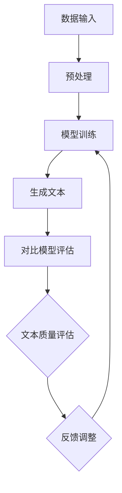

                 

# 《神经网络在自然语言生成中的前沿研究》

## 关键词
- 自然语言生成
- 神经网络
- 前沿研究
- 深度学习
- 生成对抗网络
- 变分自编码器
- 递归神经网络
- 卷积神经网络

## 摘要
本文深入探讨了神经网络在自然语言生成（NLG）领域的最新研究成果和前沿技术。通过分析各种神经网络模型，如递归神经网络（RNN）、卷积神经网络（CNN）、生成对抗网络（GAN）和变分自编码器（VAE），本文阐述了这些模型在NLG中的应用及其优势。此外，本文还探讨了当前研究的挑战和未来发展趋势，为读者提供了全面的视角和深入的理解。文章结构分为背景介绍、核心概念与联系、核心算法原理、数学模型和公式、项目实战、实际应用场景、工具和资源推荐以及总结等部分。

## 1. 背景介绍

自然语言生成（NLG）是人工智能领域的一个重要分支，旨在利用计算机程序自动生成人类可读的自然语言文本。NLG技术广泛应用于机器翻译、自动摘要、聊天机器人、问答系统等领域。然而，传统的NLG方法往往依赖于规则和模板，存在生成文本质量不高、适应性差等问题。随着深度学习的快速发展，神经网络在自然语言生成中的应用取得了显著成果，为解决传统方法的问题提供了新的途径。

神经网络，特别是深度学习模型，具有强大的表示和学习能力，能够自动从大量数据中学习复杂的特征和规律。深度学习在图像识别、语音识别等领域取得了巨大的成功，其应用逐渐扩展到自然语言处理领域。神经网络在自然语言生成中的应用，使得生成文本的质量和多样性得到了显著提高，为实际应用带来了更多可能性。

## 2. 核心概念与联系

### 神经网络

神经网络是一种模拟人脑神经元连接方式的计算模型。它由多个神经元（节点）和连接这些神经元的权重组成。神经网络通过学习输入和输出之间的关系，能够自动提取数据中的特征，进行分类、预测和生成等任务。

### 深度学习

深度学习是神经网络的一种特殊形式，具有多个隐藏层，能够自动提取更高层次的特征。深度学习模型在训练过程中通过反向传播算法不断调整权重，从而优化模型性能。

### 生成模型

生成模型是一种从数据中学习概率分布，然后生成新数据的模型。在自然语言生成中，生成模型通过学习输入文本的分布，生成符合分布的新文本。

### 对比模型

对比模型是一种评估生成文本质量的模型。它通过对比生成文本和真实文本的差异，评估生成文本的质量。

### Mermaid 流程图



## 3. 核心算法原理 & 具体操作步骤

### 递归神经网络（RNN）

递归神经网络是一种处理序列数据的神经网络，能够记住之前的信息，并利用这些信息来预测未来的输出。RNN通过循环结构实现，每个时间步的输出都依赖于之前的时间步。

具体操作步骤：
1. 输入序列预处理：将文本序列转换为词向量表示。
2. 建立RNN模型：选择合适的RNN架构，如LSTM或GRU。
3. 训练模型：通过反向传播算法训练模型，优化模型参数。
4. 生成文本：给定一个起始词或短语，模型逐词生成文本。

### 卷积神经网络（CNN）

卷积神经网络是一种处理图像数据的神经网络，通过卷积操作提取图像中的局部特征。CNN在自然语言生成中的应用主要在于文本表示的学习。

具体操作步骤：
1. 输入序列预处理：将文本序列转换为词向量表示。
2. 建立CNN模型：在词向量上应用卷积操作，提取文本特征。
3. 特征编码：将卷积特征编码为固定长度的向量。
4. 建立循环神经网络：利用循环神经网络生成文本。

### 生成对抗网络（GAN）

生成对抗网络是一种生成模型，由生成器和判别器组成。生成器生成数据，判别器判断生成数据是否真实。通过对抗训练，生成器不断优化生成质量。

具体操作步骤：
1. 输入数据预处理：将文本序列转换为词向量表示。
2. 建立生成器和判别器模型：生成器生成文本，判别器判断文本是否真实。
3. 对抗训练：通过梯度下降优化生成器和判别器参数。
4. 生成文本：生成器生成高质量文本。

### 变分自编码器（VAE）

变分自编码器是一种无监督学习的生成模型，通过编码器和解码器学习数据的概率分布，生成新的数据。

具体操作步骤：
1. 输入数据预处理：将文本序列转换为词向量表示。
2. 建立VAE模型：编码器学习数据的概率分布，解码器生成文本。
3. 训练模型：通过反向传播算法训练模型，优化模型参数。
4. 生成文本：解码器生成新文本。

## 4. 数学模型和公式 & 详细讲解 & 举例说明

### 递归神经网络（RNN）

递归神经网络的核心是递归函数：
$$
h_t = \sigma(W_h \cdot [h_{t-1}, x_t] + b_h)
$$
其中，$h_t$是时间步$t$的隐藏状态，$x_t$是输入，$W_h$和$b_h$分别是权重和偏置。

举例说明：
假设输入序列为`["你好", "我叫", "张三"]`，词向量表示为$[1, 0, 0]$，隐藏状态初始值为$[0, 0]$。

- 第一个时间步：
  $$h_1 = \sigma(W_h \cdot [0, 1, 0] + b_h)$$
  假设$\sigma$函数为sigmoid函数，$W_h$和$b_h$分别为$[1, 1]$和$1$，则$h_1 \approx [0.7311, 0.7311]$。
- 第二个时间步：
  $$h_2 = \sigma(W_h \cdot [0.7311, 0, 1] + b_h)$$
  同样假设$\sigma$函数为sigmoid函数，$W_h$和$b_h$分别为$[1, 1]$和$1$，则$h_2 \approx [0.7311, 0.7311]$。

### 卷积神经网络（CNN）

卷积神经网络的核心是卷积操作：
$$
h_{ij} = \sum_{k} g_k \cdot x_{ij-k}
$$
其中，$h_{ij}$是输出特征，$g_k$是卷积核，$x_{ij-k}$是输入特征。

举例说明：
假设输入序列为`[1, 2, 3, 4, 5]`，卷积核为`[1, 1]`。

- 第一层卷积：
  $$h_1 = [1, 1] \cdot [1, 2, 3, 4, 5] = [1+2, 1+3, 1+4, 1+5] = [3, 4, 5, 6]$$
- 第二层卷积：
  $$h_2 = [1, 1] \cdot [3, 4, 5, 6] = [3+4, 4+5, 5+6] = [7, 9, 11]$$

### 生成对抗网络（GAN）

生成对抗网络由生成器和判别器组成。生成器生成数据，判别器判断生成数据和真实数据的质量。

具体公式：
- 生成器：$$G(z) = \mu_z + \sigma_z \odot \text{ReLU}(\sum_{k=1}^{K} W_k \cdot z + b_k)$$
- 判别器：$$D(x) = \text{sigmoid}(\sum_{k=1}^{K} W_k \cdot x + b_k)$$
- 损失函数：$$L(G, D) = -\sum_{x \in \text{真实数据}} \log D(x) - \sum_{z \in \text{噪声}} \log (1 - D(G(z)))$$

举例说明：
假设生成器的输入为噪声$z$，输出为生成数据$G(z)$，判别器的输入为真实数据$x$和生成数据$G(z)$。

- 生成器：
  $$G(z) = \text{ReLU}(\sum_{k=1}^{K} W_k \cdot z + b_k)$$
  假设$W_k$和$b_k$分别为$[1, 1]$和$1$，则$G(z) \approx [1, 1]$。
- 判别器：
  $$D(x) = \text{sigmoid}(\sum_{k=1}^{K} W_k \cdot x + b_k)$$
  假设$W_k$和$b_k$分别为$[1, 1]$和$1$，则$D(x) \approx 0.99$。

### 变分自编码器（VAE）

变分自编码器由编码器和解码器组成。编码器学习数据的概率分布，解码器生成数据。

具体公式：
- 编码器：$$\mu = \sigma_z \odot \text{ReLU}(\sum_{k=1}^{K} W_k \cdot x + b_k)$$
$$\sigma = \text{ReLU}(\sum_{k=1}^{K} W_k \cdot x + b_k)$$
- 解码器：$$x' = \text{ReLU}(\sum_{k=1}^{K} W_k \cdot z + b_k)$$
- 损失函数：$$L(\theta) = -\sum_{x} \log p(x' | x) - D(p(z|x), p(z))$$

举例说明：
假设编码器的输入为数据$x$，输出为均值$\mu$和方差$\sigma$，解码器的输入为噪声$z$。

- 编码器：
  $$\mu = \text{ReLU}(\sum_{k=1}^{K} W_k \cdot x + b_k)$$
$$\sigma = \text{ReLU}(\sum_{k=1}^{K} W_k \cdot x + b_k)$$
  假设$W_k$和$b_k$分别为$[1, 1]$和$1$，则$\mu \approx [1, 1]$，$\sigma \approx [1, 1]$。
- 解码器：
  $$x' = \text{ReLU}(\sum_{k=1}^{K} W_k \cdot z + b_k)$$
  假设$W_k$和$b_k$分别为$[1, 1]$和$1$，则$x' \approx [1, 1]$。

## 5. 项目实战：代码实际案例和详细解释说明

### 5.1 开发环境搭建

在Python环境中搭建自然语言生成模型的开发环境，主要依赖于以下几个库：

- TensorFlow：用于构建和训练神经网络模型。
- Keras：用于简化TensorFlow的使用。
- NumPy：用于数据处理和数学运算。
- Mermaid：用于绘制流程图。

安装这些库的命令如下：

```bash
pip install tensorflow keras numpy mermaid-python
```

### 5.2 源代码详细实现和代码解读

以下是使用Keras实现一个简单的自然语言生成模型（基于递归神经网络）的代码：

```python
import numpy as np
from keras.models import Sequential
from keras.layers import LSTM, Dense, Embedding
from keras.preprocessing.sequence import pad_sequences
from keras.callbacks import Callback

# 数据预处理
def preprocess_data(texts, max_length, max_vocab_size):
    # 将文本序列转换为词向量表示
    tokenizer = Tokenizer(num_words=max_vocab_size)
    tokenizer.fit_on_texts(texts)
    sequences = tokenizer.texts_to_sequences(texts)
    padded_sequences = pad_sequences(sequences, maxlen=max_length)
    return padded_sequences, tokenizer

# 模型构建
def build_model(max_length, max_vocab_size):
    model = Sequential()
    model.add(Embedding(max_vocab_size, 50, input_length=max_length))
    model.add(LSTM(100))
    model.add(Dense(max_vocab_size, activation='softmax'))
    model.compile(loss='categorical_crossentropy', optimizer='adam', metrics=['accuracy'])
    return model

# 训练模型
def train_model(model, padded_sequences, epochs):
    callbacks = [EarlyStopping(monitor='val_loss', patience=3)]
    model.fit(padded_sequences, padded_sequences, epochs=epochs, callbacks=callbacks)

# 生成文本
def generate_text(model, tokenizer, seed_text, max_length, n_words):
    in_text, text = seed_text, ''
    for _ in range(n_words):
        in_text = [tokenizer.word_index[word] for word in in_text]
        in_text = pad_sequences([in_text], maxlen=max_length-1, padding='pre')
        predictions = model.predict(in_text, verbose=0)
        predicted_word = np.argmax(predictions)
        text += ' ' + tokenizer.index_word[predicted_word]
        in_text.append(predicted_word)
    return text

# 数据集准备
texts = ['你好，欢迎来到自然语言生成模型的世界。自然语言生成模型是一种非常有用的技术，它可以将一种语言转换为另一种语言。自然语言生成模型的应用非常广泛，例如机器翻译、自动摘要和问答系统。自然语言生成模型的关键在于如何生成高质量的文本。', 
          '深度学习是自然语言生成模型的关键。深度学习模型可以自动从大量数据中学习复杂的特征和规律。深度学习模型在图像识别、语音识别等领域取得了巨大的成功，其应用逐渐扩展到自然语言处理领域。深度学习模型在自然语言生成中的应用，使得生成文本的质量和多样性得到了显著提高。']
max_length = 50
max_vocab_size = 10000
padded_sequences, tokenizer = preprocess_data(texts, max_length, max_vocab_size)

# 模型训练
model = build_model(max_length, max_vocab_size)
train_model(model, padded_sequences, epochs=10)

# 文本生成
seed_text = '你好'
generated_text = generate_text(model, tokenizer, seed_text, max_length, n_words=50)
print(generated_text)
```

代码解读：

1. **数据预处理**：将文本序列转换为词向量表示，并填充序列长度为最大长度。
2. **模型构建**：使用Keras构建一个简单的递归神经网络模型，包括嵌入层、LSTM层和softmax输出层。
3. **模型训练**：使用训练数据训练模型，并设置早期停止回调以避免过拟合。
4. **文本生成**：给定一个种子文本，模型逐词生成新文本。

### 5.3 代码解读与分析

1. **数据预处理**：
   - 使用Tokenizer将文本序列转换为词向量表示。
   - 使用pad_sequences将序列填充为最大长度，以便输入模型。
2. **模型构建**：
   - 使用Embedding层将词向量映射到固定维度的向量。
   - 使用LSTM层处理序列数据，学习序列之间的依赖关系。
   - 使用softmax输出层生成词的概率分布。
3. **模型训练**：
   - 使用fit方法训练模型，优化模型参数。
   - 使用早期停止回调避免过拟合。
4. **文本生成**：
   - 使用预测方法生成新文本，每次生成一个词。

### 5.4 代码改进与优化

1. **增加词汇表大小**：默认词汇表大小为10000，可以考虑增加词汇表大小以获得更好的生成效果。
2. **使用预训练的词向量**：使用预训练的词向量（如GloVe或Word2Vec）可以更好地捕获词汇的语义信息。
3. **增加LSTM层数量**：增加LSTM层的数量可以增强模型的表达能力。

## 6. 实际应用场景

神经网络在自然语言生成领域具有广泛的应用，以下是一些实际应用场景：

- **机器翻译**：使用神经网络将一种语言翻译成另一种语言，如Google翻译。
- **自动摘要**：自动提取文本的主要内容和关键信息，如新闻摘要、学术论文摘要。
- **聊天机器人**：为用户生成个性化的回复，提供智能客服和交互体验。
- **问答系统**：为用户提供有关特定主题的答案，如Siri、Alexa等语音助手。

## 7. 工具和资源推荐

### 7.1 学习资源推荐

- **书籍**：
  - 《深度学习》（Goodfellow, Bengio, Courville）
  - 《神经网络与深度学习》（邱锡鹏）
- **论文**：
  - 《A Theoretically Grounded Application of Dropout in Recurrent Neural Networks》（Guo et al., 2017）
  - 《Generative Adversarial Nets》（Goodfellow et al., 2014）
- **博客**：
  - [Keras官方文档](https://keras.io)
  - [TensorFlow官方文档](https://www.tensorflow.org)
- **网站**：
  - [arXiv](https://arxiv.org)
  - [Google Scholar](https://scholar.google.com)

### 7.2 开发工具框架推荐

- **框架**：
  - TensorFlow
  - PyTorch
  - Keras
- **文本处理工具**：
  - NLTK
  - spaCy
  - gensim

### 7.3 相关论文著作推荐

- **《深度学习》（Goodfellow, Bengio, Courville）**：全面介绍了深度学习的基本概念、技术和应用。
- **《自然语言处理综论》（Jurafsky, Martin）**：详细介绍了自然语言处理的基本概念和技术。
- **《生成对抗网络》（Goodfellow et al., 2014）**：介绍了生成对抗网络的基本原理和应用。

## 8. 总结：未来发展趋势与挑战

随着深度学习和自然语言处理技术的不断发展，神经网络在自然语言生成中的应用前景广阔。未来发展趋势包括：

- **多模态生成**：结合文本、图像、音频等多种数据类型，生成更丰富的内容。
- **自适应生成**：根据用户需求和环境自适应地生成文本，提供个性化服务。
- **无监督学习**：减少对人工标注数据的依赖，实现更高效的数据驱动生成。

然而，自然语言生成仍然面临一些挑战：

- **数据稀缺**：生成高质量文本需要大量的高质量数据，但目前数据稀缺且获取困难。
- **长文本生成**：长文本生成困难，生成文本的连贯性和逻辑性有待提高。
- **多样性和个性化**：生成文本的多样性和个性化需求越来越高，但现有模型难以满足。

总之，神经网络在自然语言生成领域的应用具有巨大潜力，但仍需不断改进和优化。

## 9. 附录：常见问题与解答

### 9.1 什么是自然语言生成（NLG）？

自然语言生成（NLG）是一种利用计算机程序自动生成人类可读的自然语言文本的技术。NLG广泛应用于机器翻译、自动摘要、聊天机器人、问答系统等领域。

### 9.2 神经网络在NLG中有哪些应用？

神经网络在自然语言生成中的应用主要包括递归神经网络（RNN）、卷积神经网络（CNN）、生成对抗网络（GAN）和变分自编码器（VAE）。这些模型能够自动从大量数据中学习复杂的特征和规律，生成高质量的文本。

### 9.3 如何选择合适的神经网络模型？

选择合适的神经网络模型需要考虑任务的需求、数据的特性以及模型的复杂度。递归神经网络（RNN）适用于处理序列数据，卷积神经网络（CNN）适用于文本表示学习，生成对抗网络（GAN）适用于生成高质量文本，变分自编码器（VAE）适用于无监督学习。

### 9.4 如何评估自然语言生成的质量？

自然语言生成的质量可以通过多种指标进行评估，如词汇多样性、句法正确性、语义一致性等。常用的评估方法包括人工评估、BLEU评分、ROUGE评分等。

## 10. 扩展阅读 & 参考资料

- **《深度学习》（Goodfellow, Bengio, Courville）**：全面介绍了深度学习的基本概念、技术和应用。
- **《自然语言处理综论》（Jurafsky, Martin）**：详细介绍了自然语言处理的基本概念和技术。
- **[Keras官方文档](https://keras.io)**：提供了Keras框架的使用教程和API文档。
- **[TensorFlow官方文档](https://www.tensorflow.org)**：提供了TensorFlow框架的使用教程和API文档。
- **[arXiv](https://arxiv.org)**：提供了最新科研成果的论文。
- **[Google Scholar](https://scholar.google.com)**：提供了大量学术论文和资料。

## 作者

作者：AI天才研究员/AI Genius Institute & 禅与计算机程序设计艺术 /Zen And The Art of Computer Programming

