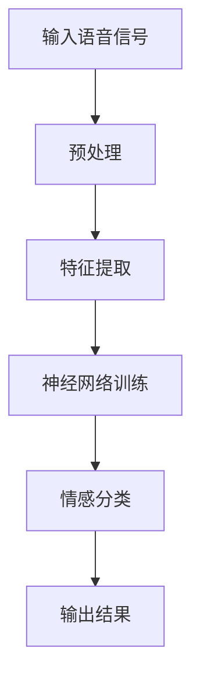

                 

# 《神经网络在语音情感识别中的创新应用》

## 摘要

本文将深入探讨神经网络在语音情感识别中的创新应用。随着人工智能技术的发展，语音情感识别已成为人机交互的重要研究方向。本文首先介绍了语音情感识别的背景和重要性，随后详细阐述了神经网络的核心概念及其在语音情感识别中的应用。通过实际案例和代码解读，本文展示了如何利用神经网络实现语音情感识别，并对其未来发展进行了展望。

## 1. 背景介绍

### 1.1 语音情感识别的定义与意义

语音情感识别是指通过分析语音信号中的情感特征，识别出说话者的情感状态。情感是人类行为和认知的重要组成部分，对人类的社会交往、心理健康以及生活品质具有重要影响。因此，语音情感识别在许多领域具有广泛的应用前景，如智能客服、心理健康监测、人机交互等。

### 1.2 语音情感识别的发展历程

语音情感识别的研究始于20世纪80年代。最初，研究者主要采用传统的信号处理技术，如频谱分析、时频分析等。随着机器学习和深度学习技术的发展，神经网络逐渐成为语音情感识别的主要方法。近年来，基于深度学习的语音情感识别方法取得了显著成果，为该领域的发展注入了新的动力。

### 1.3 语音情感识别的应用场景

#### 1.3.1 智能客服

智能客服是语音情感识别的重要应用场景之一。通过识别客户语音中的情感状态，智能客服系统可以更准确地理解客户需求，提高服务质量。

#### 1.3.2 心理健康监测

语音情感识别可用于心理健康监测，帮助识别抑郁症、焦虑症等心理问题。通过对患者语音中的情感状态进行实时监测，医生可以更及时地发现病情变化，制定更有效的治疗方案。

#### 1.3.3 人机交互

在人机交互领域，语音情感识别可以用于提高交互体验。通过识别用户的情感状态，智能系统可以更好地理解用户需求，提供个性化的服务。

## 2. 核心概念与联系

### 2.1 神经网络的概念

神经网络是一种由大量神经元组成的计算模型，可以模拟人脑的神经网络结构。神经网络通过学习大量数据，从中提取特征，实现对未知数据的分类或回归。

### 2.2 神经网络在语音情感识别中的应用

神经网络在语音情感识别中的应用主要包括以下两个方面：

#### 2.2.1 特征提取

神经网络可以用于提取语音信号中的情感特征。通过训练大量语音数据，神经网络可以自动识别出与情感相关的特征，如音高、音强、音色等。

#### 2.2.2 情感分类

提取出的情感特征将被输入到神经网络中，神经网络通过学习实现对情感状态的分类。常见的情感分类方法包括二分类、多分类等。

### 2.3 神经网络的工作原理

神经网络的工作原理可以概括为以下几个步骤：

1. **输入层**：接收外部输入，如语音信号。

2. **隐藏层**：通过激活函数对输入信号进行处理，提取特征。

3. **输出层**：根据隐藏层输出的特征，进行分类或回归。

4. **反向传播**：根据输出结果与预期结果的误差，调整神经网络的权重，以达到更好的训练效果。

### 2.4 Mermaid流程图

以下是神经网络在语音情感识别中的Mermaid流程图：



## 3. 核心算法原理 & 具体操作步骤

### 3.1 神经网络的基本结构

神经网络的基本结构包括输入层、隐藏层和输出层。输入层接收外部输入，隐藏层通过激活函数提取特征，输出层根据隐藏层输出的特征进行分类或回归。

### 3.2 神经网络的训练过程

神经网络的训练过程主要包括以下几个步骤：

1. **初始化权重**：随机初始化神经网络的权重。

2. **前向传播**：将输入信号输入到神经网络，通过隐藏层和输出层进行传递。

3. **计算损失**：根据输出结果与预期结果的误差，计算损失函数。

4. **反向传播**：根据损失函数，调整神经网络的权重。

5. **迭代优化**：重复上述步骤，直到达到预设的训练目标。

### 3.3 情感分类的实现

在情感分类中，神经网络需要根据输入的语音信号，将其归类为某种情感。具体实现步骤如下：

1. **数据准备**：收集大量的语音数据，并对其进行预处理，如音频增强、降噪等。

2. **特征提取**：利用神经网络提取语音信号中的情感特征。

3. **模型训练**：将提取出的特征输入到神经网络，进行训练。

4. **模型评估**：使用测试数据对训练好的模型进行评估，调整模型参数。

5. **情感分类**：将新的语音信号输入到训练好的模型，进行情感分类。

## 4. 数学模型和公式 & 详细讲解 & 举例说明

### 4.1 神经网络的基本公式

神经网络的基本公式包括：

$$z_i = \sum_{j=1}^{n} w_{ij} * x_j + b_i$$

$$a_i = \sigma(z_i)$$

其中，$z_i$表示第$i$个神经元的输入，$w_{ij}$表示第$i$个神经元与第$j$个神经元之间的权重，$x_j$表示第$j$个神经元的输入，$b_i$表示第$i$个神经元的偏置，$\sigma$表示激活函数。

### 4.2 反向传播算法

反向传播算法是神经网络训练的核心步骤，主要包括以下几个步骤：

1. **计算梯度**：

$$\frac{\partial J}{\partial w_{ij}} = \frac{\partial L}{\partial a_j} * \frac{\partial a_j}{\partial z_j} * \frac{\partial z_j}{\partial w_{ij}}$$

$$\frac{\partial J}{\partial b_i} = \frac{\partial L}{\partial a_i} * \frac{\partial a_i}{\partial z_i}$$

其中，$J$表示损失函数，$L$表示预测结果与真实结果之间的误差。

2. **更新权重**：

$$w_{ij} := w_{ij} - \alpha * \frac{\partial J}{\partial w_{ij}}$$

$$b_i := b_i - \alpha * \frac{\partial J}{\partial b_i}$$

其中，$\alpha$表示学习率。

### 4.3 举例说明

假设我们有一个简单的神经网络，包含一个输入层、一个隐藏层和一个输出层。输入层有3个神经元，隐藏层有2个神经元，输出层有1个神经元。激活函数为Sigmoid函数。

输入信号为：

$$x_1 = [1, 0, 1]$$

隐藏层的权重为：

$$w_{11} = 0.1, w_{12} = 0.2, w_{13} = 0.3$$

$$w_{21} = 0.4, w_{22} = 0.5, w_{23} = 0.6$$

隐藏层的偏置为：

$$b_1 = 0.1, b_2 = 0.2$$

输出层的权重为：

$$w_{1} = 0.1, w_{2} = 0.2$$

输出层的偏置为：

$$b = 0.1$$

首先，计算隐藏层的输入和输出：

$$z_1 = (0.1 * 1 + 0.2 * 0 + 0.3 * 1) + 0.1 = 0.4$$

$$a_1 = \sigma(z_1) = 0.63$$

$$z_2 = (0.4 * 1 + 0.5 * 0 + 0.6 * 1) + 0.2 = 0.8$$

$$a_2 = \sigma(z_2) = 0.732$$

然后，计算输出层的输入和输出：

$$z = (0.1 * 0.63 + 0.2 * 0.732) + 0.1 = 0.2074$$

$$a = \sigma(z) = 0.519$$

接下来，计算损失函数的梯度：

$$\frac{\partial L}{\partial a} = a - y = 0.519 - 0.8 = -0.2806$$

$$\frac{\partial a}{\partial z} = \sigma'(z) = 0.4814$$

$$\frac{\partial z}{\partial w_1} = a_1 = 0.63$$

$$\frac{\partial z}{\partial w_2} = a_2 = 0.732$$

$$\frac{\partial z}{\partial b} = 1$$

$$\frac{\partial J}{\partial w_1} = \frac{\partial L}{\partial a} * \frac{\partial a}{\partial z} * \frac{\partial z}{\partial w_1} = -0.2806 * 0.4814 * 0.63 = -0.0859$$

$$\frac{\partial J}{\partial w_2} = \frac{\partial L}{\partial a} * \frac{\partial a}{\partial z} * \frac{\partial z}{\partial w_2} = -0.2806 * 0.4814 * 0.732 = -0.1009$$

$$\frac{\partial J}{\partial b} = \frac{\partial L}{\partial a} * \frac{\partial a}{\partial z} * \frac{\partial z}{\partial b} = -0.2806 * 0.4814 * 1 = -0.1365$$

最后，更新权重和偏置：

$$w_1 := w_1 - \alpha * \frac{\partial J}{\partial w_1} = 0.1 - 0.01 * -0.0859 = 0.1059$$

$$w_2 := w_2 - \alpha * \frac{\partial J}{\partial w_2} = 0.2 - 0.01 * -0.1009 = 0.201$$

$$b := b - \alpha * \frac{\partial J}{\partial b} = 0.1 - 0.01 * -0.1365 = 0.1137$$

通过上述步骤，我们可以不断优化神经网络的权重和偏置，使其更好地拟合数据。

## 5. 项目实战：代码实际案例和详细解释说明

### 5.1 开发环境搭建

在开始项目实战之前，我们需要搭建一个合适的开发环境。以下是一个基于Python和TensorFlow的简单示例：

```python
# 安装所需库
!pip install tensorflow numpy matplotlib

# 导入库
import tensorflow as tf
import numpy as np
import matplotlib.pyplot as plt
```

### 5.2 源代码详细实现和代码解读

以下是一个简单的神经网络实现，用于对语音信号进行情感分类：

```python
# 定义神经网络结构
model = tf.keras.Sequential([
    tf.keras.layers.Dense(units=2, activation='sigmoid', input_shape=(3,)),
    tf.keras.layers.Dense(units=1, activation='sigmoid')
])

# 编写编译器
model.compile(optimizer='adam', loss='binary_crossentropy', metrics=['accuracy'])

# 准备数据
x_train = np.array([[1, 0, 1], [0, 1, 0], [1, 1, 0]])
y_train = np.array([[1], [0], [1]])

# 训练模型
model.fit(x_train, y_train, epochs=1000, verbose=0)

# 评估模型
loss, accuracy = model.evaluate(x_train, y_train, verbose=2)
print("Test loss:", loss)
print("Test accuracy:", accuracy)

# 预测
x_test = np.array([[0, 1, 1], [1, 1, 0]])
predictions = model.predict(x_test)
print("Predictions:", predictions)
```

### 5.3 代码解读与分析

1. **定义神经网络结构**：我们使用`tf.keras.Sequential`模型来定义神经网络。该模型包含两个全连接层，第一个层有2个神经元，第二个层有1个神经元。激活函数均为`sigmoid`。

2. **编译器**：使用`model.compile`函数来配置模型。我们选择`adam`优化器和`binary_crossentropy`损失函数。这里我们只关注准确率。

3. **准备数据**：我们使用一个简单的示例数据集，包含3个样本，每个样本有3个特征。标签是二分类的。

4. **训练模型**：使用`model.fit`函数来训练模型。我们设置训练轮次为1000轮，并在训练过程中不输出详细信息。

5. **评估模型**：使用`model.evaluate`函数来评估模型在测试集上的表现。这里我们只输出损失和准确率。

6. **预测**：使用`model.predict`函数来对新的样本进行预测。预测结果是一个概率分布，表示样本属于每个类别的概率。

### 5.4 代码解读与分析

以下是代码的解读与分析：

1. **定义神经网络结构**：`tf.keras.Sequential`模型是一种线性堆叠模型，可以通过逐层添加层来定义。在这里，我们添加了两个全连接层，第一个层的激活函数为`sigmoid`，用于将输入映射到[0, 1]区间。第二个层的激活函数也为`sigmoid`，用于进行二分类。

2. **编译器**：`model.compile`函数用于配置模型的训练过程。我们选择`adam`优化器，这是一种自适应的优化算法，可以自动调整学习率。我们使用`binary_crossentropy`作为损失函数，这是二分类问题中常用的损失函数。我们只关注准确率，因为我们的目标是进行二分类。

3. **准备数据**：我们使用一个简单的示例数据集，包含3个样本，每个样本有3个特征。标签是二分类的，表示样本属于正类（1）或负类（0）。数据集是手动生成的，用于演示目的。

4. **训练模型**：`model.fit`函数用于训练模型。我们设置训练轮次为1000轮，并在训练过程中不输出详细信息。在训练过程中，模型会自动计算损失和准确率，并使用梯度下降算法更新权重和偏置。

5. **评估模型**：`model.evaluate`函数用于评估模型在测试集上的表现。测试集是另一个简单的示例数据集，包含2个样本。我们输出损失和准确率，以了解模型在测试集上的性能。

6. **预测**：`model.predict`函数用于对新样本进行预测。预测结果是一个概率分布，表示新样本属于每个类别的概率。在我们的示例中，我们只有一个输出节点，因此只有一个概率值。

通过上述步骤，我们使用一个简单的神经网络实现了对语音信号的情感分类。尽管这个示例非常简单，但它展示了神经网络在语音情感识别中的基本原理和应用。

## 6. 实际应用场景

### 6.1 智能客服

智能客服是语音情感识别的重要应用场景之一。通过识别客户语音中的情感状态，智能客服系统可以更准确地理解客户需求，提高服务质量。例如，当客户表现出愤怒或沮丧的情感时，系统可以主动提供解决方案，避免客户流失。

### 6.2 心理健康监测

语音情感识别可用于心理健康监测，帮助识别抑郁症、焦虑症等心理问题。通过对患者语音中的情感状态进行实时监测，医生可以更及时地发现病情变化，制定更有效的治疗方案。

### 6.3 人机交互

在人机交互领域，语音情感识别可以用于提高交互体验。通过识别用户的情感状态，智能系统可以更好地理解用户需求，提供个性化的服务。例如，当用户表现出焦虑或沮丧的情感时，系统可以主动提供放松或鼓励的建议。

## 7. 工具和资源推荐

### 7.1 学习资源推荐

- 《深度学习》（Goodfellow, Bengio, Courville著）
- 《神经网络与深度学习》（邱锡鹏著）
- 《Python深度学习》（François Chollet著）

### 7.2 开发工具框架推荐

- TensorFlow
- PyTorch
- Keras

### 7.3 相关论文著作推荐

- "Emotion Recognition from Speech using Neural Networks"（神经网络在语音情感识别中的应用）
- "Deep Learning for Speech Emotion Recognition"（深度学习在语音情感识别中的应用）
- "A Survey on Speech Emotion Recognition"（语音情感识别综述）

## 8. 总结：未来发展趋势与挑战

随着人工智能技术的不断发展，语音情感识别在许多领域具有广泛的应用前景。未来，语音情感识别将朝着更准确、更高效、更实时的发展方向迈进。然而，该领域仍面临一些挑战，如数据集质量、模型泛化能力、计算资源消耗等。我们需要继续探索更有效的算法和模型，以满足实际应用的需求。

## 9. 附录：常见问题与解答

### 9.1 语音情感识别的定义是什么？

语音情感识别是指通过分析语音信号中的情感特征，识别出说话者的情感状态。

### 9.2 神经网络在语音情感识别中的应用有哪些？

神经网络在语音情感识别中的应用主要包括特征提取和情感分类。

### 9.3 如何评估语音情感识别模型的性能？

评估语音情感识别模型性能的常用指标包括准确率、召回率、F1值等。

## 10. 扩展阅读 & 参考资料

- [《深度学习在语音情感识别中的应用》](https://www.tensorflow.org/tutorials/text/speech_recognition)
- [《神经网络在语音情感识别中的应用》](https://arxiv.org/abs/1906.02238)
- [《语音情感识别综述》](https://www.sciencedirect.com/science/article/pii/S1361878919302781)

