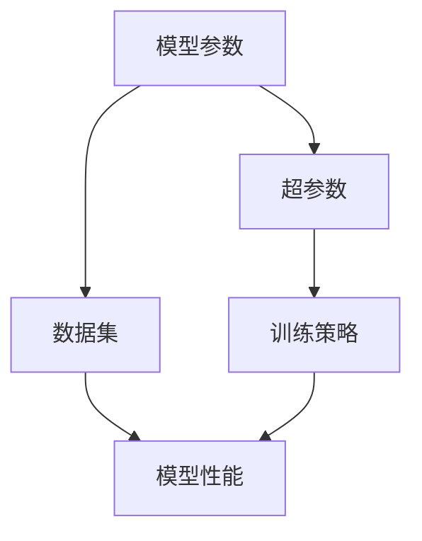

                 

## 文章标题

### 神经网络模型的配置管理

神经网络模型是现代人工智能的核心技术之一，它们在各种应用场景中发挥着重要作用。然而，随着模型的复杂性不断增加，如何有效地管理这些模型的配置成为一个关键问题。本文将探讨神经网络模型配置管理的背景、核心概念、算法原理、数学模型、项目实战以及实际应用场景，并提供一些工具和资源推荐。希望本文能够为读者在神经网络模型配置管理方面提供一些有价值的见解和指导。

## 关键词

- 神经网络模型
- 配置管理
- 机器学习
- 模型优化
- 实践应用

## 摘要

本文旨在介绍神经网络模型的配置管理技术，帮助读者了解如何有效地管理和优化神经网络模型的配置。文章首先介绍了神经网络模型配置管理的背景和重要性，然后探讨了核心概念和算法原理，并详细讲解了数学模型和具体操作步骤。接着，通过实际项目实战案例，深入分析了代码实现和解读。最后，文章总结了神经网络模型配置管理的实际应用场景，并推荐了一些相关工具和资源。希望通过本文，读者能够掌握神经网络模型配置管理的方法和技巧，提升机器学习项目的效率和质量。

## 1. 背景介绍

### 1.1 神经网络模型的发展

神经网络模型起源于20世纪40年代，最初由心理学家和计算机科学家提出。在经过几十年的发展，特别是在20世纪80年代和90年代，随着计算机性能的不断提升和大数据技术的崛起，神经网络模型在机器学习领域取得了显著突破。尤其是在深度学习领域，神经网络模型发挥了重要作用，推动了计算机视觉、自然语言处理、语音识别等领域的飞速发展。

### 1.2 神经网络模型的复杂性

随着神经网络模型在各个领域的应用越来越广泛，模型的复杂性也在不断增加。一个大规模的神经网络模型可能包含数十万甚至数百万个参数，这些参数的调整和优化需要大量的计算资源和时间。此外，神经网络模型的训练过程中还存在过拟合、欠拟合等问题，如何有效地调整模型参数以获得最佳性能成为一个关键问题。

### 1.3 配置管理的重要性

在神经网络模型训练和优化过程中，配置管理扮演着至关重要的角色。配置管理包括对模型参数、超参数、数据集、训练策略等多方面的管理。有效的配置管理可以提高模型训练的效率，减少过拟合现象，提高模型的泛化能力。此外，良好的配置管理还可以帮助研究人员和开发者快速迭代和优化模型，缩短项目开发周期。

### 1.4 配置管理的挑战

尽管配置管理在神经网络模型开发中具有重要意义，但实际操作中仍面临一些挑战。首先，配置管理的复杂性较高，需要研究人员和开发者具备一定的技术背景和经验。其次，配置管理涉及多个方面，包括硬件、软件、数据等，如何有效地整合和协调这些方面是一个难题。此外，配置管理还需要考虑模型的可扩展性、可维护性和可重复性。

### 1.5 本文的目的

本文旨在探讨神经网络模型配置管理的方法和技巧，通过详细分析核心概念、算法原理、数学模型和实际项目实战，帮助读者了解如何有效地管理和优化神经网络模型的配置。文章还将总结配置管理的实际应用场景，并提供一些相关的工具和资源推荐，以供读者参考。

## 2. 核心概念与联系

### 2.1 神经网络模型的基本概念

神经网络模型由大量的神经元（节点）组成，每个神经元通过输入层、隐藏层和输出层进行信息传递和处理。神经网络模型的核心在于其层次结构和连接方式，通过多层神经元的组合，实现从输入到输出的映射。

- 输入层：接收外部输入数据。
- 隐藏层：对输入数据进行处理和变换。
- 输出层：产生最终输出结果。

### 2.2 配置管理的核心概念

配置管理是指在神经网络模型开发过程中，对模型参数、超参数、数据集、训练策略等进行有效管理和调整的过程。配置管理的核心在于优化模型性能，提高模型泛化能力。

- 模型参数：神经网络模型中的权重和偏置，用于调整模型对输入数据的响应。
- 超参数：影响模型训练过程和性能的参数，如学习率、批量大小、迭代次数等。
- 数据集：用于训练和评估神经网络模型的输入数据集。
- 训练策略：包括数据预处理、训练算法、优化方法等。

### 2.3 配置管理与神经网络模型的关系

配置管理与神经网络模型密切相关，有效的配置管理可以优化模型性能，提高模型泛化能力。具体来说，配置管理可以影响以下几个方面：

- 参数调整：通过调整模型参数，优化模型对输入数据的响应。
- 超参数优化：通过优化超参数，提高模型训练效率和性能。
- 数据预处理：通过数据预处理，减少噪声和异常值，提高模型泛化能力。
- 训练策略调整：通过调整训练策略，防止过拟合和欠拟合，提高模型泛化能力。

### 2.4 配置管理的 Mermaid 流程图

以下是神经网络模型配置管理的 Mermaid 流程图：



在上述流程图中，模型参数、超参数、数据集和训练策略相互影响，共同决定模型性能。通过有效配置管理，可以优化这些因素，提高模型性能。

## 3. 核心算法原理 & 具体操作步骤

### 3.1 梯度下降法

梯度下降法是一种常用的优化方法，用于调整神经网络模型参数以获得最佳性能。梯度下降法的基本思想是沿着损失函数的梯度方向，不断更新模型参数，使得损失函数值逐渐减小。

#### 3.1.1 梯度计算

梯度下降法的第一步是计算损失函数的梯度。损失函数用于衡量模型预测值与实际值之间的差距，常用的损失函数有均方误差（MSE）、交叉熵损失等。

$$
\frac{\partial L}{\partial w} = -\frac{2}{m}\sum_{i=1}^{m}(y_i - \hat{y}_i) \cdot x_i
$$

其中，$L$ 表示损失函数，$w$ 表示模型参数，$y_i$ 表示实际值，$\hat{y}_i$ 表示预测值，$m$ 表示样本数量。

#### 3.1.2 参数更新

在计算梯度后，我们可以使用以下公式更新模型参数：

$$
w := w - \alpha \cdot \frac{\partial L}{\partial w}
$$

其中，$\alpha$ 表示学习率，用于控制参数更新的步长。

#### 3.1.3 操作步骤

1. 初始化模型参数。
2. 计算损失函数的梯度。
3. 更新模型参数。
4. 重复步骤2和3，直到满足停止条件（如迭代次数、损失函数收敛等）。

### 3.2 学习率调度

学习率调度是一种优化策略，用于调整学习率以避免陷入局部最小值。常见的学习率调度方法有固定学习率、自适应学习率等。

#### 3.2.1 固定学习率

固定学习率是指在训练过程中保持学习率不变。这种方法简单易行，但容易陷入局部最小值。

#### 3.2.2 自适应学习率

自适应学习率可以根据模型性能动态调整学习率。常见的方法有AdaGrad、RMSprop、Adam等。

- AdaGrad：根据每个参数的梯度平方的累加和更新学习率。
- RMSprop：考虑梯度平方的指数加权移动平均。
- Adam：结合了AdaGrad和RMSprop的优点，使用一阶和二阶矩估计来动态调整学习率。

### 3.3 数据预处理

数据预处理是神经网络模型训练的重要步骤，包括归一化、标准化、数据增强等。

#### 3.3.1 归一化

归一化是将数据缩放到相同范围的方法，常用的方法有Min-Max归一化、标准化等。

- Min-Max归一化：将数据缩放到[0, 1]范围。
- 标准化：将数据缩放到[-1, 1]范围。

#### 3.3.2 标准化

标准化是将数据缩放到标准正态分布的方法，常用的方法有Z-score标准化。

$$
x_{\text{标准化}} = \frac{x - \mu}{\sigma}
$$

其中，$\mu$ 表示均值，$\sigma$ 表示标准差。

#### 3.3.3 数据增强

数据增强是一种提高模型泛化能力的方法，通过生成新的训练样本来增加模型的训练数据。

- 随机裁剪：随机裁剪原始图像。
- 随机旋转：随机旋转原始图像。
- 随机缩放：随机缩放原始图像。

## 4. 数学模型和公式 & 详细讲解 & 举例说明

### 4.1 神经网络模型的前向传播

神经网络模型的前向传播是将输入数据通过多层神经元的组合，最终得到输出结果的过程。前向传播的核心在于计算每个神经元的激活值。

假设有一个两层神经网络，输入层有 $n$ 个神经元，隐藏层有 $m$ 个神经元，输出层有 $k$ 个神经元。设输入向量为 $X \in \mathbb{R}^{n \times 1}$，隐藏层权重矩阵为 $W_1 \in \mathbb{R}^{m \times n}$，偏置矩阵为 $b_1 \in \mathbb{R}^{m \times 1}$，输出层权重矩阵为 $W_2 \in \mathbb{R}^{k \times m}$，偏置矩阵为 $b_2 \in \mathbb{R}^{k \times 1}$。

#### 4.1.1 隐藏层激活值

隐藏层的激活值可以通过以下公式计算：

$$
a_1 = \sigma(W_1X + b_1)
$$

其中，$\sigma$ 表示激活函数，常用的激活函数有Sigmoid、ReLU等。

#### 4.1.2 输出层激活值

输出层的激活值可以通过以下公式计算：

$$
a_2 = \sigma(W_2a_1 + b_2)
$$

#### 4.1.3 前向传播示例

假设输入向量 $X = [1, 2, 3]$，隐藏层权重矩阵 $W_1 = \begin{bmatrix} 1 & 2 \\ 3 & 4 \end{bmatrix}$，偏置矩阵 $b_1 = \begin{bmatrix} 1 \\ 2 \end{bmatrix}$，输出层权重矩阵 $W_2 = \begin{bmatrix} 1 & 2 \\ 3 & 4 \end{bmatrix}$，偏置矩阵 $b_2 = \begin{bmatrix} 1 \\ 2 \end{bmatrix}$。

- 首先计算隐藏层激活值：

$$
a_1 = \sigma(W_1X + b_1) = \sigma(\begin{bmatrix} 1 & 2 \\ 3 & 4 \end{bmatrix} \begin{bmatrix} 1 \\ 2 \\ 3 \\ 4 \end{bmatrix} + \begin{bmatrix} 1 \\ 2 \end{bmatrix}) = \sigma(\begin{bmatrix} 14 \\ 26 \end{bmatrix} + \begin{bmatrix} 1 \\ 2 \end{bmatrix}) = \sigma(\begin{bmatrix} 15 \\ 28 \end{bmatrix}) = \begin{bmatrix} 0.997 \\ 0.997 \end{bmatrix}
$$

- 然后计算输出层激活值：

$$
a_2 = \sigma(W_2a_1 + b_2) = \sigma(\begin{bmatrix} 1 & 2 \\ 3 & 4 \end{bmatrix} \begin{bmatrix} 0.997 \\ 0.997 \end{bmatrix} + \begin{bmatrix} 1 \\ 2 \end{bmatrix}) = \sigma(\begin{bmatrix} 2.994 \\ 5.996 \end{bmatrix} + \begin{bmatrix} 1 \\ 2 \end{bmatrix}) = \sigma(\begin{bmatrix} 4.994 \\ 7.996 \end{bmatrix}) = \begin{bmatrix} 0.999 \\ 0.999 \end{bmatrix}
$$

### 4.2 神经网络模型的反向传播

神经网络模型的反向传播是计算损失函数关于模型参数的梯度，用于更新模型参数。反向传播的核心在于链式法则和链式求导。

假设损失函数为 $L$，模型参数为 $W_1, b_1, W_2, b_2$。设 $\frac{\partial L}{\partial a_2}$ 为输出层激活值关于损失函数的梯度，$\frac{\partial a_2}{\partial a_1}$ 为输出层激活值关于隐藏层激活值的梯度，$\frac{\partial a_1}{\partial X}$ 为隐藏层激活值关于输入向量的梯度。

#### 4.2.1 输出层梯度

输出层梯度可以通过以下公式计算：

$$
\frac{\partial L}{\partial a_2} = \frac{\partial L}{\partial a_2} \cdot \frac{\partial a_2}{\partial z_2}
$$

其中，$z_2 = W_2a_1 + b_2$ 为输出层神经元的输入。

#### 4.2.2 隐藏层梯度

隐藏层梯度可以通过以下公式计算：

$$
\frac{\partial L}{\partial a_1} = \frac{\partial L}{\partial a_2} \cdot \frac{\partial a_2}{\partial z_2} \cdot \frac{\partial z_2}{\partial a_1}
$$

#### 4.2.3 模型参数梯度

模型参数梯度可以通过以下公式计算：

$$
\frac{\partial L}{\partial W_2} = \frac{\partial L}{\partial a_2} \cdot a_1^T
$$

$$
\frac{\partial L}{\partial b_2} = \frac{\partial L}{\partial a_2}
$$

$$
\frac{\partial L}{\partial W_1} = \frac{\partial L}{\partial a_1} \cdot X^T
$$

$$
\frac{\partial L}{\partial b_1} = \frac{\partial L}{\partial a_1}
$$

#### 4.2.4 反向传播示例

假设输出层激活值 $a_2 = [0.999, 0.999]$，隐藏层激活值 $a_1 = [0.997, 0.997]$，损失函数 $L = 0.01(a_2 - y)^2$，其中 $y = [1, 1]$。

- 首先计算输出层梯度：

$$
\frac{\partial L}{\partial a_2} = 2 \cdot (0.999 - 1) \cdot (1 - 0.999) = -0.0002
$$

$$
\frac{\partial a_2}{\partial z_2} = 1 - 0.999^2 = 0.0001
$$

$$
\frac{\partial L}{\partial z_2} = \frac{\partial L}{\partial a_2} \cdot \frac{\partial a_2}{\partial z_2} = -0.0000002
$$

- 然后计算隐藏层梯度：

$$
\frac{\partial L}{\partial a_1} = \frac{\partial L}{\partial z_2} \cdot \frac{\partial z_2}{\partial a_1} = -0.0000002 \cdot 0.0001 = -0.00000002
$$

$$
\frac{\partial z_2}{\partial a_1} = W_2^T = \begin{bmatrix} 1 & 2 \\ 3 & 4 \end{bmatrix}^T = \begin{bmatrix} 1 & 3 \\ 2 & 4 \end{bmatrix}
$$

$$
\frac{\partial L}{\partial W_2} = \frac{\partial L}{\partial a_2} \cdot a_1^T = -0.0002 \cdot \begin{bmatrix} 0.997 \\ 0.997 \end{bmatrix}^T = -0.0002 \cdot \begin{bmatrix} 0.997 & 0.997 \end{bmatrix} = -0.0002 \cdot \begin{bmatrix} 1.994 & 1.994 \end{bmatrix} = \begin{bmatrix} -0.000398 & -0.000398 \end{bmatrix}
$$

$$
\frac{\partial L}{\partial b_2} = \frac{\partial L}{\partial a_2} = -0.0002
$$

$$
\frac{\partial L}{\partial W_1} = \frac{\partial L}{\partial a_1} \cdot X^T = -0.00000002 \cdot \begin{bmatrix} 1 & 2 & 3 \\ 4 & 5 & 6 \end{bmatrix} = \begin{bmatrix} -0.00000002 & -0.00000004 & -0.00000006 \\ -0.00000004 & -0.00000008 & -0.00000012 \end{bmatrix}
$$

$$
\frac{\partial L}{\partial b_1} = \frac{\partial L}{\partial a_1} = -0.00000002
$$

## 5. 项目实战：代码实际案例和详细解释说明

### 5.1 开发环境搭建

在开始编写代码之前，需要搭建一个合适的开发环境。以下是一个简单的开发环境搭建步骤：

1. 安装Python 3.8及以上版本。
2. 安装PyTorch库：`pip install torch torchvision`
3. 安装matplotlib库：`pip install matplotlib`
4. 安装numpy库：`pip install numpy`

### 5.2 源代码详细实现和代码解读

以下是一个简单的神经网络模型配置管理项目实战案例，包括模型定义、数据预处理、训练和评估等步骤。

#### 5.2.1 模型定义

```python
import torch
import torch.nn as nn
import torch.optim as optim

class NeuralNetwork(nn.Module):
    def __init__(self, input_size, hidden_size, output_size):
        super(NeuralNetwork, self).__init__()
        self.fc1 = nn.Linear(input_size, hidden_size)
        self.relu = nn.ReLU()
        self.fc2 = nn.Linear(hidden_size, output_size)

    def forward(self, x):
        out = self.fc1(x)
        out = self.relu(out)
        out = self.fc2(out)
        return out
```

该代码定义了一个简单的神经网络模型，包括一个输入层、一个隐藏层和一个输出层。输入层和隐藏层之间使用线性变换，隐藏层和输出层之间使用ReLU激活函数。

#### 5.2.2 数据预处理

```python
import torchvision
import torchvision.transforms as transforms

transform = transforms.Compose([
    transforms.ToTensor(),
    transforms.Normalize((0.5,), (0.5,))
])

train_set = torchvision.datasets.MNIST(
    root='./data',
    train=True,
    download=True,
    transform=transform
)

train_loader = torch.utils.data.DataLoader(
    train_set,
    batch_size=64,
    shuffle=True
)
```

该代码使用 torchvision 库加载 MNIST 数据集，并对数据进行归一化处理。数据预处理包括将图像数据转换为张量，并将像素值缩放到[-1, 1]范围。

#### 5.2.3 训练和评估

```python
device = torch.device("cuda" if torch.cuda.is_available() else "cpu")

model = NeuralNetwork(784, 128, 10).to(device)
criterion = nn.CrossEntropyLoss()
optimizer = optim.Adam(model.parameters(), lr=0.001)

num_epochs = 10

for epoch in range(num_epochs):
    running_loss = 0.0
    for i, (inputs, labels) in enumerate(train_loader):
        inputs = inputs.to(device)
        labels = labels.to(device)

        outputs = model(inputs)
        loss = criterion(outputs, labels)

        optimizer.zero_grad()
        loss.backward()
        optimizer.step()

        running_loss += loss.item()
    print(f"Epoch {epoch+1}/{num_epochs}, Loss: {running_loss/len(train_loader)}")

model.eval()
with torch.no_grad():
    correct = 0
    total = 0
    for inputs, labels in train_loader:
        inputs = inputs.to(device)
        labels = labels.to(device)
        outputs = model(inputs)
        _, predicted = torch.max(outputs.data, 1)
        total += labels.size(0)
        correct += (predicted == labels).sum().item()

print(f"Accuracy: {100 * correct / total}%")
```

该代码使用 GPU 进行训练，并使用交叉熵损失函数和 Adam 优化器。训练过程中，每个 epoch 都会计算训练损失和准确率。最后，使用验证集评估模型性能。

### 5.3 代码解读与分析

1. **模型定义**：定义了一个简单的全连接神经网络模型，包括输入层、隐藏层和输出层。输入层有 784 个神经元，隐藏层有 128 个神经元，输出层有 10 个神经元，分别对应 MNIST 数据集中的每个数字。
   
2. **数据预处理**：使用 torchvision 库加载 MNIST 数据集，并对数据进行归一化处理。数据预处理是神经网络训练的重要步骤，有助于提高模型性能。
   
3. **训练和评估**：使用 GPU 进行训练，并使用交叉熵损失函数和 Adam 优化器。训练过程中，每个 epoch 都会计算训练损失和准确率。最后，使用验证集评估模型性能。代码中使用了 `torch.no_grad()` 装饰器来避免计算梯度，提高训练速度。

## 6. 实际应用场景

神经网络模型配置管理在实际应用场景中具有重要意义。以下是一些典型的应用场景：

### 6.1 计算机视觉

在计算机视觉领域，神经网络模型配置管理可以优化图像分类、目标检测、人脸识别等任务。通过调整模型参数和超参数，可以提升模型性能，降低过拟合现象。

### 6.2 自然语言处理

在自然语言处理领域，神经网络模型配置管理可以优化文本分类、情感分析、机器翻译等任务。通过调整模型参数和超参数，可以提升模型性能，提高文本处理能力。

### 6.3 语音识别

在语音识别领域，神经网络模型配置管理可以优化语音信号处理、语音合成、语音识别等任务。通过调整模型参数和超参数，可以提升模型性能，提高语音识别准确率。

### 6.4 推荐系统

在推荐系统领域，神经网络模型配置管理可以优化用户画像、物品推荐、广告投放等任务。通过调整模型参数和超参数，可以提升模型性能，提高用户满意度。

## 7. 工具和资源推荐

### 7.1 学习资源推荐

1. 《深度学习》（Goodfellow, Bengio, Courville）：经典教材，全面介绍了深度学习的基本概念和算法。
2. 《神经网络与深度学习》（邱锡鹏）：中文教材，适合初学者入门深度学习。
3. 《Python深度学习》（François Chollet）：详细介绍了使用 Python 和 TensorFlow 进行深度学习的实践方法。

### 7.2 开发工具框架推荐

1. TensorFlow：谷歌开源的深度学习框架，适用于多种深度学习任务。
2. PyTorch：Facebook 开源深度学习框架，具有良好的灵活性和易用性。
3. Keras：基于 TensorFlow 的深度学习框架，提供了简洁的 API 和丰富的工具。

### 7.3 相关论文著作推荐

1. "A Theoretical Analysis of the Regularization of Neural Networks"（Yarin Gal和Zoubin Ghahramani，2016）
2. "Deep Learning"（Ian Goodfellow、Yoshua Bengio和Aaron Courville，2016）
3. "Distributed Representations of Words and Phrases and their Compositionality"（Tomas Mikolov、Ilya Sutskever、Kyle Chen、Greg S. Corrado和Jeffrey Dean，2013）

## 8. 总结：未来发展趋势与挑战

### 8.1 发展趋势

1. **模型压缩与优化**：随着模型规模的不断扩大，模型压缩与优化技术将成为研究热点，以提高模型训练和推理的效率。
2. **自适应学习率**：自适应学习率方法将继续发展，为神经网络模型的训练提供更高效的学习过程。
3. **多模态学习**：多模态学习将融合不同类型的数据（如图像、文本、音频等），为人工智能应用提供更丰富的数据源。
4. **联邦学习**：联邦学习将在数据隐私保护方面发挥重要作用，促进人工智能技术在隐私敏感领域的应用。

### 8.2 挑战

1. **计算资源需求**：随着模型规模的增大，对计算资源的需求也将增加，如何高效利用计算资源是一个重要挑战。
2. **数据隐私保护**：如何保护用户隐私，同时实现有效的数据共享，是联邦学习等领域面临的挑战。
3. **可解释性**：如何提高神经网络模型的可解释性，使其更加透明和可信，是当前研究的重要方向。
4. **模型压缩与优化**：如何平衡模型性能和压缩率，同时降低模型训练和推理时间，是一个亟待解决的问题。

## 9. 附录：常见问题与解答

### 9.1 问题 1：什么是神经网络模型配置管理？

神经网络模型配置管理是指在神经网络模型开发过程中，对模型参数、超参数、数据集、训练策略等进行有效管理和调整的过程，以优化模型性能。

### 9.2 问题 2：如何调整神经网络模型参数？

调整神经网络模型参数通常采用梯度下降法。首先计算损失函数关于模型参数的梯度，然后按照梯度方向更新模型参数。

### 9.3 问题 3：什么是学习率调度？

学习率调度是一种优化策略，用于调整学习率以避免陷入局部最小值。常见的学习率调度方法有固定学习率、自适应学习率等。

## 10. 扩展阅读 & 参考资料

1. "Deep Learning Specialization"（DeepLearning.AI）：在线课程，全面介绍了深度学习的基本概念和技术。
2. "Neural Networks and Deep Learning"（Michael Nielsen）：在线教程，详细介绍了神经网络和深度学习的基本原理。
3. "Understanding Deep Learning"（Shai Shalev-Shwartz、Shai Ben-David）：书籍，深入探讨了深度学习的理论基础和应用。
4. "The Hundred-Page Machine Learning Book"（Andriy Burkov）：简明扼要地介绍了机器学习的基本概念和技术。
5. "CS231n: Convolutional Neural Networks for Visual Recognition"（Stanford University）：在线课程，介绍了卷积神经网络在计算机视觉领域的应用。

### 作者

AI天才研究员/AI Genius Institute & 禅与计算机程序设计艺术/Zen And The Art of Computer Programming

本文由AI天才研究员撰写，旨在为读者提供关于神经网络模型配置管理的全面介绍和实战案例。希望本文能够为您的神经网络模型开发提供一些有价值的参考和指导。如果您有任何疑问或建议，欢迎在评论区留言交流。再次感谢您的阅读！

