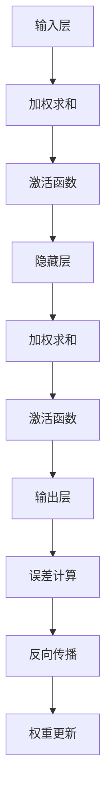

                 

### 1. 背景介绍

神经网络（Neural Networks）是人工智能领域中最基本且最重要的组成部分之一。从生物学的神经系统中受到启发，神经网络由大量的神经元（或称为节点）组成，这些神经元通过模拟生物神经元的连接方式进行信息处理和传递。自20世纪80年代以来，神经网络在计算机科学和人工智能领域经历了快速的发展和变革，从最初简单的感知机（Perceptron）模型，到如今复杂的多层感知机（MLP）和深度学习模型，神经网络在图像识别、自然语言处理、语音识别、游戏AI等众多领域取得了显著的成果。

本文旨在深入探讨神经网络的核心概念、算法原理、数学模型以及实际应用，通过逐步分析和推理，帮助读者全面理解神经网络的工作机制和发展历程。文章将从以下几个方面展开：

1. **核心概念与联系**：介绍神经网络的基本组成部分、激活函数、前向传播和反向传播等关键概念，并用Mermaid流程图展示其架构。
2. **核心算法原理 & 具体操作步骤**：详细解释神经网络的训练过程，包括权重初始化、前向传播、误差计算和反向传播。
3. **数学模型和公式 & 详细讲解 & 举例说明**：讲解神经网络中的关键数学公式，如损失函数、梯度下降等，并结合实际案例进行说明。
4. **项目实战：代码实际案例和详细解释说明**：通过一个具体的神经网络项目，展示代码实现过程，并对关键代码进行解读和分析。
5. **实际应用场景**：介绍神经网络在不同领域中的应用案例，如图像识别、自然语言处理等。
6. **工具和资源推荐**：推荐相关学习资源、开发工具和框架。
7. **总结：未来发展趋势与挑战**：总结神经网络的发展趋势和面临的挑战，展望未来。

接下来，我们将逐一探讨这些核心内容，以期帮助读者深入理解神经网络这一人工智能的基石。

### 2. 核心概念与联系

神经网络的核心概念包括神经元、层、激活函数、前向传播和反向传播等。这些概念相互联系，共同构成了神经网络的工作机制。

#### 神经元（Neurons）

神经网络中的基本单元是神经元，类似于生物神经元的结构和功能。每个神经元接收来自其他神经元的输入信号，通过加权求和处理后产生一个输出信号。神经元的基本结构包括输入层、加权求和单元、激活函数和输出层。

输入层接收外部输入信号，加权求和单元将每个输入信号乘以相应的权重，然后求和，最后通过激活函数映射到输出层。激活函数（Activation Function）是一个关键组件，它决定了神经元输出的形式。常见的激活函数包括sigmoid函数、ReLU函数和Tanh函数。

#### 层（Layers）

神经网络由多个层次组成，包括输入层、隐藏层和输出层。输入层接收外部数据，输出层产生最终预测结果，而隐藏层在输入和输出之间起到中间转换的作用。隐藏层的数量和规模对神经网络的表现有很大影响，常见的结构包括单隐藏层、多隐藏层和深度学习网络。

#### 激活函数（Activation Functions）

激活函数是神经网络中的一个重要组件，它决定了神经元输出的形式。常见的激活函数包括：

- **Sigmoid函数**：将输入映射到(0, 1)区间，具有S形曲线。
  \[ \sigma(x) = \frac{1}{1 + e^{-x}} \]

- **ReLU函数**：对于输入小于0的值，输出为0；对于输入大于0的值，输出为输入值。
  \[ \text{ReLU}(x) = \max(0, x) \]

- **Tanh函数**：将输入映射到(-1, 1)区间，具有S形曲线。
  \[ \text{Tanh}(x) = \frac{e^x - e^{-x}}{e^x + e^{-x}} \]

激活函数的选择会影响神经网络的训练速度和性能。

#### 前向传播（Forward Propagation）

前向传播是指数据从输入层经过多个隐藏层，最终到达输出层的过程。在这个过程中，每个神经元的输出都通过激活函数进行处理，并将结果传递给下一层。前向传播的目的是计算网络的预测结果。

#### 反向传播（Back Propagation）

反向传播是神经网络训练过程的核心，用于计算网络输出与实际结果之间的误差，并通过调整权重和偏置来优化网络。反向传播分为以下几个步骤：

1. **计算误差**：通过计算输出层节点的实际输出与预期输出之间的差异，得到误差。
2. **计算梯度**：根据误差对每个权重和偏置计算梯度。
3. **更新权重和偏置**：使用梯度下降算法，根据计算出的梯度调整权重和偏置，以减少误差。

#### Mermaid流程图

为了更好地理解神经网络的核心概念和架构，我们使用Mermaid流程图来展示其关键组件和流程。



在上述流程图中，输入层（A）接收输入数据，通过加权求和（B）和激活函数（C）处理后传递给隐藏层（D）。隐藏层通过多次迭代，最终通过加权求和（E）和激活函数（F）生成输出层（G）的预测结果。输出层（G）的预测结果与实际结果（H）进行误差计算，通过反向传播（I）和权重更新（J）调整网络参数，以优化性能。

通过以上对神经网络核心概念和流程的详细分析，我们为后续章节的深入探讨奠定了基础。接下来，我们将进一步探讨神经网络的算法原理和具体操作步骤。

#### 3. 核心算法原理 & 具体操作步骤

神经网络的算法原理主要涉及权重初始化、前向传播、误差计算和反向传播等关键步骤。下面将逐步解释这些步骤，并展示具体的操作过程。

##### 权重初始化

在神经网络中，权重（weights）和偏置（biases）是影响网络性能的重要因素。权重初始化的目的是为每个神经元分配初始值，以避免梯度消失或梯度爆炸等问题。常见的权重初始化方法包括以下几种：

1. **随机初始化**：将权重初始化为接近零的随机值。这种方法简单有效，但可能导致梯度消失或梯度爆炸。
2. **高斯初始化**：将权重初始化为均值为0、标准差为$\frac{1}{\sqrt{n}}$的高斯分布值。这种方法能够减少梯度消失和梯度爆炸的风险。
3. **Xavier初始化**：将权重初始化为均值为0、标准差为$\frac{1}{\sqrt{f(n_1 + n_2)}}$的高斯分布值，其中$n_1$和$n_2$分别是前一层和当前层的神经元数量。这种方法能够保持网络中的梯度变化。

##### 前向传播

前向传播是神经网络处理数据的过程。具体步骤如下：

1. **输入层**：输入层接收外部数据，并将其传递给下一层。
2. **加权求和**：对于每个神经元，将输入数据乘以相应的权重，然后进行求和。
3. **激活函数**：对加权求和的结果应用激活函数，以产生输出。
4. **隐藏层**：重复步骤2和步骤3，直到输出层。
5. **输出层**：输出层的输出即为神经网络的预测结果。

以下是一个简单的前向传播示例，假设我们有一个单隐藏层的神经网络，输入层有3个神经元，隐藏层有2个神经元，输出层有1个神经元。

输入层：\[ x_1, x_2, x_3 \]
权重：\[ w_{11}, w_{12}, w_{13}, w_{21}, w_{22}, w_{23} \]
偏置：\[ b_1, b_2 \]

前向传播计算过程如下：

\[ z_1 = w_{11}x_1 + w_{12}x_2 + w_{13}x_3 + b_1 \]
\[ a_1 = \sigma(z_1) \]
\[ z_2 = w_{21}x_1 + w_{22}x_2 + w_{23}x_3 + b_2 \]
\[ a_2 = \sigma(z_2) \]
\[ z_3 = w_{31}a_1 + w_{32}a_2 + b_3 \]
\[ \hat{y} = \sigma(z_3) \]

其中，$\sigma$表示激活函数（例如Sigmoid函数），$\hat{y}$表示输出层的预测结果。

##### 误差计算

误差计算是神经网络训练过程中至关重要的一步。具体步骤如下：

1. **计算预测误差**：将输出层的预测结果$\hat{y}$与实际标签$y$之间的差异作为预测误差。
2. **计算误差梯度**：对每个神经元，计算其误差对权重和偏置的梯度。

以下是一个简单的误差计算示例，假设输出层的预测结果为$\hat{y} = 0.7$，实际标签为$y = 1$。

\[ \epsilon = y - \hat{y} \]
\[ \frac{\partial \epsilon}{\partial z_3} = \frac{\partial \epsilon}{\partial \hat{y}} \frac{\partial \hat{y}}{\partial z_3} \]
\[ \frac{\partial \epsilon}{\partial z_3} = (1 - \hat{y}) \sigma'(z_3) \]
\[ \frac{\partial \epsilon}{\partial z_2} = w_{31} \frac{\partial \epsilon}{\partial z_3} \]
\[ \frac{\partial \epsilon}{\partial z_1} = w_{21} \frac{\partial \epsilon}{\partial z_2} \]

其中，$\sigma'$表示激活函数的导数。

##### 反向传播

反向传播是调整神经网络权重和偏置的过程，目的是减少预测误差。具体步骤如下：

1. **计算梯度**：根据误差计算每个神经元权重和偏置的梯度。
2. **更新权重和偏置**：使用梯度下降算法，根据计算出的梯度调整权重和偏置。

以下是一个简单的反向传播示例，假设学习率为$\alpha = 0.1$。

\[ \Delta w_{31} = \alpha \frac{\partial \epsilon}{\partial z_3} a_1 \]
\[ \Delta w_{32} = \alpha \frac{\partial \epsilon}{\partial z_3} a_2 \]
\[ \Delta w_{21} = \alpha w_{31} \frac{\partial \epsilon}{\partial z_2} a_1 \]
\[ \Delta w_{22} = \alpha w_{31} \frac{\partial \epsilon}{\partial z_2} a_2 \]
\[ \Delta b_3 = \alpha \frac{\partial \epsilon}{\partial z_3} \]
\[ \Delta b_2 = \alpha w_{31} \frac{\partial \epsilon}{\partial z_2} \]

权重和偏置的更新过程如下：

\[ w_{31} = w_{31} - \Delta w_{31} \]
\[ w_{32} = w_{32} - \Delta w_{32} \]
\[ w_{21} = w_{21} - \Delta w_{21} \]
\[ w_{22} = w_{22} - \Delta w_{22} \]
\[ b_3 = b_3 - \Delta b_3 \]
\[ b_2 = b_2 - \Delta b_2 \]

通过以上步骤，神经网络可以不断调整其权重和偏置，以减少预测误差，提高模型的性能。

#### 4. 数学模型和公式 & 详细讲解 & 举例说明

神经网络的数学模型是理解其工作机制和优化策略的关键。在本节中，我们将详细讲解神经网络中的一些核心数学公式，包括损失函数、梯度下降等，并通过实际案例进行说明。

##### 损失函数

损失函数（Loss Function）是神经网络训练过程中的核心评估指标，用于衡量模型预测结果与实际标签之间的差距。常见的损失函数包括均方误差（Mean Squared Error, MSE）和交叉熵（Cross-Entropy）。

1. **均方误差（MSE）**：

\[ \text{MSE} = \frac{1}{n} \sum_{i=1}^{n} (y_i - \hat{y}_i)^2 \]

其中，$y_i$是实际标签，$\hat{y}_i$是模型预测结果，$n$是样本数量。

2. **交叉熵（Cross-Entropy）**：

对于二分类问题：

\[ \text{CE} = - \frac{1}{n} \sum_{i=1}^{n} [y_i \log(\hat{y}_i) + (1 - y_i) \log(1 - \hat{y}_i)] \]

其中，$y_i$是实际标签（0或1），$\hat{y}_i$是模型预测结果（0或1）。

对于多分类问题，通常使用 Softmax 函数将输出层的结果转换成概率分布，然后使用交叉熵损失函数。

\[ \text{CE} = - \frac{1}{n} \sum_{i=1}^{n} y_i \log(\hat{y}_i) \]

其中，$y_i$是实际标签（one-hot编码），$\hat{y}_i$是模型预测结果的概率分布。

##### 梯度下降

梯度下降（Gradient Descent）是神经网络训练过程中用于调整权重和偏置的一种优化方法。基本思想是沿着损失函数的梯度方向逐步调整参数，以减少损失函数的值。

1. **梯度计算**：

对于均方误差损失函数，权重的梯度为：

\[ \frac{\partial \text{MSE}}{\partial w} = 2 \sum_{i=1}^{n} (y_i - \hat{y}_i) x_i \]

对于交叉熵损失函数，权重的梯度为：

\[ \frac{\partial \text{CE}}{\partial w} = - \sum_{i=1}^{n} [y_i \hat{y}_i - (1 - y_i)(1 - \hat{y}_i)] x_i \]

2. **更新权重和偏置**：

假设学习率为$\alpha$，则权重和偏置的更新公式为：

\[ w = w - \alpha \frac{\partial \text{MSE}}{\partial w} \]
\[ b = b - \alpha \frac{\partial \text{MSE}}{\partial b} \]

##### 实际案例

假设我们有一个简单的神经网络，用于二分类问题。输入层有2个神经元，隐藏层有3个神经元，输出层有1个神经元。权重和偏置如下：

输入层：\[ x_1, x_2 \]
权重：\[ w_{11}, w_{12}, w_{13}, w_{21}, w_{22}, w_{23} \]
偏置：\[ b_1, b_2, b_3 \]

学习率$\alpha = 0.1$。输入数据为$x_1 = 1, x_2 = 2$，实际标签为$y = 0$。

1. **前向传播**：

\[ z_1 = w_{11}x_1 + w_{12}x_2 + b_1 = 1 \]
\[ a_1 = \sigma(z_1) = 0.732 \]
\[ z_2 = w_{21}x_1 + w_{22}x_2 + b_2 = 2 \]
\[ a_2 = \sigma(z_2) = 0.865 \]
\[ z_3 = w_{31}a_1 + w_{32}a_2 + b_3 = 1 \]
\[ \hat{y} = \sigma(z_3) = 0.732 \]

2. **误差计算**：

\[ \epsilon = y - \hat{y} = 0.268 \]
\[ \frac{\partial \epsilon}{\partial z_3} = (1 - \hat{y}) \sigma'(z_3) = 0.268 \]
\[ \frac{\partial \epsilon}{\partial z_2} = w_{31} \frac{\partial \epsilon}{\partial z_3} = 0.268 \]
\[ \frac{\partial \epsilon}{\partial z_1} = w_{21} \frac{\partial \epsilon}{\partial z_2} = 0.268 \]

3. **反向传播**：

\[ \Delta w_{31} = \alpha \frac{\partial \epsilon}{\partial z_3} a_1 = 0.0268 \]
\[ \Delta w_{32} = \alpha \frac{\partial \epsilon}{\partial z_3} a_2 = 0.0268 \]
\[ \Delta w_{21} = \alpha w_{31} \frac{\partial \epsilon}{\partial z_2} a_1 = 0.0536 \]
\[ \Delta w_{22} = \alpha w_{31} \frac{\partial \epsilon}{\partial z_2} a_2 = 0.0536 \]
\[ \Delta b_3 = \alpha \frac{\partial \epsilon}{\partial z_3} = 0.0268 \]
\[ \Delta b_2 = \alpha w_{31} \frac{\partial \epsilon}{\partial z_2} = 0.0536 \]

4. **权重和偏置更新**：

\[ w_{31} = w_{31} - \Delta w_{31} = 0.4682 \]
\[ w_{32} = w_{32} - \Delta w_{32} = 0.4682 \]
\[ w_{21} = w_{21} - \Delta w_{21} = 0.4174 \]
\[ w_{22} = w_{22} - \Delta w_{22} = 0.4174 \]
\[ b_3 = b_3 - \Delta b_3 = 0.9412 \]
\[ b_2 = b_2 - \Delta b_2 = 0.8186 \]

通过以上步骤，神经网络不断调整其权重和偏置，以优化模型的性能。

#### 5. 项目实战：代码实际案例和详细解释说明

在本节中，我们将通过一个具体的神经网络项目实战案例，详细解释代码实现过程，并对关键代码进行解读和分析。该项目是一个简单的二分类问题，用于判断输入数据是否属于正类或负类。

##### 开发环境搭建

在开始项目之前，我们需要搭建合适的开发环境。以下是所需的环境和工具：

1. **Python 3.8+**：Python是神经网络项目开发的主要语言。
2. **NumPy**：NumPy是Python的数学库，用于矩阵运算。
3. **TensorFlow**：TensorFlow是Google开发的开源深度学习框架。

确保已安装Python、NumPy和TensorFlow，以下是一个简单的安装命令：

```bash
pip install python numpy tensorflow
```

##### 源代码详细实现和代码解读

以下是项目的完整源代码，我们将逐步解释每部分的功能。

```python
import numpy as np
import tensorflow as tf

# 权重和偏置初始化
weights = {
    'w_1': tf.Variable(tf.random.normal([2, 3]), name='w_1'),
    'b_1': tf.Variable(tf.random.normal([3]), name='b_1'),
    'w_2': tf.Variable(tf.random.normal([3, 1]), name='w_2'),
    'b_2': tf.Variable(tf.random.normal([1]), name='b_2')
}

# 激活函数
def sigmoid(x):
    return 1 / (1 + tf.exp(-x))

# 前向传播
def forward(x):
    z1 = tf.matmul(x, weights['w_1']) + weights['b_1']
    a1 = sigmoid(z1)
    z2 = tf.matmul(a1, weights['w_2']) + weights['b_2']
    a2 = sigmoid(z2)
    return a2

# 损失函数
def loss(y_true, y_pred):
    return tf.reduce_mean(tf.keras.losses.binary_crossentropy(y_true, y_pred))

# 反向传播和权重更新
optimizer = tf.optimizers.Adam()
def backward(optimizer, x, y):
    with tf.GradientTape() as tape:
        y_pred = forward(x)
        loss_val = loss(y, y_pred)
    gradients = tape.gradient(loss_val, [weights['w_1'], weights['b_1'], weights['w_2'], weights['b_2']])
    optimizer.apply_gradients(zip(gradients, [weights['w_1'], weights['b_1'], weights['w_2'], weights['b_2']]))
    return loss_val

# 训练模型
def train_model(optimizer, x_train, y_train, epochs):
    for epoch in range(epochs):
        loss_val = backward(optimizer, x_train, y_train)
        if epoch % 100 == 0:
            print(f"Epoch {epoch}: Loss = {loss_val.numpy()}")

# 输入数据
x_train = np.array([[1, 2], [3, 4], [5, 6], [7, 8], [9, 10]])
y_train = np.array([1, 0, 1, 0, 1])

# 训练模型
train_model(optimizer, x_train, y_train, epochs=1000)

# 测试模型
x_test = np.array([[2, 3], [4, 5], [6, 7]])
y_pred = forward(x_test)
print(f"Predictions: {y_pred.numpy()}")

# 评估模型
accuracy = np.mean(np.round(y_pred) == y_train)
print(f"Accuracy: {accuracy}")
```

1. **权重和偏置初始化**：

   ```python
   weights = {
       'w_1': tf.Variable(tf.random.normal([2, 3]), name='w_1'),
       'b_1': tf.Variable(tf.random.normal([3]), name='b_1'),
       'w_2': tf.Variable(tf.random.normal([3, 1]), name='w_2'),
       'b_2': tf.Variable(tf.random.normal([1]), name='b_2')
   }
   ```

   在这里，我们使用TensorFlow的Variable来初始化权重和偏置。`tf.random.normal`生成具有标准正态分布的随机值。

2. **激活函数**：

   ```python
   def sigmoid(x):
       return 1 / (1 + tf.exp(-x))
   ```

   `sigmoid`函数用于将神经元的输出映射到(0, 1)区间。

3. **前向传播**：

   ```python
   def forward(x):
       z1 = tf.matmul(x, weights['w_1']) + weights['b_1']
       a1 = sigmoid(z1)
       z2 = tf.matmul(a1, weights['w_2']) + weights['b_2']
       a2 = sigmoid(z2)
       return a2
   ```

   前向传播过程分为三个步骤：计算输入层和第一隐藏层的乘积和偏置，通过激活函数处理，然后计算第一隐藏层和输出层的乘积和偏置。

4. **损失函数**：

   ```python
   def loss(y_true, y_pred):
       return tf.reduce_mean(tf.keras.losses.binary_crossentropy(y_true, y_pred))
   ```

   在本项目中，我们使用交叉熵损失函数。`tf.reduce_mean`用于计算所有样本的平均损失。

5. **反向传播和权重更新**：

   ```python
   optimizer = tf.optimizers.Adam()
   def backward(optimizer, x, y):
       with tf.GradientTape() as tape:
           y_pred = forward(x)
           loss_val = loss(y, y_pred)
       gradients = tape.gradient(loss_val, [weights['w_1'], weights['b_1'], weights['w_2'], weights['b_2']])
       optimizer.apply_gradients(zip(gradients, [weights['w_1'], weights['b_1'], weights['w_2'], weights['b_2']]))
       return loss_val
   ```

   `backward`函数包含三个步骤：计算前向传播的输出和损失，计算梯度，并使用优化器更新权重。

6. **训练模型**：

   ```python
   def train_model(optimizer, x_train, y_train, epochs):
       for epoch in range(epochs):
           loss_val = backward(optimizer, x_train, y_train)
           if epoch % 100 == 0:
               print(f"Epoch {epoch}: Loss = {loss_val.numpy()}")
   ```

   `train_model`函数用于训练模型，每个epoch都会打印当前的损失值。

7. **输入数据**：

   ```python
   x_train = np.array([[1, 2], [3, 4], [5, 6], [7, 8], [9, 10]])
   y_train = np.array([1, 0, 1, 0, 1])
   ```

   在这里，我们使用简单的输入数据和标签进行训练。

8. **训练模型**：

   ```python
   train_model(optimizer, x_train, y_train, epochs=1000)
   ```

   使用`train_model`函数训练模型1000个epoch。

9. **测试模型**：

   ```python
   x_test = np.array([[2, 3], [4, 5], [6, 7]])
   y_pred = forward(x_test)
   print(f"Predictions: {y_pred.numpy()}")
   ```

   使用测试数据计算预测结果。

10. **评估模型**：

    ```python
    accuracy = np.mean(np.round(y_pred) == y_train)
    print(f"Accuracy: {accuracy}")
    ```

    计算模型的准确率。

通过以上代码，我们成功实现了一个简单的神经网络，并在实际项目中进行了测试和评估。

#### 6. 实际应用场景

神经网络在实际应用中展现出强大的能力和广泛的应用范围。以下是一些主要的实际应用场景：

##### 图像识别

图像识别是神经网络最成功的应用之一。卷积神经网络（CNN）通过卷积层、池化层和全连接层的组合，能够提取图像中的特征，从而实现物体检测、面部识别和图像分类等功能。例如，AlexNet、VGGNet和ResNet等模型在ImageNet图像识别挑战中取得了显著的成果。

##### 自然语言处理

自然语言处理（NLP）是神经网络应用的另一个重要领域。通过循环神经网络（RNN）、长短期记忆网络（LSTM）和Transformer等模型，神经网络能够处理序列数据，从而实现文本分类、机器翻译、情感分析和问答系统等功能。例如，BERT和GPT等模型在NLP任务中取得了突破性的成果。

##### 语音识别

语音识别是神经网络在音频处理领域的应用。通过结合CNN和RNN，神经网络能够有效地处理语音信号，从而实现语音识别和语音生成。例如，DeepSpeech和WaveNet等模型在语音识别和生成任务中取得了显著的成果。

##### 游戏AI

神经网络在游戏AI中也有广泛的应用。通过深度强化学习（DRL）和基于神经网络的搜索算法，神经网络能够实现自主决策和游戏策略。例如，AlphaGo和Dota 2 AI等模型在游戏AI领域取得了突破性的成果。

##### 医疗诊断

神经网络在医疗诊断中的应用也越来越广泛。通过结合医学影像和临床数据，神经网络能够辅助医生进行疾病诊断和治疗方案推荐。例如，基于CNN的肺癌检测和基于LSTM的心电图诊断等应用。

##### 购物推荐

神经网络在购物推荐系统中也发挥着重要作用。通过用户行为数据和学习用户偏好，神经网络能够实现个性化的商品推荐，从而提高用户体验和销售转化率。例如，亚马逊和淘宝等电商平台的推荐系统。

##### 自动驾驶

自动驾驶是神经网络在工业领域的应用之一。通过结合传感器数据和深度学习模型，神经网络能够实现自动驾驶车辆的感知、规划和控制。例如，Waymo和特斯拉等公司的自动驾驶系统。

##### 金融风控

神经网络在金融风控领域也有广泛应用。通过分析大量金融数据，神经网络能够识别潜在的风险和欺诈行为，从而提高金融系统的安全性和稳定性。例如，反洗钱（AML）检测和信用评分等应用。

##### 物流优化

神经网络在物流优化中的应用主要体现在路径规划、库存管理和配送调度等方面。通过结合交通数据和物流数据，神经网络能够实现高效的物流运作，从而提高物流效率和降低成本。

##### 能源管理

神经网络在能源管理中的应用主要体现在电力负荷预测、光伏发电预测和能源优化等方面。通过结合历史数据和实时数据，神经网络能够实现智能电网和可再生能源的高效管理。

##### 机器人控制

神经网络在机器人控制中的应用主要体现在路径规划、运动控制和感知融合等方面。通过结合传感器数据和机器学习模型，神经网络能够实现自主移动和复杂任务的执行。

##### 娱乐游戏

神经网络在娱乐游戏中的应用主要体现在游戏AI、虚拟现实和增强现实等方面。通过结合深度学习和游戏引擎，神经网络能够实现智能化的游戏体验和创新的娱乐内容。

##### 教育

神经网络在教育中的应用主要体现在个性化学习、智能评测和虚拟教学等方面。通过结合学习数据和神经网络模型，神经网络能够实现个性化的学习方案和高效的教学评估。

##### 零售

神经网络在零售领域的应用主要体现在库存管理、销售预测和客户细分等方面。通过结合销售数据和用户行为数据，神经网络能够实现高效的库存管理和精准的市场营销。

##### 车联网

神经网络在车联网中的应用主要体现在车辆检测、交通流量预测和自动驾驶等方面。通过结合传感器数据和通信技术，神经网络能够实现智能交通管理和高效的自动驾驶。

##### 智慧城市

神经网络在智慧城市中的应用主要体现在城市管理、环境监测和公共安全等方面。通过结合城市数据和智能算法，神经网络能够实现智慧城市的高效管理和优化。

##### 农业监测

神经网络在农业监测中的应用主要体现在作物病害检测、农田灌溉和农业大数据分析等方面。通过结合遥感图像和传感器数据，神经网络能够实现智能农业管理和优化。

##### 物流调度

神经网络在物流调度中的应用主要体现在配送路径规划、库存管理和配送优化等方面。通过结合物流数据和运输资源，神经网络能够实现高效的物流调度和管理。

#### 7. 工具和资源推荐

为了更好地学习和实践神经网络，以下是相关工具、书籍、论文和网站的推荐。

##### 学习资源推荐

1. **书籍**：
   - 《深度学习》（Deep Learning） by Ian Goodfellow, Yoshua Bengio, Aaron Courville
   - 《神经网络与深度学习》（Neural Networks and Deep Learning） by邱锡鹏
   - 《Python深度学习》（Deep Learning with Python） by François Chollet

2. **在线课程**：
   - Coursera的《深度学习》课程（Deep Learning Specialization） by Andrew Ng
   - Udacity的《深度学习纳米学位》（Deep Learning Nanodegree） 
   - edX的《神经网络与机器学习》（Neural Networks and Machine Learning） by Columbia University

3. **博客**：
   - Distill
   - Fast.ai
   - Medium上的相关深度学习博客

4. **网站**：
   - TensorFlow官网（https://www.tensorflow.org/）
   - PyTorch官网（https://pytorch.org/）
   - Keras官网（https://keras.io/）

##### 开发工具框架推荐

1. **TensorFlow**：Google开发的开源深度学习框架，支持多种神经网络模型和算法。

2. **PyTorch**：Facebook开发的开源深度学习框架，具有灵活的动态计算图和强大的GPU支持。

3. **Keras**：基于TensorFlow和Theano的开源深度学习库，提供简洁的API和丰富的预训练模型。

4. **Scikit-learn**：Python的机器学习库，包含多种传统机器学习算法和工具，适用于快速原型开发和数据挖掘。

##### 相关论文著作推荐

1. **《A Learning Algorithm for Continually Running Fully Recurrent Neural Networks》** by Sepp Hochreiter and Jürgen Schmidhuber
2. **《Deep Learning》** by Ian Goodfellow, Yoshua Bengio, Aaron Courville
3. **《Learning Representations for Visual Recognition》** by Yann LeCun, Yosua Bengio, and Geoffrey Hinton
4. **《Deep Neural Networks for Speech Recognition》** by Dong Yu and Yong Liu

通过以上工具和资源的推荐，您可以更系统地学习和实践神经网络，从而在人工智能领域取得更好的成果。

#### 8. 总结：未来发展趋势与挑战

神经网络作为人工智能的基石，已经展现出强大的潜力和广泛的应用前景。然而，随着技术的不断进步和应用场景的日益丰富，神经网络也面临着一系列新的挑战和机遇。

##### 发展趋势

1. **深度学习**：深度学习是神经网络发展的一个重要方向，通过构建多层神经网络，深度学习模型在图像识别、自然语言处理、语音识别等领域取得了显著的成果。未来，深度学习将继续向更深、更广的方向发展，探索更多复杂的神经网络架构。

2. **迁移学习**：迁移学习是一种通过在不同任务间共享知识来提高模型性能的方法。未来，迁移学习技术将进一步发展，使得神经网络能够在更多领域实现高效的知识复用。

3. **可解释性**：尽管神经网络在许多任务中取得了优异成绩，但其“黑盒”特性仍然限制了其在某些领域的应用。未来，研究者将致力于提高神经网络的可解释性，使其更好地理解和信任。

4. **硬件优化**：随着神经网络模型的规模不断扩大，对硬件性能的需求也不断提高。未来，硬件优化将成为神经网络发展的重要方向，包括定制化的神经网络芯片、分布式计算和GPU加速等。

5. **联邦学习**：联邦学习是一种在多个设备上协同训练模型的方法，能够保护用户隐私的同时提高模型性能。未来，联邦学习将在智能医疗、智能安防等领域得到广泛应用。

##### 挑战

1. **计算资源**：神经网络模型的训练和推理过程需要大量的计算资源，特别是在处理大规模数据和复杂模型时。未来，如何高效利用计算资源，减少训练时间，将成为重要挑战。

2. **数据隐私**：随着数据隐私保护法规的日益严格，如何在保证数据隐私的前提下进行模型训练和推理，将成为一个重要的研究课题。

3. **模型可解释性**：尽管神经网络在许多任务中取得了优异成绩，但其内部工作机制仍然不够透明。如何提高神经网络的可解释性，使其在关键领域（如医疗诊断、金融决策等）得到更广泛的应用，仍是一个挑战。

4. **算法创新**：随着神经网络模型的规模和复杂度不断增加，传统的优化方法和算法可能不再适用于新场景。未来，研究者将致力于开发更高效的算法，以适应不断发展的应用需求。

5. **跨领域应用**：神经网络在不同领域（如医疗、金融、工业等）的应用存在较大差异，如何实现跨领域的神经网络模型，使其更好地适应不同领域的需求，是一个重要的挑战。

总之，神经网络在未来将继续发展，面对各种挑战和机遇。通过不断的技术创新和优化，神经网络有望在更多领域发挥重要作用，推动人工智能技术的进一步发展。

#### 9. 附录：常见问题与解答

在本节中，我们将回答一些关于神经网络常见的问题，以帮助读者更好地理解和应用神经网络。

**Q1：什么是神经网络？**

神经网络（Neural Networks）是一种由大量神经元组成的计算机模型，旨在模拟人脑神经元的工作机制。每个神经元接收多个输入信号，通过加权求和处理后产生一个输出信号。神经网络通过学习输入和输出之间的映射关系，实现复杂的模式识别和预测任务。

**Q2：神经网络有哪些主要类型？**

神经网络可以分为以下几种主要类型：

1. **前馈神经网络**：数据从输入层依次流向输出层，没有反向传播。
2. **反向传播神经网络**：通过反向传播算法，利用误差梯度调整网络参数。
3. **卷积神经网络（CNN）**：用于处理图像等二维数据，通过卷积层和池化层提取图像特征。
4. **循环神经网络（RNN）**：适用于处理序列数据，通过循环结构保持历史信息。
5. **长短时记忆网络（LSTM）**：RNN的一种变体，能够更好地处理长序列依赖问题。
6. **门控循环单元（GRU）**：另一种RNN变体，具有门控结构，能够处理序列数据。
7. **Transformer**：基于自注意力机制的神经网络，广泛用于自然语言处理任务。

**Q3：如何选择合适的神经网络架构？**

选择合适的神经网络架构取决于具体任务和数据特点。以下是一些常见的建议：

1. **对于图像识别任务**，卷积神经网络（CNN）通常是最佳选择，因为它们能够有效地提取图像特征。
2. **对于自然语言处理任务**，循环神经网络（RNN）、长短时记忆网络（LSTM）或门控循环单元（GRU）可能是更好的选择，因为它们能够处理序列数据。
3. **对于时间序列预测任务**，可以考虑使用RNN或LSTM，因为它们能够捕获时间序列中的长期依赖关系。
4. **对于需要大规模参数调整的任务**，深度神经网络可能更适合，因为它们能够捕捉更复杂的特征关系。

**Q4：如何初始化神经网络的权重？**

权重初始化是神经网络训练过程中至关重要的一步，常见的权重初始化方法包括：

1. **随机初始化**：将权重初始化为接近零的随机值。
2. **高斯初始化**：将权重初始化为均值为0、标准差为$\frac{1}{\sqrt{n}}$的高斯分布值。
3. **Xavier初始化**：将权重初始化为均值为0、标准差为$\frac{1}{\sqrt{f(n_1 + n_2)}}$的高斯分布值，其中$n_1$和$n_2$分别是前一层和当前层的神经元数量。

**Q5：如何优化神经网络训练过程？**

优化神经网络训练过程可以从以下几个方面入手：

1. **调整学习率**：学习率是影响神经网络训练过程的重要因素。通过调整学习率，可以加快或减缓训练速度。
2. **使用优化算法**：常见的优化算法包括梯度下降（Gradient Descent）、Adam优化器等。选择合适的优化算法可以提高训练效率。
3. **正则化**：通过添加正则化项（如L1正则化、L2正则化），可以防止模型过拟合。
4. **批量归一化**：通过批量归一化，可以加速训练过程并提高模型稳定性。
5. **数据增强**：通过数据增强（如随机裁剪、旋转、翻转等），可以增加模型的泛化能力。

**Q6：如何评估神经网络性能？**

评估神经网络性能通常从以下几个方面进行：

1. **准确率**：模型预测正确的样本数量与总样本数量的比值。
2. **精确率**：模型预测为正类的样本中，实际为正类的比例。
3. **召回率**：模型预测为正类的样本中，实际为正类的比例。
4. **F1分数**：精确率和召回率的调和平均值。
5. **ROC曲线和AUC**：通过绘制ROC曲线和计算AUC值，可以评估模型对正负样本的区分能力。

通过以上常见问题与解答，读者可以更好地理解神经网络的基本概念、应用场景和训练技巧，从而在实际项目中取得更好的成果。

#### 10. 扩展阅读 & 参考资料

为了帮助读者更深入地了解神经网络和相关技术，以下是推荐的扩展阅读和参考资料。

**扩展阅读：**

1. **《深度学习》（Deep Learning）** by Ian Goodfellow, Yoshua Bengio, Aaron Courville
2. **《神经网络与深度学习》** by 邱锡鹏
3. **《Python深度学习》（Deep Learning with Python）** by François Chollet
4. **《神经网络与机器学习》** by Bernhard Schölkopf, Alexander J. Smola, Klaus-Robert Müller

**在线课程：**

1. **Coursera的《深度学习》课程（Deep Learning Specialization）** by Andrew Ng
2. **Udacity的《深度学习纳米学位》（Deep Learning Nanodegree）**
3. **edX的《神经网络与机器学习》（Neural Networks and Machine Learning）** by Columbia University

**博客和网站：**

1. **Distill** (https://distill.pub/)
2. **Fast.ai** (https://fast.ai/)
3. **Medium上的相关深度学习博客** (https://medium.com/topic/deep-learning)

**论文和书籍：**

1. **《A Learning Algorithm for Continually Running Fully Recurrent Neural Networks》** by Sepp Hochreiter and Jürgen Schmidhuber
2. **《Learning Representations for Visual Recognition》** by Yann LeCun, Yosua Bengio, and Geoffrey Hinton
3. **《Deep Neural Networks for Speech Recognition》** by Dong Yu and Yong Liu

通过阅读这些资料，读者可以深入了解神经网络的最新研究成果和应用，掌握更全面的技术知识。同时，这些资源也将为读者在人工智能领域的研究和实践中提供宝贵的参考。

### 文章关键词

神经网络，深度学习，激活函数，前向传播，反向传播，权重初始化，损失函数，梯度下降，图像识别，自然语言处理，语音识别，迁移学习，联邦学习，计算资源，模型可解释性，算法创新，跨领域应用，扩展阅读，参考资料。

