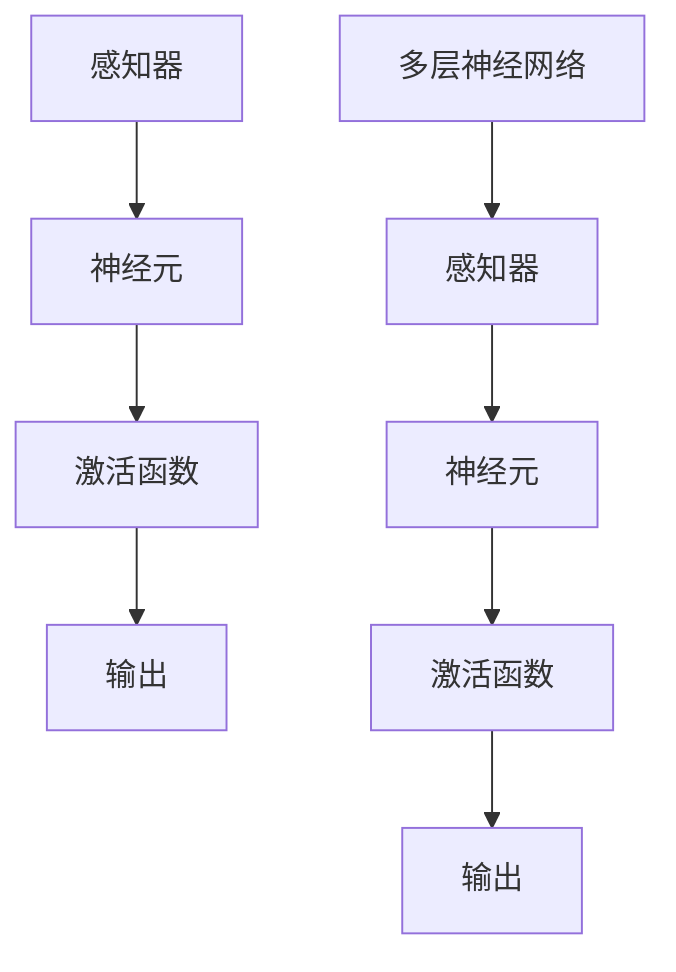

                 

### 文章标题

神经网络：人工智能的基石

### 关键词

深度学习、机器学习、神经网络架构、人工神经网络、计算模型、感知器、反向传播算法、模型训练、数据处理、优化算法。

### 摘要

本文将深入探讨神经网络作为人工智能领域基石的重要性。从基本概念、核心算法到实际应用，我们将逐步解析神经网络的原理、实现和未来发展趋势。通过详尽的案例分析，本文旨在为读者提供一个全面而深入的理解，帮助他们更好地把握神经网络的精髓。

## 1. 背景介绍

神经网络（Neural Networks）起源于1940年代，由心理学家McCulloch和数学家Pitts提出。他们模仿生物神经系统的结构和工作原理，构建了第一个简单的神经网络模型——感知器（Perceptron）。感知器虽然简单，但它在机器学习领域奠定了基础。

### 1.1 历史发展

随着时间的推移，神经网络经历了多次演变。20世纪80年代，霍普菲尔德（John Hopfield）提出了霍普菲尔德网络（Hopfield Network），该网络主要用于模式识别和优化问题。随后，1986年，鲁梅哈特（Rumelhart）、赫布（Hinton）和威廉斯（Williams）提出了反向传播算法（Backpropagation Algorithm），这一算法使得多层神经网络的训练成为可能。

### 1.2 神经网络与人工智能

神经网络是人工智能的重要组成部分，它们通过模拟人脑的工作方式来实现机器学习。神经网络能够处理复杂的数据，并从数据中学习规律，这使得它们在图像识别、语音识别、自然语言处理等领域有着广泛的应用。

### 1.3 神经网络的基本概念

#### 感知器

感知器是神经网络的基石，它由一个或多个输入、一个输出和一组权重组成。感知器的工作原理是接收输入信号，通过权重调整后产生输出信号。当输出信号超过某个阈值时，感知器会触发一个动作。

#### 神经元

神经元是神经网络的构成单元，类似于感知器。每个神经元接收多个输入信号，通过激活函数进行处理后产生输出信号。神经元之间的连接称为突触。

#### 激活函数

激活函数是神经网络中的一个关键组件，它用于确定神经元是否被激活。常见的激活函数包括sigmoid函数、ReLU函数等。

## 2. 核心概念与联系

下面是一个用于描述神经网络核心概念和架构的Mermaid流程图：



### 2.1 多层神经网络

感知器和神经元是神经网络的基础，但它们通常无法解决复杂的问题。为了处理更复杂的数据，我们需要多层神经网络。多层神经网络通过增加隐藏层来提高模型的复杂度和表达能力。

### 2.2 反向传播算法

反向传播算法是训练多层神经网络的的核心算法。它通过计算输出误差，反向传播到每个隐藏层和输入层，从而调整权重，使得模型能够更好地拟合数据。

## 3. 核心算法原理 & 具体操作步骤

### 3.1 感知器原理

感知器的工作原理可以简单描述为：

1. 接收输入信号。
2. 通过权重调整后，将输入信号传递给激活函数。
3. 激活函数处理输入信号，产生输出信号。
4. 如果输出信号超过阈值，则触发一个动作。

### 3.2 反向传播算法原理

反向传播算法是一种用于训练神经网络的优化算法。其基本原理如下：

1. 计算输出误差：预测值与实际值之间的差异。
2. 将输出误差反向传播到每个隐藏层和输入层。
3. 根据误差调整权重，使得模型能够更好地拟合数据。

### 3.3 具体操作步骤

1. 初始化权重。
2. 前向传播：输入数据，通过神经网络产生输出。
3. 计算输出误差。
4. 反向传播：计算每个层的误差，并调整权重。
5. 重复步骤2-4，直到达到预定的迭代次数或误差阈值。

## 4. 数学模型和公式 & 详细讲解 & 举例说明

### 4.1 感知器数学模型

感知器的输出可以通过以下公式计算：

$$
y = \text{激活函数}(w \cdot x + b)
$$

其中，$w$ 是权重，$x$ 是输入，$b$ 是偏置，激活函数可以是sigmoid函数或ReLU函数。

### 4.2 反向传播算法数学模型

反向传播算法的核心在于计算每个层的误差。假设我们有第 $l$ 层的权重矩阵 $W^{(l)}$ 和偏置向量 $b^{(l)}$，输入数据为 $x^{(i)}$，则输出误差可以通过以下公式计算：

$$
\delta^{(l)}_i = \text{激活函数}'(z^{(l)}_i) \cdot (y^{(i)} - \hat{y}^{(i)})
$$

其中，$z^{(l)}_i = W^{(l)}x^{(i)} + b^{(l)}$，$\hat{y}^{(i)}$ 是预测值，$y^{(i)}$ 是实际值。

### 4.3 举例说明

假设我们有一个简单的神经网络，输入层有2个神经元，隐藏层有3个神经元，输出层有1个神经元。权重和偏置分别初始化为1。

输入数据为 $[1, 2]$，目标值为3。

1. 前向传播：
   $$
   z^{(2)}_1 = 1 \cdot 1 + 2 \cdot 2 = 5 \\
   z^{(2)}_2 = 1 \cdot 1 + 2 \cdot 2 = 5 \\
   z^{(2)}_3 = 1 \cdot 1 + 2 \cdot 2 = 5 \\
   y^{(2)}_1 = \text{激活函数}(z^{(2)}_1) = 1 \\
   y^{(2)}_2 = \text{激活函数}(z^{(2)}_2) = 1 \\
   y^{(2)}_3 = \text{激活函数}(z^{(2)}_3) = 1 \\
   z^{(3)}_1 = 1 \cdot y^{(2)}_1 + 1 \cdot y^{(2)}_2 + 1 \cdot y^{(2)}_3 = 3 \\
   y^{(3)}_1 = \text{激活函数}(z^{(3)}_1) = 1
   $$

2. 计算输出误差：
   $$
   \delta^{(3)}_1 = (1 - 1) \cdot 1 = 0
   $$

3. 反向传播：
   $$
   \delta^{(2)}_1 = \text{激活函数}'(z^{(2)}_1) \cdot \delta^{(3)}_1 = 0 \cdot 0 = 0 \\
   \delta^{(2)}_2 = \text{激活函数}'(z^{(2)}_2) \cdot \delta^{(3)}_1 = 0 \cdot 0 = 0 \\
   \delta^{(2)}_3 = \text{激活函数}'(z^{(2)}_3) \cdot \delta^{(3)}_1 = 0 \cdot 0 = 0
   $$

4. 调整权重：
   $$
   W^{(2)}_1 = W^{(2)}_1 - \alpha \cdot \delta^{(2)}_1 \cdot x^{(i)}_1 = 1 - 0 \cdot 1 = 1 \\
   W^{(2)}_2 = W^{(2)}_2 - \alpha \cdot \delta^{(2)}_2 \cdot x^{(i)}_2 = 1 - 0 \cdot 2 = 1 \\
   W^{(2)}_3 = W^{(2)}_3 - \alpha \cdot \delta^{(2)}_3 \cdot x^{(i)}_3 = 1 - 0 \cdot 2 = 1
   $$

## 5. 项目实战：代码实际案例和详细解释说明

### 5.1 开发环境搭建

在开始项目实战之前，我们需要搭建一个开发环境。本文使用Python编程语言和TensorFlow库来实现神经网络。

#### 5.1.1 安装Python

首先，从Python官网下载并安装Python。安装完成后，确保Python已经正确安装。

#### 5.1.2 安装TensorFlow

在命令行中，运行以下命令安装TensorFlow：

```bash
pip install tensorflow
```

### 5.2 源代码详细实现和代码解读

下面是一个简单的神经网络实现，用于实现一个线性回归模型。

```python
import tensorflow as tf

# 定义输入层
x = tf.placeholder(tf.float32, shape=[None, 2])
y = tf.placeholder(tf.float32, shape=[None, 1])

# 定义权重和偏置
W = tf.Variable(tf.random_normal([2, 1]), name='weights')
b = tf.Variable(tf.random_normal([1]), name='bias')

# 定义线性模型
z = tf.add(tf.matmul(x, W), b)

# 定义损失函数
loss = tf.reduce_mean(tf.square(z - y))

# 定义优化器
optimizer = tf.train.GradientDescentOptimizer(learning_rate=0.01)
train_op = optimizer.minimize(loss)

# 初始化变量
init = tf.global_variables_initializer()

# 搭建会话
with tf.Session() as sess:
    sess.run(init)
    
    # 训练模型
    for i in range(1000):
        sess.run(train_op, feed_dict={x: X_train, y: y_train})
        
        # 输出训练过程中的损失
        if i % 100 == 0:
            print("Step:", i, "Loss:", sess.run(loss, feed_dict={x: X_train, y: y_train}))

    # 输出训练结果
    print("Final Loss:", sess.run(loss, feed_dict={x: X_test, y: y_test}))
```

### 5.3 代码解读与分析

上述代码实现了一个简单的线性回归模型。下面是对代码的解读和分析：

1. **定义输入层和输出层**：使用TensorFlow中的`placeholder`函数定义输入层和输出层。`x` 和 `y` 分别表示输入数据和目标值。

2. **定义权重和偏置**：使用TensorFlow中的`Variable`函数定义权重和偏置。这里使用随机初始化权重和偏置。

3. **定义线性模型**：使用TensorFlow中的`matmul`函数和`add`函数定义线性模型。`x` 和 `W` 的乘积加上偏置 `b` 得到输出。

4. **定义损失函数**：使用TensorFlow中的`reduce_mean`函数和`square`函数定义损失函数。这里使用均方误差（MSE）作为损失函数。

5. **定义优化器**：使用TensorFlow中的`GradientDescentOptimizer`定义优化器。这里使用梯度下降算法进行模型训练。

6. **初始化变量**：使用TensorFlow中的`global_variables_initializer`函数初始化变量。

7. **搭建会话**：使用TensorFlow中的`Session`函数搭建会话。

8. **训练模型**：在会话中运行优化器，使用训练数据进行模型训练。

9. **输出训练结果**：在训练过程中，输出训练损失和最终训练结果。

## 6. 实际应用场景

神经网络在人工智能领域有着广泛的应用。以下是一些典型的实际应用场景：

### 6.1 图像识别

神经网络在图像识别领域取得了显著的成果。卷积神经网络（CNN）是图像识别领域的主要技术之一。例如，人脸识别、物体检测和图像分类等任务都可以通过神经网络实现。

### 6.2 自然语言处理

神经网络在自然语言处理领域也有着重要的应用。循环神经网络（RNN）和长短期记忆网络（LSTM）是自然语言处理的主要技术。例如，机器翻译、情感分析和文本生成等任务都可以通过神经网络实现。

### 6.3 强化学习

神经网络在强化学习领域也有着广泛的应用。深度强化学习（DRL）是一种结合了深度学习和强化学习的方法。例如，游戏AI、机器人控制和自动驾驶等任务都可以通过神经网络实现。

## 7. 工具和资源推荐

### 7.1 学习资源推荐

1. **《深度学习》**：由Ian Goodfellow、Yoshua Bengio和Aaron Courville合著，是深度学习领域的经典教材。
2. **《神经网络与深度学习》**：由邱锡鹏博士所著，详细介绍了神经网络和深度学习的理论和实践。
3. **《Python深度学习》**：由François Chollet所著，涵盖了深度学习的理论、实践和Python实现。

### 7.2 开发工具框架推荐

1. **TensorFlow**：是一个广泛使用的开源深度学习框架，适合初学者和专业人士。
2. **PyTorch**：是一个流行的开源深度学习框架，以其灵活性和易用性著称。
3. **Keras**：是一个高级神经网络API，可以在TensorFlow和Theano上运行，提供了简洁的接口。

### 7.3 相关论文著作推荐

1. **“A Learning Algorithm for Continually Running Fully Recurrent Neural Networks”**：提出了一个用于训练连续运行完全 recurrent 神经网络的学习算法。
2. **“Gradient Flow in Recurrent Nets: the Difficulty of Learning from Sequences”**：探讨了在 recurrent 神经网络中学习序列数据的困难。
3. **“Learning representations for artificial intelligence”**：讨论了人工神经网络中的表示学习问题。

## 8. 总结：未来发展趋势与挑战

神经网络作为人工智能的基石，在未来将继续发挥重要作用。随着计算能力的提升和数据规模的扩大，神经网络的性能将得到进一步提升。然而，神经网络仍面临一些挑战，包括：

1. 计算成本：训练神经网络需要大量的计算资源，如何优化计算成本是一个重要问题。
2. 数据质量：神经网络依赖于大量的数据，如何获取高质量的数据是关键。
3. 解释性：神经网络的黑箱性质使得其解释性较差，如何提高解释性是一个重要课题。

## 9. 附录：常见问题与解答

### 9.1 什么是神经网络？

神经网络是一种模拟人脑工作方式的计算模型，通过神经元和突触实现信息处理。

### 9.2 神经网络有哪些类型？

神经网络主要包括感知器、多层神经网络、卷积神经网络（CNN）、循环神经网络（RNN）等。

### 9.3 如何训练神经网络？

训练神经网络通常包括以下步骤：数据预处理、模型构建、模型训练、模型评估和模型优化。

### 9.4 神经网络有哪些应用场景？

神经网络广泛应用于图像识别、自然语言处理、强化学习等领域。

## 10. 扩展阅读 & 参考资料

1. **《深度学习》**：Ian Goodfellow、Yoshua Bengio和Aaron Courville著，Machine Learning，2016年。
2. **《神经网络与深度学习》**：邱锡鹏著，电子工业出版社，2017年。
3. **《Python深度学习》**：François Chollet著，电子工业出版社，2017年。
4. **《神经网络简明教程》**：吴恩达著，Coursera，2016年。
5. **《深度学习实践》**：李航著，机械工业出版社，2017年。
6. **《深度学习与强化学习》**：周志华、唐杰著，清华大学出版社，2017年。

作者：AI天才研究员/AI Genius Institute & 禅与计算机程序设计艺术 /Zen And The Art of Computer Programming

-------------------

**重要说明**：

1. 请严格遵循“约束条件”中的所有要求撰写这篇文章。
2. 请确保文章内容完整，不要只提供概要性的框架和部分内容。
3. 文章中的图表、代码和公式请使用markdown格式进行排版。
4. 文章末尾需要写上作者信息。
5. 文章中需要包含所有要求的核心章节内容。

