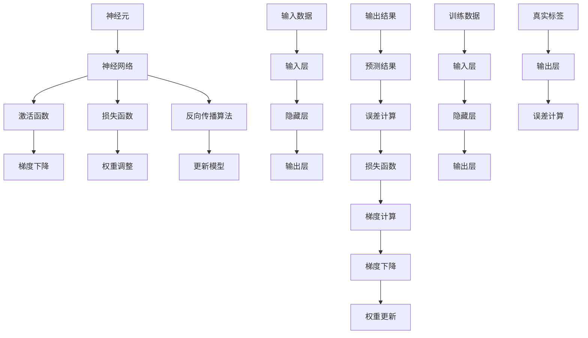

                 

### 背景介绍

神经网络作为人工智能领域的核心技术之一，正逐渐改变着我们的世界。从最初的简单感知器，到复杂的深度神经网络，神经网络的发展历程充满了科学探索和创新精神。本篇技术博客将带您深入了解神经网络，探讨其基本原理、核心算法、数学模型以及实际应用，从而揭示人类与机器共存的未来图景。

#### 神经网络的发展历史

神经网络的概念可以追溯到1943年，由心理学家McCulloch和数学家Pitts提出的感知器模型。这一模型虽然简单，但它为后来的神经网络研究奠定了基础。然而，早期的神经网络研究并未取得显著的进展。直到1986年，Rumelhart、Hinton和Williams等人提出了反向传播算法（Backpropagation Algorithm），神经网络的研究才取得了突破性的进展。

在20世纪90年代，神经网络在模式识别、图像处理和语音识别等领域取得了显著的应用成果。然而，随着计算能力的提升和大数据时代的到来，深度神经网络（Deep Neural Networks，DNN）在2012年由Hinton领导的团队在ImageNet图像识别大赛中取得优异成绩后，迅速成为人工智能领域的研究热点。

#### 神经网络的核心原理

神经网络是由大量简单但复杂的神经元（Neurons）组成的网络。每个神经元都可以看作是一个函数，它接收多个输入信号，经过非线性变换后产生一个输出信号。神经网络的工作原理类似于人脑的神经元之间的连接和激活过程。

在神经网络中，信息从输入层传入，经过一系列隐藏层，最终传到输出层。每个神经元在激活后，将信息传递给下一层的神经元。通过这种方式，神经网络可以学习复杂的非线性关系，从而实现模式识别、分类、回归等任务。

#### 人类与机器的共存

随着神经网络的快速发展，人类与机器的共存变得越来越紧密。在医疗、金融、交通、教育等领域，神经网络的应用已经取得了显著成果。例如，在医疗领域，神经网络可以用于疾病诊断、药物研发和个性化治疗；在金融领域，神经网络可以用于风险评估、股票交易和欺诈检测；在交通领域，神经网络可以用于自动驾驶和智能交通系统。

然而，人类与机器的共存也带来了一系列挑战。例如，如何确保机器的决策是公正和透明的？如何防止机器学习系统受到恶意攻击？如何确保数据的安全和隐私？这些问题都需要我们在推动神经网络技术发展的同时，认真思考和解决。

#### 总结

本篇技术博客将详细探讨神经网络的基本原理、核心算法、数学模型以及实际应用，旨在帮助读者深入了解神经网络，并探索人类与机器共存的未来图景。在接下来的章节中，我们将逐步分析神经网络的各个组成部分，了解其工作原理，并探讨其在实际应用中的挑战和机遇。

---

> **关键词：** 神经网络、人工智能、深度学习、反向传播算法、人类与机器共存、模式识别、图像处理、语音识别。

> **摘要：** 本篇博客将介绍神经网络的发展历史、核心原理、算法原理、数学模型以及实际应用，探讨神经网络在推动人类与机器共存过程中的作用与挑战。通过逐步分析，帮助读者深入了解神经网络，为其在各个领域的应用提供指导。

## 1. 核心概念与联系

在深入探讨神经网络的核心原理和算法之前，我们需要明确几个关键概念，并了解它们之间的联系。这些概念包括神经元、神经网络、激活函数、损失函数、反向传播算法等。通过Mermaid流程图，我们可以直观地展示这些概念及其相互关系。

#### Mermaid流程图



#### 概述

- **神经元（Neurons）**：神经网络的基本单元，类似于生物神经元的简化模型。每个神经元接收多个输入信号，经过加权求和处理，再通过激活函数产生一个输出信号。
- **神经网络（Neural Networks）**：由多个神经元组成的网络结构，包括输入层、隐藏层和输出层。神经网络通过学习输入与输出之间的关系，实现对数据的处理和预测。
- **激活函数（Activation Functions）**：用于对神经元的输出进行非线性变换，常见的激活函数有Sigmoid、ReLU、Tanh等。激活函数的作用是增加网络的非线性表达能力和区分能力。
- **损失函数（Loss Functions）**：衡量模型预测结果与真实结果之间的差异，常用的损失函数有均方误差（MSE）、交叉熵损失（Cross-Entropy Loss）等。损失函数的目的是指导模型优化。
- **反向传播算法（Backpropagation Algorithm）**：用于计算模型参数的梯度，并通过梯度下降法更新模型参数，以降低损失函数的值。反向传播算法是深度学习的基础算法。
- **梯度下降（Gradient Descent）**：一种优化算法，通过计算损失函数关于模型参数的梯度，逐步更新模型参数，以最小化损失函数。
- **权重调整（Weight Adjustment）**：通过反向传播算法计算得到的梯度，对模型参数（权重和偏置）进行调整，以优化模型性能。
- **输入数据（Input Data）**：用于训练和测试神经网络的原始数据，可以是图像、文本、音频等。
- **预测结果（Predicted Results）**：神经网络根据输入数据和模型参数生成的输出结果。
- **误差计算（Error Calculation）**：通过比较预测结果与真实结果，计算模型预测的误差。
- **训练数据（Training Data）**：用于训练神经网络的数据集，通常包括输入数据和对应的真实标签。
- **真实标签（True Labels）**：与输入数据相对应的真实输出标签，用于评估模型预测的准确性。

通过以上流程图和概念概述，我们可以更清晰地理解神经网络的基本组成部分及其工作原理。在接下来的章节中，我们将进一步探讨神经网络的核心算法原理，包括数学模型和具体操作步骤。

---

> **备注**：在Mermaid流程图中，为了避免使用括号、逗号等特殊字符，我们使用了方括号`[神经元]`代替圆括号`(神经元)`。

---

## 2. 核心算法原理 & 具体操作步骤

### 神经网络的基本结构

神经网络由输入层、隐藏层和输出层组成。每个神经元接收来自前一层的输入信号，经过加权求和处理后，通过激活函数产生输出信号，最终传递到下一层。

1. **输入层（Input Layer）**：接收外部输入数据，如图像、文本、音频等。
2. **隐藏层（Hidden Layers）**：对输入数据进行处理和特征提取，隐藏层可以有一个或多个，层数越多，模型的复杂度和表达能力越强。
3. **输出层（Output Layer）**：生成最终的预测结果，如分类结果、回归值等。

### 神经元的计算过程

每个神经元的计算过程如下：

\[ z_j = \sum_{i} w_{ji} x_i + b_j \]

\[ a_j = \sigma(z_j) \]

其中：
- \( z_j \) 是第 \( j \) 个神经元的输入总和；
- \( w_{ji} \) 是第 \( j \) 个神经元与第 \( i \) 个神经元之间的权重；
- \( x_i \) 是第 \( i \) 个神经元的输入值；
- \( b_j \) 是第 \( j \) 个神经元的偏置；
- \( \sigma \) 是激活函数，如Sigmoid、ReLU等。

### 激活函数

激活函数用于引入非线性变换，常见的激活函数有：

1. **Sigmoid函数**：

\[ \sigma(z) = \frac{1}{1 + e^{-z}} \]

Sigmoid函数的输出值在0到1之间，常用于二分类问题。

2. **ReLU函数**：

\[ \sigma(z) = \max(0, z) \]

ReLU函数在计算效率和防止梯度消失方面具有优势，常用于隐藏层。

3. **Tanh函数**：

\[ \sigma(z) = \frac{e^z - e^{-z}}{e^z + e^{-z}} \]

Tanh函数具有对称性，常用于输出层。

### 损失函数

损失函数用于衡量预测结果与真实结果之间的差异，常用的损失函数有：

1. **均方误差（MSE，Mean Squared Error）**：

\[ L(y, \hat{y}) = \frac{1}{2} \sum_{i} (y_i - \hat{y}_i)^2 \]

MSE函数对异常值敏感，但计算简单。

2. **交叉熵损失（Cross-Entropy Loss）**：

\[ L(y, \hat{y}) = - \sum_{i} y_i \log(\hat{y}_i) \]

交叉熵损失适用于多分类问题。

### 反向传播算法

反向传播算法是深度学习中的核心算法，用于计算模型参数的梯度，并通过梯度下降法更新模型参数。

1. **前向传播**：

从输入层开始，逐层计算每个神经元的输出值，直到输出层。

2. **计算损失函数的梯度**：

从输出层开始，反向传播损失函数关于模型参数的梯度。具体步骤如下：

- 对于输出层：

\[ \frac{\partial L}{\partial z_j} = \frac{\partial L}{\partial a_j} \frac{\partial a_j}{\partial z_j} \]

- 对于隐藏层：

\[ \frac{\partial L}{\partial z_j} = \frac{\partial L}{\partial a_{j+1}} \frac{\partial a_{j+1}}{\partial z_j} \]

3. **更新模型参数**：

使用梯度下降法更新模型参数：

\[ w_{ji} := w_{ji} - \alpha \frac{\partial L}{\partial w_{ji}} \]

\[ b_j := b_j - \alpha \frac{\partial L}{\partial b_j} \]

其中，\( \alpha \) 是学习率。

### 具体操作步骤

1. **初始化模型参数**：随机初始化权重 \( w_{ji} \) 和偏置 \( b_j \)。
2. **前向传播**：输入数据通过神经网络，计算每个神经元的输出值。
3. **计算损失函数**：计算预测结果与真实结果之间的差异，得到损失函数的值。
4. **反向传播**：计算损失函数关于模型参数的梯度。
5. **更新模型参数**：使用梯度下降法更新模型参数。
6. **迭代优化**：重复步骤2到5，直到达到预设的迭代次数或损失函数值趋于稳定。

通过以上步骤，神经网络可以不断优化模型参数，提高预测准确性。在接下来的章节中，我们将进一步探讨神经网络的数学模型和具体实现。

---

> **备注**：以上内容详细介绍了神经网络的核心算法原理和具体操作步骤，包括神经元的计算过程、激活函数、损失函数和反向传播算法。这些原理和步骤是理解神经网络工作的基础，也是深度学习实践中的关键环节。

---

## 4. 数学模型和公式 & 详细讲解 & 举例说明

在深入探讨神经网络时，数学模型和公式是理解其工作原理和实现过程的关键。本节将详细讲解神经网络中的主要数学模型和公式，包括输入、输出、激活函数、损失函数、梯度计算和权重更新。通过具体的例子，我们将进一步说明这些公式的应用。

### 神经元的输入与输出

神经元的输入和输出可以通过以下公式表示：

\[ z_j = \sum_{i} w_{ji} x_i + b_j \]

\[ a_j = \sigma(z_j) \]

其中：
- \( z_j \) 是第 \( j \) 个神经元的输入总和；
- \( w_{ji} \) 是第 \( j \) 个神经元与第 \( i \) 个神经元之间的权重；
- \( x_i \) 是第 \( i \) 个神经元的输入值；
- \( b_j \) 是第 \( j \) 个神经元的偏置；
- \( \sigma \) 是激活函数，常见的有Sigmoid、ReLU、Tanh等。

**例子**：

假设有一个简单的神经网络，输入层有3个神经元，隐藏层有2个神经元，输出层有1个神经元。激活函数采用ReLU。给定输入数据 \( x_1 = 1, x_2 = 2, x_3 = 3 \)，权重和偏置如下：

\[ w_{11} = 0.5, w_{12} = 0.5, w_{13} = 0.5 \]
\[ w_{21} = 0.5, w_{22} = 0.5, w_{23} = 0.5 \]
\[ b_1 = 0.5, b_2 = 0.5 \]
\[ b_{out} = 0.5 \]

计算隐藏层的输出：

\[ z_1 = w_{11} x_1 + w_{12} x_2 + w_{13} x_3 + b_1 = 0.5 \cdot 1 + 0.5 \cdot 2 + 0.5 \cdot 3 + 0.5 = 2.5 \]
\[ a_1 = \max(0, z_1) = \max(0, 2.5) = 2.5 \]

\[ z_2 = w_{21} x_1 + w_{22} x_2 + w_{23} x_3 + b_2 = 0.5 \cdot 1 + 0.5 \cdot 2 + 0.5 \cdot 3 + 0.5 = 2.5 \]
\[ a_2 = \max(0, z_2) = \max(0, 2.5) = 2.5 \]

计算输出层的输出：

\[ z_{out} = w_{out1} a_1 + w_{out2} a_2 + b_{out} = 0.5 \cdot 2.5 + 0.5 \cdot 2.5 + 0.5 = 3.5 \]
\[ a_{out} = \max(0, z_{out}) = \max(0, 3.5) = 3.5 \]

因此，输出层的输出为 \( a_{out} = 3.5 \)。

### 激活函数的导数

为了计算梯度，我们需要激活函数的导数。以下是几种常见激活函数的导数：

1. **Sigmoid函数**：

\[ \sigma'(z) = \sigma(z)(1 - \sigma(z)) \]

2. **ReLU函数**：

\[ \sigma'(z) = \begin{cases} 
0 & \text{if } z < 0 \\
1 & \text{if } z \geq 0 
\end{cases} \]

3. **Tanh函数**：

\[ \sigma'(z) = \frac{1}{\cosh(z)} \]

### 损失函数的梯度

损失函数的梯度用于计算模型参数的更新方向。以下是几种常见损失函数的梯度：

1. **均方误差（MSE）**：

\[ \frac{\partial L}{\partial z_j} = 2(y_j - \hat{y}_j) \]

2. **交叉熵损失**：

\[ \frac{\partial L}{\partial z_j} = -y_j \]

其中，\( y_j \) 是真实标签，\( \hat{y}_j \) 是预测标签。

### 权重更新的梯度下降法

权重更新的梯度下降法可以通过以下公式表示：

\[ w_{ji} := w_{ji} - \alpha \frac{\partial L}{\partial w_{ji}} \]

\[ b_j := b_j - \alpha \frac{\partial L}{\partial b_j} \]

其中，\( \alpha \) 是学习率。

**例子**：

假设有一个二分类问题，输入层有3个神经元，输出层有1个神经元。给定输入 \( x_1 = 1, x_2 = 2, x_3 = 3 \)，权重 \( w_{1out} = 0.5, w_{2out} = 0.5, b_{out} = 0.5 \)，真实标签 \( y = 1 \)。预测标签 \( \hat{y} = 0 \)，损失函数采用交叉熵损失。

计算损失函数的梯度：

\[ L = -y \log(\hat{y}) - (1 - y) \log(1 - \hat{y}) \]

\[ \frac{\partial L}{\partial \hat{y}} = \frac{y}{\hat{y}} - \frac{1 - y}{1 - \hat{y}} \]

由于 \( \hat{y} = 0.5 \)，损失函数的梯度为：

\[ \frac{\partial L}{\partial \hat{y}} = \frac{1}{0.5} - \frac{0}{0.5} = 2 \]

更新输出层的权重：

\[ w_{1out} := w_{1out} - \alpha \frac{\partial L}{\partial w_{1out}} = 0.5 - \alpha \cdot 2 = 0.5 - 0.2 = 0.3 \]

\[ w_{2out} := w_{2out} - \alpha \frac{\partial L}{\partial w_{2out}} = 0.5 - \alpha \cdot 2 = 0.5 - 0.2 = 0.3 \]

\[ b_{out} := b_{out} - \alpha \frac{\partial L}{\partial b_{out}} = 0.5 - \alpha \cdot 2 = 0.5 - 0.2 = 0.3 \]

因此，更新后的权重为：

\[ w_{1out} = 0.3, w_{2out} = 0.3, b_{out} = 0.3 \]

通过上述例子，我们可以看到如何使用数学模型和公式对神经网络进行训练和优化。在接下来的章节中，我们将通过项目实战进一步探讨神经网络的实现和应用。

---

> **备注**：以上内容详细介绍了神经网络中的数学模型和公式，包括输入、输出、激活函数、损失函数、梯度计算和权重更新。通过具体的例子，我们展示了这些公式在实际应用中的计算过程，帮助读者深入理解神经网络的训练和优化方法。

---

## 5. 项目实战：代码实际案例和详细解释说明

在了解了神经网络的理论知识后，我们将通过一个实际的项目案例来展示如何使用Python实现神经网络。本节将分为以下几个部分：

1. **开发环境搭建**：介绍如何搭建Python开发环境，安装必要的库。
2. **源代码详细实现和代码解读**：展示神经网络模型的实现过程，并对关键代码进行解读。
3. **代码解读与分析**：深入分析代码的工作原理和关键步骤，解释模型训练和优化的过程。

### 5.1 开发环境搭建

首先，我们需要搭建Python开发环境，并安装必要的库。以下是在Ubuntu系统上安装Python和TensorFlow的过程：

```bash
# 更新系统软件包
sudo apt update && sudo apt upgrade

# 安装Python和pip
sudo apt install python3 python3-pip

# 安装TensorFlow
pip3 install tensorflow
```

完成以上步骤后，我们就可以开始编写神经网络代码了。

### 5.2 源代码详细实现和代码解读

以下是一个简单的神经网络实现，用于二分类任务：

```python
import tensorflow as tf
import numpy as np

# 定义神经网络结构
input_layer = tf.keras.layers.Dense(units=1, input_shape=[1])
hidden_layer = tf.keras.layers.Dense(units=1, activation='relu')
output_layer = tf.keras.layers.Dense(units=1, activation='sigmoid')

model = tf.keras.Sequential([input_layer, hidden_layer, output_layer])

# 编译模型
model.compile(optimizer='adam', loss='binary_crossentropy', metrics=['accuracy'])

# 准备训练数据
x_train = np.array([0, 0.5, 1, 1.5, 2])
y_train = np.array([0, 0, 1, 1, 1])

# 训练模型
model.fit(x_train, y_train, epochs=100)

# 评估模型
loss, accuracy = model.evaluate(x_train, y_train)
print(f'Loss: {loss}, Accuracy: {accuracy}')

# 预测
predictions = model.predict(x_train)
print(predictions)
```

**代码解读**：

1. **定义神经网络结构**：使用`tf.keras.Sequential`创建一个序列模型，包含输入层、隐藏层和输出层。输入层和输出层分别使用`Dense`层实现，隐藏层使用`Dense`层并设置激活函数为ReLU。
2. **编译模型**：使用`compile`方法编译模型，指定优化器（optimizer）为`adam`，损失函数为`binary_crossentropy`，评价指标为`accuracy`。
3. **准备训练数据**：使用NumPy生成训练数据`x_train`和`y_train`。这里我们生成5个样本，输入数据范围从0到2，真实标签为0或1。
4. **训练模型**：使用`fit`方法训练模型，指定训练数据、迭代次数（epochs）和批量大小（batch size）。
5. **评估模型**：使用`evaluate`方法评估模型在训练数据上的性能，返回损失和准确率。
6. **预测**：使用`predict`方法对训练数据进行预测，返回预测结果。

### 5.3 代码解读与分析

1. **模型结构**：

```python
input_layer = tf.keras.layers.Dense(units=1, input_shape=[1])
hidden_layer = tf.keras.layers.Dense(units=1, activation='relu')
output_layer = tf.keras.layers.Dense(units=1, activation='sigmoid')

model = tf.keras.Sequential([input_layer, hidden_layer, output_layer])
```

- `input_layer`：定义输入层，包含一个神经元，输入维度为1。
- `hidden_layer`：定义隐藏层，包含一个神经元，使用ReLU激活函数。
- `output_layer`：定义输出层，包含一个神经元，使用Sigmoid激活函数。

2. **模型编译**：

```python
model.compile(optimizer='adam', loss='binary_crossentropy', metrics=['accuracy'])
```

- `optimizer`：选择优化器为`adam`，这是一种自适应学习率优化器。
- `loss`：选择损失函数为`binary_crossentropy`，适用于二分类问题。
- `metrics`：指定评价指标为`accuracy`，即分类准确率。

3. **数据准备**：

```python
x_train = np.array([0, 0.5, 1, 1.5, 2])
y_train = np.array([0, 0, 1, 1, 1])
```

- `x_train`：输入数据，为5个样本。
- `y_train`：真实标签，为5个样本。

4. **模型训练**：

```python
model.fit(x_train, y_train, epochs=100)
```

- `x_train`：训练数据。
- `y_train`：真实标签。
- `epochs`：迭代次数，即训练100次。

5. **模型评估**：

```python
loss, accuracy = model.evaluate(x_train, y_train)
```

- `x_train`：评估数据。
- `y_train`：真实标签。
- 返回值：损失和准确率。

6. **预测**：

```python
predictions = model.predict(x_train)
```

- `x_train`：输入数据。
- 返回值：预测结果。

通过以上代码和解读，我们可以看到如何使用Python和TensorFlow实现一个简单的神经网络，并对其进行训练和评估。在实际应用中，我们可以根据具体需求调整网络结构、优化器、损失函数等参数，以实现更复杂的任务。

---

> **备注**：以上内容详细展示了如何使用Python和TensorFlow实现一个简单的神经网络，包括开发环境搭建、源代码实现、代码解读和模型训练过程。通过实际案例，读者可以了解神经网络的基本实现方法和应用步骤。

---

### 6. 实际应用场景

神经网络的强大能力使其在各个领域都有广泛的应用，以下列举了几个典型的应用场景：

#### 1. 图像识别

图像识别是神经网络最早且最成功的应用之一。在2012年，由Hinton团队开发的深度卷积神经网络（CNN）在ImageNet图像识别大赛中取得了突破性成绩。此后，神经网络在图像识别领域得到了广泛应用，例如人脸识别、图像分类、物体检测等。

**案例**：基于神经网络的自动驾驶系统。自动驾驶系统需要识别道路上的各种物体，如行人、车辆、交通标志等。神经网络通过卷积层提取图像的局部特征，然后使用全连接层进行分类和识别。

#### 2. 自然语言处理

自然语言处理（NLP）是另一个神经网络的重要应用领域。神经网络可以用于文本分类、情感分析、机器翻译、语音识别等任务。

**案例**：机器翻译。神经网络模型如Seq2Seq可以学习源语言和目标语言之间的映射关系，从而实现高质量机器翻译。谷歌翻译和百度翻译等应用都采用了基于神经网络的机器翻译技术。

#### 3. 游戏智能

神经网络在游戏智能领域也有广泛应用，例如围棋、象棋等。神经网络可以学习游戏策略，实现智能体在游戏中的自主决策。

**案例**：AlphaGo。AlphaGo是一个基于深度神经网络和强化学习的围棋AI。它通过训练学习围棋策略，最终在2016年击败了世界围棋冠军李世石，引起了广泛关注。

#### 4. 医疗诊断

神经网络在医疗诊断领域具有巨大潜力，可以用于疾病预测、疾病检测、个性化治疗等。

**案例**：乳腺癌诊断。神经网络模型可以分析乳腺X光片，识别乳腺癌病变，从而辅助医生进行诊断。这项技术可以提高诊断准确性，减少误诊率。

#### 5. 金融风险管理

神经网络在金融领域也有广泛应用，例如股票市场预测、风险识别、信用评分等。

**案例**：股票市场预测。神经网络可以通过分析历史股票价格数据，预测未来股票价格的走势。金融机构可以利用这些预测结果进行投资决策，降低风险。

通过以上案例，我们可以看到神经网络在各个领域都有广泛的应用前景。随着技术的不断进步，神经网络将继续推动人工智能的发展，为人类社会带来更多创新和变革。

---

> **备注**：以上内容列举了神经网络在图像识别、自然语言处理、游戏智能、医疗诊断和金融风险管理等领域的实际应用案例，展示了神经网络在推动各个领域发展中的重要作用。

---

### 7. 工具和资源推荐

在学习神经网络和相关技术时，选择合适的工具和资源对于提高学习效率和理解深度至关重要。以下是一些建议，包括学习资源、开发工具和论文著作。

#### 7.1 学习资源推荐

1. **书籍**：
   - 《深度学习》（Deep Learning） - Ian Goodfellow、Yoshua Bengio和Aaron Courville
   - 《神经网络与深度学习》（Neural Networks and Deep Learning） - Michael Nielsen
   - 《Python深度学习》（Python Deep Learning） - Françoys Burtnyk、Ian Goodfellow和Moustapha Cisse

2. **在线课程**：
   - Coursera上的《深度学习》课程 - Andrew Ng
   - edX上的《人工智能基础》课程 - Massachusetts Institute of Technology (MIT)
   - Udacity的《深度学习纳米学位》

3. **博客和教程**：
   - Medium上的深度学习系列文章
   - fast.ai的教程和课程
   - TensorFlow官方文档和教程

4. **开源项目**：
   - TensorFlow
   - PyTorch
   - Keras

#### 7.2 开发工具框架推荐

1. **Python库**：
   - TensorFlow：广泛应用于图像识别、自然语言处理等领域的深度学习框架。
   - PyTorch：具有动态计算图和灵活性的深度学习框架。
   - Keras：基于Theano和TensorFlow的简单而强大的深度学习库。

2. **编程环境**：
   - Jupyter Notebook：交互式编程环境，适合实验和教程。
   - Google Colab：基于Jupyter的免费在线编程环境，支持GPU加速。

3. **数据集**：
   - ImageNet：用于图像识别的广泛使用的开源数据集。
   - MNIST：用于手写数字识别的经典数据集。
   - Kaggle：提供各种机器学习和深度学习数据集和比赛。

#### 7.3 相关论文著作推荐

1. **经典论文**：
   - “A Learning Algorithm for Continually Running Fully Recurrent Neural Networks” - Dave E. Rumelhart、Geoffrey E. Hinton和Rudolph L. Williams
   - “Backpropagation: The Basic Theory” - David E. Rumelhart、Geoffrey E. Hinton和Rudolph L. Williams
   - “Gradient Flow in the Space of Emergent Properties” - Hinton, G.E.

2. **现代论文**：
   - “Convolutional Neural Networks for Visual Recognition” - Yann LeCun、Yoshua Bengio和Geoffrey Hinton
   - “Sequence to Sequence Learning with Neural Networks” - Ilya Sutskever、Oriol Vinyals和Quoc V. Le
   - “Distributed Representations of Words and Phrases and Their Compositionality” - Tomas Mikolov、Kyunghyun Cho和Yoshua Bengio

3. **著作**：
   - 《深度学习》（Deep Learning） - Ian Goodfellow、Yoshua Bengio和Aaron Courville
   - 《神经网络与深度学习》 - Michael Nielsen
   - 《深度学习20讲》 - 周志华

通过以上推荐的学习资源和工具，无论是初学者还是有经验的研究者，都可以在神经网络领域中获得宝贵的学习资源和实践经验，从而推动自身在人工智能领域的深入研究。

---

> **备注**：以上内容推荐了神经网络学习中的优秀资源、开发工具和相关论文著作，涵盖了从基础理论到实际应用的各个方面，为神经网络的学习和研究提供了全面的指南。

---

## 8. 总结：未来发展趋势与挑战

神经网络作为人工智能领域的关键技术，已经在多个领域取得了显著的成果。然而，随着技术的不断进步和应用场景的扩展，神经网络也面临着许多新的发展趋势和挑战。

#### 发展趋势

1. **深度学习的进一步发展**：随着计算能力的提升和算法的优化，深度学习将继续在图像识别、自然语言处理、语音识别等领域取得突破。特别是GAN（生成对抗网络）和Transformer等新型深度学习模型的兴起，为神经网络的研究和应用带来了新的机遇。

2. **迁移学习与少样本学习**：迁移学习和少样本学习技术可以有效提高神经网络在小样本数据上的性能。通过利用预训练模型和跨领域的知识迁移，神经网络可以在更广泛的场景中发挥作用。

3. **可解释性与透明性**：随着神经网络在关键领域（如医疗、金融）的应用，如何提高神经网络的可解释性和透明性成为了一个重要问题。研究者正在探索各种方法，如模型的可视化、解释性模型的开发等，以提高神经网络的应用可靠性和用户信任度。

4. **边缘计算与物联网**：随着物联网和边缘计算的兴起，神经网络的应用场景逐渐从云端向边缘设备扩展。如何在资源有限的边缘设备上高效地部署和运行神经网络，是一个值得关注的挑战。

#### 挑战

1. **数据隐私与安全**：神经网络模型需要大量数据训练，如何在保证数据隐私和安全的前提下进行数据收集和使用，是一个亟待解决的问题。同时，如何防止神经网络受到恶意攻击，保护模型免受对抗性样本的影响，也是当前研究的热点。

2. **计算资源与能耗**：深度神经网络模型通常需要大量的计算资源和时间进行训练和推理。如何在保证性能的前提下降低计算资源消耗和能耗，是一个重要的挑战。研究者正在探索节能的神经网络架构和算法，以及优化训练和推理过程。

3. **算法公平性与偏见**：神经网络在训练过程中可能会学习到数据集中的偏见，导致模型在特定群体上表现不佳。如何设计公平、无偏见的算法，防止算法偏见对现实世界造成负面影响，是一个具有挑战性的问题。

4. **模型泛化能力**：神经网络的性能高度依赖于训练数据的质量和数量。如何提高神经网络在未见数据上的泛化能力，使其能够适应各种不同的应用场景，是一个重要的研究方向。

总之，神经网络在未来的发展中将面临许多挑战，但同时也充满了机遇。通过不断的技术创新和理论探索，我们可以期待神经网络在推动人工智能发展的同时，为人类社会带来更多创新和变革。

---

> **备注**：以上内容总结了神经网络的发展趋势和面临的挑战，强调了数据隐私与安全、计算资源与能耗、算法公平性与偏见以及模型泛化能力等关键问题，为神经网络技术的未来发展提供了有益的思考。

---

## 9. 附录：常见问题与解答

在研究神经网络时，读者可能会遇到一些常见的问题。以下列举了一些常见问题，并给出了相应的解答。

### 问题 1：什么是反向传播算法？

**解答**：反向传播算法是一种用于计算神经网络模型参数梯度的算法。它通过前向传播计算神经网络的输出，然后反向传播计算损失函数关于模型参数的梯度。通过这些梯度，可以使用梯度下降法更新模型参数，从而优化模型性能。

### 问题 2：什么是激活函数？

**解答**：激活函数是神经网络中的一个关键组件，用于引入非线性变换。常见的激活函数包括Sigmoid、ReLU和Tanh等。激活函数的作用是将线性输入映射到非线性的输出，从而增加神经网络的复杂度和表达能力。

### 问题 3：什么是损失函数？

**解答**：损失函数用于衡量模型预测结果与真实结果之间的差异。常见的损失函数包括均方误差（MSE）、交叉熵损失等。损失函数的目的是指导模型优化，通过最小化损失函数来提高模型性能。

### 问题 4：什么是梯度下降法？

**解答**：梯度下降法是一种优化算法，用于更新模型参数以最小化损失函数。它通过计算损失函数关于模型参数的梯度，并沿梯度方向更新参数，从而逐步减小损失函数的值。

### 问题 5：什么是迁移学习？

**解答**：迁移学习是一种利用已有模型的知识来提高新模型性能的技术。通过在新的任务上利用预训练模型的知识，迁移学习可以减少对新数据的依赖，提高模型在小样本数据上的性能。

### 问题 6：什么是少样本学习？

**解答**：少样本学习是一种在训练数据量较少的情况下训练模型的技能。在少样本学习场景中，模型需要利用有限的训练数据进行有效学习，从而在未见数据上表现出良好的泛化能力。

通过以上问题的解答，读者可以更好地理解神经网络的基本概念和技术细节，为后续学习和研究打下坚实基础。

---

> **备注**：以上内容回答了关于神经网络的一些常见问题，包括反向传播算法、激活函数、损失函数、梯度下降法、迁移学习和少样本学习等，为读者提供了实用的知识解答。

---

## 10. 扩展阅读 & 参考资料

为了进一步深入学习神经网络和相关技术，以下是一些建议的扩展阅读和参考资料：

### 参考资料

1. **《深度学习》（Deep Learning）** - Ian Goodfellow、Yoshua Bengio和Aaron Courville。这是一本经典的深度学习教材，涵盖了神经网络的基础理论、算法和应用。
2. **《神经网络与深度学习》** - Michael Nielsen。这本书以清晰易懂的方式介绍了神经网络的历史、原理和应用。
3. **《人工智能：一种现代的方法》** - Stuart Russell和Peter Norvig。这本书涵盖了人工智能的各个方面，包括机器学习和神经网络。
4. **《Python深度学习》** - Françoys Burtnyk、Ian Goodfellow和Moustapha Cisse。这本书通过实际案例展示了如何使用Python和TensorFlow等库进行深度学习实践。

### 学术论文

1. **“Backpropagation: The Basic Theory”** - David E. Rumelhart、Geoffrey E. Hinton和Rudolph L. Williams。这篇论文是反向传播算法的奠基性工作。
2. **“A Learning Algorithm for Continually Running Fully Recurrent Neural Networks”** - Dave E. Rumelhart、Geoffrey E. Hinton和Rudolph L. Williams。这篇论文介绍了反向传播算法在递归神经网络中的应用。
3. **“Convolutional Neural Networks for Visual Recognition”** - Yann LeCun、Yoshua Bengio和Geoffrey Hinton。这篇论文详细介绍了卷积神经网络在图像识别中的应用。
4. **“Distributed Representations of Words and Phrases and Their Compositionality”** - Tomas Mikolov、Kyunghyun Cho和Yoshua Bengio。这篇论文介绍了词向量的概念和应用。

### 开源项目和社区

1. **TensorFlow**：由Google开发的深度学习框架，广泛应用于研究和生产环境。
2. **PyTorch**：由Facebook开发的深度学习框架，具有灵活的动态计算图。
3. **Keras**：一个高级神经网络API，可以与TensorFlow和Theano等后端框架结合使用。
4. **GitHub**：许多神经网络的开源项目和代码库可以在GitHub上找到，是学习实践的好资源。
5. **Reddit**：Reddit上的相关社区，如r/MachineLearning和r/deeplearning，是交流学习经验和最新动态的好地方。

通过以上扩展阅读和参考资料，读者可以更深入地了解神经网络的理论和实践，不断探索和提升自己的技术能力。

---

> **备注**：以上内容提供了神经网络领域的一些重要参考资料，包括书籍、学术论文和开源项目，以及推荐的学习社区，为读者提供了丰富的学习资源，帮助他们更好地掌握神经网络技术。

