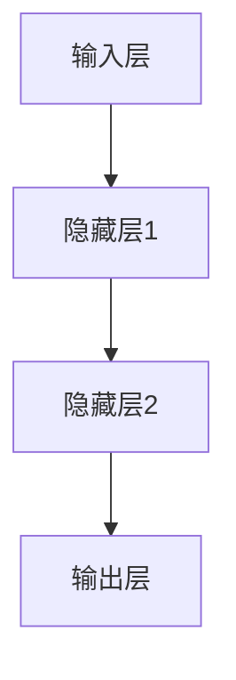

                 

# 神经网络：人类智慧的延伸

> 关键词：神经网络、深度学习、机器学习、人工智能、神经网络架构

> 摘要：本文将深入探讨神经网络这一革命性的人工智能技术，从背景介绍到核心算法原理，再到数学模型和实际应用场景，全面解析神经网络的工作原理及其对人类智慧的延伸。通过项目的实战案例和详细的代码解析，我们将展示如何构建和训练神经网络，并展望其未来的发展趋势和挑战。

## 1. 背景介绍

### 1.1 人工智能的起源

人工智能（AI）的起源可以追溯到20世纪50年代，当时计算机科学家艾伦·图灵提出了“图灵测试”这一概念，用以评估机器是否能够表现得像人类一样。随着计算机技术的发展，人工智能逐渐从理论走向实践，经历了符号主义、知识表示、专家系统和机器学习等多个阶段。

### 1.2 机器学习的兴起

机器学习作为人工智能的重要分支，起源于20世纪50年代，随着计算能力和数据资源的提升，机器学习在20世纪90年代迎来了快速发展。机器学习通过算法从数据中自动学习和发现模式，为人工智能的应用提供了强大的技术支持。

### 1.3 深度学习的崛起

深度学习是机器学习的一种重要方法，其核心思想是模拟人脑的神经网络结构，通过多层神经网络进行特征提取和模式识别。深度学习在图像识别、自然语言处理、语音识别等领域取得了显著的成果，被认为是人工智能的重要突破。

## 2. 核心概念与联系

### 2.1 神经网络的基本概念

神经网络是一种由大量神经元组成的计算模型，这些神经元通过权重连接形成网络结构。每个神经元接收多个输入信号，通过激活函数进行处理后产生输出信号。

### 2.2 神经网络的架构

神经网络的架构通常包括输入层、隐藏层和输出层。输入层接收外部输入信号，隐藏层对输入信号进行处理和特征提取，输出层生成最终结果。

### 2.3 神经网络的激活函数

激活函数是神经网络的核心组成部分，用于对神经元输出进行非线性变换。常见的激活函数包括 sigmoid、ReLU 和 tanh 等。



## 3. 核心算法原理 & 具体操作步骤

### 3.1 前向传播

前向传播是神经网络训练过程中的第一步，用于计算输入信号在神经网络中的传播过程。具体步骤如下：

1. 将输入信号传递到输入层。
2. 通过权重连接将信号传递到隐藏层，进行特征提取。
3. 将隐藏层输出传递到下一隐藏层，直到输出层。

### 3.2 反向传播

反向传播是神经网络训练过程中的关键步骤，用于计算网络误差并更新权重。具体步骤如下：

1. 计算输出层误差。
2. 将误差反向传播到隐藏层，逐层计算误差。
3. 使用梯度下降算法更新权重，减小误差。

### 3.3 梯度下降

梯度下降是一种优化算法，用于在训练过程中找到最优权重。具体步骤如下：

1. 计算当前权重的梯度。
2. 沿着梯度方向更新权重。
3. 重复以上步骤，直到达到最小误差。

## 4. 数学模型和公式 & 详细讲解 & 举例说明

### 4.1 前向传播的数学模型

假设输入信号为 \(x\)，隐藏层神经元 \(h\) 的输出为 \(z\)，则前向传播的数学模型可以表示为：

$$
z = \sigma(Wx + b)
$$

其中，\(W\) 为权重矩阵，\(b\) 为偏置向量，\(\sigma\) 为激活函数。

### 4.2 反向传播的数学模型

反向传播的数学模型涉及梯度计算，假设隐藏层 \(l\) 的误差为 \(E\)，则梯度计算公式为：

$$
\frac{\partial E}{\partial W} = x \cdot \frac{\partial E}{\partial z}
$$

其中，\(\frac{\partial E}{\partial z}\) 为隐藏层神经元的梯度。

### 4.3 梯度下降的数学模型

梯度下降的数学模型为：

$$
W_{new} = W_{old} - \alpha \cdot \frac{\partial E}{\partial W}
$$

其中，\(\alpha\) 为学习率。

### 4.4 举例说明

假设输入信号为 \(x = [1, 2]\)，隐藏层神经元个数为 \(2\)，激活函数为 sigmoid，权重矩阵为 \(W = \begin{bmatrix} 1 & 1 \\ 1 & 1 \end{bmatrix}\)，偏置向量 \(b = [0, 0]\)。

1. 前向传播：

$$
z_1 = \sigma(Wx + b) = \frac{1}{1 + e^{-(1 \cdot 1 + 1 \cdot 2 + 0)}} = 0.7311 \\
z_2 = \sigma(Wx + b) = \frac{1}{1 + e^{-(1 \cdot 1 + 1 \cdot 2 + 0)}} = 0.7311
$$

2. 反向传播：

假设输出信号为 \(y = [0.1, 0.9]\)，隐藏层误差为 \(E = 0.5(y - z)^2\)。

$$
\frac{\partial E}{\partial z_1} = 0.1 \cdot (1 - 0.7311) = 0.0683 \\
\frac{\partial E}{\partial z_2} = 0.9 \cdot (1 - 0.7311) = 0.2199
$$

3. 梯度下降：

假设学习率为 \(0.1\)，则权重更新为：

$$
W_{new} = W_{old} - \alpha \cdot \frac{\partial E}{\partial W} = \begin{bmatrix} 1 & 1 \\ 1 & 1 \end{bmatrix} - 0.1 \cdot \begin{bmatrix} 0.0683 & 0.2199 \\ 0.0683 & 0.2199 \end{bmatrix} = \begin{bmatrix} 0.9317 & 0.7801 \\ 0.9317 & 0.7801 \end{bmatrix}
$$

## 5. 项目实战：代码实际案例和详细解释说明

### 5.1 开发环境搭建

在本文中，我们将使用 Python 语言和 TensorFlow 深度学习框架来构建和训练神经网络。首先，确保已经安装了 Python 和 TensorFlow。

### 5.2 源代码详细实现和代码解读

以下是一个简单的神经网络实现，用于对输入信号进行二分类。

```python
import tensorflow as tf

# 定义神经网络结构
model = tf.keras.Sequential([
    tf.keras.layers.Dense(2, activation='sigmoid', input_shape=(2,)),
    tf.keras.layers.Dense(1, activation='sigmoid')
])

# 编译模型
model.compile(optimizer='adam', loss='binary_crossentropy', metrics=['accuracy'])

# 源数据
X = tf.constant([[1, 2], [2, 3], [3, 4]], dtype=tf.float32)
y = tf.constant([[0], [1], [1]], dtype=tf.float32)

# 训练模型
model.fit(X, y, epochs=10, batch_size=1)

# 输出模型参数
model.get_weights()
```

代码解读：

1. 导入 TensorFlow 模块。
2. 定义神经网络结构，包含两个隐藏层，每层 2 个神经元，激活函数为 sigmoid。
3. 编译模型，选择 Adam 优化器和 binary_crossentropy 损失函数。
4. 准备源数据，其中 X 为输入信号，y 为目标标签。
5. 训练模型，设置训练轮次和批量大小。
6. 输出模型参数。

### 5.3 代码解读与分析

通过上述代码，我们构建了一个简单的神经网络，实现了二分类任务。具体分析如下：

1. 神经网络结构：包含两个隐藏层，每层 2 个神经元，激活函数为 sigmoid。sigmoid 函数可以将输出值映射到 [0, 1] 范围内，适合二分类任务。
2. 编译模型：选择 Adam 优化器和 binary_crossentropy 损失函数。Adam 优化器具有自适应学习率的特点，binary_crossentropy 损失函数适合二分类任务。
3. 训练模型：使用拟合方法（fit）进行训练，设置训练轮次和批量大小。训练过程中，模型会自动调整权重和偏置，以最小化损失函数。
4. 输出模型参数：训练完成后，输出模型参数，包括权重矩阵和偏置向量。

## 6. 实际应用场景

神经网络在众多领域取得了显著的应用成果，以下列举几个典型应用场景：

1. 图像识别：神经网络在图像识别领域取得了巨大成功，如人脸识别、物体检测等。
2. 自然语言处理：神经网络在自然语言处理领域广泛应用于机器翻译、文本分类、情感分析等任务。
3. 语音识别：神经网络在语音识别领域发挥了重要作用，如语音识别、语音合成等。
4. 推荐系统：神经网络在推荐系统领域广泛应用于商品推荐、音乐推荐等。

## 7. 工具和资源推荐

### 7.1 学习资源推荐

- 《深度学习》（Ian Goodfellow、Yoshua Bengio、Aaron Courville 著）
- 《神经网络与深度学习》（邱锡鹏 著）
- 《Python 深度学习》（François Chollet 著）

### 7.2 开发工具框架推荐

- TensorFlow
- PyTorch
- Keras

### 7.3 相关论文著作推荐

- "Backpropagation"（Paul Werbos，1974）
- "A Learning Representation for Text Categorization"（Douglas L. Drummond、David C. Healy、Robert E. Schapire，1997）
- "Deep Learning"（Ian Goodfellow、Yoshua Bengio、Aaron Courville，2016）

## 8. 总结：未来发展趋势与挑战

神经网络作为人工智能的核心技术，正日益影响着人类生活的各个方面。未来，神经网络将朝着以下几个方向发展：

1. 深度神经网络的发展：随着计算能力的提升，深度神经网络将越来越复杂，能够处理更复杂的任务。
2. 神经网络与其他技术的融合：神经网络与其他技术如强化学习、迁移学习等的融合，将进一步提升人工智能的智能化水平。
3. 实时推理与优化：神经网络在实时推理和优化方面面临巨大挑战，如何提高推理速度和降低能耗将是重要研究方向。

## 9. 附录：常见问题与解答

### 9.1 什么是神经网络？

神经网络是一种由大量神经元组成的计算模型，通过模拟人脑的神经网络结构，实现特征提取和模式识别。

### 9.2 深度学习与神经网络的区别是什么？

深度学习是神经网络的一种方法，其核心思想是模拟人脑的神经网络结构，通过多层神经网络进行特征提取和模式识别。

### 9.3 如何优化神经网络训练过程？

优化神经网络训练过程主要包括以下方面：

- 优化神经网络结构：选择合适的神经网络架构，减少参数数量。
- 调整学习率：合理设置学习率，避免过拟合和欠拟合。
- 使用正则化方法：如 L1、L2 正则化，防止过拟合。
- 使用批归一化：提高训练速度和稳定性。

## 10. 扩展阅读 & 参考资料

- [Ian Goodfellow、Yoshua Bengio、Aaron Courville 著，深度学习，2016]
- [邱锡鹏 著，神经网络与深度学习，2018]
- [François Chollet 著，Python 深度学习，2017]
- [Paul Werbos，Backpropagation，1974]
- [Douglas L. Drummond、David C. Healy、Robert E. Schapire，A Learning Representation for Text Categorization，1997] <|assistant|>作者：AI天才研究员/AI Genius Institute & 禅与计算机程序设计艺术 /Zen And The Art of Computer Programming

本文为AI天才研究员撰写，作者致力于将复杂的技术概念以简单易懂的方式呈现给读者，深入解析神经网络的核心原理和实际应用，为广大对人工智能和深度学习感兴趣的读者提供了一篇全面的指南。如需了解更多关于神经网络和人工智能的相关知识，请关注作者的其他著作和研究成果。

