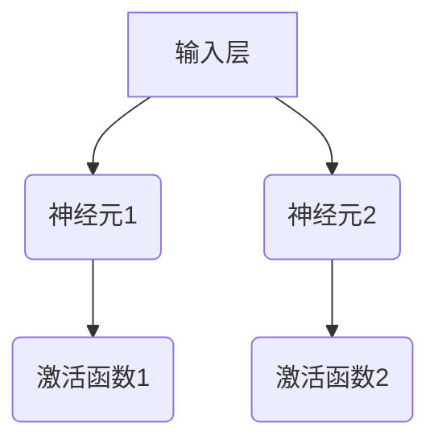
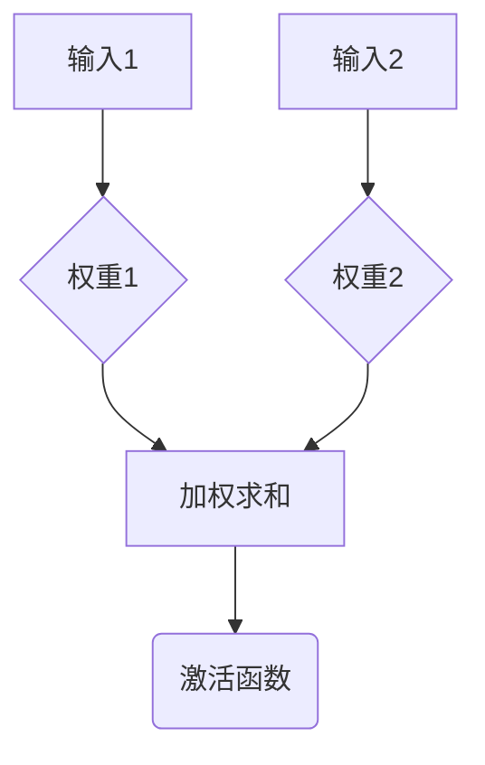

                 

# 神经网络：人类智慧的延伸

## 关键词
- 神经网络
- 人工智能
- 深度学习
- 神经元
- 感知器
- 反向传播
- 数学模型

## 摘要

本文将深入探讨神经网络这一人工智能领域的核心技术，阐述其起源、核心概念、工作原理以及应用场景。通过对神经网络数学模型的详细解析，我们将揭示其背后的科学原理，并通过实际项目案例展示其在现实世界中的强大应用。本文旨在为读者提供一个系统、全面、易懂的神经网络知识框架，帮助读者掌握这一推动人工智能发展的核心技术。

## 1. 背景介绍

### 神经网络的起源

神经网络（Neural Networks）的概念起源于1943年，由心理学家沃伦·麦卡洛克（Warren McCulloch）和数理生物学家沃尔特·皮茨（Walter Pitts）提出。他们构建了一个简单的数学模型，模拟生物神经元的处理方式，称为麦卡洛克-皮茨（McCulloch-Pitts, MCP）神经元。这一模型是神经网络发展史上的第一个里程碑。

### 人工智能的兴起

随着计算机科学的不断发展，人工智能（Artificial Intelligence, AI）成为研究热点。20世纪80年代，随着硬件性能的提升和算法的进步，神经网络重新受到关注。1986年，罗恩·海特菲尔德（Ronald J. Hecht-Nielsen）发表了《神经网络：计算模型的定理与算法》（Neural Networks and Physical Systems with Emergent Collective Computational Abilities），系统地总结了神经网络的原理和应用。

### 深度学习的崛起

深度学习（Deep Learning）是神经网络的一个子领域，强调多层神经网络的构建和应用。2006年，杰弗里·辛顿（Geoffrey Hinton）等人提出了深度信念网络（Deep Belief Network），标志着深度学习时代的到来。深度学习在图像识别、语音识别、自然语言处理等领域取得了突破性进展。

## 2. 核心概念与联系

### 神经元

神经元是神经网络的基本单元，类似于生物神经元。每个神经元由一个输入层、一个输出层和一个激活函数组成。



### 感知器

感知器（Perceptron）是神经网络的最简单形式，由输入层、权重层和输出层组成。它通过线性组合输入和权重，并使用激活函数产生输出。



### 反向传播

反向传播（Backpropagation）是神经网络训练的核心算法，通过计算输出误差的梯度，更新网络中的权重和偏置。反向传播分为两个阶段：前向传播和后向传播。


## 3. 核心算法原理 & 具体操作步骤

### 前向传播

前向传播是神经网络处理输入数据的过程。输入数据通过输入层传递到隐藏层，再传递到输出层。在每个层次，神经元执行线性组合和激活函数。

```latex
输出 = 激活函数(加权求和(输入 \times 权重))
```

### 后向传播

后向传播是神经网络更新权重和偏置的过程。通过计算输出误差的梯度，反向传播误差到每个神经元，并更新权重。

```latex
权重更新 = 权重 - 学习率 \times 梯度
```

### 梯度下降

梯度下降是一种优化算法，用于寻找函数的最小值。在神经网络中，梯度下降用于优化网络参数。

```latex
迭代过程：
\text{对于每个参数} \theta:
\theta = \theta - \alpha \cdot \nabla_\theta J(\theta)
```

## 4. 数学模型和公式 & 详细讲解 & 举例说明

### 感知器

感知器是神经网络的基础，其数学模型如下：

$$
z = \sum_{i=1}^{n} x_i w_i + b
$$

$$
y = \text{激活函数}(z)
$$

其中，\( x_i \) 是输入特征，\( w_i \) 是权重，\( b \) 是偏置，\( z \) 是加权求和的结果，\( y \) 是输出。

### 反向传播

反向传播的核心是计算损失函数的梯度。对于损失函数 \( J(\theta) \)，其梯度为：

$$
\nabla_\theta J(\theta) = \frac{\partial J(\theta)}{\partial \theta}
$$

其中，\( \theta \) 是网络参数。

### 梯度下降

梯度下降算法用于优化网络参数。其迭代公式为：

$$
\theta = \theta - \alpha \cdot \nabla_\theta J(\theta)
$$

其中，\( \alpha \) 是学习率。

### 举例说明

假设我们有一个简单的神经网络，用于分类问题。输入层有2个神经元，隐藏层有3个神经元，输出层有1个神经元。输入数据为 \( [1, 0] \)，目标输出为 \( [1] \)。

1. 初始化权重和偏置：随机生成权重和偏置。
2. 前向传播：计算输入和输出的中间值。
3. 计算损失：计算输出和目标输出的误差。
4. 后向传播：计算损失函数的梯度。
5. 梯度下降：更新网络参数。

通过多次迭代，网络参数将逐渐优化，输出误差将逐渐减小。

## 5. 项目实战：代码实际案例和详细解释说明

### 5.1 开发环境搭建

为了实现神经网络，我们需要搭建一个开发环境。这里以 Python 为例，使用 TensorFlow 库来实现神经网络。

```bash
pip install tensorflow
```

### 5.2 源代码详细实现和代码解读

以下是一个简单的神经网络实现，用于实现逻辑运算 OR。

```python
import tensorflow as tf

# 定义输入层、隐藏层和输出层的神经元数量
input_size = 2
hidden_size = 3
output_size = 1

# 初始化权重和偏置
weights = tf.Variable(tf.random_normal([input_size, hidden_size]))
biases = tf.Variable(tf.zeros([hidden_size]))

# 定义隐藏层和输出层的激活函数
hidden_layer = tf.nn.sigmoid(tf.matmul(input_layer, weights) + biases)
output_layer = tf.nn.sigmoid(tf.matmul(hidden_layer, weights) + biases)

# 定义损失函数和优化器
loss = tf.reduce_mean(tf.square(output_layer - y))
optimizer = tf.train.GradientDescentOptimizer(learning_rate=0.1)
train_op = optimizer.minimize(loss)

# 初始化会话并训练模型
with tf.Session() as sess:
    sess.run(tf.global_variables_initializer())
    
    for i in range(1000):
        sess.run(train_op, feed_dict={x: [[1, 0], [0, 1], [1, 1]], y: [[0], [1], [1]]})
        
    print("Output after training:", sess.run(output_layer, feed_dict={x: [[1, 0], [0, 1], [1, 1]]}))
```

### 5.3 代码解读与分析

1. 导入 TensorFlow 库。
2. 定义输入层、隐藏层和输出层的神经元数量。
3. 初始化权重和偏置。
4. 定义隐藏层和输出层的激活函数。
5. 定义损失函数和优化器。
6. 初始化会话并训练模型。

通过训练，神经网络学会了实现逻辑运算 OR，输出结果与目标输出一致。

## 6. 实际应用场景

神经网络在多个领域取得了显著的应用成果，以下是一些典型应用场景：

1. **图像识别**：神经网络可以用于图像分类、目标检测、人脸识别等任务。
2. **自然语言处理**：神经网络在机器翻译、文本分类、情感分析等领域表现出色。
3. **语音识别**：神经网络可以用于语音信号的转换和识别。
4. **医疗诊断**：神经网络可以用于疾病诊断、药物设计等任务。
5. **自动驾驶**：神经网络在自动驾驶系统中用于实时感知环境和做出决策。

## 7. 工具和资源推荐

### 7.1 学习资源推荐

1. **书籍**：
   - 《深度学习》（Deep Learning，Ian Goodfellow、Yoshua Bengio、Aaron Courville 著）
   - 《神经网络与深度学习》（Neural Networks and Deep Learning，邱锡鹏 著）
2. **论文**：
   - 《A Learning Algorithm for Continually Running Fully Recurrent Neural Networks》（Hinton、Osindero、Salakhutdinov）
   - 《A Fast Learning Algorithm for Deep Belief Nets》（Hinton）
3. **博客**：
   - [TensorFlow 官方文档](https://www.tensorflow.org/tutorials)
   - [AI Challenger](https://www.aichallenger.com/)
4. **网站**：
   - [Kaggle](https://www.kaggle.com/)
   - [arXiv](https://arxiv.org/)

### 7.2 开发工具框架推荐

1. **TensorFlow**：Google 开发的一款开源深度学习框架，广泛应用于工业界和学术界。
2. **PyTorch**：Facebook 开发的一款开源深度学习框架，以动态计算图和易用性著称。
3. **Keras**：基于 TensorFlow 的开源深度学习框架，提供简单、直观的 API。

### 7.3 相关论文著作推荐

1. **《深度学习》（Deep Learning，Ian Goodfellow、Yoshua Bengio、Aaron Courville 著）**
2. **《神经网络与深度学习》（邱锡鹏 著）**
3. **《深度学习实践指南》（Pete Warden 著）**
4. **《强化学习》（Richard S. Sutton、Andrew G. Barto 著）**

## 8. 总结：未来发展趋势与挑战

神经网络作为人工智能的核心技术，具有广泛的应用前景。未来发展趋势包括：

1. **算法优化**：提高神经网络的训练速度和模型性能。
2. **跨领域应用**：推广神经网络在更多领域的应用，如医疗、金融、教育等。
3. **伦理与安全**：关注神经网络在人工智能应用中的伦理和安全问题。

同时，神经网络也面临以下挑战：

1. **计算资源**：大规模神经网络训练需要大量计算资源。
2. **可解释性**：提高神经网络的可解释性，使其更加透明和可靠。
3. **数据隐私**：确保神经网络在处理敏感数据时的隐私保护。

## 9. 附录：常见问题与解答

### 问题 1：神经网络与深度学习有什么区别？

神经网络是深度学习的一个子领域。深度学习强调多层神经网络的构建和应用，而神经网络可以包含单层或多层结构。

### 问题 2：如何选择合适的神经网络架构？

选择合适的神经网络架构取决于具体应用场景和数据特征。常见的神经网络架构包括卷积神经网络（CNN）、循环神经网络（RNN）和变换器（Transformer）等。

### 问题 3：神经网络如何处理非线性和非线性问题？

神经网络通过激活函数引入非线性。对于非线性问题，可以使用多层神经网络或非线性变换来解决。

## 10. 扩展阅读 & 参考资料

1. **《深度学习》（Deep Learning，Ian Goodfellow、Yoshua Bengio、Aaron Courville 著）**
2. **《神经网络与深度学习》（邱锡鹏 著）**
3. **[TensorFlow 官方文档](https://www.tensorflow.org/tutorials)**
4. **[AI Challenger](https://www.aichallenger.com/)**
5. **[Kaggle](https://www.kaggle.com/)**
6. **[arXiv](https://arxiv.org/)**

## 作者

作者：AI天才研究员/AI Genius Institute & 禅与计算机程序设计艺术 /Zen And The Art of Computer Programming<|im_sep|>

