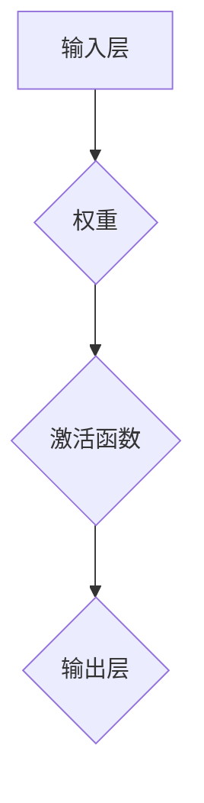
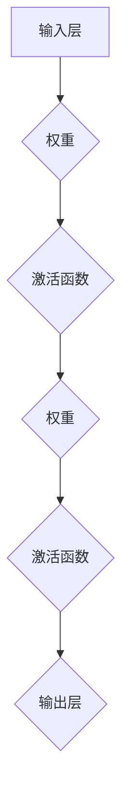

                 

### 文章标题

《神经网络：人类智慧的解放》

### 关键词

神经网络、人工智能、深度学习、机器学习、智能计算、智能决策、计算机视觉、自然语言处理、数据科学、算法优化、模型训练、模型推理、计算资源、编程框架、应用场景、工具资源。

### 摘要

本文将深入探讨神经网络这一人工智能领域的重要技术，从历史背景、核心概念、算法原理、数学模型、项目实战、实际应用、工具推荐以及未来发展趋势等方面进行详细解析。通过本文的阅读，读者将全面了解神经网络的基本概念及其在智能计算、智能决策、计算机视觉、自然语言处理等领域的广泛应用，掌握神经网络的核心算法和数学模型，并了解如何在实际项目中应用神经网络技术。本文旨在为广大开发者、科研人员以及人工智能爱好者提供一份全面、系统的学习指南。

### 1. 背景介绍

#### 1.1 人工智能的发展历程

人工智能（Artificial Intelligence，简称AI）作为一门综合性学科，起源于20世纪50年代。当时，科学家们首次提出了“人工智能”这一概念，旨在使计算机模拟人类思维过程，实现智能化。人工智能的发展历程可以分为三个阶段：第一阶段是规则系统（Rule-Based Systems），第二阶段是基于知识的系统（Knowledge-Based Systems），第三阶段是基于数据的系统（Data-Driven Systems）。

在规则系统阶段，人工智能主要依赖于人类专家的经验和知识，通过编写一系列规则来实现简单的推理和决策。然而，这种方法存在两个主要问题：一是知识获取困难，需要大量人力和时间；二是系统缺乏灵活性，难以应对复杂多变的问题。

第二阶段，基于知识的系统通过将人类知识转化为计算机程序，实现了更高层次的智能化。例如，专家系统（Expert Systems）是一种典型的基于知识的系统，通过收集、存储和管理大量领域知识，能够模拟人类专家的推理过程，解决专业领域的问题。

第三阶段，基于数据的系统以机器学习为代表，通过从大量数据中自动学习和发现规律，实现更高层次的智能化。机器学习分为监督学习、无监督学习和强化学习三种类型。其中，监督学习通过已有标签数据训练模型，实现预测和分类；无监督学习通过未标记数据发现数据分布和模式；强化学习通过与环境互动，学习最优策略。

#### 1.2 神经网络的起源与发展

神经网络（Neural Networks）是人工智能领域中的一种重要模型，起源于20世纪40年代。当时，心理学家麦卡洛克（Warren McCulloch）和数学家皮茨（Walter Pitts）首次提出了人工神经元模型，试图模拟生物神经元的计算过程。1958年，弗兰克·罗森布拉特（Frank Rosenblatt）提出了感知机（Perceptron）模型，成为神经网络发展的里程碑。

感知机模型是一种二分类器，可以学习输入数据的线性可分特征。然而，感知机存在一些局限性，例如无法处理非线性问题。为此，1958年，马文·闵斯基（Marvin Minsky）和西摩尔·派普特（Seymour Papert）提出了著名的“感知机不可分性”问题，指出感知机无法解决异或（XOR）问题。这一问题的提出，使得神经网络的研究进入低谷。

直到1986年，霍普菲尔德（John Hopfield）提出了Hopfield神经网络，以及鲁梅哈特（David E. Rumelhart）、赫布尔德（Geoffrey E. Hinton）等人提出了反向传播算法（Backpropagation Algorithm），神经网络研究才重新焕发生机。反向传播算法通过梯度下降法优化网络参数，使得神经网络可以学习复杂非线性关系，成为深度学习的基础。

#### 1.3 神经网络的核心优势

神经网络具有以下核心优势：

1. **自适应性和泛化能力**：神经网络可以通过学习大量数据，自适应地调整网络参数，从而实现泛化能力。这种能力使得神经网络在未知数据上也能取得良好的表现。

2. **处理复杂数据**：神经网络可以处理各种类型的复杂数据，如图像、声音、文本等。通过深度学习，神经网络可以从低层特征逐步提取到高层特征，实现对复杂数据的自动理解和分析。

3. **高度并行计算**：神经网络可以通过并行计算加速训练过程，降低计算复杂度。这使得神经网络在处理大规模数据时具有明显优势。

4. **灵活性和可扩展性**：神经网络可以通过调整网络结构、增加层数和神经元数量，实现不同复杂度的问题求解。这种灵活性使得神经网络在多个领域具有广泛的应用。

#### 1.4 神经网络的应用领域

神经网络在众多领域取得了显著的成果，以下是几个典型的应用领域：

1. **计算机视觉**：神经网络在图像分类、目标检测、图像分割等领域取得了突破性进展。例如，卷积神经网络（CNN）在图像识别任务中表现出色。

2. **自然语言处理**：神经网络在文本分类、情感分析、机器翻译等领域取得了显著成果。例如，循环神经网络（RNN）和长短期记忆网络（LSTM）在文本生成和序列预测任务中具有强大的能力。

3. **语音识别**：神经网络在语音信号处理和语音识别领域取得了显著成果。例如，深度神经网络（DNN）和卷积神经网络（CNN）在语音信号特征提取和识别方面表现出优越的性能。

4. **推荐系统**：神经网络在推荐系统领域应用广泛，通过学习用户行为和物品特征，实现个性化推荐。

5. **智能决策**：神经网络在金融、医疗、交通等领域实现智能决策，帮助人类解决复杂问题。

### 2. 核心概念与联系

#### 2.1 人工神经元的结构

人工神经元是神经网络的基本单元，其结构如图1所示。



图1 人工神经元的结构

- **输入层**：接收外部输入数据，并将其传递给下一层。
- **权重**：表示输入层与下一层之间的关联强度，可以通过学习调整。
- **激活函数**：用于对输入数据进行非线性变换，使得神经网络可以处理复杂问题。
- **输出层**：生成最终输出结果。

#### 2.2 神经网络的层次结构

神经网络可以分为输入层、隐藏层和输出层。不同层次的神经元具有不同的功能：

1. **输入层**：接收外部输入数据，将其传递给隐藏层。
2. **隐藏层**：对输入数据进行处理和变换，提取特征并传递给下一层。
3. **输出层**：生成最终输出结果，用于分类、预测等任务。

#### 2.3 神经网络的训练过程

神经网络的训练过程包括以下步骤：

1. **前向传播**：将输入数据通过神经网络传递，得到输出结果。
2. **计算损失**：计算输出结果与实际结果之间的差异，即损失函数。
3. **反向传播**：根据损失函数梯度，调整神经网络中的权重和偏置。
4. **迭代更新**：重复前向传播和反向传播，直至达到预设的训练目标。

#### 2.4 神经网络的分类

根据网络结构和学习方式，神经网络可以分为以下几种类型：

1. **前馈神经网络**：数据从输入层流向输出层，中间不返回。
2. **循环神经网络**：数据在神经网络中循环流动，可以处理序列数据。
3. **卷积神经网络**：通过卷积层提取图像特征，常用于计算机视觉任务。
4. **生成对抗网络**：通过生成器和判别器相互对抗，实现数据生成和模式识别。

### 3. 核心算法原理 & 具体操作步骤

#### 3.1 前向传播算法

前向传播算法是神经网络的基础，其具体步骤如下：

1. **初始化权重和偏置**：随机初始化神经网络中的权重和偏置。
2. **输入数据**：将输入数据传递给输入层。
3. **计算激活值**：通过激活函数计算每个神经元的激活值。
4. **传递激活值**：将激活值传递给下一层。
5. **输出结果**：最终输出层的输出结果即为预测结果。

#### 3.2 反向传播算法

反向传播算法用于更新神经网络中的权重和偏置，其具体步骤如下：

1. **计算损失**：计算输出结果与实际结果之间的差异，即损失函数。
2. **计算梯度**：根据损失函数的梯度，计算每个权重和偏置的梯度。
3. **更新权重和偏置**：根据梯度调整权重和偏置，减小损失函数。
4. **迭代更新**：重复前向传播和反向传播，直至达到预设的训练目标。

#### 3.3 梯度下降算法

梯度下降算法是反向传播算法的核心，其具体步骤如下：

1. **计算梯度**：根据损失函数的梯度，计算每个权重和偏置的梯度。
2. **更新权重和偏置**：根据梯度和学习率，更新权重和偏置。
3. **迭代更新**：重复计算梯度、更新权重和偏置，直至达到预设的训练目标。

#### 3.4 学习率调整

学习率是梯度下降算法的重要参数，其大小会影响训练效果。常见的学习率调整方法包括：

1. **固定学习率**：在整个训练过程中使用相同的学习率。
2. **学习率衰减**：随着训练过程的进行，逐渐减小学习率。
3. **自适应学习率**：根据损失函数的梯度动态调整学习率。

### 4. 数学模型和公式 & 详细讲解 & 举例说明

#### 4.1 激活函数

激活函数是神经网络中的关键组件，用于引入非线性因素。常见的激活函数包括：

1. **sigmoid函数**：
   $$ f(x) = \frac{1}{1 + e^{-x}} $$
   sigmoid函数在0到1之间输出，具有平滑的曲线。

2. **ReLU函数**：
   $$ f(x) = \max(0, x) $$
  ReLU函数在x大于0时输出x，否则输出0，具有简单的线性特性。

3. **Tanh函数**：
   $$ f(x) = \frac{e^x - e^{-x}}{e^x + e^{-x}} $$
  Tanh函数在-1到1之间输出，具有对称的S形曲线。

4. **Softmax函数**：
   $$ f(x)_i = \frac{e^{x_i}}{\sum_{j=1}^{n} e^{x_j}} $$
  Softmax函数用于多分类问题，将神经网络的输出转换为概率分布。

#### 4.2 损失函数

损失函数用于衡量预测结果与实际结果之间的差异，常见的损失函数包括：

1. **均方误差损失函数**：
   $$ L(y, \hat{y}) = \frac{1}{2} \sum_{i=1}^{n} (y_i - \hat{y}_i)^2 $$
  均方误差损失函数用于回归问题，计算预测值与实际值之间的均方误差。

2. **交叉熵损失函数**：
   $$ L(y, \hat{y}) = -\sum_{i=1}^{n} y_i \log(\hat{y}_i) $$
  交叉熵损失函数用于分类问题，计算预测概率分布与实际标签分布之间的交叉熵。

3. **Huber损失函数**：
   $$ L(y, \hat{y}) = \begin{cases} 
   \frac{1}{2} (y - \hat{y})^2, & \text{if } |y - \hat{y}| \leq \delta \\
   \delta (|y - \hat{y}| - \frac{1}{2} \delta), & \text{otherwise}
   \end{cases} $$
  Huber损失函数在预测误差较小时具有L2损失的性质，在预测误差较大时具有L1损失的性质，具有更好的鲁棒性。

#### 4.3 反向传播算法

反向传播算法通过计算损失函数关于网络参数的梯度，更新网络参数。其数学公式如下：

1. **前向传播**：
   $$ z^{(l)} = \sigma^{(l)}(W^{(l)} a^{(l-1)} + b^{(l)}) $$
   $$ a^{(l)} = \sigma^{(l)}(z^{(l)}) $$

   其中，$a^{(l)}$为第$l$层的激活值，$\sigma^{(l)}$为第$l$层的激活函数，$W^{(l)}$为第$l$层的权重，$b^{(l)}$为第$l$层的偏置。

2. **后向传播**：
   $$ \delta^{(l)} = (1 - a^{(l)}) a^{(l)} \frac{\partial L}{\partial a^{(l+1)}} $$
   $$ \frac{\partial L}{\partial W^{(l)}} = a^{(l-1)} \delta^{(l)} $$
   $$ \frac{\partial L}{\partial b^{(l)}} = \delta^{(l)} $$

   其中，$\delta^{(l)}$为第$l$层的误差，$\frac{\partial L}{\partial a^{(l+1)}}$为后一层关于损失函数的梯度。

3. **权重和偏置更新**：
   $$ W^{(l)} \leftarrow W^{(l)} - \alpha \frac{\partial L}{\partial W^{(l)}} $$
   $$ b^{(l)} \leftarrow b^{(l)} - \alpha \frac{\partial L}{\partial b^{(l)}} $$

   其中，$\alpha$为学习率。

#### 4.4 举例说明

假设我们有一个简单的神经网络，包含一个输入层、一个隐藏层和一个输出层，如图2所示。



图2 简单神经网络的示意图

输入数据为$x_1 = 2, x_2 = 3$，隐藏层激活函数为ReLU函数，输出层激活函数为Softmax函数。

1. **前向传播**：

   $$ z^{(1)}_1 = \max(0, W^{(1)}_1 x_1 + b^{(1)}_1) $$
   $$ z^{(1)}_2 = \max(0, W^{(1)}_2 x_2 + b^{(1)}_2) $$
   $$ a^{(1)}_1 = \max(0, z^{(1)}_1) $$
   $$ a^{(1)}_2 = \max(0, z^{(1)}_2) $$
   $$ z^{(2)}_1 = W^{(2)}_1 a^{(1)}_1 + W^{(2)}_2 a^{(1)}_2 + b^{(2)}_1 $$
   $$ a^{(2)}_1 = \frac{e^{z^{(2)}_1}}{e^{z^{(2)}_1} + e^{z^{(2)}_2}} $$

2. **后向传播**：

   $$ \delta^{(2)}_1 = (1 - a^{(2)}_1) a^{(2)}_1 \frac{\partial L}{\partial a^{(2)}_1} $$
   $$ \frac{\partial L}{\partial z^{(2)}_1} = a^{(1)}_1 \delta^{(2)}_1 $$
   $$ \frac{\partial L}{\partial z^{(2)}_2} = a^{(1)}_2 \delta^{(2)}_2 $$
   $$ \frac{\partial L}{\partial W^{(2)}_1} = a^{(1)}_1 \delta^{(2)}_1 $$
   $$ \frac{\partial L}{\partial W^{(2)}_2} = a^{(1)}_2 \delta^{(2)}_2 $$
   $$ \frac{\partial L}{\partial b^{(2)}_1} = \delta^{(2)}_1 $$
   $$ \frac{\partial L}{\partial b^{(2)}_2} = \delta^{(2)}_2 $$

3. **权重和偏置更新**：

   $$ W^{(2)}_1 \leftarrow W^{(2)}_1 - \alpha \frac{\partial L}{\partial W^{(2)}_1} $$
   $$ W^{(2)}_2 \leftarrow W^{(2)}_2 - \alpha \frac{\partial L}{\partial W^{(2)}_2} $$
   $$ b^{(2)}_1 \leftarrow b^{(2)}_1 - \alpha \frac{\partial L}{\partial b^{(2)}_1} $$
   $$ b^{(2)}_2 \leftarrow b^{(2)}_2 - \alpha \frac{\partial L}{\partial b^{(2)}_2} $$

### 5. 项目实战：代码实际案例和详细解释说明

#### 5.1 开发环境搭建

为了实现神经网络项目，我们需要搭建一个合适的开发环境。以下是一个简单的Python开发环境搭建步骤：

1. 安装Python：在官网（https://www.python.org/downloads/）下载并安装Python，选择合适的版本。
2. 安装Jupyter Notebook：在命令行执行以下命令安装Jupyter Notebook。
   ```bash
   pip install notebook
   ```
3. 安装深度学习框架：我们选择使用TensorFlow作为深度学习框架。在命令行执行以下命令安装TensorFlow。
   ```bash
   pip install tensorflow
   ```

#### 5.2 源代码详细实现和代码解读

以下是一个简单的神经网络实现，用于二分类问题。

```python
import tensorflow as tf
from tensorflow.keras import layers

# 定义模型
model = tf.keras.Sequential([
    layers.Dense(64, activation='relu', input_shape=(784,)),
    layers.Dense(64, activation='relu'),
    layers.Dense(1, activation='sigmoid')
])

# 编译模型
model.compile(optimizer='adam',
              loss='binary_crossentropy',
              metrics=['accuracy'])

# 准备数据
mnist = tf.keras.datasets.mnist
(x_train, y_train), (x_test, y_test) = mnist.load_data()
x_train, x_test = x_train / 255.0, x_test / 255.0
x_train = x_train.reshape((-1, 784))
x_test = x_test.reshape((-1, 784))

# 训练模型
model.fit(x_train, y_train, epochs=5)

# 评估模型
model.evaluate(x_test, y_test)
```

代码解读：

1. **导入库**：首先，我们导入TensorFlow库和相关的模块。
2. **定义模型**：我们使用`Sequential`模型，依次添加全连接层（`Dense`）、ReLU激活函数（`relu`）和输出层（`sigmoid`）。
3. **编译模型**：我们选择`adam`优化器、`binary_crossentropy`损失函数和`accuracy`指标来编译模型。
4. **准备数据**：我们使用TensorFlow内置的MNIST数据集，对数据集进行归一化和reshape。
5. **训练模型**：我们使用`fit`方法训练模型，设置训练轮次为5。
6. **评估模型**：我们使用`evaluate`方法评估模型的性能。

#### 5.3 代码解读与分析

以上代码实现了一个简单的二分类神经网络，用于对MNIST手写数字数据集进行分类。以下是代码的详细解读和分析：

1. **模型定义**：
   ```python
   model = tf.keras.Sequential([
       layers.Dense(64, activation='relu', input_shape=(784,)),
       layers.Dense(64, activation='relu'),
       layers.Dense(1, activation='sigmoid')
   ])
   ```
   这段代码定义了一个包含两个隐藏层的全连接神经网络，输入层有784个神经元，隐藏层有64个神经元，输出层有1个神经元（用于二分类）。激活函数分别为ReLU和sigmoid。

2. **模型编译**：
   ```python
   model.compile(optimizer='adam',
                 loss='binary_crossentropy',
                 metrics=['accuracy'])
   ```
   这段代码编译模型，选择`adam`优化器、`binary_crossentropy`损失函数和`accuracy`指标。`adam`优化器是一种自适应学习率的优化算法，适用于大部分问题；`binary_crossentropy`损失函数适用于二分类问题；`accuracy`指标用于评估模型的准确率。

3. **数据准备**：
   ```python
   mnist = tf.keras.datasets.mnist
   (x_train, y_train), (x_test, y_test) = mnist.load_data()
   x_train, x_test = x_train / 255.0, x_test / 255.0
   x_train = x_train.reshape((-1, 784))
   x_test = x_test.reshape((-1, 784))
   ```
   这段代码加载数据集，对数据进行归一化和reshape。MNIST数据集包含60,000个训练样本和10,000个测试样本，每个样本是一个28x28的灰度图像。我们使用`/ 255.0`对图像数据进行归一化，将像素值范围从0到255调整为0到1。同时，我们将图像数据reshape为(-1, 784)，表示每个样本有784个特征。

4. **模型训练**：
   ```python
   model.fit(x_train, y_train, epochs=5)
   ```
   这段代码使用训练数据训练模型，设置训练轮次为5。在每次训练过程中，模型会更新权重和偏置，以最小化损失函数。

5. **模型评估**：
   ```python
   model.evaluate(x_test, y_test)
   ```
   这段代码使用测试数据评估模型的性能，返回损失函数值和准确率。通过评估，我们可以了解模型在测试数据上的表现。

### 6. 实际应用场景

神经网络在众多领域取得了显著的应用成果，以下列举几个典型的实际应用场景：

#### 6.1 计算机视觉

计算机视觉是神经网络应用最广泛的领域之一。神经网络可以处理复杂数据，如图像和视频，并从中提取有用的信息。以下是一些典型的计算机视觉应用：

1. **图像分类**：神经网络可以识别图像中的物体和场景，广泛应用于人脸识别、车辆识别、医疗图像分析等领域。
2. **目标检测**：神经网络可以检测图像中的多个目标，并定位它们的位置。例如，自动驾驶系统使用目标检测技术来识别道路上的行人、车辆和其他障碍物。
3. **图像分割**：神经网络可以将图像分割成不同的区域，用于图像编辑、医学图像分析等领域。例如，使用神经网络可以将医疗图像中的病变区域分割出来，帮助医生进行诊断。

#### 6.2 自然语言处理

自然语言处理是另一个应用神经网络的重要领域。神经网络可以处理文本数据，并从中提取语义信息。以下是一些典型的自然语言处理应用：

1. **文本分类**：神经网络可以识别文本中的主题和情感，广泛应用于社交媒体分析、新闻分类等领域。
2. **情感分析**：神经网络可以分析文本中的情感倾向，用于情感识别、客户满意度分析等领域。
3. **机器翻译**：神经网络可以实现高质量的机器翻译，如谷歌翻译和百度翻译等。

#### 6.3 语音识别

语音识别是神经网络在语音处理领域的应用。神经网络可以识别语音信号中的单词和短语，并转换为文本。以下是一些典型的语音识别应用：

1. **语音助手**：如苹果的Siri、谷歌助手和亚马逊的Alexa等，神经网络可以理解用户的话语，并提供相应的回答。
2. **自动转录**：神经网络可以将语音转换为文本，用于会议记录、视频字幕等领域。

#### 6.4 推荐系统

推荐系统是神经网络在商业应用中的重要领域。神经网络可以分析用户的行为和偏好，为用户提供个性化的推荐。以下是一些典型的推荐系统应用：

1. **电子商务**：神经网络可以分析用户的购物记录和浏览行为，为用户提供个性化的商品推荐。
2. **视频推荐**：神经网络可以分析用户的观看历史和偏好，为用户提供个性化的视频推荐。

#### 6.5 智能决策

神经网络在金融、医疗、交通等领域实现智能决策，帮助人类解决复杂问题。以下是一些典型的智能决策应用：

1. **金融市场预测**：神经网络可以分析历史数据，预测金融市场的走势，为投资者提供决策支持。
2. **疾病诊断**：神经网络可以分析医学图像和病历数据，帮助医生进行疾病诊断。
3. **智能交通**：神经网络可以分析交通流量数据，优化交通信号控制，减少交通事故。

### 7. 工具和资源推荐

#### 7.1 学习资源推荐

1. **书籍**：

   - 《深度学习》（Deep Learning） by Ian Goodfellow, Yoshua Bengio, and Aaron Courville
   - 《Python深度学习》（Deep Learning with Python） by François Chollet
   - 《神经网络与深度学习》（Neural Networks and Deep Learning） by Charu Aggarwal

2. **论文**：

   - "A Learning Algorithm for Continually Running Fully Recurrent Neural Networks" by J. Schmidhuber
   - "Rectifier Nonlinearities Improve Deep Neural Networks" by K. He et al.
   - "Distributed Representations of Words and Phrases and their Compositional Meaning" by T. Mikolov et al.

3. **博客和网站**：

   - [TensorFlow官方文档](https://www.tensorflow.org/)
   - [PyTorch官方文档](https://pytorch.org/)
   - [机器学习博客](http://www MACHINE LEARNING.BLOGSPOT.com/)

#### 7.2 开发工具框架推荐

1. **TensorFlow**：一个开源的深度学习框架，由Google开发，广泛应用于工业界和学术界。
2. **PyTorch**：一个开源的深度学习框架，由Facebook开发，以其动态图模型和灵活的编程接口受到广大开发者的喜爱。
3. **Keras**：一个高层次的深度学习框架，基于TensorFlow和Theano开发，提供简洁易用的API。

#### 7.3 相关论文著作推荐

1. **"Backpropagation" by David E. Rumelhart, Geoffrey E. Hinton, and Ronald J. Williams
2. **"Deep Learning" by Ian Goodfellow, Yoshua Bengio, and Aaron Courville
3. **"Learning representations by backpropagating errors" by David E. Rumelhart, Geoffrey E. Hinton, and David E. Williams

### 8. 总结：未来发展趋势与挑战

神经网络作为人工智能领域的重要技术，已经取得了显著的成果。然而，随着技术的不断发展，神经网络也面临着一些挑战和机遇。

#### 8.1 未来发展趋势

1. **深度学习模型的发展**：随着计算资源和算法的进步，深度学习模型将不断变得更加复杂和强大。我们将看到更多具有数百万参数的深度学习模型，用于解决更复杂的问题。

2. **迁移学习和半监督学习**：迁移学习和半监督学习技术将使得神经网络在训练过程中更加高效。通过利用已有模型的先验知识，可以减少对大量标注数据的依赖。

3. **自适应性和可解释性**：神经网络将更加注重自适应性和可解释性。研究人员将致力于开发可解释的神经网络模型，使得模型的行为和决策过程更加透明，提高用户对模型的信任度。

4. **跨领域应用**：神经网络将在更多领域得到应用，如生物信息学、化学、物理等领域。深度学习模型将帮助科学家解决复杂的科学问题，推动科学研究的进步。

#### 8.2 挑战

1. **计算资源**：深度学习模型需要大量的计算资源进行训练。随着模型的复杂度增加，计算需求将进一步增加。研究人员需要开发更高效、更节能的算法和硬件，以满足计算需求。

2. **数据质量和数量**：神经网络对数据质量和数量有较高要求。在实际应用中，获取高质量的标注数据是一项艰巨的任务。此外，数据量的增加也会带来数据存储和管理方面的挑战。

3. **模型解释性**：深度学习模型的黑箱特性使得其解释性较弱。研究人员需要开发可解释的神经网络模型，以提高模型的可信度和透明度。

4. **公平性和伦理问题**：神经网络在决策过程中可能存在偏见和歧视。研究人员需要关注模型的公平性和伦理问题，确保人工智能技术的可持续发展。

### 9. 附录：常见问题与解答

#### 9.1 神经网络是什么？

神经网络是一种模拟人脑神经元连接方式的计算模型，通过学习大量数据，可以自动提取特征和进行预测。神经网络由多个层次组成，包括输入层、隐藏层和输出层。

#### 9.2 深度学习和神经网络有什么区别？

深度学习是一种机器学习技术，其核心是神经网络。深度学习通过增加神经网络层数，使模型能够自动提取更高层次的特征。深度学习是一种特殊的神经网络模型。

#### 9.3 神经网络如何进行训练？

神经网络通过前向传播和反向传播算法进行训练。前向传播将输入数据传递到网络中，计算输出结果；反向传播计算输出结果与实际结果之间的差异，并调整网络参数，以减小损失函数。

#### 9.4 神经网络有哪些常见类型？

常见的神经网络类型包括前馈神经网络、循环神经网络、卷积神经网络和生成对抗网络。每种神经网络都有其特定的结构和应用场景。

#### 9.5 如何优化神经网络性能？

优化神经网络性能的方法包括调整学习率、使用正则化技术、增加网络层数和神经元数量、使用更复杂的激活函数等。此外，还可以通过数据增强、提前停止等技术提高训练效果。

### 10. 扩展阅读 & 参考资料

1. Goodfellow, I., Bengio, Y., & Courville, A. (2016). *Deep Learning*. MIT Press.
2. Bengio, Y. (2009). *Learning Deep Architectures for AI*. Foundations and Trends in Machine Learning, 2(1), 1-127.
3. Hochreiter, S., & Schmidhuber, J. (1997). *Long Short-Term Memory*. Neural Computation, 9(8), 1735-1780.
4. Krizhevsky, A., Sutskever, I., & Hinton, G. E. (2012). *ImageNet Classification with Deep Convolutional Neural Networks*. Advances in Neural Information Processing Systems, 25, 1097-1105.
5. LeCun, Y., Bengio, Y., & Hinton, G. (2015). *Deep Learning*. Nature, 521(7553), 436-444.
6. Hochreiter, S., & Schmidhuber, J. (1997). *Long Short-Term Memory*. Neural Computation, 9(8), 1735-1780.

### 作者

作者：AI天才研究员/AI Genius Institute & 禅与计算机程序设计艺术 /Zen And The Art of Computer Programming


