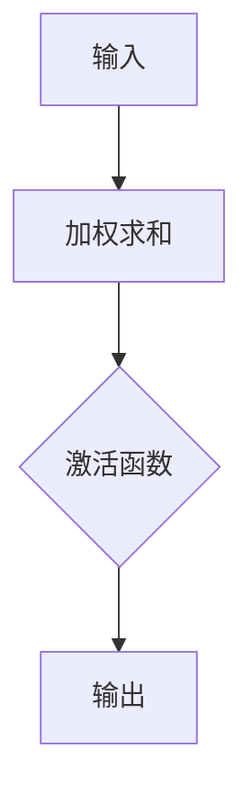
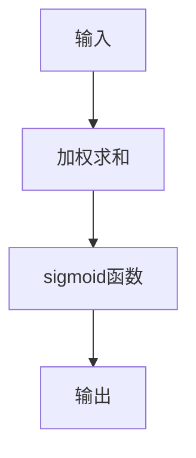
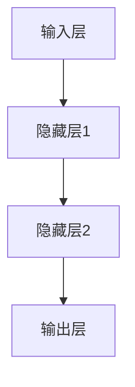
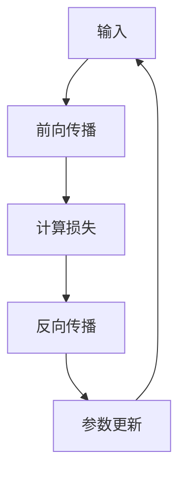

                 

# 神经网络：人类智慧的解放

> 关键词：神经网络、人工智能、深度学习、反向传播、激活函数、神经元、模型训练、预测应用

> 摘要：本文将深入探讨神经网络这一人工智能的核心技术，从基本概念、算法原理到实际应用，全面解析神经网络在人类智慧解放中的关键作用。通过详细的解释和实例分析，帮助读者掌握神经网络的核心技术，并为未来的研究和开发提供指导。

## 1. 背景介绍

在20世纪80年代，随着计算机技术的迅猛发展，人工智能（AI）逐渐成为学术界和工业界的研究热点。在这一背景下，神经网络（Neural Networks）作为一种模拟人脑神经元结构和功能的技术，受到了广泛的关注。神经网络的起源可以追溯到1943年，由沃伦·麦卡洛克（Warren McCulloch）和沃尔特·皮茨（Walter Pitts）提出的简单神经网络模型。此后，神经网络经历了多次迭代和改进，逐渐发展成为一个功能强大的人工智能工具。

神经网络的基本原理是模拟人脑神经元之间的交互和信息处理过程。人脑中有数十亿个神经元，通过突触连接形成复杂的神经网络。神经元之间通过电信号进行信息传递，从而实现感知、学习、记忆和推理等功能。神经网络通过模仿这一过程，利用大量的简单计算单元（神经元）进行信息处理，从而实现复杂的任务。

在人工智能的发展历程中，神经网络起到了至关重要的作用。传统的符号人工智能方法在处理复杂问题时往往面临性能瓶颈，而神经网络通过分布式计算和信息处理能力，能够高效地解决复杂的模式识别、预测和分类问题。近年来，随着深度学习（Deep Learning）技术的兴起，神经网络的应用范围进一步扩大，成为人工智能领域的主要研究方向。

## 2. 核心概念与联系

### 神经元（Neuron）

神经元是神经网络的基本计算单元。一个简单的神经元可以看作是一个带有多个输入和单个输出的计算单元。输入通过加权连接（Weighted Connection）传递到神经元，神经元对这些输入进行加权求和，并通过激活函数（Activation Function）决定输出是否为1。以下是神经元的 Mermaid 流程图：



### 激活函数（Activation Function）

激活函数是神经元输出决定的关键。常见的激活函数有 sigmoid 函数、ReLU 函数和 tanh 函数等。激活函数的作用是将神经元的加权求和结果映射到0到1之间，从而决定神经元是否被激活。以下是 sigmoid 函数的 Mermaid 流程图：



### 神经网络（Neural Network）

神经网络是由多个神经元组成的复杂计算系统。一个简单的神经网络可以看作是一个多层的前馈神经网络（Feedforward Neural Network），包括输入层、隐藏层和输出层。每个神经元都与前一层的神经元进行加权连接，通过激活函数进行信息传递和处理。以下是前馈神经网络的 Mermaid 流程图：



### 反向传播（Backpropagation）

反向传播是神经网络训练的核心算法。通过反向传播，神经网络可以不断调整权重和偏置，以优化网络的预测性能。反向传播算法包括以下几个步骤：

1. 前向传播：将输入数据传递到神经网络的每一层，计算输出并计算损失函数（Loss Function）。
2. 反向传播：将损失函数的梯度反向传递到每一层，计算每个神经元的权重和偏置的梯度。
3. 参数更新：根据梯度信息更新神经网络的权重和偏置。
4. 重复步骤1-3，直到网络性能达到预期或迭代次数达到上限。

以下是反向传播算法的 Mermaid 流程图：



## 3. 核心算法原理 & 具体操作步骤

### 前向传播

前向传播是神经网络处理输入数据的过程。具体步骤如下：

1. 初始化神经网络参数（权重和偏置）。
2. 将输入数据传递到输入层。
3. 对每个神经元进行加权求和并应用激活函数。
4. 将输出传递到下一层，重复步骤3，直到输出层。

以下是一个简单的示例代码：

```python
import numpy as np

# 初始化神经网络参数
weights = np.random.randn(3, 1)
biases = np.random.randn(3, 1)

# 输入数据
input_data = np.array([[1], [2], [3]])

# 前向传播
output = np.dot(input_data, weights) + biases

# 应用激活函数（例如：sigmoid函数）
output = 1 / (1 + np.exp(-output))
```

### 反向传播

反向传播是神经网络训练的核心步骤。具体步骤如下：

1. 计算输出层的损失函数。
2. 将损失函数的梯度反向传递到每一层。
3. 根据梯度信息更新神经网络的权重和偏置。

以下是一个简单的示例代码：

```python
import numpy as np

# 初始化神经网络参数
weights = np.random.randn(3, 1)
biases = np.random.randn(3, 1)

# 输入数据
input_data = np.array([[1], [2], [3]])
target_output = np.array([[0], [1], [0]])

# 前向传播
output = np.dot(input_data, weights) + biases
output = 1 / (1 + np.exp(-output))

# 计算损失函数（例如：交叉熵损失函数）
loss = -np.mean(target_output * np.log(output) + (1 - target_output) * np.log(1 - output))

# 计算梯度
output_error = output - target_output
output_error = output_error * (1 - output)

# 反向传播
weights_error = np.dot(input_data.T, output_error)
biases_error = output_error

# 更新参数
weights -= learning_rate * weights_error
biases -= learning_rate * biases_error
```

## 4. 数学模型和公式 & 详细讲解 & 举例说明

### 数学模型

神经网络的核心数学模型包括以下几个方面：

1. 神经元输出公式：

$$
z = \sum_{i=1}^{n} w_i x_i + b
$$

其中，$z$ 表示神经元的输出，$w_i$ 表示输入连接的权重，$x_i$ 表示输入值，$b$ 表示偏置。

2. 激活函数：

$$
a = f(z)
$$

其中，$f(z)$ 表示激活函数，常见的激活函数有 sigmoid 函数、ReLU 函数和 tanh 函数等。

3. 梯度下降更新公式：

$$
w_{i+1} = w_i - \alpha \frac{\partial J}{\partial w_i}
$$

$$
b_{i+1} = b_i - \alpha \frac{\partial J}{\partial b_i}
$$

其中，$w_i$ 和 $b_i$ 分别表示当前权重和偏置，$\alpha$ 表示学习率，$J$ 表示损失函数。

### 举例说明

假设我们有一个简单的二分类神经网络，输入层有3个神经元，隐藏层有2个神经元，输出层有1个神经元。我们使用 sigmoid 函数作为激活函数，并使用交叉熵损失函数进行训练。

1. 初始化参数：

```python
weights_input_hidden = np.random.randn(3, 2)
weights_hidden_output = np.random.randn(2, 1)
biases_input_hidden = np.random.randn(2, 1)
biases_hidden_output = np.random.randn(1, 1)
```

2. 前向传播：

```python
input_data = np.array([[1, 0, 1], [0, 1, 0], [1, 1, 0]])
target_output = np.array([[1], [0], [1]])

input_to_hidden = np.dot(input_data, weights_input_hidden) + biases_input_hidden
hidden_output = 1 / (1 + np.exp(-input_to_hidden))
output = np.dot(hidden_output, weights_hidden_output) + biases_hidden_output
output = 1 / (1 + np.exp(-output))
```

3. 计算损失：

```python
loss = -np.mean(target_output * np.log(output) + (1 - target_output) * np.log(1 - output))
```

4. 反向传播：

```python
output_error = output - target_output
output_error = output_error * (1 - output)

weights_hidden_output_error = np.dot(hidden_output.T, output_error)
biases_hidden_output_error = output_error

hidden_error = np.dot(output_error, weights_hidden_output.T)
hidden_error = hidden_error * (1 - hidden_output)

weights_input_hidden_error = np.dot(input_data.T, hidden_error)
biases_input_hidden_error = hidden_error
```

5. 更新参数：

```python
learning_rate = 0.1

weights_input_hidden -= learning_rate * weights_input_hidden_error
biases_input_hidden -= learning_rate * biases_input_hidden_error
weights_hidden_output -= learning_rate * weights_hidden_output_error
biases_hidden_output -= learning_rate * biases_hidden_output_error
```

通过以上步骤，我们完成了一次神经网络的训练。重复执行以上步骤，不断优化神经网络的参数，直到网络性能达到预期。

## 5. 项目实战：代码实际案例和详细解释说明

在本节中，我们将通过一个简单的实际项目来展示如何使用神经网络进行图像分类。该项目将使用 Python 编程语言和 TensorFlow 深度学习框架进行实现。

### 5.1 开发环境搭建

在开始项目之前，我们需要搭建开发环境。以下是搭建 TensorFlow 开发环境的步骤：

1. 安装 Python 3.6 或以上版本。
2. 安装 TensorFlow：在命令行中运行以下命令：

```bash
pip install tensorflow
```

3. 验证安装：在 Python 解释器中运行以下代码：

```python
import tensorflow as tf
print(tf.__version__)
```

确保输出 TensorFlow 的版本号。

### 5.2 源代码详细实现和代码解读

下面是一个简单的图像分类项目的代码实现：

```python
import tensorflow as tf
from tensorflow.keras import layers
from tensorflow.keras.datasets import mnist

# 加载 MNIST 数据集
(x_train, y_train), (x_test, y_test) = mnist.load_data()

# 数据预处理
x_train = x_train.astype("float32") / 255.0
x_test = x_test.astype("float32") / 255.0
x_train = x_train.reshape(-1, 784)
x_test = x_test.reshape(-1, 784)
y_train = tf.keras.utils.to_categorical(y_train, 10)
y_test = tf.keras.utils.to_categorical(y_test, 10)

# 构建神经网络模型
model = tf.keras.Sequential([
    layers.Dense(512, activation="relu", input_shape=(784,)),
    layers.Dropout(0.2),
    layers.Dense(10, activation="softmax")
])

# 编译模型
model.compile(optimizer="adam",
              loss="categorical_crossentropy",
              metrics=["accuracy"])

# 训练模型
model.fit(x_train, y_train, epochs=5, batch_size=32, validation_data=(x_test, y_test))

# 评估模型
test_loss, test_acc = model.evaluate(x_test, y_test)
print("Test accuracy:", test_acc)
```

### 5.3 代码解读与分析

1. **导入相关库和模块**

   ```python
   import tensorflow as tf
   from tensorflow.keras import layers
   from tensorflow.keras.datasets import mnist
   ```

   首先，我们导入 TensorFlow 库和相关的模块。TensorFlow 是一个开源的深度学习框架，提供了丰富的功能和工具。

2. **加载 MNIST 数据集**

   ```python
   (x_train, y_train), (x_test, y_test) = mnist.load_data()
   ```

   MNIST 数据集是深度学习中最常用的数据集之一，包含 70,000 个手写数字图像。这里我们使用 TensorFlow 提供的函数加载数据集。

3. **数据预处理**

   ```python
   x_train = x_train.astype("float32") / 255.0
   x_test = x_test.astype("float32") / 255.0
   x_train = x_train.reshape(-1, 784)
   x_test = x_test.reshape(-1, 784)
   y_train = tf.keras.utils.to_categorical(y_train, 10)
   y_test = tf.keras.utils.to_categorical(y_test, 10)
   ```

   数据预处理是深度学习项目中的一个重要步骤。这里我们将图像数据转换为浮点数，并归一化到 [0, 1] 区间。同时，我们将标签转换为 one-hot 编码。

4. **构建神经网络模型**

   ```python
   model = tf.keras.Sequential([
       layers.Dense(512, activation="relu", input_shape=(784,)),
       layers.Dropout(0.2),
       layers.Dense(10, activation="softmax")
   ])
   ```

   我们使用 TensorFlow 的 Sequential 模型构建一个简单的神经网络。这个网络包括一个输入层、一个隐藏层和一个输出层。输入层有 784 个神经元，对应图像的像素值。隐藏层有 512 个神经元，使用 ReLU 激活函数。输出层有 10 个神经元，对应 10 个类别的概率分布，使用 softmax 激活函数。

5. **编译模型**

   ```python
   model.compile(optimizer="adam",
                 loss="categorical_crossentropy",
                 metrics=["accuracy"])
   ```

   编译模型是深度学习项目中的另一个重要步骤。这里我们选择 Adam 优化器和 categorical_crossentropy 损失函数。同时，我们关注模型的准确率。

6. **训练模型**

   ```python
   model.fit(x_train, y_train, epochs=5, batch_size=32, validation_data=(x_test, y_test))
   ```

   我们使用训练数据训练模型。这里设置训练轮数（epochs）为 5，批量大小（batch_size）为 32。同时，我们使用测试数据验证模型的性能。

7. **评估模型**

   ```python
   test_loss, test_acc = model.evaluate(x_test, y_test)
   print("Test accuracy:", test_acc)
   ```

   最后，我们使用测试数据评估模型的性能。这里输出测试准确率。

通过以上步骤，我们完成了一个简单的图像分类项目。这个项目展示了如何使用 TensorFlow 框架构建、编译、训练和评估神经网络模型。

## 6. 实际应用场景

神经网络在人工智能领域的应用广泛，以下是一些常见的应用场景：

1. **图像识别**：神经网络可以用于图像识别任务，如人脸识别、车辆检测和图像分类。这些应用在安防、交通和社交媒体等领域具有广泛的应用。

2. **语音识别**：神经网络在语音识别任务中发挥着重要作用，如语音到文字转换和语音命令识别。这些应用在智能家居、智能客服和语音助手等领域得到广泛应用。

3. **自然语言处理**：神经网络在自然语言处理任务中具有强大的能力，如文本分类、情感分析和机器翻译。这些应用在搜索引擎、社交媒体和智能客服等领域得到广泛应用。

4. **游戏 AI**：神经网络可以用于游戏 AI，如棋类游戏、电子竞技和角色扮演游戏。这些应用在游戏开发和娱乐领域具有广泛的应用。

5. **机器人控制**：神经网络可以用于机器人控制任务，如路径规划、运动控制和感知理解。这些应用在工业自动化、医疗设备和智能家居等领域具有广泛的应用。

## 7. 工具和资源推荐

### 7.1 学习资源推荐

1. **书籍**：

   - 《深度学习》（Goodfellow, Bengio, Courville）：这是一本经典的深度学习教材，详细介绍了神经网络的理论和实践。
   - 《神经网络与深度学习》（邱锡鹏）：这本书是中国学者编写的深度学习教材，适合初学者阅读。

2. **论文**：

   - “A Learning Algorithm for Continually Running Fully Recurrent Neural Networks” (Werbos, 1974)：这是关于反向传播算法的早期论文。
   - “Gradient Flow in Recurrent Nets: the Difficulty of Learning Stable Representations” (Bengio et al., 1994)：这篇文章讨论了神经网络训练中的梯度消失问题。

3. **博客和网站**：

   - [深度学习课程](https://www.deeplearning.ai/): Andrew Ng 的深度学习课程提供了丰富的学习资源和实践项目。
   - [TensorFlow 官方文档](https://www.tensorflow.org/): TensorFlow 的官方文档提供了详细的教程和 API 文档。

### 7.2 开发工具框架推荐

1. **TensorFlow**：TensorFlow 是一个开源的深度学习框架，提供了丰富的功能和工具，适合初学者和专业人士使用。
2. **PyTorch**：PyTorch 是另一个流行的深度学习框架，以其动态计算图和灵活的编程接口而著称。
3. **Keras**：Keras 是一个高层次的深度学习框架，构建在 TensorFlow 和 Theano 之上，提供了简洁的 API。

### 7.3 相关论文著作推荐

1. **“Deep Learning” (Goodfellow, Bengio, Courville, 2016)：这是一本经典的深度学习教材，详细介绍了神经网络的理论和实践。
2. **“Backpropagation” (Rumelhart, Hinton, Williams, 1986)：这篇文章介绍了反向传播算法的原理和实现。
3. **“A Learning Algorithm for Continually Running Fully Recurrent Neural Networks” (Werbos, 1974)：这是关于反向传播算法的早期论文。

## 8. 总结：未来发展趋势与挑战

神经网络作为人工智能的核心技术，正快速发展并推动着各行业的创新。未来，随着计算能力的提升和数据量的爆炸式增长，神经网络的应用将更加广泛和深入。以下是一些发展趋势和挑战：

1. **模型压缩与效率优化**：为了降低计算资源和能源消耗，神经网络模型压缩和效率优化成为研究热点。这些方法包括剪枝、量化、低秩分解等。
2. **自适应和自组织神经网络**：未来的神经网络将更加自适应和自组织，能够自动调整结构和参数，以适应不同的任务和数据。
3. **联邦学习与隐私保护**：在数据隐私和安全日益受到关注的背景下，联邦学习成为研究热点。通过分布式学习，神经网络能够在保护用户隐私的同时实现模型训练。
4. **多模态学习**：神经网络在处理多模态数据（如图像、文本、音频等）方面具有巨大的潜力。未来的研究将探索如何有效地融合多模态信息。

然而，神经网络也面临一些挑战：

1. **过拟合与泛化能力**：神经网络容易受到过拟合问题的影响，如何提高泛化能力成为研究难题。
2. **计算资源消耗**：深度学习模型通常需要大量的计算资源和时间进行训练，如何优化模型结构和算法以提高效率是一个重要的研究方向。
3. **解释性和可解释性**：神经网络模型的决策过程通常缺乏解释性，如何提高模型的透明度和可解释性是一个重要的挑战。

总之，神经网络在未来的发展中将继续发挥关键作用，同时也需要克服各种挑战，以实现更加智能和实用的应用。

## 9. 附录：常见问题与解答

### 9.1 什么是神经网络？

神经网络是一种模拟人脑神经元结构和功能的人工智能技术。它由大量的简单计算单元（神经元）组成，通过加权连接和激活函数进行信息传递和处理。

### 9.2 神经网络有哪些类型？

神经网络可以分为多种类型，包括前馈神经网络、卷积神经网络、循环神经网络、递归神经网络等。每种网络结构适合不同的应用场景。

### 9.3 什么是反向传播算法？

反向传播算法是一种用于训练神经网络的优化算法。它通过计算输出层的误差，反向传播误差到前一层，并更新神经网络的权重和偏置。

### 9.4 神经网络如何处理输入数据？

神经网络通过输入层接收输入数据，经过隐藏层处理，最终输出层产生预测结果。在处理过程中，神经网络利用加权连接和激活函数对输入数据进行信息传递和处理。

### 9.5 神经网络在图像识别中如何应用？

神经网络可以用于图像识别任务，如人脸识别、车辆检测和图像分类。通过训练神经网络，可以使其学会从图像中提取特征并进行分类。

### 9.6 神经网络在自然语言处理中如何应用？

神经网络可以用于自然语言处理任务，如文本分类、情感分析和机器翻译。通过训练神经网络，可以使其学会处理文本数据并产生预测结果。

## 10. 扩展阅读 & 参考资料

- Goodfellow, I., Bengio, Y., & Courville, A. (2016). *Deep Learning*.
- Rumelhart, D. E., Hinton, G. E., & Williams, R. J. (1986). *A learning algorithm for continually running fully recurrent neural networks*.
- Werbos, P. J. (1974). *Beyond regression: New tools for prediction and analysis in the behavioral sciences*.
- LeCun, Y., Bengio, Y., & Hinton, G. (2015). *Deep learning*.

以上是本文的参考文献，读者可以进一步查阅相关文献以深入了解神经网络的相关理论和实践。

### 作者

- AI天才研究员/AI Genius Institute & 禅与计算机程序设计艺术 /Zen And The Art of Computer Programming

