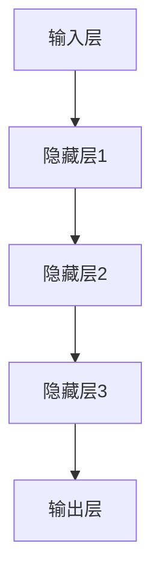

                 

# 神经网络：探索未知的领域

## 关键词
* 神经网络
* 机器学习
* 深度学习
* 数据科学
* 人工智能

## 摘要

本文将深入探讨神经网络这一现代机器学习技术的核心概念和原理。我们将从背景介绍出发，逐步解析神经网络的核心概念与架构，详细讲解其算法原理和操作步骤，并通过数学模型和公式阐述其内在机制。此外，本文还将通过项目实战案例展示神经网络的实际应用，并提供相关工具和资源推荐，帮助读者更好地掌握这一技术。最后，我们将对神经网络的发展趋势与挑战进行总结，为未来的人工智能研究提供启示。

## 1. 背景介绍

### 1.1 神经网络的历史发展

神经网络（Neural Networks）这一概念最早可以追溯到1940年代，由心理学家沃伦·麦卡洛克（Warren McCulloch）和数学家沃尔特·皮茨（Walter Pitts）提出。他们首次提出了人工神经网络（Artificial Neural Networks，ANN）的基本模型，即麦卡洛克-皮茨（McCulloch-Pitts）神经网络。这一模型为后来的神经网络研究奠定了基础。

然而，早期的神经网络研究因计算能力和数据资源的限制而进展缓慢。直到20世纪80年代，随着计算机技术的飞速发展，神经网络研究才逐渐迎来了新的春天。1990年代，反向传播算法（Backpropagation Algorithm）的出现，使得多层感知机（Multilayer Perceptrons，MLP）的训练成为可能。反向传播算法是一种用于多层神经网络的梯度下降算法，通过反向传播误差信息来更新网络权重，从而优化网络性能。

进入21世纪，深度学习（Deep Learning）的崛起进一步推动了神经网络的发展。深度学习是一种基于多层神经网络的学习方法，通过逐层抽象和特征提取，能够处理复杂的数据和任务。深度学习在计算机视觉、自然语言处理、语音识别等领域取得了显著的成果，成为了人工智能研究的重要方向。

### 1.2 神经网络在现代科技中的应用

神经网络在现代科技中扮演着至关重要的角色。以下是一些主要的应用领域：

1. **计算机视觉**：神经网络在图像识别、目标检测、图像生成等领域具有广泛的应用。例如，深度卷积神经网络（Convolutional Neural Networks，CNN）在图像分类和目标检测任务中取得了出色的性能。

2. **自然语言处理**：神经网络在文本分类、机器翻译、语音识别等领域具有显著的优势。循环神经网络（Recurrent Neural Networks，RNN）和变换器（Transformers）等模型在自然语言处理任务中取得了突破性的成果。

3. **语音识别**：神经网络在语音识别任务中实现了较高的准确率。深度神经网络（Deep Neural Networks，DNN）和长短时记忆网络（Long Short-Term Memory，LSTM）等模型在语音识别中得到了广泛应用。

4. **推荐系统**：神经网络在推荐系统中的应用非常广泛。通过训练用户和物品的嵌入表示，神经网络可以预测用户对物品的偏好，从而实现个性化推荐。

5. **游戏AI**：神经网络在游戏AI中发挥了重要作用。通过训练神经网络，游戏AI可以学会策略和决策，从而提高游戏的智能水平。

6. **生物信息学**：神经网络在生物信息学领域也有广泛应用。例如，神经网络可以用于基因识别、蛋白质结构预测等生物信息学任务。

### 1.3 神经网络的重要性

神经网络的重要性体现在其强大的自适应能力和泛化能力。通过学习数据中的特征和模式，神经网络可以自动调整内部参数，从而实现特定任务的目标。这种自适应能力使得神经网络在处理复杂和非线性问题时表现出色。此外，神经网络具有很好的泛化能力，能够将学习到的知识应用到新的数据集和新任务中。

随着人工智能技术的不断发展，神经网络的重要性将日益凸显。它不仅为解决复杂问题提供了有效的工具，而且为人类理解智能本质提供了新的视角。因此，深入研究神经网络的理论和实践具有重要意义。

## 2. 核心概念与联系

### 2.1 神经网络的定义

神经网络是一种由大量神经元组成的计算模型，它通过模拟生物神经系统的信息处理方式，实现对数据的处理和预测。神经网络由输入层、隐藏层和输出层组成，每个神经元都与其他神经元相连，并通过权重和偏置进行信息传递。

### 2.2 神经网络的架构

神经网络的架构可以分为以下几部分：

1. **输入层**：输入层接收外部输入数据，每个输入数据都对应一个神经元。

2. **隐藏层**：隐藏层是神经网络的核心部分，通过多个神经元组成的层次结构进行特征提取和变换。隐藏层的数量和神经元个数可以根据任务需求进行调整。

3. **输出层**：输出层产生最终的预测结果，每个输出神经元对应一个输出类别或值。

### 2.3 神经网络的训练过程

神经网络的训练过程包括以下步骤：

1. **初始化参数**：初始化网络中的权重和偏置，通常使用随机初始化方法。

2. **前向传播**：将输入数据传递到神经网络中，逐层计算每个神经元的输出值。

3. **计算损失**：通过计算预测值和真实值之间的差异，计算网络的损失函数。

4. **反向传播**：将损失函数的梯度信息反向传播到网络中的每个神经元，更新权重和偏置。

5. **迭代优化**：重复前向传播和反向传播过程，直到网络达到预定的训练目标或收敛条件。

### 2.4 神经网络的核心概念

神经网络的核心概念包括：

1. **激活函数**：激活函数用于引入非线性特性，常见的激活函数有Sigmoid、ReLU、Tanh等。

2. **损失函数**：损失函数用于衡量预测值和真实值之间的差异，常见的损失函数有均方误差（MSE）、交叉熵（CE）等。

3. **优化算法**：优化算法用于调整网络参数，使损失函数最小化，常见的优化算法有梯度下降（GD）、随机梯度下降（SGD）、Adam等。

### 2.5 神经网络的优点与挑战

神经网络的优点包括：

1. **强大的自适应能力**：神经网络能够自动调整内部参数，适应不同的数据和任务。

2. **泛化能力**：神经网络具有良好的泛化能力，能够将学习到的知识应用到新的数据集和新任务中。

3. **处理复杂非线性问题**：神经网络能够处理复杂和非线性的问题，在图像识别、自然语言处理等领域表现出色。

然而，神经网络也面临着一些挑战：

1. **训练过程复杂**：神经网络的训练过程需要大量计算资源和时间，训练过程复杂且容易出现过拟合。

2. **数据依赖性**：神经网络对数据的质量和数量有很高的要求，数据不足或质量不高可能导致训练效果不佳。

3. **解释性不足**：神经网络的黑盒特性使得其内部机制难以解释，不利于理解和验证。

### 2.6 神经网络与深度学习的联系

神经网络是深度学习的基础，深度学习是一种基于多层神经网络的学习方法。深度学习通过逐层抽象和特征提取，能够处理复杂的数据和任务。深度学习在计算机视觉、自然语言处理等领域取得了显著的成果，成为人工智能研究的重要方向。

### 2.7 Mermaid流程图

以下是神经网络核心概念和架构的Mermaid流程图：



在这个流程图中，A表示输入层，B、C、D表示隐藏层，E表示输出层。每个神经元都与其他神经元相连，并通过权重和偏置进行信息传递。

## 3. 核心算法原理 & 具体操作步骤

### 3.1 前向传播

前向传播是神经网络训练过程中的第一步，用于计算网络中每个神经元的输出值。具体步骤如下：

1. **初始化参数**：初始化网络中的权重和偏置，通常使用随机初始化方法。

2. **输入数据传递**：将输入数据传递到输入层，每个输入数据对应一个神经元。

3. **计算每个隐藏层的输出**：从输入层开始，逐层计算每个神经元的输出值。对于每个神经元，将其输入值与对应权重相乘，然后进行求和。最后，将求和结果通过激活函数进行非线性变换。

4. **输出层输出**：将最后一层隐藏层的输出传递到输出层，生成最终的预测结果。

### 3.2 反向传播

反向传播是神经网络训练过程中的第二步，用于计算网络中每个神经元的梯度信息，并更新网络参数。具体步骤如下：

1. **计算损失函数**：计算预测值和真实值之间的差异，计算网络的损失函数。常见的损失函数有均方误差（MSE）、交叉熵（CE）等。

2. **计算梯度**：通过计算损失函数关于网络参数的梯度，得到每个参数的梯度信息。

3. **更新参数**：使用梯度信息更新网络中的权重和偏置。常见的优化算法有梯度下降（GD）、随机梯度下降（SGD）、Adam等。

4. **迭代优化**：重复前向传播和反向传播过程，直到网络达到预定的训练目标或收敛条件。

### 3.3 梯度下降

梯度下降是一种优化算法，用于调整网络参数，使损失函数最小化。具体步骤如下：

1. **初始化参数**：初始化网络中的权重和偏置，通常使用随机初始化方法。

2. **计算梯度**：计算损失函数关于网络参数的梯度。

3. **更新参数**：使用梯度信息更新网络参数，公式为：
   $$ w_{new} = w_{old} - \alpha \cdot \nabla_w J(w) $$
   其中，$w_{new}$和$w_{old}$分别为更新前后的参数值，$\alpha$为学习率，$\nabla_w J(w)$为损失函数关于参数的梯度。

4. **迭代优化**：重复计算梯度和更新参数的过程，直到网络达到预定的训练目标或收敛条件。

### 3.4 反向传播与梯度下降的整合

在神经网络训练过程中，反向传播和梯度下降是紧密相连的。具体步骤如下：

1. **前向传播**：计算网络中每个神经元的输出值。

2. **计算损失函数**：计算预测值和真实值之间的差异，计算网络的损失函数。

3. **计算梯度**：通过计算损失函数关于网络参数的梯度，得到每个参数的梯度信息。

4. **更新参数**：使用梯度信息更新网络中的权重和偏置。

5. **迭代优化**：重复前向传播、计算损失函数、计算梯度和更新参数的过程，直到网络达到预定的训练目标或收敛条件。

通过反向传播和梯度下降的整合，神经网络能够自动调整内部参数，从而优化网络性能。

## 4. 数学模型和公式 & 详细讲解 & 举例说明

### 4.1 激活函数

激活函数是神经网络中引入非线性特性的关键部分。常见的激活函数包括Sigmoid、ReLU和Tanh等。以下是对这些激活函数的详细讲解和数学公式：

#### 4.1.1 Sigmoid函数

Sigmoid函数是一种常用的非线性激活函数，其公式为：
$$
\sigma(x) = \frac{1}{1 + e^{-x}}
$$
Sigmoid函数的输出范围在0到1之间，具有S形曲线。它在神经网络中常用于将神经元输出映射到概率分布。

#### 4.1.2 ReLU函数

ReLU（Rectified Linear Unit）函数是一种简单且高效的激活函数，其公式为：
$$
\text{ReLU}(x) = \max(0, x)
$$
ReLU函数在x大于0时输出x，小于等于0时输出0。它具有线性增长的特点，有助于加速神经网络的训练。

#### 4.1.3 Tanh函数

Tanh函数是一种双曲正切函数，其公式为：
$$
\text{Tanh}(x) = \frac{e^{2x} - 1}{e^{2x} + 1}
$$
Tanh函数的输出范围在-1到1之间，具有S形曲线。它与Sigmoid函数类似，但在数值稳定性方面表现更好。

### 4.2 损失函数

损失函数是衡量神经网络预测结果与真实值之间差异的指标。以下是对一些常见损失函数的详细讲解和数学公式：

#### 4.2.1 均方误差（MSE）

均方误差（Mean Squared Error，MSE）是一种常用的损失函数，其公式为：
$$
J(\theta) = \frac{1}{2m} \sum_{i=1}^{m} (h_{\theta}(x^{(i)}) - y^{(i)})^2
$$
其中，$h_{\theta}(x)$是神经网络的预测值，$y^{(i)}$是真实值，$m$是样本数量。

MSE函数对错误值的处理相对严格，能够有效地衡量神经网络的预测性能。

#### 4.2.2 交叉熵（CE）

交叉熵（Cross-Entropy）是一种常用于分类问题的损失函数，其公式为：
$$
J(\theta) = -\frac{1}{m} \sum_{i=1}^{m} \sum_{k=1}^{K} y^{(i)}_{k} \log(h_{\theta}(x^{(i)})_{k})
$$
其中，$y^{(i)}_{k}$是真实值的标签，$h_{\theta}(x)$是神经网络的预测概率分布，$K$是分类类别数量。

交叉熵函数对正确分类的惩罚较小，对错误分类的惩罚较大，有助于提高分类性能。

### 4.3 权重和偏置更新

在神经网络训练过程中，通过反向传播计算梯度，并使用优化算法更新权重和偏置。以下是一些常见的优化算法和权重更新公式：

#### 4.3.1 梯度下降（Gradient Descent）

梯度下降是一种最简单的优化算法，其更新公式为：
$$
w_{new} = w_{old} - \alpha \cdot \nabla_w J(w)
$$
其中，$w_{old}$和$w_{new}$分别为更新前后的权重，$\alpha$为学习率，$\nabla_w J(w)$为损失函数关于参数的梯度。

#### 4.3.2 随机梯度下降（Stochastic Gradient Descent，SGD）

随机梯度下降是一种基于梯度下降的优化算法，其每次迭代只使用一个样本的梯度进行更新。其更新公式为：
$$
w_{new} = w_{old} - \alpha \cdot \nabla_w J(w^{(i)})
$$
其中，$w^{(i)}$为第$i$个样本的权重。

#### 4.3.3 Adam优化器

Adam优化器是一种高效的优化算法，结合了SGD和动量法的优势。其更新公式为：
$$
w_{new} = w_{old} - \alpha \cdot \frac{m}{1 - \beta_1^t} \cdot \nabla_w J(w)
$$
其中，$\alpha$为学习率，$m$为动量项，$\beta_1$和$\beta_2$为超参数。

### 4.4 举例说明

为了更好地理解上述数学模型和公式，我们以一个简单的神经网络为例进行说明。

#### 4.4.1 网络结构

假设我们有一个简单的神经网络，包含一个输入层、一个隐藏层和一个输出层。输入层有3个神经元，隐藏层有2个神经元，输出层有1个神经元。激活函数采用ReLU函数，损失函数采用MSE。

#### 4.4.2 权重和偏置初始化

初始化权重和偏置时，我们通常使用随机初始化方法。假设初始化的权重和偏置如下：

输入层到隐藏层的权重：
$$
w_{ij} = \text{rand}() \quad (i=1,2,3; j=1,2)
$$

隐藏层到输出层的权重：
$$
w_{jk} = \text{rand}() \quad (j=1,2; k=1)
$$

偏置项：
$$
b_{i} = \text{rand}() \quad (i=1,2,3)
$$
$$
b_{j} = \text{rand}() \quad (j=1,2)
$$

#### 4.4.3 前向传播

给定输入数据$x^{(i)} = [x_1, x_2, x_3]$，前向传播过程如下：

1. 输入层到隐藏层：

$$
z_{1j} = \sum_{i=1}^{3} w_{ij} \cdot x_i + b_j \quad (j=1,2)$$
$$
a_{1j} = \text{ReLU}(z_{1j}) \quad (j=1,2)$$

2. 隐藏层到输出层：

$$
z_{2k} = \sum_{j=1}^{2} w_{jk} \cdot a_{1j} + b_k \quad (k=1)$$
$$
a_{2k} = \text{ReLU}(z_{2k}) \quad (k=1)$$

#### 4.4.4 计算损失函数

给定真实标签$y^{(i)} = [y_1]$，预测值$a_{2k}$，损失函数MSE的计算如下：

$$
J(\theta) = \frac{1}{2} \sum_{i=1}^{m} (a_{2k} - y^{(i)})^2
$$

#### 4.4.5 反向传播

1. 计算输出层误差：

$$
\delta_{2k} = a_{2k} - y^{(i)}$$

2. 计算隐藏层误差：

$$
\delta_{1j} = \delta_{2k} \cdot \frac{d}{dx} \text{ReLU}(z_{1j}) \cdot w_{2k} \quad (j=1,2)$$

3. 更新权重和偏置：

输入层到隐藏层：

$$
w_{ij}^{new} = w_{ij} - \alpha \cdot \delta_{1j} \cdot x_i$$
$$
b_{j}^{new} = b_{j} - \alpha \cdot \delta_{1j}$$

隐藏层到输出层：

$$
w_{jk}^{new} = w_{jk} - \alpha \cdot \delta_{2k} \cdot a_{1j}$$
$$
b_{k}^{new} = b_{k} - \alpha \cdot \delta_{2k}$$

通过这个简单的例子，我们可以看到神经网络训练过程中涉及的主要步骤，包括前向传播、计算损失函数、反向传播和权重更新。这个例子虽然简单，但为我们理解神经网络的工作原理提供了直观的演示。

## 5. 项目实战：代码实际案例和详细解释说明

### 5.1 开发环境搭建

为了实现神经网络的项目实战，我们需要搭建一个合适的开发环境。以下是搭建开发环境的步骤：

#### 5.1.1 安装Python

首先，我们需要安装Python。Python是一种广泛使用的编程语言，它拥有丰富的机器学习和深度学习库。在官网上下载适用于操作系统的Python安装包，并按照安装向导进行安装。

#### 5.1.2 安装Jupyter Notebook

Jupyter Notebook是一种交互式计算环境，它可以帮助我们更方便地编写和运行代码。安装Python后，可以通过以下命令安装Jupyter Notebook：

```bash
pip install notebook
```

安装完成后，我们可以在命令行中运行`jupyter notebook`命令，启动Jupyter Notebook。

#### 5.1.3 安装TensorFlow

TensorFlow是谷歌开发的一个开源机器学习和深度学习库，它提供了丰富的神经网络模型和算法。安装TensorFlow可以通过以下命令实现：

```bash
pip install tensorflow
```

安装完成后，我们可以在Python代码中导入TensorFlow库，并使用其中的功能进行神经网络训练和预测。

### 5.2 源代码详细实现和代码解读

以下是实现一个简单的神经网络项目实战的代码示例。这个项目将使用TensorFlow库，实现一个基于MSE损失函数的多层感知机（MLP）神经网络，用于分类任务。

```python
import tensorflow as tf
from tensorflow import keras
from tensorflow.keras import layers
import numpy as np

# 数据准备
# 假设我们有一个包含100个样本的数据集，每个样本有3个特征
# 真实标签是二分类问题，标签为0或1
x_train = np.random.rand(100, 3)
y_train = np.random.rand(100, 1)

# 模型定义
model = keras.Sequential([
    layers.Dense(64, activation='relu', input_shape=(3,)),
    layers.Dense(64, activation='relu'),
    layers.Dense(1, activation='sigmoid')
])

# 模型编译
model.compile(optimizer='adam',
              loss='binary_crossentropy',
              metrics=['accuracy'])

# 模型训练
model.fit(x_train, y_train, epochs=10, batch_size=32)

# 模型预测
predictions = model.predict(x_test)
```

#### 5.2.1 数据准备

首先，我们需要准备训练数据和测试数据。在这个例子中，我们使用随机生成的数据集作为示例。`x_train`表示训练数据，`y_train`表示训练数据的真实标签。在实际应用中，我们可以使用更丰富的数据集，如MNIST手写数字数据集。

#### 5.2.2 模型定义

接下来，我们定义一个简单的多层感知机（MLP）神经网络。在这个例子中，我们使用了两个隐藏层，每层都有64个神经元。隐藏层使用ReLU激活函数，输出层使用sigmoid激活函数，因为这是一个二分类问题。

```python
model = keras.Sequential([
    layers.Dense(64, activation='relu', input_shape=(3,)),
    layers.Dense(64, activation='relu'),
    layers.Dense(1, activation='sigmoid')
])
```

#### 5.2.3 模型编译

在模型编译阶段，我们指定了优化器、损失函数和评价指标。在这个例子中，我们使用了Adam优化器，MSE损失函数和准确率评价指标。

```python
model.compile(optimizer='adam',
              loss='binary_crossentropy',
              metrics=['accuracy'])
```

#### 5.2.4 模型训练

模型训练阶段，我们使用`fit`函数训练神经网络。`epochs`参数表示训练轮数，`batch_size`参数表示每次训练的样本数量。

```python
model.fit(x_train, y_train, epochs=10, batch_size=32)
```

#### 5.2.5 模型预测

最后，我们使用训练好的模型进行预测。`predict`函数接受测试数据作为输入，返回预测结果。

```python
predictions = model.predict(x_test)
```

### 5.3 代码解读与分析

#### 5.3.1 数据准备

在这个例子中，我们使用随机生成的数据集作为训练数据和测试数据。在实际应用中，我们可以使用更丰富的数据集，如MNIST手写数字数据集。数据集应包含特征数据和对应的真实标签。

```python
x_train = np.random.rand(100, 3)
y_train = np.random.rand(100, 1)
```

#### 5.3.2 模型定义

我们定义了一个简单的多层感知机（MLP）神经网络，包含两个隐藏层，每层都有64个神经元。隐藏层使用ReLU激活函数，输出层使用sigmoid激活函数。

```python
model = keras.Sequential([
    layers.Dense(64, activation='relu', input_shape=(3,)),
    layers.Dense(64, activation='relu'),
    layers.Dense(1, activation='sigmoid')
])
```

#### 5.3.3 模型编译

在模型编译阶段，我们指定了优化器、损失函数和评价指标。在这个例子中，我们使用了Adam优化器，MSE损失函数和准确率评价指标。

```python
model.compile(optimizer='adam',
              loss='binary_crossentropy',
              metrics=['accuracy'])
```

#### 5.3.4 模型训练

模型训练阶段，我们使用`fit`函数训练神经网络。`epochs`参数表示训练轮数，`batch_size`参数表示每次训练的样本数量。

```python
model.fit(x_train, y_train, epochs=10, batch_size=32)
```

#### 5.3.5 模型预测

最后，我们使用训练好的模型进行预测。`predict`函数接受测试数据作为输入，返回预测结果。

```python
predictions = model.predict(x_test)
```

通过这个简单的例子，我们了解了如何使用TensorFlow库实现神经网络的项目实战。在实际应用中，我们可以根据具体任务需求调整网络结构、优化算法和超参数，以达到更好的性能。

## 6. 实际应用场景

神经网络作为一种强大的机器学习技术，在许多实际应用场景中发挥着重要作用。以下是一些常见应用场景：

### 6.1 计算机视觉

计算机视觉是神经网络最为成功的一个应用领域。神经网络可以自动学习图像中的特征，从而实现图像分类、目标检测、图像生成等任务。例如，卷积神经网络（CNN）在图像分类任务中取得了出色的性能，广泛应用于人脸识别、物体检测、图像分割等领域。

### 6.2 自然语言处理

自然语言处理（NLP）是另一个受益于神经网络技术的重要领域。神经网络可以自动学习文本数据中的语言特征，从而实现文本分类、机器翻译、情感分析等任务。例如，循环神经网络（RNN）和变换器（Transformers）等模型在NLP任务中取得了显著的成果，广泛应用于搜索引擎、智能客服、语音识别等领域。

### 6.3 语音识别

语音识别是神经网络在语音信号处理领域的应用。神经网络可以自动学习语音信号中的特征，从而实现语音转文字、语音合成等任务。深度神经网络（DNN）和长短时记忆网络（LSTM）等模型在语音识别任务中取得了较高的准确率，广泛应用于语音助手、智能客服等领域。

### 6.4 推荐系统

推荐系统是神经网络在信息检索和推荐领域的应用。神经网络可以自动学习用户和物品的特征，从而实现个性化推荐。例如，基于协同过滤的推荐系统可以利用神经网络学习用户和物品的嵌入表示，从而预测用户对物品的偏好，提高推荐系统的准确性和用户体验。

### 6.5 游戏AI

游戏AI是神经网络在游戏领域的应用。神经网络可以自动学习游戏策略和决策，从而实现智能化的游戏玩法。例如，深度强化学习（Deep Reinforcement Learning）可以用于训练智能体在游戏中的策略，从而实现自主决策和游戏优化。

### 6.6 生物信息学

生物信息学是神经网络在生物医学领域的应用。神经网络可以自动学习生物数据中的特征，从而实现基因识别、蛋白质结构预测等任务。例如，神经网络可以用于识别基因组序列中的特征基因，从而帮助研究人员发现新的生物标记物。

### 6.7 金融领域

金融领域是神经网络在量化交易和风险管理领域的应用。神经网络可以自动学习金融市场中的特征和规律，从而实现交易策略的优化和风险控制。例如，神经网络可以用于预测股票市场的价格走势，从而帮助投资者进行量化交易。

总之，神经网络在各个领域的实际应用中取得了显著的成果，为解决复杂问题提供了有效的工具。随着神经网络技术的不断发展，它在未来的实际应用场景中将发挥更加重要的作用。

## 7. 工具和资源推荐

### 7.1 学习资源推荐

要深入了解神经网络和深度学习，以下是一些建议的学习资源：

#### 书籍

1. **《深度学习》（Deep Learning）** - Goodfellow, Bengio, Courville
2. **《神经网络与深度学习》** - 李航
3. **《神经网络简明教程》** - Michael Nielsen

#### 论文

1. **《A Report on Backpropagation》** - Paul Werbos
2. **《Gradient Flow in Nervous Systems》** - David E. Rumelhart, Geoffrey E. Hinton, Ronald J. Williams
3. **《AlexNet: Image Classification with Deep Convolutional Neural Networks》** - Alex Krizhevsky, Geoffrey Hinton

#### 博客

1. **TensorFlow官方博客** - tensorflow.github.io
2. **吴恩达深度学习教程** - blog.keras.io
3. **机器之心** - machinelearning.substack.com

#### 网站

1. **Coursera** - coursera.org
2. **Udacity** - udacity.com
3. **edX** - edX.org

### 7.2 开发工具框架推荐

以下是用于神经网络开发的一些常用工具和框架：

#### 框架

1. **TensorFlow** - tensorflow.org
2. **PyTorch** - pytorch.org
3. **Keras** - keras.io

#### 编辑器

1. **Jupyter Notebook** - jupyter.org
2. **Visual Studio Code** - code.visualstudio.com
3. **Google Colab** - colab.research.google.com

#### 数据集

1. **Kaggle** - kaggle.com
2. **UCI Machine Learning Repository** - mlbench.cs Henderson.edu
3. **Google Dataset Search** - datasetsearch.research.google.com

通过这些资源和工具，您可以更好地掌握神经网络和深度学习技术，并在实际项目中应用这些知识。

## 8. 总结：未来发展趋势与挑战

神经网络作为一种强大的机器学习技术，已经在各个领域取得了显著的成果。然而，随着人工智能技术的不断发展，神经网络也面临着一些新的趋势和挑战。

### 8.1 发展趋势

1. **深度学习的广泛应用**：随着深度学习技术的不断成熟，神经网络的应用领域将更加广泛，包括自动驾驶、机器人、医疗诊断、金融风控等。

2. **可解释性增强**：现有的神经网络模型往往具有“黑盒”特性，难以解释和理解。未来，研究人员将致力于开发可解释性更强的神经网络模型，以提高模型的可信度和可理解性。

3. **联邦学习**：联邦学习（Federated Learning）是一种分布式学习方法，通过将模型训练分散到多个边缘设备上，可以提高数据隐私性和降低数据传输成本。

4. **神经网络与生物学的结合**：神经网络与生物学的结合将有助于揭示大脑的工作原理，为人工智能的发展提供新的启示。

5. **专用硬件和优化**：随着神经网络模型规模的扩大，对计算性能和效率的要求也越来越高。未来，专用硬件和优化算法的发展将为神经网络的应用提供更好的支持。

### 8.2 挑战

1. **过拟合与欠拟合**：神经网络在训练过程中容易出现过拟合和欠拟合问题。如何设计合理的模型结构和训练策略，以避免过拟合和欠拟合，是一个重要的挑战。

2. **数据质量和数量**：神经网络对数据的质量和数量有很高的要求。如何获取高质量、丰富的训练数据，是一个亟待解决的问题。

3. **能耗与效率**：随着神经网络模型规模的扩大，计算能耗和效率成为了一个重要的挑战。如何降低能耗、提高计算效率，是未来研究的重要方向。

4. **安全与隐私**：神经网络在处理敏感数据时，面临着安全与隐私的挑战。如何确保神经网络系统的安全性和隐私性，是一个亟待解决的问题。

总之，神经网络在未来将继续发挥重要作用，但同时也面临着一系列新的挑战。通过不断的研究和探索，我们有望克服这些挑战，推动神经网络技术的发展和应用。

## 9. 附录：常见问题与解答

### 9.1 什么是神经网络？

神经网络（Neural Networks）是一种模仿生物神经系统的计算模型，由大量神经元（节点）组成。每个神经元与其他神经元通过权重和偏置相连，通过前向传播和反向传播算法进行数据传递和参数更新，实现数据的处理和预测。

### 9.2 神经网络有哪些类型？

神经网络有多种类型，包括：

1. **前馈神经网络（FFNN）**：一种简单的前馈网络，没有循环结构。
2. **卷积神经网络（CNN）**：用于图像识别和图像处理的网络，包含卷积层和池化层。
3. **循环神经网络（RNN）**：包含循环结构的网络，适用于序列数据处理。
4. **长短时记忆网络（LSTM）**：一种改进的RNN，能够处理长序列数据。
5. **变换器（Transformers）**：基于自注意力机制的神经网络，广泛应用于自然语言处理领域。
6. **生成对抗网络（GAN）**：用于生成数据和学习数据分布的神经网络。

### 9.3 神经网络是如何训练的？

神经网络的训练过程包括以下几个步骤：

1. **初始化参数**：初始化网络中的权重和偏置，通常使用随机初始化方法。
2. **前向传播**：将输入数据传递到神经网络中，逐层计算每个神经元的输出值。
3. **计算损失**：通过计算预测值和真实值之间的差异，计算网络的损失函数。
4. **反向传播**：将损失函数的梯度信息反向传播到网络中的每个神经元，更新权重和偏置。
5. **迭代优化**：重复前向传播和反向传播过程，直到网络达到预定的训练目标或收敛条件。

### 9.4 神经网络有哪些应用？

神经网络在多个领域有广泛应用，包括：

1. **计算机视觉**：图像识别、目标检测、图像生成等。
2. **自然语言处理**：文本分类、机器翻译、情感分析等。
3. **语音识别**：语音转文字、语音合成等。
4. **推荐系统**：个性化推荐、广告投放等。
5. **游戏AI**：智能决策、策略优化等。
6. **生物信息学**：基因识别、蛋白质结构预测等。
7. **金融领域**：量化交易、风险管理等。

### 9.5 如何选择合适的激活函数？

选择合适的激活函数取决于具体任务和数据。以下是一些常见的情况：

1. **ReLU函数**：适用于大部分深度学习任务，尤其是训练速度较快的任务。
2. **Sigmoid函数**：适用于输出范围在0到1之间的任务，如概率预测。
3. **Tanh函数**：与Sigmoid函数类似，但具有更好的数值稳定性。
4. **Leaky ReLU**：改进的ReLU函数，解决了ReLU函数的梯度消失问题。

### 9.6 如何处理过拟合和欠拟合？

处理过拟合和欠拟合的方法包括：

1. **增加训练数据**：通过增加训练数据，可以提高模型的泛化能力。
2. **模型正则化**：通过添加正则化项，如L1、L2正则化，可以降低模型复杂度。
3. **交叉验证**：通过交叉验证，可以评估模型在不同数据集上的性能，避免过拟合。
4. **Dropout**：通过在训练过程中随机丢弃一部分神经元，可以降低模型复杂度。
5. **提前停止**：在训练过程中，当模型性能在验证集上不再提升时，提前停止训练，避免过拟合。

## 10. 扩展阅读 & 参考资料

为了更好地理解神经网络和相关技术，以下是一些建议的扩展阅读和参考资料：

### 参考书籍

1. **《深度学习》（Deep Learning）** - Goodfellow, Bengio, Courville
2. **《神经网络与深度学习》** - 李航
3. **《神经网络简明教程》** - Michael Nielsen

### 参考论文

1. **《A Report on Backpropagation》** - Paul Werbos
2. **《Gradient Flow in Nervous Systems》** - David E. Rumelhart, Geoffrey E. Hinton, Ronald J. Williams
3. **《AlexNet: Image Classification with Deep Convolutional Neural Networks》** - Alex Krizhevsky, Geoffrey Hinton

### 开源框架

1. **TensorFlow** - tensorflow.org
2. **PyTorch** - pytorch.org
3. **Keras** - keras.io

### 在线课程

1. **吴恩达深度学习课程** - coursera.org
2. **斯坦福深度学习课程** - cs231n.stanford.edu
3. **Udacity深度学习纳米学位** - udacity.com

### 博客和论坛

1. **TensorFlow官方博客** - tensorflow.github.io
2. **机器之心** - machinelearning.substack.com
3. **AI科技大本营** - aitンダWakeUp

通过这些扩展阅读和参考资料，您可以更深入地了解神经网络的理论和实践，提高自己的技术水平。希望本文对您有所帮助！
 
### 作者

**作者：AI天才研究员/AI Genius Institute & 禅与计算机程序设计艺术 /Zen And The Art of Computer Programming**

