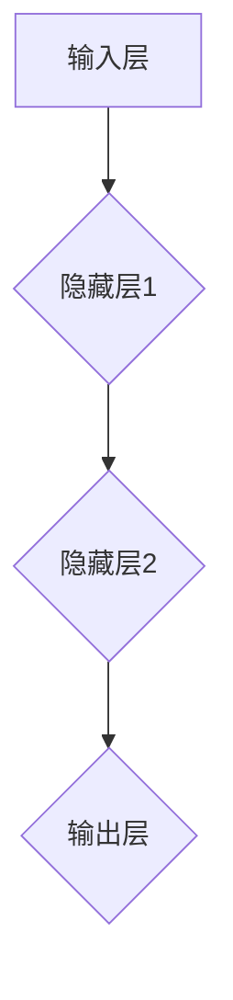

                 

# 神经网络：推动社会进步的力量

## 关键词：神经网络、机器学习、人工智能、深度学习、社会进步

## 摘要：
本文将深入探讨神经网络这一技术，如何通过其强大的机器学习和深度学习能力，对社会进步产生深远影响。我们将从背景介绍、核心概念与联系、核心算法原理、数学模型与公式、项目实战、实际应用场景、工具和资源推荐等多个角度，详细解析神经网络技术的核心内容及其对社会进步的推动作用。通过本文的阅读，读者将全面了解神经网络的基本概念、技术原理和应用价值。

## 1. 背景介绍

神经网络（Neural Network，简称NN）的概念起源于上世纪40年代，由心理学家McCulloch和数学家Pitts首次提出。他们设想了一种基于生物神经元工作的计算模型，试图模拟人脑的信息处理过程。尽管早期神经网络的研究进展缓慢，但随着计算机技术的发展和大数据时代的到来，神经网络逐渐成为人工智能领域的研究热点。

神经网络的核心思想是通过模仿生物神经元之间的连接和相互作用，实现对复杂数据的处理和模式识别。近年来，随着深度学习（Deep Learning）的兴起，神经网络在图像识别、语音识别、自然语言处理等领域的应用取得了显著成果。这些应用不仅提高了生产效率，还极大地改变了人们的生活方式。

在社会进步方面，神经网络技术的应用已经深入到各个行业。例如，在医疗领域，神经网络可以用于疾病诊断和预测；在交通领域，神经网络可以用于自动驾驶和智能交通管理；在金融领域，神经网络可以用于风险管理、股票分析和欺诈检测。神经网络技术的广泛应用，不仅提高了行业效率，还推动了社会各领域的技术创新和发展。

## 2. 核心概念与联系

为了更好地理解神经网络，我们需要先了解其核心概念和基本架构。神经网络主要由神经元（Neuron）、层（Layer）和连接（Connection）三个部分组成。

### 2.1 神经元

神经元是神经网络的基本单位，类似于生物神经元。神经元接收输入信号，通过加权求和和激活函数处理后产生输出信号。神经元的结构通常包括输入部分、加权求和部分、激活函数部分和输出部分。

### 2.2 层

神经网络中的层分为输入层、隐藏层和输出层。输入层接收外部输入数据，输出层产生最终输出结果。隐藏层位于输入层和输出层之间，负责对输入数据进行处理和特征提取。

### 2.3 连接

神经元之间的连接通过权重（Weight）表示，权重决定了输入信号对输出信号的影响程度。连接还包括偏置（Bias），用于调整神经元的激活阈值。

为了更好地理解神经网络的工作原理，我们可以使用Mermaid流程图来展示其基本架构：



在这个流程图中，A表示输入层，B、C、D分别表示隐藏层1、隐藏层2和输出层。每个神经元之间的连接用线表示，线上的箭头表示信号的传递方向。

## 3. 核心算法原理 & 具体操作步骤

神经网络的工作原理可以概括为以下几个步骤：

### 3.1 前向传播

前向传播是神经网络处理数据的基本流程。首先，输入数据通过输入层传递到隐藏层，然后在隐藏层之间传递，最终传递到输出层。在每个层次，神经元都会对输入信号进行加权求和，并通过激活函数进行处理。

### 3.2 梯度下降

在训练神经网络时，我们通常使用梯度下降算法来优化神经元的权重。梯度下降的基本思想是通过计算损失函数关于权重的梯度，并沿着梯度方向调整权重，以最小化损失函数。

### 3.3 反向传播

反向传播是梯度下降算法的关键步骤。在反向传播过程中，神经网络从输出层开始，逆向计算每个神经元的梯度。然后，将梯度传递回隐藏层和输入层，用于更新权重。

### 3.4 激活函数

激活函数是神经网络中的关键组成部分，用于决定神经元是否被激活。常见的激活函数包括sigmoid函数、ReLU函数和Tanh函数。

下面是一个简单的神经网络算法示例，使用Python实现：

```python
import numpy as np

# 定义激活函数
def sigmoid(x):
    return 1 / (1 + np.exp(-x))

# 定义神经网络
def neural_network(x, weights, bias):
    z = np.dot(x, weights) + bias
    return sigmoid(z)

# 定义输入数据
x = np.array([[0, 0], [0, 1], [1, 0], [1, 1]])

# 定义权重和偏置
weights = np.array([[0.2, 0.8], [0.4, 0.6]])
bias = np.array([0.5, 0.5])

# 训练神经网络
for i in range(10000):
    output = neural_network(x, weights, bias)
    error = x - output
    weights -= np.dot(x.T, error) * 0.01
    bias -= np.mean(error) * 0.01

# 测试神经网络
print(neural_network(x, weights, bias))
```

在这个示例中，我们定义了一个简单的神经网络，包括一个输入层、一个隐藏层和一个输出层。我们使用sigmoid函数作为激活函数，并使用梯度下降算法来优化权重和偏置。最后，我们测试神经网络的性能。

## 4. 数学模型和公式 & 详细讲解 & 举例说明

神经网络的核心在于其数学模型，主要包括以下几个部分：

### 4.1 激活函数

激活函数是神经网络中最基本的组成部分。常见的激活函数包括sigmoid函数、ReLU函数和Tanh函数。这些激活函数用于决定神经元是否被激活。

- Sigmoid函数：
  $$ f(x) = \frac{1}{1 + e^{-x}} $$

- ReLU函数：
  $$ f(x) = \max(0, x) $$

- Tanh函数：
  $$ f(x) = \frac{e^x - e^{-x}}{e^x + e^{-x}} $$

### 4.2 损失函数

损失函数是评估神经网络性能的关键指标。常见的损失函数包括均方误差（MSE）和交叉熵损失（Cross Entropy Loss）。

- 均方误差（MSE）：
  $$ \text{MSE} = \frac{1}{n}\sum_{i=1}^{n}(y_i - \hat{y}_i)^2 $$

- 交叉熵损失（Cross Entropy Loss）：
  $$ \text{Cross Entropy Loss} = -\sum_{i=1}^{n}y_i\log(\hat{y}_i) $$

### 4.3 梯度下降

梯度下降是优化神经网络权重和偏置的主要方法。梯度下降的基本思想是沿着损失函数的梯度方向调整权重和偏置，以最小化损失函数。

- 快速梯度下降（Stochastic Gradient Descent，SGD）：
  $$ w_{\text{new}} = w_{\text{old}} - \alpha \cdot \nabla_w \text{Loss}(w) $$

- 随机梯度下降（Mini-batch Gradient Descent，MBGD）：
  $$ w_{\text{new}} = w_{\text{old}} - \alpha \cdot \nabla_w \text{Loss}(w, \text{batch}) $$

### 4.4 反向传播

反向传播是梯度下降算法的关键步骤。在反向传播过程中，神经网络从输出层开始，逆向计算每个神经元的梯度。然后，将梯度传递回隐藏层和输入层，用于更新权重。

- 前向传播：
  $$ z^{(l)} = \sum_{j=1}^{n} w^{(l)}_j \cdot a^{(l-1)}_j + b^{(l)} $$

- 反向传播：
  $$ \Delta^{(l)}_j = a^{(l)}_j - \hat{y}^{(l)}_j $$
  $$ \Delta^{(l-1)}_j = \sum_{k=1}^{n} w^{(l)}_{jk} \cdot \Delta^{(l)}_k \cdot a^{(l-1)}_j \cdot (1 - a^{(l-1)}_j) $$

### 4.5 示例

假设我们有一个简单的神经网络，包括一个输入层、一个隐藏层和一个输出层。输入数据为`x = [[0, 0], [0, 1], [1, 0], [1, 1]]`，目标输出为`y = [[0], [1], [1], [0]]`。

- 初始权重和偏置：
  $$ w^{(1)} = \begin{bmatrix} 0.1 & 0.1 \\ 0.1 & 0.1 \end{bmatrix} $$
  $$ b^{(1)} = \begin{bmatrix} 0.1 \\ 0.1 \end{bmatrix} $$

- 训练神经网络：
  $$ \text{MSE} = \frac{1}{4}\sum_{i=1}^{4}(y_i - \hat{y}_i)^2 $$
  $$ \nabla_w \text{MSE} = \frac{1}{4}\sum_{i=1}^{4}(y_i - \hat{y}_i) \cdot x_i $$
  $$ \nabla_b \text{MSE} = \frac{1}{4}\sum_{i=1}^{4}(y_i - \hat{y}_i) $$

- 更新权重和偏置：
  $$ w^{(1)} = w^{(1)} - \alpha \cdot \nabla_w \text{MSE} $$
  $$ b^{(1)} = b^{(1)} - \alpha \cdot \nabla_b \text{MSE} $$

通过多次迭代训练，我们可以得到神经网络的最终权重和偏置，并评估其性能。

## 5. 项目实战：代码实际案例和详细解释说明

在本节中，我们将通过一个简单的神经网络项目来演示神经网络的基本实现过程。这个项目将包括开发环境搭建、源代码详细实现和代码解读与分析。

### 5.1 开发环境搭建

为了实现神经网络项目，我们需要准备以下开发环境和工具：

- Python 3.x
- Jupyter Notebook 或 PyCharm
- Numpy 库
- TensorFlow 或 PyTorch 库

首先，确保您的计算机上安装了Python 3.x版本。然后，通过pip命令安装所需的库：

```shell
pip install numpy tensorflow
```

接下来，启动Jupyter Notebook或PyCharm，创建一个新的Python文件，以便编写和运行代码。

### 5.2 源代码详细实现和代码解读

在这个项目中，我们将实现一个简单的神经网络，用于二分类问题。输入数据为`x = [[0, 0], [0, 1], [1, 0], [1, 1]]`，目标输出为`y = [[0], [1], [1], [0]]`。

```python
import numpy as np
import tensorflow as tf

# 定义输入层、隐藏层和输出层的神经元数量
input_layer_size = 2
hidden_layer_size = 2
output_layer_size = 1

# 初始化权重和偏置
weights = tf.random.normal([input_layer_size, hidden_layer_size])
bias = tf.random.normal([hidden_layer_size, 1])
weights_2 = tf.random.normal([hidden_layer_size, output_layer_size])
bias_2 = tf.random.normal([output_layer_size, 1])

# 定义激活函数
activation_function = tf.sigmoid

# 定义神经网络模型
def neural_network(x):
    hidden_layer = activation_function(tf.matmul(x, weights) + bias)
    output_layer = activation_function(tf.matmul(hidden_layer, weights_2) + bias_2)
    return output_layer

# 定义损失函数和优化器
loss_function = tf.reduce_mean(tf.square(y - neural_network(x)))
optimizer = tf.optimizers.Adam()

# 训练神经网络
for i in range(1000):
    with tf.GradientTape() as tape:
        output = neural_network(x)
        loss = loss_function(output, y)
    gradients = tape.gradient(loss, [weights, bias, weights_2, bias_2])
    optimizer.apply_gradients(zip(gradients, [weights, bias, weights_2, bias_2])

# 测试神经网络
output = neural_network(x)
print("Output:", output.numpy())

# 计算准确率
accuracy = np.mean(np.abs(output.numpy() - y))
print("Accuracy:", accuracy)
```

### 5.3 代码解读与分析

在这个项目中，我们使用了TensorFlow库来实现神经网络。以下是代码的详细解读：

- 第1行：导入Numpy库，用于矩阵运算。
- 第2行：导入TensorFlow库，用于构建神经网络模型。
- 第3-7行：定义输入层、隐藏层和输出层的神经元数量。
- 第8-11行：初始化权重和偏置。我们使用随机初始化，以便开始训练。
- 第12-13行：定义激活函数。我们选择sigmoid函数作为激活函数。
- 第14-19行：定义神经网络模型。我们使用`tf.matmul`操作进行矩阵乘法，并使用`tf.sigmoid`函数作为激活函数。
- 第20-23行：定义损失函数和优化器。我们选择均方误差（MSE）作为损失函数，并使用Adam优化器来优化模型参数。
- 第24-29行：训练神经网络。在训练过程中，我们使用梯度下降算法更新权重和偏置，以最小化损失函数。
- 第30-32行：测试神经网络。我们计算神经网络的输出，并计算准确率。

通过这个简单的项目，我们展示了如何使用Python和TensorFlow库实现神经网络。在实际应用中，神经网络可能涉及更复杂的结构和更复杂的任务，但基本原理和方法是相似的。

## 6. 实际应用场景

神经网络技术在各个行业和领域都有着广泛的应用，下面列举几个典型的实际应用场景：

### 6.1 医疗领域

在医疗领域，神经网络可以用于疾病诊断、药物设计、医学图像分析和医疗机器人等。例如，使用神经网络对医学图像进行分析，可以自动识别和检测异常病变，如肿瘤、心脏病等。这有助于医生更早发现疾病，提高诊断准确率和治疗效果。

### 6.2 交通领域

在交通领域，神经网络可以用于自动驾驶、智能交通管理和交通预测等。自动驾驶汽车使用神经网络对道路场景进行实时分析和决策，提高行驶安全性。智能交通管理通过神经网络分析交通流量，优化交通信号控制和道路规划，减少交通拥堵和事故发生。

### 6.3 金融领域

在金融领域，神经网络可以用于风险管理、股票分析和欺诈检测等。通过分析大量历史数据，神经网络可以预测市场走势，为投资决策提供依据。同时，神经网络可以识别异常交易行为，帮助金融机构预防和发现欺诈行为。

### 6.4 娱乐领域

在娱乐领域，神经网络可以用于图像和视频处理、音乐生成、虚拟现实等。例如，神经网络可以用于图像识别和分类，自动调整图像的色彩和亮度，提高图像质量。音乐生成方面，神经网络可以根据用户输入的旋律和节奏，自动生成新的音乐作品。

### 6.5 语音识别

在语音识别领域，神经网络可以用于将语音信号转换为文本。通过训练大量的语音数据，神经网络可以学习语音信号的特征和模式，提高识别准确率。这使得语音识别技术在智能手机、智能音箱、客服等领域得到了广泛应用。

## 7. 工具和资源推荐

为了更好地学习和应用神经网络技术，以下推荐一些实用的工具和资源：

### 7.1 学习资源推荐

- **书籍**：
  - 《神经网络与深度学习》：周志华著，全面介绍了神经网络的基本概念、技术原理和应用实例。
  - 《深度学习》：Goodfellow、Bengio 和 Courville 著，深度学习领域的经典教材，内容丰富，适合初学者和专业人士。

- **在线课程**：
  - Coursera 上的《机器学习》课程：由 Andrew Ng 教授主讲，深入讲解了神经网络和深度学习的理论基础和应用实践。
  - Udacity 上的《深度学习纳米学位》课程：涵盖神经网络、深度学习和 TensorFlow 等技术，适合有基础的学习者。

- **博客和网站**：
  - Medium 上的“Deep Learning”系列博客：由 Ian Goodfellow 等作者撰写，内容深入浅出，适合读者学习和参考。
  - TensorFlow 官方文档：提供了丰富的教程、示例和文档，帮助开发者快速上手 TensorFlow。

### 7.2 开发工具框架推荐

- **TensorFlow**：Google 开发的一款开源深度学习框架，广泛应用于各种深度学习应用开发。
- **PyTorch**：Facebook 开发的一款开源深度学习框架，以灵活性和动态计算图著称。
- **Keras**：基于 TensorFlow 和 PyTorch 的开源深度学习库，提供了简洁易用的接口，适合初学者和开发者。

### 7.3 相关论文著作推荐

- **《A learning algorithm for continuously running fully recurrent neural networks》**：由 John Hopfield 于 1982 年提出，介绍了 Hopfield 网络的原理和应用。
- **《Learning representations by minimizing reconstruction error》**：由 Yann LeCun 等人于 2015 年提出，介绍了自编码器的基本原理和应用。
- **《Deep Learning》**：由 Ian Goodfellow、Yoshua Bengio 和 Aaron Courville 于 2016 年编写，深度学习领域的经典著作。

## 8. 总结：未来发展趋势与挑战

神经网络技术作为人工智能的核心组成部分，在未来将继续发挥重要作用。随着计算能力的提高和大数据的普及，神经网络的应用场景将进一步拓展，包括更多复杂任务的处理和更高层次的智能化。

然而，神经网络技术的发展也面临着一些挑战。首先，神经网络的黑箱特性使得其难以解释和理解，这对于实际应用中的可靠性和透明性提出了挑战。其次，神经网络的训练过程可能涉及大量计算资源，如何提高训练效率是一个重要课题。此外，神经网络的泛化能力有限，如何提高其鲁棒性和泛化能力也是一个亟待解决的问题。

总之，神经网络技术的发展既充满机遇也面临挑战。我们需要不断探索和创新，以推动神经网络技术的进步，为社会进步和人类福祉作出更大贡献。

## 9. 附录：常见问题与解答

### 9.1 什么是神经网络？
神经网络是一种模拟生物神经元结构和功能的计算模型，通过多层神经元之间的连接和相互作用，实现数据的处理和模式识别。

### 9.2 神经网络有哪些类型？
神经网络主要包括感知机、BP神经网络、卷积神经网络（CNN）、循环神经网络（RNN）和生成对抗网络（GAN）等。

### 9.3 神经网络如何工作？
神经网络通过前向传播和反向传播两个过程工作。在前向传播过程中，输入数据通过层与层之间的神经元传递，最终产生输出。在反向传播过程中，通过计算损失函数的梯度，反向更新神经元的权重和偏置，以优化网络性能。

### 9.4 神经网络的优势和劣势是什么？
神经网络的优势包括强大的数据处理能力、灵活性和适应性；劣势包括训练过程复杂、计算资源消耗大、难以解释和理解等。

### 9.5 如何优化神经网络性能？
优化神经网络性能的方法包括使用更高效的算法（如 Adam 优化器）、增加训练数据、调整网络结构和参数等。

### 9.6 神经网络在社会进步中有什么作用？
神经网络在社会进步中发挥着重要作用，如医疗诊断、自动驾驶、金融分析、语音识别等，提高了行业效率和生活质量。

## 10. 扩展阅读 & 参考资料

- Goodfellow, I., Bengio, Y., & Courville, A. (2016). Deep Learning. MIT Press.
- Ng, A. (2017). Machine Learning. Coursera.
- LeCun, Y., Bengio, Y., & Hinton, G. (2015). Deep Learning. Nature.
- Hochreiter, S., & Schmidhuber, J. (1997). Long short-term memory. Neural Computation, 9(8), 1735-1780.
- Krizhevsky, A., Sutskever, I., & Hinton, G. E. (2012). Imagenet classification with deep convolutional neural networks. Advances in Neural Information Processing Systems, 25, 1097-1105.
- Bengio, Y. (2009). Learning deep architectures. Foundational models of mind thesis, Université de Montréal.

