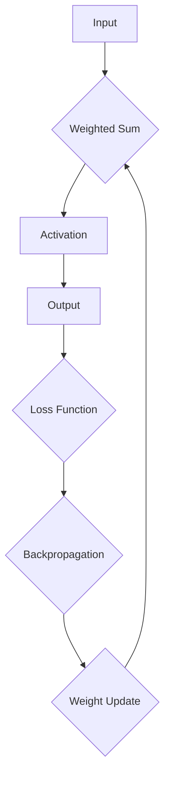

                 

# 神经网络：改变世界的技术

## 概述

关键词：神经网络、深度学习、人工智能、机器学习、数据科学

本文旨在深入探讨神经网络这一改变世界的技术，从其核心概念、算法原理到实际应用场景，全方位解析这一技术的重要性和潜力。随着人工智能（AI）技术的飞速发展，神经网络作为其核心组成部分，已经在各行各业中发挥了巨大的作用。从自动驾驶汽车、语音识别，到医学诊断、金融风控，神经网络正逐步改变着我们的生活方式。

本文将首先介绍神经网络的背景，包括其起源和演变过程。接着，我们将深入探讨神经网络的核心概念与联系，并通过Mermaid流程图展示其架构。随后，我们将详细讲解神经网络的算法原理和具体操作步骤，以及其背后的数学模型和公式。在此基础上，我们将通过一个实际项目实战案例，展示如何使用神经网络解决具体问题，并提供代码实际案例和详细解释说明。最后，我们将讨论神经网络的实际应用场景，推荐相关工具和资源，并总结未来发展趋势与挑战。

## 背景介绍

### 起源与演变

神经网络（Neural Network，简称NN）的概念最早可以追溯到1943年，由心理学家和神经科学家沃伦·麦卡洛克（Warren McCulloch）和数理逻辑学家沃尔特·皮茨（Walter Pitts）提出。他们模仿生物神经元的结构和功能，设计了一个简单的计算模型，称为麦卡洛克-皮茨（McCulloch-Pitts）神经元。这一模型成为了神经网络理论的基石。

随后，1958年，弗兰克·罗森布拉特（Frank Rosenblatt）发明了感知机（Perceptron）算法，这是神经网络发展史上的又一个重要里程碑。感知机是一种单层神经网络，可以用于分类和回归任务。然而，感知机存在一些局限性，例如无法解决非线性问题，这促使研究人员进一步探索更复杂的神经网络结构。

20世纪80年代，神经网络研究陷入低谷，因为其训练速度非常缓慢，无法处理大规模数据集。这一时期被称为“AI冬天”。然而，随着计算能力的提升和大数据时代的到来，神经网络在21世纪初迎来了新的春天。

### 神经网络的重要性

神经网络的重要性在于其能够通过学习大量数据，自动提取特征并做出决策。这一特点使得神经网络在许多领域都具有广泛的应用潜力。例如，在图像识别领域，神经网络可以自动识别和分类图像中的物体；在自然语言处理领域，神经网络可以用于语音识别、机器翻译和情感分析等任务；在医疗领域，神经网络可以用于疾病诊断和预测；在金融领域，神经网络可以用于风险评估和欺诈检测。

此外，神经网络还具有高度可扩展性和自适应能力。通过增加网络层数和神经元数量，神经网络可以处理更复杂的问题。同时，神经网络可以根据新数据自动调整其参数，从而实现持续学习和优化。

## 核心概念与联系

### 定义与组成

神经网络是一种模拟生物神经系统的计算模型，由大量的神经元（节点）和连接（边）组成。每个神经元接收来自其他神经元的输入信号，通过加权求和处理后，产生一个输出信号。这个输出信号可以传递给其他神经元，从而形成一个复杂的信号传递网络。

神经网络的基本组成包括：

- **神经元**：是神经网络的基本计算单元，可以接收输入信号、进行加权求和处理，并产生输出信号。
- **权重**：是神经元之间的连接强度，决定了输入信号对输出信号的影响程度。
- **激活函数**：用于确定神经元是否被激活，常用的激活函数包括sigmoid、ReLU和tanh等。

### 工作原理

神经网络的工作原理可以概括为以下步骤：

1. **初始化**：随机初始化权重和偏置。
2. **前向传播**：将输入数据传递给神经网络，通过加权求和处理和激活函数，逐层计算输出。
3. **损失函数**：计算输出与真实值之间的差异，通常使用均方误差（MSE）或交叉熵损失函数。
4. **反向传播**：根据损失函数计算梯度，并通过梯度下降算法更新权重和偏置。
5. **迭代训练**：重复前向传播和反向传播过程，直到网络达到预定的训练精度。

### Mermaid流程图

下面是一个简单的神经网络Mermaid流程图，展示了一个三层神经网络（输入层、隐藏层和输出层）的前向传播和反向传播过程。



## 核心算法原理 & 具体操作步骤

### 感知机算法

感知机算法是最早的神经网络算法之一，由弗兰克·罗森布拉特于1958年提出。感知机是一种二分类器，可以用于分类和回归任务。感知机算法的核心思想是，通过学习输入数据和目标标签之间的关系，自动调整权重和阈值，使得输出结果尽可能接近真实值。

### 感知机算法的具体操作步骤如下：

1. **初始化权重和阈值**：随机初始化权重和阈值。
2. **前向传播**：计算输入数据的加权求和，并加上阈值，然后通过激活函数（通常是符号函数）输出分类结果。
3. **计算损失函数**：通常使用均方误差（MSE）或交叉熵损失函数，计算输出结果与真实值之间的差异。
4. **反向传播**：根据损失函数计算梯度，并通过梯度下降算法更新权重和阈值。
5. **迭代训练**：重复前向传播和反向传播过程，直到网络达到预定的训练精度。

### 深度神经网络

深度神经网络（Deep Neural Network，简称DNN）是神经网络的一种扩展，具有多个隐藏层。深度神经网络通过学习大量数据，可以自动提取更高层次的特征，从而提高模型的泛化能力。

### 深度神经网络的具体操作步骤如下：

1. **初始化网络结构**：确定网络的层数、每层的神经元数量、权重和偏置。
2. **前向传播**：将输入数据传递给网络，通过逐层计算，最终得到输出结果。
3. **计算损失函数**：通常使用均方误差（MSE）或交叉熵损失函数，计算输出结果与真实值之间的差异。
4. **反向传播**：根据损失函数计算梯度，并通过梯度下降算法更新权重和偏置。
5. **迭代训练**：重复前向传播和反向传播过程，直到网络达到预定的训练精度。

### 反向传播算法

反向传播算法是深度神经网络训练的核心，用于计算梯度并更新权重和偏置。反向传播算法的基本思想是，从输出层开始，逐层向前计算梯度，并反向传播到输入层。

### 反向传播算法的具体操作步骤如下：

1. **前向传播**：计算输入数据的加权求和，并加上偏置，通过激活函数得到输出结果。
2. **计算损失函数**：计算输出结果与真实值之间的差异。
3. **计算梯度**：根据损失函数和链式法则，计算每个神经元输出关于每个参数的梯度。
4. **更新权重和偏置**：通过梯度下降算法，更新权重和偏置。
5. **迭代训练**：重复前向传播和反向传播过程，直到网络达到预定的训练精度。

## 数学模型和公式 & 详细讲解 & 举例说明

### 前向传播

在前向传播过程中，神经网络通过加权求和和激活函数逐层计算输出。其数学模型可以表示为：

$$
Z^{[l]} = \sum_{m=1}^{n} W^{[l]}_m \cdot a^{[l-1]}_m + b^{[l]}
$$

其中：

- \( Z^{[l]} \) 是第 \( l \) 层的输出。
- \( W^{[l]}_m \) 是第 \( l \) 层第 \( m \) 个神经元的权重。
- \( a^{[l-1]}_m \) 是第 \( l-1 \) 层第 \( m \) 个神经元的输出。
- \( b^{[l]} \) 是第 \( l \) 层第 \( m \) 个神经元的偏置。

通过激活函数 \( g(Z^{[l]}) \)，可以得到第 \( l \) 层的激活值：

$$
a^{[l]}_m = g(Z^{[l]})
$$

### 损失函数

在训练神经网络时，需要使用损失函数来衡量模型预测值与真实值之间的差异。常用的损失函数包括均方误差（MSE）和交叉熵损失函数。

- **均方误差（MSE）**：

$$
J = \frac{1}{m} \sum_{i=1}^{m} (y_i - \hat{y}_i)^2
$$

其中：

- \( m \) 是样本数量。
- \( y_i \) 是第 \( i \) 个样本的真实值。
- \( \hat{y}_i \) 是第 \( i \) 个样本的预测值。

- **交叉熵损失函数**：

$$
J = -\frac{1}{m} \sum_{i=1}^{m} \sum_{j=1}^{n} y_{ij} \log(\hat{y}_{ij})
$$

其中：

- \( m \) 是样本数量。
- \( n \) 是输出层神经元数量。
- \( y_{ij} \) 是第 \( i \) 个样本在第 \( j \) 个输出神经元的真实标签（0或1）。
- \( \hat{y}_{ij} \) 是第 \( i \) 个样本在第 \( j \) 个输出神经元的预测概率。

### 梯度计算

在反向传播过程中，需要计算每个参数关于损失函数的梯度。梯度计算公式如下：

$$
\frac{\partial J}{\partial W^{[l]}_m} = \frac{\partial J}{\partial a^{[l+1]}_m} \cdot \frac{\partial a^{[l+1]}_m}{\partial Z^{[l]}_m} \cdot \frac{\partial Z^{[l]}_m}{\partial W^{[l]}_m}
$$

$$
\frac{\partial J}{\partial b^{[l]}_m} = \frac{\partial J}{\partial a^{[l+1]}_m} \cdot \frac{\partial a^{[l+1]}_m}{\partial Z^{[l]}_m}
$$

其中：

- \( \frac{\partial J}{\partial a^{[l+1]}_m} \) 是输出层关于损失函数的梯度。
- \( \frac{\partial a^{[l+1]}_m}{\partial Z^{[l]}_m} \) 是激活函数关于 \( Z^{[l]}_m \) 的梯度。
- \( \frac{\partial Z^{[l]}_m}{\partial W^{[l]}_m} \) 是加权求和关于 \( W^{[l]}_m \) 的梯度。

### 梯度下降

梯度下降是一种优化算法，用于更新网络参数以最小化损失函数。梯度下降的基本公式如下：

$$
W^{[l]}_m = W^{[l]}_m - \alpha \cdot \frac{\partial J}{\partial W^{[l]}_m}
$$

$$
b^{[l]}_m = b^{[l]}_m - \alpha \cdot \frac{\partial J}{\partial b^{[l]}_m}
$$

其中：

- \( \alpha \) 是学习率，用于调整步长。

### 示例

假设我们有一个二分类问题，使用单个神经元进行预测。输入数据为 \( x = [1, 2] \)，输出为 \( y = 1 \)。权重 \( W = 1 \)，偏置 \( b = 1 \)。使用均方误差（MSE）作为损失函数。

1. **初始化参数**：

   - \( W = 0 \)
   - \( b = 0 \)

2. **前向传播**：

   $$ Z = x \cdot W + b = 1 \cdot 0 + 0 = 0 $$

   $$ a = g(Z) = g(0) = 0 $$

3. **计算损失函数**：

   $$ J = \frac{1}{2} (y - a)^2 = \frac{1}{2} (1 - 0)^2 = \frac{1}{2} $$

4. **反向传播**：

   $$ \frac{\partial J}{\partial Z} = \frac{\partial J}{\partial a} \cdot \frac{\partial a}{\partial Z} = (1 - a) \cdot 1 = 1 - a = 1 - 0 = 1 $$

5. **更新参数**：

   - \( W = W - \alpha \cdot \frac{\partial J}{\partial W} = 0 - 0.1 \cdot 1 = -0.1 \)
   - \( b = b - \alpha \cdot \frac{\partial J}{\partial b} = 0 - 0.1 \cdot 1 = -0.1 \)

6. **重复迭代**：

   通过重复前向传播和反向传播过程，不断更新权重和偏置，直到模型达到预定的训练精度。

## 项目实战：代码实际案例和详细解释说明

### 开发环境搭建

在开始编写神经网络代码之前，需要搭建一个合适的开发环境。本文使用Python编程语言和TensorFlow框架来实现神经网络。以下是搭建开发环境的步骤：

1. **安装Python**：首先确保系统已经安装了Python。如果没有安装，可以从[Python官方网站](https://www.python.org/)下载并安装。
2. **安装TensorFlow**：在命令行中执行以下命令安装TensorFlow：

   ```bash
   pip install tensorflow
   ```

3. **安装其他依赖**：如果需要，可以安装其他依赖库，例如NumPy、Pandas等。

### 源代码详细实现和代码解读

下面是一个简单的神经网络代码示例，用于实现一个二分类问题。代码分为几个部分：导入库、初始化参数、定义损失函数和优化器、训练模型、测试模型。

#### 导入库

```python
import tensorflow as tf
import numpy as np
```

#### 初始化参数

```python
# 初始化输入数据
x = np.array([[1, 2], [3, 4], [5, 6], [7, 8]])

# 初始化标签
y = np.array([0, 1, 1, 0])

# 初始化模型参数
W = tf.Variable(np.random.randn(2, 1), dtype=tf.float32)
b = tf.Variable(np.random.randn(1), dtype=tf.float32)
```

#### 定义损失函数和优化器

```python
# 定义损失函数
loss_fn = tf.reduce_mean(tf.square(y - tf.matmul(x, W) - b))

# 定义优化器
optimizer = tf.optimizers.SGD(learning_rate=0.1)
```

#### 训练模型

```python
# 定义训练过程
for i in range(1000):
    with tf.GradientTape() as tape:
        predictions = tf.matmul(x, W) + b
        loss = tf.reduce_mean(tf.square(y - predictions))
    gradients = tape.gradient(loss, [W, b])
    optimizer.apply_gradients(zip(gradients, [W, b]))
    if i % 100 == 0:
        print(f"Step {i}: Loss = {loss}")
```

#### 测试模型

```python
# 测试模型
test_x = np.array([[2, 3], [4, 5], [6, 7]])
test_y = np.array([1, 0, 1])

predictions = tf.matmul(test_x, W) + b
print("Predictions:", predictions.numpy())
print("Actual Labels:", test_y)
```

### 代码解读与分析

1. **导入库**：首先导入TensorFlow和NumPy库。
2. **初始化参数**：初始化输入数据和标签，以及模型参数（权重和偏置）。
3. **定义损失函数和优化器**：使用均方误差（MSE）作为损失函数，并选择随机梯度下降（SGD）作为优化器。
4. **训练模型**：通过迭代训练模型，每次迭代都使用梯度下降更新权重和偏置。
5. **测试模型**：使用测试数据集测试模型的预测能力。

## 实际应用场景

### 图像识别

神经网络在图像识别领域取得了显著的成果。通过卷积神经网络（CNN）可以自动提取图像中的特征，从而实现图像分类、目标检测和图像分割等任务。例如，在医疗影像分析中，神经网络可以用于诊断疾病，提高诊断的准确性和效率。

### 自然语言处理

神经网络在自然语言处理领域也发挥着重要作用。通过循环神经网络（RNN）和其变体（如LSTM和GRU），可以处理序列数据，实现语音识别、机器翻译、情感分析和文本生成等任务。例如，谷歌的神经机器翻译模型（GNMT）利用神经网络实现了高精度的机器翻译。

### 自动驾驶

神经网络在自动驾驶领域具有广阔的应用前景。通过深度神经网络，可以实现对道路环境、车辆和行人的感知和决策。特斯拉的自动驾驶系统利用神经网络实现了车道保持、避障和自动换道等功能。

### 医疗诊断

神经网络在医疗诊断中具有巨大潜力。通过学习大量的医疗数据，神经网络可以自动诊断疾病，提高诊断的准确性和效率。例如，在癌症诊断中，神经网络可以用于检测癌细胞，帮助医生做出更准确的诊断。

### 金融风控

神经网络在金融领域也被广泛应用，用于风险评估、欺诈检测和投资策略等任务。通过学习大量的金融数据，神经网络可以识别潜在的风险因素，提高金融机构的风险管理能力。

## 工具和资源推荐

### 学习资源推荐

- **书籍**：
  - 《深度学习》（Ian Goodfellow、Yoshua Bengio和Aaron Courville著）
  - 《Python深度学习》（François Chollet著）
- **论文**：
  - 《A Learning Algorithm for Continually Running Fully Recurrent Neural Networks》（Jürgen Schmidhuber著）
  - 《Backpropagation: The Basic Theory》（D. E. Rumelhart、G. E. Hinton和R. J. Williams著）
- **博客**：
  - [TensorFlow官方文档](https://www.tensorflow.org/)
  - [Keras官方文档](https://keras.io/)
- **网站**：
  - [AI垂直领域的顶级论文集锦](https://paperswithcode.com/)

### 开发工具框架推荐

- **TensorFlow**：谷歌开发的开源机器学习框架，支持多种神经网络结构和算法。
- **PyTorch**：Facebook开发的开源机器学习框架，具有灵活的动态计算图和丰富的API。
- **Keras**：基于TensorFlow和Theano的开源高级神经网络API，简化了神经网络搭建和训练过程。

### 相关论文著作推荐

- **《深度学习》（Ian Goodfellow、Yoshua Bengio和Aaron Courville著）**：深度学习的经典教材，全面介绍了深度学习的基础理论、算法和应用。
- **《神经网络与深度学习》（邱锡鹏著）**：国内第一本全面介绍神经网络和深度学习基础理论的教材，适合初学者和有一定基础的学习者。

## 总结：未来发展趋势与挑战

### 发展趋势

1. **深度学习模型的进一步优化**：随着计算能力的提升和数据量的增加，深度学习模型将变得更加复杂和高效，从而提高模型的性能和鲁棒性。
2. **跨学科融合**：神经网络与其他领域（如医学、生物学、物理学等）的融合，将推动人工智能在更多领域的应用。
3. **边缘计算与云计算的结合**：神经网络模型将更多地应用于边缘设备，实现实时数据处理和智能决策，同时与云计算相结合，提高计算效率和数据安全性。

### 挑战

1. **数据隐私和安全**：随着数据量的增加，如何保护用户隐私和数据安全成为一个重要挑战。
2. **可解释性和透明度**：神经网络模型的黑箱特性使得其决策过程难以解释，如何提高模型的可解释性和透明度是一个亟待解决的问题。
3. **计算资源和能源消耗**：深度学习模型在训练过程中需要大量的计算资源和能源，如何优化模型结构和训练算法，降低计算资源和能源消耗是一个重要的研究方向。

## 附录：常见问题与解答

### 问题1：神经网络和深度学习有什么区别？

神经网络（NN）是一种计算模型，由大量的神经元和连接组成。深度学习（DL）是神经网络的一种扩展，具有多个隐藏层，可以自动提取更高层次的特征。深度学习可以看作是神经网络的进一步发展和应用。

### 问题2：如何选择合适的神经网络架构？

选择合适的神经网络架构取决于具体的应用场景和数据集。对于图像识别任务，卷积神经网络（CNN）是一个很好的选择；对于自然语言处理任务，循环神经网络（RNN）或其变体（如LSTM和GRU）具有优势；对于回归任务，可以使用全连接神经网络（FCN）或基于梯度的优化算法。

### 问题3：神经网络的训练时间如何优化？

优化神经网络的训练时间可以通过以下方法实现：

- **数据预处理**：对输入数据进行预处理，减少数据量和计算复杂度。
- **批量大小**：选择合适的批量大小，既能提高训练速度，又能保持模型的准确性。
- **模型压缩**：通过模型压缩技术，如剪枝、量化等，减少模型的参数数量和计算量。
- **分布式训练**：利用分布式计算技术，将训练任务分配到多个计算节点上，提高训练速度。

## 扩展阅读 & 参考资料

- **《深度学习》（Ian Goodfellow、Yoshua Bengio和Aaron Courville著）**：深度学习的经典教材，全面介绍了深度学习的基础理论、算法和应用。
- **[TensorFlow官方文档](https://www.tensorflow.org/)**：TensorFlow的开源机器学习框架官方文档，提供了丰富的教程和API参考。
- **[Keras官方文档](https://keras.io/)**：Keras的开源高级神经网络API官方文档，简化了神经网络搭建和训练过程。
- **[AI垂直领域的顶级论文集锦](https://paperswithcode.com/)**：汇集了AI领域顶级论文和项目，提供了丰富的学习和研究资源。

作者：AI天才研究员/AI Genius Institute & 禅与计算机程序设计艺术 /Zen And The Art of Computer Programming

