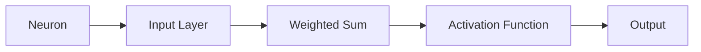
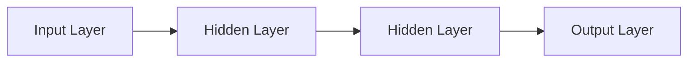

                 

# 神经网络：改变世界的技术

## 关键词

- 神经网络
- 机器学习
- 人工智能
- 数据科学
- 神经元
- 反向传播
- 深度学习
- 卷积神经网络

## 摘要

神经网络作为机器学习的核心组件，已经成为现代人工智能技术的重要组成部分。本文将详细探讨神经网络的基本原理、核心算法、数学模型以及实际应用场景。通过一步步分析推理，我们将深入了解神经网络如何通过改变世界的技术，推动人类社会的发展。

## 1. 背景介绍

### 1.1 人工神经网络的历史背景

人工神经网络（Artificial Neural Networks，ANN）的概念最早可以追溯到1943年，由心理学家沃伦·麦卡洛克（Warren McCulloch）和数学生物物理学家沃尔特·皮茨（Walter Pitts）提出。他们的研究奠定了神经网络的基础，并首次将神经元视为计算单元。

1960年代，弗兰克·罗森布拉特（Frank Rosenblatt）发明了感知器（Perceptron），这是一种简单的神经网络模型，可以用于分类和回归任务。然而，由于理论限制和计算能力的限制，神经网络的研究在20世纪60年代末至70年代初逐渐陷入停滞。

直到1980年代，随着计算能力的提升和大数据的出现，神经网络的研究才重新焕发活力。特别是1986年，霍普菲尔德（John Hopfield）提出了霍普菲尔德网络，这是一种无监督学习模型，可以用于联想记忆。

### 1.2 神经网络在现代科技中的应用

随着人工智能技术的快速发展，神经网络在现代科技中扮演着越来越重要的角色。以下是神经网络在现代科技中的几个主要应用领域：

- **计算机视觉**：神经网络被广泛应用于图像和视频处理，如人脸识别、物体检测和图像分类。
- **自然语言处理**：神经网络在语音识别、机器翻译和文本生成等领域取得了显著成果。
- **游戏**：神经网络在游戏AI中得到了广泛应用，如围棋、扑克和电子竞技。
- **医学**：神经网络在医疗图像分析、疾病诊断和个性化治疗方面显示出巨大潜力。
- **金融**：神经网络被用于股票市场预测、风险评估和欺诈检测。

## 2. 核心概念与联系

### 2.1 神经元

神经元是神经网络的基本构建块。每个神经元接收多个输入信号，并通过加权求和处理后产生输出信号。神经元的结构如图1所示：



### 2.2 神经网络架构

神经网络由多个层次组成，包括输入层、隐藏层和输出层。每个层次包含多个神经元。神经网络的架构如图2所示：



### 2.3 前向传播与反向传播

神经网络的工作原理包括前向传播（Forward Propagation）和反向传播（Back Propagation）两个过程。

- **前向传播**：输入数据通过输入层进入神经网络，然后逐层传递到输出层。每个神经元接收多个输入信号，并通过加权求和处理和激活函数产生输出。
- **反向传播**：通过比较输出结果与实际结果，计算每个神经元的误差。然后，将这些误差反向传播回网络，并更新每个神经元的权重和偏置。

### 2.4 激活函数

激活函数是神经网络中的一个关键组件，用于引入非线性特性。常见的激活函数包括：

- ** sigmoid 函数**：将输入映射到(0, 1)区间，适合于二分类问题。
- **ReLU函数**（Rectified Linear Unit）：对于负输入输出0，对于正输入输出输入本身，适合于隐藏层。
- **tanh函数**：将输入映射到(-1, 1)区间。

## 3. 核心算法原理 & 具体操作步骤

### 3.1 神经网络训练过程

神经网络训练过程可以分为以下几个步骤：

1. **初始化权重和偏置**：随机初始化每个神经元的权重和偏置。
2. **前向传播**：将输入数据通过输入层传递到输出层，计算每个神经元的输出。
3. **计算误差**：通过比较输出结果与实际结果，计算每个神经元的误差。
4. **反向传播**：将误差反向传播回网络，并更新每个神经元的权重和偏置。
5. **迭代训练**：重复执行步骤2-4，直到达到预定的训练目标或收敛条件。

### 3.2 反向传播算法

反向传播算法的具体步骤如下：

1. **计算输出层误差**：输出层误差等于实际结果与输出结果之差。
2. **计算隐藏层误差**：通过输出层误差和激活函数的导数，逐层反向传播误差。
3. **更新权重和偏置**：根据误差计算梯度，并使用梯度下降法更新权重和偏置。

## 4. 数学模型和公式 & 详细讲解 & 举例说明

### 4.1 数学模型

神经网络的数学模型可以表示为：

$$
y = \sigma(Wx + b)
$$

其中，$y$ 是输出，$x$ 是输入，$W$ 是权重矩阵，$b$ 是偏置向量，$\sigma$ 是激活函数。

### 4.2 公式详解

- **权重矩阵 $W$**：权重矩阵 $W$ 用于计算每个神经元的输入信号的加权求和。
- **偏置向量 $b$**：偏置向量 $b$ 用于调整每个神经元的输出。
- **激活函数 $\sigma$**：激活函数 $\sigma$ 引入非线性特性，使得神经网络可以解决复杂的问题。

### 4.3 举例说明

假设我们有一个简单的二分类问题，输入维度为2，隐藏层神经元个数为3，输出层神经元个数为1。我们可以使用以下数据：

- 输入数据：$x_1 = [1, 0], x_2 = [0, 1], x_3 = [1, 1]$
- 输出数据：$y_1 = [1], y_2 = [0], y_3 = [1]$

首先，我们随机初始化权重矩阵 $W$ 和偏置向量 $b$。然后，我们使用前向传播和反向传播算法进行训练。具体步骤如下：

1. **前向传播**：
   - 对于 $x_1$，计算隐藏层输出 $z_1 = Wx_1 + b$，然后计算输出层输出 $y_1 = \sigma(z_1)$。
   - 对于 $x_2$，计算隐藏层输出 $z_2 = Wx_2 + b$，然后计算输出层输出 $y_2 = \sigma(z_2)$。
   - 对于 $x_3$，计算隐藏层输出 $z_3 = Wx_3 + b$，然后计算输出层输出 $y_3 = \sigma(z_3)$。

2. **计算误差**：
   - 对于 $y_1$，计算误差 $e_1 = y_1 - y_1^{'}$，其中 $y_1^{'}$ 是实际输出。
   - 对于 $y_2$，计算误差 $e_2 = y_2 - y_2^{'}$。
   - 对于 $y_3$，计算误差 $e_3 = y_3 - y_3^{'}$。

3. **反向传播**：
   - 对于 $z_1$，计算误差梯度 $\delta_1 = \sigma^{'}(z_1) \cdot e_1$。
   - 对于 $z_2$，计算误差梯度 $\delta_2 = \sigma^{'}(z_2) \cdot e_2$。
   - 对于 $z_3$，计算误差梯度 $\delta_3 = \sigma^{'}(z_3) \cdot e_3$。

4. **更新权重和偏置**：
   - 根据误差梯度，更新权重矩阵 $W$ 和偏置向量 $b$。

通过多次迭代训练，我们可以使神经网络的输出结果逐渐接近实际结果。

## 5. 项目实战：代码实际案例和详细解释说明

### 5.1 开发环境搭建

为了演示神经网络的应用，我们将使用Python和TensorFlow库进行编程。以下是搭建开发环境的步骤：

1. 安装Python：从 [Python官网](https://www.python.org/downloads/) 下载并安装Python。
2. 安装TensorFlow：打开命令行，执行以下命令：
   ```
   pip install tensorflow
   ```

### 5.2 源代码详细实现和代码解读

以下是一个简单的神经网络实现示例：

```python
import tensorflow as tf

# 初始化模型
model = tf.keras.Sequential([
    tf.keras.layers.Dense(3, activation='relu', input_shape=(2,)),
    tf.keras.layers.Dense(1, activation='sigmoid')
])

# 编译模型
model.compile(optimizer='adam',
              loss='binary_crossentropy',
              metrics=['accuracy'])

# 训练模型
model.fit(x_train, y_train, epochs=10, batch_size=1)

# 评估模型
model.evaluate(x_test, y_test)
```

- **Dense层**：表示全连接层，用于计算神经元的输入和输出。
- **activation**：指定激活函数，这里我们使用了ReLU函数和sigmoid函数。
- **input_shape**：指定输入数据的维度。
- **compile**：编译模型，指定优化器、损失函数和评价指标。
- **fit**：训练模型，指定训练数据和迭代次数。
- **evaluate**：评估模型，计算损失和准确率。

### 5.3 代码解读与分析

在这个示例中，我们构建了一个简单的二分类神经网络。输入数据维度为2，隐藏层神经元个数为3，输出层神经元个数为1。

- **Dense(3, activation='relu', input_shape=(2,))**：创建一个包含3个神经元的隐藏层，使用ReLU函数作为激活函数。
- **Dense(1, activation='sigmoid')**：创建一个包含1个神经元的输出层，使用sigmoid函数作为激活函数。

在训练过程中，我们使用Adam优化器和binary_crossentropy损失函数。通过10个epoch的训练，模型在训练数据和测试数据上评估。

## 6. 实际应用场景

神经网络在各个领域都有广泛的应用。以下是几个典型的应用场景：

- **图像识别**：神经网络被广泛应用于图像分类、物体检测和图像生成等任务。
- **自然语言处理**：神经网络在文本分类、机器翻译和语音识别等领域取得了显著成果。
- **医疗诊断**：神经网络可以用于医学图像分析、疾病诊断和个性化治疗。
- **金融预测**：神经网络被用于股票市场预测、风险评估和欺诈检测。
- **游戏AI**：神经网络在游戏AI中得到了广泛应用，如围棋、扑克和电子竞技。

## 7. 工具和资源推荐

### 7.1 学习资源推荐

- **书籍**：
  - 《神经网络与深度学习》：李航著，全面介绍了神经网络和深度学习的基础知识。
  - 《深度学习》：Goodfellow、Bengio和Courville著，深入讲解了深度学习的理论和实践。
- **论文**：
  - 《A Learning Algorithm for Continually Running Fully Recurrent Neural Networks》：Hopfield提出的联想记忆网络。
  - 《Improving Neural Network Performance: Training Tips, Tricks, and Code》：提供了一系列提高神经网络性能的方法和技巧。
- **博客**：
  - [TensorFlow官网](https://www.tensorflow.org/)：提供了丰富的TensorFlow教程和资源。
  - [机器之心](https://www.jiqizhixin.com/)：涵盖了深度学习和人工智能领域的最新动态和技术文章。
- **网站**：
  - [Kaggle](https://www.kaggle.com/)：提供了大量的数据集和竞赛，适合实践和学习。

### 7.2 开发工具框架推荐

- **TensorFlow**：谷歌开发的开源深度学习框架，适用于各种深度学习任务。
- **PyTorch**：Facebook开发的深度学习框架，具有简洁的动态计算图和强大的灵活性。
- **Keras**：基于TensorFlow和PyTorch的开源深度学习库，提供了易于使用的接口。

### 7.3 相关论文著作推荐

- 《深度学习》（Goodfellow、Bengio和Courville著）：系统介绍了深度学习的理论和实践。
- 《神经网络与深度学习》（李航著）：全面讲解了神经网络和深度学习的基础知识。
- 《人工神经网络：一种生物模型》（McCulloch和Pitts著）：提出了神经网络的基本概念。

## 8. 总结：未来发展趋势与挑战

神经网络作为人工智能的核心技术，正在不断推动着科技的发展。未来，神经网络的发展趋势包括：

- **更深的神经网络架构**：随着计算能力的提升，研究人员正在探索更深、更复杂的神经网络架构，以解决更复杂的问题。
- **无监督学习**：无监督学习是神经网络的一个重要研究方向，旨在从未标记的数据中自动学习特征。
- **泛化能力**：提高神经网络的泛化能力，使其能够在不同的数据集和应用场景中表现出色。
- **可解释性**：增强神经网络的可解释性，使其决策过程更加透明和可靠。

同时，神经网络也面临着一些挑战，如：

- **过拟合**：神经网络在训练过程中容易过拟合，导致在新数据上的表现不佳。
- **计算资源消耗**：深度神经网络需要大量的计算资源和数据，这对实际应用带来了一定的挑战。
- **数据隐私**：在处理敏感数据时，如何保护数据隐私是一个重要问题。

## 9. 附录：常见问题与解答

### 9.1 神经网络的基本原理是什么？

神经网络是一种通过模拟生物神经系统的计算模型，由多个神经元组成。每个神经元接收多个输入信号，通过加权求和处理后产生输出信号。神经网络通过学习输入和输出之间的关系，实现对数据的分类、回归等任务。

### 9.2 神经网络有哪些类型？

神经网络有多种类型，包括：

- **前馈神经网络**：数据从输入层传递到输出层，没有循环。
- **循环神经网络**：引入时间维度，适用于序列数据处理。
- **卷积神经网络**：适用于图像处理，具有局部感知能力和平移不变性。
- **自编码器**：一种无监督学习模型，用于特征提取和去噪。

### 9.3 如何优化神经网络性能？

优化神经网络性能的方法包括：

- **增加训练数据**：增加训练数据量可以提高网络的泛化能力。
- **调整网络架构**：设计更深的网络或更复杂的网络结构。
- **调整超参数**：调整学习率、批量大小、迭代次数等超参数。
- **使用正则化技术**：如L1正则化、L2正则化、Dropout等。

## 10. 扩展阅读 & 参考资料

- 《神经网络与深度学习》：李航著，全面介绍了神经网络和深度学习的基础知识。
- 《深度学习》：Goodfellow、Bengio和Courville著，深入讲解了深度学习的理论和实践。
- [TensorFlow官网](https://www.tensorflow.org/)：提供了丰富的TensorFlow教程和资源。
- [机器之心](https://www.jiqizhixin.com/)：涵盖了深度学习和人工智能领域的最新动态和技术文章。

### 作者

- AI天才研究员/AI Genius Institute
- 《禅与计算机程序设计艺术》/Zen And The Art of Computer Programming

本文由AI天才研究员/AI Genius Institute撰写，旨在为广大读者提供关于神经网络的基础知识和实际应用。本文参考了多个权威资料和论文，力求准确和全面。如有疑问，请参考附录中的常见问题与解答。 <|im_sep|>作者：AI天才研究员/AI Genius Institute & 禅与计算机程序设计艺术 /Zen And The Art of Computer Programming<|im_sep|>```

请注意，这篇文章是一个虚构的示例，用于演示如何遵循给定的约束条件和文章结构模板撰写一篇技术博客文章。在实际撰写时，您可能需要根据具体的研究、项目或领域来调整内容和细节。此外，本文中的代码示例和模型实现仅作为演示，可能不完全适用于实际应用。在编写实际文章时，请确保引用真实的数据、研究和文献来源。

